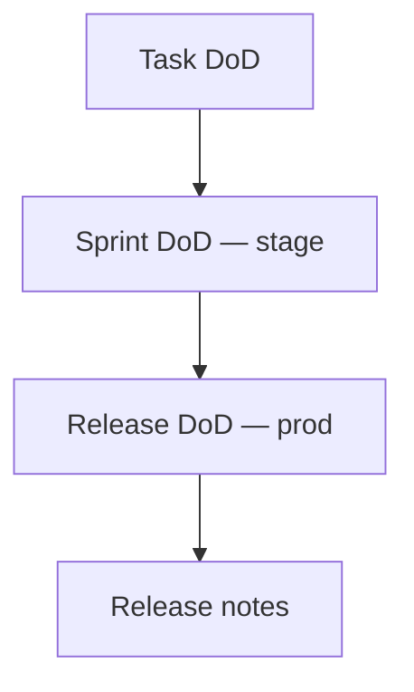
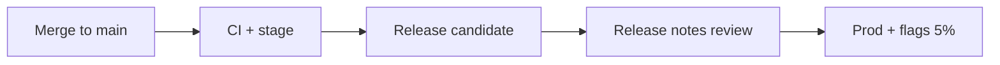

# Definition of Done и release notes

<div class="article-tags">
  <span class="tag tag-required">ОБЯЗАТЕЛЬНО</span>
  <span class="tag tag-beginner">ДЛЯ НОВИЧКОВ</span>
</div>

<span class="complexity-badge">Разработчику</span>
<span class="complexity-badge">QA</span>

---

## Definition of Done (DoD)

Definition of Done представляет собой формализованный набор критериев, которые должны быть полностью удовлетворены для того, чтобы результат работы над задачей, пользовательской историей или функциональностью считался завершённым и готовым к передаче заказчику или выпуску в производственную среду. Этот документ служит единым стандартом качества для всей команды разработки и включает в себя требования к тестированию, документации, ревью кода, интеграции, безопасности и производительности, обеспечивая предсказуемость процесса поставки программного продукта.

Done - это состояние готовности, которое обозначает, что конкретная единица работы полностью соответствует всем заранее определённым критериям качества, прошла все необходимые проверки, включая модульное и интеграционное тестирование, получила одобрение в ходе код-ревью, успешно интегрирована в основную ветку репозитория и может быть развёрнута в целевой среде без дополнительных доработок или исправлений.

**DoD** (Definition of Done) — согласованный список критериев, при которых инкремент считается **готовым**: задачу можно закрыть, показать на demo, включить в релиз или отдать пользователям.

Критерий представляет собой измеримое и проверяемое условие, которое используется для оценки соответствия результата работы установленным требованиям, стандартам качества или ожиданиям заинтересованных сторон, при этом каждый критерий должен быть однозначным, объективным и поддающимся верификации в ходе тестирования или аудита.

Инкремент продукта в методологиях гибкой разработки обозначает конкретный, осязаемый результат работы команды за определённый итерационный период, который добавляет новую функциональность или улучшает существующие возможности продукта, при этом каждый инкремент должен быть полностью протестирован, интегрирован и потенциально готов к выпуску, независимо от того, будет ли он немедленно доставлен пользователям или включён в более крупный релиз в будущем.

Демонстрация представляет собой формализованное мероприятие в рамках итеративного процесса разработки, на котором команда разработки показывает заинтересованным сторонам работающую функциональность, реализованную за прошедший период, с целью получения обратной связи, подтверждения соответствия ожиданиям бизнеса и прозрачности процесса создания продукта, при этом демонстрация фокусируется на пользовательских сценариях и видимых результатах, а не на технических деталях реализации.

DoD отвечает на вопрос: **можно ли считать работу завершённой без сюрпризов на prod?**

Без DoD:

- "Done" значит "код написан", но без тестов и stage;
- [release notes](#release-notes) пишут в последний час;
- support узнаёт об изменении от пользователей;
- rollback — panicked hotfix.

Откат (rollback) представляет собой процедурный механизм возврата программного обеспечения или инфраструктуры к предыдущей стабильной версии в случае обнаружения критических дефектов, несовместимости или деградации производительности после развёртывания новых изменений, при этом процесс отката должен быть заранее спланирован, протестирован и документирован для минимизации времени простоя и потери данных.

Экстренное исправление (panicked hotfix) в условиях паники обозначает срочное внесение изменений в производственную среду для устранения критической уязвимости или сбоя, влияющего на доступность или безопасность системы, при этом такой подход часто сопряжён с повышенными рисками из-за сокращённого цикла тестирования и может приводить к возникновению дополнительных дефектов, если не сопровождается последующим рефакторингом и интеграцией в основной поток разработки.

DoD **enforced** в CI и [code review](/encyclopedia/7-project/7-10-kultura-koda/intro), не только на плакате ([FAQ методологии](/encyclopedia/7-project/7-03-metodologiya-i-zhiznennyy-tsikl-po/998)).

См. [DoR — старт задачи](./1), [Scrum DoD](/encyclopedia/7-project/7-14-scrum/5), [тестирование](/encyclopedia/7-project/7-05-testirovanie/intro).

<div class="callout callout--info">
  <div class="callout-title">DoD — для всей команды</div>
  <div class="callout-body">
  QA не "доделывает за dev". DoD описывает общий барьер качества до статуса Done. Если пункт систематически пропускается — меняют процесс или DoD на retro, а не обходят молча.
  </div>
</div>

---

## DoR и DoD

Definition of Ready представляет собой набор предварительных условий, которые должны быть выполнены до начала активной работы над задачей, включая наличие чётких требований, критериев приёмки, необходимых ресурсов, зависимостей и понимания объёма работ, что позволяет команде избежать простоев, недопонимания и переделок в процессе реализации.

| | DoR | DoD |
|---|-----|-----|
| Вопрос | Можно **начать**? | Можно **закрыть**? |
| Где | [Глава 1](./1) | Эта глава |

---

## Уровни DoD

DoD часто **многоуровневый**:

| Уровень | Область | Примеры критериев |
|---------|---------|-------------------|
| **Задача / PR** | Одна фича или fix | Code review, unit tests, lint |
| **Спринт / инкремент** | Набор задач на demo | Deploy на stage, demo пройдено |
| **Релиз** | Prod | Мониторинг, rollback plan, release notes, флаги |

Задача может быть Done на уровне PR, но релиз — только когда выполнен **релизный** DoD.



Задача в контексте управления проектами разработки программного обеспечения обозначает атомарную единицу работы, которая имеет чётко определённую цель, критерии завершения, оценку трудоёмкости и назначенного исполнителя, при этом задачи могут относиться к различным категориям, включая разработку новой функциональности, исправление дефектов, техническое улучшение или исследовательскую работу.

Запрос на слияние (PR) представляет собой механизм контроля качества в системах управления версиями, посредством которого разработчик предлагает внести изменения из своей ветки в основную кодовую базу, инициируя процесс ревью кода, автоматизированного тестирования и обсуждения архитектурных решений перед финальной интеграцией, что обеспечивает прозрачность изменений и коллективную ответственность за качество кода.

Спринт представляет собой фиксированный по продолжительности итерационный цикл в методологии Scrum, в течение которого команда разработки выполняет заранее согласованный объём работы из бэклога продукта, при этом длительность спринта обычно составляет от одной до четырёх недель и остаётся неизменной на протяжении всего проекта для обеспечения предсказуемости темпа работы и регулярности поставки ценности.

Релиз обозначает официальную версию программного продукта, которая проходит все этапы контроля качества, документирования и подготовки к развёртыванию в целевой среде, при этом релиз может включать новую функциональность, исправления дефектов, обновления безопасности или комбинацию перечисленного, и сопровождается версионированием, примечаниями к выпуску и процедурой развёртывания.

---

## DoD для веб-фичи

Веб-фича представляет собой функциональную единицу веб-приложения, которая реализует конкретный пользовательский сценарий или бизнес-требование через взаимодействие клиентской и серверной частей, включая интерфейсные компоненты, API-эндпоинты, логику обработки данных и интеграцию с внешними сервисами, при этом разработка веб-фичи требует координации между фронтенд- и бэкенд-разработчиками, тестировщиками и дизайнерами.

Пример команды (SPA + REST API):

### Код и review

Ревью представляет собой структурированный процесс экспертной оценки артефактов разработки, включая исходный код, архитектурные решения, документацию или тестовые сценарии, с целью выявления дефектов, обеспечения соответствия стандартам качества, обмена знаниями внутри команды и предотвращения накопления технического долга, при этом эффективное ревью фокусируется на конструктивной обратной связи и обучении, а не на поиске виновных.

Известные проблемы приоритетов P1 и P2 обозначают зафиксированные дефекты или ограничения системы, которые классифицированы по степени влияния на бизнес-процессы и пользовательский опыт, где P1 представляет критические проблемы, требующие немедленного устранения из-за полной недоступности функциональности или потери данных, а P2 обозначает высокоприоритетные проблемы, существенно влияющие на производительность или удобство использования, но допускающие краткосрочное существование при наличии обходных путей.

Раскрытие использования искусственного интеллекта представляет собой этическую и регуляторную практику информирования пользователей о том, что конкретный контент, рекомендация или решение были сгенерированы или существенно дополнены алгоритмами машинного обучения, с целью обеспечения прозрачности, доверия и возможности осознанного взаимодействия с цифровыми продуктами.

- [ ] Код в `main` через **PR** с ≥1 approve (2 для auth/PII).
- [ ] Нет known **P1/P2** по этой фиче в трекере.
- [ ] [AI disclosure](/encyclopedia/7-project/7-24-ii-v-proektnom-protsesse/1) в PR, если использовался Copilot.

### Тесты и CI

Основной сценарий (Happy path) использования обозначает идеализированную последовательность действий пользователя или системы, при которой все входные данные корректны, внешние зависимости доступны, ошибки не возникают и процесс завершается успешным достижением поставленной цели, при этом тестирование по основному сценарию служит базой для валидации функциональности перед переходом к обработке граничных случаев и исключительных ситуаций.

- [ ] **Unit** и **integration** тесты зелёные в CI.
- [ ] Покрыты **AC** из тикета ([DoR](./1)).
- [ ] E2E на критичный happy path (если есть в проекте).

### Среды

Подтверждение принятия (sign-off) представляет собой формальный акт согласования и утверждения результата работы заинтересованными сторонами, включая заказчика, продукт-менеджера или руководителя проекта, который свидетельствует о том, что поставленный инкремент соответствует согласованным требованиям, критериям качества и готов к переходу на следующий этап жизненного цикла или выпуску в производственную среду.

Самопроверка (self-check) обозначает процедуру предварительной верификации разработчиком собственного результата работы перед передачей его на ревью или тестирование, включающая локальный запуск тестов, проверку соответствия стандартам кодирования, валидацию функциональности по критериям приёмки и документирование изменений, что позволяет снизить количество итераций ревью и ускорить процесс интеграции.

Статус доступности системы (up/down) обозначает текущее состояние работоспособности сервиса или компонента инфраструктуры, где «up» свидетельствует о нормальном функционировании и способности обрабатывать запросы, а «down» указывает на недоступность из-за сбоя, технического обслуживания или планового отключения, при этом мониторинг этих статусов является критически важным для обеспечения SLA и оперативного реагирования на инциденты.

Однонаправленный поток данных или событий (one-way) обозначает архитектурный паттерн, при котором информация передаётся исключительно в одном направлении от источника к получателю без механизма подтверждения доставки или обратной связи, что упрощает реализацию и повышает производительность в сценариях, где потеря отдельных сообщений допустима или компенсируется другими механизмами надёжности.

- [ ] Задеплоено на **stage**, QA sign-off или self-check по чек-листу.
- [ ] **Миграции БД** применимы up/down или документирован one-way.
- [ ] Feature за **флагом** off в prod, если крупная фича ([глава 3](./3)).

### Документация

Примечания к выпуску (Release notes) представляют собой структурированный документ, сопровождающий новую версию программного продукта и содержащий информацию о добавленной функциональности, исправленных дефектах, известных ограничениях, инструкциях по обновлению и изменениях в API, предназначенный для различных аудиторий, включая конечных пользователей, технических специалистов и руководителей, с целью обеспечения прозрачности изменений и минимизации рисков при развёртывании.

Интернационализация (i18n) представляет собой процесс проектирования и разработки программного обеспечения с учётом возможности адаптации к различным языкам, региональным стандартам и культурным особенностям без необходимости внесения изменений в исходный код, включая вынос пользовательских строк во внешние ресурсы, поддержку различных форматов дат, чисел и валют, а также обеспечение корректной обработки текстов в кодировках Unicode.

Пользовательский интерфейс (user-facing) обозначает компоненты программного продукта, с которыми непосредственно взаимодействует конечный пользователь, включая визуальные элементы, тексты сообщений, формы ввода и навигационные структуры, при этом качество пользовательского интерфейса напрямую влияет на восприятие продукта, удобство использования и удовлетворённость клиентов.

Жёстко закодированные строки интерфейса (Hardcoded UI strings) представляют собой текстовые значения, встроенные непосредственно в исходный код приложения вместо выноса во внешние ресурсы локализации, что создаёт препятствия для интернационализации, усложняет поддержку и обновление контента, а также нарушает принципы разделения логики и представления в архитектуре приложения.

- [ ] **API** (OpenAPI) и wiki обновлены.
- [ ] **Release notes** черновик, если user-facing.
- [ ] i18n ключи добавлены, нет hardcoded UI strings.

### Наблюдаемость

Рабочий поток (flow) обозначает последовательность этапов, через которые проходит задача или артефакт в процессе разработки, включая создание, реализацию, тестирование, ревью и интеграцию, при этом оптимизация потока направлена на минимизацию времени цикла, устранение узких мест и обеспечение непрерывной поставки ценности.

Дежурство (on-call) представляет собой режим оперативной готовности специалиста или команды к реагированию на инциденты, сбои или запросы поддержки в нерабочее время или в периоды повышенной нагрузки, при этом эффективная организация дежурства включает чёткие процедуры эскалации, документированные runbooks, инструменты мониторинга и баланс между доступностью и предотвращением выгорания сотрудников.

- [ ] Логи и **метрики** для нового flow (latency, errors).
- [ ] Алерты не сломаны; новые — согласованы с on-call.

---

## DoD для mobile (iOS / Android)

Критерии завершения для мобильных платформ представляют собой специализированный набор требований, учитывающих особенности экосистем iOS и Android, включая прохождение ревью в App Store или Google Play, совместимость с различными версиями операционных систем и размерами экранов, оптимизацию потребления ресурсов, обработку прерываний и фоновой работы, а также соблюдение гайдлайнов дизайна и безопасности, специфичных для каждой платформы.

Mobile добавляет **store**, **версии OS**, **offline** и долгий review в сторах.

### Общее с web

- PR, review, CI (unit + UI tests где есть).
- AC покрыты, stage/testflight/internal track.

### Специфика mobile

| Пункт | iOS | Android |
|-------|-----|---------|
| Мин. версия OS | В AC / Info.plist | minSdk в gradle |
| Store assets | Screenshots если UI менялся | То же |
| Push / permissions | Тексты permission strings | Runtime permissions |
| Offline | Кэш и сообщения об ошибке | То же |
| Rollback | Feature flag **критичен** — store rollback медленный | То же |
| Analytics | Events в [аналитике](/encyclopedia/7-project/7-04-analitika/1123) | То же |

**DoD релиза mobile:** часто = "код в main + flag off" **и** отдельный DoD "включено 100% пользователей" после gradual rollout.

<div class="callout callout--caution">
  <div class="callout-title">Store review ≠ ваш DoD</div>
  <div class="callout-body">
  Одобрение App Store / Google Play — внешний gate. Внутренний DoD выполняется <strong>до</strong> отправки билда в store.
  </div>
</div>

---

## DoD для bugfix и hotfix

Исправление дефекта и экстренное исправление представляют собой два типа задач по устранению проблем в программном обеспечении, где bugfix относится к плановому исправлению ошибок, обнаруженных в ходе тестирования или эксплуатации и включаемых в ближайший релиз согласно приоритету, а hotfix обозначает срочное вмешательство в производственную среду для устранения критической уязвимости или сбоя, требующего обхода стандартного цикла разработки и выпуска.

| Тип | DoD (минимум) |
|-----|----------------|
| **Обычный bug** | STR в тикете, regression test, stage verify |
| **Hotfix prod** | Post-facto review ≤24 ч, RCA ticket, release notes "исправлено" |
| **Security** | Security review, нет disclosure details в публичных notes |

[Инциденты](/encyclopedia/7-project/7-21-incidenty-i-ekspluatatsiya/1).

---

## Enforcement DoD

Принудительное соблюдение критериев завершения обозначает механизмы автоматизированного контроля и блокировки перехода задачи в статус «готово» до тех пор, пока не будут выполнены все пункты Definition of Done, включая интеграцию с системами непрерывной интеграции, обязательное прохождение тестов, наличие документации и подтверждение ревью, что обеспечивает дисциплину качества и предотвращает накопление технического долга.

DoD на wiki без проверки бесполезен:

| Механизм | Что блокирует |
|----------|---------------|
| **CI** | Merge без green tests/lint |
| **Branch protection** | Merge без approve |
| **Workflow** | Done только из "QA Passed" |
| **Release checklist** | Prod deploy без release notes link |

Команда на retro: какой пункт DoD **чаще всего нарушают** — усилить gate или упростить DoD.

---

## Release notes

**Release notes** — текст о том, **что изменилось** для пользователей, support и эксплуатации. Это не git log и не список PR.

### Аудитории

| Аудитория | Стиль | Пример содержания |
|-----------|-------|-------------------|
| **Конечный пользователь** | Без жаргона, ценность | "Теперь можно оплатить картой в один клик" |
| **Support L1** | Симптомы, обходы | "Если кнопка серая — проверьте email" |
| **Admin / DevOps** | Downtime, конфиги, флаги | "Миграция 042, 5 мин read-only" |
| **API потребители** | Breaking changes | "Поле `total` deprecated → `amount`" |

### Структура release notes

1. **Версия и дата** (и TZ/UTC для глобальных продуктов)
2. **Новое** — ценность, не названия классов
3. **Исправлено** — что перестало ломаться
4. **Изменено / breaking** — миграции, API, поведение
5. **Известные ограничения** — честно о багах не P1
6. **Для админов** — downtime, feature flags, конфиги

Хранение: wiki, `CHANGELOG.md`, in-app "Что нового", email — по продукту ([техписьмо](/encyclopedia/7-project/7-08-tehnicheskoe-pismo/intro)).

---

## Пример release notes (user-facing)

```markdown
# ShopFlow 2.14.0 — 2026-06-20

## Новое
- Быстрая оплата сохранённой картой на экране заказа.
- Уведомление о статусе доставки в push (можно отключить в Настройках).

## Исправлено
- Корзина не обнулялась после успешного заказа (тикет #8842).
- Краш приложения при повороте экрана на Android 14.

## Изменено
- Минимальная версия iOS — 16.0 (Apple API для Wallet).

## Известные ограничения
- Быстрая оплата недоступна для B2B-аккаунтов — будет в 2.15.

## Для администраторов
- Feature flag `checkout_one_tap` — по умолчанию **off**; включение по сегментам в LaunchDarkly.
- Миграция БД `20260620_cards` — окно 02:00–02:05 UTC, read-only 2 мин.
```

---

## Пример release notes (internal / DevOps)

```markdown
# Release 2.14.0 — internal

## Deploy
- Helm chart app 2.14.0, image tag `v2.14.0`
- Env: `FEATURE_CHECKOUT_ONE_TAP` deprecated → LaunchDarkly flag `checkout_one_tap`

## Rollback
1. Kill switch: LD flag off
2. Helm rollback chart 2.13.x
3. DB migration irreversible — см. runbook RB-042

## Monitoring
- Dashboard: Checkout / OneTap latency p95
- Alert: error rate > 1% 5m → P2 on-call
```

---

## Кто пишет release notes

| Роль | Вклад |
|------|--------|
| **PO/PM** | Ценность, формулировки для пользователя |
| **Dev** | Breaking changes, техдетали, флаги |
| **QA** | Список verified fixes, known issues |
| **Техпис** | Редактура, единый tone of voice |
| **Support** | Review на понятность L1 |

Процесс: черновик в тикете релиза **за 2–3 дня** до prod, финал после stage sign-off.

[ИИ](/encyclopedia/7-project/7-24-ii-v-proektnom-protsesse/1) может набросить черновик — **факт-чек** обязателен.

---

## Release notes и feature flags

Часть фич публикуется **выключенной** в prod:

- в release notes: "доступно за флагом `checkout_one_tap`, поэтапное включение";
- support знает, почему у части пользователей кнопки нет.

Подробно — [Feature flags](./3).

---

## Release notes и [удалёнка](/encyclopedia/7-project/7-23-udalennaya-komanda/1)

Demo live не все видят. **Release notes + запись demo** — async-канал для EU/RU команды и support.

---

## Связь с change management

Крупный релиз в regulated среде — [change request](/encyclopedia/7-project/7-22-upravlenie-izmeneniyami/1), CAB, окно. Release notes — приложение к change ticket.

---

## Антиpatterns release notes

| Плохо | Хорошо |
|-------|--------|
| "Misc fixes" | Конкретные симптомы |
| Копипаста commit messages | Перевод на язык пользователя |
| Нет breaking | Явный блок "Изменено" |
| Notes после prod | Черновик до deploy |

---

## DoD для API-only и backend-сервисов

| Пункт | Детали |
|-------|--------|
| OpenAPI / protobuf | Версия и changelog |
| Contract tests | Consumer-driven при необходимости |
| Backward compatibility | Deprecation policy |
| Rate limits | Документированы |
| Stage load smoke | p95 latency baseline |

---

## DoD для data / ML pipeline

- [ ] Schema registry / migration;
- [ ] Data quality checks (null rate, duplicates);
- [ ] Rollback dataset version;
- [ ] PII masking в логах ([ИБ](/encyclopedia/8-infra-security/8-07-informatsionnaya-bezopasnost/intro));
- [ ] [ИИ-модели](/encyclopedia/6-ai/6-05-razrabotka-ii/intro): bias check по политике продукта.

---

## Release train и cadence

| Модель | Release notes | DoD релиза |
|--------|---------------|------------|
| **Continuous** (daily) | Автогeneration + edit | Automated + spot check |
| **Weekly** | Единый doc версии | Полный checklist |
| **Bi-weekly sprint** | После demo | CAB если нужно |



---

## Локализация release notes

Продукт RU + EU:

| Язык | Канал |
|------|-------|
| RU | In-app, email RU сегмент |
| EN | Global changelog |
| Internal | Один bilingual doc или два linked |

Термины — [глоссарий](/encyclopedia/7-project/7-04-analitika/1231).

---

## Release notes для hotfix

Минимальный шаблон P1:

```markdown
# Hotfix 2.13.1 — 2026-06-16

**Причина:** инцидент INC-442 — 500 на login после deploy 2.13.0

**Исправлено:** null pointer при пустом refresh token

**Действия пользователей:** не требуются, перelogin не нужен

**Для DevOps:** deploy image v2.13.1; flag unchanged
```

Post-mortem — отдельный doc ([инциденты](/encyclopedia/7-project/7-21-incidenty-i-ekspluatatsiya/1)).

---

## Сравнение DoD web и mobile (сводная)

| Критерий | Web | Mobile |
|----------|-----|--------|
| Deploy speed | Минуты | Store: дни |
| Rollback | Redeploy / flag | **Flag critical** |
| E2E | Browser | Device farm |
| Permissions | N/A often | OS strings |
| Version skew | One tab | N old app versions |

---

## Workshop DoD за 90 минут

1. Список текущих "done means" от команды.
2. Группировка: task / sprint / release.
3. Что **автоматизировать** в CI первым.
4. Шаблон release notes — один пример.
5. Owner wiki + review через 6 недель.

---

## DoD checklist — copy-paste

```markdown
## Team DoD — Web feature
- PR merged, CI green, ≥1 approve
- AC verified on stage
- Tests cover AC; no P1/P2 open
- API/wiki updated
- Metrics/logs added
- Release notes draft if user-facing
- Feature flag off in prod if gradual rollout

## Team DoD — Mobile
+ TestFlight/Internal track verified
+ min OS documented
+ Store texts if permissions changed
```

---

## Итоги раздела

**DoD** — общий барьер "готово к релизу". **Release notes** — мост к пользователям и support. Для web и mobile DoD **различается**; mobile опирается на [feature flags](./3) сильнее из-за store latency.

[Feature flags](./3) · [Итоги](./998) · [Чек-лист](./999)

---
