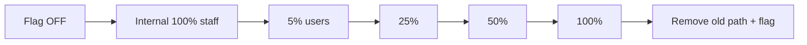
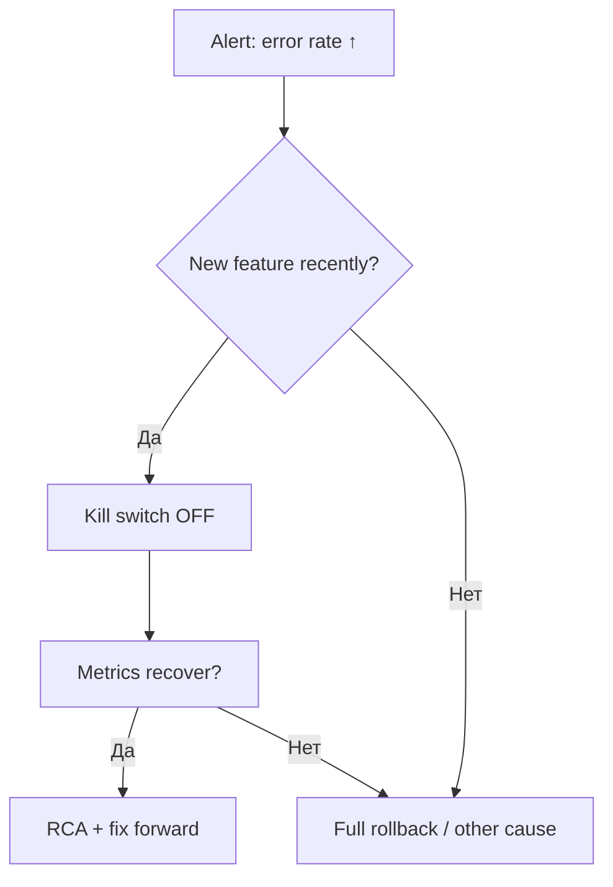

import ExternalPlayEmbed from '@site/src/components/ExternalPlayEmbed';

# Feature flags — постепенный выкат и kill switch

<div class="article-tags">
  <span class="tag tag-required">ОБЯЗАТЕЛЬНО</span>
  <span class="tag tag-beginner">ДЛЯ НОВИЧКОВ</span>
</div>

<span class="complexity-badge">Разработчику</span>
<span class="complexity-badge">Архитектору</span>

---

## Feature flags — что это

**Feature flag** (feature toggle) — переключатель поведения приложения **без** полного redeploy (или с минимальным изменением конфигурации). Код новой фичи уже в **main** и на prod, но **выключен** для пользователей, пока команда не включит флаг. Связь с [DoD](./2) и [релизом](/encyclopedia/7-project/7-22-upravlenie-izmeneniyami/1):

| Проблема без флагов | Решение с флагами |
|---------------------|-------------------|
| Big bang — все сразу на новом checkout | **Gradual rollout** 5% → 50% → 100% |
| Баг на prod — hotfix redeploy 40 мин | **Kill switch** — off за секунды |
| Long-lived branch месяцами | Код в main за флагом **off** |
| A/B два UI | **Experiment** flag по сегменту |

[YAGNI](/encyclopedia/7-project/7-10-kultura-koda/10) · [легаси / модернизация](/encyclopedia/7-project/7-11-legasi-kod/4).

<ExternalPlayEmbed example="project/feature-flag-rollout-play" title="Feature flags и gradual rollout" minHeight={460} />

<div class="callout callout--tip">
  <div class="callout-title">Флаг — не костыль навсегда</div>
  <div class="callout-body">
  У каждого release-флага должна быть <strong>дата снятия</strong>: после 100% rollout удалить старый путь и if-ветку. Иначе — flag debt и if-hell.
  </div>
</div>

---

## Gradual rollout

**Gradual rollout** (постепенный выкат) — включение фичи для **растущей доли** пользователей или серверов:

1. **Internal** — только сотрудники (dogfood).
2. **5%** — canary, смотрим метрики и ошибки.
3. **25% → 50%** — если SLO в норме.
4. **100%** — полный rollout, план удаления старого кода.



Метрики: error rate, latency p95, conversion ([аналитика](/encyclopedia/7-project/7-04-analitika/1123)). Rollback на предыдущий % — без отката бинарника.

---

## Kill switch

**Kill switch** — оперативное **выключение** фичи при [инциденте](/encyclopedia/7-project/7-21-incidenty-i-ekspluatatsiya/1):

- checkout падает с 500 — flag off, пользователи на старый flow;
- тяжёлый отчёт кладёт БД — ops-flag off;
- интеграция партнёра недоступна — отключить новый канал.

**Runbook P1** часто начинается: "1) Kill switch `feature_x` in LaunchDarkly. 2) Подтвердить метрики. 3) RCA."

Kill switch должен быть:

- **быстрым** (секунды, не redeploy);
- **документированным** в wiki и [release notes](./2);
- **протестированным** на stage ("fire drill").

<div class="callout callout--caution">
  <div class="callout-title">Kill switch не заменяет мониторинг</div>
  <div class="callout-body">
  Флаг спасает пользователей, пока вы чините код. Без алертов вы узнаете о проблеме поздно — включите метрики до 5% rollout.
  </div>
</div>

---

## Типы feature flags

| Тип | Пример | Срок жизни |
|-----|--------|------------|
| **Release** | Новый checkout | Удалить после 100% |
| **Ops** | Тяжёлый nightly report | Долго, пока не оптимизируют |
| **Permission** | Beta для enterprise-клиентов | До GA или сегмента |
| **Experiment** | Два варианта CTA | До решения PO по A/B |
| **Kill switch** | Новая payment provider | Пока риск интеграции |

Не смешивайте типы в одном флаге `flag1` — разные политики rollout и владельцы.

---

## Именование и lifecycle

1. **Именование** — `product.area.feature`, например `shop.checkout.one_tap`, не `newCheckout`.
2. **Owner** — PO или dev в wiki-реестре флагов.
3. **Created / target removal** — даты в тикете.
4. **Default** — prod **off** для release flags до PO approval.
5. **Аудит** — кто включил 100% в prod ([change](/encyclopedia/7-project/7-22-upravlenie-izmeneniyami/1)).

---

## Реализация в коде

Минимальный паттерн (псевдокод):

```javascript
if (featureFlags.isEnabled('shop.checkout.one_tap', user)) {
  return renderOneTapCheckout(cart);
}
return renderLegacyCheckout(cart);
```

Правила:

- **Не ветвить всё** — if-hell; изолируйте стратегию (Strategy / отдельный модуль).
- **Fallback** при недоступности сервиса флагов — безопасный default (обычно **off**).
- **Не** прятать security checks за флагом без review.
- Удалять **мертвую** ветку после rollout — пункт DoD.

---

## LaunchDarkly — пример платформы

**LaunchDarkly** (LD) — коммерческая платформа feature flags с UI, targeting, audit log, интеграциями. Open-source альтернативы: **Unleash**, **Flagsmith**, **GrowthBook** (experiments).

### Основные концепции LD

| Концепция | Описание |
|-----------|----------|
| **Project / Environment** | dev, stage, prod — разные ключи SDK |
| **Flag** | Boolean, string, JSON |
| **Targeting** | По user key, segment, geo, % rollout |
| **Variation** | true/false или multivariate |
| **Audit log** | Кто изменил правило |

### Пример сценария ShopFlow

1. Dev создаёт flag `checkout_one_tap` — **off** в prod.
2. Deploy 2.14.0 — код на prod, флаг off — пользователи на legacy.
3. PO включает **true** для segment `employees` — dogfood.
4. Rollout **5%** anonymous + мониторинг dashboard.
5. 50% → 100% за неделю.
6. Тикет: удалить legacy checkout + flag в 2.16.0.

### SDK (упрощённо)

```javascript
import * as LD from '@launchdarkly/node-server-sdk';

const client = LD.init(process.env.LD_SDK_KEY);
await client.waitForInitialization();

const context = { kind: 'user', key: user.id, email: user.email };
const showOneTap = await client.variation('checkout_one_tap', context, false);
```

Кontext attributes — для targeting (страна, plan). **Не** кладите секреты в context.

### LaunchDarkly и [DoD](./2)

DoD крупной фичи может включать:

- [ ] Flag создан в LD prod, default **off**
- [ ] Runbook kill switch в wiki
- [ ] Dashboard/alerts подключены
- [ ] Release notes упоминают флаг и gradual plan
- [ ] Stage fire drill: off → пользователь на legacy ≤ 1 мин

---

## Другие способы хранения флагов

| Подход | Когда |
|--------|-------|
| **LaunchDarkly / Unleash** | Prod, gradual, audit |
| **ConfigMap / K8s** | Ops toggles, infra |
| **Env var `% rollout`** | MVP, прототип (осторожно) |
| **DB table** | Простой admin UI, нужен audit |

Для **гос/регуляторного** контура — трассируемость изменений ([change](/encyclopedia/7-project/7-22-upravlenie-izmeneniyami/1)), on-prem Unleash.

---

## Feature flags и mobile

Store release **медленный** — флаги критичны:

- билд в App Store с флагом **off**;
- включение без новой submission (remote config / LD mobile SDK);
- kill switch без ожидания review Apple/Google.

DoD mobile: см. [глава 2](./2).

---

## A/B и experiments

**Experiment** flag — две variations, метрика conversion. PO решает победителя; проигравший код **удаляют**. Не оставлять experiment 6 месяцев "на всякий случай".

[Продуктовая аналитика](/encyclopedia/7-project/7-04-analitika/1123).

---

## Feature flags и инциденты



Связь с [incident management](/encyclopedia/7-project/7-21-incidenty-i-ekspluatatsiya/1): on-call должен иметь **доступ** к LD/console и ссылку в runbook.

---

## DoR, DoD и флаги

| Фаза | Флаг |
|------|------|
| [DoR](./1) | PO описал rollout plan? |
| Разработка | Код за флагом, default off |
| [DoD](./2) | Flag in prod, runbook, metrics |
| Post-100% | Тикет на удаление flag + legacy |

---

## Антиpatterns

| Антиpattern | Последствие |
|-------------|-------------|
| 200 stale flags | if-hell, страх трогать код |
| Флаг без owner | Никто не выключает experiment |
| Default on в prod | Big bang через заднюю дверь |
| Нет fallback при падении LD | Outage флагов = outage продукта |
| Флаг для каждой мелочи | Overhead > value |

---

## Реестр флагов (wiki)

| Flag | Type | Owner | Default prod | Target removal | Runbook |
|------|------|-------|--------------|----------------|---------|
| shop.checkout.one_tap | Release | @po | off | 2026-08-01 | RB-142 |

Review реестра раз в спринт — 5 минут на retro.

---

## Связь с release notes

В [release notes](./2):

```markdown
## Новое
- Быстрая оплата — поэтапное включение (flag `checkout_one_tap`).

## Для администраторов
- Kill switch: LaunchDarkly → checkout_one_tap → off
- Текущий rollout: 25% (обновлено 2026-06-18)
```

Support не говорит "у нас баг" — "фича ещё не на вашем сегменте".

---

## LaunchDarkly: targeting и сегменты

| Механизм | Пример использования |
|----------|----------------------|
| **User key** | Beta для `user-12345` |
| **Custom attr `plan`** | enterprise и free — разные правила |
| **Geo** | RU rollout отдельно от EU |
| **Percentage rollout** | 5% anonymous |
| **Rules order** | Staff → enterprise → % |

Правило: **staff always on** для dogfood — отдельное правило выше percentage.

### Пример правил (концептуально)

1. IF segment `employees` → true
2. ELSE IF attribute `country` = DE AND `plan` = premium → 50% true
3. ELSE → false

Тестируйте rules на **stage environment** LD перед prod.

---

## Unleash и open source (кратко)

**Unleash** — self-hosted альтернатива:

- projects, environments, activation strategies;
- gradual rollout, userIds, stickiness;
- on-prem для [гос/закрытого контура](/encyclopedia/7-project/7-22-upravlenie-izmeneniyami/1);
- audit через API / logs.

Trade-off: свой ops или SaaS LD.

---

## Тестирование feature flags

| Тест | Где |
|------|-----|
| Flag off — legacy path | Unit + E2E |
| Flag on — new path | Unit + E2E |
| Flag service down — fallback | Integration |
| Kill switch drill | Stage manual + runbook |

DoD: **оба** пути зелёные в CI перед prod deploy.

---

## Flag debt — управление

Еженедельно bot или тимлид:

- флаги старше **90 дней** при 100% rollout → тикет "remove flag X";
- experiment без решения PO &gt; 30 дней → эскалация;
- count `if (flag)` в repo — trend на retro.

[YAGNI](/encyclopedia/7-project/7-10-kultura-koda/10) · [легаси](/encyclopedia/7-project/7-11-legasi-kod/4).

---

## Кейс: инцидент и kill switch (пошагово)

1. **14:02 UTC** — alert error rate checkout 8%.
2. **14:04** — on-call открывает LD, `checkout_one_tap` → **off**.
3. **14:06** — error rate 0.3%, legacy path работает.
4. **14:30** — RCA начат, тикет INC-501.
5. **16:00** — fix в main, deploy, flag on 5% internal.
6. **+48h** — gradual resume по плану.
7. **Release notes** hotfix + known issue closed.

Связь [incident](/encyclopedia/7-project/7-21-incidenty-i-ekspluatatsiya/1) · [change](/encyclopedia/7-project/7-22-upravlenie-izmeneniyami/1).

---

## Feature flags и [DoD](./2) — полная матрица

| Этап | Release flag | Ops flag | Experiment |
|------|--------------|----------|------------|
| DoR | Rollout plan? | N/A | Hypothesis + metric |
| Code | Both paths tested | Toggle documented | Variations |
| DoD | Off in prod, runbook | Alert linked | Analytics events |
| Post | Remove by date | Review quarterly | Pick winner, delete |

---

## Стоимость и лицензии

LaunchDarkly — per seat / MAU; для старта:

- оцените **MAU** и environments;
- dev/stage/prod — отдельные SDK keys;
- не шарить prod key в frontend repo — **client-side ID** только для safe flags.

---

## Чекlist перед первым 5% rollout

- [ ] Dashboard error rate и latency на legacy и new path
- [ ] Kill switch tested on stage ≤ 60 сек до legacy
- [ ] On-call имеет доступ LD и runbook URL
- [ ] Support briefed ([release notes](./2))
- [ ] PO sign-off на процент и сегмент
- [ ] Rollback не требует DB restore (или runbook DB)

---

## Итоги раздела

**Feature flags** — мост между [DoD](./2) и безопасным prod: **gradual rollout** снижает риск, **kill switch** сокращает MTTR. **LaunchDarkly** и аналоги дают targeting и audit; MVP может начать с Unleash или env, но kill switch и runbook нужны **до** 5% пользователей.

[Итоги раздела](./998) · [Чек-лист](./999)

---
