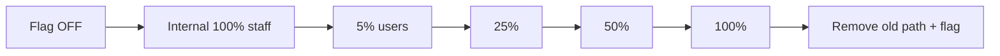
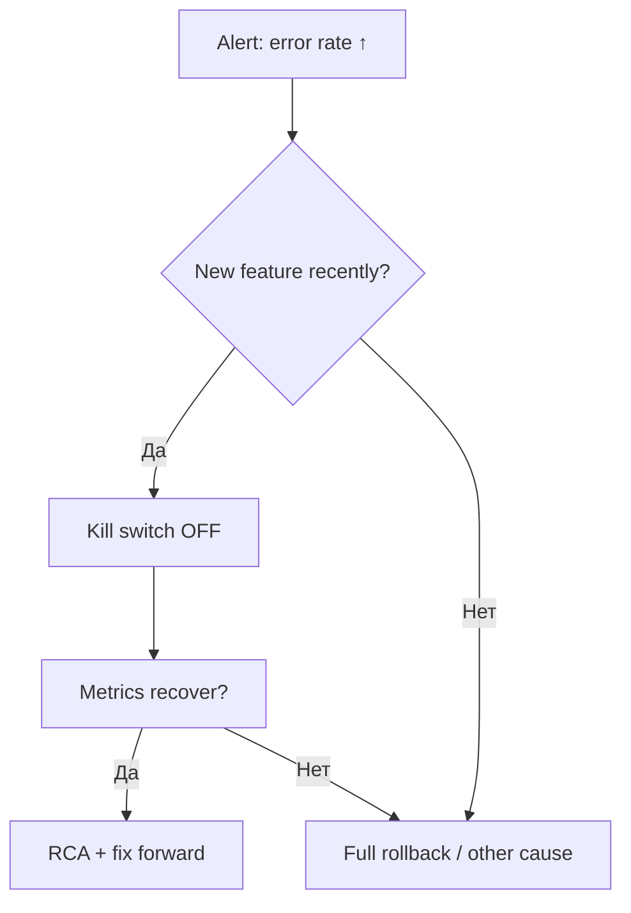

import ExternalPlayEmbed from '@site/src/components/ExternalPlayEmbed';

# Feature flags — постепенный выкат и kill switch

<div class="article-tags">
  <span class="tag tag-required">ОБЯЗАТЕЛЬНО</span>
  <span class="tag tag-beginner">ДЛЯ НОВИЧКОВ</span>
</div>

<span class="complexity-badge">Разработчику</span>
<span class="complexity-badge">Архитектору</span>

---

## Feature flags — что это

Feature flags представляют собой механизм условного включения или выключения определённой функциональности в программном обеспечении без необходимости изменения исходного кода или повторного развёртывания приложения. Данный подход позволяет разработчикам управлять доступностью функций для различных групп пользователей, проводить постепенное внедрение новых возможностей, выполнять A/B-тестирование и оперативно отключать проблемные компоненты в случае возникновения инцидентов. Техническая реализация feature flags обычно включает в себя конфигурационный слой, который проверяет состояние флага во время выполнения программы и направляет поток управления по соответствующему пути.

Feature обозначает отдельную функциональную возможность или характеристику программного продукта, которая предоставляет пользователю определённую ценность или решает конкретную задачу. В контексте разработки программного обеспечения feature представляет собой логически завершённый модуль функциональности, который может быть независимо разработан, протестирован и доставлен пользователям. Функциональные возможности обычно описываются через пользовательские истории, технические спецификации и критерии приёмки, что обеспечивает чёткое понимание ожидаемого поведения системы всеми участниками процесса разработки.

Flag в программировании представляет собой булеву переменную или конфигурационный параметр, который управляет поведением системы путём включения или выключения определённых ветвей исполнения кода. Флаги могут иметь различные уровни гранулярности: от глобальных переключателей, влияющих на всю систему, до тонко настроенных параметров, контролирующих поведение отдельных компонентов. Управление флагами осуществляется через внешние конфигурационные источники, что позволяет изменять поведение приложения в runtime без необходимости компиляции или перезапуска процесса.

**Feature flag** (feature toggle) — переключатель поведения приложения **без** полного redeploy (или с минимальным изменением конфигурации). Код новой фичи уже в **main** и на prod, но **выключен** для пользователей, пока команда не включит флаг. Связь с [DoD](./2) и [релизом](/encyclopedia/7-project/7-22-upravlenie-izmeneniyami/1):

Redeploy обозначает процесс повторного развёртывания программного обеспечения на целевой среде исполнения после внесения изменений в исходный код, конфигурацию или инфраструктурные компоненты. Данный процесс включает в себя сборку артефактов, передачу их на серверы назначения, остановку предыдущей версии приложения, установку новой версии и запуск сервисов с применением обновлённых параметров. Современные практики непрерывной доставки стремятся минимизировать необходимость redeploy за счёт использования feature flags, динамической конфигурации и архитектурных паттернов, позволяющих вносить изменения в поведение системы без перезапуска процессов.

Main представляет собой основную ветку репозитория исходного кода, которая содержит стабильную версию продукта, прошедшую все этапы тестирования и готовую к интеграции с производственной средой. Prod обозначает производственную среду исполнения, где приложение обслуживает реальных пользователей и обрабатывает бизнес-критичные данные. Разделение между main и prod обеспечивает контроль качества путём применения дополнительных проверок, утверждений и процедур развёртывания перед тем, как изменения попадут к конечным пользователям.

| Проблема без флагов | Решение с флагами |
|---------------------|-------------------|
| Big bang — все сразу на новом checkout | **Gradual rollout** 5% → 50% → 100% |
| Баг на prod — hotfix redeploy 40 мин | **Kill switch** — off за секунды |
| Long-lived branch месяцами | Код в main за флагом **off** |
| A/B два UI | **Experiment** flag по сегменту |

Big bang описывает стратегию развёртывания, при которой новая версия функциональности становится доступной всем пользователям одновременно в предопределённый момент времени. Данный подход характеризуется высоким риском, поскольку любые ошибки или непредвиденные последствия изменений немедленно затрагивают всю пользовательскую базу, что может привести к значительным бизнес-потерям. Современная инженерная практика рекомендует заменять big bang-развёртывания постепенным внедрением через feature flags, канареечные релизы и другие техники контролируемого выпуска.

Checkout в контексте систем контроля версий обозначает операцию переключения рабочей копии репозитория на определённую ветку, тег или конкретный коммит. Данная операция позволяет разработчикам изолировать изменения, работать над различными задачами параллельно и воспроизводить исторические состояния кодовой базы для отладки или анализа. В системах наподобие Git checkout также может включать обновление индекса и рабочей директории в соответствии с выбранным снимком истории проекта.

Long-lived branch обозначает ветку репозитория, которая существует в течение продолжительного периода времени и используется для разработки крупных функциональных блоков или экспериментальных инициатив, не готовых к интеграции в основную линию разработки. Длительное существование таких веток создаёт риски расхождения кодовой базы, усложнения слияния изменений и потери контекста, поэтому современная практика рекомендует минимизировать использование long-lived branches в пользу частых интеграций малых изменений через trunk-based development.

A/B тестирование представляет собой метод сравнительного анализа двух или более вариантов реализации функциональности путём случайного распределения пользователей между экспериментальными группами и измерения ключевых метрик эффективности. Данный подход позволяет принимать обоснованные решения о выборе оптимальной реализации на основе объективных данных о поведении пользователей, а не субъективных предпочтений разработчиков или дизайнеров. Техническая реализация A/B тестирования требует точного разделения трафика, консистентного назначения пользователей к группам и надёжного сбора аналитических данных.

Experiment в контексте разработки программного обеспечения обозначает структурированное исследование, направленное на проверку гипотезы о влиянии определённого изменения на пользовательский опыт или бизнес-показатели. Эксперименты обычно включают формулировку нулевой и альтернативной гипотез, определение целевых метрик, расчёт необходимого размера выборки, проведение теста и статистический анализ результатов. Корректно спроектированные эксперименты позволяют командам извлекать ценные инсайты о поведении пользователей и принимать решения о масштабировании или отказе от новых функциональных возможностей.

[YAGNI](/encyclopedia/7-project/7-10-kultura-koda/10) · [легаси / модернизация](/encyclopedia/7-project/7-11-legasi-kod/4).

<ExternalPlayEmbed example="project/feature-flag-rollout-play" title="Feature flags и gradual rollout" minHeight={460} />

<div class="callout callout--tip">
  <div class="callout-title">Флаг — не костыль навсегда</div>
  <div class="callout-body">
  У каждого release-флага должна быть <strong>дата снятия</strong>: после 100% rollout удалить старый путь и if-ветку. Иначе — flag debt и if-hell.
  </div>
</div>

Костыль в профессиональном жаргоне разработчиков обозначает временное или неоптимальное решение технической проблемы, которое обеспечивает работоспособность системы ценой снижения читаемости, поддерживаемости или производительности кода. Такие решения часто возникают под давлением сроков, при недостаточном понимании предметной области или в условиях работы с унаследованными системами, где рефакторинг представляет значительные риски. Несмотря на практическую полезность в краткосрочной перспективе, накопление костылей в кодовой базе приводит к увеличению технического долга и усложнению дальнейшей разработки.

---

## Gradual rollout

Gradual rollout представляет собой стратегию постепенного увеличения доли пользователей, получающих доступ к новой функциональности, что позволяет минимизировать риски и собирать обратную связь на ранних этапах внедрения. Данный подход обычно реализуется через процентное распределение трафика, сегментацию пользователей по атрибутам или географическим признакам, а также через поэтапное включение функций в различных подсистемах. Контролируемое развёртывание обеспечивает возможность оперативного отката изменений при обнаружении проблем и снижает нагрузку на команды поддержки за счёт ограниченного масштаба потенциальных инцидентов.

**Gradual rollout** (постепенный выкат) — включение фичи для **растущей доли** пользователей или серверов:

1. **Internal** — только сотрудники (dogfood).
2. **5%** — canary, смотрим метрики и ошибки.
3. **25% → 50%** — если SLO в норме.
4. **100%** — полный rollout, план удаления старого кода.



Метрики: error rate, latency p95, conversion ([аналитика](/encyclopedia/7-project/7-04-analitika/1123)). Rollback на предыдущий % — без отката бинарника.

Internal обозначает функциональность, инструменты или процессы, предназначенные исключительно для использования внутри организации и не доступные внешним пользователям или клиентам. Внутренние решения часто разрабатываются с меньшими требованиями к пользовательскому интерфейсу, документации и обратной совместимости, что позволяет командам быстрее итерировать и экспериментировать. Однако отсутствие внешнего давления качества может приводить к снижению надёжности и усложнению последующей адаптации таких решений для публичного использования.

Dogfooding представляет собой практику использования собственной команды разработки внутренних инструментов, сервисов или продуктов на ранних стадиях их создания для выявления проблем и улучшения пользовательского опыта. Данный подход позволяет инженерам непосредственно сталкиваться с недостатками разрабатываемых решений, что стимулирует более быстрое исправление ошибок и более глубокое понимание потребностей конечных пользователей. Термин происходит от выражения «eating your own dog food», подчёркивающего важность личного опыта использования продукта для обеспечения его качества.

SLO (Service Level Objective) представляет собой количественно выраженный целевой показатель уровня обслуживания, который определяет ожидаемое качество работы сервиса с точки зрения доступности, производительности или корректности обработки запросов. SLO обычно формулируется в терминах процентного времени доступности, максимальной задержки обработки или допустимой частоты ошибок и служит основой для принятия решений о приоритизации инженерных усилий. Достижение SLO измеряется через SLI (Service Level Indicators), а отклонения от целевых значений запускают процессы анализа инцидентов и улучшения системы.

План удаления старого кода представляет собой структурированную стратегию поэтапного вывода из эксплуатации устаревших компонентов, функций или архитектурных решений с минимизацией рисков для стабильности системы и пользовательского опыта. Данный план обычно включает инвентаризацию зависимостей, оценку влияния на смежные модули, разработку миграционных скриптов, коммуникацию с затронутыми командами и определение временных окон для каждого этапа декомиссии. Корректное управление жизненным циклом кода предотвращает накопление мёртвого кода, снижает сложность поддержки и освобождает ресурсы для разработки новых возможностей.

Старый код обозначает части программной системы, которые были разработаны значительное время назад и могут использовать устаревшие подходы, библиотеки или архитектурные паттерны, не соответствующие современным стандартам качества. Такой код часто характеризуется недостаточной документацией, сложностью модификации и отсутствием автоматизированных тестов, что увеличивает риски при внесении изменений. Управление старым кодом требует баланса между необходимостью поддержки существующей функциональности и стремлением к модернизации системы через постепенный рефакторинг или замену компонентов.

Error rate представляет собой метрику, отражающую долю запросов или операций, завершившихся с ошибкой, относительно общего объёма обработанных событий за определённый период времени. Данная метрика служит ключевым индикатором надёжности системы и используется для мониторинга качества обслуживания, обнаружения аномалий и оценки эффективности исправлений. Анализ error rate обычно проводится в разрезе типов ошибок, компонентов системы и пользовательских сценариев для точной локализации источников проблем.

Latency p95 обозначает 95-й перцентиль времени обработки запроса, что означает значение задержки, ниже которого находятся 95 процентов всех измеренных операций. Использование перцентилей вместо средних значений позволяет более точно оценивать опыт большинства пользователей, исключая влияние экстремальных выбросов на общую статистику. Мониторинг latency p95 помогает выявлять деградацию производительности, которая может быть незаметна при анализе средних показателей, но существенно влияет на восприятие качества сервиса значительной частью аудитории.

Conversion в контексте цифровых продуктов обозначает завершение пользователем целевого действия, которое представляет ценность для бизнеса, например, оформление заказа, регистрация аккаунта или подписка на услугу. Метрика конверсии измеряется как отношение количества пользователей, выполнивших целевое действие, к общему числу посетителей или участников воронки, и служит основным индикатором эффективности пользовательского опыта и маркетинговых инициатив. Оптимизация конверсии требует системного анализа поведения пользователей, тестирования гипотез и итеративного улучшения интерфейсов и процессов.

---

## Kill switch

Kill switch представляет собой механизм экстренного отключения функциональности или всей системы в случае обнаружения критических ошибок, уязвимостей безопасности или непредвиденного поведения, которое может нанести ущерб пользователям или бизнес-процессам. Данный механизм обеспечивает возможность оперативного реагирования на инциденты путём мгновенного прекращения выполнения проблемного кода без необходимости ожидания полного цикла развёртывания исправлений. Реализация kill switch обычно включает в себя централизованное управление состоянием переключателя, мониторинг его применения и автоматическое логирование всех операций активации для последующего анализа.

**Kill switch** — оперативное **выключение** фичи при [инциденте](/encyclopedia/7-project/7-21-incidenty-i-ekspluatatsiya/1):

- checkout падает с 500 — flag off, пользователи на старый flow;
- тяжёлый отчёт кладёт БД — ops-flag off;
- интеграция партнёра недоступна — отключить новый канал.

**Runbook P1** часто начинается: "1) Kill switch `feature_x` in LaunchDarkly. 2) Подтвердить метрики. 3) RCA."

Ops-flag off описывает состояние операционного флага, при котором определённая функциональность принудительно отключена на уровне инфраструктуры или конфигурации для предотвращения выполнения проблемного кода. Данный механизм позволяет командам эксплуатации оперативно реагировать на инциденты без необходимости вовлечения разработчиков или ожидания цикла развёртывания исправлений. Управление ops-флагами обычно осуществляется через централизованные панели управления с аудитом всех изменений и автоматическим уведомлением затронутых команд.

Kill switch должен быть:

- **быстрым** (секунды, не redeploy);
- **документированным** в wiki и [release notes](./2);
- **протестированным** на stage ("fire drill").

<div class="callout callout--caution">
  <div class="callout-title">Kill switch не заменяет мониторинг</div>
  <div class="callout-body">
  Флаг спасает пользователей, пока вы чините код. Без алертов вы узнаете о проблеме поздно — включите метрики до 5% rollout.
  </div>
</div>

Fire drill представляет собой процедуру экстренного реагирования на критический инцидент, которая активируется при обнаружении серьёзных проблем с доступностью, безопасностью или корректностью работы системы. Данная процедура обычно включает созыв ответственных специалистов, диагностику корневой причины, применение временных мер стабилизации и координацию коммуникации с заинтересованными сторонами. Регулярное проведение учебных fire drills позволяет командам отработать процедуры реагирования и сократить время восстановления при реальных инцидентах.

---

## Типы feature flags

| Тип | Пример | Срок жизни |
|-----|--------|------------|
| **Release** | Новый checkout | Удалить после 100% |
| **Ops** | Тяжёлый nightly report | Долго, пока не оптимизируют |
| **Permission** | Beta для enterprise-клиентов | До GA или сегмента |
| **Experiment** | Два варианта CTA | До решения PO по A/B |
| **Kill switch** | Новая payment provider | Пока риск интеграции |

Не смешивайте типы в одном флаге `flag1` — разные политики rollout и владельцы.

Ops обозначает операционную деятельность по обеспечению стабильной работы программных систем, включая мониторинг, развёртывание, масштабирование, резервное копирование и реагирование на инциденты. Современные практики DevOps стремятся объединить ответственность за разработку и эксплуатацию в рамках единых команд, что улучшает качество обратной связи и ускоряет доставку ценности пользователям. Эффективная ops-деятельность требует автоматизации рутинных задач, документирования процедур и постоянного совершенствования инструментов наблюдения за системой.

Permission представляет собой механизм контроля доступа, который определяет права пользователя или системы на выполнение определённых действий или доступ к конкретным ресурсам в рамках приложения. Реализация системы разрешений обычно включает модели ролевого доступа, атрибутивные политики или мандатные механизмы в зависимости от требований безопасности и сложности предметной области. Корректное управление разрешениями критически важно для защиты данных, соблюдения регуляторных требований и предотвращения несанкционированных операций.

---

## Именование и lifecycle

Lifecycle обозначает полный цикл существования сущности в программной системе, от момента создания через различные состояния до окончательного удаления или архивации. Понимание жизненного цикла объектов, запросов, сессий или функций позволяет проектировать более надёжные и предсказуемые системы, корректно управлять ресурсами и обрабатывать граничные условия. Моделирование lifecycle часто реализуется через конечные автоматы, события состояния или паттерны проектирования, отражающие доменную логику предметной области.

1. **Именование** — `product.area.feature`, например `shop.checkout.one_tap`, не `newCheckout`.
2. **Owner** — PO или dev в wiki-реестре флагов.
3. **Created / target removal** — даты в тикете.
4. **Default** — prod **off** для release flags до PO approval.
5. **Аудит** — кто включил 100% в prod ([change](/encyclopedia/7-project/7-22-upravlenie-izmeneniyami/1)).

Created / target removal описывает два ключевых события в жизненном цикле feature flag: момент создания флага для управления новой функциональностью и целевое время его удаления после стабилизации функции в основном коде. Чёткое определение этих точек позволяет предотвращать накопление неиспользуемых флагов, которые усложняют кодовую базу и создают риски непреднамеренной активации устаревшей логики. Управление lifecycle флагов обычно осуществляется через реестр с метаданными, включающими владельца, дату создания, условия удаления и статус миграции.

---

## Реализация в коде

Минимальный паттерн (псевдокод):

```javascript
if (featureFlags.isEnabled('shop.checkout.one_tap', user)) {
  return renderOneTapCheckout(cart);
}
return renderLegacyCheckout(cart);
```

Правила:

- **Не ветвить всё** — if-hell; изолируйте стратегию (Strategy / отдельный модуль).
- **Fallback** при недоступности сервиса флагов — безопасный default (обычно **off**).
- **Не** прятать security checks за флагом без review.
- Удалять **мертвую** ветку после rollout — пункт DoD.

If-hell представляет собой антипаттерн проектирования, при котором код содержит чрезмерно вложенные или многочисленные условные конструкции, что значительно снижает читаемость, тестируемость и поддерживаемость решения. Данная проблема часто возникает при неконтролируемом добавлении feature flags, обработке множества граничных случаев или попытках адаптации кода под различные конфигурации без применения стратегий рефакторинга. Борьба с if-hell включает использование полиморфизма, паттерна Strategy, табличных данных или конфигурационных драйверов для вынесения логики ветвления из основного потока исполнения.

Strategy паттерн представляет собой поведенческий паттерн проектирования, который определяет семейство алгоритмов, инкапсулирует каждый из них в отдельный класс и делает их взаимозаменяемыми в контексте использования. Данный подход позволяет изменять поведение объекта во время выполнения без модификации его кода, что особенно полезно при реализации feature flags, где выбор алгоритма зависит от состояния флага или атрибутов пользователя. Применение Strategy паттерна способствует соблюдению принципа открытости/закрытости, упрощает тестирование отдельных стратегий и снижает связанность компонентов системы.

Fallback обозначает резервный механизм или альтернативный путь исполнения, который активируется при невозможности использования основного функционала из-за ошибок, недоступности зависимостей или превышения лимитов ресурсов. Реализация fallback-логики повышает отказоустойчивость системы, обеспечивая деградированный, но работоспособный режим работы в условиях частичных сбоев. Корректное проектирование fallback требует определения приемлемого уровня деградации, мониторинга активаций резервных путей и планового восстановления основной функциональности после устранения причин сбоя.

Security checks представляют собой набор проверок и валидаций, направленных на предотвращение уязвимостей, несанкционированного доступа и нарушений политик безопасности в процессе разработки и эксплуатации программного обеспечения. Данные проверки могут включать статический анализ кода, сканирование зависимостей на известные уязвимости, валидацию входных данных, контроль прав доступа и аудит конфигурационных параметров. Интеграция security checks в конвейер непрерывной интеграции позволяет выявлять проблемы безопасности на ранних этапах и снижать риски компрометации системы в производственной среде.

---

## LaunchDarkly — пример платформы

LaunchDarkly представляет собой коммерческую платформу управления feature flags, которая предоставляет централизованный интерфейс для создания, настройки и мониторинга флагов, а также SDK для интеграции с приложениями на различных языках программирования. Данная платформа поддерживает таргетирование по атрибутам пользователей, постепенное развёртывание, A/B-тестирование и детальное логирование изменений, что упрощает управление функциональностью в сложных распределённых системах. Использование LaunchDarkly позволяет командам отделить процесс развёртывания кода от процесса включения функций, повышая гибкость и скорость доставки изменений.

**LaunchDarkly** (LD) — коммерческая платформа feature flags с UI, targeting, audit log, интеграциями. Open-source альтернативы: **Unleash**, **Flagsmith**, **GrowthBook** (experiments).

Unleash представляет собой open-source платформу управления feature flags с возможностью самостоятельного развёртывания или использования управляемого облачного сервиса. Данная система предоставляет API для управления флагами, клиентские SDK для популярных языков программирования, веб-интерфейс для визуализации состояния и аналитики использования, а также механизмы аудита и контроля доступа. Unleash поддерживает стратегии активации флагов на основе пользователя, процента трафика, ограничений по времени и кастомных параметров, что обеспечивает гибкость в управлении функциональностью.

Flagsmith представляет собой платформу управления feature flags и конфигурациями, которая сочетает возможности управления функциональностью с инструментами A/B-тестирования и аналитики пользовательского поведения. Данная система поддерживает многоокруженческое развёртывание, сегментацию пользователей, версионирование конфигураций и интеграцию с популярными инструментами мониторинга и аналитики. Flagsmith предоставляет как облачную версию сервиса, так и возможность самостоятельного хостинга, что позволяет организациям выбирать модель развёртывания в соответствии с требованиями безопасности и регуляторными ограничениями.

GrowthBook представляет собой open-source платформу для управления feature flags и проведения экспериментов, ориентированную на команды продуктовой разработки и аналитики. Данная система интегрирует управление флагами с инструментами статистического анализа результатов A/B-тестов, что позволяет принимать обоснованные решения о масштабировании функциональности на основе данных о пользовательском поведении. GrowthBook поддерживает декларативное описание экспериментов, автоматический расчёт статистической значимости и визуализацию результатов, упрощая процесс извлечения инсайтов из проведённых тестов.

### Основные концепции LD

| Концепция | Описание |
|-----------|----------|
| **Project / Environment** | dev, stage, prod — разные ключи SDK |
| **Flag** | Boolean, string, JSON |
| **Targeting** | По user key, segment, geo, % rollout |
| **Variation** | true/false или multivariate |
| **Audit log** | Кто изменил правило |

### Пример сценария ShopFlow

ShopFlow представляет собой условное название сквозного бизнес-процесса электронной коммерции, охватывающего этапы от просмотра каталога товаров через добавление в корзину и оформление заказа до оплаты и доставки. Данный процесс часто используется как пример при проектировании feature flags, поскольку включает множество точек принятия решений, интеграций с внешними системами и требований к надёжности. Управление функциональностью в рамках ShopFlow требует координации между фронтенд- и бэкенд-командами, учёта зависимостей между компонентами и обеспечения консистентности пользовательского опыта на всех этапах воронки.

1. Dev создаёт flag `checkout_one_tap` — **off** в prod.
2. Deploy 2.14.0 — код на prod, флаг off — пользователи на legacy.
3. PO включает **true** для segment `employees` — dogfood.
4. Rollout **5%** anonymous + мониторинг dashboard.
5. 50% → 100% за неделю.
6. Тикет: удалить legacy checkout + flag в 2.16.0.

### SDK (упрощённо)

SDK (Software Development Kit) представляет собой набор инструментов, библиотек, документации и примеров кода, который упрощает интеграцию сторонних сервисов или платформ в разрабатываемое приложение. В контексте управления feature flags SDK обычно предоставляет абстракции для проверки состояния флагов, подписки на изменения конфигурации, логирования событий и обработки ошибок. Корректное использование SDK требует понимания модели жизненного цикла клиента, стратегий кэширования и механизмов восстановления после сбоев сетевого взаимодействия с сервером управления флагами.

```javascript
import * as LD from '@launchdarkly/node-server-sdk';

const client = LD.init(process.env.LD_SDK_KEY);
await client.waitForInitialization();

const context = { kind: 'user', key: user.id, email: user.email };
const showOneTap = await client.variation('checkout_one_tap', context, false);
```

Кontext attributes — для targeting (страна, plan). **Не** кладите секреты в context.

### LaunchDarkly и [DoD](./2)

DoD крупной фичи может включать:

- [ ] Flag создан в LD prod, default **off**
- [ ] Runbook kill switch в wiki
- [ ] Dashboard/alerts подключены
- [ ] Release notes упоминают флаг и gradual plan
- [ ] Stage fire drill: off → пользователь на legacy ≤ 1 мин

---

## Другие способы хранения флагов

| Подход | Когда |
|--------|-------|
| **LaunchDarkly / Unleash** | Prod, gradual, audit |
| **ConfigMap / K8s** | Ops toggles, infra |
| **Env var `% rollout`** | MVP, прототип (осторожно) |
| **DB table** | Простой admin UI, нужен audit |

ConfigMap в экосистеме Kubernetes представляет собой объект API, который позволяет хранить конфигурационные данные в виде пар ключ-значение и передавать их контейнерам в виде переменных окружения, файлов или аргументов командной строки. Данный механизм обеспечивает отделение конфигурации от кода приложения, что упрощает управление разными окружениями, обновление параметров без пересборки образов и централизацию управления настройками. Использование ConfigMap для хранения состояний feature flags позволяет динамически изменять поведение приложений в кластере без необходимости перезапуска подов, хотя требует внимания к вопросам консистентности и распространения изменений.

K8s представляет собой сокращённое обозначение Kubernetes, открытой платформы оркестрации контейнеризированных приложений, которая автоматизирует процессы развёртывания, масштабирования и управления микросервисными архитектурами. Данная система предоставляет абстракции для описания желаемого состояния инфраструктуры, механизмы самовосстановления при сбоях, инструменты балансировки нагрузки и управления секретами. Интеграция управления feature flags с Kubernetes обычно осуществляется через Custom Resources, операторы или внешние сервисы конфигурации, что обеспечивает согласованность состояния флагов с масштабируемой природой контейнерных развёртываний.

Env var % rollout описывает технику управления постепенным развёртыванием функциональности через переменные окружения, которые определяют процент пользователей или запросов, направляемых на новую реализацию. Данный подход позволяет контролировать скорость внедрения изменений без модификации кода приложения, однако требует механизмов консистентного распределения трафика и мониторинга влияния на ключевые метрики. Реализация через переменные окружения упрощает интеграцию с существующими конвейерами развёртывания, но может создавать сложности с аудитом изменений и координацией между множеством экземпляров сервиса.

DB table в контексте управления feature flags представляет собой реляционную структуру хранения состояний флагов, правил активации, метаданных и истории изменений, которая обеспечивает персистентность и возможность сложной выборки конфигураций. Использование базы данных для хранения флагов позволяет применять транзакционные гарантии, репликацию для высокой доступности и сложные запросы для аналитики использования, однако требует внимания к вопросам производительности при частых чтениях состояний. Оптимизация доступа к таблице флагов обычно включает кэширование на уровне приложения, индексацию часто используемых полей и стратегии инвалидации кэша при обновлениях.

Для **гос/регуляторного** контура — трассируемость изменений ([change](/encyclopedia/7-project/7-22-upravlenie-izmeneniyami/1)), on-prem Unleash.

---

## Feature flags и mobile

Store release обозначает процесс публикации обновлений мобильного приложения в официальных магазинах дистрибуции, таких как Apple App Store или Google Play Store, который характеризуется дополнительными этапами модерации, сертификации и контроля качества. Данная процедура создаёт задержку между готовностью кода и его доступностью пользователям, что повышает ценность использования feature flags для управления функциональностью после установки приложения. Управление флагами в мобильных приложениях требует учёта офлайн-режима работы, ограничений на частоту обновления конфигурации и механизмов отката для случаев критических ошибок в новых версиях.

Store release **медленный** — флаги критичны:

- билд в App Store с флагом **off**;
- включение без новой submission (remote config / LD mobile SDK);
- kill switch без ожидания review Apple/Google.

DoD mobile: см. [глава 2](./2).

---

## A/B и experiments

**Experiment** flag — две variations, метрика conversion. PO решает победителя; проигравший код **удаляют**. Не оставлять experiment 6 месяцев "на всякий случай".

[Продуктовая аналитика](/encyclopedia/7-project/7-04-analitika/1123).

---

## Feature flags и инциденты



Связь с [incident management](/encyclopedia/7-project/7-21-incidenty-i-ekspluatatsiya/1): on-call должен иметь **доступ** к LD/console и ссылку в runbook.

---

## DoR, DoD и флаги

| Фаза | Флаг |
|------|------|
| [DoR](./1) | PO описал rollout plan? |
| Разработка | Код за флагом, default off |
| [DoD](./2) | Flag in prod, runbook, metrics |
| Post-100% | Тикет на удаление flag + legacy |

---

## Антиpatterns

| Антиpattern | Последствие |
|-------------|-------------|
| 200 stale flags | if-hell, страх трогать код |
| Флаг без owner | Никто не выключает experiment |
| Default on в prod | Big bang через заднюю дверь |
| Нет fallback при падении LD | Outage флагов = outage продукта |
| Флаг для каждой мелочи | Overhead > value |

---

## Реестр флагов (wiki)

| Flag | Type | Owner | Default prod | Target removal | Runbook |
|------|------|-------|--------------|----------------|---------|
| shop.checkout.one_tap | Release | @po | off | 2026-08-01 | RB-142 |

Review реестра раз в спринт — 5 минут на retro.

---

## Связь с release notes

В [release notes](./2):

```markdown
## Новое
- Быстрая оплата — поэтапное включение (flag `checkout_one_tap`).

## Для администраторов
- Kill switch: LaunchDarkly → checkout_one_tap → off
- Текущий rollout: 25% (обновлено 2026-06-18)
```

Support не говорит "у нас баг" — "фича ещё не на вашем сегменте".

---

## LaunchDarkly: targeting и сегменты

| Механизм | Пример использования |
|----------|----------------------|
| **User key** | Beta для `user-12345` |
| **Custom attr `plan`** | enterprise и free — разные правила |
| **Geo** | RU rollout отдельно от EU |
| **Percentage rollout** | 5% anonymous |
| **Rules order** | Staff → enterprise → % |

Правило: **staff always on** для dogfood — отдельное правило выше percentage.

### Пример правил (концептуально)

1. IF segment `employees` → true
2. ELSE IF attribute `country` = DE AND `plan` = premium → 50% true
3. ELSE → false

Тестируйте rules на **stage environment** LD перед prod.

---

## Unleash и open source (кратко)

**Unleash** — self-hosted альтернатива:

- projects, environments, activation strategies;
- gradual rollout, userIds, stickiness;
- on-prem для [гос/закрытого контура](/encyclopedia/7-project/7-22-upravlenie-izmeneniyami/1);
- audit через API / logs.

Trade-off: свой ops или SaaS LD.

---

## Тестирование feature flags

| Тест | Где |
|------|-----|
| Flag off — legacy path | Unit + E2E |
| Flag on — new path | Unit + E2E |
| Flag service down — fallback | Integration |
| Kill switch drill | Stage manual + runbook |

DoD: **оба** пути зелёные в CI перед prod deploy.

---

## Flag debt — управление

Flag debt представляет собой форму технического долга, возникающую при накоплении неиспользуемых, устаревших или избыточно сложных feature flags, которые усложняют кодовую базу, увеличивают поверхность тестирования и создают риски непреднамеренной активации устаревшей логики. Управление flag debt требует регулярного аудита реестра флагов, определения критериев устаревания, автоматизации процессов удаления и интеграции проверки состояния флагов в конвейеры непрерывной интеграции. Профилактика накопления flag debt достигается через установление политик жизненного цикла флагов, назначение владельцев для каждого флага и включение вопросов управления флагами в процессы ревью кода и планирования спринтов.

Еженедельно bot или тимлид:

- флаги старше **90 дней** при 100% rollout → тикет "remove flag X";
- experiment без решения PO &gt; 30 дней → эскалация;
- count `if (flag)` в repo — trend на retro.

[YAGNI](/encyclopedia/7-project/7-10-kultura-koda/10) · [легаси](/encyclopedia/7-project/7-11-legasi-kod/4).

---

## Кейс: инцидент и kill switch (пошагово)

1. **14:02 UTC** — alert error rate checkout 8%.
2. **14:04** — on-call открывает LD, `checkout_one_tap` → **off**.
3. **14:06** — error rate 0.3%, legacy path работает.
4. **14:30** — RCA начат, тикет INC-501.
5. **16:00** — fix в main, deploy, flag on 5% internal.
6. **+48h** — gradual resume по плану.
7. **Release notes** hotfix + known issue closed.

Связь [incident](/encyclopedia/7-project/7-21-incidenty-i-ekspluatatsiya/1) · [change](/encyclopedia/7-project/7-22-upravlenie-izmeneniyami/1).

---

## Feature flags и [DoD](./2) — полная матрица

| Этап | Release flag | Ops flag | Experiment |
|------|--------------|----------|------------|
| DoR | Rollout plan? | N/A | Hypothesis + metric |
| Code | Both paths tested | Toggle documented | Variations |
| DoD | Off in prod, runbook | Alert linked | Analytics events |
| Post | Remove by date | Review quarterly | Pick winner, delete |

---

## Стоимость и лицензии

LaunchDarkly — per seat / MAU; для старта:

- оцените **MAU** и environments;
- dev/stage/prod — отдельные SDK keys;
- не шарить prod key в frontend repo — **client-side ID** только для safe flags.

---

## Чекlist перед первым 5% rollout

- [ ] Dashboard error rate и latency на legacy и new path
- [ ] Kill switch tested on stage ≤ 60 сек до legacy
- [ ] On-call имеет доступ LD и runbook URL
- [ ] Support briefed ([release notes](./2))
- [ ] PO sign-off на процент и сегмент
- [ ] Rollback не требует DB restore (или runbook DB)

---

## Итоги раздела

**Feature flags** — мост между [DoD](./2) и безопасным prod: **gradual rollout** снижает риск, **kill switch** сокращает MTTR. **LaunchDarkly** и аналоги дают targeting и audit; MVP может начать с Unleash или env, но kill switch и runbook нужны **до** 5% пользователей.

[Итоги раздела](./998) · [Чек-лист](./999)

---
