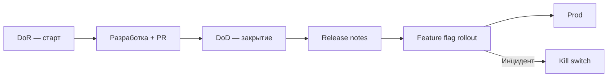

import DocCardList from '@theme/DocCardList';

# О разделе "Доставка и готовность"

Проект может иметь отличный [Scrum](/encyclopedia/7-project/7-14-scrum/intro) или [Kanban](/encyclopedia/7-project/7-18-kanban/intro), но без ясных критериев **готовности** команда тонет в переписке: задачу взяли сырыми требованиями, закрыли без тестов, пользователи узнали о релизе из Twitter.

Раздел 7.25 — про **четыре опоры доставки**:

- **DoR** (Definition of Ready) — можно ли **начать** задачу;
- **DoD** (Definition of Done) — можно ли **закрыть** и отдать в релиз;
- **Release notes** — что сказать пользователям и [support](/encyclopedia/7-project/7-16-itsm-i-it-uslugi/intro);
- **Feature flags** — **gradual rollout**, **kill switch**, выкат без big bang.

---

## Для кого раздел

| Роль | Что найдёте |
|------|-------------|
| Junior dev | Почему задачу вернули в backlog и что дописать |
| QA | DoD для тестируемости, release notes об исправлениях |
| BA / PO | DoR: AC, макеты, зависимости |
| Тимлид | Уровни DoD, CI enforcement, флаги в prod |
| DevOps | Release notes для эксплуатации, kill switch при инциденте |

  
DoR и DoD — договорённости команды

  

  Это не бюрократия из учебника. Это общий язык: "готово к работе" и "готово к релизу" означают одно и то же для всех — включая <a href="/encyclopedia/7-project/7-23-udalennaya-komanda/1">удалённую команду</a> в разных TZ.
  

---

## Маршрут по разделу

| Шаг | Материал | Содержание |
|-----|----------|------------|
| 1 | [Definition of Ready](./1) | Чек-лист DoR, Kanban, трекер, связь с аналитикой |
| 2 | [Definition of Done и release notes](./2) | DoD для web/mobile, уровни, шаблон release notes |
| 3 | [Feature flags](./3) | Gradual rollout, kill switch, LaunchDarkly, DoD |
| 4 | [Итоги](./998) · [Чек-лист](./999) | Резюме и самопроверка |

<DocCardList />

---

## DoR — preview

**Definition of Ready** — задача достаточно подготовлена, чтобы разработчик или QA **начали без недель уточнений**. Без DoR в спринт попадают "чёрные ящики" — неясные требования, нет макета, API партнёра не готов.

Типичные пункты DoR:

- описана **ценность** для пользователя;
- есть **acceptance criteria** (AC);
- известны **зависимости** (дизайн, API, доступы);
- для UI — **макет** или wireframe;
- для интеграций — контракт или sandbox.

Подробно — [глава 1](./1). Связь со [Scrum DoD](/encyclopedia/7-project/7-14-scrum/5).

---

## DoD — preview

**Definition of Done** — инкремент **готов к релизу** (или к следующему уровню). Пример для веб-фичи:

- код в main, **PR approved**;
- **тесты** зелёные в CI;
- проверено на **stage**;
- **документация** обновлена;
- **release notes** черновик (если user-facing).

DoD для **mobile** и **web** различается — [глава 2](./2). DoD **enforced** в CI и review, не на плакате ([FAQ методологии](/encyclopedia/7-project/7-03-metodologiya-i-zhiznennyy-tsikl-po/998)).

---

## Release notes — preview

**Release notes** — что **изменилось** для пользователя, support и DevOps. Структура:

1. версия и дата;
2. **новое** (ценность);
3. **исправлено**;
4. **breaking changes**;
5. известные ограничения;
6. блок для админов (downtime, флаги).

Хранение — wiki или `CHANGELOG.md` ([техписьмо](/encyclopedia/7-project/7-08-tehnicheskoe-pismo/intro)). Черновик от [ИИ](/encyclopedia/7-project/7-24-ii-v-proektnom-protsesse/1) — только с факт-чеком.

---

## Feature flags — preview

**Feature flag** — переключатель поведения **без** нового деплоя (или с минимальным):

- **gradual rollout** — 5% → 50% → 100% пользователей;
- **kill switch** — выключить фичу при [инциденте](/encyclopedia/7-project/7-21-incidenty-i-ekspluatatsiya/1);
- **A/B** — эксперименты ([аналитика](/encyclopedia/7-project/7-04-analitika/1123));
- код в **main** за флагом вместо long-lived branch ([YAGNI](/encyclopedia/7-project/7-10-kultura-koda/10)).

Инструменты: **LaunchDarkly**, Unleash, конфиг в K8s — [глава 3](./3).

---

## Связь с другими разделами

- [Трекер задач](/encyclopedia/7-project/7-09-bazy-znaniy-i-zadachniki/21) — шаблоны DoR/DoD в полях
- [Тестирование](/encyclopedia/7-project/7-05-testirovanie/intro) — часть DoD
- [Управление изменениями](/encyclopedia/7-project/7-22-upravlenie-izmeneniyami/1) — релиз в prod, CAB
- [Инциденты](/encyclopedia/7-project/7-21-incidenty-i-ekspluatatsiya/1) — kill switch первым шагом
- [Удалённая команда](/encyclopedia/7-project/7-23-udalennaya-komanda/1) — async-ready задачи через DoR

---

## Типичные симптомы без дисциплины

| Симптом | Вероятная причина |
|---------|-------------------|
| "Уточняем третью неделю" | Нет DoR / слабые AC |
| "Закрыли, но на prod не работает" | DoD без stage/prod checklist |
| Пользователи удивлены изменением UI | Нет release notes |
| Откат = hotfix ночью | Нет feature flag / kill switch |
| Velocity "скачет" | В спринт берут не-ready задачи |

---

## Как внедрять

1. Соберите текущий **устный** DoD команды — часто он уже есть, но не записан.
2. Оформите DoR/DoD на **1 страницу wiki** + поля в тикете.
3. Добавьте **1–2 пункта в CI** (тесты, lint) как hard gate.
4. Шаблон **release notes** к релизному процессу.
5. Для одной крупной фичи — пилот **feature flag** ([LaunchDarkly](./3) или open source).

  
Начните с DoR

  

  Одна команда с сильным DoR часто быстрее, чем команда с идеальным DoD, но сырым backlog. Нельзя "доделать" то, что непонятно с начала.
  

---

## Итог по разделу

**DoR**, **DoD**, **release notes** и **feature flags** — связанная система: задача входит подготовленной, выходит проверенной, пользователи информированы, prod получает изменения **постепенно** и **обратимо**.

---
