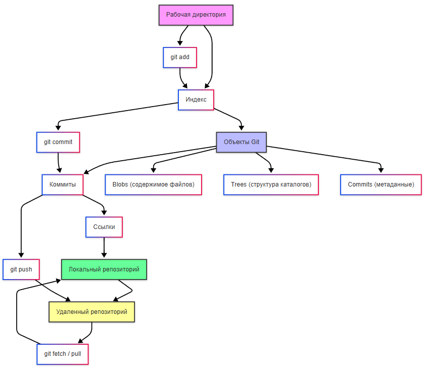
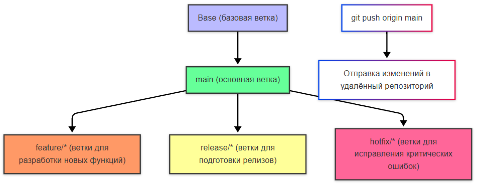
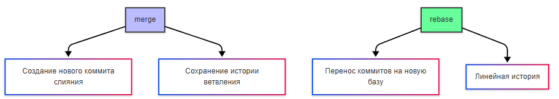
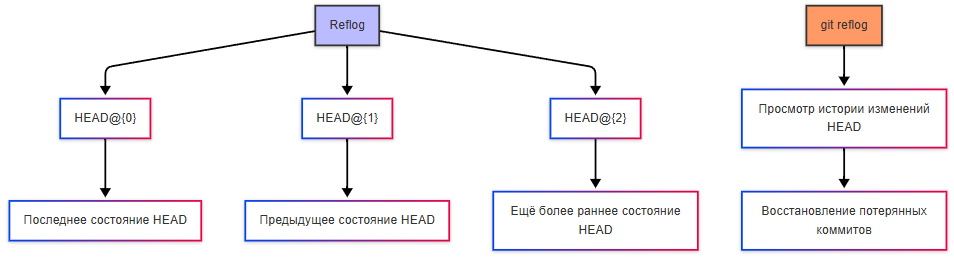

---
title: 7.03. Забота о коде и данных
---

# 7.03. Забота о коде и данных

# Раздел в разработке

## Защита кода

Когда пишется код, он должен сохраняться в локальном файле в хранилище. Однако, никто из нас не защищён от непредвиденных ситуаций:
	- Несохранённые изменения – допустим, работа велась без автосохранения, или IDE была закрыта случайно или из-за ошибки;
	- Сбой системы – отключение электричества, синий экран смерти (BSOD), зависание операционной системы;
	- Проблема с инфраструктурой – сбой сервера, проблема с диском;
	- Перезапись файлов – случайное сохранение старой версии поверх новой (к примеру, случайно скопировали некорректный текст и сохранили файл).
	- Удаление папок или файлов без возможности восстановления;
	- Ошибочная замена файлов;
	- Конфликт изменений из-за одновременной работы с файлом (когда разработчики №1 и №2 работали одновременно, будет сохранена версия последнего, без учёта первого).

Для защиты кода используется автосохранение (в первую очередь), снимки состояний, локальные истории и конечно же самое важное – VCS (version control system), система контроля версий.

**Контроль версий* – процесс обеспечения учёта вносимых изменений с возможностью отмены изменений и отката к предыдущей версии.

**Системы контроля версий** — это программное обеспечение, которое помогает вам отслеживать изменения, которые вы вносите в свой код с течением времени. Когда вы редактируете свой код, вы говорите системе контроля версий сделать снимок ваших файлов. Система контроля версий сохраняет этот снимок навсегда, чтобы вы могли вызвать его позже, если он вам понадобится. Используйте контроль версий, чтобы сохранять свою работу и координировать изменения кода в вашей команде.

★ Самая популярная система контроля версий – **Git (гит)** – децентрализованная система контроля версий с распределенной архитектурой, позволяющая каждому разработчику обладать своей локальной копией всей истории разработки.


Git использует хеши SHA-1 (алгоритм криптографического шифрования), а с 2020 года перешел на SHA-256, хеш вычисляется не только от содержимого файла, но и от метаданных (размера, типа объекта). Технологии шифрования, которые используются для идентификации подлинности объектов, позволяют эффективно сравнивать хеш-таблицы файлов и обеспечивать контроль изменений. 

Git используется через инструменты (можно назвать их Git-системами). Их можно разделить на два вида – платформы и клиенты.

Платформы позволяют использовать хостинг репозиториев.
★ **GitLab** – платформа для хостинга Git-репозиториев с расширенными возможностями (CI/CD, Issue Tracking, Wiki и прочее):
	- можно установить на свой сервер и настроить под себя;
	- встроенный CI/CD (устанавливается пайплайн);
	- Issue Tracker (трекер задач);
	- Container Registry (для Docker-образов).
★ **GitHub** – целая соцсеть, самый популярный хостинг Git-репозиториев, принадлежит Microsoft:
	- встроенный CI/CD (GitHub Actions);
	- Pull Requests (PR) – код-ревью перед слиянием;
	- GitHub Pages (хостинг статических сайтов);
	- Социальная сеть для разработчиков (именно там размещают open-source проекты).
★ Bitbucket – облачный сервис для хостинга репозиториев, созданный компанией Atlassian:
	- ограниченная бесплатная версия (до 5 пользователей);
	- интеграция с проектами Atlassian (Confluence (документация), Jira (привязка коммитов к задачам), Trello (управление задачами));
	- Bitbucket Pipelines – CI/CD для автоматической сборки и деплоя;
	- поддержка Mercurial – альтернативной системы контроля версий;
	- Code Review и Pull Request.

Мы уже затрагивали историю развития системы контроля версий. На практике можно встретить некоторые из них, и даже устаревшие.

**RCS** — Revision Control System хранит историю по одному файлу, использует файлы с суффиксом «,v» (например, file.txt,v).

**CVCS** — Centralized Version Control Systems (Централизованные) это CVS, Subversion и Perforce. Все данные хранятся на сервере. Пользователь делает checkout → изменяет → commit. Нет локальной истории: если сервер сломается — теряется всё.

**DVCS** — Distributed Version Control Systems (Распределённые) не только Git. Есть ещё несколько.

**Perforce (CVCS)** - коммерческая система, широко используется в крупных компаниях (игровые студии, банки и т.д.), поддерживает большие бинарные файлы, отлично масштабируется, имеет мощный интерфейс и интеграции. Платная и сложная.

**Mercurial (DVCS)** более легкий, базирован на Python, является аналогом Git, но чуть проще. Подходит для маленьких и средних проектов, имеет меньше инструментов и интеграций.

**Bazaar (DVCS)** разработан Canonical (Ubuntu), поддерживает как децентрализованный, так и централизованный стиль работы. Может работать поверх других систем (Git, SVN), но сейчас мало кто его использует.

**Darcs (DVCS)** имеет оригинальный подход к отслеживанию изменений — оперирует патчами, а не коммитами. Почти не используется в промышленной разработке, имеет мало инструментов и плохую интеграцию, однако концепция у него интересная.

**BitKeeper (DVCS)** была одна из первых распределённых систем, быстрая, надёжная, использовалась для разработки Linux до появления Git. Но после появления Git практически вышла из употребления.

★ **Клиенты** позволяют взаимодействовать с платформами, и отличаются друг от друга графическим интерфейсом.

★ **Командная строка (Git Bash, PowerShell)** – самый гибкий способ работы с Git. Git устанавливается на компьютер, и интегрируется в командную строку, что позволяет выполнять операции путем ввода команд.

★ **TortoiseGit** – графический клиент Git для Windows, который интегрируется в проводник. В отличие от классического Git, он не требует командной строки, а изменения визуализируются. Для новичков – очень легко.

★ **GitKraken** – кроссплатформенный клиент с красивой визуализацией веток, с поддержкой GitHub/GitLab/Bitbucket.

★ **SourceTree (от Atlassian)** – бесплатный клиент с графическим интерфейсом, поддерживающий интеграцию с Jira и Bitbucket.

**Авторизация в Git** проходит весьма интересным образом.

**PAT (Personal Access Token)** представляет собой альтернативу паролю при работе с GitHub, GitLab и т.д., может иметь ограниченные права и срок действия, используется вместо пароля при HTTPS-подключении.

```bash
git clone https://github.com/username/repo.git 
Username: ваш-логин
Password: ваш-PAT

```

Получить можно на GitHub: Settings → Developer settings → Personal access tokens


SSH-ключи - другой способ, подразумевающий асинхронное шифрование (публичный + приватный ключ), испольуемое при работе через SSH-протокол.

Создаются ключи, публичный ключ привязывается к аккаунту на GitHub/GitLab, и репозиторий клонируется через SSH:

```Bash
git clone git@github.com:username/repo.git
```


Git Credential Manager (GCM) третий способ. Инструмент, который интегрируется в Git и сохраняет токены/PAT в Credential Manager.

Windows предоставляет систему управления учётными данными — **Credential Manager** (Диспетчер учетных данных).
```
Панель управления → Учетные записи пользователей → Диспетчер учетных данных
```
Там хранятся логины и пароли для веб-сайтов, сетевых ресурсов (UNC-пути), приложений, поддерживается Windows Hello, сертификаты, ключи и т.д.


Git использует именно этот механизм, когда вы включаете GCM.

Внутри Windows использует:
	- LSA Secrets (Local Security Authority Secrets) - защищённая часть реестра, где хранятся локальные секреты;
	- DPAPI (Data Protection API) для шифрования данных на уровне пользователя или машины, и Git использует именно это;
	- CredMan (Credential Manager API) для работы с сохранёнными учетными данными - там хранятся логин и токены.


## Как работает Git?

★ Основные компоненты Git:

1. Рабочий каталог или рабочая директория (Working Directory) - текущая директория с файлами проекта, где создаются, изменяются, удаляются файлы. Собственно, папка нашего проекта.
2. .git (Git Directory) - скрытая папка в корне проекта, которая содержит всю историю изменений, метаданные и настройки репозитория. Именно здесь хранится информация о коммитах, ветках, и других элементах.
3. Индекс (Staging Area) - промежуточная зона между рабочим каталогом и репозиторием, куда добавляются изменения перед тем, как их зафиксировать в коммите. Индекс позволяет контролировать, какие изменения войдут в следующий коммит.
4. Коммит - зафиксированное состояние рабочего каталога, снимок изменений.
5. Удалённый репозиторий (Remote Repository), расположенный на внешнем сервере (например, GitHub, GitLab, Bitbucket). Удалённый репозиторий используется для совместной работы и резервного копирования кода.
6. Ветки (branch) - указатели на снимок изменений. Коммитов может быть много, и они могут быть как в одной ветке, где один коммит следует за другим, как в простом линейном алгоритме, а могут быть во множестве веток.
7. HEAD - указатель на текущий коммит или ветку, в которой находимся. HEAD показывает, где вы сейчас в истории проекта. К примеру, если находимся в ветке main, то HEAD указывает на последний коммит этой ветки. При переключении на другую ветку, указатель перемещается на последний коммит этой ветки.
8. Теги используются для пометки важных моментов в истории проекта. К примеру, релизы определённой версии (v1.0.0). Теги - неизменяемые маркеры конкретного коммита.
9. Комментарий (Message) - описывает, какие изменения были сделаны. Это для понимания других разработчиков. Структура комментария включает заголовок (первую строку), тело и футер (опционально). Всё это указывается после параметра -m в кавычках.



Ветки бывают базовыми, основными и прочими. Название ветки - уникальный идентификатор, который помогает различать разные линии разработки.

Можно давать свои названия ветки при создании. Пример - main. Давайте разберём.
	- Base - базовая ветка, относительно которой происходит изменение.
	- Master/Main - основная ветка проекта, представляет собой стабильную версию кода, готовую к выпуску.
	- Origin - стандартное имя для удалённого репозитория. Используется для обозначения главного источника кода.

Итого, чтобы отправить изменения в ветку main удалённого репозитория, будет выполняться команда git push origin main - то есть, указывается приложение git, команда push, репозиторий origin, ветка main.

Также бывают и прочие ветки - feature для разработки новый «фич», release для подготовки нового релиза, hotfix для быстрого исправления критических ошибок.




**★ Как работает Git?**

Принцип прост:
	- есть четыре типа объектов – файл (blob), дерево (tree, совокупность файлов), коммит (commit, дерево и дополнительная информация) и тег (tag, указатели на коммит);
	- создаётся локальный репозиторий (подкаталог .git с файлами конфигурации, журналов в каталоге проекта) на рабочем месте, через команду git init;
	- при необходимости выделения файлов, и папок которые не нужно загружать в репозиторий, создаётся файл .gitignore;
	- создаётся удаленный (онлайн) репозиторий, куда загружается первая версия кода путём фиксации состояния (commit) – при этом создаётся первая ветка (branch);
	- 
	- на рабочем месте можно скопировать код из удаленного репозитория через команду git clone;
	- создаётся дополнительная ветка (git branch);
	- при создании новой версии производится фиксация изменений(commit) в выбранную ветку
	- система управления версиями позволяет команде определять, какая из веток является основной (актуальной, master);
	- для того, чтобы синхронизировать локальный репозиторий с удаленным, нужно выполнить push (англ. «толкать», отправить в удаленный с локального) или pull (англ. «тянуть» загрузить себе в локальный с удаленного);
	- для загрузки с удаленного на локальный репозиторий свежих изменений использовать можно fetch (для загрузки изменений без изменения рабочего каталога) и pull (с автоматическим слиянием в текущую ветку).
	- для объединения веток используется процедура слияния – merge для публичных веток, с созданием нового коммита слияния, и rebase для локальной очистки истории перед merge.



merge объединяет изменения из одной ветки в другую, создавая новый коммит слияния (merge commit), история становится нетипичной (ветвистой), но сохраняется оригинальная история изменений. К примеру, после checkout main можно выполнить merge feature-branch. Это важно, когда работаете с общей (публичной) веткой (main, develop) и при слиянии Pull Request'ов в GitHub/GitLab.

rebase переносит ваши коммиты «поверх» другой ветки, как будто вы их написали поверх последних изменений. Здесь наоборот, сначала checkout feature-branch, потом git rebase main. Это перезаписывает историю — опасно, если ветка уже отправлена на удалённый репозиторий. Нужно принудительно пушить (git push --force), что может сломать работу других. Это можно использовать на локальных/приватных ветках, пока никто не использует ваш код, и чтобы поддерживать актуальную историю перед отправкой PR.

Не используйте rebase на общих (публичных) ветках — это может сломать историю у других участников проекта.

При попытках merge/rebase могут быть конфликты слияния, когда Git не удалось автоматически разрешить различия в одном и том же месте файла. В таком случае нужно вручную исправить конфликт. 

При необходимости точно проконтролировать и отправить только определенное измененное содержимое, используется индекс (Staging Area) для точечной отправки в коммит. Допустим. если изменены файлы A, B, C, но нужно отправить только A, B, то к коммиту можно подготовить git add A B, таким образом отправить лишь их.

Теги используются для маркировки определённых моментов в истории, чаще всего — выпусков (например, версии v1.0.0). К примеру, 
```bash
git tag -a v1.0.0 -m "Release version 1.0.0"
```
Ветки (branches) от тегов (tags) отличаются тем, что ветка – подвижный указатель, а тег – постоянный и неподвижный. Это механизм ссылок (references). Тег может быть легковесным (только версия, git tag v1.0.0), или аннотированный, с сообщением (git tag -a v1.0.1 -m “Комментарий”).

git stash сохраняет незавершённые изменения, чтобы можно было переключиться на другую задачу. К примеру:
```bash
git stash save "Work in progress"
```
Потом можно применить stash:
```bash
git stash apply
```
Увидеть список сохранённых изменений можно через команду:
```bash
git stash list
```
git cherry-pick переносит один конкретный коммит из одной ветки в другую по хэшу.
```bash
git cherry-pick abc1234
```
здесь abc1234 — хэш нужного коммита. Можно применять, когда нужно взять только одно исправление из другой ветки или быстро исправить баг без слияния всей ветки.

git commit --amend изменяет последний коммит: можно добавить файлы или изменить сообщение

```
Установка Git на Windows, Linux, macOS
Настройка Git
Создание репозитория в Git
Запись изменений в репозиторий
Как работать с GitHub гайд
Git атрибуты
Git в разных IDE – как настроить
Советы по работе с Git


```

## Внутренности .git и алиасы


Когда вы инициализируете репозиторий с помощью git init, создаётся скрытая папка .git. Это всё, что Git использует для отслеживания изменений.

| Файл/Папка | Описание |
|---|---|
| HEAD | Указывает на текущую ветку или коммит (если detached). Обычно содержит ссылку на `refs/heads/<branch>`. Например, `refs/heads/main` содержит SHA-1 последнего коммита на ветке `main`. |
| config | Конфигурационный файл локального репозитория (имя пользователя, remote-репозитории и т.д.). Пример содержимого: `[user]` `name = John Doe` `email = john@example.com` `[remote "origin"]` `url = https://github.com/john/repo.git` `fetch = +refs/heads/*:refs/remotes/origin/*` |
| description | Описание репозитория (используется в GUI-инструментах) |
| hooks/ | Каталог для скриптов, выполняемых при определённых событиях Git (например, `pre-commit`, `post-merge`) |
| index | Индекс (staging area) — список файлов, подготовленных к включению в следующий коммит |
| info/ | Содержит служебную информацию, например, исключения для отображения в `git log` |
| logs/ | Журнал изменений ссылок (refs) и HEAD |
| objects/ | Хранение всех данных репозитория: коммитов, деревьев (trees), блобов (файлов) в сжатом виде по хешам SHA-1. Файлы размещаются в подкаталогах, имена которых соответствуют первым двум символам хеша, например: `objects/ab/cdef1234567890...` |
| refs/ | Каталог ссылок на коммиты: ветки (`refs/heads/`), теги (`refs/tags/`), удалённые ветки (`refs/remotes/`) |

Git позволяет создавать алиасы для команд — чтобы упростить и ускорить работу. 
```bash
git config --global alias.<alias-name> "<command>"
```
Примеры:
```bash
# git st → git status
git config --global alias.st "status"

# git co → git checkout
git config --global alias.co "checkout"

# git br → git branch
git config --global alias.br "branch"

# git ci → git commit
git config --global alias.ci "commit"

# git lg → красивый вывод лога
git config --global alias.lg "log --graph --pretty=format:'%Cred%h%Creset -%C(yellow)%d%Creset %s %Cgreen(%cr) %C(bold blue)<%an>%Creset' --abbrev-commit"

# git amend → исправить последний коммит
git config --global alias.amend "commit --amend -C HEAD"

# git undo → отменить последний коммит
git config --global alias.undo "reset HEAD~1"

# git unstage → убрать файл из индекса
git config --global alias.unstage "reset HEAD --"
```
Алиасы хранятся в глобальном конфиге Git `~/.gitconfig` или `git config --global --edit`.
Пример содержимого:
```
[alias]
  st = status
  co = checkout
  br = branch
  ci = commit
  undo = reset HEAD~1
  lg = log --graph --pretty=format:'%Cred%h%Creset -%C(yellow)%d%Creset %s %Cgreen(%cr) %C(bold blue)<%an>%Creset' --abbrev-commit
```
Алиасы можно использовать не только для простых команд, но и для сложных сочетаний. Можно добавлять даже собственные shell-команды через !.


## Особенности Git

```
Протоколы в Git
Git демон

Как Git оптимизирует хранение объектов?
как Git оптимизирует хранение объектов через packfiles.
Блоб, деревья и коммиты пакуются в Packfile, а затем?
Дедупликация данных
Сжатие данных
Ускорение доступа

```


```
Git Reflog - журнал изменений ссылок
как Git отслеживает изменения HEAD и как это можно использовать для восстановления потерянных коммитов.

````



```
Git хуки
```
Гит-хуки бывают:
	- pre-commit – перед созданием коммита;
	- pre-push – перед отправкой изменений на сервер;
	- post-commit – после создания коммита;
	- pre-receive – на сервере перед принятием push;
	- post-receive – на сервере после принятия push.

```
основные типы хуков (pre-commit, post-commit, pre-push, post-merge) и их назначение.
Примеры автоматических действий, которые можно выполнять с помощью хуков - запуск линтера перед коммитом, отправка уведомления после коммита, проверка кода перед отправкой, обновление зависимостей после слияния
```

Чистый Git-репозиторий (веб-интерфейс gitweb):

Git — мощная система контроля версий, которую обычно используют через платформы вроде GitHub и GitLab. Однако Git сам по себе не требует веб-интерфейсов и облачных сервисов. Многие разработчики предпочитают работать с чистым Git-репозиторием, размещенным на собственном сервере.


## Git команды


1. git init – инициализация нового репозитория. Команда создаёт новый локальный Git-репозиторий в текущей директории. Можно открыть папку в терминале (допустим, в папке «Открыть в Терминале» или через cd), и выполнить эту команду – будет создан репозиторий, и Git начнёт отслеживать изменения в файлах. При этом будет создана скрытая папка .git, где будут храниться все метаданные репозитория.
2. git status – проверка состояния репозитория. Показывает текущее состояние рабочего каталога и индекса (staging area). Отображает, какие файлы изменены, добавлены или удалены.
3. git add – добавление файлов в индекс. Добавляет изменения из рабочего каталога в индекс (staging area). Это первый шаг перед созданием коммита. Например:
```bash
git add .env      # Добавить конкретный файл
git add .         # Добавить все изменённые файлы

```
4. git commit – фиксация изменений. Создаёт новый коммит с изменениями из индекса. Коммит сохраняет текущее состояние проекта и добавляет сообщение, через «-m», по принципу:
```Bash
git commit -m "Добавил файл – это сообщение-комментарий."
```

5. git diff – просмотр изменений. Показывает различия между рабочим каталогом, индексом и последним коммитом.
6. git log – история коммитов. Отображает историю коммитов репозитории. Можно настроить формат вывода (--oneline, --graph).
7. git push – отправка изменений на удалённый репозиторий. Отправляет локальные коммиты на удалённый репозиторий. Например, чтобы отправить изменения в ветку main, нужно выполнить:
```Bash
git push origin main
```
8. git pull – получение изменений с удалённого репозитория. Загружает изменения из удалённого репозитория и объединяет их с локальной веткой. Пример:
```Bash
git pull origin main
```

9. git branch – работа с ветками. Создание, удаление и просмотр веток. Ветки позволяют работать над разными частями проекта независимо.
10. git checkout – переключение между ветками. Переключается на указанную ветку или восстанавливает файлы из определённого коммита.
11. git merge – слияние веток. Объединяет изменения из одной ветки в другую.
12. git reset – отмена изменений. Отменяет изменения, перемещая указатель HEAD на предыдущий коммит. Может быть мягким (--soft) или жёстким (--hard).
13. git rm – удаление файлов. Удаляет файлы из рабочего каталога и индекса.
14. git mv – переименование или перемещение файлов в рабочем каталоге. Пример:
```Bash
git mv oldname.txt newname.txt
```

15. git stash – временное сохранение изменений (допустим для переключения на другую задачу. git stash pop – применяет последние сохранённые изменения.
16. git tag – создание тегов. Создаёт теги для пометки важных моментов в истории.
17. git fetch – загрузка изменений с удалённого репозитория без слияния. Важно отметить, что git pull подразумевается загрузку данных и слияние, словно git fetch+git merge. git fetch используется для просмотра данных в репозитории.
18. git remote – управление удалённым репозиторием. К примеру, git remote -v показывает список удалённых репозиториев.
19. git archive – создание архива текущего состояния репозитория. Пример:

```Bash
git archive --format=zip --output=project.zip main
```

20. git submodule – работа с подмодулями. Добавляет другие репозитории как подмодули текущего проекта.
21. git show – просмотр информации о коммите. Показывает детали конкретного коммита.
22. git shortlog – краткая история коммитов. Группирует коммиты по авторам.
23. git describe – описание текущего состояния. Показывает ближайший тег и количество коммитов после него.
24. git clone – клонирование репозитория. Создаёт копию удалённого репозитория на локальном компьютере.
25. git config – настройка Git. Настройка параметров, к примеру, имя пользователя, email.


Команда git push --force-with-lease — это безопасная альтернатива git push --force. Она позволяет переписать историю удалённой ветки, но делает это с дополнительной проверкой, чтобы не затереть чужие изменения.

То есть команда перезаписывает только если HEAD на сервере не изменился.

Когда использовать
— После git rebase или git commit --amend, когда история изменилась.
— Когда работаете в команде и хотите сохранить чужие изменения.
— На pull request ветках — безопаснее, чем просто --force.


```
Практическое задание
Установите Git.
Найдите любой открытый и безопасный репозиторий на интересном для вас языке.
Клонируйте репозиторий.

```


## Параметры Git

В Git существуют **параметры (флаги)**, которые можно использовать с командами для изменения их поведения. Короткие параметры начинаются с одного дефиса (-) и состоят из одной буквы. Длинные параметры начинаются с двух дефисов (--) и обычно являются полными словами. Некоторые параметры могут использоваться вместе с другими командами.

Основные параметры Git:
1. -v / --verbose – добавляет больше информации в вывод команды. Часто используется для отладки или получения более подробного лога. К примеру, git push -v – подробный вывод при отправке изменений.
2. -a / --all – указывает, что команда должна работать со всеми элементами (все файлы, все ветки). Пример – git add -A добавит все изменения, включая удалённые файлы, git branch -a – показать все ветки (локальные и удалённые).
3. -m / --message – используется для добавления сообщения к коммиту.
4. --amend – позволяет изменить последний коммит, например, добавить забытые изменения, или исправить сообщения.
5. --force / -f – принудительно выполняет действие, даже если это может привести к потере данных. Пример – git push –force принудительно отправит изменения на удалённый репозиторий.
6. --global – применяет настройку ко всем репозиториям пользователя (глобально).
7. --local применяет настройку только к текущему репозиторию (локально).
8. --help показывает справку по команде или параметру.
9. --oneline показывает историю коммитов в компактной формате.
10. --graph отображает графическое представление веток и коммитов.
11. --hard – удаляет все изменения без возможности восстановления.
12. --soft - сохраняет изменения в рабочем каталоге при выполнении команды reset.
13. --cached - работает с индексом (staging area) без изменения рабочего каталога.
14. --dry-run показывает, что произойдёт при выполнении команды, но не выполняет её.
15. --tags - включает теги при выполнении команды.
16. --recurse-submodules - работает с подмодулями рекурсивно.
17. --patch / -p позволяет интерактивно выбирать части изменений для добавления в индекс.
18. --follow следует за историей файла, даже если он был переименован.
19. --no-ff - запрещает fast-forward слияние, чтобы сохранить историю ветки.
20. --squash - объединяет все коммиты из ветки в один при слиянии.
21. --rebase перебазирует изменения вместо слияния.

Самый важный для новичка - --help. Всегда можно получить дополнительную информацию о конкретной команде или параметре. Пример - git commit --help.

## Отличия SVN от Git

В некоторых случаях используется SVN (Apache Subversion), в отличие от Git, это централизованная система контроля версий, требующая установки сервера.

Доступ к SVN осуществляется через протоколы:
	- svn:// (собственный протокол);
	- http:// или https:// (через веб-сервер);
	- file:// (локальный доступ).

В SVN вся история хранится на сервере, и разработчики имеют только рабочую копию. Команды похожие, позволяют тоже скачать клон, получить свежие изменения и отправить изменения на сервер.


Отличия SVN от Git

| Характеристика/команда | SVN | Git |
|---|---|---|
| Архитектура | Централизованная | Децентрализованная |
| Полная история | На сервере | У каждого разработчика |
| Работа офлайн | Нет | Да |
| Ветвление | Медленное (копируются папки) | Быстрое (используются указатели на коммиты) |
| Конфликты | Чаще (блокировки файлов) | Реже (слияние через коммиты) |
| Размер репозитория | Огромный | Компактный (за счёт дельта-компрессии) |
| Клонирование репозитория | `svn checkout <URL>` | `git clone <URL>` |
| Обновление локальной копии | `svn update` | `git pull` (fetch + merge) |
| Отправка изменений | `svn commit` | `git push` |
| Добавление файла | `svn add <file>` | `git add <file>` |
| Удаление файла | `svn delete <file>` | `git rm <file>` |
| Фиксация изменений | `svn commit -m "message"` | `git commit -m "message"` |
| Слияние веток | `svn merge <URL>` | `git merge <branch>` |
| Создание ветки | `svn copy <URL>/trunk <URL>/branches/<name>` | `git branch <name>` + `git push` |
| Переключение ветки | `svn switch <URL>/branches/<name>` | `git checkout <branch>` |
| Просмотр истории | `svn log` | `git log` |
| Отмена изменений | `svn revert <file>` | `git restore <file>` |
| Метки (теги) | `svn copy <URL>/trunk <URL>/tags/v1.0` | `git tag v1.0` |
| Игнорирование файлов | `svn:ignore` | `.gitignore` |
| Конфликты | `svn resolve` | `git mergetool` |


## Защита данных

Мы изучили особенности защиты кода. Но как поступают с данными? Для данных нет Git – в гите только код, а данные представляют собой порой огромный объем информации. Но риски бывают те же – удаление, повреждение, изменение, засорение.

Для защиты данных используется резервное копирование (backup, бэкап), это защищает от пропажи данных при сбоях, атаках или ошибках.

**Бэкапы баз данных** осуществляются по следующим методам:

| Метод | Описание |
|---|---|
| Полный бэкап | Копируется вся база данных (дамп) |
| Инкрементный | Копируются только изменения с момента последнего бэкапа |
| Транзакционные логи | Записываются все изменения |
| Снимки (snapshots) | Полный снимок диска |

**Транзакционные логи** – журналы всех изменений в БД, которые позволяют восстанавливать данные до момента сбоя, синхронизировать реплики и анализировать историю операций. То есть, при любом изменении в БД, СУБД автоматически записывает сначала операцию в лог, только затем применяет изменения к данным. Примеры:

| СУБД | Лог | Применение |
|---|---|---|
| PostgreSQL | WAL (Write-Ahead Log) | Восстановление, репликация, PITR |
| MySQL | Binlog (Binary Log) | Репликация, восстановление, аудит |
| SQL Server | Transaction Log | PITR, зеркалирование |
| MongoDB | Oplog (Operations Log) | Репликация в шардированных кластерах |

Обычно при резервном копировании БД пишут скрипт, который потом запускают по необходимости. Например, в PostgreSQL пишут pg_dump для полного бэкапа. Для автоматизации можно использовать планировщики задач (допустим, встроенный планировщик задач в Windows), которые будут по расписанию запускать этот исполняемый файл, в котором указана команда для бэкапа.

**Бэкапы файлов и программ** (документов, конфигураций):

| Метод | Описание |
|---|---|
| Полный бэкап | Копируется вся папка / все файлы |
| Инкрементный | Только новые или изменённые файлы |
| Дифференциальный | Все изменения с момента последнего полного бэкапа |

Для резервного копирования файлов можно использовать инструменты:
	- rsync – синхронизация файлов;
	- borg / restic – инкрементные бэкапы с шифрованием;
	- tar + gzip – упаковка в архив.

Таким образом, для автоматизации бэкапов используется алгоритм:
	- Планировщик (cron, system-timer) запускает скрипт;
	- Скрипт создаёт бэкап (дамп БД, копия файлов);
	- Проверка (если бэкап битый – отправляется предупреждение);
	- Ротация (старые бэкапы могут удаляться по правилам).

Но если с порядком всё понятно, то где хранить эти бэкапы?

Как можно заметить, файлы, в отличие от кода, требуют заметно больше ресурсов – места в хранилище. Допустим, если каталог файлов вложений весит 1 ТБ, и делать каждый день полный бэкап, то за месяц улетит уже 30 ТБ места! К тому же, если хранить на том же диске, то при повреждении диска или сервера, смысла от бэкапов не будет – они повредились вместе с оригиналом, поэтому важно определить, где хранить:
	- на другом диске того же сервера;
	- на другом сервере;
	- на специально выделенном сервере-хранилище бэкапов;
	- в облаке (допустим AWS S3, Wasabi);
	- локально (если серверу конец – конец и данным).

Как восстанавливать данные из бэкапов?

БД восстанавливается средствами СУБД. Главное иметь выгруженный дамп, а дальше уже встроенными инструментами выполнить restore (восстановление).

Файлы же восстанавливаются обычным копированием/распаковкой.

Важно: рекомендуется также ограничить права доступа к бэкапа, чтобы они были неизменяемыми.

Таким образом, защита данных в первую очередь включает в себя:
	- RAID - система защиты от отказа дисков.
	- Бэкапы - ежедневные/почасовые резервные копии.
	- DRP (Disaster Recovery Plan) - полный план восстановления после катастрофы.
	- Репликация БД - горячий резерв.
	- Балансировка нагрузки позволит распределить трафик между серверами.
	- Кластеризация - это высокая доступность через несколько нодов (позже ещё об этом поговорим.
