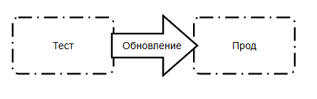

---
title: 7.04. DevOps, CI-CD
---

# 7.04. DevOps, CI-CD

# Раздел в разработке

## Основы

Часто можно запутаться в этих понятиях вроде «прод», «тест» и тому подобное. Смысл прост - нельзя размещать тестовые или непроверенные вариации приложения на рабочей среде, поэтому нужна «копия» рабочей среды для проверок и экспериментов. Поэтому разворачивается целая инфраструктура вроде такой:


Здесь мы видим следующий порядок:

1. Создаётся тестовая среда, на которой развёртывается тестовая база данных и тестовая сборка приложения (часто её называют «стенд»). Сотрудникам компании заказчиков или разработчиков предоставляется доступ к этой среде, часто даже полный доступ, чтобы разрабатывать, тестировать и экспериментировать.
2. Создаётся продакшен (промышленная) среда, которая включает уже реальную базу данных (готовую «к бою») и итоговая проверенная версия приложения. Часто у команды разработки уже нет доступа к продакшену, чтобы не испортить.

Смысл продакшен среды в том, чтобы установить туда рабочую программу и «не трогать, пока работает». Доступ туда даётся лишь ограниченный, как для обычных пользователей. К примеру, открыв любой сайт, маркетплейс, или даже игру, вы как пользователь получаете доступ именно к проду, поэтому да, всё вокруг нас - продакшен. И представьте, вы подаёте заявку на кредит на сайте, и прямо в середине процесса у вас резко меняется цвет интерфейса, а введённые вами данные очистились. Неприятно? Не то слово.

Поэтому разработчики сначала разработают и протестируют все изменения на тестовой среде без вреда для юзеров, и лишь потом полноценно развернут новую систему на продакшене.

В классическом понимании развёртывание на продакшене представляет собой остановку работы приложения, замену файлов кода и всех ресурсов, конфигурация и запуск новой версии. Но представьте, если работа онлайн-банка или маркетплейса по всему миру…остановится, для установки обновления? Это же смертельно для бизнеса!

Поэтому существует автоматический процесс поставки с теста на прод.



Здесь всё искусство администраторов и DevOps-инженеров как раз в том, чтобы аккуратно обновить продакшен без вреда бизнесу. Современные технологии и инструменты позволяют производить такую «поставку» автоматически, что и привело к появлению термина CI/CD.

DevOps, CI/CD – что это?

И так, мы спроектировали решение, определились с архитектурой и даже разработали его. Что дальше? Нужно установить и реализовать. Тут вступает в силу развёртывание, или деплой.

**Развёртывание** – процесс установки и запуска программного обеспечения на целевой среде (например, сервер). Оно бывает ручным и автоматическим. И если ручное – это классическая установка всех компонентов, зависимостей и программ, то автоматическое – более интересный и сложный процесс, который требует особой квалификации – DevOps.

**DevOps (от Development + Operations)** – культура, методология и набор практик, которые направлены на автоматизацию и ускорение процессов разработки и развертывания программного обеспечения путем улучшения взаимодействия между разработчиками (Dev) и ИТ-операциями (Ops).
```
Разработка (Dev) и эксплуатация (Ops) за счет автоматизации, CI/CD и коллаборации
```
Важно: это не сисадмины, не релиз-мастера, и не конкретный инструмент. Это подход, который затрагивает и меняет весь цикл разработки ПО – от написания кода до его работы в продакшене.

Цель – ускорить выпуск продукта без потери качества. Если привести аналогию – то это использование на производстве автоматического конвейера вместо использования ручного труда. Цели те же, эффект аналогичный, главное не просто запустить проект, «чтобы работало», а сделать этот запуск быстрым, безопасным, надёжным.

Принципы:
	- автоматизация (уменьшение количества ручных процессов, использование автосборки и автотестирования, авторазвертывания (деплоя) на продакшен и управление структурой через код);
	- коллаборация (команды работают вместе, разработчики, сисадмины, техподдержка – все должны работать на единую цель обеспечения удобства развертывания и масштабируемости);
	- непрерывность (CI/CD, постоянная интеграция, тестирование и доставка в продакшен, с постоянным мониторингом ошибок и нагрузки).

Возможно, многие сталкивались с традиционной для любой ячейки общества системы «перекладывания ответственности», появившейся из «разделения ответственности». Допустим, разработчик сделал четко, что требуется, закинул код, передал админам, а на любые замечания говорит: «Мне без разницы, вот, смотрите, у меня всё работает». Админы пытаются, настраивают всё вручную, но не получается – то ошибка в тоннах конфигураций серверов, то нет нужных зависимостей, то нагрузка намного выше, чем на тестовом стенде. Итог – бесконечное перекладывание вины, медленные релизы, падение продакшена и конечно же «выдёргивание» разработчика для решения проблемы.

На практике знаю – это колоссальный стресс, я сталкивался с этим и как пользователь, и как техподдержка, и как администратор, и как разработчик. Когда не обеспечена автоматизация или должным образом все принципы не соблюдены – цикл «релизного ада» будет постоянным.

DevOps меняет ситуацию – разработчики теперь должны не просто написать код, достаточный для выполнения задачи, но и продумать важные вопросы:
	- Как код будет работать в продакшене?
	- Как код будет масштабироваться?
	- Как быстро откатить, если что-то сломается?

Администраторы (их ещё называют «операторами», это как раз часть «Ops») участвуют в планировании, взаимодействуют с командой и знают, как устроено приложение.

Также DevOps практикует ещё и встраивание тестировщиков в процесс с самого начала, когда тесты пишутся параллельно с кодом, что обеспечивает тестирование не в конце, а на каждом этапе, а также используется автоматическое тестирование.

Всё это, в совокупности обеспечивает то, что команда перестаёт бояться изменений, а развертывание продукта становится гибким и плавным.

В DevOps есть такие понятия, как CI/CD, петля обратной связи и пайплайн.

Пайплайн (pipeline) – автоматизированный конвейер, который берёт код, проводит через необходимые этапы и доставляет в продакшен:
```
Синхронизация кода с Git → Сборка → Автотесты → Деплой на тестовый или продакшен стенд → Ручное тестирование → Деплой на продакшен
```
CI/CD (Continuous Integration / Continuous Delivery) состоит из двух принципов.

	- **Непрерывная интеграция** (Continuous Integration) – постоянный учёт изменений и грамотное использование систем контроля версий, частое слияние кода в соответствующих ветках Git, и при каждом коммите – запуск автоматической сборки и тестов. Это сразу выявляет ошибки, которые проще починить до того, как наступят последствия.
	- **Непрерывная доставка** (Continuous Delivery) – автоматическое развёртывание сборки на соответствующем стенде. Часто используется ручное подтверждение релиза – и оно в любом случае представляет собой «клик», а не кропотливую настройку зависимостей и конфигураций.

Петля обратной связи – цикл фидбека, когда обеспечивается организация формы оперативной пересылки жалоб от пользователей, а также когда данные из продакшена (логи, метрики, ошибки) постоянно анализируются – улучшения попадают обратно в разработку. Это включает в себя, соответственно, логирование, мониторинг и отработку багов, выявленных пользователями.

```
Как работает CI (Continuous Integration) : автоматическое объединение кода из разных источников и проверка его через сборку и тестирование.
Как организовать CI (Continuous Integration) : автоматическое объединение кода из разных источников и проверка его через сборку и тестирование.
Как работает CD (Continuous Delivery / Deployment) : автоматическая доставка изменений в рабочую среду или их автodeployment в production.
Как организовать CD (Continuous Delivery / Deployment) : автоматическая доставка изменений в рабочую среду или их автodeployment в production.
Разработка локальная и разработка на тестовом сервере;
Тестирование на тестовой среде и предпродуктивной
Эксплуатация и продуктивная среда, прод
Откат и выведение из эксплуатации

Итого, получаем структуру – среда тестовая, предпрод и прод (иногда просто тест и прод)

Варианты развёртывания – реальные сервера с доступом, ВМ с доступом, контейнеризация.
```

Gitflow: Это модель ветвления Git, которая определяет, как организовывать ветки кода для различных целей (например, разработка новых функций, исправление ошибок, релизы).  Она помогает упорядочить процесс разработки и избежать конфликтов.

Основные ветки:

| Ветка | Назначение |
|---|---|
| main | Стабильная версия продукта. Каждый коммит — полноценный релиз. Теги создаются здесь. |
| develop | Основная рабочая ветка для разработки. Все фичи объединяются (мерджатся) сюда. |
| `feature/*` | Ветки, выделенные для реализации новых функций. |
| `release/*` | Ветки для подготовки к выпуску релиза: тестирование, устранение критических ошибок. |
| `hotfix/*` | Ветки для оперативного исправления критических проблем в production-версии. |


```
Azure DevOps (и его предшественник TFS)
TFS (Team Foundation Server)
ALM

автодеплой
автоматическая проверка кода перед деплоем - линтеры, тесты, секреты
preflight checklist - валидаторы, approvals, условия
канареечная поставка (canary deployment) или blue/green
Проверка конфигураций (YAML, Terraform, Helm) при Pull Request
drift между IaC и реальной инфраструктурой
проверка секретов в коде (например, через truffleHog, gitleaks)
policy-as-code (OPA, Conftest) для контроля стандартов
дашборды для метрик (CPU, память, latency, ошибок)
Автоматический алертинг при отклонении от нормы
лог-агрегация с фильтрацией по сервисам и компонентам
трассировка запросов (OpenTelemetry, Jaeger, Zipkin)
секреты хранятся в безопасном хранилище (Vault, AWS Secrets Manager)
Least Privilege для IAM/доступов
security-сканы (Snyk, Trivy, Clair)
2FA и audit logs для ключевых операций
автогенерирование документации (например, по API)
Разработчики могут запускать окружения в изоляции (preview environments)
шаблоны Helm/Compose для локальной разработки
инфраструктура в IaC (Terraform, Pulumi, CloudFormation)
CI для автоматической валидации/применения изменений в инфраструктуре
модульная структура IaC-кода (по сервисам/проектам)
аудит изменений инфраструктуры (Terraform Cloud, Atlantis)
регулярные постмортемы и RCA-документы после инцидентов
cron-инвентарь / дэшборд со всеми активными джобами
проверка сертификатов и их сроков
чёткий on-call ротационный график с алертом и логом действий
Все пайплайны и инфраструктура документированы в виде wiki / README
канал в Slack или другой платформе с логами деплоя/событий
Slack
база знаний по инцидентам и FAQ по пайплайнам
логирование критических действий (deploy, scale, restart)

стейдж и прод
rollback автоматического деплоя
```

## Процесс CI/CD

**CI/CD (Continuous Integration / Continuous Delivery or Deployment)** — это совокупность практик, инструментов и процессов, направленных на автоматизацию этапов разработки, тестирования, сборки, релиза и развёртывания программного обеспечения с целью обеспечения непрерывной, предсказуемой и надёжной доставки изменений в продуктивную среду.

CI/CD не является набором отдельных технологий, а представляет собой инженерную дисциплину, основанную на принципах системного мышления, обратной связи и минимального ручного вмешательства.

**Цель CI/CD** — сократить время от написания кода до его выпуска в эксплуатацию, минимизировать вероятность ошибок, повысить качество ПО и обеспечить воспроизводимость всех этапов жизненного цикла. При этом CI/CD-пайплайн (pipeline) — это оркестрированная последовательность автоматизированных задач, выполняемых в строго определённом порядке, каждая из которых имеет чётко заданный вход, выход и критерии успеха.

В современной инженерной практике CI/CD-пайплайн традиционно разделяется на две логические части:
	- Continuous Integration (CI) — фаза, охватывающая процессы, связанные с интеграцией кода в общую базу, его сборкой и первичным тестированием.
	- Continuous Delivery/Deployment (CD) — фаза, включающая подготовку к выпуску, релиз, развёртывание, управление инфраструктурой и мониторинг работоспособности в продакшене.

Следует отметить, что Continuous Delivery предполагает возможность ручного одобрения перед релизом, тогда как Continuous Deployment подразумевает автоматическое развертывание каждого прошедшего все проверки изменения в продакшен. В рамках данного материала термин CD используется в широком смысле, охватывающем оба варианта. Но на практике, воспринимайте именно как Deployment.

Я бы выделил восемь последовательных этапов:
1. Планирование;
2. Разработка;
3. Сборка;
4. Тестирование;
5. Релиз;
6. Развёртывание;
7. Управление развёртыванием;
8. Мониторинг.

Хотя планирование и разработка логически предшествуют CI, они не являются частью автоматизированного пайплайна и относятся к процессам подготовки. CI начинается с момента фиксации кода в репозитории и запуска автоматических задач. CD — с момента, когда артефакт считается релизным и начинает движение к продакшену.

### Планирование (Planning).

Этот этап является начальной стадией жизненного цикла разработки и служит основой для всех последующих операций. На данном этапе формируются требования к функциональности, определяется архитектура решения, распределяются задачи между командами, устанавливаются критерии приемки и выбирается технологический стек.

Планирование включает:
	- Анализ бизнес-потребностей и формирование пользовательских историй (user stories);
	- Разработку технических спецификаций и диаграмм архитектуры;
	- Оценку трудозатрат и планирование спринтов (в рамках Agile/Scrum);
	- Документирование решений, политик доступа, стандартов кодирования и процедур управления конфигурацией.

Инструменты: Jira, Azure DevOps Boards, YouTrack, Trello, Confluence, Notion.

Планирование обеспечивает согласованность между бизнес-целями и технической реализацией. Отсутствие четкого плана делает автоматизацию бессмысленной — невозможно автоматизировать то, что не определено.


### Разработка (Development).

На этапе разработки инженеры реализуют функциональные требования, пишут код в соответствии с принятыми стандартами и архитектурными паттернами. Код разрабатывается в изолированных ветках (feature branches), что позволяет избежать конфликтов и обеспечивает возможность параллельной работы нескольких разработчиков.

Ключевые действия:
	- Написание кода с соблюдением принципов SOLID, DRY и других парадигм;
	- Реализация unit- и integration-тестов на этапе разработки;
	- Фиксация изменений в системе контроля версий с соблюдением семантического коммит-менеджмента;
	- Выполнение локальных проверок кода (linting, форматирование).

Инструменты: GitLab, GitHub, Bitbucket, Azure Repos.

Важно отметить, что мы не говорим о том, что разработчики ещё должны, собственно, разрабатывать продукт - для этого используются, очевидно, инструменты разработки и отладки - IDE (VS, IDEA), клиенты Git (CLI, TortoiseGit, GitHub Desktop, Fork), различные редакторы, СУБД (PostgreSQL, MS SQL), утилиты, прикладное и инженерное ПО - всё, что нужно для написания кода или создания приложений.

В контексте CI/CD не так важна первая реализация программы. Здесь фокус будет именно на изменениях, то есть это вторая, третья и дальнейшие итерации, когда базовая программа/модуль уже созданы, и происходит развитие продукта и изменение кода.

Разработка — источник изменений. Эффективность всей CI/CD-цепочки зависит от качества и регулярности коммитов в Git. Использование git-flow или trunk-based development определяет стратегию интеграции, поэтому ошибка на предыдущем этапе с выбором направления работы, здесь уже будет непростительной.


### Сборка (Build).

Сборка — процесс преобразования исходного кода в исполняемую или деплоебельную форму. Это критически важный этап, поскольку именно здесь происходит компиляция, упаковка, разрешение зависимостей и генерация артефактов, которые будут использоваться на всех последующих стадиях.
Мы не говорим о сборке на рабочем месте разработчика, нет - абсолютно не важна успешность компиляции на его компьютере, главное - чтобы сборка была успешной именно в рабочей целевой среде. Поэтому должно быть несколько сред - как минимум одна идентичная промышленной.

К примеру, мы хотим создать веб-приложение. Первая реализация содержит в себе самые базовые функции, успешно разворачивается и работает на главном сервере. И для изменения нужно создать идентичную среду на другом сервере (а в идеале - иметь несколько серверов, с хотя бы одним промежуточным), где и будет проверяться то, что изменили разработчики.

Типовые действия:
	- Компиляция исходного кода (в случае языков со статической типизацией);
	- Упаковка в контейнеры, JAR, WAR, MSI, DEB, RPM и другие форматы;
	- Резолвинг зависимостей через менеджеры пакетов;
	- Генерация карт зависимостей и метаданных для трассировки.

Инструменты поэтому тут соответствуют языкам и технологиям:
	- Java/Kotlin/Scala: Maven, Gradle
	- .NET: MSBuild, dotnet CLI, Cake
	- Python: pip, poetry, setuptools
	- JavaScript/TypeScript: Webpack, Vite, esbuild, npm/yarn
	- Go: go build, mod
	- PHP: Composer
	- C/C++: CMake, Bazel, Ninja
	- Universal: Bazel, Pants (для многоязычных репозиториев)

Сборка обеспечивает воспроизводимость. Если сборка не проходит — дальнейшие этапы не имеют смысла. Артефакт, созданный на этом этапе, становится единственным источником правды (single source of truth) для всех последующих стадий.

Важно учитывать, что сборка может быть именно что автоматической, а от администраторов требуется лишь подтверждать действия, чтобы ускорить развёртывание.


### Тестирование (Testing).

Тестирование — система автоматизированных проверок, направленных на выявление дефектов на разных уровнях абстракции. Цель — обеспечить, что каждый коммит не нарушает существующую функциональность и соответствует заявленным требованиям.

Различают следующие уровни тестирования:
	- Unit-тесты — проверяют отдельные модули или функции (например, метод класса).
	- Интеграционные тесты — проверяют взаимодействие между компонентами (база данных, API, внешние сервисы).
	- End-to-end (E2E) — имитируют поведение пользователя в полноценной среде.
	- Статический анализ кода — проверка на соответствие стандартам, наличие уязвимостей, дублирования и сложности.
	- Тестирование производительности и безопасности — нагрузочные тесты, SAST/DAST сканеры.

Соответственно, инструменты тоже зависят от вида тестирования:
	- Unit: JUnit (Java), NUnit (.NET), pytest (Python), Jest (JS), GoTest (Go)
	- Integration/E2E: Playwright, Selenium, Cypress, TestNG
	- SAST/DAST: SonarQube, Checkmarx, OWASP ZAP, Snyk
	- Coverage: JaCoCo, Istanbul, Coverage.py

Смысл данного этапа как раз в том, что в команде разработки выделяются специальные сотрудники - QA-инженеры, тестировщики, которые проверяют то, что «налепили» разработчики, и задача тут - найти проблемы. Поэтому на тестовом сервере часто для симуляции сценарии дают «карт-бланш» со всеми задачами, порой формулируемых как «попробуй сломать».

Ручное тестирование требует человеческих затрат и большого количества времени, но автотесты должны быть всегда, чтобы от администраторов требовалось лишь нажать кнопку, и проверка прошла автоматически. Автоматически тестировать можно типовые ошибки, наборы данных, интеграции, доступа, валидации, обязательность, редактируемость и прочие простые вещи. Вручную проверять надо сложные многоэтапные сценарии работы, допустим когда нужно симулировать действия пользователя в определённой ситуации. Но и тут профессионалы автоматизации скажут, что можно обойтись «без рук».

Тестирование — механизм обратной связи. Автоматизированные тесты являются гарантом стабильности системы. Не прошедшие тесты блокируют продвижение артефакта дальше по пайплайну (gatekeeping).


### Релиз (Release).

Релиз — это формальное создание версии продукта, готовой к распространению. На этом этапе артефакт, прошедший все этапы CI, маркируется версией (SemVer), сохраняется в репозиторий артефактов и сопровождается метаданными: хэш коммита, автор, дата, список изменений, ссылки на задачи.

Ключевые действия:
	- Присвоение версии (v1.2.3-beta.4);
	- Создание release-ветки или тега в репозитории;
	- Упаковка changelog, документации, лицензий;
	- Загрузка артефакта в централизованное хранилище (Artifact Repository).

Инструменты - Jenkins, GitLab CI/CD, Buildkite, CircleCI, GitHub Actions.

Релиз — точка невозврата. После этого этапа артефакт считается потенциально релизным. Он может быть задержан для ручного одобрения (Continuous Delivery) или сразу отправлен на деплой (Continuous Deployment).


### Развёртывание (Deployment).


Развёртывание — процесс помещения артефакта в целевую среду (staging, canary, production). Этот этап отличается от сборки тем, что он связан с применением артефакта к работающей системе, а не с его созданием.

Действия включают:
	- Копирование артефакта на целевые серверы или в контейнерный реестр;
	- Подготовка конфигураций (config maps, secrets);
	- Запуск контейнеров, сервисов, функций;
	- Применение миграций БД (если требуется).

Инструменты:
	- Контейнеризация: Docker (создание образов), Podman
	- Serverless: AWS Lambda, Google Cloud Functions, Azure Functions
	- Облачные платформы: Terraform (инфраструктура как код), Pulumi
	- Специализированные деплоеры: Argo CD, Flux, Spinnaker

Развёртывание — переход от состояния «код написан» к состоянию «код работает». Качество этого этапа определяется воспроизводимостью и повторяемостью — один и тот же артефакт должен разворачиваться одинаково в dev, staging и prod.


### Управление развертыванием (Orchestration & Infrastructure Management).

Этот этап отвечает за управление жизненным циклом инфраструктуры и сервисов, обеспечивающих работу приложения. Он включает автоматизированное управление масштабированием, обновлением, отказоустойчивостью и конфигурацией сред.

Ключевые задачи:
	- Управление кластерами контейнеров (оркестрация);
	- Автоматическое масштабирование по нагрузке;
	- Обеспечение высокой доступности (HA) и rolling updates;
	- Управление секретами, сетевыми политиками, RBAC;
	- Инфраструктура как код (IaC): декларативное описание окружения.

Инструменты:
	- Оркестрация: Kubernetes, Docker Swarm, Nomad
	- IaC: Terraform, Pulumi, AWS CloudFormation, Ansible
	- Управление конфигурацией: Helm, Kustomize, Crossplane

Без оркестрации развертывание становится хаотичным. Этот этап гарантирует, что инфраструктура соответствует описанному состоянию (desired state) и способна адаптироваться к изменениям без ручного вмешательства.


### Мониторинг и обратная связь (Monitoring & Observability).

Мониторинг — это сбор, агрегация и анализ метрик, логов и трейсов для оценки работоспособности системы в реальном времени. Он замыкает цикл CI/CD, предоставляя данные для принятия решений о качестве релиза и необходимости отката.

Ключевые направления:
	- Метрики: CPU, память, latency, throughput, error rate (Prometheus, Grafana);
	- Логи: централизованный сбор и поиск (ELK Stack, Loki, Splunk);
	- Трассировка: distributed tracing (Jaeger, OpenTelemetry);
	- Алертинг: автоматическое оповещение о девиациях (Alertmanager, PagerDuty);
	- Анализ причин отказов: root cause analysis на основе событий.

Инструменты: Prometheus, Grafana, Datadog, New Relic, ELK, Sentry, OpenTelemetry.

Мониторинг — источник эмпирических данных. Он позволяет переходить от реактивного к проактивному управлению качеством. Если тесты говорят «код работает», то мониторинг говорит «система работает». Именно здесь рождаются новые требования и улучшения для следующего цикла.


### Azure Repos

Azure DevOps представляет собой набор решений и инструментов для планирования, отслеживания и обсуждения работы в командах, в том числе CI/CD - непрерывную поставку и непрерывную интеграцию для любой платформы.

Она включает в себя:
	- Azure Boards для отслеживания работы с помощью настраиваемых канбан-досок, интерактивных представлений невыполненной работы;
	- Azure Pipelines для того, чтобы создавать, тестировать и развёртывать решения с помощью конвейера CI/CD, который поддерживает любой язык, платформу и облако, а также возможностью подключения к GitHub;
	- Azure Test Plan для проведения тестов с помощью набора средств для произвольного и ручного тестирования;
	- GitHub Advanced Security для Azure DevOps позволяет использовать набор средств тестирования безопасности, встроенных в Azure DevOps;
	- GitHub Copilot для Azure DevOps позволяет повысить производительность разработчиков благодаря разработке с ИИ-помощью, используя GitHub Copilot с Azure Repos;
	- Azure Artifacts позволяет создавать, размещать и совместно использовать пакеты с командой, а также добавлять артефакты в конвейеры CI/CD одним щелчком мыши;

Управляемые пулы DevOps позволяют командам разработчиков быстро и легко реализовывать пулы агентов Azure DevOps, адаптированные под конкретные потребности команды. Управляемые пулы DevOps реализуют советы по безопасности, обеспечивают баланс между затратами и производительностью, а также предоставляют пути для наиболее распространенных сценариев.

Azure Repos — это набор инструментов управления версиями, которые можно использовать для управления кодом. 

Azure Repos предоставляет два типа контроля версий:
	- Git : распределенный контроль версий
	- Team Foundation Version Control (TFVC) : централизованный контроль версий

Git в Azure Repos — это стандартный Git. Вы можете использовать клиенты и инструменты по своему выбору, такие как Git для Windows, Mac, партнерские сервисы Git и такие инструменты, как Visual Studio и Visual Studio Code.

Такие крупные системы используют пулреквесты - проверки кода с помощью запросов на вытягивание - команда просматривает изменения и, убедившись, что изменения успешно проходят сборку и тесты, объединяются с основной веткой решения.

В репозитории есть несколько критических веток, на которые команда рассчитывает, чтобы они всегда были в хорошем состоянии, например, ветка master. Обычно при использовании как раз и требуются пул-реквесты для внесения любых изменений в эти ветки. Разработчики, которые отправляют изменения напрямую в защищенные ветки, получают отказы в своих пушах.

Форки — отличный способ изолировать экспериментальные, рискованные или конфиденциальные изменения от исходной кодовой базы. Форк — это полная копия репозитория, включая все файлы, коммиты и (необязательно) ветки. Новый форк действует так, как будто кто-то клонировал исходный репозиторий, а затем отправил его в новый пустой репозиторий.

После создания форка новые файлы, папки и ветки не передаются репозиториям, если только запрос на извлечение не переносит их. После того, как вы готовы поделиться этими изменениями, можно легко использовать запросы на извлечение , чтобы вернуть изменения в исходный репозиторий.

Azure Repos также поддерживает Team Foundation Version Control (TFVC). TFVC — это централизованная система управления версиями. Обычно члены команды имеют только одну версию каждого файла на своих машинах разработки. Исторические данные хранятся только на сервере. Ветви основаны на путях и создаются на сервере.

Порядок работы:
1. Клонирование или создание репозитория в Azure DevOps. Вы можете клонировать удаленный репозиторий Git, чтобы создать его локальную копию. Клонирование создает как копию исходного кода для работы, так и информацию о контроле версий, чтобы Git мог управлять исходным кодом.
2. Работа с веткой для каждой функции или исправления:
	- создание ветки через git branch;
	- переключение на ветку через checkout.

Ветки Git изолируют ваши изменения от другой работы в проекте. Рекомендуемый рабочий процесс Git заключается в использовании новой ветки для каждой функции или исправления, над которыми вы работаете. Вы делаете коммиты в локальном репозитории Git, чтобы сохранить изменения в этой ветке.

Пример:
```bash
git checkout main
git pull origin main
git branch users/test/feature1
git checkout users/test/feature1
```
3. Работа с кодом.
4. Объединение изменений с запросом на вытягивание, процесс проверки и слияния кода. После того, как вы закончите исправление ошибки или новой функции в ветке, создайте новый запрос (Create a pull request). Новые запросы на извлечение настроены на слияние вашей ветки с веткой по умолчанию, которая в этом примере — main. Заголовок и описание предварительно заполнены вашим сообщением о коммите.

**Team Foundation Version Control** — централизованная система управления версиями, чем и отличается от Git. Обычно члены команды имеют только одну версию каждого файла на своих машинах разработки. Исторические данные хранятся только на сервере. Ветви основаны на путях и создаются на сервере.

Git хранит историю как снимок репозитория во времени, в то время как TFVC записывает отдельные операции, которые были выполнены с файлом. Типы изменений в TFVC, такие как переименование, отмена удаления и откат, не могут быть выражены в Git. Вместо того, чтобы увидеть, что файл Aбыл переименован в file B, он отслеживает только, что файл Aбыл удален и file Bбыл добавлен в том же коммите.

У Git нет прямого аналога метки TFVC. Метки могут содержать любое количество файлов любой конкретной версии и могут отражать файлы разных версий. Хотя концептуально они схожи, теги Git указывают на снимок всего репозитория в определенный момент времени. Если проект полагается на метки TFVC, чтобы знать, что было доставлено, теги Git могут не предоставлять эту информацию.

Слияния в TFVC происходят на уровне файлов, а не всего репозитория. Только подмножество измененных файлов может быть объединено из одной ветки в другую. Оставшиеся измененные файлы могут быть затем объединены в последующий набор изменений. В Git слияние влияет на весь репозиторий, и оба набора отдельных изменений не могут рассматриваться как слияние.

Pull Requests. Владелец PR должен поручить проверку PR нужным людям и убедиться, что проверяющие знают, что делает код. Рецензенты должны давать действенные и конструктивные отзывы. Владельцы и рецензенты должны быстро комментировать и отвечать.

```
TFS
Подробнее про TFS

```

## Git в работе DevOps

Код может быть проверен автоматически или вручную. Вручную проверяется, к примеру, старшим разработчиком – такой процесс называют «код-ревью». Автоматическая проверка же включает авторелиз и автотест.

Авторелиз (Continuous Deployment) – процесс автоматического выкладывания новой версии кода в продакшн после успешного прохождения тестов. 

Это работает так:
	- разработчик вносит изменения и пушит в Git;
	- CI/CD система (GitHub Actions, GitLab CI, Jenkins) запускает тесты;
	- тесты успешны – код автоматически деплоится на сервер.

Автотесты – программы, которые проверяю код вместо человека. Примеры:

| Тип | Проверка | Пример |
|---|---|---|
| Unit-тесты | Отдельные функции и методы | Jest, Pytest |
| Интеграционные | Взаимодействие между компонентами (например, API и база данных) | Postman, Cypress |
| E2E (End-to-End) | Полный сценарий работы приложения, имитация действий пользователя | Selenium, Playwright |


Подробнее о тестировании мы поговорим в отдельной главе.

Системы контроля версий поддерживают механизм хуков – скриптов, которые выполняются при определенных событиях. Допустим, можно проверить стиль кода, запустить линтер, запустить тесты или установить новые зависимости.

Линтер – это инструмент, который автоматически проверяет код на ошибки, стиль и потенциальные проблемы, но не запускает выполнение кода. Словом, выполняет человеческую работу по проверке. Он настраивается под проект, запускается вручную или автоматически, к примеру подсветка ошибок синтаксиса в IDE (и редакторах кода вроде VS Code) и есть работа линтера. Линтер в гит-хуках не даёт закоммитить «грязный» код. 

Линтер:
	- отлавливает простые ошибки (опечатки, синтаксис);
	- следит за единым стилем (пробелы, отступы, названия переменных);
	- улучшает читаемость кода.

Примеры линтеров:

| Язык | Инструменты | Предмет проверки |
|---|---|---|
| JavaScript | ESLint, JSHint | Синтаксис, стиль кода, потенциальные ошибки, безопасность |
| Python | Pylint, Flake8 | Отступы, именование, структура кода, распространённые ошибки |
| Java | Checkstyle, PMD | Стиль кодирования, цикломатическая сложность, потенциальные дефекты |
| C/C++ | Clang-Tidy, Cppcheck | Утечки памяти, неопределённое поведение, стилевые нарушения |


Также существует механика авторелизов, к примеру по модели Git Flow, это веточная стратегия, которая упорядочивает процесс разработки и выпуска версий. Некий методологический подход разбивки, включает в себя основные ветки:
	- main / master – стабильная версия (продакшен-код);
	- develop – основная ветка для текущей разработки;
	- feature – ветки для новых функций (фич);
	- release – подготовка релиза, тестирование, фиксы багов;
	- hotfix – срочные, «горячие» исправления.

Что такое GitHub Actions и GitLab CI?

Это инструменты, которые автоматизируют сборку, тестирование и деплой.

В репозитории лежит файл deploy.yml, описывающий шаги. При пуше GitHub/GitLab запускает виртуальную машину и выполняет шаги:
	- установка зависимостей (npm install);
	- запуск тестов (npm test);
	- деплой (scp на сервер или публикация в облако).

Также есть решения Jenkins и TeamCity, фактически выполняющие те же действия – Сборка → Тесты → Деплой. Но требуется администрировать сервер, да и настраивать можно через более дружелюбный интерфейс.

Всё вместе работает так:
1.	Разработчик пишет код и пушит в Git;
2.	Хук (pre-push) проверяет, что код проходит линтеры;
3.	CI/CD запускает автотесты;
4.	Если тесты OK – код мерджится в main;
5.	Авторелиз деплоит новую версию на сервер.

По итогу всё проверяется, тестируется, разворачивается автоматически, не нужно ждать действий уполномоченных пользователей, а тесты добавят надежности.

## Инструменты

```
Инфраструктурные инструменты обеспечивают автоматическое управление серверами и облачными ресурсами через код, вместо ручных настроек.
Terraform – описывает инфраструктуру в декларативном коде, допустим, создание виртуальных машин в облаке (AWS, Azure, Cloudflare).
Ansible – конфигурирует серверы через YAML-скрипты, например, устанавливает Nginx.

CI/CD-инструменты позволяют автоматизировать сборку, тестирование и деплой.
GitLab CI – встроенный в GitLab пайплайн. Конфигурация описывается в файле .gitlab-ci.yml.
GitHub Actions – аналог GitLab CI, но для GitHub, и тоже использует YAML в папке .github/workflows.
Jenkins – веб-приложение, которое работает внутри специального сервера (например, Apache Tomcat). Используется для устаревших систем, вроде SVN.

Контейнеризация представляет собой технологию для упаковки приложений в контейнеры и управления ими. Им мы посвятим отдельную главу, так что коротко.
Docker – технология для создания легких изолированных сред для приложений, позволяющая запускать на любом компьютере с Docker;
Kubernetes (K8s) – оркестратор для управлениями контейнерами, если их сотни, с возможностью автомасштабирования и самовосстановления.

Мониторинг – сбор, анализ и визуализация данных о работе системы.
Prometheus – база данных для метрик, система мониторинга и сбора метрик, разработанная для работы в динамических средах, таких как Kubernetes.

Grafana – дашборды, платформа для визуализации данных, которая интегрируется с Prometheus и другими источниками метрик.
ELK-стек – система для анализа логов:
	- Elasticsearch – хранение и поиск;
	- Logstash – сбор и обработка логов;
	- Kibana – визуализация.
Mimir — это масштабируемая платформа для хранения и запросов временных рядов (time series), разработанная компанией Grafana Labs. Она предназначена для работы с метриками, собранными из систем мониторинга, таких как Prometheus.
Tempo — это распределенная система трассировки (distributed tracing), созданная Grafana Labs. Она используется для анализа и отслеживания запросов в распределенных системах. Пподдерживает форматы OpenTelemetry, Jaeger и Zipkin.
Loki — это система агрегации и анализа логов, созданная Grafana Labs. Она фокусируется на эффективном хранении и запросе логов. Логи индексируются только по меткам (labels), что снижает затраты на хранение.
DBSExporter — это инструмент для экспорта метрик из баз данных (например, PostgreSQL, MySQL) в формате Prometheus. Он позволяет собирать данные о производительности, использовании ресурсов и других параметрах базы данных.
OpenTelemetry — это открытый стандарт для наблюдения за распределенными системами. Он объединяет инструменты для сбора метрик, трассировки и логов в единую экосистему.

Безопасность – инструменты для защиты приложений и инфраструктуры.
WAF (Web Application Firewall) – фильтр вредоносного трафика, пример – Cloudflare WAF, AWS WAF.
Сканирование уязвимостей – Trivy (для Docker), OWASP ZAP. Эти инструменты могут быть интегрированы в CI/CD, чтобы, например, отменить сборку при критической уязвимостей.
SRM (Storage Resource Management) — это подход и набор инструментов для управления хранилищами данных. Он включает мониторинг, оптимизацию и планирование использования хранилищ.
Rclone — это утилита командной строки для управления файлами в облачных хранилищах и других системах хранения данных. Она поддерживает множество провайдеров, таких как Google Drive, AWS S3, Azure Blob Storage, Dropbox и другие.

Всё вместе это работает так:
Разработчик пушит код в Git → GitLab CI запускает тесты;
Если тесты прошли, Terraform разворачивает инфраструктуру в AWS;
Docker упаковывает приложение в контейнер;
Kubernetes деплоит контейнер;
Prometheus собирает метрики → Grafana показывает визуально;
WAF блокирует атаки, Trivy проверяет обновления на уязвимости.
Так и происходит автоматизация этих процессов. DevOps-инженер как раз работает с этим и отвечает за указанные задачи – инфраструктура, CI/CD, контейнеризация и оркестрация, мониторинг, логи, безопасность.
WAL-G — это инструмент для резервного копирования и восстановления баз данных, таких как PostgreSQL, MySQL и другие. Он работает с Write-Ahead Logs (WAL) и позволяет выполнять инкрементальные бэкапы, архивирование WAL-файлов, восстановление до определённой точки во времени (PITR). Поддерживает облачные хранилища (например, AWS S3, MinIO).
WAL-файлы (Write-Ahead Logs) работают по механизму WAL, это механизм журналирования, используемый в базах данных (например, PostgreSQL). Он записывает все изменения в базе данных в специальные файлы (WAL-файлы) перед их применением к данным.

```


## Чем отличается DevOps от сисадмина?

| Критерий | DevOps-инженер | Системный администратор |
|---|---|---|
| Основная задача | Автоматизация процессов разработки и доставки программного обеспечения | Поддержка и эксплуатация IT-инфраструктуры |
| Фокус | Скорость и надёжность выпуска ПО | Стабильность и безопасность серверов и систем |
| Работа с кодом | Написание скриптов, конфигурация инструментов в виде кода (Infrastructure as Code) | В основном использование графических интерфейсов; редкое применение скриптов |
| Инструменты | Docker, Kubernetes, CI/CD-системы (например, Jenkins, GitLab CI), Terraform | Active Directory, системы виртуализации (VMware, Hyper-V), Zabbix |
| Культура работы | Интеграция в команду разработки, практика непрерывной поставки | Часть отдела эксплуатации, реактивное обслуживание |
| Типичные задачи | Настройка CI/CD-пайплайнов; развёртывание и масштабирование микросервисов; мониторинг приложений и инфраструктуры | Установка операционных систем и программного обеспечения; резервное копирование данных; настройка сетевого и серверного оборудования |
| Ответственность | Обеспечение скорости доставки и безопасности процессов разработки | Обеспечение стабильности и доступности IT-сервисов |

```
Системы автоматизации
Ansible
Terraform
методологии DevOps
Continuous Archiving (непрерывное архивирование) — это процесс постоянного сохранения журналов изменений (например, WAL-файлов в PostgreSQL) на внешнее хранилище. Этот подход используется для обеспечения отказоустойчивости и возможности восстановления данных, и поддерживает PITR.
Как работает:
•	База данных записывает все изменения в журналы (например, WAL-файлы).
•	Эти журналы автоматически отправляются в архивное хранилище (например, AWS S3, Azure Blob Storage, MinIO).
•	Архивные файлы используются для восстановления базы данных до определенного состояния.

Point-in-Time Recovery (PITR) — это метод восстановления базы данных до определенного момента времени. PITR полагается на комбинацию полных бэкапов и журнала изменений (например, WAL-файлов).
Как работает:
•	Создается полный бэкап базы данных.
•	Все последующие изменения записываются в журнал (например, WAL).
•	При восстановлении применяется полный бэкап, а затем журнал изменений воспроизводится до нужного момента времени.


Мониторинг - основные цели и виды мониторинга, метрики, инструменты мониторинга.
Основные цели:
Обнаружение проблем : своевременное выявление неисправностей. Диагностика : анализ причин сбоев. Проактивная защита : предотвращение критических ситуаций. Отчетность : визуализация состояния системы. Виды мониторинга:
Системный : состояние серверов, CPU, RAM. Прикладной : работоспособность приложений. Инфраструктурный : сети, базы данных. Удаленный : мониторинг удаленных сервисов. Метрики: CPU Load. Memory Usage. Disk I/O. Network Traffic. Latency. Availability.Инструменты:
Prometheus : сбор и анализ метрик.
Grafana : визуализация данных.
Zabbix : комплексный мониторинг.
Nagios : обнаружение проблем.
Datadog : облачное мониторинговое решение.
Основные цели мониторинга
Виды мониторинга
Perf View, Profiler

Логирование - типы логов, уровни логов, способы использования, механизмы сбора, инструменты сбора, хранения и анализа логов.
Способы использования логов

Типы логов:
Системные : техническая информация о работе системы.
Операционные : действия пользователей и операции.
Ошибка : информация о сбоях и исключениях.
Производственный : метрики производительности.

Уровни логов:
DEBUG : подробная отладочная информация.
INFO : общая информация о процессах.
WARNING : предупреждения о возможных проблемах.
ERROR : ошибка, влияющая на работу.
CRITICAL : критическая ошибка, требующая немедленного внимания.

Способы использования:
Отладка системы.
Мониторинг состояния.
Анализ ошибок.
Аудит операций.

Механизмы сбора:
Logback/Log4j для JVM.
Syslog для Unix-систем.
Application Insights для Azure.

Инструменты:
ELK Stack (Elasticsearch, Logstash, Kibana) — хранение и анализ.
Graylog — централизованное логирование.
Splunk — анализ больших объемов данных.
Prometheus/Grafana — мониторинг и визуализация.
```