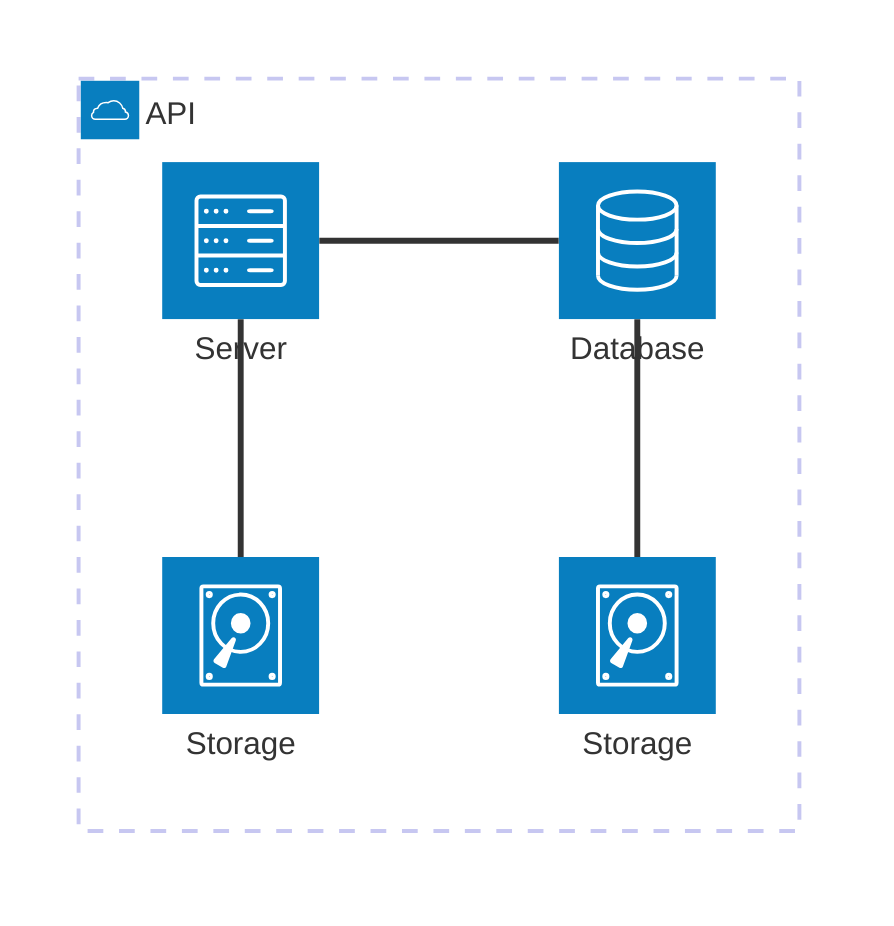
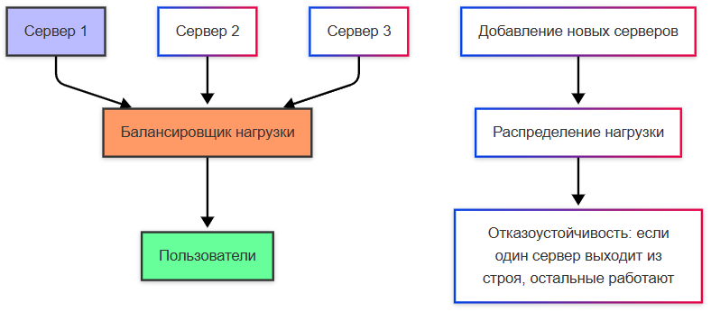
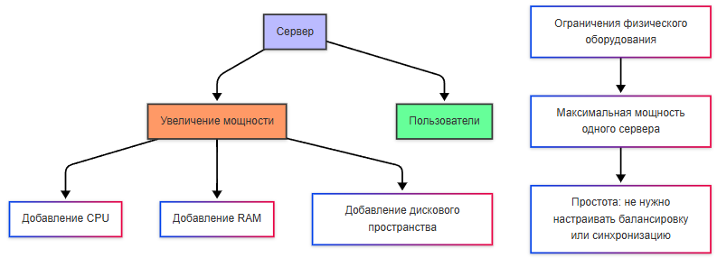

---
title: 7.05. Масштабирование
---

# 7.05. Масштабирование

  В РАЗРАБОТКЕ
  НЕ ДЛЯ НОВИЧКОВ
  НЕ ОБЯЗАТЕЛЬНО

Разработчику
Архитектору
Инженеру

## Масштабирование

### Что такое масштабируемость

Так, систему разработали, протестировали, развернули. Но прогресс не стоит на месте, она «выстрелила», доходы увеличились, появились новые цели, бизнес-требования, да и новые правила рынка. Данные увеличиваются в объёмах, нагрузка увеличивается, а весь огромный код в один проект уместить тяжеловато. И если программа изначально не была рассчитана на расширение - придётся переписывать. Именно поэтому в какой-то момент многие системы в 2010-х годах претерпели сильные реформы. Теперь же они адаптированы и развиваются плавно. В чём секрет?

**Масштабируемость** — это способность системы, приложения или процесса справляться с ростом нагрузки (например, увеличением количества пользователей, транзакций или данных) без значительного снижения производительности. А сам процесс такого увеличения нагрузки называется масштабированием.

---

### Виды масштабирования

**Горизонтальное масштабирование** заключается в добавлении новых экземпляров компонентов системы (серверов, узлов, контейнеров). К примеру, если ваш сервер не справляется с нагрузкой, вы добавляете еще несколько серверов и распределяете запросы между ними. Это самое гибкое решение, можно добавлять новые ресурсы постепенно. Кроме того, имеет место отказоустойчивость - если один сервер выходит из строя, остальные продолжают работать. Такой подход требует сложной настройки балансировки нагрузки, синхронизации данных и управления состоянием.

**Вертикальное масштабирование** представляет собой увеличение мощности существующего сервера (добавление процессоров, оперативной памяти, дискового пространства). Решение здесь проще - если ваш сервер не справляется с нагрузкой, вы покупаете более мощный сервер. Архитектура системы не изменяется, не нужно настраивать балансировку нагрузки или синхронизацию данных. Но такое решение может выйти дороже, да и добавить ограничений в виде физических возможностей оборудования из-за предела мощности одного сервера.

Главный риск вертикального масштабирования - риск отказа всей системы, если сервер выйдет из строя.

---

### Порядок масштабирования

Как масштабируют систему?

1. Определение бутылочного горлышка (узкого места) - используются инструменты мониторинга для анализа производительности системы, и здесь важно убедиться, что проблема действительно связана с недостатком ресурсов (процессора, памяти, сети и т.д.).
2. Выбор подхода. Если система уже достигла предела возможностей одного сервера, переходите к горизонтальному масштабированию. Если текущий сервер ещё имеет запас мощности, рассмотрите вертикальное масштабирование.
3. Реализация. Добавляются новые сервера, контейнеры, настраивается балансировщик нагрузки, проводится проверка синхронизации, оптимизируется конфигурация системы.
4. Тестирование. После масштабирования производится тест системы под нагрузкой (стресс-тест, нагрузочное тестирование), чтобы убедиться, что производительность улучшилась.

Нагрузка при масштабировании должна как-то распределяться. В горизонтальном масштабировании, она распределяется между несколькими серверами или узлами. Это делается с помощью балансировщика нагрузки , который направляет входящие запросы на разные серверы. Если используется база данных, она может быть либо централизованной (одна база для всех серверов), либо распределенной (разные серверы работают с разными частями данных).

Вертикальное масштабирование сохраняет нагрузку на одном сервере, но он становится более производительным за счет увеличения ресурсов.

При масштабировании, кстати, важно учитывать и зонирование систем. К примеру, может быть часть, которая публичная, а часть, которая должна быть закрытой. Обычно можно встретить три зоны - внешняя (ненадёжная) сеть, демилитаризованная (изолированная промежуточная буферная зона) и внутренняя (корпоративная, с самыми высокими требованиями к безопасности). Внешняя часть - это всегда посторонний интернет, словой, любой пользователь. Демилитаризованная зона содержит серверы, которые должны быть доступны извне (например, сайт, геопортал). Файрволы будут контролировать трафик. А внутренняя сеть же имеет самые строгие ограничения, например, веб-сервер может обращаться к базе данных только по определённому порту и с аутентификацией.

Когда система масштабируется, обычно используется кластеризация, которая образует группу серверов (узлов), работающих вместе, допустим как единая система для хранения и обработки данных, что повышает надёжность, производительность, доступность, позволяет распределять нагрузку между узлами, например, репликацией или шардированием. Некоторые веб-сервера, допустим, можно объединять в веб-фермы, которые будут работать совместно для обслуживания запросов к веб-приложению - тогда запросы будут поступать на балансировщик нагрузки, который будет распределять запросы между серверами в ферме. Все серверы обычно содержат одинаковую копию приложения, и если один сервер упал, другие продолжат работать.

Веб-серверы расположить можно в демилитаризованной зоне и они будут работать как веб-ферма, а базу данных в защищённой внутренней сети и она будет работать в кластере для отказоустойчивости.

---