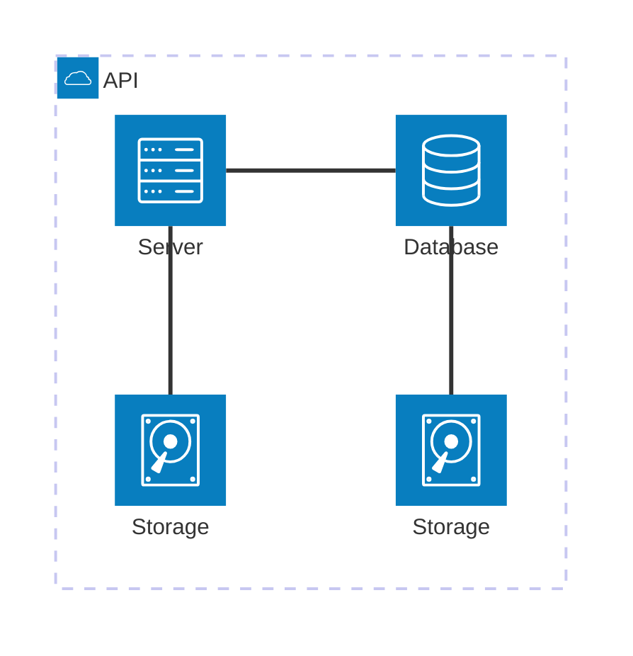
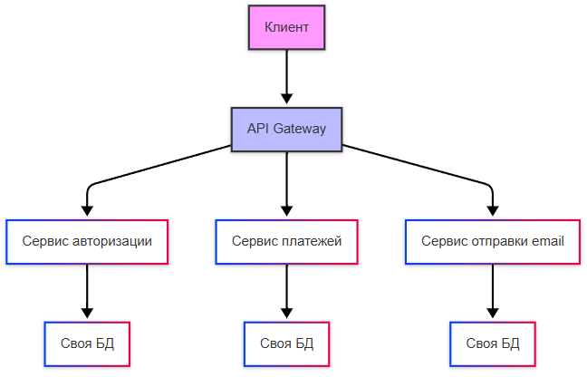
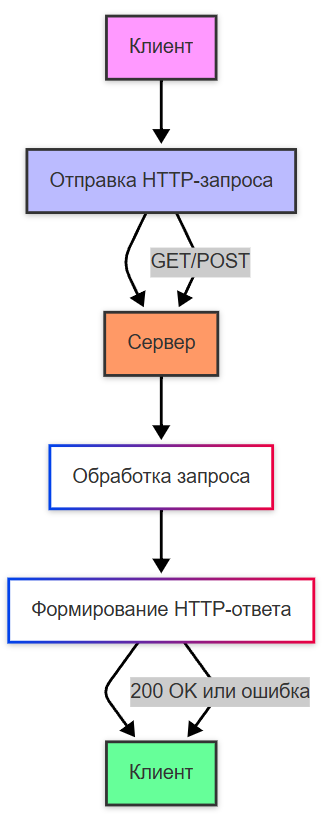
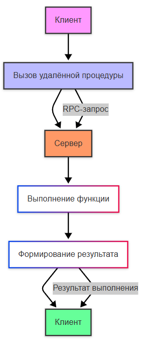
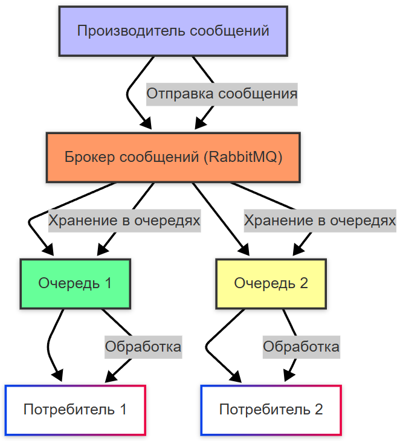
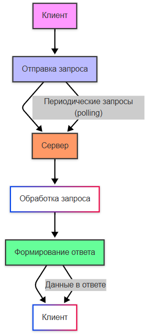
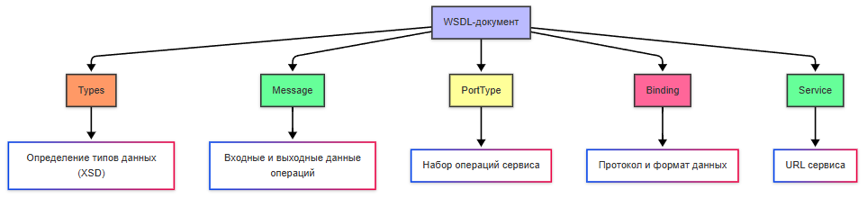

---
title: 7.05. Микросервисы и интеграция
---

# 7.05. Микросервисы и интеграция

<div class="article-tags">
  <span class="tag tag-inprogress">В РАЗРАБОТКЕ</span>
  <span class="tag tag-advanced">НЕ ДЛЯ НОВИЧКОВ</span>
  <span class="tag tag-notrequired">НЕ ОБЯЗАТЕЛЬНО</span>
</div>
<span class="complexity-badge">Разработчику</span>
<span class="complexity-badge">Архитектору</span>
<span class="complexity-badge">Инженеру</span>

## Масштабирование

Так, систему разработали, протестировали, развернули. Но прогресс не стоит на месте, она «выстрелила», доходы увеличились, появились новые цели, бизнес-требования, да и новые правила рынка. Данные увеличиваются в объёмах, нагрузка увеличивается, а весь огромный код в один проект уместить тяжеловато. И если программа изначально не была рассчитана на расширение - придётся переписывать. Именно поэтому в какой-то момент многие системы в 2010-х годах претерпели сильные реформы. Теперь же они адаптированы и развиваются плавно. В чём секрет?



**Масштабируемость** — это способность системы, приложения или процесса справляться с ростом нагрузки (например, увеличением количества пользователей, транзакций или данных) без значительного снижения производительности. А сам процесс такого увеличения нагрузки называется масштабированием.

**Горизонтальное масштабирование** заключается в добавлении новых экземпляров компонентов системы (серверов, узлов, контейнеров). К примеру, если ваш сервер не справляется с нагрузкой, вы добавляете еще несколько серверов и распределяете запросы между ними. Это самое гибкое решение, можно добавлять новые ресурсы постепенно. Кроме того, имеет место отказоустойчивость - если один сервер выходит из строя, остальные продолжают работать. Такой подход требует сложной настройки балансировки нагрузки, синхронизации данных и управления состоянием.


**Вертикальное масштабирование** представляет собой увеличение мощности существующего сервера (добавление процессоров, оперативной памяти, дискового пространства). Решение здесь проще - если ваш сервер не справляется с нагрузкой, вы покупаете более мощный сервер. Архитектура системы не изменяется, не нужно настраивать балансировку нагрузки или синхронизацию данных. Но такое решение может выйти дороже, да и добавить ограничений в виде физических возможностей оборудования из-за предела мощности одного сервера.


Главный риск вертикального масштабирования - риск отказа всей системы, если сервер выйдет из строя.

Как масштабируют систему?

1. Определение бутылочного горлышка (узкого места) - используются инструменты мониторинга для анализа производительности системы, и здесь важно убедиться, что проблема действительно связана с недостатком ресурсов (процессора, памяти, сети и т.д.).
2. Выбор подхода. Если система уже достигла предела возможностей одного сервера, переходите к горизонтальному масштабированию. Если текущий сервер ещё имеет запас мощности, рассмотрите вертикальное масштабирование.
3. Реализация. Добавляются новые сервера, контейнеры, настраивается балансировщик нагрузки, проводится проверка синхронизации, оптимизируется конфигурация системы.
4. Тестирование. После масштабирования производится тест системы под нагрузкой (стресс-тест, нагрузочное тестирование), чтобы убедиться, что производительность улучшилась.

Нагрузка при масштабировании должна как-то распределяться. В горизонтальном масштабировании, она распределяется между несколькими серверами или узлами. Это делается с помощью балансировщика нагрузки , который направляет входящие запросы на разные серверы. Если используется база данных, она может быть либо централизованной (одна база для всех серверов), либо распределенной (разные серверы работают с разными частями данных).

Вертикальное масштабирование сохраняет нагрузку на одном сервере, но он становится более производительным за счет увеличения ресурсов.
При масштабировании, кстати, важно учитывать и зонирование систем. К примеру, может быть часть, которая публичная, а часть, которая должна быть закрытой. Обычно можно встретить три зоны - внешняя (ненадёжная) сеть, демилитаризованная (изолированная промежуточная буферная зона) и внутренняя (корпоративная, с самыми высокими требованиями к безопасности). Внешняя часть - это всегда посторонний интернет, словой, любой пользователь. Демилитаризованная зона содержит серверы, которые должны быть доступны извне (например, сайт, геопортал). Файрволы будут контролировать трафик. А внутренняя сеть же имеет самые строгие ограничения, например, веб-сервер может обращаться к базе данных только по определённому порту и с аутентификацией.

Когда система масштабируется, обычно используется кластеризация, которая образует группу серверов (узлов), работающих вместе, допустим как единая система для хранения и обработки данных, что повышает надёжность, производительность, доступность, позволяет распределять нагрузку между узлами, например, репликацией или шардированием. Некоторые веб-сервера, допустим, можно объединять в веб-фермы, которые будут работать совместно для обслуживания запросов к веб-приложению - тогда запросы будут поступать на балансировщик нагрузки, который будет распределять запросы между серверами в ферме. Все серверы обычно содержат одинаковую копию приложения, и если один сервер упал, другие продолжат работать.

Веб-серверы расположить можно в демилитаризованной зоне и они будут работать как веб-ферма, а базу данных в защищённой внутренней сети и она будет работать в кластере для отказоустойчивости.


## Балансировка нагрузки

**Балансировка нагрузки** — это процесс распределения входящих запросов между несколькими серверами или узлами системы для обеспечения равномерной загрузки и предотвращения перегрузки отдельных компонентов.

Балансировщик нагрузки — это программное или аппаратное решение, которое управляет потоком входящих запросов и направляет их на доступные серверы или узлы. Он также может выполнять дополнительные функции, такие как мониторинг состояния серверов, проверка работоспособности (health checks) и автоматическое исключение неисправных узлов из пула.


Балансировка работает так:
	- клиент отправляет запрос на IP-адрес или доменное имя, которое указывает на балансировщик нагрузки;
	- балансировщик принимает запрос и решает, на какой сервер его направить;
	- балансировщик использует алгоритм распределения для выбора подходящего сервера;
	- перед отправкой запроса балансировщик может проверить состояние сервера;
	- запрос передаётся выбранному серверу, который обрабатывает его и возвращает ответ клиенту;
	- балансировщик постоянно отслеживает производительность серверов и их доступность - если один из них выходит из строя, балансировщик автоматически перестаёт направлять на него запросы.

Балансировщики могут быть программными, аппаратными и облачными.

Аппаратные балансировщики представляют собой специализированное оборудование, разработанное для высокопроизводительной балансировки, к примеру, F5 BIG-IP, Citrix ADC.

Облачные балансировщики же предоставляются облачными провайдерами как сервис. Как мы уже рассматривали в облачных технологиях, их предоставляют техногиганты, соответственно, это AWS Elastic Load Balancer (ELB), Google Cloud Load Balancer, Azure Load Balancer.

Программные балансировщики реализованы как часть программного обеспечения, к примеру, NGINX, HAProxy, Apache HTTP Server, Traefik. Среди функций таких балансировщиков может быть не только распределение запросов между серверами для предотвращения перегрузки, но и мониторинг состояния и шифрование HTTPS-трафика.

HAProxy (High Availability Proxy) — это балансировщик нагрузки с открытым исходным кодом, который используется для распределения входящего трафика между несколькими серверами. Он работает на уровне приложений (L7) и транспортного уровня (L4), что делает его универсальным инструментом для обеспечения высокой доступности, отказоустойчивости и производительности веб-приложений.

NGINX — веб-сервер, с функционалом балансировщика нагрузки. Он работает на уровне приложений (L7) и поддерживает различные алгоритмы балансировки.

Apache HTTP Server предоставляет модуль mod_proxy_balancer, который позволяет использовать его как балансировщик нагрузки. Это решение подходит для небольших проектов или сред, где уже используется Apache в качестве веб-сервера.

Traefik — балансировщик нагрузки, ориентированный на работу в облачных средах и микросервисной архитектуре. Он автоматически обнаруживает сервисы через интеграцию с Docker, Kubernetes, Consul и другими оркестраторами. Может быть избыточным для простых проектов.

AWS Elastic Load Balancer — это облачное решение от Amazon Web Services. Оно предлагает три типа балансировщиков: Application Load Balancer (L7), Network Load Balancer (L4) и Classic Load Balancer (универсальный). ELB автоматически масштабируется и интегрируется с другими сервисами AWS.

**Как настроить балансировщик нагрузки? **

Рассмотрим на примере HAProxy.

Так, у нас есть приложение, запущенное в нескольких контейнерах, и оркестратор (к примеру, Docker Compose). Важный момент - мы изучим контейнеризацию и работу Docker отдельно, поэтому к этому алгоритму вы сможете вернуться позже.

1. Установить HAProxy через пакетный менеджер или запустить его в отдельном контейнере через Docker:
```bash
docker pull haproxy:latest
```

2. Конфигурация. HAProxy работает по конфигурационному файлу haproxy.cfg. Этот файл определяет, как балансировать трафик между серверами (в нашем случае — контейнерами). 

Пример файла:

```yml
global
    log stdout format raw local0

defaults
    mode http
    timeout connect 5s
    timeout client 30s
    timeout server 30s

frontend http_front
    bind *:80
    default_backend http_back

backend http_back
    balance roundrobin
    server app1 192.168.1.101:80 check
    server app2 192.168.1.102:80 check
```

Здесь:
	- frontend — это «вход» для трафика. Мы говорим HAProxy слушать порт 80.
	- backend — это «выход», куда HAProxy будет направлять запросы. Мы указали два сервера (app1 и app2), между которыми будет распределяться нагрузка.
	- balance roundrobin — алгоритм балансировки. Запросы будут отправляться по очереди на каждый сервер.
3. Запуск HAProxy в Docker. Нужно создать Docker Compose файл, чтобы запустить HAProxy вместе с контейнерами. В файле docker-compose.yml нужно указать соответственно два контейнера с приложением (app1 и app2), запустить их на портах, и также дополнительно запустить haproxy:

```yml
version: '3'
services:
  app1:
    image: your-app-image
    ports:
      - "8081:80"
  
  app2:
    image: your-app-image
    ports:
      - "8082:80"

  haproxy:
    image: haproxy:latest
    volumes:
      - ./haproxy.cfg:/usr/local/etc/haproxy/haproxy.cfg
    ports:
      - "80:80"
    depends_on:
      - app1
      - app2
```

4. Запуск. Запускаем всё, в нашем случае, через Docker Compose. После этого HAProxy начнёт принимать запросы на порту 80 и перенаправлять их на контейнеры app1 и app2.
5. Проверка работы. В нашем случае, достаточно открыть http://localhost и там можно будет увидеть, что запросы распределяются между контейнерами.

Для более сложных систем (например, Kubernetes) имеется возможность можно настроить HAProxy для автоматического обнаружения контейнеров через Consul.

Пример конфигурации для Consul:
```
backend http_back
    balance roundrobin
    server-template app 2 _app._tcp.service.consul resolvers consul resolve-prefer ipv4 check
```

Здесь HAProxy будет использовать DNS-записи для поиска доступных серверов.

Примерно по такому алгоритму и выполняется балансировка нагрузки. Готовые контейнеры запускаются довольно легко, если конфигурация корректна.


Какие алгоритмы использует балансировка нагрузки?

1. Round-robin (RR). Запросы распределяются по очереди между всеми серверами без учёта их загрузки - если есть 3 сервера (A, B, C), запросы будут направлены в порядке `A → B → C → A → B → C`.
2. Least Connections (LC). Запрос направляется на сервер с наименьшим количеством активных соединений, что определяется путём постоянного мониторинга состояния серверов.
3. Weighted Round-Robin (WRR). Аналогично round-robin, но серверам присваиваются веса (например, мощные серверы получают больше запросов). Распределение будет по весу - сервер A (вес 3), сервер B (вес 2), сервер C (вес 1). Распределение будет A → A → A → B → B → C. Веса настраиваются вручную.
4. Weighted Least Connections (WLC) — это комбинация Least Connections и Weighted Round-Robin. Учитывает как количество активных соединений, так и вес серверов.
5. IP Hash распределяет запросы на основе хеша IP-адреса клиента, к примеру, клиент с IP 192.168.1.1 всегда будет направлен на сервер A.
6. Random направляет запросы на случайный сервер. Но здесь может быть неравномерная нагрузка.

## Распределение и MSA

**Распределённая система** — это совокупность независимых компонентов (серверов, узлов, микросервисов), которые взаимодействуют друг с другом через сеть для выполнения общей задачи. Эти компоненты могут находиться в разных физических местах, но для конечного пользователя система выглядит как единое целое. Распределёнными могут быть микросервисы, базы данных NoSQL и CDN (Content Delivery Networks).

Зачастую приложение поначалу бывает монолитным. Пример - работа новичка, который только изучил язык программирования и написал простенькое приложение, оформив его в едином проекте. У приложения куча функций, но если одна из функций сбоит - падает всё приложение. И только после этого возникает идея распределения этой системы по компонентам, развернув их как два независимых приложения, которые друг с другом взаимодействуют, что представляет собой более продвинутую технологию.

**Монолитное приложение (Monolith)** — это традиционная архитектура программного обеспечения, в которой все компоненты системы (бизнес-логика, пользовательский интерфейс, база данных и т.д.) объединены в единый исполняемый модуль или кодовую базу. Кодовая база, как правило, единая, все функциональные модули находятся в одном проекте и разворачиваются как единое целое. Обычно используется одна база данных для всех компонентов системы, а для обновления любой части системы требуется пересобрать и перезапустить всё приложение.


Какие бывают подходы к масштабированию?

1. Микросервисная архитектура подразумевает, что каждый микросервис масштабируется независимо от других. Например, если сервис авторизации испытывает большую нагрузку, вы можете добавить больше экземпляров именно этого сервиса, не затрагивая другие части системы. Такой подход позволяет эффективно использовать ресурсы и оптимизировать производительность.
2. Шардирование (Sharding) включает в себя распределение данных на независимые части (шарды), которые хранятся на разных серверах. Например, пользователи могут быть разделены по регионам или ID. Это помогает уменьшить нагрузку на одну базу данных и ускорить доступ к данным.
3. Кэширование заключается в использовании кэша (например, Redis, Memcached) для хранения часто запрашиваемых данных. Это снижает нагрузку на базу данных и ускоряет обработку запросов.
4. Асинхронная обработка позволяет распределить нагрузку во времени и предотвратить перегрузку системы. Задачи, которые не требуют немедленного выполнения, передаются в очередь (например, RabbitMQ, Kafka).
5. Облачные решения - более простой и подход, подразумевающий использование облачных платформ (AWS, Google Cloud, Azure) для автоматического масштабирования. Облачные провайдеры предлагают инструменты для динамического добавления или удаления ресурсов в зависимости от текущей нагрузки.
6. Гибридное масштабирование является комбинацией горизонтального и вертикального подходов. Например, вы можете увеличить мощность одного сервера, а затем добавить дополнительные серверы для распределения нагрузки.

На практике, грамотное масштабирование — это труд администраторов, архитекторов и DevOps-инженеров, которые «потом и кровью» выбивают у начальства ресурсы, а потом настраивают всю систему надлежащим образом. И это является ключевым фактором успеха любой IT-системы, особенно в условиях роста числа пользователей и данных.

Поскольку микросервисная архитектура является наиболее востребованной и эффективной, мы поговорим именно о ней.

**Микросервисная архитектура (Microservice Architecture, MSA)** — это подход к проектированию программного обеспечения, при котором система разбивается на множество небольших, слабо связанных сервисов. Каждый сервис отвечает за свою функциональность и взаимодействует с другими через API или сообщения.

**Микросервис** — это небольшой, автономный компонент программного обеспечения, который выполняет одну конкретную бизнес-функцию и работает в собственном процессе. Микросервисы взаимодействуют друг с другом через четко определенные API (например, REST, gRPC, Kafka) или асинхронные сообщения.

Каждый микросервис разрабатывается, развёртывается и масштабируется независимо от других, и решает только одну задачу или группу тесно связанных задач. Например, сервис авторизации, сервис обработки платежей, сервис каталога товаров. У микросервиса может быть своя база данных или хранилище данных, что изолирует его от других сервисов. 

Разные микросервисы могут быть написаны на разных языках программирования и использовать разные технологии (например, один сервис на Java, другой на Python), их можно обновить или заменить, не затрагивая остальную часть системы. Микросервисы часто общаются через асинхронные очереди сообщений (например, Kafka, RabbitMQ), что снижает зависимость между компонентами.

Пример микросервисной архитектуры:



Здесь каждый сервис полностью независим, имеет свою базу данных, язык программирования и API. Сервисы общаются через API Gateway.

**Декомпозиция** — это процесс разделения монолитного приложения на набор микросервисов. Этот процесс требует тщательного анализа бизнес-логики и её структурирования, а также корректного подхода - допустим, декомпозировать по бизнес-функциям или по данным и технологическим требованиям.

## Коммуникация и интеграция

**Коммуникация микросервисов** — это процесс взаимодействия между независимыми сервисами, которые составляют распределённую систему. В отличие от монолита, где все компоненты находятся в одном процессе, микросервисы должны взаимодействовать через сеть.

Интеграция микросервисов — это процесс объединения независимых сервисов в единую систему, чтобы они могли эффективно взаимодействовать и решать общие задачи.

Интеграция выполняется по следующим подходам:
1. Прямые вызовы (Point-to-Point), когда каждый сервис напрямую вызывает API других сервисов.
2. Шина интеграции (Integration Bus), когда центральная шина (ESB, Enterprise Service Bus) управляет взаимодействием между сервисами.
3. Событийно-ориентированная интеграция, когда сервисы взаимодействуют через публикацию и подписку на события (Apache Kafka).

**Интеграционная шина (Enterprise Service Bus, ESB)** — это архитектурный подход, при котором используется центральный компонент для управления взаимодействием между сервисами. ESB предоставляет стандартные механизмы для маршрутизации, преобразования данных и координации сервисов.

Она выполняет функции перенаправления запросов между сервисами, преобразования форматов данных (XML → JSON), логирование всех взаимодействий и управление доступом. Но, как можно заметить, эта шина и становится единой точкой отказа - если сервисы умирают, вся структура ещё работает, но если упадёт шина - всё остановится, и шина является узким местом при высоких нагрузках.

ESB характерна для **SOA-архитектуры** (Service-Oriented Architecture):


**Event-Driven Architecture (EDA)** определяет, что сервисы публикуют события, а другие сервисы подписываются на них.

Сервис публикует событие, например, «заказ создан», и это событие отправляется в шину событий (Event Bus), которая выступает центральным каналом для передачи событий. Шина событий получает событие и рассылает его всем заинтересованным сервисам. Разные сервисы подписываются на события и реагируют на них. К примеру, сервис оплаты создаёт счёт для оплаты, сервис уведомлений формирует и отправляет уведомление клиенту, а сервис логистики планирует доставку.


**Интеграционные взаимодействия** — это способы обмена данными и координации между различными системами, приложениями или сервисами. В зависимости от характера взаимодействия их можно разделить на три основных типа: синхронные , асинхронные и реактивные.

Контракт в контексте интеграций — это формальное соглашение между взаимодействующими системами, которое определяет:
	- Формат данных (структура, типы полей, кодировка).
	- Правила обмена данными (протокол, методы передачи, синхронизация).
	- Обязательные и необязательные значения (поля, которые должны или могут быть заполнены).

Контракты обеспечивают согласованность между системами и предотвращают ошибки при обмене данными.

Обязательные значения — это поля, которые всегда должны присутствовать в сообщении. Например, если система ожидает user_id для идентификации пользователя, то это поле должно быть обязательным.

Необязательные значения могут отсутствовать, и система должна корректно обрабатывать их отсутствие. Например, поле description может быть необязательным.

Payload — это фактические данные, передаваемые между системами. В зависимости от типа данных payload может быть нескольких видов:
1. Малые данные - простые структуры (например, JSON-объекты или строк). К примеру, сообщение об успехе операции вроде «success».
2. Двоичные данные - файлы, изображения, видео или другие бинарные форматы. Передаются через протоколы, поддерживающие двоичные данные (например, HTTP с multipart/form-data или WebSocket).
3. Большие данные - сложные структуры данных, большие массивы или файлы. Например, CSV-файл с миллионами записей.
4. Форматы сериализации:
	- JSON;
	- Protobuf (Protocol Buffers);
	- XML.

Обязательность обеспечивает, что все необходимые данные передаются корректно. Если поле order_id обязательно, то система должна вернуть ошибку, если оно отсутствует.

Сертификация предполагает использование сертификации для обеспечения безопасности и совместимости. К примеру, HTTPS использует SSL/TLS-сертификаты для шифрования данных.

Процесс проверки данных на соответствие называется валидацией. Валидация может быть строгой, когда все данные проверяются на соответствие контракту, а в случае несоответствия - запрос отклоняется; и нестрогой, когда система игнорирует дополнительные поля или незначительные нарушения контракта.

## Асинхронная коммуникация

Мы уже изучали асинхронность, поэтому можем уже понять, что асинхронная коммуникация — это способ взаимодействия, при котором отправитель не ждёт немедленного ответа от получателя. Это особенно важно в распределённых системах, где синхронные вызовы могут привести к задержкам или блокировкам. При таком решении используется либо очередь, либо события. Мы их ранее рассматривали вкратце.

Примерами асинхронного взаимодействия может являться:
	- SMTP, отправка электронной почты. Клиент отправляет письмо, но не ждёт подтверждения его доставки получателю.
	- JMS (Java Message Service), использование очередей сообщений для передачи данных между системами.
	- RabbitMQ/Kafka, брокеры сообщений, которые позволяют асинхронно обмениваться данными.

**Очереди сообщений (Message Queues или MQ)** подразумевает, что сообщения помещаются в очередь, и сервисы обрабатывают их по мере готовности. 

Примеры решений - RabbitMQ, Apache Kafka, Amazon SQS. Используется для задач, которые могут выполняться в фоновом режиме (например, отправка email).

Транспорт в асинхронной коммуникации:
	- SMTP;
	- AMQP;
	- MQTT;
	- Kafka.

**SMTP (Simple Mail Transfer Protocol)** — это протокол для отправки электронной почты. Он используется для передачи сообщений между почтовыми серверами или от клиента к серверу. Письмо отправляется, но доставка может занять время. Для повторной отправки в случае сбоя используются очереди.


**MQTT (Message Queuing Telemetry Transport)** — это лёгкий протокол для передачи данных в условиях ограниченной пропускной способности или нестабильного соединения. Он часто используется в IoT (Интернет вещей). Устройства могут подписываться на темы и получать обновления.


**AMQP (Advanced Message Queuing Protocol)** — это протокол для асинхронного обмена сообщениями между системами через брокеры сообщений (например, RabbitMQ). Сообщения хранятся в очередях до тех пор, пока не будут обработаны.

Apache Kafka — это платформа для потоковой передачи данных. Она позволяет системам обмениваться событиями в реальном времени.

Kafka и RabbitMQ мы разберём отдельно.

## Синхронная коммуникация

**Синхронная коммуникация** — это способ взаимодействия, при котором отправитель отправляет запрос и ждёт ответа от получателя. Этот подход широко используется в микросервисной архитектуре для операций, которые требуют немедленного результата (например, проверка данных, выполнение расчётов).

Примерами синхронности являются HTTP и RPC:
	- HTTP/HTTPS - клиент отправляет HTTP-запрос (например, GET или POST), и сервер немедленно отвечает на этот запрос.
	- RPC (Remote Procedure Call) - вызов удалённой процедуры, где клиент ожидает результата выполнения функции на сервере.

Для HTTP(S) используется, как правило, REST, а для RPC - gRPC.

HTTP



RPC



HTTP(S) работают по модели «запрос-ответ», поэтому всегда подразумевает клиент-серверное взаимодействие, ведь клиент (веб-браузер или приложение) формирует и отправляет запрос на сервер, а сервер, получает запрос, обрабатывает его и отправляет ответ клиенту.

HTTP мы уже ранее изучали, поэтому перейдём к другим протоколам.


### gRPC, GraphQL


**gRPC (Google Remote Procedure Call)** — это современный фреймворк для создания высокопроизводительных RPC (Remote Procedure Call) сервисов. В отличие от REST, gRPC использует протокол HTTP/2 и формат Protocol Buffers (Protobuf).

Полная документация доступна здесь - https://grpc.io/

Этот подход лучше использовать для высокопроизводительных систем с большим объёмом данных, и если требуется строгая типизация и автоматическая генерация кода. 

**Protocol Buffers (Protobuf)** — это специальный формат для описания контрактов (схем данных) и сериализации. Protobuf более компактный и быстрый, чем JSON.

HTTP/2 используется для передачи данных, что обеспечивает высокую производительность благодаря мультиплексированию, сжатию заголовков и двунаправленным потокам.

**GraphQL** — это язык запросов и среда выполнения для API, разработанный Facebook в 2012 году. Он позволяет клиентам запрашивать только те данные, которые им нужны, что делает его более гибким по сравнению с традиционными REST API. Клиент может указать точную структуру данных, которые он хочет получить.

Документация здесь - https://graphql.org/

Чит-лист - https://cheatsheets.zip/graphql


В отличие от REST, где каждый ресурс имеет свой URL, GraphQL использует один эндпоинт для всех запросов. GraphQL использует схему, которая определяет доступные данные и их типы, предоставляя документацию.


## Реактивная коммуникация

**Реактивные взаимодействия** фокусируются на обмене событиями в режиме реального времени. Системы реагируют на события по мере их возникновения, обеспечивая непрерывный поток данных.

Транспорт:
	- WebSockets
	- SSE
	- Kafka Streams
	- MQTT

**WebSockets** является самым распространённым представителем реактивной коммуникации, ведь устанавливается двусторонний канал связи между клиентом и сервером, который позволяет обмениваться данными в реальном времени. Это протокол для двусторонней связи между клиентом и сервером через единственный постоянный канал. После установления соединения данные передаются без дополнительных HTTP-заголовков.

**Server-Sent Events (SSE)** предполагает, что сервер отправляет обновления клиенту через однонаправленный канал, это протокол для однонаправленной передачи данных от сервера к клиенту через HTTP. Сервер отправляет данные клиенту, но обратная связь невозможна. Если соединение разрывается, клиент автоматически переподключается. Пример - трансляция обновлений и уведомления в реальном времени.

**Event Streaming** — это потоковые платформы, такие как Apache Kafka, позволяют системам подписываться на события и реагировать на них.

Потоковые операторы — это инструменты для обработки потоков данных в реальном времени. Они позволяют выполнять преобразования, фильтрацию и агрегацию данных. Примеры потоковых операторов:
	- Map - преобразует каждый элемент потока. Пример - увеличить все числа в потоке на 1:
	```csharp
	stream.map(x => x + 1);
	```
	- Filter - отбирает только те элементы, кторые удовлетворяют условию. Пример - оставить только положительные числа:
	```csharp
	stream.filter(x => x > 0);
	```
	- Reduce - агрегирует данные в один результат. Пример - подсчитать сумму всех чисел в потоке:
	```csharp
	stream.reduce((acc, x) => acc + x, 0);
	```
	- FlatMap - преобразует каждый элемент в несколько элементов. Пример - разбить строку на слова:
	```csharp
	stream.flatMap(sentence => sentence.split(' '));
	```
 
Потоковые операторы в интеграции используются как раз в Apache Kafka Streams. На практике это обработка событий в реальном времени (например, подсчёт количества кликов пользователей).

Kafta и MQTT - не только асинхронные протоколы, но и реактивные.

Реактивные системы обеспечивают мгновенный обмен данными, и они подходят для работы с большим количеством событий и пользователей. Такое можно встретить в чатах, онлайн-играх, биржевых платформах, системах мониторинга.


## Брокеры сообщений

**Брокер сообщений** — это программное обеспечение или система, которая управляет обменом данными между приложениями, сервисами или системами. 
Брокер выступает в роли посредника, который принимает сообщения от «производителей» (producers) и передаёт их «потребителям» (consumers). Это позволяет организовать асинхронную связь между компонентами системы.

Производитель отправляет сообщение в брокер и продолжает свою работу, не дожидаясь ответа от потребителя, а брокер гарантирует доставку сообщений даже в случае сбоев (например, через очереди и подтверждения) и позволяет распределять нагрузку между несколькими потребителями, что упрощает масштабирование.

Среди брокеров различают RabbitMQ (модель очередей), Apache Kafka (модель топиков), ActiveMQ (классический брокер сообщений с поддержкой JMS), IBM MQ и Redis (который также используется для кэширования).

Мы рассмотрим RabbitMQ и Kafka по отдельности. Для начала давайте разграничим 

| Критерий | RabbitMQ | Kafka |
|---|---|---|
| Архитектура | Основана на очередях (queues) | Основана на топиках (topics) с партициями (partitions) |
| Модель работы | Производитель → Обменник (Exchange) → Очередь → Потребитель | Производитель → Топик → Партиция → Потребитель |
| Упорядоченность | Гарантируется порядок в пределах одной очереди | Гарантируется порядок только внутри одной партиции |
| Состояние данных | Сообщения хранятся до доставки или истечения времени хранения | Сообщения хранятся на диске в течение заданного времени (например, 7 дней) |
| Производительность | До десятков тысяч сообщений в секунду | До миллионов сообщений в секунду |
| Задержки | Низкие задержки благодаря прямой передаче через очереди | Задержки выше из-за партиционирования и логической структуры |
| Ресурсы | Требует меньше ресурсов для небольших нагрузок | Требует больше памяти и дискового пространства |
| Масштабируемость | Масштабируется за счёт добавления брокеров, но кластеризация сложнее в настройке | Легко масштабируется за счёт добавления брокеров и партиций |
| Гарантия доставки | Гарантированная доставка каждого сообщения | Доставка "хотя бы один раз" (at-least-once delivery) |
| Маршрутизация | Поддерживает сложные правила маршрутизации через обменники (exchanges) | Маршрутизация ограничена топиками и партициями |
| Веб-интерфейс | Встроенный веб-интерфейс (RabbitMQ Management) | Отсутствует встроенное решение; используются сторонние инструменты |
| Сценарии использования | Фоновые задачи, микросервисы, системы уведомлений | Потоковая аналитика, логирование, мониторинг, IoT |
| Примеры задач | Отправка email, обработка заказов, рассылка уведомлений | Сбор и анализ логов, мониторинг событий, обработка данных в реальном времени |

## RabbitMQ

RabbitMQ — это популярный брокер сообщений (Message Broker), который реализует протокол AMQP. Он используется для асинхронного обмена данными между приложениями через очереди. RabbitMQ обеспечивает надёжную доставку сообщений, масштабируемость и гибкость.

Официальный сайт - https://www.rabbitmq.com/

Сообщения хранятся в очередях до тех пор, пока не будут обработаны. Производитель отправляет сообщение в очередь, а потребитель забирает его позже.




RabbitMQ использует модель «производитель-потребитель» с промежуточным хранилищем — очередью:
	- Producer (Производитель) отправляет сообщения в RabbitMQ, может быть любым приложением или системой;
	- Exchange (Обменник) принимает сообщения от производителя и определяет, в какую очередь поместить сообщение, исходя из правил маршрутизации;
	- Queue (Очередь) хранит сообщения до тех пор, пока они не будут обработаны потребителем.
	- Consumer (Потребитель) забирает сообщения из очереди и обрабатывает их согласно логике приложения.

RabbitMQ поддерживает несколько типов обменников (exchanges), которые определяют правила маршрутизации сообщений:
	- Direct - сообщение отправляется в очередь, которая соответствует ключу маршрутизации;
	- Fanout - сообщение рассылается во все очереди, связанные с этим обменником;
	- Topic - сообщение отправляется в очереди, соответствующие шаблону ключа маршрутизации;
	- Headers - маршрутизация основана на заголовках сообщения, а не на ключе.

Virtual Host — это изолированное пространство внутри RabbitMQ, которое позволяет разделять ресурсы (очереди, обменники, пользователи) между различными проектами или командами. Каждый Virtual Host имеет свои собственные очереди, обменники и разрешения.

Создать Virtual Host можно через консоль или веб-интерфейс. RabbitMQ предоставляет встроенный веб-интерфейс для мониторинга и управления брокером. Этот интерфейс называется RabbitMQ Management, который представляет собой плагин rabbitmq_management.

RabbitMQ Management по умолчанию доступен по адресу http://localhost:15672 под учётными данными guest/guest (логин/пароль). Интерфейс позволяет просматривать статистику (количество сообщений, скорость обработки, использование памяти), состояние очередей, обменников и соединений, создавать и удалять очереди, обменники.


### Как настроить RabbitMQ?

1. Установка Erlang на сервер — это зависимость для RabbitMQ (он работает поверх Erlang). Пример:
```
sudo apt update
sudo apt install erlang

```

2. Установка RabbitMQ. Сначала нужно добавить официальный репозиторий RabbitMQ:
```
sudo apt-get install curl gnupg
curl -fsSL https://github.com/rabbitmq/signing-keys/releases/download/2.0/rabbitmq-release-signing-key.asc  | sudo gpg --dearmor > /usr/share/keyrings/rabbitmq-archive-keyring.gpg
echo "deb [signed-by=/usr/share/keyrings/rabbitmq-archive-keyring.gpg] https://dl.cloudsmith.io/public/rabbitmq/rabbitmq-server/deb/ubuntu  $(lsb_release -cs) main" | sudo tee /etc/apt/sources.list.d/rabbitmq.list
sudo apt update

```
 
А затем установить RabbitMQ:
```
sudo apt install rabbitmq-server
```
 
3. Запуск RabbitMQ. Для этого нужно запустить службу RabbitMQ:
```
sudo systemctl start rabbitmq-server
```
 
Желательно также включить автозапуск RabbitMQ при загрузке системы:
```
sudo systemctl enable rabbitmq-server
```
 
Чтобы убедиться в корректности запуска, можно проверить статус:
```
sudo systemctl status rabbitmq-server
```
 
4. Создание виртуального хоста для изоляции проектов:
```
sudo rabbitmqctl add_vhost my_vhost
```
 
5. Настройка прав доступа к виртуальному хосту.

Создание пользователя:
```
sudo rabbitmqctl add_user my_user my_password
```
 
Назначение прав на виртуальный хост:
```
sudo rabbitmqctl set_permissions -p my_vhost my_user ".*" ".*" ".*"
```
 
6. Включение плагина управления.

Активировать веб-интерфейс:
```
sudo rabbitmq-plugins enable rabbitmq_management
```
 
Веб-интерфейс будет доступен по адресу http://localhost:15672

7. Подключение к RabbitMQ.

В разных языках программирования используются соответствующие клиентские библиотеки. Нужно добавить к проекту программы библиотеку, а затем:
	- создать соединение с RabbitMQ, указав хост, порт и учётные данные;
	- создать канал (логическое соединение внутри физического соединения - все операции выполняются через канал);
	- создать обменник с указанием типа;
	- создать очередь с уникальным именем;
	- связать обменник с очередью, указав ключ маршрутизации.

7.1. C# - библиотека RabbitMQ.Client. 

Пример использования:
```csharp
using RabbitMQ.Client;
using System.Text;

var factory = new ConnectionFactory() { HostName = "localhost" };
using (var connection = factory.CreateConnection())
using (var channel = connection.CreateModel())
{
    // Создание очереди
    channel.QueueDeclare(queue: "my_queue", durable: false, exclusive: false, autoDelete: false, arguments: null);
    // Отправка сообщения
    string message = "Hello, RabbitMQ!";
    var body = Encoding.UTF8.GetBytes(message);
    channel.BasicPublish(exchange: "", routingKey: "my_queue", basicProperties: null, body: body);
    Console.WriteLine("Message sent");
}

```
 
7.2. Java - библиотека amqp-client.

Пример использования:
```Java
import com.rabbitmq.client.ConnectionFactory;
import com.rabbitmq.client.Connection;
import com.rabbitmq.client.Channel;

public class RabbitMQExample {
    public static void main(String[] args) throws Exception {
        ConnectionFactory factory = new ConnectionFactory();
        factory.setHost("localhost");
        try (Connection connection = factory.newConnection();
             Channel channel = connection.createChannel()) {
            // Создание очереди
            channel.queueDeclare("my_queue", false, false, false, null);
            // Отправка сообщения
            String message = "Hello, RabbitMQ!";
            channel.basicPublish("", "my_queue", null, message.getBytes());
            System.out.println("Message sent");
        }
    }
}

```
 
7.3. Python - библиотека pika.

Пример использования:
```python
import pika

# Подключение к RabbitMQ
connection = pika.BlockingConnection(pika.ConnectionParameters('localhost'))
channel = connection.channel()
# Создание очереди
channel.queue_declare(queue='my_queue')
# Отправка сообщения
channel.basic_publish(exchange='', routing_key='my_queue', body='Hello, RabbitMQ!')
print("Message sent")
connection.close()

```
 
7.4. JavaScript (Node.js) - библиотека amqplib.

Пример использования:
```JavaScript
const amqp = require('amqplib');
async function sendMessage() {
    const connection = await amqp.connect('amqp://localhost');
    const channel = await connection.createChannel();
    // Создание очереди
    const queue = 'my_queue';
    await channel.assertQueue(queue, { durable: false });
    // Отправка сообщения
    const message = 'Hello, RabbitMQ!';
    channel.sendToQueue(queue, Buffer.from(message));
    console.log("Message sent");
    setTimeout(() => {
        connection.close();
    }, 500);
}
sendMessage();

```
 
7.5. PHP - библиотека php-amqplib.

Пример использования:
```PHP
require_once __DIR__ . '/vendor/autoload.php';
use PhpAmqpLib\Connection\AMQPStreamConnection;
use PhpAmqpLib\Message\AMQPMessage;
$connection = new AMQPStreamConnection('localhost', 5672, 'guest', 'guest');
$channel = $connection->channel();
// Создание очереди
$channel->queue_declare('my_queue', false, false, false, false);
// Отправка сообщения
$msg = new AMQPMessage('Hello, RabbitMQ!');
$channel->basic_publish($msg, '', 'my_queue');
echo "Message sent\n";
$channel->close();
$connection->close();

```
 
8. Отправка и получение сообщений.

Отправка сообщения (Producer) выполняется через обменник.

Получение сообщения (Consumer) выполняется из очереди. Нужно подписаться на очередь и получить сообщение.

9. Мониторинг. В веб-интерфейсе можно анализировать список очередей и статистику, а в разделе Exchanges можно увидеть обменники и их привязки.
10. Масштабирование. Для масштабирования можно настроить кластер RabbitMQ. Но важно убедиться, что все узлы кластера имеют одинаковую версию RabbitMQ и Erlang.


## Kafka

```
Концепции топиков, разделов, производителей, потребителей, брокеров и кластеров.
Принципы работы групп потребителей и балансировки нагрузки.
Внутреннее устройство: контроллер кластера, механизм репликации, физическое хранение данных (сегменты журналов, индексы, сжатие).
Принципы авторизации и управления доступом.
Программное управление через AdminClient (создание/удаление топиков, управление конфигурацией, управление группами потребителей).
Использование утилит командной строки для администрирования.
Настройка и использование клиентских API (Producer, Consumer).

```

**Apache Kafka** — это распределённая потоковая платформа (streaming platform), которая предназначена для обработки больших объёмов данных в реальном времени. Kafka часто используется для построения систем, где требуется высокая производительность, масштабируемость и надёжность.

Официальный сайт - https://kafka.apache.org/

Kafka работает в кластере, поддерживает обработку данных в реальном времени и может обрабатывать миллионы сообщений в секунду.


Основные компоненты Kafka:
1. Брокер (Broker) — это узел (сервер) в Kafka-кластере, который отвечает за хранение и управление данными. Каждый брокер хранит часть данных (топиков) и обрабатывает запросы от продюсеров и консьюмеров. В кластере может быть несколько брокеров для обеспечения отказоустойчивости и масштабируемости.
2. Кластер (Cluster) — это группа брокеров, которые работают вместе для обработки данных. Kafka использует ZooKeeper (или Raft в новых версиях) для координации работы брокеров в кластере.
3. Координатор (Coordinator) — это специальный брокер, который отвечает за управление группами консьюмеров. Он отслеживает, какие консьюмеры читают данные из каких партиций, и управляет оффсетами.
4. Топик (Topic) — это логический канал, через который передаются сообщения. Каждый топик разделяется на партиции (partitions) для параллельной обработки данных. 
5. Партиция (Partition) — это упорядоченный лог данных внутри топика. Каждая партиция хранится на одном брокере, но может реплицироваться на другие брокеры для отказоустойчивости. Сообщения в партиции имеют строгий порядок, что позволяет гарантировать последовательность обработки.
6. Оффсет (Offset) — это уникальный идентификатор сообщения в партиции. Консьюмеры используют оффсеты для отслеживания своего прогресса при чтении данных. Оффсеты сохраняются либо на стороне консьюмера, либо в Kafka.
7. Продюсер (Producer) — это приложение или сервис, которое отправляет сообщения в Kafka. Продюсер выбирает топик и партицию для отправки сообщений.
8. Консьюмер (Consumer) — это приложение или сервис, которое читает сообщения из Kafka. Консьюмеры организованы в группы (consumer groups), чтобы распределить нагрузку между несколькими экземплярами.

Kafka использует модель «продюсер-брокер-консьюмер» для обработки данных. 

Вот как это работает:
	- продюсер отправляет сообщения, пишет их в определённый топик;
	- сообщения автоматически распределяются по партициям топика;
	- каждый брокер хранит данные в партициях - данные сохраняются в течение заданного времени (например, неделя);
	- консьюмер подключается к топику и начинает читать сообщения;
	- каждый консьюмер в группе получает данные из одной или нескольких партиций;
	- координатор следит за тем, какие консьюмеры читают данные и из каких партиций, если консьюмер выходит из строя, его партиции переназначаются другим консьюмерам.


### Как настроить Kafka?

1. Установка Java. Kafka работает поверх Java, поэтому сначала нужно установить Java Development Kit (JDK).
2. Установка ZooKeeper. ZooKeeper — это координатор, который управляет кластером Kafka. В новых версиях Kafka (например, 3.x) ZooKeeper заменяется на Raft, но для старых версий он всё ещё обязателен.
2.1. Скачайте и распакуйте ZooKeeper;
2.2. Настройте конфигурацию. Создайте файл zoo.cfg в папке conf.
2.3. Запустите ZooKeeper
3. Установка Kafka. 
3.1. Скачайте и распакуйте Kafka.
3.2. Настройте конфигурацию. Файл конфигурации находится в config/server.properties. Основные параметры:

```
broker.id=1
listeners=PLAINTEXT://localhost:9092
log.dirs=/tmp/kafka-logs
num.partitions=3

```

3.3. Запустите Kafka:
```
bin/kafka-server-start.sh config/server.properties
```


3.4. Чтобы Kafka запускался автоматически при загрузке системы, добавьте скрипт в автозагрузку или используйте systemd.
4. Создание топика. 

Топик — это логический канал для передачи сообщений.

Создайте топик:
```
bin/kafka-topics.sh --create --topic my_topic --bootstrap-server localhost:9092 --partitions 3 --replication-factor 1
```
 
Проверьте список топиков:
```
bin/kafka-topics.sh --list --bootstrap-server localhost:9092
```
 
5. Отправка и получение сообщений.

Пример отправки сообщения:
```
bin/kafka-console-producer.sh --topic my_topic --bootstrap-server localhost:9092
```
 
Пример получения сообщения:
```
bin/kafka-console-consumer.sh --topic my_topic --from-beginning --bootstrap-server localhost:9092
```
 
6. Подключение Kafka к программам.

В разных языках программирования испольхуются соответствующие библиотеки.

6.1. Java - библиотека org.apache.kafka:kafka-clients

Пример использования:
```java
import org.apache.kafka.clients.producer.*;
import java.util.Properties;

public class KafkaExample {
    public static void main(String[] args) {
        Properties props = new Properties();
        props.put("bootstrap.servers", "localhost:9092");
        props.put("key.serializer", "org.apache.kafka.common.serialization.StringSerializer");
        props.put("value.serializer", "org.apache.kafka.common.serialization.StringSerializer");
        Producer<String, String> producer = new KafkaProducer<>(props);
        producer.send(new ProducerRecord<>("my_topic", "key", "Hello, Kafka!"));
        producer.close();
    }
}

```

 
6.2. Python- библиотека kafka-python

Пример использования:
```python
from kafka import KafkaProducer

producer = KafkaProducer(bootstrap_servers='localhost:9092')
producer.send('my_topic', value=b'Hello, Kafka!')
producer.flush()

```
 
6.3. JavaScript (Node.js)- библиотека kafkajs

Пример использования:

```JavaScript
const { Kafka } = require('kafkajs');
const kafka = new Kafka({ brokers: ['localhost:9092'] });
const producer = kafka.producer();
await producer.connect();
await producer.send({
    topic: 'my_topic',
    messages: [{ value: 'Hello, Kafka!' }],
});
await producer.disconnect();

```

 
6.4. PHP - библиотека php-rdkafka

Пример использования:

```php
<?php
$rk = new RdKafka\Producer();
$rk->addBrokers("localhost:9092");

$topic = $rk->newTopic("my_topic");
$topic->produce(RD_KAFKA_PARTITION_UA, 0, "Hello, Kafka!");
$rk->poll(0);
?>

```
 
7. Мониторинг предоставляет инструмент для управления кластерами - Kafka Manager. 

Пример установки:
```bash
docker run -it --rm -p 9000:9000 -e ZK_HOSTS="localhost:2181" sheepkiller/kafka-manager
```
 
Для визуализации можно использовать Grafana, а Prometheus для сбора метрик.


## Другие особенности

**Push-модель** (от англ. «push» — «толкать») — это подход, при котором сервер отправляет данные клиенту без явного запроса от клиента. Клиент подписывается на события или уведомления, а сервер автоматически передаёт данные, как только они становятся доступны. Примерами являются вебхуки, WebSockets, и SSE.

**Сценарии-вебхуки** (Webhooks) — это механизм, который позволяет одной системе уведомлять другую систему о событиях в реальном времени. Вместо того чтобы клиентская система периодически запрашивала обновления (например, через API), серверная система отправляет HTTP-запрос на предопределённый URL клиента, когда происходит какое-либо событие.

Как работают вебхуки:
	- клиентская система регистрирует свой URL (конечную точку) на серверной системе.
	- когда на сервере происходит событие (например, новая транзакция или изменение данных), он отправляет HTTP-запрос (обычно POST) на этот URL.
	- клиентская система получает данные и обрабатывает их.

Вебхуки используются, для уведомлений, к примеру, о завершении платежа, о создании лида в CRM-системе. При таком подходе, данные передаются сразу после события, нет необходимости в постоянных запросах к API (такое явление называется polling). Вебхуки используют стандартный HTTP-протокол.


**Pull-модель** (от англ. «pull» — «тянуть») — это подход, при котором клиент периодически запрашивает данные с сервера. Сервер не инициирует передачу данных, пока клиент не сделает запрос. Примерами является как раз polling, когда клиент регулярно отправляет запросы на сервер, и REST API.

Push-модель


Pull-модель



Apache Kafka использует Pull-модель (потребители самостоятельно запрашивают данные с сервера, подписываясь на топики и «тянут» данные из топиков), а RabbitMQ использует Push-модель (брокер отправляет сообщения потребителям, «толкает» в потребителей, когда они готовы их обработать).


# Реализация интеграции

## Паттерны проектирования API


Проектирование API — это не просто выбор формата данных или HTTP-методов. Это процесс формирования **семантически устойчивого, предсказуемого и безопасного интерфейса**, который учитывает требования к надёжности, масштабируемости, совместимости и удобству использования. Паттерны проектирования API — это обобщённые решения распространённых архитектурных и поведенческих задач, возникающих при создании таких интерфейсов. Они позволяют избежать изобретения велосипеда и обеспечивают согласованность как внутри одной системы, так и между разными системами, построенными по схожим принципам.

### Проектирование интеграции как предпосылка проектирования API

Прежде чем проектировать API, необходимо осознать контекст его использования. Интеграция — это не просто передача данных из точки A в точку B. Это **согласование моделей**, **учёт различий в семантике**, **гарантии доставки** и **управление согласованностью состояний** в условиях недетерминированной среды. Распределённые системы подвержены сетевым задержкам, частичным сбоям, дублированию сообщений и несогласованным состояниям. API, спроектированный без учёта этих факторов, неизбежно приведёт к хрупким интеграциям, которые трудно поддерживать, тестировать и расширять.

Поэтому проектирование API начинается с проектирования интеграции. Это включает:

- Определение границ контекста (bounded context): какие сущности и операции находятся в ответственности сервиса-провайдера?
- Согласование семантики: как интерпретировать одно и то же понятие (например, «заказ») на стороне клиента и сервера?
- Выбор уровня изоляции: будет ли API предоставлять прямой доступ к внутренней модели или абстрагирует её?
- Определение требований к согласованности, доступности и устойчивости (в терминах CAP-теоремы и её следствий).

Эти решения напрямую влияют на архитектуру API и обуславливают выбор тех или иных паттернов.

### Ключевые проблемы при интеграциях и ответственные паттерны

В процессе интеграции через API возникает ряд системных проблем, каждая из которых требует продуманного архитектурного ответа. Рассмотрим их подробнее.

#### Идемпотентность

Одна из фундаментальных проблем распределённых систем — **неопределённость результата операции**. Если клиент отправляет запрос на создание ресурса, а в ответ получает таймаут или ошибку соединения, он не может знать, был ли запрос обработан сервером или нет. Повтор запроса в таком случае может привести к дублированию: два одинаковых ресурса вместо одного.

**Идемпотентность** — это свойство операции, при котором многократное выполнение не изменяет результат по сравнению с однократным. HTTP уже предоставляет частичную основу: методы GET, PUT, DELETE считаются идемпотентными по спецификации, а POST — нет. Однако на практике идемпотентность зависит от реализации бизнес-логики.

Для обеспечения идемпотентности в неидемпотентных по умолчанию операциях (например, создание заказа) применяется механизм **уникальных идентификаторов запроса** (`idempotency-key` или `request_id`). Клиент генерирует такой идентификатор и включает его в заголовок или тело запроса. Сервер сохраняет результат обработки по этому ключу и при повторной отправке с тем же ключом возвращает ранее вычисленный результат, не выполняя бизнес-логику повторно. Это гарантирует, что клиент может безопасно повторять запросы при сбоях сети без риска побочных эффектов.

#### Декларативность против императивности

API может быть спроектирован в двух основных парадигмах:

- **Императивный API** описывает *как* добиться результата: «отправь заказ в обработку», «переведи статус в shipped», «выполни расчёт».
- **Декларативный API** описывает *что* должно быть результатом: «состояние ресурса должно быть таким-то», «вот желаемая конфигурация».

REST-подход, особенно в интерпретации, ориентированной на ресурсы (resource-oriented design), склоняется к декларативности: клиент описывает конечное состояние ресурса (например, через PUT), и сервер сам определяет, какие действия необходимо совершить для достижения этого состояния. Такой подход упрощает клиентскую логику, повышает идемпотентность (PUT по определению идемпотентен) и лучше подходит для систем с асинхронным исполнением и reconcile-циклами (как в Kubernetes).

Однако не все сценарии поддаются декларативному описанию. Операции, зависящие от контекста выполнения (например, «отправить уведомление сейчас»), остаются императивными. Проектировщик API должен сознательно выбирать парадигму для каждого эндпоинта, учитывая семантику операции и требования к надёжности.

#### Согласованность

Согласованность в API проявляется на нескольких уровнях:

1. **Семантическая согласованность**: одинаковые понятия обозначаются одинаково, структуры данных предсказуемы, термины согласованы с предметной областью.
2. **Структурная согласованность**: одинаковые HTTP-методы ведут себя одинаково на разных ресурсах, ошибки возвращаются в едином формате, временные метки используют единый стандарт (например, RFC 3339).
3. **Поведенческая согласованность**: если API поддерживает маски полей (`field_mask`) на одном ресурсе, он должен поддерживать их на всех; если используется пагинация по токену, она должна применяться единообразно.

Нарушение согласованности повышает когнитивную нагрузку на разработчиков-клиентов, увеличивает вероятность ошибок и затрудняет автоматизацию. Согласованность — это не эстетика, а требование к производительности интеграций.

#### Передача больших и малых объёмов данных

API должен эффективно работать как с небольшими объектами (например, обновление статуса задачи), так и с массивными объёмами данных (выгрузка миллионов записей). Прямолинейные подходы (например, возврат всего списка в одном ответе) быстро становятся непрактичными.

Для малых объёмов важны **точность** и **минимизация накладных расходов**: использование частичного чтения и обновления, сжатие, бинарные форматы (например, Protocol Buffers). Для больших объёмов — **потоковость**, **асинхронность** и **управление жизненным циклом операции**: импорт/экспорт как отдельный ресурс с прогрессом и возможностью отмены.

### Мягкое удаление (Soft Delete)

В традиционных системах удаление ресурса через HTTP-метод `DELETE` подразумевает немедленное и необратимое уничтожение данных. Однако в реальных приложениях такая модель часто не соответствует требованиям бизнеса и пользовательского опыта. Случайное удаление критически важного объекта (например, контракта или профиля клиента) может привести к операционным сбоям или юридическим последствиям. Кроме того, в распределённых системах другие компоненты могут всё ещё ссылаться на удалённый ресурс, что создаёт риск нарушения ссылочной целостности или возникновения «висячих» ссылок.

**Мягкое удаление** решает эту проблему, заменяя физическое уничтожение логическим маркированием. Ресурс сохраняется в хранилище, но помечается как удалённый с помощью специального атрибута — обычно это булево поле `deleted` или временная метка `deleted_at`. Такой подход предоставляет несколько ключевых преимуществ:

- **Возможность восстановления**: администратор или пользователь может отменить операцию удаления в течение определённого периода.
- **Сохранение истории**: даже после «удаления» ресурс остаётся доступен для аудита, аналитики или отчётности.
- **Устойчивость к ошибкам**: случайное нажатие кнопки «удалить» не влечёт необратимых последствий.

#### Реализация

С точки зрения API, мягко удалённый ресурс продолжает существовать, но его видимость регулируется фильтрацией:

- Метод `GET /resources/{id}` возвращает ресурс независимо от его статуса удаления — это позволяет проверить, был ли объект удалён, и при необходимости восстановить его.
- Метод `LIST /resources` по умолчанию возвращает только активные (не удалённые) ресурсы. Для доступа к удалённым записям вводится опциональный параметр запроса, например `show_deleted=true`. Это сохраняет привычное поведение для большинства клиентов, не затрагивая их логику, но даёт расширенный доступ тем, кто в нём нуждается.
- Метод `DELETE` должен быть идемпотентным: повторный вызов для уже удалённого ресурса не должен вызывать ошибку, а возвращать тот же ответ, что и при первом вызове (обычно `204 No Content` или представление ресурса с `deleted: true`). Это соответствует семантике HTTP и упрощает клиентскую логику повторов.

#### Сроки хранения и окончательное удаление

Мягкое удаление не отменяет необходимости в управлении жизненным циклом данных. Хранение всех когда-либо созданных объектов неограниченно — это нецелесообразно с точки зрения стоимости и соответствия регуляторным требованиям (например, GDPR). Поэтому вводится механизм **автоматической очистки**: каждому удалённому ресурсу назначается время окончательного удаления (`expire_time`), после которого фоновый процесс или триггер базы данных физически удаляет запись.

Этот срок может быть фиксированным (например, 30 дней) или конфигурируемым на уровне ресурса или организации. Важно, чтобы `expire_time` возвращался в теле ресурса при запросе, чтобы клиенты могли информировать пользователей о возможности восстановления.

#### Ссылочная целостность

Особую сложность представляет обработка зависимостей. Если ресурс A ссылается на ресурс B, а B мягко удаляется, что должно произойти с A?

Варианты решения:

1. **Запрет удаления при наличии зависимостей** — наиболее строгий подход, но он снижает гибкость и может блокировать операции.
2. **Разрешение удаления с сохранением ссылки** — ссылка остаётся валидной, но при разыменовании возвращается ресурс в состоянии `deleted: true`. Это требует от клиентов проверять статус целевого ресурса.
3. **Каскадное мягкое удаление** — при удалении B автоматически удаляются (мягко) все зависимые ресурсы. Это подходит не для всех сценариев и может привести к неожиданным последствиям.

Чаще всего применяется второй вариант в сочетании с фоновой задачей очистки «висячих» ссылок после окончательного удаления. Такой подход сохраняет целостность данных в течение срока хранения и не нарушает поведение клиентов.

---

### Повтор запросов и идемпотентность на практике

Как отмечалось ранее, неопределённость результата запроса — фундаментальная проблема распределённых систем. Паттерн **повтора запросов (request retries)** с использованием **ключа идемпотентности** — стандартное средство её решения.

Клиент генерирует уникальный идентификатор для каждой потенциально неидемпотентной операции (например, `POST`) и передаёт его в заголовке `Idempotency-Key`. Сервер сохраняет пару `(idempotency_key, response)` в кэше с ограниченным временем жизни (например, 24 часа). При получении запроса с уже известным ключом сервер немедленно возвращает сохранённый ответ, не выполняя бизнес-логику.

Важные аспекты реализации:

- **Область действия ключа**: обычно привязывается к учётной записи пользователя или клиентскому ID для предотвращения коллизий между разными клиентами.
- **Срок хранения**: должен соответствовать максимальному времени, в течение которого клиент может безопасно повторять запрос.
- **Безопасность**: ключ не должен содержать чувствительных данных и должен быть случайным (например, UUIDv4).
- **Документирование**: API должен чётко указывать, для каких методов поддерживается идемпотентность через `Idempotency-Key`.

Этот паттерн особенно критичен для финансовых операций, создания заказов и любых сценариев, где дублирование недопустимо.

---

### Импорт и экспорт данных

Операции с большими объёмами данных (миграции, резервное копирование, аналитические выгрузки) не подходят для синхронных REST-вызовов. Они требуют **асинхронного выполнения**, **отслеживания прогресса** и **возможности отмены**.

Паттерн **Import/Export** предлагает выделить такие операции в отдельный ресурс:

- Клиент создаёт операцию импорта, передавая метаданные: источник данных (например, URL файла в облаке, формат, схема), параметры обработки.
- Сервер возвращает URI созданной операции: `POST /imports → 202 Accepted + Location: /imports/{id}`.
- Клиент может опрашивать статус: `GET /imports/{id}` возвращает текущий прогресс, ошибки, лог или финальный результат.
- Аналогично для экспорта: `POST /exports` → `Location: /exports/{id}`, затем `GET /exports/{id}/download` после завершения.

#### Обработка сбоев

При сбое на середине операции система обычно не пытается автоматически откатывать изменения. Это связано с тем, что:

- Частичный импорт может быть допустим (например, 90% записей успешно загружено).
- Откат может быть сложнее, чем ручная коррекция.

Поэтому поведение при сбое — **не делать ничего**: оставить систему в промежуточном состоянии и предоставить клиенту информацию об ошибке, количестве обработанных записей и возможности повторного запуска с корректировками.

#### Согласованность при экспорте

Экспорт часто делается из живой системы. Если данные изменяются во время выгрузки, результат может представлять **неконсистентный снимок** — часть записей из состояния T₀, часть из T₁. Для сценариев, требующих строгой согласованности (например, бухгалтерская отчётность), система должна поддерживать **транзакционные снимки** (например, через MVCC в PostgreSQL или read-only реплики). В противном случае API должен честно документировать, что экспорт не гарантирует точку во времени.

---

### Частичное обновление и извлечение

Полное обновление ресурса (`PUT`) требует передачи всего представления, что неэффективно при изменении одного поля. Полное извлечение (`GET`) может возвращать избыточные данные, если клиенту нужен только подмножество атрибутов.

Паттерн **частичных операций** решает эту проблему через **маски полей (field masks)**:

- При чтении: `GET /users/123?fields=id,name,email` — возвращает только указанные поля.
- При обновлении: `PATCH /users/123` с телом `{"name": "New"}` и заголовком `X-Fields-Mask: name` (или поле `update_mask` в теле) — гарантирует, что только перечисленные поля будут изменены.

Этот подход снижает объём передаваемых данных, уменьшает нагрузку на базу данных (не нужно выбирать все столбцы) и повышает безопасность (клиент не получает полей, к которым у него нет доступа).

---

### Пагинация

При работе с большими коллекциями (списки пользователей, транзакций, логов) возврат всех записей за один запрос непрактичен. Пагинация разбивает результат на страницы.

Две основные стратегии:

1. **Пагинация на основе смещения (offset-based)**: `GET /items?limit=20&offset=40`.  
   Проста в реализации, но страдает от **проблемы сдвига (pagination drift)**: если записи добавляются или удаляются во время перелистывания, клиент может пропустить элементы или получить дубликаты. Кроме того, `OFFSET N` в SQL требует сканирования первых N записей, что неэффективно при больших N.

2. **Пагинация на основе курсора (cursor-based)**: `GET /items?limit=20&cursor=abc123`.  
   Курсор — это непрозрачный токен, инкапсулирующий состояние (обычно значение последнего ключа сортировки). Этот подход устойчив к изменениям данных, масштабируем и эффективен, но требует, чтобы коллекция была строго упорядочена по уникальному ключу (например, `created_at + id`).

В современных API предпочтение отдаётся курсорной пагинации, особенно для публичных или высоконагруженных интерфейсов.

---

### Подресурсы-одиночки (Singleton Sub-resources)

Некоторые атрибуты ресурса логически представляют собой отдельную сущность, но семантически привязаны только к одному родителю. Например:  
- `Location` у водителя в системе доставки  
- `Settings` у пользователя  
- `Avatar` у профиля  

Вместо хранения таких данных как вложенные поля в основном ресурсе, их выносят в **подресурс-одиночку**:

```
GET /drivers/123/location
PUT /drivers/123/location
```

Преимущества:

- Чёткое разделение ответственности: обновление локации не требует передачи всего профиля водителя.
- Независимая версионность и управление доступом.
- Возможность добавить в будущем историю изменений (`GET /drivers/123/location/history`), не нарушая основной контракт.

Однако такой подход может нарушить **атомарность**: нельзя одновременно обновить профиль и локацию в одной транзакции через API. Это требует от клиента последовательных вызовов и усложняет обработку частичных сбоев. Поэтому вынос в подресурс оправдан только тогда, когда операции с этим атрибутом действительно автономны.

---

### Управление версиями API

API, как и любой программный интерфейс, подвержен эволюции. Новые требования, исправления ошибок, изменения в предметной области неизбежно ведут к необходимости модификации контракта. Однако в отличие от внутренней библиотеки, API часто используется множеством независимых клиентов, обновление которых не синхронизировано с обновлением сервера. Это делает **обратную совместимость** критически важной, а её нарушение — дорогостоящим.

Существует несколько подходов к версионированию API:

1. **Версия в URI**: `https://api.example.com/v1/users`.  
   Наиболее явный и распространённый способ. Плюсы — простота маршрутизации, чёткое разделение контрактов. Минусы — URI становится частью контракта, что нарушает чистоту REST (ресурс не должен менять свой идентификатор при изменении представления).

2. **Версия в заголовке**: `Accept: application/vnd.example.v1+json`.  
   Более семантически корректный с точки зрения HTTP: клиент указывает, какое представление он ожидает. Однако требует дополнительной поддержки на уровне маршрутизации и может быть менее очевиден для разработчиков.

3. **Версия в параметре запроса**: `?api_version=1`.  
   Редко используется в промышленных API, так как смешивает метаданные с бизнес-параметрами.

4. **Отсутствие явной версии**: поддержка только одного актуального контракта с обязательным сохранением обратной совместимости.  
   Этот подход популярен в экосистемах с централизованным развёртыванием (например, внутри одной компании), но неприменим для публичных API.

На практике большинство зрелых API используют **версию в URI**, дополняя её **политикой устаревания (deprecation policy)**: старые версии поддерживаются в течение фиксированного срока (например, 12 месяцев) с возвратом заголовка `Deprecation: true` и документированием миграционного пути. Это даёт клиентам время на адаптацию без риска неожиданного отказа сервиса.

Важно: версионирование применяется не к каждому изменению, а только к **необратимым нарушениям контракта** (удаление поля, изменение семантики операции). Добавление необязательных полей или новых эндпоинтов не требует смены версии.

---

### Ограничение скорости и квотирование (Rate Limiting & Quotas)

Публичные и даже внутренние API подвержены риску чрезмерной нагрузки: из-за ошибки клиента, злонамеренной атаки или просто пикового трафика. Без защиты это может привести к деградации или полному отказу сервиса.

Паттерн **ограничения скорости** гарантирует, что каждый клиент (обычно идентифицируемый по API-ключу, токену или IP) может выполнять не более заданного числа запросов в единицу времени. Обычно реализуется с помощью алгоритма «протекающего ведра» (leaky bucket) или «окна с подвижной границей» (sliding window).

Сервер возвращает стандартные заголовки для информирования клиента:

- `X-RateLimit-Limit`: максимальное число запросов в окне.
- `X-RateLimit-Remaining`: оставшееся количество.
- `X-RateLimit-Reset`: время сброса счётчика (в секундах или временной метке).

При превышении лимита возвращается статус `429 Too Many Requests`.

**Квотирование** — более грубый, но долгосрочный механизм: ограничение на общее число операций в месяц (например, 100 000 вызовов). Используется в коммерческих API для монетизации и предотвращения злоупотреблений.

Оба механизма должны быть задокументированы, а поведение — предсказуемым. Неожиданные ограничения без чётких сигналов подрывают доверие к API.

---

### Обработка ошибок

Единообразная и информативная обработка ошибок — признак зрелого API. Ошибки должны:

- Использовать стандартные HTTP-статусы (`400 Bad Request`, `401 Unauthorized`, `403 Forbidden`, `404 Not Found`, `409 Conflict`, `422 Unprocessable Entity`, `500 Internal Server Error` и др.).
- Возвращать структурированное тело с деталями: код ошибки (machine-readable), человекочитаемое сообщение, дополнительные данные (например, имя невалидного поля).
- Не раскрывать внутренние детали реализации (стек-трейсы, имена таблиц БД).

Рекомендуемый формат (вдохновлённый RFC 7807 — Problem Details for HTTP APIs):

```json
{
  "type": "https://api.example.com/errors/invalid-parameter",
  "title": "Invalid parameter value",
  "detail": "The 'email' field must be a valid email address.",
  "status": 400,
  "instance": "/users/123",
  "invalid_params": [
    {
      "name": "email",
      "reason": "format"
    }
  ]
}
```

Такой подход позволяет клиентам программно реагировать на ошибки, а разработчикам — быстро диагностировать проблемы.

---

### Интеграция с событийной архитектурой

RESTful API предоставляет **запрос-ориентированную** модель взаимодействия: клиент инициирует запрос и получает ответ. Однако во многих сценариях (уведомления, синхронизация состояний, реакция на изменения) более эффективна **событийная модель**: клиент подписывается на события и получает уведомления асинхронно.

Два основных паттерна интеграции:

#### Вебхуки (Webhooks)

Клиент регистрирует URL-адрес (endpoint), на который сервер будет отправлять события в формате HTTP POST. Например:

```http
POST /webhook HTTP/1.1
Content-Type: application/json
X-Signature: sha256=...

{
  "event": "user.updated",
  "data": { "id": "123", "name": "New Name" },
  "timestamp": "2025-11-06T10:00:00Z"
}
```

Ключевые аспекты:

- **Верификация подлинности**: подпись запроса (например, HMAC по секретному ключу) предотвращает подделку событий.
- **Повторы при сбоях**: сервер повторяет отправку при отсутствии подтверждения (`2xx`), используя экспоненциальную задержку.
- **Идемпотентность на стороне клиента**: клиент должен обрабатывать дубликаты событий корректно.

#### Потоки событий (Event Streams)

Для высоконагруженных или требовательных к задержкам сценариев (например, финансовые транзакции) используется постоянное соединение (SSE, WebSockets) или интеграция с брокером сообщений (Kafka, RabbitMQ). В этом случае API предоставляет не эндпоинты, а **топики или каналы**, из которых клиент может читать события в реальном времени.

Такой подход масштабируется лучше, но требует от клиента управления сессией, восстановления после разрыва и обработки упорядоченности.

Оба паттерна дополняют REST, а не заменяют его: REST используется для управления состоянием, событийная модель — для реакции на изменения.

---


## Веб-сервисы

В условиях всё более дифференцированной архитектуры современных информационных систем, где функциональность разбивается на автономные, слабосвязанные компоненты, возникает необходимость в стандартизированных механизмах взаимодействия между ними. Одним из ключевых подходов к решению этой задачи является использование **веб-сервисов** — программных компонентов, реализующих определённую функциональность и доступных по сети с использованием стандартных протоколов и форматов данных.

Веб-сервисы представляют собой не просто техническое средство, а концептуальную модель интеграции, которая опирается на идеи межплатформенной совместимости, чётко определённых контрактов и передачи данных через открытые протоколы, преимущественно HTTP. Эта модель позволяет независимым системам — даже написанным на разных языках и размещённым в гетерогенных окружениях — взаимодействовать друг с другом без глубокого знания внутренней реализации партнёра по интеграции.

### Общее определение и назначение веб-сервиса

**Веб-сервис** — это программная сущность, которая предоставляет определённые операции (функциональность) через сетевой интерфейс. Взаимодействие с ней происходит посредством стандартных протоколов передачи данных (в первую очередь HTTP/S), а структура запросов и ответов определяется заранее согласованным форматом — XML, JSON или бинарными представлениями, такими как Protocol Buffers.

Основными целями применения веб-сервисов являются:

- **Интеграция**: возможность связать между собой разрозненные системы — как внутри одной организации (внутренние интеграции), так и между разными компаниями (B2B-интеграции).
- **Масштабируемость**: каждая функциональная единица может развиваться независимо, поскольку взаимодействие происходит через чётко описанный интерфейс.
- **Переиспользуемость**: один и тот же сервис может использоваться множеством клиентов без изменения его реализации.
- **Декомпозиция**: веб-сервисы являются естественной основой для микросервисной архитектуры, где каждый микросервис — это независимо развёртываемый веб-сервис с ограниченной областью ответственности.

### Эволюция подходов: от SOAP к REST и за их пределы

Исторически развитие веб-сервисов прошло через несколько ключевых этапов, каждый из которых отражал смену парадигм в проектировании распределённых систем. Наиболее значимыми из них стали **SOAP-сервисы** и **RESTful API**, хотя в последнее время всё большую популярность приобретают и альтернативные подходы — в частности **gRPC** и **GraphQL**.

#### SOAP: строгий контракт и стандартизация

**SOAP** (**Simple Object Access Protocol**) — это протокол обмена сообщениями, основанный на XML и разработанный для обеспечения строгой типизации, безопасности и надёжности при обмене данными между сервисами. Несмотря на название, сам протокол не является «простым» — он включает в себя обширный стек спецификаций (WS-*), охватывающих такие аспекты, как безопасность (WS-Security), транзакции (WS-Transaction), маршрутизация (WS-Addressing) и другие.

Ключевая особенность SOAP — это **описание контракта сервиса** с помощью **WSDL** (**Web Services Description Language**). WSDL — это XML-документ, который описывает:

- какие операции доступны;
- какие параметры принимает каждая операция;
- какие типы данных используются;
- как формируется запрос и как выглядит ответ;
- по какому адресу и с какими параметрами подключения происходит вызов.

Такой подход обеспечивает максимальную предсказуемость и строгую контрактность, что особенно важно в корпоративных интеграциях, где стабильность и соответствие требованиям регламентов являются приоритетами. Однако эта строгость оборачивается сложностью: SOAP-сообщения громоздки, трудоёмки в анализе и требуют специализированных инструментов как для разработки, так и для тестирования.

#### REST: лёгкость, масштабируемость и соответствие принципам HTTP

В противовес SOAP, **REST** (**Representational State Transfer**) — это не протокол, а **архитектурный стиль**, предложенный Ройем Филдингом в его докторской диссертации 2000 года. REST опирается на существующие возможности протокола HTTP и использует его семантику в максимально естественном виде:

- **GET** — получение ресурса;
- **POST** — создание нового ресурса или выполнение действия;
- **PUT/PATCH** — обновление ресурса;
- **DELETE** — удаление ресурса.

RESTful-сервисы не требуют сложных описаний контрактов вроде WSDL. Вместо этого они полагаются на **самодокументируемость**, **единообразие URI**, **стандартные коды состояния HTTP** и **лёгковесные форматы данных**, в первую очередь **JSON**. Это делает их значительно проще в разработке, тестировании и потреблении, особенно в веб- и мобильных приложениях.

REST доминирует в современной разработке, особенно в контексте микросервисов, поскольку он:

- легко масштабируется благодаря stateless-архитектуре;
- хорошо кэшируется;
- минимизирует накладные расходы за счёт компактных форматов;
- идеально интегрируется с веб-стандартами.

Однако REST не предоставляет встроенных механизмов для транзакций, надёжной доставки или строгой типизации — эти аспекты приходится реализовывать на уровне приложения или дополнять внешними средствами (например, OpenAPI/Swagger для описания контрактов).

#### Современные альтернативы

Помимо SOAP и REST, в современных системах интеграции всё чаще применяются:

- **gRPC** — высокопроизводительный RPC-фреймворк от Google, использующий HTTP/2 и Protocol Buffers. Он особенно эффективен при внутреннем взаимодействии микросервисов, когда важна скорость и компактность передаваемых данных.
- **GraphQL** — язык запросов, разработанный Facebook, позволяющий клиентам точно указывать, какие данные им нужны. Это снижает объём передаваемой информации и уменьшает количество обращений к серверу.
- **WebSocket и SignalR** — технологии для двунаправленной связи в реальном времени, применимые в сценариях чатов, уведомлений, игровых движков и т.п.
- **Message brokers** — такие как RabbitMQ, Apache Kafka, MassTransit или NServiceBus, которые обеспечивают асинхронную, надёжную и масштабируемую коммуникацию через шину сообщений. Они не являются веб-сервисами в классическом понимании, но являются неотъемлемой частью архитектуры распределённых систем.

---

### Windows Communication Foundation: единая модель для разнообразных коммуникаций

**Windows Communication Foundation (WCF)** — это фреймворк, представленный Microsoft в рамках .NET Framework 3.0 (2006 г.) и ставший де-факто стандартом для построения сервис-ориентированных приложений в экосистеме Windows на протяжении более чем десятилетия. Его ключевая идея — унификация множества ранее разрозненных технологий коммуникации (включая ASMX-веб-сервисы, .NET Remoting, Enterprise Services и MSMQ) в единую, гибкую и конфигурируемую модель.

WCF не привязан жёстко ни к одному конкретному протоколу или стилю взаимодействия. Вместо этого он предоставляет разработчику возможность выбирать транспорт (HTTP, TCP, Named Pipes, MSMQ), формат сообщения (SOAP, plain XML, JSON, бинарный), уровень безопасности, режим надёжности доставки и другие параметры независимо от логики самого сервиса. Эта гибкость достигается за счёт чёткого разделения ответственностей между **контрактом**, **привязкой (binding)** и **конечной точкой (endpoint)**.

### Архитектурные киты WCF

Любой WCF-сервис строится на трёх ключевых элементах, которые часто называют «ABC»:

- **A — Address (адрес)**: URI, по которому клиент может обратиться к сервису. Например, `http://localhost:8080/HelloService`.
- **B — Binding (привязка)**: определяет, *как* будет происходить обмен данными — какой транспорт использовать, как кодировать сообщения, какие меры безопасности применять. Примеры: `BasicHttpBinding`, `WsHttpBinding`, `NetTcpBinding`.
- **C — Contract (контракт)**: формальное описание того, *что* сервис предоставляет — какие операции доступны, какие типы данных используются.

Эта троица позволяет отделить бизнес-логику от деталей сетевой коммуникации, что делает сервисы более переносимыми и тестируемыми.

#### Контракты в WCF

WCF различает несколько типов контрактов, каждый из которых отвечает за свой аспект взаимодействия:

1. **Service Contract** — интерфейс, помеченный атрибутом `[ServiceContract]`. Он определяет набор операций, доступных клиентам.
2. **Operation Contract** — метод внутри интерфейса, помеченный `[OperationContract]`. Только такие методы будут доступны удалённо; остальные остаются внутренними.
3. **Data Contract** — класс или структура, помеченная `[DataContract]`. Необходима для сериализации пользовательских типов в сообщения. По умолчанию WCF не сериализует поля и свойства — они должны быть явно разрешены атрибутом `[DataMember]`.
4. **Message Contract** — используется в продвинутых сценариях, когда требуется полный контроль над структурой SOAP-сообщения (заголовки, тело и т.п.). Редко применяется в типичных REST- или HTTP-интеграциях.
5. **Fault Contract** — механизм описания исключений, которые могут быть переданы клиенту в виде структурированных SOAP Fault.

Такая стратификация контрактов подчёркивает стремление WCF к строгой типизации и предсказуемости взаимодействия — особенно важной в корпоративных системах с высокими требованиями к надёжности.

#### Привязки (Bindings): выбор транспорта и кодировки

Привязка в WCF — это предопределённый или кастомный набор параметров, определяющий стек коммуникации. Среди встроенных привязок наиболее часто используются:

- **BasicHttpBinding** — совместимость с классическими ASMX-сервисами и другими SOAP-стеками. Использует HTTP как транспорт и текстовый XML (или MTOM) для кодировки. Поддерживает минимальный набор WS-* стандартов.
- **WsHttpBinding** — расширенная версия `BasicHttpBinding` с поддержкой безопасности, надёжных сеансов, транзакций и адресации. Основана на полном стеке WS-*.
- **NetTcpBinding** — оптимизированная для внутренних (intranet) коммуникаций привязка, использующая TCP и бинарную сериализацию. Обеспечивает высокую производительность, но требует .NET на обеих сторонах.
- **WebHttpBinding** — предназначена для создания RESTful-сервисов. Позволяет возвращать JSON или XML без SOAP-обёртки, но требует явного указания поведения (`WebHttpBehavior`) и использования атрибутов вроде `[WebGet]`/`[WebInvoke]`.

Важно отметить: выбор привязки влияет не только на производительность, но и на совместимость, безопасность и сложность развертывания. Например, `NetTcpBinding` не проходит через большинство брандмауэров без дополнительной настройки, тогда как `BasicHttpBinding` работает везде, где работает HTTP.

#### Хостинг WCF-сервисов

WCF не накладывает ограничений на среду исполнения. Сервис может быть размещён (**hosted**) в различных контекстах:

- **IIS (Internet Information Services)** — стандартный выбор для HTTP-сервисов. Позволяет использовать встроенные механизмы управления жизненным циклом, пулинга, безопасности и масштабирования. Для этого создаётся `.svc`-файл, указывающий на тип сервиса.
- **Windows Service** — для сервисов, которые должны работать постоянно в фоне, особенно при использовании TCP, Named Pipes или MSMQ.
- **Самостоятельное приложение (console, WinForms, WPF)** — удобно для отладки и прототипирования. Используется класс `ServiceHost` для программного запуска прослушивателя.
- **WAS (Windows Process Activation Service)** — расширение IIS, поддерживающее не только HTTP, но и другие транспорты (TCP, Named Pipes).

Эта гибкость позволяет разработчику выбирать среду хостинга, исходя из требований к доступности, производительности и управляемости.

#### Пример реализации простого WCF-сервиса

Рассмотрим минимальную реализацию сервиса «Приветствие» на основе WCF.

1. **Определение контракта**:

```csharp
[ServiceContract]
public interface IHelloService
{
    [OperationContract]
    string SayHello(string name);
}
```

2. **Реализация сервиса**:

```csharp
public class HelloService : IHelloService
{
    public string SayHello(string name)
    {
        return $"Привет, {name}!";
    }
}
```

3. **Размещение в IIS** через файл `HelloService.svc`:

```aspx
<%@ ServiceHost Language="C#" Service="HelloService" %>
```

4. **Конфигурация в `web.config`**:

```xml
<system.serviceModel>
  <services>
    <service name="HelloService">
      <endpoint address=""
                binding="basicHttpBinding"
                contract="IHelloService" />
    </service>
  </services>
</system.serviceModel>
```

После развёртывания сервис будет доступен по адресу `http://yoursite/HelloService.svc`, и любой клиент, способный отправлять SOAP-запросы по HTTP, сможет вызвать метод `SayHello`.

#### Программная работа с WCF-клиентом

Клиенты могут быть сгенерированы автоматически (например, через `svcutil.exe` или «Add Service Reference» в Visual Studio), но также допускается ручное создание через `ChannelFactory<T>`:

```csharp
var factory = new ChannelFactory<IHelloService>(
    new BasicHttpBinding(),
    new EndpointAddress("http://localhost/HelloService.svc")
);
var client = factory.CreateChannel();
string response = client.SayHello("Тимур");
```

Этот подход даёт больший контроль над процессом вызова и предпочтителен в сценариях, где важна минимизация зависимостей или динамическая конфигурация.

### Место WCF в современной архитектуре

Несмотря на техническую мощь и гибкость, WCF постепенно уступает место более лёгким и HTTP-ориентированным решениям. Причины этого связаны с:

- ростом популярности микросервисов и RESTful-архитектур;
- переходом на кроссплатформенные среды (.NET Core / .NET 5+), в которых WCF **не полностью поддерживается** (только клиентская часть; серверная реализация была вынесена в отдельный, ограниченный проект — CoreWCF);
- избыточной сложностью для большинства современных веб-интеграций;
- доминированием JSON и HTTP как фактических стандартов.

Тем не менее, WCF остаётся актуальным в ряде сценариев:

- интеграция с унаследованными корпоративными системами (SAP, IBM WebSphere, Oracle);
- сценарии, требующие строгой безопасности, транзакций или надёжной доставки (через WS-ReliableMessaging);
- внутренние системы с высокими требованиями к производительности, где допустимо использование .NET на всех узлах (тогда применима `NetTcpBinding`).

---

### ASP.NET Core Web API: стандарт де-факто для RESTful-сервисов

**ASP.NET Core Web API** — это модуль фреймворка ASP.NET Core, предназначенный для построения HTTP-сервисов, соответствующих принципам REST. Он стал преемником классического **ASP.NET Web API** и полностью интегрирован в современный, модульный и кроссплатформенный стек ASP.NET Core.

Основные преимущества Web API:

- **Простота и лаконичность**: минимальный шаблон контроллера занимает десятки строк кода.
- **Высокая производительность**: ASP.NET Core — один из самых быстрых веб-фреймворков на рынке.
- **Кроссплатформенность**: работает на Windows, Linux и macOS, что критично для контейнеризации и облачных развёртываний.
- **Встроенная поддержка сериализации** в JSON (через `System.Text.Json`) и XML.
- **Интеграция с OpenAPI/Swagger**: автоматическая генерация спецификации API, что упрощает документирование и тестирование.
- **Гибкая система маршрутизации**: атрибутная маршрутизация (`[HttpGet]`, `[Route]`), параметры URI, query-параметры, тело запроса — всё поддерживается «из коробки».

Пример простого контроллера:

```csharp
[ApiController]
[Route("api/[controller]")]
public class HelloController : ControllerBase
{
    [HttpGet("{name}")]
    public string Get(string name)
    {
        return $"Привет, {name}!";
    }
}
```

Такой сервис будет доступен по адресу `GET /api/hello/Тимур` и вернёт JSON-строку. Архитектура Web API идеальна для публичных API, мобильных бэкендов, внутренних микросервисов и любых сценариев, где приоритетом является простота, скорость и совместимость с веб-стандартами.

### gRPC: высокопроизводительные RPC-вызовы для внутренней коммуникации

**gRPC** — это фреймворк удалённого вызова процедур, разработанный Google и основанный на **HTTP/2** и **Protocol Buffers (protobuf)**. Он предназначен в первую очередь для **внутрисистемной коммуникации** — особенно в средах с большим количеством микросервисов, где важны низкая задержка, высокая пропускная способность и строгая типизация.

Ключевые особенности gRPC:

- **Контракт в виде `.proto`-файла**: описывает сервисы и сообщения независимо от языка. На его основе генерируются клиент и сервер для множества платформ (C#, Java, Go, Python и др.).
- **Бинарный формат**: Protocol Buffers значительно компактнее JSON и быстрее сериализуется/десериализуется.
- **HTTP/2**: поддержка мультиплексирования, потоковой передачи (streaming) и полнодуплексной связи.
- **Встроенные типы вызовов**: unary, server streaming, client streaming, bidirectional streaming.

Пример `.proto`-файла:

```protobuf
syntax = "proto3";

service Greeter {
  rpc SayHello (HelloRequest) returns (HelloResponse);
}

message HelloRequest {
  string name = 1;
}

message HelloResponse {
  string message = 1;
}
```

В контексте .NET gRPC полностью поддерживается в ASP.NET Core 3.0+. Он особенно уместен в сценариях:

- внутренних вызовов между микросервисами;
- IoT и мобильных приложений с ограниченной пропускной способностью;
- систем, требующих потоковой передачи данных (например, телеметрия, видеостриминг).

Однако gRPC **не рекомендуется использовать для публичных API**, так как он плохо интегрируется с браузерами (ограничения CORS, отсутствие поддержки HTTP/2 в старых клиентах), и требует специализированных инструментов для тестирования.

### SignalR: взаимодействие в реальном времени

**ASP.NET Core SignalR** — это библиотека для организации **двунаправленной связи в реальном времени** между сервером и клиентами. В отличие от REST или gRPC, где инициатором всегда выступает клиент, SignalR позволяет серверу **инициировать отправку данных** — например, отправить уведомление, обновить состояние чата или передать новую цену на бирже.

SignalR автоматически выбирает транспорт в порядке приоритета:

1. **WebSocket** — если поддерживается;
2. **Server-Sent Events (SSE)**;
3. **Long Polling** — как fallback.

Он абстрагирует разработчика от деталей транспорта и предоставляет простой API на основе «хабов» и методов:

```csharp
public class ChatHub : Hub
{
    public async Task SendMessage(string user, string message)
    {
        await Clients.All.SendAsync("ReceiveMessage", user, message);
    }
}
```

SignalR применяется в чатах, дашбордах, играх, системах мониторинга и других сценариях, где важна **реактивность** и **мгновенная доставка событий**.

### Шины сообщений и асинхронная интеграция

Хотя веб-сервисы обычно ассоциируются с **синхронными** вызовами (запрос → ответ), многие интеграции требуют **асинхронной**, **отложенной** или **надёжной** доставки. Для таких случаев используются **шины сообщений** — системы, построенные на паттерне publish/subscribe или point-to-point:

- **RabbitMQ**, **Apache Kafka**, **Azure Service Bus**, **Amazon SQS/SNS** — инфраструктурные брокеры сообщений.
- **MassTransit**, **NServiceBus** — .NET-ориентированные библиотеки, упрощающие работу с брокерами, добавляющие поддержку маршрутизации, обработки ошибок, saga-транзакций и идемпотентности.

Такой подход позволяет:

- декомпозировать временные зависимости между сервисами;
- обеспечить надёжность даже при отказах;
- реализовать сложные бизнес-процессы через оркестрацию или хореографию событий.

Хотя технически шины не являются «веб-сервисами», они часто интегрируются с ними: например, REST API принимает запрос, публикует событие в шину, а другой микросервис обрабатывает его асинхронно.

### Как выбрать подход к реализации интеграции?

Выбор архитектурного стиля и технологии зависит от ряда факторов:

| Критерий                             | Рекомендуемый подход                     |
|--------------------------------------|------------------------------------------|
| Публичный API, веб/мобильные клиенты | **ASP.NET Core Web API** (REST + JSON)  |
| Внутренние вызовы, высокая нагрузка  | **gRPC**                                 |
| Необходимость потоков, реального времени | **SignalR** или **WebSocket**          |
| Строгая безопасность, транзакции     | **WCF** (если в .NET Framework)         |
| Асинхронная обработка, надёжность    | **Шина сообщений** + **MassTransit**    |
| Совместимость с унаследованными системами | **SOAP/WSDL**, **WCF**                 |

Важно понимать, что в крупных системах **одновременно могут сосуществовать несколько стилей**. Например, внешний API реализуется через REST, внутренние микросервисы общаются через gRPC, а критически важные операции (например, оплата) — через надёжную шину сообщений.

---


## Веб-интерфейс

**Веб-формы** — это интерфейс, который позволяет пользователям вводить данные через браузер. Эти данные затем отправляются на сервер для обработки. В контексте интеграций веб-формы часто используются для взаимодействия между разными системами. К примеру, пользователь заполняет форму на сайте, и данные передаются в CRM-систему. Это тот самый тег form в HTML с атрибутом отправки submit.

Такой подход очень удобен для пользователей, и можно собирать любые данные, необходимые для интеграции. Форма может напрямую отправлять данные в API другой системы, используя, к примеру, GET или POST запросы.

**iFrame (inline frame)** — это HTML-элемент, который позволяет встраивать внешний контент (например, веб-страницу) внутрь текущей страницы. iFrame создаёт изолированное окно, которое загружает содержимое независимо от родительской страницы. Это тоже вариант интеграции, к примеру, для встраивания платёжных форм, виджетов или интерактивных карт.


## Apache Thrift

**Apache Thrift** — это фреймворк для разработки масштабируемых кросс-языковых сервисов. Он предоставляет инструменты для определения интерфейсов и генерации кода на различных языках программирования.


Thrift использует собственный диалект языка для описания сервисов и данных - IDL. Для передачи данных используется бинарный формат, что делает его быстрее JSON или XML. Разработчик описывает интерфейс сервиса в IDL-файле. Это описание включает методы и типы данных. Компилятор Thrift преобразует IDL-файл в код на целевых языках программирования (например, Java, Python, C++).

Клиентский код используется для вызова методов удаленного сервиса. Серверный код реализует логику методов, которые будут вызываться клиентом. Оба они генерируются.

Клиент и сервер обмениваются данными через сетевое соединение, используя протокол Thrift (например, JSON, Binary). Клиент отправляет запросы, а сервер обрабатывает их и возвращает ответы.

Про Thrift можно почитать здесь https://thrift.apache.org/


**IDL (Interface Definition Language)** — это язык, предназначенный для описания интерфейсов, данных и взаимодействий между компонентами программного обеспечения. Он используется для определения структуры данных и методов взаимодействия в распределённых системах, где компоненты могут быть написаны на разных языках программирования. Этот язык позволяет определить:
	- Структуры данных (structs) - аналог классов или объектов в языках программирования.
	- Перечисления (enums) - наборы констант.
	- Сервисы (services) - интерфейсы для вызова удалённых процедур (RPC).
	- Исключения (exceptions) - обработка ошибок.
	- Типы данных - базовые типы (например, строки, числа) и сложные типы (например, списки, карты).

```
struct User {
  1: required string id;
  2: required string name;
  3: optional string email;
}
enum Status {
  ACTIVE = 1,
  INACTIVE = 2,
  DELETED = 3
}
service UserService {
  User getUser(1: string id) throws (1: Exception ex);
  bool updateUser(1: User user);
}

```

Разберём вышеприведённый пример.
1. Struct User - определяет структуру данных с полями id, name и email. Поля помечены как обязательные (required) или необязательные (optional).
2. Enum Status - пределяет набор возможных состояний пользователя.
3. Service UserService - описывает методы, которые будут доступны клиенту. Например, метод getUser принимает параметр id и может выбросить исключение Exception.

IDL в Thrift работает по следующим этапам:
1. Описание интерфейса. Разработчик создаёт файл .thrift, используя синтаксис IDL. В этом файле описываются все структуры данных, сервисы и методы.
2. Генерация кода. Используя компилятор, файл .thrift преобразуется в код на целевом языке программирования. К примеру, создаётся Java-код для клиента и сервера.
3. Реализация сервера. На основе сгенерированного кода разработчик реализует логику сервера.
4. Интеграция клиента. Клиент также использует сгенерированный код для вызова методов сервера.


## SOAP

**SOAP** (Simple Object Access Protocol) — это протокол для обмена структурированными данными в веб-сервисах. Он использует XML для форматирования сообщений и работает поверх различных транспортных протоколов, таких как HTTP, SMTP или TCP.

Про SOAP можно почитать на официальном сайте W3 - https://www.w3.org/TR/soap12-part1/


SOAP имеет строгую спецификацию, независим от платформы и языка, поддерживает сложные сценарии, такие как транзакции, безопасность и маршрутизация. Все данные передаются в виде XML, что делает их человекочитаемыми, но менее эффективными по сравнению с бинарными форматами.

SOAP-сообщение представляет собой XML-документ, который состоит из нескольких частей:
	- Envelope (конверт), корневой элемент SOAP-сообщения, который определяет начало и конец сообщения.
	- Header (заголовок), необязательный элемент, который содержит метаданные, такие как аутентификация, маршрутизация или транзакции.
	- Body (тело), обязательный элемент, содержит основные данные запроса или ответа.
	- Fault (ошибка), необязательный элемент, используется для передачи информации об ошибках.


Пример:

```XML
<soap:Envelope xmlns:soap="http://www.w3.org/2003/05/soap-envelope">
  <soap:Header>
    <auth:Authentication xmlns:auth="http://example.com/auth">
      <auth:Token>12345</auth:Token>
    </auth:Authentication>
  </soap:Header>
  <soap:Body>
    <getUserRequest xmlns="http://example.com/user">
      <userId>1</userId>
    </getUserRequest>
  </soap:Body>
</soap:Envelope>

```


Как работает SOAP?
1. Клиент отправляет SOAP-запрос на сервер через HTTP POST.
2. Сервер обрабатывает запрос и формирует SOAP-ответ.
3. Ответ отправляется обратно клиенту.

**WSDL (Web Services Description Language)** — это язык, используемый для описания веб-сервисов, доступных через SOAP. WSDL предоставляет формальное описание того, какие операции поддерживает сервис, какие данные используются в запросах и ответах, где находится сервис (URL) и какой протокол используется для взаимодействия.


WSDL-документ состоит из нескольких ключевых элементов:
1. Types определяет типы данных, используемые в сервисе (например, строки, числа, объекты). Часто использует XML Schema (XSD).
2. Message описывает входные и выходные данные для операций.
3. PortType определяет набор операций, которые поддерживает сервис.
4. Binding описывает протокол (например, SOAP) и формат данных для каждой операции.
5. Service указывает URL, где находится сервис.




Как работает взаимодействие SOAP+WSDL?
1. Клиент получает WSDL, загружая документ с сервера, чтобы узнать, какие операции доступны и как их вызывать.
2. На основе WSDL генерируется код для клиента.
3. Клиент вызывает метод, например, getUser, передавая параметры в виде XML.
4. Сервер получает SOAP-запрос, выполняет операцию и формирует SOAP-ответ.
5. Клиент получает SOAP-ответ и обрабатывает его.


## Прочие фреймворки

MessagePack — это бинарный формат сериализации, который является альтернативой JSON. Он разработан для компактного и быстрого обмена данными между системами.

Данные кодируются в бинарном виде. Допустим, у нас есть JSON-объект:
```json
{
  "name": "Alice",
  "age": 30,
  "is_active": true
}

```
Он будет закодирован в бинарном виде:
```
83 A4 6E 61 6D 65 A5 41 6C 69 63 65 A3 61 67 65 1E A9 69 73 5F 61 63 74 69 76 65 C3
```

Это занимает меньше места, чем JSON, и быстрее для парсинга и передачи данных. Как можно заметить, уже и не человекочитаемо.

**OpenAPI (Swagger)** — это стандарт для описания RESTful API. Он предоставляет формальный способ документирования API, что упрощает взаимодействие между разработчиками и автоматизацию процессов.

OpenAPI предоставляет описание эндпоинтов (указываются URL, методы GET, POST, PUT, DELETE и параметры запроса), описание схемы данных (входных и выходных данных), что позволяет разработчикам понять, как использовать API.

А Swagger UI позволяет тестировать API прямо из браузера.

RESTful подразумевает, что приложение использует архитектурный стиль REST.

Примеры RESTful API:
	- `GET /users` - получить список пользователей.
	- `POST /users` - создать нового пользователя.
	- `PUT /users/{id}` - обновить пользователя с указанным ID.
	- `DELETE /users/{id}` - удалить пользователя с указанным ID.

RSocket — это протокол для асинхронного обмена данными, который используется для реактивных систем. Использует бинарный формат (например, Protobuf или JSON) и применяется в чатах, биржах. Поддерживает четыре основных типа взаимодействий:
	- Request-Response (запрос-ответ) - клиент отправляет запрос и получает один ответ.
	- Fire-and-Forget (выстрелил и забыл) - клиент отправляет запрос без ожидания ответа.
	- Request-Stream (запрос-поток) - клиент отправляет запрос и получает поток данных.
	- Channel (канал) - двунаправленный обмен данными.

Есть ещё одна платформа, достойная внимания. Это не фреймворк.

**IBM MQ (Message Queue)** — это корпоративная платформа для асинхронного обмена сообщениями между приложениями, сервисами и системами. Сообщения хранятся в очередях до тех пор, пока не будут обработаны. Использует различные протоколы - JMS, AMQP, MQTT, и даже собственный протокол IBM MQ.

IBM MQ использует модель «производитель-потребитель» через промежуточное хранилище — очередь (queue). Производитель отправляет сообщение в очередь и продолжает работу, не дожидаясь ответа от потребителя.

Message Producer отправляет сообщения в очередь. Он может быть любым приложением или системой.

Queue Manager управляет очередями и маршрутизацией сообщений.

Message Consumer получает сообщения из очереди и обрабатывает их согласно логике приложения.
 
Очереди бывают:
	- локальные очереди, которые хранят сообщения на одном сервере.
	- удалённые очереди, которые пересылают сообщения между разными серверами.
IBM MQ широко используется в крупных организациях, таких как банки, страховые компании и телекоммуникационные компании. Требует лицензирования. 

**Service Mesh** — это инфраструктура для управления взаимодействием между микросервисами. Она предоставляет такие функции, как маршрутизация, балансировка нагрузки, мониторинг и безопасность.

Основные компоненты:
	- Sidecar-прокси : прокси-серверы, внедренные в каждый под (например, Envoy).
	- Контроллер : управляет конфигурацией и политиками (например, Istio, Linkerd).
Sidecar-прокси — это дополнительный контейнер, который размещается в том же поде, что и основное приложение в Kubernetes. Он используется для выполнения вспомогательных задач, таких как маршрутизация трафика, балансировка нагрузки, мониторинг или шифрование. В Service Mesh (например, Istio) sidecar-прокси (обычно Envoy) автоматически внедряется в каждый под для управления взаимодействием между микросервисами.

Jaeger — это система распределенной трассировки, созданная для анализа взаимодействия между микросервисами.

Zipkin — это еще одна система распределенной трассировки, аналогичная Jaeger. Она используется для анализа производительности и диагностики проблем в микросервисах.

Envoy — это высокопроизводительный прокси-сервер и коммуникационная шина для распределенных систем. Он часто используется как sidecar-прокси в архитектурах микросервисов.

Linkerd — это легковесный Service Mesh, разработанный для Kubernetes. Он фокусируется на простоте использования и производительности и позволяет автоматически добавлять прокси в поды, при этом обеспечивая шифрование трафика.

Istio — это Service Mesh, который предоставляет инструменты для управления трафиком, безопасности и наблюдаемости в микросервисной архитектуре.


## Практика

Учитывая целый массив технологий построения инфраструктуры, давайте для понимания построим масштабируемую, отказоустойчивую, защищенную и современную архитектуру информационной системы для крупной организации, будь то государственная организация или крупный банк. Представим, что для функционирования работы должна система поддерживать публичный портал, внутренние корпоративные приложения, микросервисы, интеграции (причём разные протоколы), облачную инфраструктуру, автоматизацию, мониторинг и высокую доступность. Это, конечно, фантастика - но всё же, почему бы и нет, ведь мы учимся. Назовём её OurSystem.

Допустим, наша сеть будет разделена на три зоны.

| Зона | Описание |
|---|---|
| Внешняя (Public Zone) | Доступна в интернете. Размещаются только DNS, CDN и средства DDoS-защиты. |
| DMZ (Demilitarized Zone) | Публичные сервисы: веб-серверы, API-шлюзы, балансировщики нагрузки. |
| Внутренняя (Internal/Private Zone) | Закрытая корпоративная сеть: базы данных, бэкенд-сервисы, системы интеграции, внутренние приложения. |

Между зонами стоят межсетевые экраны (firewalls) и WAF (Web Application Firewall) с политиками доступа.

Публичный портал доступен через https://portal.oursystem.com, размещён в DMZ, представляет собой SPA, раздаваемый через CDN (Cloudflare, AWS CloudFront), поддерживает SSR (Next.js) для SEO. Защищён от DDoS, инъекций, XSS через WAF и CDN. Аутентификация у него через OAuth 2.0 (либо OpenID Connect (Keycloak/Auth0)).

Веб-серверы обслуживают статику и проксируют API-запросы, распределены в веб-фермы. Работают они на Nginx, лежат в DMZ.
Используется балансировщик нагрузки NGINX, распределяет трафик между веб-серверами и API-шлюзами, с поддержкой SSL/TLS терминации. Использует он round-robin, least connections, health checks.

API шлюз (AWS, допустим) находится на границе внутренней сети, и все внешние запросы к бэкенду проходят через шлюз, где используется аутентификация, лимитирование, логирование и маршрутизация к микросервисами. Тут же есть поддержка разных видов интеграций - REST, gRPC, WebSocket, SOAP. Представим, что нам понадобятся все четыре.

Микросервисы у нас считаются бэкендом, развёрнуты во внутренней зоне, в контейнерах Docker, оркестрированы через Kubernetes. Давайте представим, что у нас такие микросервисы:

| Сервис | Назначение | Протокол |
|---|---|---|
| User Service | Управление пользователями | REST, gRPC |
| Catalog Service | Обработка открытых и закрытых каталогов данных | REST |
| Document Service | Работа с документами | REST, SOAP (для legacy-систем) |
| Notification Service | Отправка уведомлений (email, SMS, веб) | REST |
| Analytics Service | Сбор и обработка метрик | gRPC |
| Search Service | Поиск по данным | REST (Elasticsearch) |

Базы данных и кластеры размещены во внутренней зоне, за файерволом. Доступ к ним есть только у микросервисов.

| БД | Тип | Кластеризация | Шардирование | Назначение |
|---|---|---|---|---|
| PostgreSQL | Реляционная | Patroni + HAProxy | По id | Хранение основных сущностей (пользователи, документы) |
| MongoDB | Документная | Replica Set + Sharding | По региону | Каталоги, метаданные |
| Redis | In-memory | Redis Cluster | — | Кэширование, сессии, ограничение частоты запросов (rate limiting) |
| Elasticsearch | Поисковая | Cluster | По индексам | Поиск по документам и логам |

Асинхронная обработка происходит через шину сообщений (Apache Kafka / RabbitMQ), которая размещена в защищённой внутренней подсети. У нас используется асинхронная обработка задач (генерация отчетов), интеграция между микросервисами, логирование событий и реактивные уведомления. Document Service публикует событие "DocumentUploaded" в топик Kafka. Notification Service и Analytics Service подписаны — обрабатывают асинхронно.

Шина интеграции (ESB) используется для интеграции с внешними системами (пусть это будут налоговая, банки и пара госучреждений). Имеется поддержка SOAP, REST, FTP, JMS, преобразование форматов (XML-JSON), и управление версиями API.

Кэширование обеспечивается Redis, кэшируя результаты поиска, профили пользователей, токены сессий. CDN кэширует статику - изображения, JS, CSS. А для разгрузки основной БД используется Database Read Replicas.

Файлы и медиа храним в объектном хранилище AWS S3, файлы шифруются и подписывается URL для временного доступа.

Сотрудникам тоже надо где-то работать, там есть внутренняя корпоративная система, доступная сотрудникам через VPN, и включает CRM, ERP, внутренний закрытый каталог и админ-панель. Доступ к данным идёт через API, защищённые JWT.

Для мониторинга используем Prometheus+Grafana, ELK Stack (Elastic+Logstash+Kibana), а для автоматического развёртывания в Kubernetes ставим GitLab CI / ArgoCD. Управление секретами через Vault.

Итого, пользователь заходит на портал, запрос идёт в шлюз, который проверяет токен, потом отправляет запрос в Catalog Service. Сервис читает из PostgreSQL (реплику) в первый раз, потом с кэша. Ответ возвращается через шлюз в портал, а параллельно события отправляются в Kafka, после чего сервисы аналитики и уведомлений обрабатывают события асинхронно.

Сложно?

А теперь попробуйте нарисовать схему и продумать - мы лишь вкратце накидали идей, а детали можете доделать самостоятельно.
Попробуйте построить схему-диаграмму в любом удобном редакторе и спроектировать подобную инфраструктуру.

