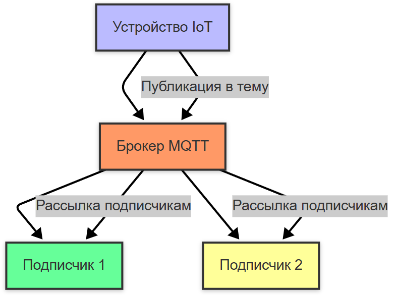

---
title: 7.05. Асинхронная коммуникация
---

# 7.05. Асинхронная коммуникация

  В РАЗРАБОТКЕ
  НЕ ДЛЯ НОВИЧКОВ
  НЕ ОБЯЗАТЕЛЬНО

Разработчику
Архитектору
Инженеру

## Асинхронная коммуникация

Мы уже изучали асинхронность, поэтому можем уже понять, что асинхронная коммуникация — это способ взаимодействия, при котором отправитель не ждёт немедленного ответа от получателя. Это особенно важно в распределённых системах, где синхронные вызовы могут привести к задержкам или блокировкам. При таком решении используется либо очередь, либо события. Мы их ранее рассматривали вкратце.

Примерами асинхронного взаимодействия может являться:
	- SMTP, отправка электронной почты. Клиент отправляет письмо, но не ждёт подтверждения его доставки получателю.
	- JMS (Java Message Service), использование очередей сообщений для передачи данных между системами.
	- RabbitMQ/Kafka, брокеры сообщений, которые позволяют асинхронно обмениваться данными.

**Очереди сообщений (Message Queues или MQ)** подразумевает, что сообщения помещаются в очередь, и сервисы обрабатывают их по мере готовности. 

Примеры решений - RabbitMQ, Apache Kafka, Amazon SQS. Используется для задач, которые могут выполняться в фоновом режиме (например, отправка email).

Транспорт в асинхронной коммуникации:
	- SMTP;
	- AMQP;
	- MQTT;
	- Kafka.

**SMTP (Simple Mail Transfer Protocol)** — это протокол для отправки электронной почты. Он используется для передачи сообщений между почтовыми серверами или от клиента к серверу. Письмо отправляется, но доставка может занять время. Для повторной отправки в случае сбоя используются очереди.

**MQTT (Message Queuing Telemetry Transport)** — это лёгкий протокол для передачи данных в условиях ограниченной пропускной способности или нестабильного соединения. Он часто используется в IoT (Интернет вещей). Устройства могут подписываться на темы и получать обновления.

**AMQP (Advanced Message Queuing Protocol)** — это протокол для асинхронного обмена сообщениями между системами через брокеры сообщений (например, RabbitMQ). Сообщения хранятся в очередях до тех пор, пока не будут обработаны.

Apache Kafka — это платформа для потоковой передачи данных. Она позволяет системам обмениваться событиями в реальном времени.

Kafka и RabbitMQ мы разберём отдельно.
