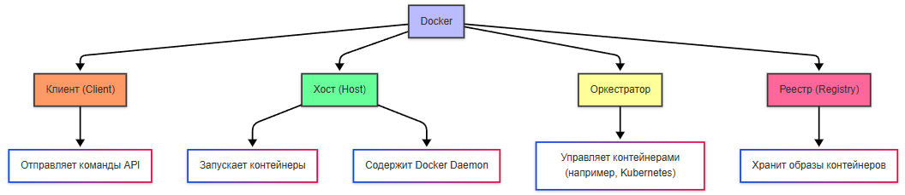
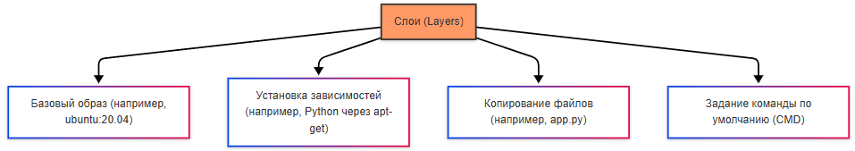
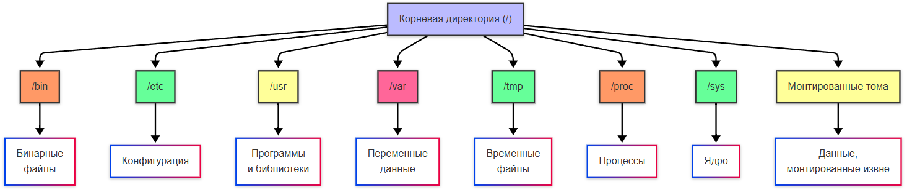

---
title: 7.06. Контейнеризация и оркестрация
---

# 7.06. Контейнеризация и оркестрация

# Раздел в разработке

## Контейнеризация

Контейнеризация, процесс развертывания с использованием контейнеров сейчас – важная часть разработки ПО.

★ **Контейнер** – «коробка», в которую упаковали приложение, со всеми нужными компонентами, чтобы просто можно было перенести эту «коробку» и запустить в другой среде. Только представьте, как это упрощает процесс доставки технологий между разными серверами.

Виртуальная машина
 


Контейнер


Это продвинутая часть разработки, но и технологии не стоят на месте. Изначально, приложения развёртывались на физических серверах (это традиционный подход, сейчас его тоже можно встретить), когда выделяется один сервер, на нем есть операционная система, набор ресурсов и среда для выполнения со всеми необходимыми компонентами. Но с ресурсами всегда беда – зависимость и дороговизна устройств, необходимость поддержки серверных. Тогда появился подход виртуальных машин, когда более крупные центры обработки данных закупались крупными мощностями и выделяли эти мощности в виде виртуальных машин (ВМ), когда на одном сервере можно было создать эти ВМ, распределять ресурсы между ними. Это подарило гибкость и устойчивость – ВМ проще восстановить, и ей легко добавить ресурсов, да и приложения становятся изолированными. И фактически, сервера стали кластерами ВМ.


Позднее, появились контейнеры – более лёгкие решения, которые тоже обладают своей файловой системой, процессором, памятью и компонентами, используя ресурсы ОС, но дают больше преимуществ:
	- можно легко создать контейнер из образа;
	- простой и быстрый откат образа контейнера;
	- распределение задач во время сборки (то есть ДО развертывания на целевой инфраструктуре);
	- наблюдаемость с информацией и метриками;
	- независимость от платформ, переносимость, и идентичная окружающая среда, независимо – на ПК или в облаке;
	- возможность разбивать микросервисы по приложениям, а не ВМ;
	- большая компактность.

Контейнеры не требуют отдельной операционной системы для каждого экземпляра, в отличие от виртуальных машин, что снижает потребление ресурсов. Запуск и остановка контейнеров происходит быстро - на сервере установлена одна операционная система, которая используется всеми контейнерами.


## Docker

★ **Docker** – платформа для «упаковки» контейнеров, их доставки и запуска. Это фабрика для производства этих «коробок».

Docker имеет модульную архитектуру, состоящую из следующих частей:
	- клиент (Client);
	- хост (Host);
	- оркестратор;
	- реестр (Registry).




**Клиент** (Client) - интерфейс для взаимодействия с Docker, выполняющий команды (например, docker build, docker run). Эти команды отправляются в Docker Daemon через REST API;

**Хост** (Host) содержит в себе:
	- Docker Daemon, управляющий образами, контейнерами, сетями и томами;
	- Образы (Images) - шаблоны для создания контейнеров;
	- Контейнеры (Containers) - запущенные экземпляры образом.

**Демон Docker**, или dockerd, это инструмент, который функционирует на системе хоста, и управляет объектами Docker. Он позволяет создавать образы, загружать их или загружать из удалённых репозиториев. Демон используется для создания контейнеров из образов и контролирует их жизненный цикл.

Демон настраивает и управляет сетевым взаимодействием между контейнерами и между контейнерами и хостом, управляет постоянным хранением данных, позволяя удерживать данные контейнеров отдельно от их собственного цикла.

**Образ** — это некий шаблон, который содержит в себе готовый «чертёж» для запуска экземпляров контейнеров.

А контейнер — это уже готовый экземпляр образа.

Да, аналогия с классами и объектами из ООП подходит как раз отлично - образ это как класс, а объект — это контейнер.

Оркестратор — это инструмент для управления кластерами контейнеров. О них мы поговорим отдельно.

**Реестр** (Registry) - хранилище для образов. О них мы тоже поговорим.

Host - операционная система, на которой установлен Docker. Это может быть Linux, Windows, macOS, виртуальная машина или физическое устройство. Роль хоста - предоставление ресурсов для работы контейнеров и хранение образов, контейнеров и томов. Если мы запускаем контейнеры на виртуальной машине, она является хостом.

Важно: Docker сам по себе Linux-проект, поэтому в нём нет прямой поддержки Windows и macOS – используются средства виртуализации.

Можете ознакомиться с Docker на официальном сайте - там много документации и подробностей, а также возможность скачать Docker Desktop: 

https://www.docker.com/ 


Принцип работы:
	- подготовка - на машине разработчика устанавливается и настраивается Docker (понадобится клиент и демон);
	- разработка - приложение разрабатывается как обычно;
	- формирование Dockerfile (IDE сейчас автоматически генерируют его, если включена поддержка Docker);
	- сборка образа - в клиенте выполняется команда docker build, отправляется команда в daemon и создается образ в реестре;
	- тестирование - на тестовой среде запускается контейнер из образа через docker pull;
	- деплой - на продакшен среде выполняется настройка Docker, затем в клиенте – команда docker pull и загружается образ;
	- запуск - на целевой среде выполняется docker run и контейнер создается из нужного образа.


Для обновления цикл повторяется, ибо будет новый образ.


Пример выше – демон Docker создает контейнер из образа myapp:1.0, называет его myapp и пробрасывает порт 8080 хоста на порт 80 контейнера.

При деплое важно учесть, что на среде тестирования или развертывания Docker важно убедиться в обеспечении зависимостей – поэтому всё необходимое нужно установить и сконфигурировать, допустим базу данных.

Чит-лист - https://cheatsheets.zip/docker

**docker pull** загружает образ из реестра, по принципу:
```bash
docker pull [OPTIONS] IMAGE[:TAG|@DIGEST]
```

Пример:
```bash
docker pull nginx:latest
```

	- IMAGE : Имя образа (например, nginx).
	- TAG : Версия образа (например, latest).

Клиент при этом отправляет запрос в реестр (по умолчанию Docker Hub), и если образ найден, он скачивается и сохраняется локально.


**docker build** создаёт новый образ на основе Dockerfile:
```bash
docker build [OPTIONS] PATH | URL | -
```
 
Основные опции:
	- `-t`: Задает имя и тег образа.
	- `-f`: Указывает путь к Dockerfile (если он не находится в текущей директории).
Пример:
```bash
docker build -t my-app:1.0 -f /path/to/Dockerfile .
```


	- PATH : Контекст сборки (текущая директория или путь к файлам).
	- IMAGE : Имя образа (my-app).
	- IMAGE_TAG : Тег образа (1.0).

Docker читает Dockerfile, выполняет инструкции по порядку, создавая слои, и сохраняет финальный образ в локальном хранилище.

**docker run** запускает контейнер из образа:
 
```bash
docker run [OPTIONS] IMAGE [COMMAND] [ARG...]
```
 
Основные опции:
	- `-p` HOST_PORT:CONTAINER_PORT: Проброс портов.
	- `-d`: Запуск в фоновом режиме (detached mode).
	- `-it`: Интерактивный режим (для терминала).
	- `--name`: Задает имя контейнера.
Пример:
```bash
docker run -d -p 8080:80 --name my-nginx nginx
```

	- HOST_PORT : Порт на хостовой системе (8080).
	- CONTAINER_PORT : Порт внутри контейнера (80).

Docker проверяет, есть ли образ локально. Если образа нет, он скачивается из реестра, а затем создаётся и запускается контейнер.

**docker push** загружает образ в реестр:
```bash
docker push NAME[:TAG]
```

 
Пример:
```bash
docker push my-dockerhub-username/my-app:1.0
```
 
Docker отправляет образ в указанный реестр, и если реестр требует авторизации используется команда docker login.

Таким образом, суть Docker в том, чтобы не просто разработать приложение, а упростить его развёртывание на любых системах. Нужно просто установить сам движок Docker, выполнить сборку образа, и развернуть экземпляр образа на целевой машине в виде контейнера. Допустим, можно просто поставить Docker на сервер, скачать готовый образ из реестра и буквально одной командой запустить программу. Это очень удобно для развёртывания фоновых служб и сервисов.

```yml
# Сначала установка зависимостей
COPY requirements.txt .
RUN pip install -r requirements.txt

# Потом копирование кода
COPY . .
```

Так и выполнить многоступенчатую сборку, создавая лёгкие образы, исключая ненужные зависимости:

```yml
# Стадия 1: Сборка приложения
FROM golang:1.20 AS builder
WORKDIR /app
COPY . .
RUN go build -o myapp .

# Стадия 2: Финальный образ
FROM alpine:latest
WORKDIR /app
COPY --from=builder /app/myapp .
CMD ["./myapp"]

```

Тут в стадии №1 собирается приложение с использованием Go, а на стадии №2 создаётся минимальный образ на основе Alpine, копируя только исполняемый файл.

Но о Dockerfile и его особенностях мы поговорим позже.

Docker Compose - инструмент для управления многоконтейнерными приложениями. Он позволяет описать все сервисы, тома и сети в одном файле - docker-compose.yml.

От Docker CLI он отличается тем, что работает с несколькими контейнерами одновременно. Подробнее можно узнать в официальной документации:

https://docs.docker.com/compose/

Пример файла docker-compose.yml:
```yml
version: '3.8'
services:
  web:
    image: nginx:latest
    ports:
      - "8080:80"
  app:
    build: .
    ports:
      - "5000:5000"
  db:
    image: postgres:13
    environment:
      POSTGRES_PASSWORD: example

```

Основные разделы docker-compose.yml:
	- version : Версия формата файла.
	- services : Описание сервисов (контейнеров).
	- networks : Настройка сетей.
	- volumes : Настройка томов.
Запуск:
```bash
docker-compose up
```
Так запускаются все сервисы, описанные в docker-compose.yml.

Запуск в фоновом режиме:
```bash
docker-compose up -d
```
Остановка и удаление контейнеров:
```bash
docker-compose down
```
Просмотр логов:
```bash
docker-compose logs
``` 

**Масштабирование** – способность системы увеличивать или уменьшать количество экземпляров приложения в зависимости от нагрузки. Допустим, если пиковая нагрузка, для отказоустойчивости создаются экземпляры, если один упадёт, другие продолжат работу.

В Docker масштабирование ручное и требует дополнительных инструментов (docker-compose), когда создается файл yaml, выполняется команда scale и запускаются контейнеры. При этом балансировки нагрузки нет, автоматики нет, если контейнер упадёт, его не перезапустят, и именно поэтому требуется оркестрация – чтобы масштабировать приложения автоматически и интеллектуально.
Но давайте изучим всё поэтапно.


### **Список команд и шаблон построения команд для Docker**

Команды Docker делятся на несколько категорий в зависимости от управляемой сущности:

- **Управление образами**:  
  `docker build`, `docker pull`, `docker push`, `docker images`, `docker rmi`, `docker tag`, `docker save`, `docker load`.

- **Управление контейнерами**:  
  `docker run`, `docker start`, `docker stop`, `docker restart`, `docker kill`, `docker ps`, `docker logs`, `docker exec`, `docker rm`.

- **Управление сетями**:  
  `docker network create`, `docker network connect`, `docker network ls`, `docker network inspect`.

- **Управление томами**:  
  `docker volume create`, `docker volume ls`, `docker volume inspect`, `docker volume rm`.

- **Системные команды**:  
  `docker info`, `docker version`, `docker system df`, `docker system prune`.

**Шаблон построения команд**:  
Большинство команд Docker подчиняются паттерну:  
`docker <объект> <подкоманда> [опции] [аргументы]`,  
где `<объект>` — это сущность (например, `container`, `image`, `network`), а `<подкоманда>` — действие (`ls`, `rm`, `inspect` и т. д.). В большинстве случаев допустимо сокращённое написание без указания объекта (например, `docker ps` вместо `docker container ps`).

---

### **Список команд для Kubernetes**

Kubernetes (kubectl) предоставляет декларативный и императивный интерфейсы управления кластером:

- **Основные операции**:  
  `kubectl get`, `kubectl describe`, `kubectl apply`, `kubectl delete`, `kubectl create`, `kubectl edit`.

- **Работа с подами и развертываниями**:  
  `kubectl logs`, `kubectl exec`, `kubectl port-forward`, `kubectl rollout status`, `kubectl scale`.

- **Конфигурация и контексты**:  
  `kubectl config view`, `kubectl config use-context`, `kubectl config set-context`.

- **Отладка и мониторинг**:  
  `kubectl top pod`, `kubectl top node`, `kubectl explain`.

- **Управление манифестами**:  
  `kubectl apply -f <file>`, `kubectl delete -f <file>`, `kubectl diff -f <file>`.

Команды обычно следуют паттерну:  
`kubectl <ресурс> <действие> [имя] [флаги]`,  
где ресурс — `pod`, `deployment`, `service` и т. д.

---

### **Синтаксис Dockerfile**

Dockerfile — текстовый файл, описывающий пошаговое построение образа. Каждая инструкция создаёт слой в образе. Основные директивы:

- `FROM <image> [AS <name>]` — базовый образ.
- `RUN <command>` — выполнение команды в слое.
- `COPY [--chown=<user>:<group>] <src>... <dest>` — копирование файлов из контекста сборки.
- `ADD` — расширенная версия COPY (поддерживает URL и авто распаковку архивов).
- `WORKDIR <path>` — установка рабочей директории.
- `ENV <key>=<value>` — установка переменных окружения.
- `EXPOSE <port>` — документирование портов (не открывает их).
- `CMD ["executable", "param1", "param2"]` — команда по умолчанию при запуске контейнера.
- `ENTRYPOINT ["executable", "param1", "param2"]` — точка входа, которую `CMD` дополняет аргументами.
- `USER`, `VOLUME`, `ARG`, `LABEL`, `HEALTHCHECK` — дополнительные возможности.

Рекомендуется соблюдать best practices: минимизация слоёв, кэширование зависимостей, отказ от `latest` тегов.

---

### **Применимость Docker: только сервисы и веб-приложения или и десктоп тоже?**

Docker изначально ориентирован на **серверные (headless)** приложения: веб-сервисы, микросервисы, фоновые обработчики, CLI-утилиты, батч-процессы. Причины:

- Контейнеры не имеют собственного графического стека.
- Отсутствие прямого доступа к аппаратным ресурсам (GPU, звук, дисплей) без дополнительной настройки.

Тем не менее, **графические приложения можно запускать в контейнерах**, если:
- Хост предоставляет X11/Wayland сокет или используется VNC/RDP.
- Для Windows — через RDP или GPU-ускорение через WSL2.
- Примеры: запуск браузера внутри контейнера для тестирования, графические редакторы в облаке.

Однако такие сценарии не соответствуют основной парадигме контейнеризации — изоляции, масштабируемости, statelessness. Для десктопных приложений (особенно интерактивных) обычно предпочтительнее традиционная установка или пакетные форматы (AppImage, Flatpak, MSI).

---

### **containerd, runC, InfraKit**

Эти компоненты образуют низкоуровневый стек контейнеризации:

- **runC** — эталонная реализация спецификации OCI (Open Container Initiative). Отвечает за создание и запуск контейнера на основе `config.json` и корневой файловой системы. Это низкоуровневый инструмент, обычно не используется напрямую.

- **containerd** — демон уровня хоста, управляющий жизненным циклом контейнеров, образами, сетями и томами. Использует runC для запуска контейнеров. Docker и Kubernetes (через CRI) могут взаимодействовать с containerd.

- **InfraKit** — устаревший проект от Docker (архивирован в 2019 г.), предназначенный для декларативного управления инфраструктурой (например, группами виртуальных машин). Не имеет отношения к runtime контейнеров и сегодня не используется в основных сценариях.

Современный стек: **Kubernetes → CRI → containerd → runC → ядро Linux**.

---

### **Контейнер как файл, tar-файл**

Контейнер сам по себе **не является файлом**. Это изолированный процесс с монтированной файловой системой (образ + слой изменений). Однако связанная с ним информация может быть представлена в виде архивов:

- **Образ** можно сохранить в tar-архив:  
  `docker save -o image.tar <image>` — сохраняет образ со всеми слоями и метаданными в формате, совместимом с Docker.

- **Файловая система работающего контейнера** может быть экспортирована:  
  `docker export <container> > fs.tar` — создаёт tar-архив корневой файловой системы контейнера (без истории слоёв и метаданных).

- На уровне OCI, образ представляет собой набор JSON-манифестов и слоёв (обычно в формате `.tar.gz`), хранящихся в registry.

Таким образом, **контейнер — это runtime-состояние**, а **образ — сериализуемый артефакт**, который может быть представлен как tar-файл или набор слоёв в registry.

---

## Объекты Docker

1. ★ **Образ (Image)** — это неизменяемый шаблон, содержащий все необходимые компоненты для запуска приложения: код, библиотеки, зависимости, переменные среды и конфигурации. Образ, как мы ранее заметили, можно сравнить с «чертежом» или «шаблоном», по которому создаётся контейнер.

Образ является неизменяемым (immutable), состоит из слоёв (layers), каждый из которых представляет собой изменение в файловой системе. Образ может быть загружен из реестра или создан локально с помощью Dockerfile.

Образ — это «снимок» (snapshot) файловой системы, который содержит:
	- операционную систему (например, Linux);
	- установленные зависимости (библиотеки, пакеты);
	- исходный код приложения;
	- команды для запуска приложения.

Неизменяемость (иммутабельность) означает, что после создания образ нельзя изменить напрямую. Любые изменения требуют создания нового образа на основе старого.

Слои образа организованы в виде стека (stack), где каждый новый слой добавляется поверх предыдущего. Каждый слой создаётся на основе инструкции в Dockerfile (например, RUN, COPY, ADD). Слои сохраняются в кэше Docker, что позволяет повторно использовать их при создании новых образов.

При запуске контейнера Docker монтирует все слои в единое дерево файловой системы с помощью технологии Union File System.

Предположим, у нас есть Dockerfile:
```yml
FROM ubuntu:20.04
RUN apt-get update && apt-get install -y python3
COPY app.py /app/app.py
CMD ["python3", "/app/app.py"]

```

Слои будут выглядеть так:
	- Базовый образ (ubuntu:20.04) — первый слой.
	- Установка Python через apt-get — второй слой.
	- Копирование файла app.py — третий слой.
	- Задание команды по умолчанию (CMD) — четвёртый слой.

Каждый слой хранится отдельно, и если вы измените только последнюю строку в Dockerfile, то пересоздастся только последний слой, а остальные останутся без изменений. Это делает сборку образов быстрой и эффективной.


Образ также включает манифест - JSON-файл, который описывает метаданные образа:
	- Архитектура (например, amd64, arm64).
	- Версию Docker.
	- Список слоёв с их хешами.
	- Информацию о конфигурации (например, переменные окружения, порты, команды).

Манифест позволяет Docker понять, как собрать слои в единый образ и как запустить контейнер.

Образ можно создать двумя способами - локально, лишь добавив в папку проекта Dockerfile и выполнив команду docker build, и загрузкой из реестра через docker pull.

Размер образа зависит от его содержимого. Чем больше слоёв и зависимостей, тем больше размер. Для оптимизации размера, используют следующие подходы:
	- минимизация базового образа (использование легковесного образа в FROM);
	- удаление ненужных файлов, к примеру, очистка кэша пакетного менеджера:
```yml
RUN apt-get update && apt-get install -y python3 && rm -rf /var/lib/apt/lists/*
```
	- многоэтапная сборка - использование нескольких этапов для минимизации финального образа.

Чтобы исследовать содержимое образа, можно использовать следующие команды:
	- `docker history <имя образа>` - список слоёв;
	- `docker insperct <имя образа>` - информация об образе;
	- `docker run --rm -it <имя образа> sh` - запуск временного контейнера для исследования.

Структура образа:


Слои:



Манифест:


Метаданные:


2. ★ **Контейнер (Container)** - экземпляр образа. Это «живой» объект, который можно запустить, остановить, изменить и удалить. Это «коробка», собранная по чертежу.

Контейнер является изменяемым (mutable) - внутри него можно создавать, изменять и удалять файлы. Контейнер изолирован, работает в собственной среде, изолированной от хостовой системы (используются namespaces и cgroups).

3. ★ **Хранилища (Volumes)** - механизм для сохранения данных вне контейнера. Они позволяют данные сделать постоянными, даже если контейнер удаляется. Данные сохраняются на хостовой системе. Хранилища можно использовать для баз данных, кэширования или общих файлов между контейнерами.

Тома Docker играют ключевую роль для хранения и управления данными. Они позволяют сохранять данные между перезапусками контейнеров, обмениваться данными между контейнерами и управлять данными независимо от жизненного цикла контейнера.

Тома находятся в специальном каталоге на хосте (например, /var/lib/docker/volumes в Linux). Docker автоматически управляет этим каталогом.

**Как работать с томами?**

Создание тома:
```bash
docker volume create my-volume
```
 
Это создаст новый том с именем my-volume.

Монтирование тома в контейнер (подключение):
```bash
docker run -d --name my-container -v my-volume:/app/data nginx
```
 
Здесь -v my-volume:/app/data монтирует том my-volume в директорию /app/data внутри контейнера.

Просмотр существующих томов:
```bash
docker volume ls
```
 
Инспектирование тома:
```bash
docker volume inspect my-volume
```
 
Это покажет метаданные тома, включая его расположение на хосте.

Удаление тома:
```bash
docker volume rm my-volume
```
 
Очистка неиспользуемых томов:
```bash
docker volume prune
```
 
Эта команда удаляет все тома, которые не используются ни одним контейнером.

Когда запускается контейнер, Docker создаёт изолированную файловую систему на основе образа. Файловая система контейнера основана на слоях образа и может быть исследована с помощью команды docker exec. Пример структуры:
	- корневая директория (/) Содержит стандартные папки UNIX, такие как /bin, /etc, /usr, /var.
	- /bin: Бинарные файлы (команды).
	- /etc: Конфигурационные файлы.
	- /usr: Программы и библиотеки.
	- /var: Переменные данные (логи, базы данных и т.д.).
	- /tmp: Временные файлы.
	- /proc: Виртуальная файловая система, предоставляющая информацию о процессах и системе.
	- /sys: Информация о ядре и устройствах.
	- монтированные тома.

Проверить монтированные тома можно с командой mount.

Таким образом, файловая система контейнера содержит стандартные UNIX-директории.




Docker использует стандартные возможности ядра Linux (namespaces, cgroups, chroot, seccomp, overlayfs), оборачивая их в удобный интерфейс.
Как мы ранее упомянули, контейнеры используют Namespaces.

Namespaces - механизм изоляции в Linux, создающий для контейнера:
	- PID namespace - свой процессный ID;
	- MNT namespace - файловую систему;
	- NET namespace - сеть;
	- UTS namespace - имя хоста (hostname);
	- IPC namespace - межпроцессное взаимодействие.

Таким образом, благодаря Namespace, контейнер видит некую «мини-ОС».

Cgroups ограничивают и учитывают ресурсы, такие как CPU, ОЗУ, ввод-вывод и сеть. Именно здесь работает логика контроля за использованием ресурсов, когда в случае превышения установленного лимита, Docker останавливает работу контейнера.

UFS (Union File System) представляет собой многослойную файловую систему. Каждый шаг Dockerfile создаёт новый слой. UFS позволяет объединить несколько слоёв (layers) в единое дерево файловой системы, обеспечивая эффективное использование дискового пространства и быстрое создание новых образов.

Основные принципы UFS:
	- Слои (layers): Каждый слой представляет собой набор изменений в файловой системе.
	- Объединение (union): Слои накладываются друг на друга, формируя единое представление файловой системы.
	- Изменяемость: Только верхний слой может быть изменяемым (writable), остальные слои доступны только для чтения (read-only).

Типы слоёв:
	- Read-only layers: Слои, которые создаются при сборке образа (например, базовый образ, установленные зависимости). Эти слои неизменяемы.
	- Writable layer: Верхний слой, который создаётся при запуске контейнера. Все изменения (например, создание файлов, запись данных) происходят именно в этом слое.

Пример:

```yml
FROM ubuntu:20.04
RUN apt-get update && apt-get install -y python3
COPY app.py /app/app.py
CMD ["python3", "/app/app.py"]
```

Слои здесь будут выглядеть так:
	- Базовый образ (ubuntu:20.04) — read-only.
	- Установка Python через apt-get — read-only.
	- Копирование файла app.py — read-only.
	- Верхний слой (writable) — используется для работы контейнера.

На хосте слои хранятся в каталоге /var/lib/docker. Docker использует одну из реализаций UFS (например, OverlayFS, AUFS) для управлениями этими слоями.

OverlayFS это современная реализация UFS, используемая по умолчанию в Docker.  Она включает в себя следующие особенности:
	- Lowerdir: Read-only слои (нижние уровни).
	- Upperdir: Writable слой (верхний уровень).
	- Workdir: Временный каталог для операций слияния.
	- Merged: Объединённое представление файловой системы.

Другие реализации UFS - AUFS (Advanced Multi-Layered Unification Filesystem, используется в старых версиях Docker) и Btrfs/ZFS (альтернативные файловые системы с поддержкой UFS).

Когда образ загружается в реестр, каждый слой сжимается и отправляется отдельно. Это позволяет повторно использовать слои между образами.
Слои используют кэширование. Если два образа имеют общие слои, они будут использоваться совместно. Например, если два образа основаны на одном базовом образе, то этот базовый образ будет храниться только один раз. При изменении одного шага в Dockerfile пересоздаётся только соответствующий слой, а остальные слои остаются без изменений. Каждый контейнер получает свой собственный writable слой. Это гарантирует, что изменения в одном контейнере не влияют на другие.

У каждого контейнера есть своя среда - Container Runtime, это ПО, которое отвечает за запуск и управление контейнерами, обеспечивая изоляцию процессов, файловой системы и сетевых ресурсов. 

Примеры популярных Container Runtime:
	- runc: Стандартный runtime, используемый Docker.
	- containerd: Уровень абстракции над runc, который управляет контейнерами.
	- CRI-O: Альтернатива containerd, часто используется в Kubernetes.

Контейнер живёт, пока жив его процесс (основной процесс, PID 1). Если этот процесс завершается, контейнер также останавливается.

Чтобы проверить основной процесс, можно использовать команду:
```bash
docker top my-container
```


Чтобы контейнер автоматически перезапускался при завершении процесса, используйте флаг --restart:
```bash
docker run -d --name my-container --restart always nginx
```


## DockerHub и реестры образов

У новичка может возникнуть вопрос - а как узнать название нужного образа, чтобы из него развернуть контейнер?

По аналогии с GitHub, у Docker есть свой реестр с тысячами готовых образов - Docker Hub. Это самое популярное место для поиска и загрузки образов.

1. Поиск через интерфейс.

Чтобы найти образы на Docker Hub, нужно перейти на сайт (https://hub.docker.com/), и в строке поиска ввести название приложения или технологии, например, nginx, mysql, python. Кроме официальных образов, есть и пользовательские. многие могут быть и полезны, но стоит проверять на надёжность. Официальные образы помечены как Official Image.

После того, как нашли нужный образ, вы можете запустить его с помощью команды docker run. Например:
```bash
docker run -d -p 80:80 nginx
```

Эта команда скачает и запустит официальный образ Nginx.

2. Поиск образов через CLI.

Если вы предпочитаете работать в терминале, Docker предоставляет команду docker search, которая позволяет искать образы прямо из командной строки. Пример:
```bash
docker search python
```
 
Вывод команды будет в виде таблицы:
	- NAME : Название образа.
	- DESCRIPTION : Краткое описание.
	- STARS : Популярность образа (чем больше звезд, тем лучше).
	- OFFICIAL : Указывает, является ли образ официальным.
	- AUTOMATED : Указывает, был ли образ автоматически собран.

3. Другие реестры контейнеров.

Помимо Docker Hub, существуют другие реестры образов:
	- Quay.io — альтернативный реестр контейнеров, который часто используется для корпоративных проектов.
	- GitHub Container Registry — реестр, интегрированный с GitHub. Многие проекты публикуют свои образы здесь.
	- Amazon ECR — сервис AWS для хранения и управления Docker-образами.
	- Google GCR — реестр от Google Cloud.

Если хотим использовать образ из другого реестра, нужно указать полный путь к образу, включая домен реестра. Например:
```bash
docker run quay.io/bitnami/nginx
```

Для работы с Amazon ECR придётся сначала выполнить аутентификацию:
```bash
aws ecr get-login-password | docker login --username AWS --password-stdin <aws_account_id>.dkr.ecr.<region>.amazonaws.com
```
И только затем можно запустить образ:
```bash
docker run <aws_account_id>.dkr.ecr.<region>.amazonaws.com/repo-name:tag
```

Каждый образ может иметь несколько версий, которые обозначаются тегами. Теги позволяют выбирать конкретную версию образа:
```bash
docker run python:3.9
docker run python:3.10
docker run python:latest

```
latest: Последняя версия (по умолчанию).

Увидеть доступные теги можно на странице образа в реестре. К примеру, на Docker Hub будет вкладка Tags.


4. Создание своих образов.

Если вы не нашли подходящий образ, вы можете создать свой, используя Dockerfile. После создания образа вы можете загрузить его в Docker Hub или другой реестр.

Нужно сначала создать аккаунт на Docker Hub, а затем авторизоваться в CLI:
```bash
docker login
```
Потом нужно пометить образ:
```bash
docker tag my-image username/my-image:tag
```
И загрузить:
```bash
docker push username/my-image:tag
```
5. Локальные образы.

Когда выполняется команда docker run, Docker сначала проверяет, есть ли запрашиваемый образ локально. Если образ не найден, Docker автоматически пытается скачать его из реестра (Docker Hub).

Когда запускается команда `docker run <image>:<tag>`, Docker выполняет следующие шаги:
	- Docker проверяет, есть ли указанный образ в локальном хранилище образов на ПК. Локальное хранилище — это кэш, где хранятся все образы, которые скачали или создали. Если тег не указан, будет подставляться тег latest.
	- Если образ существует в локальном хранилище, Docker будет использовать его для запуска;
	- Если образ не найден локально, Docker пытается скачать его из удалённого реестра:
		- отправляет запрос в реестр, чтобы найти образ с указанным именем и тегом;
		- если образ найден, он скачивается и сохраняется в локальном хранилище;
		- после загрузки образа Docker запускает контейнер.

Таким образом, Docker работает по приоритету:
```
Локальное хранилище - Удалённый реестр - Ошибка (если нет нигде).
```
Локальные образы хранятся в системе в виде слоёв (layers). Каждый слой представляет собой изменение, сделанное в процессе сборки образа. Это позволяет эффективно использовать дисковое пространство и кэширование.

Локальные образы хранятся в каталоге Docker на компьютере. Расположение зависит от операционной системы:
	- Linux : /var/lib/docker/
	- Windows (Docker Desktop) : Внутри виртуальной машины WSL2 или Hyper-V.
	- macOS (Docker Desktop) : Внутри виртуальной машины.
Чтобы увидеть список всех локальных образов, используется команда:
```bash
docker images
```
В выводе будут следующие столбцы:
	- REPOSITORY : Имя образа.
	- TAG : Тег образа (версия).
	- IMAGE ID : Уникальный идентификатор образа.
	- CREATED : Дата создания образа.
	- SIZE : Размер образа.

Чтобы удалить образ, используется команда:
```bash
docker rmi <image_id>
```
Если образ используется хотя бы одним контейнером (даже остановленным), Docker выдаст ошибку. Поэтому перед удалением образа нужно удалить сначала контейнер:
```bash
docker rm <container_id>
```
Когда Docker скачивает образ из удалённого реестра, он делает это поэтапно, слой за слоем. Образ состоит из нескольких слоёв, каждый из которых соответствует одной инструкции в Dockerfile. Например:
```bash
FROM ubuntu:20.04
RUN apt-get update
RUN apt-get install -y python3

```
Здесь будет три слоя:
	- Базовый образ ubuntu:20.04.
	- Результат выполнения apt-get update.
	- Результат выполнения apt-get install -y python3.

Docker загружает только те слои, которых ещё нет в локальном хранилище. Если часть слоёв уже есть (например, базовый образ ubuntu:20.04), Docker использует их повторно.

Чтобы узнать, какие образы были скачаны из удалённого реестра, а какие созданы локально, используйте команду:
```bash
docker inspect <image_id>
```

Docker активно использует кэширование для оптимизации работы с образами. Если вы запускаете один и тот же образ несколько раз, Docker не будет заново скачивать его, если он уже есть локально. Если вы создаёте новый образ с помощью Dockerfile, Docker использует кэширование слоёв, чтобы ускорить процесс сборки.

## Работа с Docker

### Ресурсы

Прежде, чем работать с Docker, нужно позаботиться о ресурсах - их правильное распределение будет ключевым аспектом успешной работы.

Когда вы запускаете контейнеры, они используют ресурсы хостовой системы (допустим, виртуальной машины). Если контейнеры потребляют больше ресурсов, чем доступно на хосте, это приводит к проблемам:
	- нехватка памяти - ОС начинает использовать подкачку (swap), что сильно замедляет работу;
	- перегрузка CPU - процессор не справляется с нагрузкой, и система становится непригодной для использования;
	- завершение процессов - ОС может принудительно завершить процессы, чтобы освободить ресурсы.

Минимальные требования зависят от типа запускаемых контейнеров.

Нужно определить, сколько нужно самой системе и всем базовым программам на сервере или компьютере (допустим, 4-8 ГБ ОЗУ), и добавить к этому ресурсы для контейнеров.

Для простых и легковесных контейнеров - минимум 2 ГБ и 1 ядро.

То есть, если вы захотите развернуть докер на своём стареньком ПК с 2 ГБ и парой ядер - будьте уверены в том, что система не справится.
А если, к примеру, вы разворачиваете веб-приложение, которое само по себе «кушает» 2-3 ГБ, а вдобавок ещё MongoDB, PostgreSQL/MySQL - каждый из них будет просить по 2 ГБ ОЗУ. И если добавить к ним ElasticSearch, то для него минимум 4-8 ОЗУ (для больших индексов нужно ещё больше).

Таком образом, если ссуммировать, получится так, что хост должен обладать не менее, чем 10 ГБ ОЗУ и 5 ядер CPU.
К тому же, важно добавлять резерв - 20-30% для ОС и других процессов. К примеру, если контейнеры требуют 6,5 ГБ ОЗУ, хост должен иметь минимум 8-9 ГБ.

Поэтому просто развернуть кучу сервисов на слабом железе не получится. Если вы запускаете несколько контейнеров (веб-сервер, API, база данных), убедитесь, что суммарные ресурсы всех контейнеров не превышают доступные ресурсы хоста.
Но Docker позволяет ограничить ресурсы для каждого контейнера. Это помогает предотвратить ситуацию, когда один контейнер «съедает» все ресурсы системы.

1. Ограничение памяти.

Используйте флаг --memory для ограничения объёма ОЗУ, доступного контейнеру:
```bash
docker run -d --name my-container --memory="2g" my-image
```

В таком случае, контейнер сможет использовать не более 2 ГБ ОЗУ. Если контейнер попытается использовать больше памяти, он будет остановлен.
2. Ограничение CPU.
Используйте флаги --cpus и --cpu-shares для управления CPU:

--cpus: ограничивает количество ядер, доступных контейнеру:
```bash
docker run -d --name my-container --cpus="1.5" my-image
```
 
здесь контейнер сможет использовать до 1,5 ядра.

--cpu-shares задаёт относительный вес для разделения CPU между контейнерами:
```bash
docker run -d --name my-container --cpu-shares=512 my-image
```
 
По умолчанию значение равно 1024. Чем меньше значение, тем меньше CPU получит контейнер.

3. Ограничение подкачки (swap).

Используйте флаг --memory-swap, чтобы ограничить использование подкачки:
```bash
docker run -d --name my-container --memory="2g" --memory-swap="3g" my-image
```
 
Здесь общий лимит памяти (ОЗУ+swap) равен 3 ГБ. Если контейнер использует большк 3 ГБ, он будет остановлен.

4. Использование Docker Compose для управления ресурсами.

В файле docker-compose.yml можно задать ограничения ресурсов. К примеру:
```yml
version: '3.8'
services:
  mongodb:
    image: mongo
    deploy:
      resources:
        limits:
          cpus: '1.5'
          memory: 2g
  elasticsearch:
    image: elasticsearch:7.10.1
    deploy:
      resources:
        limits:
          cpus: '2'
          memory: 4g

```
 

Как проверить использование ресурсов?

Чтобы избежать перегрузки системы, важно регулярно мониторить использование ресурсов. Команда docker stats показывает использование ресурсов всему запущенными контейнерами:

```bash
docker stats
```
 
В выводе будет указано использование CPU, ОЗУ, сети.
Кроме docker-stats, важно использовать и стандартные инструменты мониторинга хостовой системы:
	- Linux : htop, free -h, vmstat.
	- Windows/macOS : Диспетчер задач или Activity Monitor.

Таким образом, чтобы грамотно распределить ресурсы, нужно правильно рассчитать их потребности, запастись памятью, ограничивать ресурсы, мониторить систему и не запускать слишком много контейнеров на одной машине.

Если ресурсов недостаточно, то выход - либо использовать их, либо использовать кластеризацию (Docker Swarm или Kubernetes).

### Установка и настройка

Первым шагом в работе с контейнерами и системой контроля версий является установка и настройка таких инструментов, как Git и Docker. Эти процессы являются фундаментальными для современных практик разработки и требуют внимательного выполнения последовательности шагов.
Прежде чем приступить к установке новых программных пакетов, необходимо обновить список доступных пакетов и их зависимостей. Это достигается с помощью команд sudo apt update и sudo apt upgrade. Мы их уже рассматривали ранее.

Команда apt update обновляет индекс пакетов из репозиториев, указанных в файле /etc/apt/sources.list, что позволяет получить актуальную информацию о доступных версиях программного обеспечения. После этого команда apt upgrade выполняет обновление установленных пакетов до последних версий. Этот процесс важен для получения исправлений безопасности и улучшений программного обеспечения.

Git — это распределенная система контроля версий, которая широко используется для управления исходным кодом проектов. Мы уже изучали Git ранее, но это важный момент. Установка Git выполняется через пакетный менеджер APT с помощью команды sudo apt install git. После завершения установки можно проверить её успешность, выполнив команду git --version, которая выводит текущую версию установленного Git. APT автоматически загружает все необходимые зависимости, что делает процесс установки простым и надежным.

Для работы с контейнерами необходимо установить Docker. Процесс установки Docker начинается с добавления официального репозитория Docker в систему. 

Сначала выполняется обновление списка пакетов с помощью команды sudo apt update. Затем устанавливаются необходимые зависимости, такие как apt-transport-https, ca-certificates, curl и software-properties-common, с помощью команды sudo apt install apt-transport-https ca-certificates curl software-properties-common.

После этого добавляется GPG-ключ Docker с помощью команды:
```bash
curl -fsSL https://download.docker.com/linux/ubuntu/gpg | sudo apt-key add -.
```

Далее настраивается репозиторий Docker с помощью команды:
```bash
sudo add-apt-repository "deb [arch=amd64] https://download.docker.com/linux/ubuntu focal stable"
```
 
Наконец, выполняется установка Docker Community Edition (CE) с помощью команды:
```bash
sudo apt install docker-ce
```
 
После установки Docker важно настроить его для удобства использования. По умолчанию выполнение команд Docker требует прав администратора (sudo). Однако это ограничение можно устранить, добавив пользователя в группу Docker. Для этого используется команда:
```bash
sudo usermod -aG docker ${USER}
```
 
После выполнения этой команды потребуется перезагрузка системы или выполнение команды newgrp docker для применения изменений. Чтобы проверить успешность добавления пользователя в группу Docker, можно использовать команду groups, которая выводит список групп текущего пользователя.

Когда Docker установится, нужно получить нужный исходный код для сборки (если, конечно, мы не хотим разворачивать уже существующий контейнер). Клонирование удалённого репозитория является одной из ключевых операций при работе с системой контроля версий Git, обеспечивающей создание точной локальной копии проекта для последующей разработки или анализа. Этот процесс выполняется с использованием команды git clone, которая копирует все файлы, ветки и историю коммитов исходного репозитория. Например, клонирование репозитория с платформы GitHub осуществляется следующим образом: 
```bash
$ git clone https://github.com/user/repo.git
```
 
В результате выполнения этой команды создаётся новая директория с именем репозитория, содержащая полную копию данных. Это позволяет разработчикам быстро приступить к совместной работе над проектом, минуя этапы настройки структуры файлов и метаданных.

### Сборка

Работа с Dockerfile является ключевым аспектом разработки и развертывания контейнеризованных приложений. Мы отдельно рассмотрим его, конечно, но сейчас пробежимся по общему шагу работы с ним.

Приведём пример Dockerfile для простого Node.js-приложения. Этот файл демонстрирует ключевые директивы, такие как FROM, RUN, COPY и CMD. 

Вот пример:

```yml
# Базовый образ
FROM node:16-alpine

# Создание рабочей директории
WORKDIR /app

# Копирование package.json и установка зависимостей
COPY package*.json ./
RUN npm install

# Копирование исходного кода
COPY . .

# Команда для запуска приложения
CMD ["node", "index.js"]

```

Здесь директива FROM указывает базовый образ, который будет использоваться для создания нового образа, и используется официальный образ Node.js на основе Alpine Linux, что позволяет существенно уменьшить размер финального образа.

Директива WORKDIR задает рабочую директорию внутри контейнера, куда будут копироваться файлы и выполняться команды. 

Инструкция COPY используется для копирования файлов из локальной файловой системы в контейнер. Например, `COPY package*.json ./` копирует файлы package.json и package-lock.json в корневую директорию контейнера. 

Команда RUN npm install устанавливает зависимости проекта. 

CMD определяет команду, которая будет выполнена при запуске контейнера.

Для Python-приложений аналогичный Dockerfile может выглядеть следующим образом:

```yml
FROM python:3.10-slim
WORKDIR /app
COPY requirements.txt .
RUN pip install --no-cache-dir -r requirements.txt
COPY . .
CMD ["python", "app.py"]

```


Здесь используется базовый образ Python 3.10-slim, который также минимизирует размер образа за счет исключения ненужных компонентов.
После создания Dockerfile можно приступить к сборке образа. Как мы уже рассмотрели ранее, для этого используется команда docker build:


```bash

docker build -t myapp:latest .
```

Здесь флаг -t задает тег для образа (в данном случае myapp:latest), а точка (.) указывает путь к контексту сборки, то есть директории, содержащей Dockerfile. После завершения сборки образ можно отправить в реестр с помощью команды docker push.

Пример многоэтапной сборки для Go-приложения:

```yml
# Стадия сборки
FROM golang:1.15 AS builder
WORKDIR /app
COPY . .
RUN go build -o myapp .

# Финальный образ
FROM gcr.io/distroless/static-debian10
COPY --from=builder /app/myapp /myapp
CMD ["/myapp"]

```

В этом примере первый этап использует образ golang:1.15 для компиляции исходного кода. На втором этапе создается минимальный образ на основе gcr.io/distroless/static-debian10, куда копируется только исполняемый файл. 

Аналогичный метод может быть применен для Node.js-приложений. Например, на первой стадии можно установить все зависимости и выполнить сборку, а на второй — создать runtime-образ только с необходимыми файлами:

```yml
# Стадия сборки
FROM node:16-alpine AS builder
WORKDIR /app
COPY package*.json ./
RUN npm install
COPY . .
RUN npm run build

# Финальный образ
FROM node:16-alpine
WORKDIR /app
COPY --from=builder /app/dist ./dist
COPY package*.json ./
RUN npm install --production
CMD ["node", "dist/index.js"]

```

Здесь первая стадия выполняет установку зависимостей и сборку приложения, а вторая создает минималистичный образ, содержащий только скомпилированный код и runtime-зависимости.

При выполнении команды docker build Docker проходит несколько этапов:
	- Load Definition - загрузка Dockerfile и его разбор.
	- Metadata - сбор метаданных (например, имя образа, тег).
	- Transferring Context - передача контекста (файлов и папок) на Docker-демон.
	- Resolve - разрешение зависимостей и проверка наличия кэшированных слоёв.
	- Load Context - загрузка контекста в Docker.
	- Выполнение инструкций - пошаговое выполнение инструкций Dockerfile - apt-get update, COPY, RUN;
	- Exporting to Image - создание финального образа.
	- Layers - сохранение каждого слоя как отдельного объекта.
	- Manifest - создание манифеста образа (JSON с метаданными).
	- Config - настройка конфигурации (например, переменные окружения).
	- Attestation - добавление подписей или аттестаций (если настроено).
	- Naming - присвоение имени и тега образу.
	- Unpacking - подготовка образа для использования.


### Запуск и управление контейнерами

Для запуска контейнера в фоновом режиме используется команда docker run с флагом -d, который указывает на работу контейнера в detached-режиме (фоновом). 

Проброс портов осуществляется с помощью флага `-p <хост_порт>:<контейнер_порт>`. Например, команда `docker run -d -p 8080:8080 <image_name>` запускает контейнер из указанного образа `<image_name>`, привязывая порт 8080 хост-машины к порту 8080 внутри контейнера. Это позволяет внешним клиентам обращаться к сервису, работающему внутри контейнера, через указанный порт хоста. Важно учитывать, что при использовании брандмауэров, таких как ufw или firewalld, правила межсетевого экрана могут быть обойдены Docker. Для корректной настройки безопасности рекомендуется использовать iptables-nft или iptables-legacy и добавлять правила через цепочку DOCKER-USER.

Пример применения данной команды можно наблюдать в CI/CD-пайплайне, где после сборки образа Docker выполняется его запуск с пробросом портов для тестирования функциональности. После успешного тестирования контейнер может быть остановлен, а образ отправлен в реестр для дальнейшего использования в Kubernetes или других системах оркестрации.

Одним из важнейших аспектов управления контейнерами является возможность анализа их логов для диагностики проблем и мониторинга состояния. Для просмотра логов используется команда `docker logs <container_id>`, где `<container_id>` — это уникальный идентификатор запущенного контейнера. Эта команда выводит стандартные потоки вывода (stdout и stderr) контейнера, что позволяет отслеживать события внутри контейнера в реальном времени.

Например, если контейнер работает некорректно, можно выполнить команду `docker logs <container_id>` для получения информации о возможных ошибках. В случае необходимости можно добавить флаги, такие как --tail для ограничения количества последних строк логов или --follow для непрерывного отслеживания новых записей. Эти возможности особенно полезны при мониторинге производительности CI/CD-пайплайнов, где время сборки и частота развертываний являются ключевыми показателями эффективности.

## Сеть в контейнерах

Другой важной темой для особенностей контейнеров является сеть.

Взаимодействие между контейнерами часто требует создания пользовательских сетей Docker, которые обеспечивают безопасное и надежное соединение между сервисами. По умолчанию Docker предоставляет несколько типов сетей, таких как bridge, host и none, однако для более сложных сценариев рекомендуется создавать собственные сети с использованием команды docker network create. Например, команда docker network create my_custom_network создает новую сеть с именем my_custom_network. После этого контейнеры могут быть подключены к этой сети с помощью флага --network при запуске, например: `docker run -d --network=my_custom_network <image_name>`.

Пользовательские сети позволяют контейнерам взаимодействовать друг с другом по имени, что значительно упрощает конфигурацию сервисов. Например, если два контейнера подключены к одной сети, они могут обращаться друг к другу по имени контейнера, которое автоматически регистрируется в DNS Docker. Это особенно важно для микросервисной архитектуры, где различные сервисы должны обмениваться данными без прямой зависимости от IP-адресов.

Docker предоставляет несколько типов виртуальных сетей, которые позволяют организовать взаимодействие между контейнерами и внешним миром.
Bridge (мостовая сеть) - тип сети, создаваемый Docker по умолчанию. Эта сеть называется docker0 - контейнеры, подключённые к этой сети, получают IP-адреса из внутреннего пула (например, 172.17.0.x). Это подходит для изоляции контейнеров друг от друга. Для доступа к контейнерам извне используется проброс портов (-p). 

Пример:
```bash
docker run -d --name my-app -p 8080:80 nginx
```
 
Здесь порт 80 контейнера проброшен на порт 8080 хоста.

Host (хостовая сеть) используется контейнером напрямую, без изоляции. Это увеличивает производительность, но снижает безопасность и не требует проброса портов:
```bash
docker run -d --network host my-app
```
 
Overlay (наложенная сеть) используется в распределённых системах (Docker Swarm, например) и позволяет контейнерам на разных хостах взаимодествовать через виртуальную сеть. Это подходит для микросервисной архитектуры, но требует настройки оркестратора. Пример:
```bash
docker network create -d overlay my-overlay-network
```
 
None (без сети) - контейнер полностью изолирован от сети, и нет доступа к внешнему миру. Пример:
```bash
docker run -d --network none my-app
```
 
Docker позволяет создавать собственные сети для лучшей организации контейнеров.

При создании сети используется команда network create:
```bash
docker network create my-bridge-network
```
 
Далее можно просто подключать контейнеры к сети:
```bash
docker run -d --name app1 --network my-bridge-network nginx
docker run -d --name app2 --network my-bridge-network mysql

```
 
В таком случае, контейнеры app1 и app2 будут находиться в одной сети и смогут взаимодействовать друг с другом по имени (DNS-разрешение).
Если же контейнер уже запущен, можно его подключить к другой сети через network connect:
```bash
docker network connect my-bridge-network existing-container
```
 
Соответственно disconnect - отключение контейнера от сети.

Проброс портов позволяет сделать сервисы, работающие внутри контейнера, доступными извне. Синтаксис таков:
```bash
-p <хост_порт>:<контейнер_порт>
```
 
К примеру, если выполнить команду:
```bash
docker run -d -p 8080:80 nginx
```
 
…то сервис будет доступен по адресу http://localhost:8080.

Для взаимодействия между контейнерами в рамках одной сети используется DNS-разрешение имён - Docker автоматически настраивает DNS, чтобы контейнеры могли обращаться друг к другу по имени. Раньше использовалась опция --link (линковка контейнеров), но сейчас она считается устаревшей. Вместо неё рекомендуется использовать пользовательские сети.

Для просмотра сетей, нужно выполнить команду docker network ls.

По умолчанию, Docker использует NAT (Network Address Translation) для маршрутизации трафика между контейнерами и хостом. Это обеспечивает изоляцию контейнеров. Важно также отметить, что контейнер может быть подключен к нескольким сетям одновременно, и что Docker поддерживает IPv6 (но для этого нужно явно включить его в конфигурации Docker).

В Docker Desktop (Mac/Windows), используется host.docker.internal - специальное имя для доступа к хосту из контейнера. На Linux host.docker.internal недоступно по умолчанию, и используется IP хоста.


## Dockerfile

### Инструкции

★ **Dockerfile** — это текстовый файл, содержащий инструкции для автоматической сборки Docker-образа. Он является ключевым элементом по работе с Docker, так как позволяет создавать образы, которые можно использовать для запуска контейнеров. Dockerfile позволяет описать процесс создания образа шаг за шагом, что делает его воспроизводимым и легко поддерживаемым. Один и тот же Dockerfile может быть использован для создания одинаковых образов на разных машинах. Каждая инструкция в Dockerfile создаёт новый слой (layer) образа. Это позволяет эффективно использовать кэширование и уменьшать размер конечного образа.

Dockerfile — это ключевая документация образа, которая описывает все зависимости, переменные среды и команды. Когда мы запускаем команду docker build, Docker читает Dockerfile и выполняет инструкции по порядку. Каждая инструкция создаёт новый слой (layer) в образе. Слои кэшируются, что ускоряет процесс сборки при повторных запусках.

Разберём инструкции Dockerfile.

1. FROM
```yml
FROM <image>:<tag>
```
 
Команда задаёт базовый образ, на основе которого будет создан новый образ. Это обязательная первая инструкция в Dockerfile. Пример:
```yml
FROM ubuntu:20.04
```

FROM может использоваться с алиасом для многоэтапной сборки:
```yml
FROM golang:1.20 AS builder
```

2. LABEL
```yml
LABEL <key>=<value>
```
 
Добавляет метаданные к образу (например, автор, версия, описание). Метки могут быть просмотрены с помощью команды docker inspect.
Пример:
```yml
LABEL maintainer="tim@mail.ru"
```
 
3. ENV
```yml
ENV <key>=<value>
```
 
Устанавливает переменные среды, которые будут доступны внутри контейнера. Переменные сохраняются в образе и могут использоваться другими инструкциями. Пример:
```yml
ENV APP_HOME=/app
```
 
4. RUN
```yml
RUN <command>
```
 
Выполняет команду в новом слое и создаёт новый образ. Используется для установки пакетов, настройки системы. Есть два формата:
	- Shell-формат: `RUN <command> (выполняется через /bin/sh -c)`.
	- Exec-формат: `RUN ["executable", "param1", "param2"]`.
	
Пример:
```yml
RUN apt-get update && apt-get install -y python3
```
 
5. COPY
```yml
COPY <src> <dest>
```
 
Копирует файлы или папки из локальной файловой системы в контейнер.
	- `<src>` - путь к файлам/папкам на хосте.
	- `<dest>` - путь внутри контейнера.

Пример:
 ```yml
COPY . /app
```
6. ADD
```yml
ADD <src> <dest>
```
 
Аналогично COPY, но также может распаковывать локальные .tar файлы. Не рекомендуется использовать, если не требуется распаковка архивов. Пример:
```yml
ADD archive.tar.gz /app
```
 
7. CMD
```yml
CMD ["executable", "param1", "param2"]
```
 
Определяет команду, которая будет выполнена при запуске контейнера. Может быть переопределена при запуске контейнера через docker run. В файле может быть только одна инструкция CMD. Пример
```yml
CMD ["python3", "app.py"]
```
 
8. ENTRYPOINT
```yml
ENTRYPOINT ["executable", "param1", "param2"]
```
 
Определяет команду, которая всегда будет выполняться при запуске контейнера. Аргументы, переданные через docker run, добавляются к команде ENTRYPOINT. Пример:
```yml
ENTRYPOINT ["python3", "app.py"]
```
 
По сути, это альтернатива CMD, но более гибкая.
9. WORKDIR
```yml
WORKDIR /path/to/workdir
```
Задаёт рабочую директорию для последующих инструкций (RUN, CMD, ENTRYPOINT). Если директория не существует, она будет создана. Пример:
```yml
WORKDIR /app
```
10. ARG
```yml
ARG <name>[=<default value>]
```
Определяет переменную, которую можно передать во время сборки образа через флаг --build-arg. Пример:
```yml
ARG VERSION=1.0
```
11. EXPOSE
```yml
EXPOSE <port>[/protocol]
```
Информирует Docker о том, что контейнер будет слушать указанный порт. Не открывает порт автоматически, используется для документации. Пример:
```yml
EXPOSE 8080
```
12. VOLUME
```yml
VOLUME ["/data"]
```
Создаёт точку монтирования для работы с постоянным хранилищем. Позволяет сохранить данные вне контейнера. Пример:
```yml
VOLUME /var/lib/mysql
```
13. USER
```yml
USER <user>[:<group>]
```
Задаёт пользователя и группу, от имени которых будут выполняться команды. По умолчанию команды выполняются от имени root. Пример:
```yml
USER appuser
```
14. ONBUILD
```yml
ONBUILD <instruction>
```
Добавляет триггер для будущих сборок, основанных на текущем образе. Инструкция будет выполнена только при сборке дочернего образа. Пример:
```yml
ONBUILD COPY . /app
```
15. STOPSIGNAL
```yml
STOPSIGNAL signal
```
Задаёт сигнал, который будет отправлен контейнеру при его остановке. Пример:
```yml
STOPSIGNAL SIGTERM
```
16. SHELL
```yml
SHELL ["executable", "parameters"]
```
Переопределяет команду оболочку для выполнения инструкций. По умолчанию используется /bin/sh -c на Linux и cmd /S /C на Windows. Пример:
```yml
SHELL ["/bin/bash", "-c"]
```
17. HEALTHCHECK
```yml
HEALTHCHECK [OPTIONS] CMD command
```
Определяет команду для проверки работоспособности контейнера.
Параметры:
	- --interval: Интервал между проверками (по умолчанию 30 секунд).
	- --timeout: Таймаут для проверки (по умолчанию 30 секунд).
	- --retries: Количество попыток перед объявлением контейнера неработоспособным (по умолчанию 3).
Пример:
```yml
HEALTHCHECK --interval=30s --timeout=10s \
  CMD curl -f http://localhost/ || exit 1

```
В Dockerfile можно использовать и комментарии для документации, через #.


### Лучшие практики и разбор

Лучшие практики:
	- Используйте минимальные базовые образы (например, alpine), чтобы уменьшить размер конечного образа.
	- Объединяйте команды (&&), чтобы минимизировать количество слоёв:
```yml
RUN apt-get update && apt-get install -y package1 package2
```
	- Используйте .dockerignore, чтобы исключить ненужные файлы из сборки.
	- Используйте COPY вместо ADD, если не требуется распаковка архивов.
	- Обеспечьте безопасность, используя минимальные привилегии (USER).

Давайте создадим пример хорошего Dockerfile по этим практикам. Представим, что у нас есть простое Python-приложение, которое запускает веб-сервер на Flask. Структура проекта предполагает, что в корне лежат файлы:
	- app.py — основной файл приложения.
	- requirements.txt — список зависимостей Python.
	- .dockerignore — файл для исключения ненужных файлов.

Какое содержимое в .dockerignore?
```yml
# Исключаем ненужные файлы
.git
__pycache__
*.log
*.pyc
.env

```
Теперь создадим Dockerfile, который будет следовать всем этим рекомендованным практикам:
```yml
# 1. Используем минимальный базовый образ
FROM python:3.9-alpine

# 2. Устанавливаем метаданные
LABEL maintainer="tim@mail.ru"

# 3. Устанавливаем переменные среды
ENV APP_HOME=/app
ENV PYTHONUNBUFFERED=1  # Для немедленного вывода логов

# 4. Создаем рабочую директорию
WORKDIR $APP_HOME

# 5. Копируем зависимости и устанавливаем их
COPY requirements.txt .
RUN apk add --no-cache gcc musl-dev && \
    pip install --no-cache-dir -r requirements.txt && \
    apk del gcc musl-dev  # Удаляем ненужные пакеты после установки

# 6. Копируем остальные файлы приложения
COPY . .

# 7. Создаем пользователя для работы приложения
RUN adduser -D appuser
USER appuser

# 8. Открываем порт
EXPOSE 5000

# 9. Запускаем приложение
CMD ["python", "app.py"]

```

Разбираем этот файл.
1. Минимальный базовый образ:
```yml
FROM python:3.9-alpine
```
Мы использовали alpine версию Python, которая значительно меньше по размеру, чем стандартный образ.
2. Метаданные:
```yml
LABEL maintainer="tim@mail.ru"
```
Мы добавили метку для документации, чтобы было понятно, кто поддерживает образ.
3. Переменные среды:
```yml
ENV APP_HOME=/app
ENV PYTHONUNBUFFERED=1

```
APP_HOME задает рабочую директорию.

PYTHONUNBUFFERED=1 гарантирует, что логи будут выводиться немедленно, без буферизации.

4. Рабочая директория:
```yml
WORKDIR $APP_HOME
```
Мы установили рабочую директорию, чтобы все последующие команды выполнялись в ней.
5. Установка зависимостей:
```yml
COPY requirements.txt .
RUN apk add --no-cache gcc musl-dev && \
    pip install --no-cache-dir -r requirements.txt && \
    apk del gcc musl-dev

```
Копируем только requirements.txt, чтобы кэширование работало эффективно. Устанавливаем временные зависимости (gcc, musl-dev) для сборки Python-пакетов, а затем удаляем их, чтобы уменьшить размер образа. 

Используем флаг --no-cache-dir для pip, чтобы избежать сохранения кэша.

6. Копирование файлов:
```yml
COPY . .
```
Копируем остальные файлы приложения в рабочую директорию.
7. Безопасность:
```yml
RUN adduser -D appuser
USER appuser

```
Создаём нового пользователя appuser, и используем его для запуска приложения. Это повышает безопасность, так как приложение не работает от имени root.
8. Открытие порта:
```yml
EXPOSE 5000
```
Информируем Docker о том, что приложение будет слушать порт 5000.
9. Команда для запуска:
```yml
CMD ["python", "app.py"]
```
 
Определяем команду для запуска приложения.

После того, как мы собрали контейнер, нам остаётся перейти в нужную директорию нашего проекта, выполнить docker build и docker run.


## Docker Swarm и Kubernetes

### Кластеризация

Мы разобрались, как работает контейнеризация. Но как быть, если контейнеров много, и речь идёт о масштабировании и обеспечении отказоустойчивости? Давайте разберём, что такое кластеризация, и как работают такие инструменты, как Docker Swarm и Kubernetes.

★ **Кластеризация** — это объединение нескольких серверов (или узлов) в единую систему для выполнения общей задачи. В контексте Docker кластеризация используется для следующих целей:
	- Масштабирование - распределение нагрузки между несколькими узлами;
	- Отказоустойчивость - если один узел выходит из строя, другие продолжают работу;
	- Управление ресурсами - эффективное распределение ресурсов между контейнерами;
	- Автоматизация - автоматическое развёртывание, мониторинг и восстановление контейнеров.

Кластеризация особенно важна, если контейнеров много, приложение должно быть доступно 24/7, и нужно масштабировать приложение в зависимости от нагрузки.

Кластеризация становится необходимой в следующих случаях:
	- высокая нагрузка - если одно устройство не справляется с нагрузкой, нужно распределить её между несколькими серверами;
	- отказоустойчивость - если один сервер выходит из строя, другие продолжают работу, минимизируя простои;
	- географическое распределение - приложение обслуживает пользователей из разных регионов, и нужно разместить серверы ближе к пользователям;
	- автоматизация - если нужно автоматически разворачивать, масштабировать и мониторить контейнеры;
	- разделение ответственности - разные контейнеры могут работать на разных узлах, чтобы изолировать друг от друга.

Как работает кластеризация?

В кластере несколько серверов (узлов) объединяются в единую систему. Один из узлов обычно является менеджером (manager), который управляет остальными узлами (воркерами, workers). Менеджер отвечает за распределение контейнеров по узлам, мониторинг состояния узлов и восстановление контейнеров в случае сбоя. 

Пример работы:
	- у нас есть веб-сервер и много физических серверов;
	- мы разворачиваем кластеризацию между физическими серверами - теперь это узлы;
	- мы запускаем приложение (наш веб-сервер);
	- менеджер определяет, на каком узле запустить контейнер;
	- если нагрузка увеличивается, менеджер автоматически добавляет новые экземпляры контейнера на другие узлы;
	- если один узел выходит из строя, менеджер переносит контейнеры на другие узлы.

Но опять же - не всё так просто.

Наше приложение, раз уж потребовалось масштабирование — это совокупность разного функционала. В приложении есть много аспектов - базы данных, кэширование, авторизация, каталог, сервисы, и многое другое. Мы уже затронули тему микросервисов ранее. Кластеризация касается именно этой темы.

Когда вы запускаете контейнер с базой данных (например, PostgreSQL), данные внутри контейнера хранятся в файловой системе контейнера. Однако, если контейнер удаляется или пересоздаётся, данные теряются. Чтобы избежать этого, используются тома (volumes).

Тома — это специальные директории на хостовой системе, которые монтируются в контейнер. Данные сохраняются вне контейнера. Пример:

```bash
docker run -d \
  --name postgres \
  -e POSTGRES_PASSWORD=mysecretpassword \
  -v /data/postgres:/var/lib/postgresql/data \
  postgres

```

Здесь /data/postgres — путь на хостовой системе, где будут храниться данные PostgreSQL. Если вы добавляете новый узел в кластер, данные остаются доступными через тома, независимо от того, на каком узле запущен контейнер.

Для отказоустойчивости и масштабирования базы данных используются реплики:
	- Master-Slave : Один главный сервер (master) обрабатывает записи, а вторичные (slaves) — только чтение.
	- Распределенные базы данных : Например, PostgreSQL с шардированием или MongoDB с репликами.

Системы кэширования, например, Redis, хранят данные в оперативной памяти. При этом данные можно сохранять на диск для восстановления после перезапуска.

В кластере это работает так:
	- одиночный Redis - может быть запущен в одном контейнере, но это будет узким местом при высокой нагрузке;
	- Redis Cluster - данные распределяются между несколькими узлами (шардирование). Каждый узел хранит часть данных. 

Пример:

```bash
docker run -d \
  --name redis \
  -v /data/redis:/data \
  redis redis-server --cluster-enabled yes

```

Если один узел выходит из строя, другие продолжают работу, обеспечивая отказоустойчивость.

Касательно веб-приложений и микросервисной архитектуры, здесь стоит отметить следующее.

Микросервисная архитектура позволяет разделить приложение на независимые модули, которые могут быть запущены в отдельных контейнерах. Это упрощает масштабирование и управление.

Предположим, у нас есть веб-приложение, которое состоит из следующих компонентов:
	- Авторизация: Микросервис для управления пользователями и аутентификацией.
	- Каталог: Микросервис для управления товарами.
	- Заказы: Микросервис для обработки заказов.
	- Фронтенд: Контейнер с веб-интерфейсом.
	- База данных: PostgreSQL.
	- Кэширование: Redis.

В кластере это будет работать так:
	- Авторизация и каталог могут быть размещены на одном физическом сервере.
	- База данных и кэширование — на другом.
	- Фронтенд и сервис заказов — на третьем.

Между собой микросервисы взаимоодействуют через API или сообщения (например, HTTP или gRPC). Для координации используются:
	- Load Balancer : Распределяет запросы между экземплярами микросервисов.
	- Service Discovery : Позволяет микросервисам находить друг друга (например, через DNS или Kubernetes).

Горизонтальное масштабирование. Если нагрузка на микросервис увеличивается, можно запустить дополнительные экземпляры контейнера. 

Например:
```bash
docker service scale catalog-service=3
```
 
Это создаст три экземпляра микросервиса «каталог».

Балансировка нагрузки. Load Balancer распределяет запросы между экземплярами микросервиса. Например:
	- Nginx или Traefik могут использоваться для балансировки HTTP-запросов.
	- Kubernetes автоматически управляет балансировкой через Service.

Отказоустойчивость. Если один экземпляр микросервиса выходит из строя, Load Balancer перенаправляет запросы на другие экземпляры.
Временные данные и сессии. Существуют и проблемы, например, проблема сессий. Если пользователь авторизован на одном экземпляре микросервиса, а его запрос перенаправляется на другой, сессия может быть потеряна. Решение - хранение сессий в Redis, чтобы они стали доступны всем экземплярам микросервиса. Пример:
```bash
docker run -d \
  --name session-store \
  -v /data/redis:/data \
  redis

```

Когда контейнеров становится много, требуется их оркестрация (своего рода дирижирование оркестром), то есть управление. Оркестраторы – это как раз те самые «дирижёры». Сейчас распространены Docker Swarm, Kubernetes и OpenShift.

### Docker Swarm

★ **Docker Swarm** — это встроенная система оркестрации Docker, которая позволяет создавать и управлять кластерами контейнеров. Она проста в использовании и интегрирована с Docker Engine.

Основные компоненты как раз - менеджеры и воркеры. Менеджеры управляют кластером и отвечают за распределение задач и мониторинг, а воркеры выполняют задачи (запускают контейнеры).

1. Инициализация кластера:
```bash
docker swarm init
```
 
Эта команда превращает текущий узел в менеджер.
2. Добавление воркеров:
```bash
docker swarm join --token <token> <manager-ip>:<port>
```
 
3. Запуск сервиса:
```bash
docker service create --name my-service nginx
```
 
4. Масштабирование:
```bash
docker service scale my-service=3
```
 

### Kubernetes

★ **Kubernetes** (k8s) - мощная платформа для оркестрации контейнеров, созданная Google и сейчас поддерживаемая сообществом CNCF. Kubernetes сложнее Docker Swarm, но предлагает больше возможностей.

Официальный сайт - https://kubernetes.io/

Чит-лист - https://cheatsheets.zip/kubernetes

Kubernetes (K8s) – фреймворк для гибкой работы распределенных систем для масштабирования и обработки ошибок, предоставляя:
	- мониторинг сервисов, балансировку нагрузки и распределение сетевого трафика;
	- оркестрацию хранилища – автоматическое подключение дискового хранилища к контейнерам;
	- автоматическое развертывание и откаты (можно автоматизировать для развертывания, удаления, распределения ресурсов в новый контейнер);
	- самоконтроль – автоматический перезапуск отказавших контейнеров, замена и завершение работы;
	- управление конфиденциальной информацией и конфигурацией (пароли, токены, ключи).


Основные компоненты:
	- Control Plane (плоскость управления) - управляет кластером, состоит из компонентов, таких как API Server, Sheduler, Controller Manager;
	- Nodes (узлы) - физические или виртуальные машины, где запускаются контейнеры;
	- Pods (поды) - наименьшая единица в Kubernetes. Под может содержать один или несколько контейнеров.

Контейнер собирается в под, поды собираются в рабочие узлы (ноды), ноды – это рабочие машины, которые, в свою очередь, собираются в кластер.
```
Кластер > Узел (нод) > Под (содержит контейнер)
```
Кластер – единая логическая система, состоящая из:
	- узлов (нод, node) – физических или виртуальных машин, на которых развернуты контейнеры, узлы включают:
		- Kubelet (агент, выполняющий команды дирижёра);
		- Kube-proxy (обеспечивающий сетевую связность);
		- Container Runtime (среду для запуска контейнеров).
	- панели управления (control plane) – «дирижёр» кластера, управляющий нодами, включает:
		- API Server (kubectl, входная точка для команд),
		- Scheduler (планировщик, определяющий, на каком ноде запустить под),
		- Controller Manager (следит за состоянием кластера),
		- etcd – база данных конфигураций кластера.

Docker Desktop включает в себя встроенный Kubernetes.

На персональном ПК устанавливается одноузловый кластер Minikube.

★ Как работать с Kubernetes:
	- подготовка – развернуть кластер, указав количество control plane и worker node, в отличие от Docker – здесь кластер, а не машина;
	- разработка приложения;
	- определение сервисов, подов, конфигурации, масштабирования;
	- формирование манифестов (вместо Dockerfile используется YAML-манифест);
	- сборка образа (docker build);
	- публикация образа (docker push) в репозиторий;
	- деплой – вместо docker run будет kubectl apply -f deployment.yaml – применение манифеста к кластеру, Kubernetes сам скачает образ, создаст поды согласно replicas, настроит сеть и другие ресурсы по манифесту;
	- тестирование – в отличие от Docker, тестировать можно не один контейнер, а всё приложение целиком (включая все поды по списку, балансировку и сеть);
	- деплой на продакшн.

★ Особенности работы с Kubernetes

| Действие | Kubernetes |
|---|---|
| Запуск | `kubectl apply -f deployment.yaml` Создаётся указанное в YAML-манифесте количество подов (контейнеров). |
| Масштабирование | Определяется в манифесте YAML. Поддерживается автоматическое масштабирование. При сбое одного пода новый создаётся автоматически. |
| Сеть | Глобальная маршрутизация настраивается через YAML-манифесты с использованием сетевых плагинов: • **Service** — абстракция для доступа к подам:  – ClusterIP (внутренний IP),  – NodePort (порт на каждой ноде),  – LoadBalancer (облачный балансировщик). • **Ingress** — управление маршрутизацией HTTP/HTTPS-трафика. • **CNI** (Calico, Flannel) — плагины для организации сети между подами на разных нодах. |
| Хранение данных | Используются облачные или локальные диски, настраиваемые через YAML-манифесты: • **PersistentVolume (PV)** — ресурс хранилища в кластере. • **PersistentVolumeClaim (PVC)** — запрос на использование хранилища от имени пода. • **StorageClass** — шаблон для динамического выделения томов (например, в облачной среде). |
| Обновление приложения | Управляется через YAML-манифесты: • **Rolling Update** — поэтапное обновление: новые поды с новой версией запускаются, старые удаляются после успешной проверки. Обеспечивает обновление без простоя. • **Blue-Green Deployment** — развёртывается полная копия приложения с новой версией, после проверки трафик переключается на неё одномоментно. |
| Отказоустойчивость | Обеспечивается на уровне подов: при сбое под автоматически пересоздаётся. |
| Динамическое масштабирование | Поддерживается (на основе метрик, таких как загрузка CPU или памяти), реализуется через Horizontal Pod Autoscaler (HPA). |


Первый шаг в использовании Kubernetes — это его корректная установка. Процесс начинается с подготовки окружения, установки необходимых пакетов и конфигурации узла. 
1. Подготовка системы : Прежде всего, необходимо отключить swap-раздел, так как Kubernetes требует работы без него. Это можно сделать командой sudo swapoff -a. Чтобы изменение сохранялось после перезагрузки, следует отредактировать файл /etc/fstab.
2. Установка Docker : Kubernetes использует Docker (или другой runtime) для запуска контейнеров. Установка выполняется командой:
```bash
sudo apt-get update && sudo apt-get install -y docker.io
```
3. Установка kubeadm, kubelet и kubectl : Эти компоненты являются основными для работы Kubernetes. Их можно установить через официальный репозиторий Kubernetes:
```bash
sudo apt-get update && sudo apt-get install -y apt-transport-https curl
curl -s https://packages.cloud.google.com/apt/doc/apt-key.gpg  | sudo apt-key add -
echo "deb https://apt.kubernetes.io/  kubernetes-xenial main" | sudo tee /etc/apt/sources.list.d/kubernetes.list
sudo apt-get update
sudo apt-get install -y kubelet kubeadm kubectl

```


4. Инициализация кластера: После установки всех компонентов можно инициализировать мастер-узел командой sudo kubeadm init. Далее потребуется выполнить дополнительные действия для настройки доступа к кластеру, например, скопировать файл конфигурации в домашнюю директорию пользователя.
После успешного развёртывания кластера следующий этап — описание приложения в формате YAML. Kubernetes использует декларативный подход, где все параметры указываются в манифестах. Рассмотрим пример развёртывания NGINX с тремя репликами, настройкой портов и проверками работоспособности.
```yml
apiVersion: apps/v1
kind: Deployment
metadata:
  name: nginx-deployment
spec:
  replicas: 3
  selector:
    matchLabels:
      app: nginx
  template:
    metadata:
      labels:
        app: nginx
    spec:
      containers:
      - name: nginx
        image: nginx:1.21.6
        ports:
        - containerPort: 80
        resources:
          limits:
            memory: "256Mi"
            cpu: "200m"
        livenessProbe:
          httpGet:
            path: /
            port: 80
          initialDelaySeconds: 15
          periodSeconds: 10
        readinessProbe:
          httpGet:
            path: /
            port: 80
          initialDelaySeconds: 5
          periodSeconds: 5
```
Этот манифест создаёт три реплики NGINX-подов, каждая из которых открывает порт 80. Параметры livenessProbe и readinessProbe обеспечивают проверку работоспособности и готовности подов соответственно. Если проверка не проходит, Kubernetes автоматически перезапускает контейнер. Ограничения ресурсов (resources.limits) помогают предотвратить чрезмерное использование CPU и памяти.

Для применения манифеста используется команда kubectl apply -f deployment.yaml. При необходимости масштабирования можно использовать команду kubectl scale deployment.v1.apps/nginx-deployment --replicas=5, чтобы увеличить число реплик до 5.

Мониторинг кластера является важнейшим аспектом управления Kubernetes.

Команда kubectl cluster-info : Эта команда выводит базовые сведения о компонентах кластера, таких как адрес API-сервера и статус etcd.

Например, выполнение команды может дать следующий результат:
```
Kubernetes control plane is running at https://192.168.99.100:8443
CoreDNS is running at https://192.168.99.100:8443/api/v1/namespaces/kube-system/services/kube-dns:dns/proxy

```
Команда kubectl get nodes : Она показывает список всех узлов кластера и их статус. Например:
```
NAME       STATUS   ROLES                  AGE   VERSION
node1      Ready    control-plane,master   2d    v1.23.4
node2      Ready    <none>                 2d    v1.23.4
node3      Ready    <none>                 2d    v1.23.4

```

Если какой-либо узел находится в состоянии NotReady, это может свидетельствовать о проблемах с сетью, недоступностью ресурсов или ошибками в конфигурации. Для более глубокого анализа можно использовать команду `kubectl describe node <node-name>`.

Таким образом, Kubernetes предоставляет комплексный набор инструментов для развёртывания и управления приложениями, начиная от базовой установки и заканчивая мониторингом и отладкой.


### Инструменты и компоненты Kubernetes


1. Основные компоненты Kubernetes

Контрольная плоскость (Control Plane)
	- kube-apiserver : API-сервер для управления кластером.
	- etcd : Распределённое хранилище данных кластера.
	- kube-scheduler : Планировщик подов на узлы.
	- kube-controller-manager : Управление контроллерами (например, ReplicaSet, Deployment).
	- cloud-controller-manager : Интеграция с облачными провайдерами.

Узловые компоненты (Node Components)
	- kubelet : Агент, который управляет подами на узле.
	- kube-proxy : Прокси для сетевого трафика между подами.
	- Container Runtime : Среда выполнения контейнеров (например, containerd, CRI-O).
2. Управление ресурсами

Развертывание и масштабирование
	- Deployment : Управление состоянием приложений.
	- StatefulSet : Для приложений с состоянием (например, базы данных).
	- DaemonSet : Запуск пода на каждом узле (например, для мониторинга).
	- Job/CronJob : Выполнение одноразовых или периодических задач.
	- HPA (Horizontal Pod Autoscaler) : Горизонтальное масштабирование подов.
	- VPA (Vertical Pod Autoscaler) : Вертикальное масштабирование (увеличение ресурсов).
	- KEDA (Kubernetes Event-driven Autoscaling) : Масштабирование на основе событий.

Хранилище
	- PersistentVolume (PV) : Объём постоянного хранилища.
	- PersistentVolumeClaim (PVC) : Запрос на использование хранилища.
	- StorageClass : Классы хранилищ для динамического provisioner'а.
	- CSI (Container Storage Interface) : Интерфейс для интеграции хранилищ.
	- Longhorn : Распределённое блочное хранилище для Kubernetes.
	- Rook : Оркестрация распределённых хранилищ (например, Ceph).
3. Сети и DNS

Сетевые компоненты
	- CNI (Container Network Interface) : Интерфейс для сетевых плагинов.
		- Calico : Сетевой плагин с поддержкой сетевой политики.
		- Flannel : Простой сетевой плагин.
		- Weave Net : Сетевой плагин с шифрованием.
	- Ingress : Управление входящим трафиком.
		- NGINX Ingress Controller .
		- Traefik : Альтернатива NGINX.
		- HAProxy Ingress : Высокопроизводительный контроллер.
	- Service Mesh :
		- Istio : Service Mesh для микросервисов.
		- Linkerd : Лёгкий Service Mesh.
	- NodeLocal DNS Cache : Локальный DNS-кэш для узлов.

Безопасность сети
	- NetworkPolicy : Ограничение трафика между подами.
	- CoreDNS : DNS-сервер для Kubernetes.
	- ExternalDNS : Синхронизация DNS-записей с сервисами.
4. Безопасность

Управление секретами
	- Secrets : Хранение чувствительных данных.
	- ConfigMaps : Хранение конфигураций.
	- HashiCorp Vault : Централизованное управление секретами.
	- External Secrets Operator : Синхронизация секретов с внешними хранилищами.

Политики безопасности
	- Pod Security Policies (PSP) : Устаревший механизм для ограничений.
	- Kyverno : Политики безопасности для Kubernetes.
	- Open Policy Agent (OPA) : Фреймворк для политик (например, Gatekeeper).

RBAC
	- Role/ClusterRole : Определение прав доступа.
	- RoleBinding/ClusterRoleBinding : Привязка ролей к пользователям или группам.
5. Мониторинг и логирование

Мониторинг
	- Prometheus : Сбор метрик.
	- Grafana : Визуализация метрик.
	- Metrics Server : Сбор метрик для HPA.
	- Kubernetes Event Exporter : Экспорт событий Kubernetes.
	- Loki : Система сбора и анализа логов.
	- Tempo : Система распределённой трассировки.

Логирование
	- EFK Stack (Elasticsearch, Fluentd, Kibana) : Сбор и анализ логов.
	- Fluent Bit : Лёгкий агент для сбора логов.
6. Управление кластером

Оптимизация и балансировка
	- Descheduler : Перераспределение подов для оптимизации ресурсов.
	- Cluster Autoscaler : Автоматическое масштабирование узлов.
	- Node Affinity/Anti-Affinity : Управление размещением подов.

Облачные провайдеры
	- AWS EKS : Управляемый Kubernetes в AWS.
	- Google GKE : Управляемый Kubernetes в Google Cloud.
	- Azure AKS : Управляемый Kubernetes в Azure.
	- OpenShift : Платформа на базе Kubernetes от Red Hat.

CI/CD
	- ArgoCD : GitOps-инструмент для развертывания приложений.
	- Tekton : Фреймворк для CI/CD.
	- Jenkins X : CI/CD для Kubernetes.
7. Custom Resource Definitions (CRD)

CRD и операторы
	- Custom Resource Definition (CRD) : Расширение Kubernetes для пользовательских ресурсов.
	- Operator Framework : Разработка операторов для автоматизации.
	- Prometheus Operator : Управление Prometheus через CRD.
	- Cert-manager : Автоматизация управления сертификатами TLS.
	- Istio Operator : Управление Istio через CRD.
8. Дополнительные инструменты

Управление конфигурацией
	- Helm : Менеджер пакетов для Kubernetes.
	- Kustomize : Инструмент для настройки манифестов.

Тестирование
	- kubectl : Командная строка для взаимодействия с кластером.
	- kubebuilder : Фреймворк для создания операторов.
	- Sonobuoy : Инструмент для тестирования кластера.

Анализ производительности
	- Sysdig : Мониторинг и безопасность.
	- Datadog : Мониторинг и аналитика.

Бэкапы
	- Velero : Инструмент для резервного копирования кластера.
	- WAL-G : Инструмент для бэкапов баз данных.

Хранилище
	- Restic : Инструмент для резервного копирования данных.
	- MinIO : Объектное хранилище, совместимое с S3.

Диагностика
	- Lens : Графический интерфейс для Kubernetes.
	- Octant : Инструмент для анализа кластера.
9. Расширенные инструменты

Мультикластерное управление
	- Rancher : Управление несколькими кластерами.
	- Deckhouse : Платформа для управления Kubernetes.

Инструменты для разработчиков
	- Minikube : Локальный кластер для разработки.
	- Kind (Kubernetes IN Docker) : Локальный кластер в Docker.
	- Skaffold : Инструмент для разработки приложений в Kubernetes.

Сервисы и интеграции
	- Service Catalog : Интеграция с внешними сервисами.
	- Knative : Платформа для serverless-приложений.

**Helm** — это менеджер пакетов для Kubernetes. Он упрощает развертывание и управление приложениями в Kubernetes-кластере с помощью шаблонов (чартов).

Helm-чарт — это пакет, который содержит все необходимые файлы для развертывания приложения в Kubernetes. Чарт включает:
	- templates/ - шаблоны манифестов Kubernetes (deployment, service, configmap и т.д.).
	- values.yaml - файл с переменными, которые могут быть переопределены при установке.
	- Chart.yaml - метаданные о чарте (название, версия, описание).
	- charts/ - зависимости от других чартов.

Helm используется для автоматизации развертывания приложений в Kubernetes. Вместо ручного создания YAML-файлов Helm позволяет использовать параметризованные шаблоны, управлять ависимостями между компонентами приложения, а также обновлять и откатывать версии приложений.

Как работает Helm:
	- Пользователь создает или загружает Helm-чарт.
	- Helm компилирует шаблоны в YAML-файлы Kubernetes.
	- Эти файлы применяются к кластеру через kubectl.

**OpenShift** — это платформа контейнеризации, основанная на Kubernetes. Она предоставляет дополнительные функции для корпоративных пользователей, такие как встроенный реестр контейнеров, графический интерфейс управления (Web Console), инструменты CI/CD, потоковая передача логов и мониторинг, а также поддержка безопасности и соответствия стандартам. В отличие от «чистого» Kubernetes, OpenShift предоставляет больше готовых решений и включает встроенные инструменты для разработчиков.

**HAProxy Ingress** — это контроллер входящего трафика (Ingress Controller) для Kubernetes, основанный на HAProxy. Он маршрутизирует внешний трафик к сервисам внутри кластера.

**Longhorn** — это распределенная система хранения данных для Kubernetes. Она предоставляет управление томами (Persistent Volumes) с поддержкой репликации, мониторинг состояния томов и автоматическое восстановление данных при сбоях.

**Affinity (сродство)** — это механизм в Kubernetes, который позволяет назначать поды на определенные узлы (nodes) на основе заданных условий. Например, размещение подов на узлах с определенной меткой или группировка подов вместе для улучшения производительности.

**Anti-affinity (анти-сродство)** — это противоположный механизм, который предотвращает размещение подов на одних и тех же узлах. Это полезно для разделение подов по разным узлам и предотвращения перегрузки одного узла.

**Security Context** — это механизм в Kubernetes, который позволяет задавать параметры безопасности для подов или контейнеров. Он используется для контроля прав доступа, привилегий и других аспектов безопасности.

Уровни настройки:
	- На уровне Pod параметры применяются ко всем контейнерам в поде.
	- На уровне контейнера параметры применяются только к конкретному контейнеру.

Основные параметры:
	- runAsUser: указывает UID пользователя, от имени которого запускается контейнер.
	- runAsGroup: указывает GID группы.
	- fsGroup: задает группу для файловой системы.
	- privileged: разрешает или запрещает привилегированный режим.
	- readOnlyRootFilesystem: делает файловую систему контейнера доступной только для чтения.
	- capabilities: управляет возможностями Linux (например, добавление/удаление прав).

**Hostpath-provisioner** — это динамический provisioner для Kubernetes, который создает Persistent Volumes (PV) на основе локальных директорий узлов (hostPath). Применяется при развёртывании в одноконтроллерных кластерах (например, Minikube).

**HPA** — это встроенный механизм Kubernetes для автоматического горизонтального масштабирования подов на основе метрик (например, CPU, память, пользовательские метрики). HPA мониторит метрики через Metrics Server. На основе заданных целевых значений (например, 50% CPU) увеличивает или уменьшает количество реплик пода.

**KEDA (Kubernetes Event-driven Autoscaling)**— это инструмент для автоматического масштабирования приложений в Kubernetes на основе событий. В отличие от Horizontal Pod Autoscaler (HPA), который масштабирует поды на основе метрик (например, CPU или памяти), KEDA использует внешние события (например, количество сообщений в очереди). KEDA работает как Custom Resource Definition (CRD) и легко интегрируется.

**Descheduler** — это инструмент для перераспределения подов в Kubernetes-кластере. Он помогает оптимизировать использование ресурсов и равномерно распределять нагрузку между узлами.

**NodeLocal DNS Cache** — это компонент Kubernetes, который улучшает производительность DNS-запросов за счет кэширования их на уровне узла.

**DNAT** — это метод трансляции сетевых адресов, при котором изменяется адрес назначения пакета. Это используется для маршрутизации трафика на внутренние серверы через внешний IP-адрес, к примеру назначение внешних IP-адресов для Kubernetes Services типа LoadBalancer.

**CoreDNS** — это гибкий DNS-сервер, используемый в Kubernetes для разрешения доменных имен внутри кластера. CoreDNS заменил kube-dns как стандартный DNS-сервер в Kubernetes.

**Kubernetes Event Exporter** — это инструмент для экспорта событий Kubernetes в системы логирования или мониторинга (например, Elasticsearch, Loki, Prometheus). Основные функции - сбор событий из кластера (например, создание подов, ошибки), выборка событий по типу, объекту или другим параметрам и отправка данных в различные системы.

**Cert-manager** — это инструмент Kubernetes для автоматического управления сертификатами TLS. Он позволяет получать, обновлять и применять сертификаты из таких источников, как Let's Encrypt.

**Custom Resource Definition (CRD)** — это механизм Kubernetes, который позволяет пользователям создавать собственные типы ресурсов. CRD расширяет функциональность Kubernetes, позволяя добавлять новые объекты для управления специфическими задачами.

Как работает:
	- Пользователь определяет новый тип ресурса через CRD.
	- Kubernetes API начинает поддерживать этот тип.
	- Пользователи могут создавать, изменять и удалять экземпляры этого ресурса.

В Kubernetes Secret — это объект, который используется для хранения чувствительных данных, таких как сертификаты, ключи и пароли. Для работы по HTTPS можно создать Secret, содержащий TLS-сертификат и приватный ключ.

**Deckhouse** — это платформа для управления Kubernetes-кластерами, разработанная компанией Flant. Она предоставляет инструменты для автоматизации развертывания, масштабирования и мониторинга кластеров.

**PrometheusRule** — это Custom Resource Definition (CRD) в Kubernetes, используемый для определения правил алертинга и записи метрик в Prometheus.

Alerting Rules : правила для генерации алертов на основе метрик.
Recording Rules : правила для предварительной агрегации метрик.
Интеграция с Kubernetes : управление правилами через Kubernetes API.

## Универсальная шпаргалка для работы с Git, Docker, Kubernetes и CI/CD

Ниже представлена структурированная информация в виде таблицы, которая поможет вам понять основные этапы настройки и управления контейнерами, репозиториями, сборкой приложений и оркестрацией.

| Этап | Описание | Команды и примеры |
|---|---|---|
| Обновление системы | Начните с обновления списка пакетов и их зависимостей. | `sudo apt update` `sudo apt upgrade` |
| Установка Git | Установите Git для клонирования репозиториев. | `sudo apt install git` Проверка версии: `git --version` |
| Установка Docker | Установите Docker через официальный репозиторий APT. | `sudo apt install docker.io docker-compose` Добавление пользователя в группу Docker: `sudo usermod -aG docker $USER` Применение изменений без перезагрузки: `newgrp docker` |
| Клонирование репозитория | Склонируйте репозиторий для дальнейшей работы. | `git clone <ссылка_на_репозиторий>` Переход в директорию проекта: `cd <название_репозитория>` |
| Сборка образа | Соберите Docker-образ из Dockerfile или с использованием docker-compose. | Сборка образа: `docker build -t <имя_контейнера> .` Или с помощью docker-compose: `docker-compose up --build` Удаление контейнера (если существует): `docker rm -f <имя_контейнера>` |
| Запуск контейнера | Запустите контейнер с пробросом портов и именем. | Пример запуска: `docker run -d -p 8080:8080 --name <имя_контейнера> <образ>` Создание сети: `docker network create <имя_сети>` Подключение контейнера к сети: `docker network connect <имя_сети> <контейнер>` |
| Мониторинг контейнеров | Просмотрите состояние запущенных контейнеров и их логи. | `docker ps` — список запущенных контейнеров `docker logs -f <имя_контейнера>` — потоковый вывод логов |
| Управление Kubernetes | Используйте `kubectl` для управления кластером. | `kubectl apply -f <файл.yaml>` — создание ресурсов (Deployment, Service и др.) `kubectl get pods` — отображение состояния подов `kubectl describe pod <pod-name>` — детальная информация о поде |
| CI/CD процесс | Автоматизируйте сборку, публикацию образа и развёртывание. | Пример последовательности: `docker build -t myapp:latest .` `docker push myregistry/myapp:latest` `kubectl apply -f deployment.yaml` |

Таблица предоставляет базовые команды и шаги, которые помогут вам начать работу с инструментами разработки и оркестрацией контейнеров. Если вы сталкиваетесь с ошибками, всегда полезно использовать команды диагностики (например, kubectl describe или docker logs) для анализа проблем. Также рекомендуется использовать файл .dockerignore, чтобы исключить ненужные файлы из контекста сборки, и многоступенчатые сборки для минимизации размера финального образа.