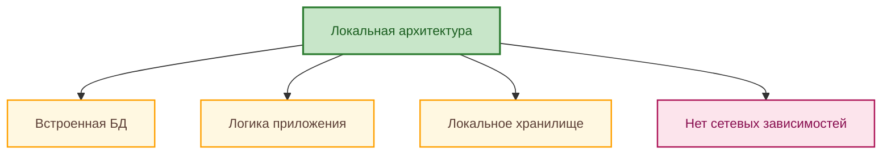
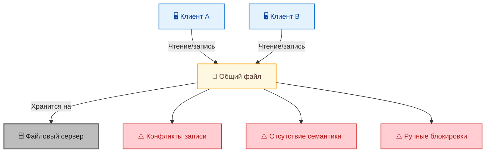
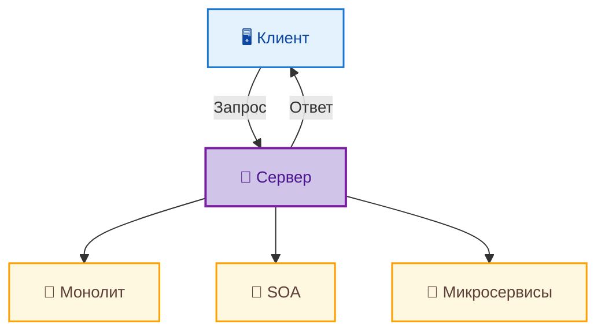
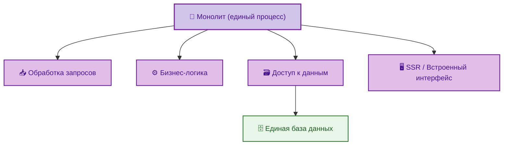
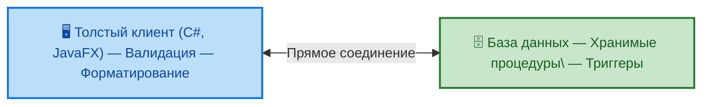
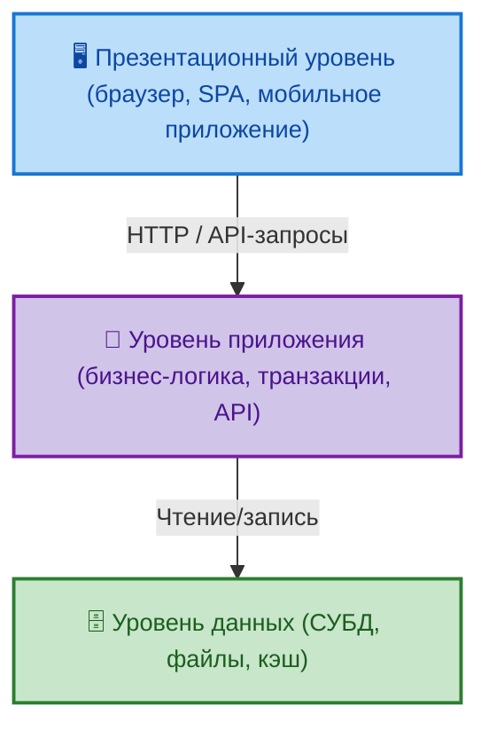
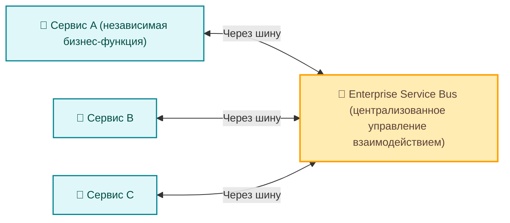
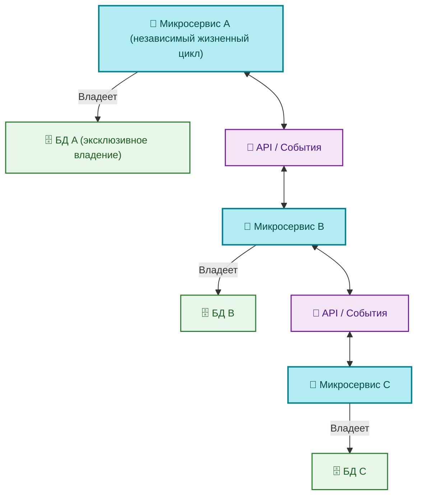

---
title: Архитектурные стили и их применение
---

# Архитектурные стили и их применение

  В РАЗРАБОТКЕ
  НЕ ДЛЯ НОВИЧКОВ
  НЕ ОБЯЗАТЕЛЬНО

Разработчику
Архитектору
Аналитику

## Виды архитектур

Архитектурные решения, касающиеся распределения компонентов и организации их взаимодействия, определяют фундаментальные свойства системы: её масштабируемость, отказоустойчивость, сложность сопровождения и стоимость владения. Выбор между локальной, файл-серверной, клиент-серверной, SOA или микросервисной архитектурой — это выбор **стратегии управления зависимостями и согласованностью**.

---

### Локальные системы

**Локальная архитектура** — это размещение всей логики и данных на одном устройстве, без необходимости сетевого взаимодействия. Примеры: текстовый редактор на настольном компьютере, оффлайн-игра на смартфоне, приложение для ведения заметок без синхронизации.

Локальные приложения могут быть сложными: содержать собственные базы данных (SQLite), реализовывать сложную логику, поддерживать плагины. Однако их ключевое свойство — **отсутствие внешних временных зависимостей**. Система работает до тех пор, пока работает само устройство. Нет проблем с сетевыми задержками, таймаутами, частичными отказами, несогласованными состояниями.

Это делает локальную архитектуру идеальной там, где важна предсказуемость и автономность: медицинские устройства, встроенные системы, инструменты для анализа данных на персональной станции, оффлайн-доступ к критическим документам. Однако она не масштабируется по пользователям и не поддерживает совместную работу без внешнего механизма синхронизации — а добавление такого механизма уже выводит систему за пределы локальной архитектуры.

---

### Файл-серверная архитектура

Файл-серверная архитектура возникает, когда несколько клиентов получают доступ к одним и тем же файлам через сетевой ресурс (например, SMB-шара, NFS-точка). Сервер здесь — пассивный посредник: он не интерпретирует содержимое файлов, не управляет целостностью данных, не реализует логику. Он лишь предоставляет механизм хранения и передачи блоков данных.

На первый взгляд — простое и дешёвое решение. На практике — источник глубоких системных проблем.

Главная трудность — **согласованность разделяемого состояния**. Когда два клиента одновременно читают и изменяют один и тот же файл, возникает риск конфликта: кто перезапишет чьи изменения? Кто увидит актуальное состояние? Клиенты вынуждены самостоятельно реализовывать блокировки (file locks), проверки версий, стратегии разрешения конфликтов — что редко делается корректно. В результате — повреждение данных, потеря транзакций, нестабильность.

Другая проблема — отсутствие семантики. Сервер не знает, что представляет собой файл: база данных, конфигурация, документ. Поэтому он не может применять оптимизации (кеширование, индексация, репликация), не может обеспечить безопасность на уровне операций («запретить удаление, но разрешить чтение»), не может логировать *смысловые* действия («пользователь изменил заказ №123»), а только технические («записан блок 0x4A в файл orders.db»).

Файл-серверная архитектура оправдана только в узких сценариях: раздача статических ресурсов (изображений, PDF-документов), совместное использование read-only-конфигураций, временные рабочие каталоги. Для любых динамических данных она — технический долг с высокой процентной ставкой.

---

### Клиент-серверная архитектура

Клиент-серверная архитектура — это переход от пассивного хранения к **активной обработке на стороне сервера**. Здесь сервер — полноценный участник взаимодействия: он интерпретирует запросы, применяет бизнес-логику, управляет состоянием, обеспечивает целостность данных.

Это фундаментальная смена парадигмы: вместо того чтобы доверять клиентам корректную работу с данными, сервер берёт на себя ответственность за согласованность. Клиент становится *представлением*, сервер — *источником истины*.

В пределах клиент-серверной архитектуры выделяют несколько стратегических подходов — монолит, SOA, микросервисы. Их отличает техническая реализация и **логика декомпозиции ответственности**.

---

#### Монолит

Монолит — это единое приложение, в рамках которого реализованы все функции: обработка запросов, бизнес-логика, доступ к данным, иногда даже часть интерфейса (в случае SSR). Всё развёрнуто как один процесс, использует одну базу данных (или один кластер), имеет единый жизненный цикл.

Важно избегать стигматизации термина «монолит». Монолит не означает «плохой код» или «неподдерживаемая система». Это — архитектурная стратегия, имеющая чёткие границы применимости.

> Стигматизация — это процесс навешивания отрицательных социальных «ярлыков» или «клейм» (стигм) на человека или группу, ассоциируя их с негативными качествами или предрассудками, что ведет к дискриминации, изоляции и снижению самооценки.

Преимущества монолита проявляются в следующих условиях:

- предметная область сравнительно узкая и стабильна;
- команда небольшая, и все участники могут оперировать единым контекстом;
- важна низкая задержка между операциями (все вызовы — внутрипроцессные);
- нет жёстких требований к независимому масштабированию отдельных функций;
- критична простота развёртывания и отладки.

В таких случаях монолит минимизирует накладные расходы: нет сетевых вызовов между компонентами, нет проблем с распределёнными транзакциями, нет необходимости в сложных механизмах согласования данных. Изменение затрагивает одну кодовую базу, один CI/CD-конвейер, одну среду развёртывания.

Однако при росте сложности, при расширении команды, при появлении требований к масштабируемости по отдельным функциям, монолит начинает демонстрировать системные ограничения:

- увеличивается время сборки и тестирования;
- возрастает вероятность регрессий: изменение в одном модуле может повлиять на другой, даже если связь неочевидна;
- становится трудно внедрять новые технологии: вся система привязана к одному стеку;
- масштабирование возможно только по всей системе целиком, даже если нагрузка растёт только в одном сценарии;
- время запуска и потребление памяти растут, что влияет на плотность развёртывания.

Эти ограничения не делают монолит «неправильным» — они делают его **неоптимальным для конкретного контекста**. Архитектурное решение должно соответствовать масштабу и динамике проекта. Стартап с MVP вряд ли выиграет от микросервисов; крупная ERP-система с десятками тысяч пользователей — от монолита.

---

#### Двухзвенная и трёхзвенная архитектура

Часто монолитную архитектуру путают с отсутствием внутренней структуры. Это ошибка. Даже в рамках единого процесса возможно и необходимо разделение на зоны ответственности.

**Двухзвенная (two-tier) архитектура** — это прямое взаимодействие клиента (например, толстого клиента на C# или JavaFX) с базой данных. Логика частично размещена на клиенте (валидация, форматирование), частично — в хранимых процедурах или триггерах. Такая архитектура типична для десктопных приложений 1990–2000-х.

Проблемы: высокая связанность клиента и схемы БД, сложность обновления (требуется развёртывание на всех клиентах), отсутствие централизованного контроля над логикой, уязвимость к SQL-инъекциям при некорректной реализации.

**Трёхзвенная (three-tier) архитектура** — это классическое разделение на:

- **Презентационный уровень** — клиент (веб-браузер, мобильное приложение, SPA);
- **Уровень приложения (бизнес-логики)** — серверное приложение, обрабатывающее запросы, реализующее правила, управляющее транзакциями;
- **Уровень данных** — СУБД, файловое хранилище, кэш.

Это — наиболее распространённая форма монолита в вебе. Всё может быть одной программой (например, ASP.NET MVC с встроенным контроллером и сервисами), но внутренняя декомпозиция уже присутствует. Такая структура позволяет:

- изолировать интерфейс от логики — изменения в дизайне не влияют на ядро;
- централизовать логику — все правила обрабатываются в одном месте;
- упростить безопасность — клиент не имеет прямого доступа к данным;
- обеспечить масштабируемость по запросам — можно добавлять экземпляры приложения перед балансировщиком.

Трёхзвенная архитектура — **логическая декомпозиция внутри единого контекста выполнения**. Это важный промежуточный шаг, позволяющий сохранить преимущества монолита, одновременно снижая связанность.

---

#### SOA (Service-Oriented Architecture)

SOA возникает, когда монолит становится слишком большим, и появляется потребность в независимой эволюции частей системы. В отличие от микросервисов, SOA предполагает **централизованное управление взаимодействием** через шину (ESB — Enterprise Service Bus).

Каждый сервис в SOA — это логически обособленная функция: «управление пользователями», «обработка платежей», «формирование отчётов». Сервисы общаются через ESB, который:

- маршрутизирует запросы;
- преобразует форматы (XML ↔ JSON, старая версия ↔ новая);
- обеспечивает безопасность (аутентификация, авторизация);
- управляет транзакциями (в пределах возможностей протоколов);
- логирует взаимодействия.

ESB — это **архитектурный компонент ответственности**. Он берёт на себя часть сложности распределённых систем, изолируя её от сервисов. Это позволяет сервисам оставаться относительно простыми — они не думают о том, кто их вызывает, в каком формате пришёл запрос, нужно ли его преобразовать.

Однако централизация имеет цену:

- ESB становится единым узлом отказа: его остановка парализует всю систему;
- он сам требует высокой квалификации для настройки и сопровождения;
- преобразования и маршрутизация добавляют задержку;
- изменение контрактов требует координации с ESB.

SOA оправдана в средах с высокой регламентацией, где требуется строгий контроль над интеграциями: банки, госструктуры, крупные промышленные предприятия. Здесь важна аудируемость, стандартизация, соответствие нормативам — и ESB предоставляет инструменты для этого.

---

#### Микросервисы

Микросервисная архитектура — это стратегия, основанная на **максимальной автономии компонентов**:

- каждый микросервис — независимое приложение со своим жизненным циклом;
- он владеет своей базой данных (или, как минимум, своей схемой в общей БД, но без прямого доступа к данным других сервисов);
- взаимодействие — через явные контракты (API, события), без централизованного посредника;
- масштабирование, развёртывание, мониторинг — независимы.

Ключевой принцип — **граница контекста как граница ответственности**. Микросервис не только реализует функцию — он инкапсулирует весь стек, необходимый для её выполнения: код, данные, зависимости. Это позволяет командам работать автономно: одна команда отвечает за «платежи», другая — за «доставку», и они могут выпускать обновления независимо, при условии соблюдения контрактов.

Однако такая автономия требует компенсации в других местах. Если в монолите транзакция охватывала несколько операций «из коробки», то в микросервисах приходится реализовывать *саги* — последовательности компенсирующих действий. Если в монолите отладка шла через breakpoint, то в распределённой системе требуется централизованная трассировка (например, через OpenTelemetry). Если в монолите балансировка нагрузки решалась на уровне приложения, то в микросервисах появляются sidecar-прокси (Envoy), service mesh (Istio), discovery-сервисы (Consul).

Микросервисы — средство. Они оправданы, когда:

- система настолько велика, что одна команда не может эффективно управлять всей кодовой базой;
- разные части системы имеют разную динамику изменений (например, маркетинговый сайт меняется ежедневно, а ядро расчётов — раз в квартал);
- требуются разные стратегии масштабирования (высокочастотные API vs вычислительные задачи);
- допустимы асинхронные взаимодействия и eventual consistency.

Во всех остальных случаях микросервисы вносят избыточную сложность без адекватной отдачи.

---
