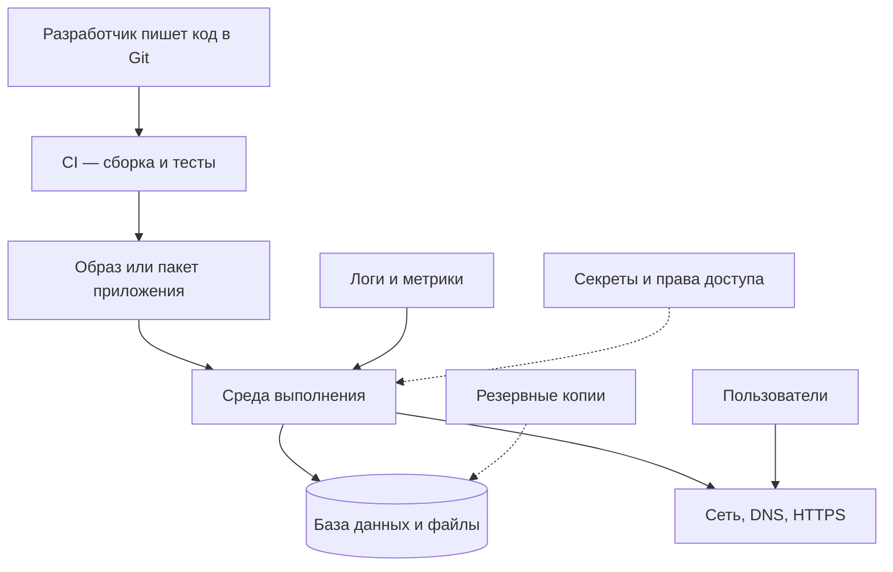
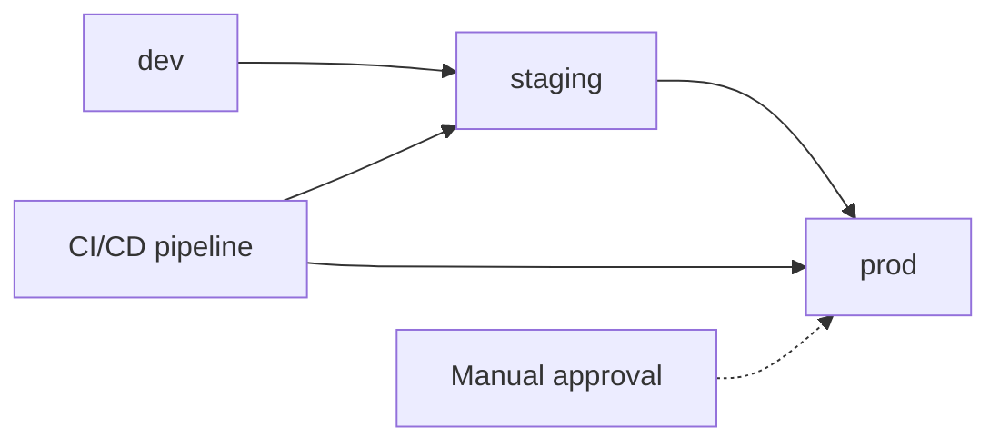
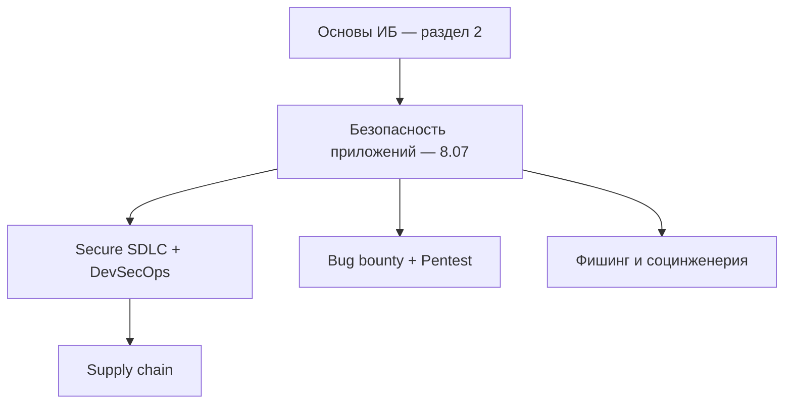
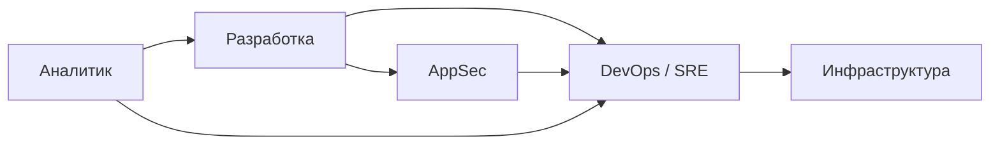
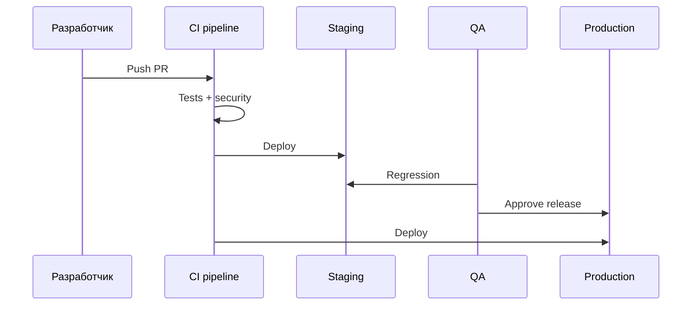
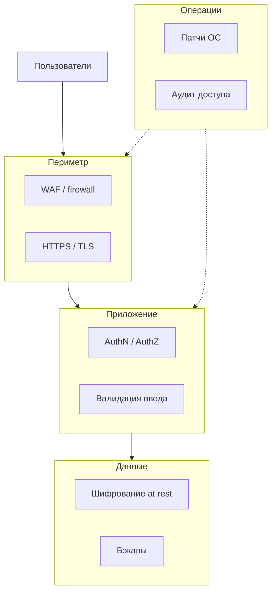
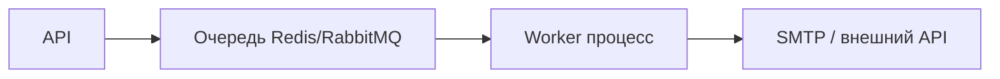

# Основы инфраструктуры

<div class="article-tags">
  <span class="tag tag-required">ОБЯЗАТЕЛЬНО</span>
  <span class="tag tag-beginner">ДЛЯ НОВИЧКОВ</span>
</div>

<span class="complexity-badge">Разработчику</span>
<span class="complexity-badge">Аналитику</span>
<span class="complexity-badge">Тестировщику</span>
<span class="complexity-badge">Инженеру</span>

**Инфраструктура** (infrastructure) — всё, что нужно, чтобы программа работала у пользователей после написания кода:

- машины или контейнеры, где выполняется процесс;
- сеть, **DNS** (Domain Name System, система имён доменов), балансировщики нагрузки;
- база данных и файловое хранилище;
- процесс выкладки обновлений (**деплой**, deployment);
- резервные копии (**бэкапы**, backup);
- журналы (**логи**) и метрики;
- учётные записи, секреты и политики доступа.

**Информационная безопасность** (ИБ) — практики, которые защищают данные и сервисы: шифрование, учётные записи, патчи, реагирование на инциденты. В зрелых командах безопасность встроена в разработку и эксплуатацию с первого дня ([DevSecOps](/encyclopedia/8-infra-security/8-12-aktualnye-praktiki/3), [Secure SDLC](/encyclopedia/8-infra-security/8-12-aktualnye-praktiki/10)).

Раздел 8 не обязан читаться целиком. Аналитику достаточно облаков и API; разработчику — Git, среды и основ ИБ; инженеру — DevOps, контейнеры и мониторинг. Ниже — общая схема, разбор компонентов и три маршрута чтения.

---

## От кода до пользователя

Когда вы запускаете `npm start` на ноутбуке, вы одновременно играете роли разработчика, системного администратора и сетевого инженера. В продакшене эти роли распределены, а каждый шаг документирован и автоматизирован.



### Таблица элементов цепочки

| Элемент | Что это | Подробнее |
|---------|---------|-----------|
| **Git** | История версий кода, ветки, code review | [4.13 Git](/encyclopedia/4-code-dev/4-13-osnovy-raboty-s-git/intro), [8.03](/encyclopedia/8-infra-security/8-03-zabota-o-kode-i-dannyh/intro) |
| **CI** (Continuous Integration) | Автоматическая сборка и тесты после каждого изменения | [8.04 CI/CD](/encyclopedia/8-infra-security/8-04-devops-ci-cd/11) |
| **CD** (Continuous Delivery) | Автоматическая или полуавтоматическая выкладка в среду | [8.04 CI/CD](/encyclopedia/8-infra-security/8-04-devops-ci-cd/11) |
| **Артефакт** | Результат сборки — Docker-образ, JAR, wheel | [8.06](/encyclopedia/8-infra-security/8-06-konteynerizatsiya-i-orkestratsiya/intro) |
| **Среда выполнения** | Место, где крутится процесс — VPS, Docker, Kubernetes, serverless | [8.06](/encyclopedia/8-infra-security/8-06-konteynerizatsiya-i-orkestratsiya/intro) |
| **База данных** | Хранение структурированных данных | [3.05](/encyclopedia/3-data-markup/3-05-osnovy-baz-dannyh/intro) |
| **HTTPS** | Шифрованный HTTP; сертификат подтверждает сайт | [SSL/TLS](/encyclopedia/8-infra-security/8-07-informatsionnaya-bezopasnost/118), [как работают сайты](/encyclopedia/2-system-network/2-04-kak-rabotayut-sayty-i-veb-sayty/intro) |
| **Наблюдаемость** (observability) | Логи, метрики, трассировки — понять, что сломалось | [8.04/19](/encyclopedia/8-infra-security/8-04-devops-ci-cd/19) |
| **Бэкап** | Копия данных для восстановления | [8.03/117](/encyclopedia/8-infra-security/8-03-zabota-o-kode-i-dannyh/117), [практикум DR](/encyclopedia/8-infra-security/8-15-praktikum-dr/intro) |

### Пример — pet-проект на GitHub Pages и API на VPS

| Шаг | Что происходит | Инструмент |
|-----|----------------|------------|
| 1 | Push в `main` | Git |
| 2 | GitHub Actions собирает фронтенд | CI |
| 3 | Статика уезжает на Pages | CD |
| 4 | Бэкенд в Docker на VPS | Среда выполнения |
| 5 | PostgreSQL на том же VPS или managed DB | Данные |
| 6 | Let's Encrypt для HTTPS | Сеть |
| 7 | UptimeRobot пингует `/health` | Наблюдаемость |

Такой стек — минимальная инфраструктура, с которой стоит познакомиться до Kubernetes.

---

## Компоненты инфраструктуры подробно

### Вычисления (compute)

**VPS** (Virtual Private Server, виртуальный сервер) — арендованная виртуальная машина с root-доступом. Вы сами ставите ОС-пакеты, Docker, nginx.

**Контейнер** — изолированный процесс с файловой системой образа. Легче переносить между средами, чем "голый" сервер.

**Kubernetes** (K8s) — оркестратор, который держит нужное число реплик контейнера, перезапускает упавшие, раскатывает обновления.

**Serverless** (FaaS, Function as a Service) — вы загружаете функцию, провайдер запускает её по событию. Меньше операционной работы, больше ограничений по времени выполнения и холодному старту.

Сравнение моделей облака — [8.01/1](/encyclopedia/8-infra-security/8-01-oblachnye-tehnologii/1).

### Сеть

| Компонент | Роль |
|-----------|------|
| **DNS** | Превращает `api.example.com` в IP-адрес |
| **Load balancer** | Распределяет трафик между несколькими экземплярами приложения |
| **Reverse proxy** (nginx, Caddy) | TLS-терминация, кэш, маршрутизация |
| **Firewall / Security Group** | Фильтрация портов и IP |
| **CDN** (Content Delivery Network) | Кэш статики ближе к пользователю |

Запрос пользователя к API проходит цепочку: DNS → CDN (если есть) → load balancer → proxy → приложение. Подробнее — [как работают сайты](/encyclopedia/2-system-network/2-04-kak-rabotayut-sayty-i-veb-sayty/intro).

### Данные

| Тип | Примеры | Когда |
|-----|---------|-------|
| **Реляционная БД** | PostgreSQL, MySQL | Транзакции, отчёты, связи |
| **Кэш** | Redis, Memcached | Сессии, горячие данные |
| **Очередь** | RabbitMQ, Kafka | Асинхронные задачи |
| **Object storage** | S3, MinIO | Файлы, бэкапы, артефакты |

Потеря данных без бэкапа — один из самых дорогих инцидентов. См. [8.03](/encyclopedia/8-infra-security/8-03-zabota-o-kode-i-dannyh/intro) и [DR](/encyclopedia/8-infra-security/8-15-praktikum-dr/intro).

### Секреты и конфигурация

**Секрет** — пароль, API-ключ, приватный ключ TLS. Хранят вне Git — в переменных CI, **Vault** (HashiCorp Vault), **Secrets Manager** облака.

**Конфигурация** — несекретные параметры (URL сервиса, feature flags). Часто в env или ConfigMap в Kubernetes.

Ошибка №1 новичков — `.env` в репозитории. См. [8.03/117](/encyclopedia/8-infra-security/8-03-zabota-o-kode-i-dannyh/117), [практикум Vault](/encyclopedia/8-infra-security/8-14-praktikum-vault/intro).

---

## Тестовая и боевая среда

**Тестовая среда** (test, staging, стенд) — копия продакшена для проверок. **Продакшен** (prod) — среда, куда ходят реальные пользователи.

| Критерий | dev | staging / test | prod |
|----------|-----|----------------|------|
| Данные | Фиктивные, можно стереть | Обезличенная копия или синтетика | Реальные пользовательские |
| Доступ | Вся команда разработки | QA, dev, иногда заказчик | Ограниченный, audit log |
| Деплой | Часто вручную | Через CI/CD, как в prod | Только через pipeline + approval |
| Масштаб | Минимальный | Близко к prod | По SLA |
| Секреты | Учебные ключи | Отдельные от prod | Production keys |

На тесте можно ломать данные и откатывать миграции. На проде доступ ограничен, изменения проходят через CI/CD и согласование.



Разбор сред и типичных ошибок при выкате — [Основы DevOps](/encyclopedia/8-infra-security/8-04-devops-ci-cd/1). Сравнение **собственного сервера** и **облака** — [8.01](/encyclopedia/8-infra-security/8-01-oblachnye-tehnologii/1).

### Типичный сценарий ошибки

Разработчик меняет переменную `DATABASE_URL` на продовую в локальном `.env`, коммитит по ошибке, CI выкатывает на staging — staging подключается к prod БД и тесты затирают реальные заказы. Защита — отдельные секреты по environment в CI, pre-commit secret scan ([DevSecOps](/encyclopedia/8-infra-security/8-12-aktualnye-praktiki/3)).

---

## Наблюдаемость — логи, метрики, трассировки

**Лог** (log) — текстовая запись события ("пользователь 42 создал заказ"). **Метрика** — число во времени (RPS, latency, ошибки 5xx). **Трассировка** (trace) — путь одного запроса через микросервисы.

| Сигнал | Вопрос, на который отвечает | Инструменты (примеры) |
|--------|----------------------------|------------------------|
| Логи | Что именно произошло? | Loki, ELK, CloudWatch |
| Метрики | Сколько и как быстро? | Prometheus, Grafana, Datadog |
| Трассировки | Где застрял запрос? | Jaeger, OpenTelemetry |

Минимум для pet-проекта — health-check endpoint `/health` и алерт при HTTP 5xx. Углубление — [8.04/19](/encyclopedia/8-infra-security/8-04-devops-ci-cd/19), [SRE](/encyclopedia/8-infra-security/8-04-devops-ci-cd/2111).

### Health-check — пример

```bash
curl -s -o /dev/null -w "%{http_code}" https://api.example.com/health
# Ожидаемый результат: 200
```

---

## SLA, SLO и доступность

**SLA** (Service Level Agreement) — договорённость с клиентом ("99.9% uptime в месяц"). **SLO** (Service Level Objective) — внутренняя цель команды. **SLI** (Service Level Indicator) — измеряемый показатель (доля успешных запросов).

| Uptime % | Простой в месяц (прибл.) |
|----------|--------------------------|
| 99% | ~7 ч |
| 99.9% | ~43 мин |
| 99.99% | ~4 мин |

**RTO** (Recovery Time Objective) — сколько может длиться восстановление после аварии. **RPO** (Recovery Point Objective) — сколько данных можно потерять по времени. Связь с бэкапами — [8.15/1](/encyclopedia/8-infra-security/8-15-praktikum-dr/1).

---

## Маршрут A — разработчик (1–2 недели)

Маршрут для backend, frontend и fullstack-разработчиков, которым нужно уверенно ориентироваться в средах, секретах и базовой ИБ.

| Шаг | Материал | Результат | Время |
|-----|----------|-----------|-------|
| 1 | [Безопасность кода](/encyclopedia/8-infra-security/8-03-zabota-o-kode-i-dannyh/1) | Понимание Git и потери несохранённого | 2–3 ч |
| 2 | [Секреты и конфигурация](/encyclopedia/8-infra-security/8-03-zabota-o-kode-i-dannyh/117) | Пароли вне репозитория | 2 ч |
| 3 | [Основы DevOps](/encyclopedia/8-infra-security/8-04-devops-ci-cd/1) | dev / test / prod | 3–4 ч |
| 4 | [Введение в ИБ](/encyclopedia/8-infra-security/8-07-informatsionnaya-bezopasnost/1) | CIA, [OWASP Top 10](https://owasp.org/www-project-top-ten/) | 4 ч |
| 5 | [OIDC и OAuth](/encyclopedia/8-infra-security/8-12-aktualnye-praktiki/8) | Кнопка "Войти через Google" | 3 ч |
| 6 | [Практикум REST](/encyclopedia/8-infra-security/8-08-praktikum-rest-i-websocket/intro) | JWT, API-ключ | 1–2 дня |

### Недельный план (маршрут A)

| День | Задача |
|------|--------|
| Пн | Шаги 1–2, настроить `.gitignore` для `.env` |
| Вт | Шаг 3, нарисовать схему своего pet-проекта |
| Ср | Шаг 4, пройти OWASP Top 10 по чек-листу |
| Чт | Шаг 5, прочитать про redirect URI и PKCE |
| Пт–Вс | Шаг 6, практикум REST или Docker Compose |

По желанию: [Docker](/encyclopedia/8-infra-security/8-06-konteynerizatsiya-i-orkestratsiya/111), [FinOps](/encyclopedia/8-infra-security/8-16-finops-pet-project/1), [Passkeys](/encyclopedia/8-infra-security/8-12-aktualnye-praktiki/2).

---

## Маршрут B — инженер / DevOps (1–3 месяца)

Маршрут для тех, кто отвечает за пайплайны, инфраструктуру и надёжность сервисов.

| Шаг | Материал | Результат |
|-----|----------|-----------|
| 1 | Маршрут A целиком | Общий язык с разработкой |
| 2 | [CI/CD — принципы](/encyclopedia/8-infra-security/8-04-devops-ci-cd/11) | Pipeline как код |
| 3 | [IaC](/encyclopedia/8-infra-security/8-04-devops-ci-cd/215) → [Terraform](/encyclopedia/8-infra-security/8-04-devops-ci-cd/2) | Воспроизводимая инфраструктура |
| 4 | [Контейнеризация](/encyclopedia/8-infra-security/8-06-konteynerizatsiya-i-orkestratsiya/intro) | Docker, образы, registry |
| 5 | [GitOps](/encyclopedia/8-infra-security/8-12-aktualnye-praktiki/4) → [практикум](/encyclopedia/8-infra-security/8-13-praktikum-gitops/intro) | Декларативный деплой |
| 6 | [DevSecOps](/encyclopedia/8-infra-security/8-12-aktualnye-praktiki/3), [Supply chain](/encyclopedia/8-infra-security/8-12-aktualnye-praktiki/1) | Gates в CI, SBOM |
| 7 | [SRE](/encyclopedia/8-infra-security/8-04-devops-ci-cd/2111), [мониторинг](/encyclopedia/8-infra-security/8-04-devops-ci-cd/19) | SLO, алерты, on-call |
| 8 | [DR](/encyclopedia/8-infra-security/8-15-praktikum-dr/intro), [Vault](/encyclopedia/8-infra-security/8-14-praktikum-vault/intro) | Устойчивость и секреты |

### Месячный план (маршрут B)

| Неделя | Фокус | Практика |
|--------|-------|----------|
| 1 | Маршрут A + CI/CD | GitHub Actions на pet-репо |
| 2 | Docker + IaC | Terraform + docker-compose |
| 3 | Kubernetes basics + GitOps | [практикум 8.13](/encyclopedia/8-infra-security/8-13-praktikum-gitops/intro) |
| 4 | DevSecOps + мониторинг | secret scan, Prometheus/Grafana demo |

---

## Маршрут C — информационная безопасность

Маршрут для специалистов ИБ и разработчиков, смещающихся в AppSec.

| Шаг | Материал | Результат |
|-----|----------|-----------|
| 1 | [Основы ИБ (раздел 2)](/encyclopedia/2-system-network/2-08-osnovy-informatsionnoy-bezopasnosti/intro) | Угрозы, CIA, политики |
| 2 | [8.07 — маршрут](/encyclopedia/8-infra-security/8-07-informatsionnaya-bezopasnost/intro) | Периметр, крипто, доступ |
| 3 | [Secure SDLC](/encyclopedia/8-infra-security/8-12-aktualnye-praktiki/10), [DevSecOps](/encyclopedia/8-infra-security/8-12-aktualnye-praktiki/3) | Процесс + автоматизация |
| 4 | [Supply chain](/encyclopedia/8-infra-security/8-12-aktualnye-praktiki/1) | SBOM, зависимости |
| 5 | [Bug bounty](/encyclopedia/8-infra-security/8-09-belyy-haking-i-bug-bounty/intro) → [Pentest](/encyclopedia/8-infra-security/8-10-testirovanie-na-proniknovenie/intro) | Внешняя проверка |
| 6 | [Учебный фишинг](/encyclopedia/8-infra-security/8-12-aktualnye-praktiki/11) | Осознанность пользователей |
| 7 | [Passkeys](/encyclopedia/8-infra-security/8-12-aktualnye-praktiki/2) | Современная аутентификация |

### Карта компетенций ИБ в инфраструктуре



---

## Словарь

| Термин | Кратко | Статья |
|--------|--------|--------|
| **IaaS** | Аренда виртуальных машин и сети | [8.01/1](/encyclopedia/8-infra-security/8-01-oblachnye-tehnologii/1) |
| **PaaS** | Платформа — вы приносите код, провайдер даёт runtime | [8.01/1](/encyclopedia/8-infra-security/8-01-oblachnye-tehnologii/1) |
| **SaaS** | Готовое приложение по подписке | [8.01/1](/encyclopedia/8-infra-security/8-01-oblachnye-tehnologii/1) |
| **CI / CD** | Непрерывная интеграция и доставка | [8.04/11](/encyclopedia/8-infra-security/8-04-devops-ci-cd/11) |
| **IaC** | Инфраструктура как код (Terraform, Ansible) | [8.04/215](/encyclopedia/8-infra-security/8-04-devops-ci-cd/215) |
| **Контейнер** | Изолированный процесс с образом приложения | [8.06/1](/encyclopedia/8-infra-security/8-06-konteynerizatsiya-i-orkestratsiya/1) |
| **Kubernetes (K8s)** | Оркестратор — управляет множеством контейнеров | [8.06/117](/encyclopedia/8-infra-security/8-06-konteynerizatsiya-i-orkestratsiya/117) |
| **GitOps** | Состояние кластера хранится в Git | [8.12/4](/encyclopedia/8-infra-security/8-12-aktualnye-praktiki/4) |
| **Zero Trust** | Проверка каждого запроса, без доверия к "внутренней сети" | [8.07/121](/encyclopedia/8-infra-security/8-07-informatsionnaya-bezopasnost/121) |
| **RTO / RPO** | Допустимое время простоя / потери данных | [8.15/1](/encyclopedia/8-infra-security/8-15-praktikum-dr/1) |
| **API Gateway** | Единая точка входа для HTTP API | [8.12/9](/encyclopedia/8-infra-security/8-12-aktualnye-praktiki/9) |
| **SBOM** | Список компонентов в сборке | [8.12/1](/encyclopedia/8-infra-security/8-12-aktualnye-praktiki/1) |
| **JWT** | JSON Web Token — токен для API | [8.08](/encyclopedia/8-infra-security/8-08-praktikum-rest-i-websocket/intro) |
| **mTLS** | Взаимная проверка TLS-сертификатов | [8.12/9](/encyclopedia/8-infra-security/8-12-aktualnye-praktiki/9) |
| **FinOps** | Управление стоимостью облака | [8.16](/encyclopedia/8-infra-security/8-16-finops-pet-project/1) |

---

## Частые ошибки новичков

### 1. Секреты в Git

Файл `.env` в коммите, ключ в Dockerfile, токен в скриншоте issue. История Git хранит всё навсегда, пока не переписана.

**Решение:** `.gitignore`, secret scan в CI, [Vault](/encyclopedia/8-infra-security/8-14-praktikum-vault/intro). Референс — утечки через публичные репозитории GitHub (ежегодные отчёты GitGuardian).

### 2. Деплой сразу в prod

Без staging, без отката, без canary. Один баг — простой для всех пользователей.

**Решение:** [стратегии развёртывания](/encyclopedia/8-infra-security/8-04-devops-ci-cd/111), blue-green или rolling update.

### 3. Бэкап на том же диске, что и база

При сбое диска или ransomware теряются и данные, и копия.

**Решение:** 3-2-1 rule (3 копии, 2 носителя, 1 offsite), [практикум DR](/encyclopedia/8-infra-security/8-15-praktikum-dr/intro). Кейс — потеря данных хостинг-провайдеров без offsite backup.

### 4. Микросервисы без необходимости

Десять сервисов для команды из трёх человек — операционный кошмар до появления реальной нагрузки.

**Решение:** [Первые шаги к микросервисам](/encyclopedia/8-infra-security/8-05-mikroservisy-i-integratsiya/101), начинать с монолита или модульного монолита.

### 5. Устаревшие зависимости

Уязвимые пакеты из npm/PyPI. Log4Shell показал, что одна библиотека затрагивает весь стек.

**Решение:** [Supply chain](/encyclopedia/8-infra-security/8-12-aktualnye-praktiki/1), Dependabot, SBOM.

### 6. Нет мониторинга

Узнаёте о простое от пользователей в Twitter, а не от алерта.

**Решение:** health-check, uptime monitoring, базовые метрики 5xx/latency.

### 7. SSH по паролю на весь интернет

Брутфорс и ботнеты сканируют порт 22 постоянно.

**Решение:** ключи, fail2ban, VPN или bastion host, [8.07](/encyclopedia/8-infra-security/8-07-informatsionnaya-bezopasnost/intro).

---

## Инциденты из практики (учебные выводы)

| Инцидент | Урок | Раздел |
|----------|------|--------|
| Открытый S3 bucket с бэкапами | Проверять ACL облачных bucket | [8.07](/encyclopedia/8-infra-security/8-07-informatsionnaya-bezopasnost/intro) |
| `kubectl apply` без review | GitOps и policy-as-code | [8.12/4](/encyclopedia/8-infra-security/8-12-aktualnye-praktiki/4) |
| Удаление prod БД "для теста" | Раздельные credentials, read-only для аналитиков | [8.03](/encyclopedia/8-infra-security/8-03-zabota-o-kode-i-dannyh/intro) |
| DDoS на API без rate limit | API Gateway, WAF | [8.12/9](/encyclopedia/8-infra-security/8-12-aktualnye-praktiki/9) |
| Компрометация CI токена | Минимальные permissions, OIDC | [DevSecOps](/encyclopedia/8-infra-security/8-12-aktualnye-praktiki/3) |

---

## Практика для первого знакомства

| Уровень | Задача | Время | Что получите |
|---------|--------|-------|--------------|
| Лёгкий | [Docker Compose — стеки](/lab/Примеры/11111) + [GitHub Actions](/lab/Примеры/1134) | 2–4 ч | Многосервисный стек + CI |
| Средний | [Практикум REST/WebSocket](/encyclopedia/8-infra-security/8-08-praktikum-rest-i-websocket/intro) | 1–2 дня | API, JWT, auth |
| Инженерный | [GitOps на kind](/encyclopedia/8-infra-security/8-13-praktikum-gitops/intro) | 1 день | K8s, декларативный деплой |
| ИБ | [Kali — только своя лаборатория](/encyclopedia/8-infra-security/8-10-testirovanie-na-proniknovenie/intro) | по маршруту 8.10 | Базовый pentest |
| Экономика | [FinOps pet-project](/encyclopedia/8-infra-security/8-16-finops-pet-project/1) | 4–6 ч | Стоимость облака |

### Пошагово — первый деплой с Docker Compose

1. Клонировать pet-репозиторий с `docker-compose.yml`
2. Создать `.env` локально (не коммитить)
3. `docker compose up -d`
4. Проверить `curl http://localhost:8080/health` → 200
5. Добавить GitHub Action — lint + test на PR
6. Выкатить на VPS или PaaS с тем же compose-файлом

---

## Чек-листы по ролям

### Разработчик — минимум перед prod

- [ ] Секреты вне Git, `.env` в `.gitignore`
- [ ] Понимаю разницу staging и prod
- [ ] Знаю, куда смотреть логи при 500
- [ ] Прочитал OWASP Top 10 для своего стека
- [ ] Есть план отката (rollback) релиза

### Инженер — минимум для команды

- [ ] CI на каждый PR, protected main
- [ ] Staging максимально похож на prod
- [ ] Бэкапы с проверкой restore (не только создание)
- [ ] Алерт на недоступность сервиса
- [ ] Документ runbook "что делать при падении"

### ИБ — минимум для аудита pet-проекта

- [ ] HTTPS везде, HSTS в prod
- [ ] Нет default паролей в сервисах
- [ ] Dependency scan в CI
- [ ] Политика паролей / MFA для админов
- [ ] План реагирования на утечку секрета

---

## Карта раздела 8 — куда идти дальше

| Вопрос | Подраздел |
|--------|-----------|
| Где хостить? | [8.01](/encyclopedia/8-infra-security/8-01-oblachnye-tehnologii/intro) |
| Как хранить код и секреты? | [8.03](/encyclopedia/8-infra-security/8-03-zabota-o-kode-i-dannyh/intro) |
| Как доставить код? | [8.04](/encyclopedia/8-infra-security/8-04-devops-ci-cd/intro) |
| Микросервисы и API? | [8.05](/encyclopedia/8-infra-security/8-05-mikroservisy-i-integratsiya/intro) |
| Docker и K8s? | [8.06](/encyclopedia/8-infra-security/8-06-konteynerizatsiya-i-orkestratsiya/intro) |
| ИБ? | [8.07](/encyclopedia/8-infra-security/8-07-informatsionnaya-bezopasnost/intro) |
| Актуальное? | [8.12](/encyclopedia/8-infra-security/8-12-aktualnye-praktiki/intro) |

---

## Роли в команде — кто за что отвечает

В маленькой команде один человек совмещает несколько ролей. В крупной — роли разделены, но границы пересекаются.

| Роль | Зона ответственности | Типичные инструменты |
|------|---------------------|----------------------|
| **Разработчик** | Код, тесты, участие в on-call | IDE, Git, фреймворк |
| **DevOps / SRE** | CI/CD, инфраструктура, мониторинг | Terraform, K8s, Grafana |
| **DBA** (Database Administrator) | Схема БД, миграции, производительность | PostgreSQL, pg_dump |
| **AppSec** | Threat model, аудит кода, политики | Semgrep, OWASP ASVS |
| **Сисадмин** | ОС, сеть, железо или IaaS | Ansible, SSH, firewall |
| **Аналитик** | Требования к SLA, интеграциям, средам | Диаграммы, Confluence |



Конфликт "разработка хочет фичу, DevOps блокирует деплой" решается общими **SLO**, прозрачными gates и [DevSecOps](/encyclopedia/8-infra-security/8-12-aktualnye-praktiki/3), а не ручными запретами без объяснения.

---

## Жизненный цикл релиза — пошагово

Типичный путь изменения от идеи до prod в зрелой команде:

| # | Этап | Участники | Артефакт |
|---|------|-----------|----------|
| 1 | Задача в трекере | Аналитик, PM | Ticket с acceptance criteria |
| 2 | Ветка в Git | Разработчик | feature branch |
| 3 | Code review | Команда | Approved PR |
| 4 | CI | Pipeline | Зелёные тесты + security scan |
| 5 | Деплой на staging | DevOps / CD | Версия на стенде |
| 6 | QA и регрессия | Тестировщик | Отчёт о проверке |
| 7 | Approval | Тимлид / release manager | Разрешение на prod |
| 8 | Деплой на prod | CD | Новая версия live |
| 9 | Мониторинг | On-call | Метрики 30–60 мин после выката |
| 10 | Post-release | Все | Закрытие ticket, документация |



Откат (**rollback**) — возврат к предыдущей версии артефакта. Должен быть описан в runbook до первого prod-деплоя — [стратегии развёртывания](/encyclopedia/8-infra-security/8-04-devops-ci-cd/111).

---

## Twelve-Factor App — принципы для облака

**Twelve-Factor App** — набор практик для приложений в облаке и контейнерах. Не догма, но хороший чек-лист для новичка.

| # | Фактор | Смысл для инфраструктуры |
|---|--------|--------------------------|
| 1 | Codebase | Один репозиторий → один deployable |
| 2 | Dependencies | Явное объявление зависимостей, lockfile |
| 3 | Config | Конфиг в environment, не в коде |
| 4 | Backing services | БД и очередь — подключаемые ресурсы |
| 5 | Build, release, run | Строго разделённые стадии |
| 6 | Processes | Процессы stateless, состояние в БД/Redis |
| 7 | Port binding | Сервис сам слушает порт (для PaaS/контейнеров) |
| 8 | Concurrency | Масштабирование через процессы/реплики |
| 9 | Disposability | Быстрый старт и корректное завершение |
| 10 | Dev/prod parity | Staging близок к prod |
| 11 | Logs | Логи как поток событий в stdout |
| 12 | Admin processes | Миграции и админ-задачи — отдельные процессы |

Нарушение фактора 3 (конфиг в коде) и фактора 2 (без lockfile) — частые источники инцидентов. См. [8.03](/encyclopedia/8-infra-security/8-03-zabota-o-kode-i-dannyh/intro).

---

## Масштабирование — вертикальное и горизонтальное

**Вертикальное масштабирование** (scale up) — больше CPU/RAM на одной машине. Просто, но есть потолок и single point of failure.

**Горизонтальное масштабирование** (scale out) — больше экземпляров приложения за балансировщиком. Требует stateless-приложения или sticky sessions.

| Подход | Плюсы | Минусы |
|--------|-------|--------|
| Вертикальное | Меньше изменений в коде | Потолок железа, дорогие инстансы |
| Горизонтальное | Отказоустойчивость, эластичность | Сложнее данные, сессии, деплой |

**Автомасштабирование** (autoscaling) — облако или K8s HPA (Horizontal Pod Autoscaler) добавляет реплики по CPU/RPS. Нужны корректные `resources.requests/limits` в Kubernetes — [8.06/117](/encyclopedia/8-infra-security/8-06-konteynerizatsiya-i-orkestratsiya/117).

---

## Миграции базы данных в CI/CD

Изменение схемы БД — рискованная операция. Типичный безопасный порядок:

1. **Backward-compatible migration** — сначала добавить колонку nullable, потом заполнить, потом сделать NOT NULL в следующем релизе.
2. Прогон миграций на staging с копией схемы prod.
3. Бэкап перед миграцией на prod.
4. Мониторинг slow queries после выката.

Опасные операции:

- `DROP COLUMN` без двухэтапного деплоя — старый код упадёт.
- Долгие блокирующие миграции в часы пик — lock таблицы.

Подробнее — [3.05 Базы данных](/encyclopedia/3-data-markup/3-05-osnovy-baz-dannyh/intro), [практикум PostgreSQL 8.11](/encyclopedia/8-infra-security/8-11-praktikum-postgresql/intro).

---

## On-call и реагирование на инциденты

**On-call** — дежурный инженер, который реагирует на алерты вне рабочего времени.

| Фаза | Действия |
|------|----------|
| **Detection** | Алерт из мониторинга или сообщение пользователей |
| **Triage** | Оценка severity — сколько людей затронуто |
| **Mitigation** | Быстрое восстановление (rollback, scale, отключение фичи) |
| **Resolution** | Исправление root cause |
| **Post-mortem** | Разбор без обвинений, action items |

**Severity levels** (пример):

| Уровень | Описание | Пример |
|---------|----------|--------|
| SEV1 | Полный простой prod | Сайт недоступен |
| SEV2 | Деградация без полного простоя | Платежи падают в 30% |
| SEV3 | Некритичный баг | Опечатка в отчёте |
| SEV4 | Запрос на улучшение | Новый дашборд |

Runbook — документ "если упал сервис X, сделай шаги 1–2–3". Минимум для pet-проекта — README с командами перезапуска и ссылкой на логи.

---

## Стоимость инфраструктуры — вводные FinOps

**FinOps** (Financial Operations) — дисциплина управления расходами на облако. Даже в pet-проекте полезно понимать, за что платите.

| Статья расходов | Примеры |
|-----------------|---------|
| Compute | VPS, EC2, Cloud Run |
| Storage | Диски, S3, бэкапы |
| Network | Исходящий трафик, load balancer |
| Managed services | RDS, managed Kafka |
| Лицензии | Мониторинг, секреты, CI minutes |

Типичные "сюрпризы":

- забытый staging-инстанс, работающий месяцами;
- исходящий трафик из облака дороже входящего;
- oversized инстансы "на всякий случай".

Практикум — [8.16 FinOps](/encyclopedia/8-infra-security/8-16-finops-pet-project/1).

---

## Соответствие требованиям — когда это касается инфраструктуры

Даже без формального аудита полезно знать аббревиатуры:

| Стандарт | Область | Связь с инфраструктурой |
|----------|---------|--------------------------|
| **GDPR** | Персональные данные в ЕС | Шифрование, бэкапы, право на удаление |
| **PCI DSS** | Платёжные карты | Сегментация сети, логи, сканирование |
| **152-ФЗ** | ПДн в РФ | Локализация, защита при хранении |
| **ISO 27001** | СУИБ | Политики, доступы, инциденты |

Технические меры пересекаются с [8.07 ИБ](/encyclopedia/8-infra-security/8-07-informatsionnaya-bezopasnost/intro) и [Secure SDLC](/encyclopedia/8-infra-security/8-12-aktualnye-praktiki/10).

---

## Монолит, модули и микросервисы — выбор формы

| Архитектура | Когда уместна | Инфраструктурная сложность |
|-------------|---------------|----------------------------|
| **Монолит** | Старт, малая команда, один deployable | Низкая |
| **Модульный монолит** | Рост кодовой базы без ops-ада | Низкая–средняя |
| **Микросервисы** | Независимые релизы, разные масштабы сервисов | Высокая |

Инфраструктура микросервисов требует service mesh или API Gateway, распределённый tracing, централизованные логи — [8.05](/encyclopedia/8-infra-security/8-05-mikroservisy-i-integratsiya/intro), [8.12/9 API Gateway](/encyclopedia/8-infra-security/8-12-aktualnye-praktiki/9).

---

## Интеграции и внешние API

Ваш сервис редко живёт изолированно. Инфраструктурные аспекты интеграций:

- **Таймауты и retry** — не зависать при падении партнёра;
- **Circuit breaker** — перестать долбить мёртвый endpoint;
- **Идемпотентность** — повтор запроса не создаёт дубликат заказа;
- **Секреты партнёров** — отдельные ключи на staging и prod.

База — [2.09 Интеграционное взаимодействие](/encyclopedia/2-system-network/2-09-osnovy-integratsionnogo-vzaimodeystviya/intro), практикум — [8.08 REST](/encyclopedia/8-infra-security/8-08-praktikum-rest-i-websocket/intro).

---

## Локальная разработка и паритет со staging

**Docker Compose** на ноутбуке поднимает те же сервисы, что на staging — PostgreSQL, Redis, mock API. Цель — "works on my machine" стало "works in compose".

```bash
docker compose up -d
docker compose ps
# Ожидаемый результат: все сервисы в статусе running
docker compose logs api --tail 50
```

Если локально SQLite, а на prod PostgreSQL — баги на стыке SQL-диалектов. Минимальный паритет — та же major-версия БД, что на staging.

---

## Безопасность по слоям — модель для новичка



| Слой | Вопрос | Материал |
|------|--------|----------|
| Периметр | Кто может достучаться до API? | [8.12/9](/encyclopedia/8-infra-security/8-12-aktualnye-praktiki/9) |
| Приложение | Кто авторизован на действие? | [8.07/116](/encyclopedia/8-infra-security/8-07-informatsionnaya-bezopasnost/116) |
| Данные | Что если украдут диск? | [8.07](/encyclopedia/8-infra-security/8-07-informatsionnaya-bezopasnost/intro) |
| Операции | Кто имел SSH вчера ночью? | [8.07/121 Zero Trust](/encyclopedia/8-infra-security/8-07-informatsionnaya-bezopasnost/121) |

---

## Вопросы на собеседовании — ориентир по теме

| Вопрос | На что смотрят | Где подготовиться |
|--------|----------------|-------------------|
| Чем CI отличается от CD? | Понимание pipeline | [8.04/11](/encyclopedia/8-infra-security/8-04-devops-ci-cd/11) |
| Как устроен HTTPS? | TLS handshake, сертификаты | [8.07/118](/encyclopedia/8-infra-security/8-07-informatsionnaya-bezopasnost/118) |
| Что такое контейнер? | Изоляция, образ, registry | [8.06/1](/encyclopedia/8-infra-security/8-06-konteynerizatsiya-i-orkestratsiya/1) |
| Как откатить релиз? | Blue-green, rollback | [8.04/111](/encyclopedia/8-infra-security/8-04-devops-ci-cd/111) |
| Что такое DevSecOps? | Shift-left, gates | [8.12/3](/encyclopedia/8-infra-security/8-12-aktualnye-praktiki/3) |

---

## Расширенный FAQ

### Нужен ли Kubernetes для первого проекта?

Обычно нет. Начните с PaaS (Render, Fly.io, Yandex Cloud Serverless Containers) или VPS + Docker Compose. K8s оправдан при нескольких сервисах, частых релизах и выделенной ops-команде.

### Что выбрать — облако или свой сервер?

| Критерий | Облако | Свой сервер / colocation |
|----------|--------|--------------------------|
| Старт | Быстрый | Медленнее |
| Оплата | По использованию | CapEx + ops |
| Масштаб | Эластичный | Ручной |
| Ответственность | Shared responsibility | Ваша полностью |

Сравнение — [8.01/1](/encyclopedia/8-infra-security/8-01-oblachnye-tehnologii/1), облака РФ — [8.12/5](/encyclopedia/8-infra-security/8-12-aktualnye-praktiki/5).

### Как понять, что инфраструктура "достаточно хороша"?

Минимальные критерии для pet-проекта и стартапа:

- prod доступен по HTTPS;
- есть staging;
- CI на PR;
- бэкап БД с проверкой restore раз в квартал;
- on-call или хотя бы алерт в Telegram при падении;
- секреты вне Git.

---

## Практикум — первый VPS с Docker и HTTPS

Пошаговый сценарий для pet-проекта на Ubuntu VPS. Выполняйте только на сервере, которым владеете.

### Шаг 1. Подключение по SSH

```bash
ssh -i ~/.ssh/id_ed25519 deploy@203.0.113.10
```

**Ожидаемый результат:** приглашение shell без запроса пароля (вход по ключу).

### Шаг 2. Установка Docker

```bash
sudo apt update
sudo apt install -y docker.io docker-compose-plugin
sudo usermod -aG docker deploy
newgrp docker
docker run hello-world
```

**Ожидаемый результат:** "Hello from Docker!".

### Шаг 3. Деплой приложения

```bash
git clone https://github.com/your-org/your-app.git
cd your-app
cp .env.example .env
# отредактируйте .env на сервере — не коммитьте
docker compose up -d
docker compose ps
```

### Шаг 4. nginx и Let's Encrypt

```bash
sudo apt install -y nginx certbot python3-certbot-nginx
sudo certbot --nginx -d api.example.com
curl -I https://api.example.com/health
```

**Ожидаемый результат:** HTTP/2 200, заголовок `server` от nginx.

### Шаг 5. Бэкап PostgreSQL (cron)

```bash
# /usr/local/bin/backup-db.sh
#!/bin/bash
docker exec postgres pg_dump -U appuser appdb | gzip > /backups/appdb-$(date +%F).sql.gz
find /backups -name '*.sql.gz' -mtime +7 -delete
```

```bash
chmod +x /usr/local/bin/backup-db.sh
crontab -e
# 0 3 * * * /usr/local/bin/backup-db.sh
```

Проверка restore — [8.15 DR](/encyclopedia/8-infra-security/8-15-praktikum-dr/intro).

---

## Типы хостинга — развёрнутая таблица

| Модель | Примеры | Вы управляете | Провайдер управляет |
|--------|---------|---------------|---------------------|
| **Bare metal** | Сервер в стойке | ОС, сеть, железо | Питание, физика |
| **VPS / IaaS** | DigitalOcean, Selectel | ОС, Docker, приложение | Гипервизор, сеть DC |
| **PaaS** | Heroku, Yandex Cloud Functions | Код, конфиг | Runtime, масштаб |
| **Managed DB** | RDS, Yandex MDB | Схема, запросы | Патчи, бэкапы СУБД |
| **Serverless** | AWS Lambda | Функция | Всё остальное |

Выбор — [8.01](/encyclopedia/8-infra-security/8-01-oblachnye-tehnologii/1), российские провайдеры — [8.12/5](/encyclopedia/8-infra-security/8-12-aktualnye-praktiki/5).

---

## Сетевые порты — что обычно открыто

| Порт | Сервис | Доступ из интернета |
|------|--------|---------------------|
| 22 | SSH | Только с вашего IP или bastion |
| 80 | HTTP | Да, редирект на 443 |
| 443 | HTTPS | Да |
| 5432 | PostgreSQL | Нет (только private network) |
| 6379 | Redis | Нет |
| 9100 | node_exporter | Нет, только мониторинг |

Сканирование открытых портов — `nmap` только на **своей** инфраструктуре.

---

## Конфигурация nginx как reverse proxy — пример

```nginx
server {
    listen 443 ssl http2;
    server_name api.example.com;

    ssl_certificate     /etc/letsencrypt/live/api.example.com/fullchain.pem;
    ssl_certificate_key /etc/letsencrypt/live/api.example.com/privkey.pem;

    location / {
        proxy_pass http://127.0.0.1:3000;
        proxy_set_header Host $host;
        proxy_set_header X-Real-IP $remote_addr;
        proxy_set_header X-Forwarded-For $proxy_add_x_forwarded_for;
        proxy_set_header X-Forwarded-Proto $scheme;
    }
}
```

`X-Forwarded-*` нужны приложению, чтобы знать реальный IP клиента и схему HTTPS.

---

## Feature flags и инфраструктура

**Feature flag** — переключатель функции без нового деплоя. Инфраструктурно хранят в:

- Redis / dedicated service (LaunchDarkly, Unleash);
- ConfigMap в K8s;
- env на staging, другой env на prod.

Опасность — флаг включили на prod, забыли выключить, нагрузка выросла в 10 раз. Нужны метрики и лимиты — [8.04/19](/encyclopedia/8-infra-security/8-04-devops-ci-cd/19).

---

## Кэширование на уровне инфраструктуры

| Уровень | Инструмент | Что кэшируется |
|---------|------------|----------------|
| CDN | Cloudflare, Akamai | Статика, иногда API GET |
| Reverse proxy | nginx `proxy_cache` | Ответы бэкенда |
| Application | Redis | Сессии, горячие данные |
| Database | Materialized views | Тяжёлые отчёты |

Инвалидация кэша при деплое — частая причина "вижу старую версию сайта". Решение — cache busting по hash в имени файла.

---

## Очереди и фоновые задачи

Долгие операции (отправка email, генерация PDF) не должны блокировать HTTP-запрос.



Worker масштабируется отдельно от API. Мониторинг длины очереди — алерт при росте.

---

## Platform Engineering — зачем знать новичку

**Platform Engineering** — команда строит внутреннюю платформу (IDP, Internal Developer Platform), чтобы разработчики сами поднимали стенды по шаблону. Знание термина полезно при собеседовании и в крупных компаниях — [8.12/6](/encyclopedia/8-infra-security/8-12-aktualnye-praktiki/6).

---

## Итоговый чек-лист главы

- [ ] Могу объяснить цепочку от Git до пользователя
- [ ] Знаю разницу dev, staging, prod
- [ ] Понимаю роль CI, CD, артефакта
- [ ] Выбрал маршрут A, B или C
- [ ] Знаю, где лежат секреты и бэкапы в моём проекте
- [ ] Прочитал про пять частых ошибок
- [ ] Запланировал один практикум из таблицы

Дальше — [итоги](./998.md) и [чек-лист вопросов](./999.md).

---

## Дальше по разделу

- [Актуальные практики](/encyclopedia/8-infra-security/8-12-aktualnye-praktiki/intro)
- [Итоги 8.00](./998.md) · [Чек-лист](./999.md)
- [Оглавление раздела 8](/section/infra-security)

---
