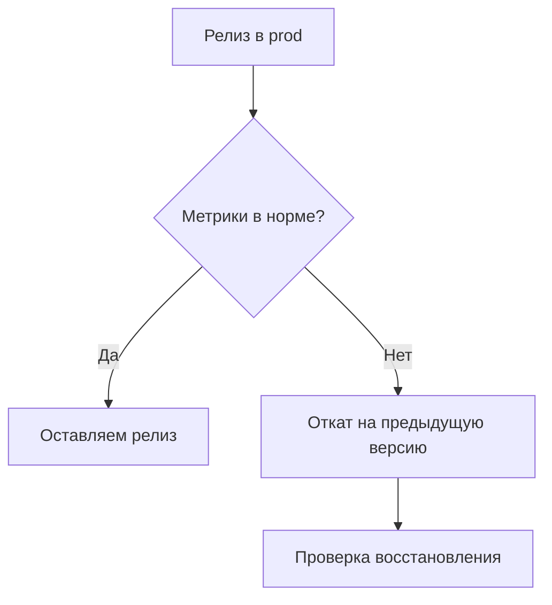

# Как развёртывают приложения

**Развёртывание** (deployment, деплой) — процесс переноса кода из среды разработки в целевую среду, где приложение становится доступно пользователям.

Деплой может быть ручным, полуавтоматическим или полностью автоматизированным через CI/CD. Подход зависит от архитектуры продукта, бюджета, требований к безопасности и уровня зрелости команды.

---

## Обязательные вопросы перед деплоем

Прежде чем выбирать сервер или облако, ответьте минимум на три группы вопросов.

### 1) Нужны ли хранилища и какие

- Нужна ли **база данных** (SQL/NoSQL), и какого класса нагрузки она ожидает.
- Нужно ли файловое хранилище для медиа и документов.
- Допустимо ли хранить состояние локально или требуется внешний объектный сторедж (S3-совместимый).

### 2) Какой стек и среда выполнения

- На каком языке и рантайме работает приложение (`Node.js`, `Python`, `Java`, `.NET`).
- Нужна ли сборка на сервере или деплоится уже готовый артефакт.
- Есть ли особые требования к ОС, пакетам и системным библиотекам.

### 3) Какой бюджет и ожидаемый масштаб

- Pet-проект, MVP стартапа или корпоративный критичный сервис.
- Приемлемый ежемесячный бюджет на compute, сеть, хранилище и мониторинг.
- Нужны ли отказоустойчивость, авто-масштабирование, несколько регионов.

---

## Требования к домену и сертификации

Пользовательский сервис должен открываться по доменному имени и работать через HTTPS.

### Домен

- Для тестов часто хватает поддомена платформы (`*.vercel.app`, `*.onrender.com`).
- Для продакшена обычно нужен собственный домен и DNS-записи (`A`, `AAAA`, `CNAME`).

### SSL/TLS

- Базовый вариант: бесплатные сертификаты Let's Encrypt.
- Для компаний с регуляторными требованиями могут понадобиться OV/EV-сертификаты.
- Внутри закрытых контуров иногда применяют self-signed сертификаты, но для публичных сервисов они неудобны.

---

## Безопасность деплоя: минимум, который обязателен

- Открывать только необходимые порты (`80/443`, и ограниченный доступ к `SSH`).
- Отключать вход по паролю, использовать SSH-ключи и аудит доступов.
- Хранить секреты вне репозитория: env-переменные, Vault, cloud secrets manager.
- Держать базы и внутренние сервисы в приватной сети.
- Настроить бэкапы и регулярно проверять восстановление.
- Обновлять ОС и зависимости, сканировать образы на уязвимости.

---

## Обязательные компоненты для деплоя

Независимо от платформы, рабочий деплой почти всегда включает:

1. **Код или артефакт** — бинарь, контейнер-образ, JAR, статика.
2. **Runtime** — среда выполнения языка.
3. **Веб-сервер или reverse proxy** — `Nginx`, `Apache`, `Caddy` (для HTTP/HTTPS и маршрутизации).
4. **Хранилище данных** — БД и/или объектное хранилище.
5. **Менеджер процессов / оркестратор** — `systemd`, `PM2`, Docker, Kubernetes.
6. **Конфигурация и секреты** — env-переменные и безопасные хранилища ключей.
7. **Мониторинг и логи** — чтобы видеть деградацию до жалоб пользователей.

---

## Деплой толстых и тонких клиентов

### Тонкий клиент (веб)

Логика на сервере, пользователь работает через браузер.

- Обновление для всех пользователей происходит сразу после выката.
- Критичны стабильность бэкенда, БД и сеть.

### Толстый клиент (desktop/mobile)

Логика частично или полностью на устройстве пользователя.

- Деплой через установочные пакеты (`EXE`, `DMG`, `APK`) или сторы.
- Обновление зависит от действий пользователя.
- Нужно дольше поддерживать обратную совместимость API.

---

## Классический деплой на личном компьютере

Подходит для обучения, демо и локального теста:

1. Устанавливаются runtime и локальные зависимости.
2. Клонируется репозиторий.
3. Настраивается локальный `.env`.
4. Приложение запускается локально (`localhost`).
5. При необходимости внешний доступ дают через туннели (`ngrok`, `LocalTunnel`).

Ограничения: слабая отказоустойчивость, зависимость от домашнего интернета и нестабильность для продакшена.

---

## Деплой на VPS и в облачных сервисах

### VPS/VDS

Вы получаете виртуальную машину с root-доступом и настраиваете всё сами:

- ОС и пакеты;
- reverse proxy и firewall;
- автозапуск и перезапуск процессов;
- резервное копирование.

Плюсы: контроль и предсказуемая цена. Минусы: больше ручной операционной работы.

### PaaS и managed-облака

Сервисы уровня Render, Railway, Heroku, App Runner и аналоги:

- собирают и запускают приложение автоматически после `git push`;
- часто дают встроенный HTTPS и удобные логи;
- упрощают масштабирование.

Плюсы: быстрый старт. Минусы: меньше гибкости, возможные ограничения платформы.

---

## Деплой на корпоративных серверах

Корпоративный контур обычно имеет повышенные требования:

- изоляция от открытого интернета (закрытый контур, VPN, bastion);
- внутренние Git- и artifact-репозитории;
- формальные процедуры релиза и аудита;
- SLA, регулярные DR-проверки и контроль соответствия требованиям.

Это дороже и сложнее, но обеспечивает высокий уровень контроля данных и доступов.

---

## Деплой через GitHub Pages и аналоги (static hosting)

Подходит для статических сайтов и фронтенд-приложений без собственного серверного runtime.

Аналоги: GitLab Pages, Netlify, Vercel, Cloudflare Pages.

Принцип:

- CI собирает статику в `dist`/`build`;
- платформа публикует файлы в CDN;
- пользователь получает сайт по HTTPS.

Ограничение: серверный код (`Node.js`, `Python`) так не запускается.

---

## Современный деплой: Docker, Kubernetes, CI/CD

### Docker

Контейнеризирует приложение вместе с зависимостями, снижая разницу между средами.

### Kubernetes

Оркеструет много контейнеров:

- масштабирует;
- перезапускает упавшие экземпляры;
- обновляет версии без длительного простоя.

### CI/CD

Автоматизирует путь от коммита до релиза:

`push` -> тесты -> сборка -> деплой -> проверка.

Инструменты: GitHub Actions, GitLab CI, Jenkins и другие.

---

## Другие модели деплоя

- **Serverless (FaaS)**: функции запускаются по событию, оплата за фактическое время выполнения.
- **Edge deployment**: код выполняется ближе к пользователю на периферийных узлах.
- **Hybrid / Multi-cloud**: части системы размещают в разных облаках и/или on-prem.

---

## Жизненный цикл деплоя: от задачи до пользователей

В зрелой команде деплой не начинается с команды на сервере. Он начинается в момент постановки задачи и заканчивается мониторингом после релиза.

| Этап | Что делаем | Ключевой результат |
|------|------------|--------------------|
| Планирование | Уточняем NFR, риски, требования к данным | Понятно, как релизить и как откатывать |
| Разработка | Реализуем код + тесты + миграции | Изменение готово к review |
| Code review | Проверяем качество и безопасность | PR одобрен |
| CI | Сборка, unit/integration, security checks | Зеленый pipeline |
| CD на staging | Автовыкат в тестовый контур | Проверка в среде, похожей на prod |
| QA/UAT | Регрессия, acceptance | Релиз готов к прод |
| CD на prod | Rollout с контролем метрик | Пользователи получают новую версию |
| Post-release | Наблюдение, инциденты, пост-анализ | Подтвержденная стабильность |

---

## Как выбрать модель деплоя: матрица решений

| Критерий | Локальный ПК | VPS | PaaS | Kubernetes | Serverless |
|----------|---------------|-----|------|------------|------------|
| Скорость старта | Очень высокая | Средняя | Высокая | Низкая | Высокая |
| Операционная сложность | Низкая | Средняя | Низкая | Высокая | Средняя |
| Контроль над окружением | Полный локально | Высокий | Средний | Очень высокий | Низкий |
| Масштабируемость | Низкая | Средняя | Средняя/высокая | Очень высокая | Высокая по событиям |
| Стоимость входа | Минимальная | Низкая | Низкая/средняя | Высокая | Низкая |
| Подходит для продакшена | Нет | Да | Да | Да | Да |
| Лучший сценарий | Демо/обучение | MVP и SMB | Быстрый запуск продукта | Большие распределенные системы | Event-driven и burst-нагрузка |

Правило для большинства команд:  
**локально -> VPS/PaaS -> Kubernetes (только при подтвержденной потребности)**.

---

## Базовые типы релизов и когда какой использовать

| Стратегия | Как работает | Плюсы | Минусы |
|-----------|--------------|-------|--------|
| Recreate | Старую версию останавливают, новую запускают | Просто | Есть простой |
| Rolling update | Постепенная замена экземпляров | Нет длительного простоя | Нужна обратная совместимость |
| Blue/Green | Два окружения, переключение трафика между ними | Быстрый rollback | Дороже по ресурсам |
| Canary | Небольшой процент пользователей на новой версии | Минимизация риска | Сложнее мониторить и управлять |
| Feature flags | Поведение включается флагом без нового деплоя | Гибкий контроль | Риск долгов по флагам |

---

## Rollback: как правильно готовить откат

Откат надо проектировать до первого релиза.  
Если rollback не отработан на staging, в проде он обычно ломается в самый неподходящий момент.

Минимальный план rollback:

1. Хранить предыдущий артефакт (образ, пакет, manifest).
2. Держать версионирование БД-миграций с backward-compatible шагами.
3. Зафиксировать команды/процедуры в runbook.
4. Проверять откат хотя бы раз в квартал в тестовом контуре.

---

## Деплой frontend и backend: разные практики

### Frontend (SPA/SSR)

| Формат | Где обычно размещают | Что важно |
|--------|----------------------|-----------|
| Статика (SPA) | CDN/Pages/Vercel/Netlify | Cache busting, CORS, правильные headers |
| SSR/Next/Nuxt | Node runtime, PaaS, контейнеры | Cold start, масштабирование по CPU/RPS |

### Backend API

| Формат | Где обычно размещают | Что важно |
|--------|----------------------|-----------|
| Монолит API | VPS/PaaS/контейнер | БД-миграции, reverse proxy, health checks |
| Микросервисы | Kubernetes/Service Mesh | Tracing, discovery, централизованный логинг |
| Event-driven | Serverless/queues | Idempotency, retries, DLQ |

---

## Деплой мобильных и desktop-клиентов

Для толстых клиентов деплой равен дистрибуции версий:

- desktop: `EXE`, `MSI`, `DMG`, автоапдейтеры;
- mobile: публикация в сторах (Google Play, App Store), rollout waves;
- enterprise mobile: MDM/корпоративные каталоги приложений.

Ключевая разница с вебом: невозможно "мгновенно обновить всех".  
Поэтому API на сервере должен поддерживать несколько клиентских версий одновременно.

---

## Наблюдаемость при деплое: какие сигналы смотреть

Минимум метрик после релиза:

- error rate (`4xx/5xx`);
- latency (`p50/p95/p99`);
- saturation (CPU/RAM/IO);
- бизнес-сигналы (оплата, логин, регистрация, заказ).

| Период после деплоя | Что контролировать |
|---------------------|--------------------|
| 0-5 минут | Старт сервисов, health-check, error bursts |
| 5-30 минут | Рост latency, деградация внешних интеграций |
| 30-120 минут | Поведение в реальном пользовательском трафике |
| 24 часа | Ночные джобы, отчеты, бэкапы, периодические задачи |

---

## Безопасный деплой по слоям (Defense in Depth)

| Слой | Меры |
|------|------|
| Сеть | Firewall, security groups, private subnets, WAF |
| Доступы | IAM/RBAC, SSH keys, MFA, least privilege |
| Секреты | Vault/Secrets Manager, ротация, audit trail |
| CI/CD | Защищенные runners, короткоживущие токены, policy checks |
| Runtime | Обновления ОС, image scanning, runtime policies |
| Данные | Шифрование at-rest/in-transit, backup, restore drills |

Дополнительно для зрелых контуров:

- SAST/DAST/SCA в pipeline;
- подпись артефактов;
- SBOM и контроль supply chain.

---

## Соответствие требованиям и сертификация

Для разных отраслей деплой должен учитывать регуляторные ограничения.

| Стандарт/закон | Что влияет на деплой |
|----------------|----------------------|
| GDPR | География хранения, право удаления, аудит доступа |
| PCI DSS | Сегментация сетей, логирование, контроль доступа |
| ISO 27001 | Политики ИБ, инциденты, управление рисками |
| SOC 2 | Контроль процессов, трассируемость изменений |
| 152-ФЗ (РФ) | Требования к обработке ПДн и инфраструктуре |

Практический вывод:  
архитектурные решения (где хранить данные, как шифровать, кто имеет доступ) лучше принимать до старта масштабного продакшена.

---

## Секреты, конфиги, переменные окружения

Частая ошибка новичков: смешивать код и секреты.

Правильное разделение:

- код в Git;
- несекретный конфиг в versioned config;
- секреты в vault/secrets manager;
- окружения разделены (`dev/staging/prod`) с разными наборами секретов.

| Тип данных | Где хранить |
|------------|-------------|
| API base URL | Конфиг среды |
| Пароль БД | Secrets Manager/Vault |
| JWT private key | Secrets Manager/Vault (с ротацией) |
| Feature flags | Конфиг/спецсервис флагов |

---

## Деплой и база данных: миграции без боли

Схема БД должна меняться поэтапно.

Безопасный паттерн:

1. Добавить новую колонку или таблицу без удаления старой.
2. Выкатить код, который умеет читать старый и новый формат.
3. Провести backfill данных.
4. Переключить чтение полностью на новый формат.
5. Удалить старый формат в отдельном релизе.

Антипаттерн: удалять колонку в том же релизе, где часть сервисов еще использует старую схему.

---

## Deployment anti-patterns (типичные ошибки)

| Ошибка | Почему опасно | Что делать вместо |
|--------|----------------|-------------------|
| Manual hotfix прямо на prod | Потеря воспроизводимости | Все изменения только через Git + pipeline |
| Один `.env` на все среды | Перемешивание staging/prod | Раздельные secrets по окружениям |
| Деплой без health-check | Нельзя быстро понять деградацию | readiness/liveness + smoke tests |
| Нет rollback-плана | Долгий простой при ошибке | Runbook и репетиция отката |
| Нет логов и метрик | Инциденты "на ощупь" | Centralized logging + dashboards |
| SSH-доступ у всех | Повышенный риск компрометации | RBAC, bastion, short-lived access |

---

## Пример архитектурных стэков под разные масштабы

### Стек A: pet-проект

- Frontend: static hosting (Pages/Vercel)
- Backend: один контейнер на VPS
- БД: PostgreSQL на том же VPS
- SSL: Let's Encrypt
- CI: GitHub Actions

### Стек B: MVP стартапа

- Frontend: CDN + PaaS runtime для SSR
- Backend: 2-3 сервиса в Docker
- БД: managed PostgreSQL
- Кэш: Redis managed
- CI/CD: pipeline с deploy в staging/prod

### Стек C: enterprise

- Multi-AZ/региональная архитектура
- Kubernetes + service mesh
- Отдельные контуры для prod/staging/security testing
- Централизованный SIEM/monitoring
- DR-стратегия с регулярными drills

---

## Деплой в Kubernetes: базовые сущности

| Сущность | Роль в деплое |
|----------|---------------|
| Deployment | Управляет количеством pod и rolling updates |
| Service | Стабильная точка доступа к pod |
| Ingress | Маршрутизация HTTP/HTTPS |
| ConfigMap | Несекретная конфигурация |
| Secret | Секретные параметры |
| HPA | Автомасштабирование по метрикам |

Базовый жизненный цикл:

`git push` -> CI build image -> push в registry -> apply manifests/Helm -> rollout -> мониторинг.

---

## Деплой через GitOps: что это дает

**GitOps** — подход, где желаемое состояние среды хранится в Git, а оператор в кластере синхронизирует фактическое состояние.

Плюсы:

- прозрачный аудит изменений;
- единая точка истины;
- управляемый rollback через Git history.

Минусы:

- выше порог входа для команды;
- нужны дисциплина и стандартизация манифестов.

---

## CI/CD pipeline: рекомендуемый минимум

| Шаг | Обязателен для MVP | Обязателен для enterprise |
|-----|---------------------|---------------------------|
| Lint + tests | Да | Да |
| Security scan | Желательно | Да |
| Staging deploy | Да | Да |
| Manual approval prod | Желательно | Да |
| Auto rollback | Желательно | Да |

---

## Runbook деплоя: минимальный шаблон

У каждой команды должен быть короткий runbook:

1. Цель релиза и версия.
2. Предусловия (зеленый CI, backup, окно релиза).
3. Команды/действия по выкату.
4. Проверки после выката.
5. Условия для rollback.
6. Команды rollback.
7. Контакты on-call.

Чем меньше "знаний в головах", тем ниже риск инцидентов при отпуске или смене команды.

---

## FinOps и деплой: как не сжечь бюджет

Расходы часто растут не из-за продакшена, а из-за неуправляемых стендов и ресурсов.

| Частая причина перерасхода | Что делать |
|----------------------------|------------|
| Вечные staging-среды | TTL и авто-выключение |
| Слишком большие инстансы | Периодический rightsizing |
| Логи без retention | Политики хранения и архивирования |
| Исходящий трафик из облака | CDN и оптимизация выдачи |
| Дублирование managed-сервисов | Каталог стандартных шаблонов окружений |

---

## Деплой в корпоративном контуре: дополнительные практики

В enterprise добавляются обязательные процессы:

- CAB/change management перед релизом;
- разделение ролей (кто готовит, кто согласует, кто выкатывает);
- журналирование административных действий;
- формальные процедуры incident response;
- регулярные security review и penetration testing.

---

## Disaster Recovery и деплой

Деплой и DR связаны напрямую: новая версия не должна ломать восстановление.

Проверять нужно не только "бэкап есть", но и:

- можно ли восстановиться в заявленный RTO;
- не потеряем ли критичные данные сверх RPO;
- корректно ли восстанавливаются зависимости (очереди, object storage, секреты).

---

## Контрольный список зрелости деплоя (0-2)

Оцените каждый пункт:

- `0` — не внедрено;
- `1` — частично;
- `2` — стабильно и измеряется.

| Область | Вопрос | Балл |
|---------|--------|------|
| Среды | Есть четкое разделение `dev/staging/prod` |   |
| CI | Все PR проходят автоматические проверки |   |
| CD | Продакшен выкатывается воспроизводимо |   |
| Безопасность | Секреты не находятся в Git и логах |   |
| Наблюдаемость | Есть дашборд релизных метрик |   |
| Rollback | Процедура отката протестирована |   |
| Данные | Бэкапы и restore drills регулярны |   |
| Доступы | Least privilege и аудит включены |   |

Интерпретация:

- `0-5` — высокий операционный риск;
- `6-11` — переходный уровень зрелости;
- `12-16` — управляемый деплой.

---

## Практический roadmap внедрения деплоя

### Этап 1 (1-2 недели): базовая гигиена

- разделить окружения;
- добавить CI (lint + tests);
- вынести секреты из репозитория;
- настроить HTTPS.

### Этап 2 (2-6 недель): устойчивый релиз

- staging, похожий на prod;
- автодеплой на staging;
- smoke tests;
- runbook + rollback.

### Этап 3 (1-3 месяца): надежность и масштаб

- централизованные логи и метрики;
- canary/rolling стратегии;
- backup + restore drills;
- базовые security scans.

### Этап 4 (3+ месяца): зрелая платформа

- GitOps/IaC;
- policy-as-code;
- SLO/error budget;
- FinOps-практики.

---

## FAQ: частые практические вопросы

### Нужен ли Kubernetes маленькому проекту?

Обычно нет. Если у команды 1-2 сервиса и невысокая нагрузка, VPS/PaaS чаще дает лучшее соотношение скорость/стоимость.

### Можно ли деплоить напрямую из ноутбука?

Для демо и учебных целей — да. Для боевого контура — нежелательно, нужна воспроизводимость через pipeline.

### Что важнее на старте: авто-масштабирование или бэкапы?

Обычно бэкапы и восстановление. Потеря данных чаще критичнее, чем временное замедление под нагрузкой.

### Как понять, что пора переходить с VPS на Kubernetes?

Сигналы: много сервисов, частые релизы, требования к zero-downtime и высокому SLA, операционная нагрузка на команду растет быстрее, чем продукт.

---

## Практический чек-лист перед первым прод-выкатом

- [ ] Ответили на вопросы по стеку, данным и бюджету.
- [ ] Настроили домен и HTTPS.
- [ ] Секреты вынесены из кода.
- [ ] Есть бэкап и проверка восстановления.
- [ ] Понятен и протестирован rollback-сценарий.
- [ ] Логи и базовый мониторинг включены.
- [ ] Есть разделение сред (`dev/staging/prod`).
- [ ] Проверены миграции БД на staging.
- [ ] Подготовлен runbook релиза и отката.
- [ ] Назначен ответственный on-call на окно релиза.
- [ ] Зафиксированы критерии успеха релиза (метрики и бизнес-сигналы).

---

## Куда идти дальше

- [Основы DevOps](/encyclopedia/8-infra-security/8-04-devops-ci-cd/1)
- [Контейнеризация и оркестрация](/encyclopedia/8-infra-security/8-06-konteynerizatsiya-i-orkestratsiya/intro)
- [Информационная безопасность](/encyclopedia/8-infra-security/8-07-informatsionnaya-bezopasnost/intro)
- [Актуальные практики](/encyclopedia/8-infra-security/8-12-aktualnye-praktiki/intro)
