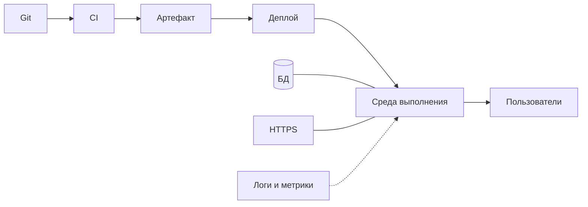

# Основы инфраструктуры — итоги

  ОБЯЗАТЕЛЬНО
  ДЛЯ НОВИЧКОВ

Эта страница собирает главные идеи из [входной главы](./1.md), [обзора раздела](./intro.md) и материала [Основы развития информационных систем](./2.md). Используйте ее для повторения перед собеседованием, перед стартом практикума и перед переходом в [8.12 Актуальные практики](/encyclopedia/8-infra-security/8-12-aktualnye-praktiki/intro).

---

## Главное в пяти тезисах

1. **Инфраструктура** — среда выполнения, сеть, данные, деплой, мониторинг и бэкапы после написания кода. Программа на ноутбуке и сервис для тысяч пользователей отличаются именно этим слоем.
2. **Безопасность** встроена в каждый этап — секреты, доступы, патчи, реагирование на инциденты. В зрелых командах это [DevSecOps](/encyclopedia/8-infra-security/8-12-aktualnye-praktiki/3), а не отдельный "этап перед релизом".
3. Раздел 8 читается **по маршруту роли** — [маршрут A, B или C](/encyclopedia/8-infra-security/8-00-osnovy-infrastruktury/1#маршрут-a--разработчик-1-2-недели). Не обязательно проходить все подразделы подряд.
4. **Минимум разработчика** — Git, секреты, dev/prod, [OWASP Top 10](https://owasp.org/www-project-top-ten/), один практикум ([8.08](/encyclopedia/8-infra-security/8-08-praktikum-rest-i-websocket/intro) или Docker).
5. **Актуальные темы** — [8.12](/encyclopedia/8-infra-security/8-12-aktualnye-praktiki/intro); **практикумы** — 8.08, 8.11, 8.13–8.16.

---

## Цепочка от кода до пользователя

| Звено | Что запомнить |
|-------|---------------|
| **Git** | Единый источник правды для кода; история изменений |
| **CI** (Continuous Integration) | Сборка и тесты на каждый PR |
| **Артефакт** | Образ Docker, JAR, npm-пакет — то, что едет в среду |
| **Деплой** | Процесс выкладки на staging или prod |
| **Среда выполнения** | VPS, PaaS, Kubernetes, serverless |
| **HTTPS** | Шифрование и проверка сертификата |
| **Наблюдаемость** | Логи, метрики, трассировки — найти причину сбоя |

Подробная таблица — в [главе 1](./1.md#от-кода-до-пользователя).

---

## Среды и зачем их несколько

| Среда | Назначение | Кто ходит |
|-------|------------|-----------|
| **dev** (development) | Ежедневная разработка | Разработчики |
| **test / staging** | Проверка перед релизом | QA, разработчики, иногда заказчик |
| **prod** (production) | Боевая среда | Реальные пользователи |

На тесте можно ломать данные и откатывать миграции. На проде доступ ограничен, изменения идут через CI/CD и согласование. Типичная ошибка — деплой сразу в prod без staging ([стратегии развёртывания](/encyclopedia/8-infra-security/8-04-devops-ci-cd/111)).

---

## Три маршрута — краткое резюме

### Маршрут A — разработчик (1–2 недели)

| # | Тема | Ссылка |
|---|------|--------|
| 1 | Безопасность кода и Git | [8.03/1](/encyclopedia/8-infra-security/8-03-zabota-o-kode-i-dannyh/1) |
| 2 | Секреты вне репозитория | [8.03/117](/encyclopedia/8-infra-security/8-03-zabota-o-kode-i-dannyh/117) |
| 3 | dev / test / prod | [8.04/1](/encyclopedia/8-infra-security/8-04-devops-ci-cd/1) |
| 4 | CIA и OWASP | [8.07/1](/encyclopedia/8-infra-security/8-07-informatsionnaya-bezopasnost/1) |
| 5 | OAuth / OIDC | [8.12/8](/encyclopedia/8-infra-security/8-12-aktualnye-praktiki/8) |
| 6 | REST, JWT | [8.08](/encyclopedia/8-infra-security/8-08-praktikum-rest-i-websocket/intro) |

### Маршрут B — инженер / DevOps (1–3 месяца)

Маршрут A плюс CI/CD, **IaC** (Infrastructure as Code, инфраструктура как код), контейнеры, GitOps, DevSecOps, SRE (Site Reliability Engineering, инженерия надёжности), DR (Disaster Recovery, восстановление после катастрофы). Полная таблица — [в главе 1](./1.md#маршрут-b--инженер--devops-1-3-месяца).

### Маршрут C — информационная безопасность

Основы ИБ из раздела 2 → маршрут [8.07](/encyclopedia/8-infra-security/8-07-informatsionnaya-bezopasnost/intro) → Secure SDLC и DevSecOps → bug bounty и pentest → учебный фишинг. Детали — [в главе 1](./1.md#маршрут-c--информационная-безопасность).

---

## Словарь — что должно остаться в голове

| Термин | Запомнить |
|--------|-----------|
| **IaaS** | Аренда ВМ и сети — вы управляете ОС |
| **PaaS** | Платформа — вы приносите код |
| **CI / CD** | Автоматизация сборки и доставки |
| **Контейнер** | Изолированный процесс с образом |
| **Kubernetes** | Оркестратор множества контейнеров |
| **GitOps** | Состояние кластера в Git |
| **Zero Trust** | Проверка каждого запроса |
| **RTO / RPO** | Время простоя / потеря данных при аварии |
| **SBOM** | Список компонентов в сборке |

Расширенный словарь с ссылками — [глава 1, раздел "Словарь"](./1.md#словарь).

---

## Что читать после итогов

- Нужна архитектурная логика роста системы. Читайте [7.06 Проектирование и архитектура](/encyclopedia/7-project/7-06-proektirovanie-i-arhitektura/intro).
- Нужна карта паттернов масштабирования. Читайте [12 концепций распределенной архитектуры](/encyclopedia/7-project/7-06-proektirovanie-i-arhitektura/141).
- Нужна эксплуатация и процессы доставки. Читайте [8.04 DevOps и CI-CD](/encyclopedia/8-infra-security/8-04-devops-ci-cd/intro).
- Нужна практика с отказоустойчивостью. Читайте [8.15 Практикум DR](/encyclopedia/8-infra-security/8-15-praktikum-dr/intro).

---

## Пять частых ошибок — напоминание

1. **Секреты в Git** — `.env`, ключи в Dockerfile. Решение — [8.03/117](/encyclopedia/8-infra-security/8-03-zabota-o-kode-i-dannyh/117), [Vault](/encyclopedia/8-infra-security/8-14-praktikum-vault/intro).
2. **Деплой сразу в prod** — без staging и отката.
3. **Бэкап на том же диске**, что и база — при сбое диска теряется и данные, и копия.
4. **Микросервисы без необходимости** — сложность раньше масштаба ([8.05/101](/encyclopedia/8-infra-security/8-05-mikroservisy-i-integratsiya/101)).
5. **Устаревшие зависимости** — уязвимые пакеты ([Supply chain](/encyclopedia/8-infra-security/8-12-aktualnye-praktiki/1)).

---

## Куда идти по вопросу

| Вопрос | Подраздел |
|--------|-----------|
| Где хостить? | [8.01](/encyclopedia/8-infra-security/8-01-oblachnye-tehnologii/intro), [облака РФ](/encyclopedia/8-infra-security/8-12-aktualnye-praktiki/5) |
| Как доставить код? | [8.04](/encyclopedia/8-infra-security/8-04-devops-ci-cd/intro) |
| Как упаковать сервис? | [8.06](/encyclopedia/8-infra-security/8-06-konteynerizatsiya-i-orkestratsiya/intro) |
| Как защитить? | [8.07](/encyclopedia/8-infra-security/8-07-informatsionnaya-bezopasnost/intro), [8.12](/encyclopedia/8-infra-security/8-12-aktualnye-praktiki/intro) |
| Как не потерять данные? | [8.03](/encyclopedia/8-infra-security/8-03-zabota-o-kode-i-dannyh/intro), [8.15 DR](/encyclopedia/8-infra-security/8-15-praktikum-dr/intro) |
| Как войти без пароля? | [Passkeys 8.12/2](/encyclopedia/8-infra-security/8-12-aktualnye-praktiki/2) |
| Как встроить безопасность в CI? | [DevSecOps 8.12/3](/encyclopedia/8-infra-security/8-12-aktualnye-praktiki/3) |

---

## Практика — что сделать руками

| Уровень | Задача | Время |
|---------|--------|-------|
| Лёгкий | [Docker Compose](/lab/Примеры/11111) + [GitHub Actions](/lab/Примеры/1134) | 2–4 ч |
| Средний | [Практикум REST/WebSocket](/encyclopedia/8-infra-security/8-08-praktikum-rest-i-websocket/intro) | 1–2 дня |
| Инженерный | [GitOps на kind](/encyclopedia/8-infra-security/8-13-praktikum-gitops/intro) | 1 день |
| ИБ | [Kali — только своя лаборатория](/encyclopedia/8-infra-security/8-10-testirovanie-na-proniknovenie/intro) | по маршруту 8.10 |

Если ни один практикум не завершён — вернитесь к [главе 1](./1.md#практика-для-первого-знакомства) и выберите один уровень.

---

## Самопроверка перед переходом дальше

Ответьте вслух или письменно:

- Могу ли я нарисовать цепочку от `git push` до пользователя?
- Знаю ли я, чем staging отличается от prod?
- Могу ли я объяснить, почему `.env` в Git опасен?
- Выбрал ли я маршрут A, B или C и прошёл хотя бы половину шагов?

Полный список вопросов — [чек-лист](./999.md).

---

## Следующие шаги

| Если вы | Идите сюда |
|---------|------------|
| Закончили маршрут A | [8.08 REST](/encyclopedia/8-infra-security/8-08-praktikum-rest-i-websocket/intro) или [Docker 8.06](/encyclopedia/8-infra-security/8-06-konteynerizatsiya-i-orkestratsiya/intro) |
| Закончили маршрут B | [GitOps практикум](/encyclopedia/8-infra-security/8-13-praktikum-gitops/intro), [Supply chain](/encyclopedia/8-infra-security/8-12-aktualnye-praktiki/1) |
| Закончили маршрут C | [Bug bounty](/encyclopedia/8-infra-security/8-09-belyy-haking-i-bug-bounty/intro), [Secure SDLC](/encyclopedia/8-infra-security/8-12-aktualnye-praktiki/10) |
| Хотите актуальное | [8.12 intro](/encyclopedia/8-infra-security/8-12-aktualnye-praktiki/intro) |

---

## Ключевые цитаты для запоминания

> Инфраструктура начинается там, где код перестаёт быть личным проектом на ноутбуке.

> Безопасность — свойство системы, а не отдельный чекбокс перед релизом.

> Staging существует, чтобы ошибки случались до prod, а не вместо prod.

---

## Расширенная таблица "вопрос → подраздел"

| Вопрос | Куда идти |
|--------|-----------|
| Как поднять HTTPS? | [8.07/118](/encyclopedia/8-infra-security/8-07-informatsionnaya-bezopasnost/118) |
| Как хранить API-ключи? | [8.03/117](/encyclopedia/8-infra-security/8-03-zabota-o-kode-i-dannyh/117), [Vault](/encyclopedia/8-infra-security/8-14-praktikum-vault/intro) |
| Как устроен Docker? | [8.06/1](/encyclopedia/8-infra-security/8-06-konteynerizatsiya-i-orkestratsiya/1) |
| Что такое GitOps? | [8.12/4](/encyclopedia/8-infra-security/8-12-aktualnye-praktiki/4) |
| Как считать стоимость облака? | [8.16](/encyclopedia/8-infra-security/8-16-finops-pet-project/1) |
| Как тестировать API? | [8.08](/encyclopedia/8-infra-security/8-08-praktikum-rest-i-websocket/intro) |
| Что делать при падении prod? | [8.04/19](/encyclopedia/8-infra-security/8-04-devops-ci-cd/19), [DR](/encyclopedia/8-infra-security/8-15-praktikum-dr/intro) |

---

## Самооценка после 8.00

| Уровень | Признаки |
|---------|----------|
| **Начальный** | Понимаю цепочку Git → CI → prod, знаю разницу staging/prod |
| **Базовый** | Прошёл маршрут A, сделал один практикум |
| **Средний** | Могу объяснить IaaS/PaaS, настроил CI с тестами |
| **Продвинутый** | Маршрут B или C в процессе, есть pet-проект в облаке |

[Чек-лист самопроверки](./999.md) · [Оглавление раздела 8](/section/infra-security)

---
