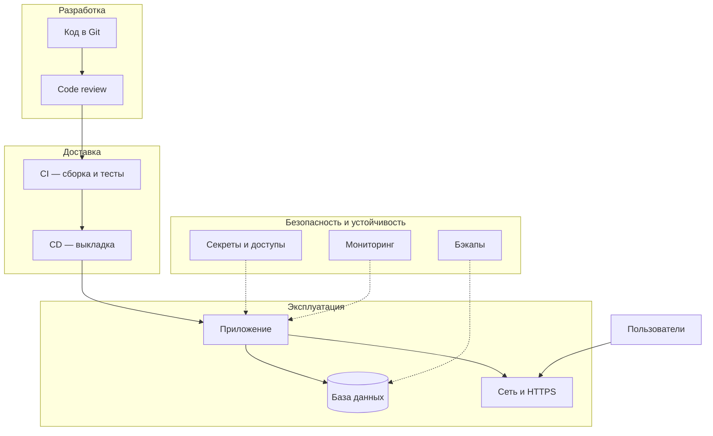
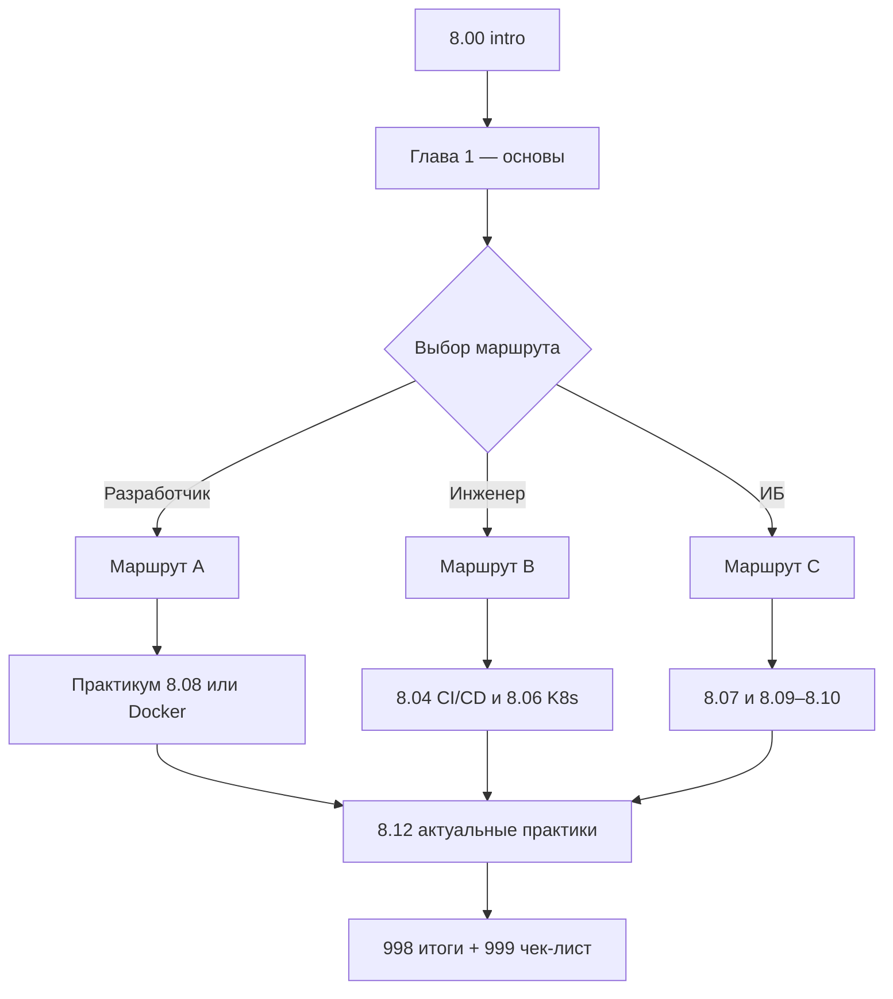

import DocCardList from '@theme/DocCardList';

# О разделе

Подраздел **8.00** — стартовая точка раздела ["Инфраструктура и безопасность"](/section/infra-security). Код в репозитории — только часть работы: приложение нужно запустить на сервере или в облаке, доставлять обновления, сохранять данные и защищать доступ. Этим занимаются инженеры эксплуатации, **DevOps** (Development and Operations, совмещение разработки и эксплуатации) и специалисты по **информационной безопасности** (ИБ); базовые термины полезны и разработчикам, и аналитикам, и тестировщикам.

  
Первый шаг

  

  Откройте <a href="./1">главу "Основы инфраструктуры"</a>. Там — схема от кода до пользователя, словарь терминов и три маршрута чтения по роли. Остальные подразделы выбирайте по задаче.
  

---

## Кому нужен этот подраздел

| Роль | Зачем читать 8.00 |
|------|-------------------|
| **Разработчик** | Понять, куда уходит код после `git push`, как устроены среды и почему нельзя класть пароли в репозиторий |
| **Аналитик** | Согласовывать требования к API, средам, SLA (Service Level Agreement, соглашение об уровне сервиса) и резервному копированию |
| **Тестировщик** | Знать разницу между тестовым стендом и продакшеном, уметь читать логи и воспроизводить баги в правильной среде |
| **Инженер / DevOps** | Получить карту раздела 8 перед углублением в CI/CD (Continuous Integration / Continuous Delivery, непрерывная интеграция и доставка) |
| **Специалист ИБ** | Увидеть, где в разделе лежат темы Zero Trust, pentest (тестирование на проникновение) и Secure SDLC |

Подраздел не заменяет специализированные курсы, но даёт общий язык для общения между командами.

---

## Что такое инфраструктура в контексте раздела 8

**Инфраструктура** (infrastructure) — всё, что нужно, чтобы программа работала у пользователей после написания кода:

- машины, виртуальные серверы или контейнеры;
- сеть, **DNS** (Domain Name System, система имён доменов), балансировщики;
- базы данных и файловое хранилище;
- процесс выкладки обновлений (**деплой**, deployment);
- резервные копии (**бэкапы**, backup);
- журналы (**логи**) и метрики;
- учётные записи, секреты и политики доступа.

Без инфраструктуры код остаётся на ноутбуке разработчика. С инфраструктурой — это сервис, к которому обращаются клиенты, партнёры и внутренние системы.

---

## Состав раздела 8

| Блок | Подраздел | Содержание |
|------|-----------|------------|
| Старт | **8.00** | Вступление, маршруты, словарь, чек-лист |
| Облака | [8.01](/encyclopedia/8-infra-security/8-01-oblachnye-tehnologii/intro), [8.02](/encyclopedia/8-infra-security/8-02-low-code-no-code/intro) | **IaaS** (Infrastructure as a Service, инфраструктура как сервис), **PaaS** (Platform as a Service, платформа как сервис), low-code |
| Код и доставка | [8.03](/encyclopedia/8-infra-security/8-03-zabota-o-kode-i-dannyh/intro), [8.04](/encyclopedia/8-infra-security/8-04-devops-ci-cd/intro) | Git, секреты, CI/CD |
| Архитектура | [8.05](/encyclopedia/8-infra-security/8-05-mikroservisy-i-integratsiya/intro), [8.06](/encyclopedia/8-infra-security/8-06-konteynerizatsiya-i-orkestratsiya/intro) | **API** (Application Programming Interface, программный интерфейс), Docker, **Kubernetes** (K8s, оркестратор контейнеров) |
| Безопасность | [8.07](/encyclopedia/8-infra-security/8-07-informatsionnaya-bezopasnost/intro), [8.09–8.10](/encyclopedia/8-infra-security/8-09-belyy-haking-i-bug-bounty/intro) | ИБ, bug bounty, pentest |
| Практикумы | [8.08](/encyclopedia/8-infra-security/8-08-praktikum-rest-i-websocket/intro), [8.11–8.16](/encyclopedia/8-infra-security/8-13-praktikum-gitops/intro) | REST, PostgreSQL, GitOps, Vault, DR, FinOps |
| Актуальное | [8.12](/encyclopedia/8-infra-security/8-12-aktualnye-praktiki/intro) | Supply chain, Passkeys, DevSecOps и др. |

Полное оглавление — на [странице раздела](/section/infra-security).

---

## Как устроен подраздел 8.00

| Файл | Назначение |
|------|------------|
| [intro.md](./intro.md) | Эта страница — обзор и навигация |
| [1.md](./1.md) | Главная глава — схема, словарь, три маршрута по ролям |
| [998.md](./998.md) | Итоги — краткое резюме прочитанного |
| [999.md](./999.md) | Чек-лист — вопросы для самопроверки |

Рекомендуемый порядок: intro → 1 → выбранный маршрут из главы 1 → итоги и чек-лист.

---

## Порядок чтения

### Минимальный путь (1–2 дня)

1. [Основы инфраструктуры](./1.md) — целиком, с диаграммой "от кода до пользователя"
2. Один практический блок по интересу
   - разработчик — [Практикум REST](/encyclopedia/8-infra-security/8-08-praktikum-rest-i-websocket/intro);
   - инженер — [Основы DevOps](/encyclopedia/8-infra-security/8-04-devops-ci-cd/1);
   - ИБ — [Введение в ИБ](/encyclopedia/8-infra-security/8-07-informatsionnaya-bezopasnost/1).
3. [Итоги](./998.md) и [чек-лист](./999.md)

### Полный путь по роли (недели и месяцы)

1. [Основы инфраструктуры](./1.md)
2. Маршрут A, B или C из той же главы — таблицы с шагами и ссылками
3. [Актуальные практики](/encyclopedia/8-infra-security/8-12-aktualnye-praktiki/intro) — после базы DevOps или ИБ
4. Практикумы 8.08, 8.13–8.16 — по мере готовности
5. [Итоги](./998.md) и [чек-лист](./999.md)

---

## Связь с другими разделами энциклопедии

Раздел 8 опирается на материалы из соседних блоков. Без них часть терминов покажется абстрактной.

| Раздел | Тема | Зачем перед 8.00 |
|--------|------|------------------|
| [2.04 Как работают сайты](/encyclopedia/2-system-network/2-04-kak-rabotayut-sayty-i-veb-sayty/intro) | HTTP, HTTPS, DNS | Понять, куда "приземляется" деплой |
| [2.08 Основы ИБ](/encyclopedia/2-system-network/2-08-osnovy-informatsionnoy-bezopasnosti/intro) | CIA, угрозы | Базовый словарь безопасности |
| [3.05 Базы данных](/encyclopedia/3-data-markup/3-05-osnovy-baz-dannyh/intro) | SQL, транзакции | Понять роль данных в инфраструктуре |
| [4.13 Git](/encyclopedia/4-code-dev/4-13-osnovy-raboty-s-git/intro) | Ветки, коммиты | Первая точка цепочки поставки |
| [4.09 Зависимости](/encyclopedia/4-code-dev/4-09-zavisimosti/intro) | npm, pip | Связь с supply chain в [8.12/1](/encyclopedia/8-infra-security/8-12-aktualnye-praktiki/1) |

---

## Типичные вопросы перед стартом

### "Я только учусь программировать — мне нужен весь раздел 8?"

Нет. Достаточно главы [1.md](./1.md), маршрута A и одного практикума. Остальное — по мере появления реальных задач на работе или в pet-проекте.

### "Чем 8.00 отличается от 8.04 DevOps?"

**8.00** — карта и общий язык. **8.04** — углубление в пайплайны, инструменты и процессы доставки. Начинайте с 8.00, затем переходите в 8.04 по маршруту B.

### "Где искать актуальные темы 2025–2026?"

В подразделе [8.12 Актуальные практики](/encyclopedia/8-infra-security/8-12-aktualnye-praktiki/intro) — Supply chain, Passkeys, DevSecOps, GitOps, Platform Engineering и другие.

### "Есть ли готовые лабораторные работы?"

Да. Смотрите практикумы:

- [8.08 REST и WebSocket](/encyclopedia/8-infra-security/8-08-praktikum-rest-i-websocket/intro)
- [8.11 PostgreSQL](/encyclopedia/8-infra-security/8-11-praktikum-postgresql/intro)
- [8.13 GitOps](/encyclopedia/8-infra-security/8-13-praktikum-gitops/intro)
- [8.14 Vault](/encyclopedia/8-infra-security/8-14-praktikum-vault/intro)
- [8.15 DR](/encyclopedia/8-infra-security/8-15-praktikum-dr/intro)
- [8.16 FinOps](/encyclopedia/8-infra-security/8-16-finops-pet-project/1)

---

## Реальные ситуации, где пригодится 8.00

### Pet-проект на GitHub

Вы выложили код, но сайт открывается только у вас локально. Глава [1.md](./1.md) объясняет цепочку: Git → CI → хостинг → HTTPS. Дальше — [облака 8.01](/encyclopedia/8-infra-security/8-01-oblachnye-tehnologii/intro) или [Docker 8.06](/encyclopedia/8-infra-security/8-06-konteynerizatsiya-i-orkestratsiya/intro).

### Первый рабочий деплой

Коллега просит "выкатить на staging". В [1.md](./1.md) описаны среды dev, test, prod. Подробности процесса — [Основы DevOps](/encyclopedia/8-infra-security/8-04-devops-ci-cd/1).

### Инцидент с утечкой `.env`

Файл с паролями попал в публичный репозиторий. В главе 1 — типичная ошибка №1 и ссылки на [секреты 8.03](/encyclopedia/8-infra-security/8-03-zabota-o-kode-i-dannyh/117) и [Vault](/encyclopedia/8-infra-security/8-14-praktikum-vault/intro). Похожие кейсы разбираются в [Supply chain](/encyclopedia/8-infra-security/8-12-aktualnye-praktiki/1).

### Аудит перед запуском B2B-продукта

Заказчик спрашивает про бэкапы, RTO (Recovery Time Objective, допустимое время простоя) и HTTPS. Словарь в [1.md](./1.md) и практикум [DR](/encyclopedia/8-infra-security/8-15-praktikum-dr/intro) закрывают базовые вопросы.

---

## Краткий словарь для навигации

| Термин | Одна фраза | Куда углубиться |
|--------|------------|----------------|
| **CI** | Автосборка и тесты после каждого коммита | [8.04/11](/encyclopedia/8-infra-security/8-04-devops-ci-cd/11) |
| **CD** | Автоматическая или полуавтоматическая выкладка | [8.04/11](/encyclopedia/8-infra-security/8-04-devops-ci-cd/11) |
| **Staging** | Копия прода для проверок перед релизом | [8.04/1](/encyclopedia/8-infra-security/8-04-devops-ci-cd/1) |
| **Контейнер** | Изолированный процесс с образом приложения | [8.06/1](/encyclopedia/8-infra-security/8-06-konteynerizatsiya-i-orkestratsiya/1) |
| **DevSecOps** | Безопасность встроена в пайплайн | [8.12/3](/encyclopedia/8-infra-security/8-12-aktualnye-praktiki/3) |
| **SBOM** | Список всех компонентов в сборке | [8.12/1](/encyclopedia/8-infra-security/8-12-aktualnye-praktiki/1) |

Полный словарь — в [главе 1](./1.md).

---

## Чек-лист "готов начать раздел 8"

- [ ] Понимаю, что код на ноутбуке и сервис для пользователей — разные вещи
- [ ] Знаю, где в энциклопедии лежит [Git](/encyclopedia/4-code-dev/4-13-osnovy-raboty-s-git/intro)
- [ ] Могу назвать три звена цепочки "код → пользователь"
- [ ] Выбрал маршрут A, B или C в [главе 1](./1.md)
- [ ] Знаю, куда идти за практикой (8.08 или 8.13+)

После прохождения — [чек-лист самопроверки](./999.md).

---

## Истории из индустрии — почему раздел 8 важен

| Год | Событие | Урок |
|-----|---------|------|
| 2017 | Equifax — уязвимый Apache Struts | Патчи и SCA |
| 2019 | Capital One — misconfigured WAF в облаке | IaC review, cloud config |
| 2021 | Log4Shell | SBOM и скорость реакции |
| 2023 | MOVEit — supply chain | Зависимости и вендоры |
| 2024+ | AI-агенты с доступом к prod | Секреты, least privilege |

Эти кейсы не для запугивания, а для понимания, почему инфраструктура и ИБ — одна цепочка.

---

## Глоссарий подраздела 8.00

| Термин | Кратко |
|--------|--------|
| **Деплой** | Выкладка версии приложения в среду |
| **Стенд** | Тестовая среда, аналог staging |
| **Артефакт** | Результат сборки |
| **Релиз** | Версия, дошедшая до пользователей |
| **Инцидент** | Событие, нарушающее работу или безопасность |
| **Runbook** | Инструкция действий при сбое |

---

## Сравнение ролей — кто что читает в разделе 8

| Подраздел | Разработчик | Инженер | ИБ | Аналитик |
|-----------|-------------|---------|-----|----------|
| 8.00 | ★★★ | ★★★ | ★★ | ★★ |
| 8.03–8.04 | ★★★ | ★★★ | ★★ | ★ |
| 8.06 | ★★ | ★★★ | ★★ | ★ |
| 8.07 | ★★ | ★★ | ★★★ | ★ |
| 8.12 | ★★ | ★★★ | ★★★ | ★ |
| 8.13–8.16 | ★★ | ★★★ | ★★ | — |

★★★ — обязательно в маршруте роли; ★★ — желательно; ★ — по задаче.

---

## Дальше

| Шаг | Ссылка |
|-----|--------|
| Главная глава | [Основы инфраструктуры](./1.md) |
| Итоги | [998.md](./998.md) |
| Самопроверка | [999.md](./999.md) |
| Оглавление раздела 8 | [/section/infra-security](/section/infra-security) |
| Актуальные практики | [8.12 intro](/encyclopedia/8-infra-security/8-12-aktualnye-praktiki/intro) |

<DocCardList />

---
