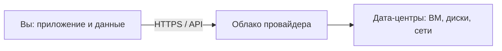
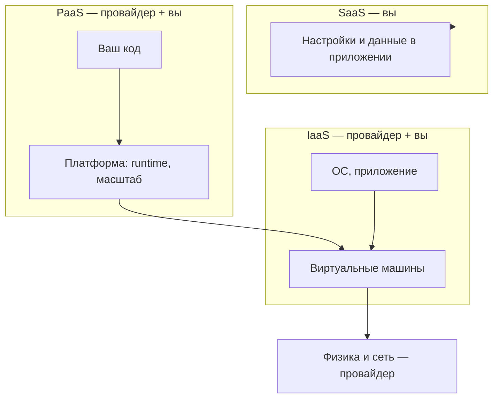
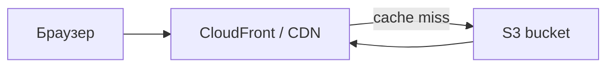

import DockerEmulator from '@site/src/components/DockerEmulator.jsx';
import ContainerOrchestrator from '@site/src/components/ContainerOrchestrator.jsx';
import ScalingDemo from '@site/src/components/ScalingDemo.jsx';

# Модели и сервисы облачных технологий

<div class="article-tags">
  <span class="tag tag-required">ОБЯЗАТЕЛЬНО</span>
  <span class="tag tag-beginner">ДЛЯ НОВИЧКОВ</span>
</div>

<span class="complexity-badge">Разработчику</span>
<span class="complexity-badge">Аналитику</span>
<span class="complexity-badge">Тестировщику</span>
<span class="complexity-badge">Архитектору</span>
<span class="complexity-badge">Руководителю</span>

В этой главе разберём, **что такое облако** простым языком, чем оно отличается от "просто аренды VPS", какие бывают модели обслуживания и какие сервисы чаще всего встречаются на работе. Теорию про ответственность провайдера, регионы и экономику мы углубим в [следующей статье](/encyclopedia/8-infra-security/8-01-oblachnye-tehnologii/12); безопасность аккаунтов и данных — в [главе про безопасность в облаке](/encyclopedia/8-infra-security/8-01-oblachnye-tehnologii/11).

---

## С чего начать — сервис и облако

Любой IT-проект упирается в ресурсы: серверы, диски, сети, базы данных. Покупать и обслуживать всё своими силами дорого и долго. Поэтому часть задач отдают **провайдеру** — компании, которая уже построила дата-центр и продаёт кусочки инфраструктуры как **услугу**.

**Сервис (as a Service)** — вы платите за результат, а не за "железо в подвале". Аналогия из быта: прачечная. Стиральную машину дома покупать не обязательно — отнесли вещи, заплатили, забрали. В IT провайдер уже поднял СУБД, балансировщик или хранилище; вам остаётся настроить приложение и данные.

**Облачные вычисления (cloud computing)** — доступ к вычислительным ресурсам **через интернет** по подписке или по факту использования. Программы и данные лежат не на вашем ноутбуке, а в дата-центре провайдера (Amazon, Microsoft, Google, Яндекс и др.).

Слово "облако" пришло со старых схем сетей: интернет рисовали облачком — "что-то там внутри, до нас не касается". Для пользователя это правда так: отправили запрос — получили ответ. Как работают тысячи серверов внутри — зона ответственности провайдера.



<div class="callout callout--info">
  <div class="callout-title">Если облака "нет" в вашей работе</div>

  <div class="callout-body">
  Многие команды живут на **своих серверах** или у хостера (VPS).

  Термины IaaS, bucket, IAM всё равно встретятся в документации, вакансиях и у смежников.

  Эта глава даёт словарь и картину мира, без обязательства завтра мигрировать в AWS.
</div>
  </div>


**Зачем бизнесу облако (в двух словах):**

- **Масштаб** — можно добавить мощность на пике нагрузки и убрать лишнее ночью.
- **Доступность** — сервисы проектируют с запасом по дата-центрам (подробнее в [главе 12](/encyclopedia/8-infra-security/8-01-oblachnye-tehnologii/12)).
- **Скорость запуска** — ВМ или managed-база за минуты, а не за недели закупки железа.

Формальное определение: облако — это предоставление ресурсов (серверы, хранилища, приложения) по модели **"как услуга"** (*as a Service*, в названиях сервисов часто встречается суффикс **aaS**).


---

## Три модели обслуживания — IaaS, PaaS, SaaS

Аренда бывает разной "глубины": от голой виртуальной машины до готовой программы в браузере.

| Модель | Что вы получаете | Вы настраиваете | Примеры |
|--------|------------------|-----------------|---------|
| **IaaS** (Infrastructure) | ВМ, сети, диски | ОС, runtime, приложение | AWS EC2, Azure VMs, Yandex Compute |
| **PaaS** (Platform) | Среда для деплоя кода | Код и данные | Heroku, Google App Engine, Azure App Service |
| **SaaS** (Software) | Готовое приложение | Учётки, данные внутри продукта | M365, Gmail, Trello |

**Как выбрать модель на старте проекта**

- Нужен полный контроль над ОС, нестандартный демон, свой VPN — **IaaS** (ВМ + [терминал](/encyclopedia/2-system-network/2-05-terminal/intro)).
- Команда пишет API на Python/Node, не хочет патчить Linux — **PaaS** (App Service, Cloud Run, managed runtime).
- Нужна почта, CRM, таск-трекер "из коробки" — **SaaS**; интеграция через API — [основы интеграций](/encyclopedia/2-system-network/2-09-osnovy-integratsionnogo-vzaimodeystviya/intro).

Один продукт часто **смешивает** слои: фронт на Vercel (PaaS), API в Kubernetes на IaaS, файлы в S3, авторизация через SaaS (Auth0, Entra ID). Важно для каждого куска понимать, кто патчит ОС и кто отвечает за секреты.

**Образно (не буквально, но запоминается):**

- **IaaS** — пустой участок: сами "строите дом" (ОС, nginx, БД).


- **PaaS** — квартира с отделкой: завозите мебель (код), стены и коммуникации уже есть.


- **SaaS** — отель: заехали и пользуетесь сервисом.




Таблицы ответственности и CapEx/OpEx — в [главе 12](/encyclopedia/8-infra-security/8-01-oblachnye-tehnologii/12). Практика AZ-900 — [навигатор Microsoft Learn](/tools/documentation/6).

---

## Масштабирование и контейнеры (наглядно)

Когда нагрузка растёт, облако позволяет **добавить экземпляры** приложения или **увеличить размер** ВМ. Ниже — интерактивные демо из раздела про контейнеры; после этой главы логично перейти к [8.06 Контейнеризация](/encyclopedia/8-infra-security/8-06-konteynerizatsiya-i-orkestratsiya/intro).

<ScalingDemo />

<ContainerOrchestrator />

<DockerEmulator />

---

## VPS, хостинг и "настоящее" облако

**VPS (Virtual Private Server)** — виртуальный сервер у хостера, часто с фиксированным тарифом. Это близко к **IaaS**, но обычно **меньше** автоматизации: реже есть десятки регионов, managed IAM, автоскейлинг групп, теги для биллинга.

| | Типичный VPS | Hyperscaler (AWS, Azure, GCP) |
|--|--------------|-------------------------------|
| Старт | Быстро, один сервер | Быстро, плюс сеть, политики, мониторинг |
| Масштаб | Часто вручную, новый тариф | Auto Scaling, Kubernetes, serverless |
| Оплата | Фикс в месяц | Часто по ресурсу и трафику (egress!) |

**Как развернуть сайт на IaaS (классический путь):**

1. Создать ВМ (например, Ubuntu).
2. Установить nginx и нужный runtime.
3. Развернуть приложение (WordPress, свой API и т.д.).
4. Открыть только нужные порты (80/443), настроить DNS и TLS.

Облако **платное**; модели — подписка, pay-as-you-go, резервирование мощности. Счёт может вырасти из-за забытых ВМ, больших дисков или исходящего трафика — об этом в [главе 12](/encyclopedia/8-infra-security/8-01-oblachnye-tehnologii/12).

<div class="callout callout--tip">
  <div class="callout-title">Практика для будущих разработчиков</div>

  <div class="callout-body">
  После основ HTML/CSS/JS имеет смысл один раз выложить статическую страницу на хостинг или object storage — так облако перестаёт быть абстракцией. Учитывайте, что домены и тарифы часто платные

  для эксперимента хватит бесплатных tier у провайдеров или MinIO локально.
</div>
  </div>


---

## Категории облачных сервисов

Помимо "голых" ВМ, провайдеры продают готовые building blocks — их называют **managed-сервисы**: вы настраиваете логику и данные, а патчи движка, репликацию и часть мониторинга берёт на себя платформа.

| Категория | Что даёт провайдер | Типичная задача | Примеры |
|-----------|-------------------|-----------------|--------|
| **Managed СУБД** | Кластер БД, бэкапы, failover | Хранить заказы, пользователей | RDS, Azure SQL, Managed PostgreSQL |
| **Контейнеры** | Control plane, иногда ноды | Микросервисы, CI/CD | EKS, AKS, GKE — [8.06](/encyclopedia/8-infra-security/8-06-konteynerizatsiya-i-orkestratsiya/intro) |
| **Serverless / FaaS** | Запуск функции по событию | Webhook, обработка файла в S3 | Lambda, Cloud Functions |
| **Очереди и кэш** | Брокер сообщений, Redis | Разгрузить API, сессии | SQS, Azure Service Bus, ElastiCache |
| **ML и аналитика** | API или managed Spark | Рекомендации, отчёты | SageMaker, Vertex AI, DataLens |

**Сценарий "интернет-магазин":** статика и картинки товаров — object storage + CDN; API заказов — контейнеры или PaaS; каталог — managed PostgreSQL; письма "заказ оформлен" — очередь + serverless-обработчик. Каждый блок оплачивается отдельно — отсюда важность [тегов и бюджетов](/encyclopedia/8-infra-security/8-01-oblachnye-tehnologii/12).

Связь с кодом: ORM и миграции — [4.10](/encyclopedia/4-code-dev/4-10-orm-i-rabota-s-dannymi/intro); выкладка — [DevOps](/encyclopedia/8-infra-security/8-04-devops-ci-cd/intro).

---

## Хранилища — не путайте "Диск для людей" и S3

Новички смешивают **синхронизацию файлов** (как на рабочем столе) и **объектное хранилище для приложений** (API, миллионы файлов). Это разные классы продуктов.

| Тип | Для кого | Как обычно работает | Примеры |
|-----|----------|---------------------|---------|
| **Синхронизация / файлообмен** | Люди и офис | Папка на ПК ↔ облако | Google Drive, OneDrive, Яндекс.Диск |
| **Объектное (object)** | Приложения, бэкапы, статика | Файл = объект с URL/API, bucket | S3, Azure Blob, Yandex Object Storage |
| **Блочное (block)** | Диск к ВМ или БД | Том как жёсткий диск | EBS, Azure Disk |

---

### Объектное хранилище

**Объектное хранилище** — каждый файл это **объект** с ключом (путём), метаданными и доступом по HTTP/API. Иерархия "папок" часто эмулируется префиксами в имени (`reports/2025/file.pdf`), а не классическим деревом диска C:.

**Зачем оно нужно:**

- миллионы файлов (медиа, ML-датасеты, логи);
- раздача статики сайта через CDN;
- бэкапы и версии объектов;
- единый API для всех сред (dev/stage/prod).

**Почему не класть всё в БД или на один FTP-сервер:** файлы плохо масштабируются в реляционной БД; один сервер — узкое горлышко по диску и доступности. Object storage решает это за счёт распределённой системы у провайдера.

Типичные сценарии: аватарки пользователей, вложения в тикеты, архивы, поток логов, статика фронтенда.

**MinIO** — open-source хранилище с **API, совместимым с S3**. Удобно для разработки и on-prem: те же SDK и команды, что и для AWS, но локально или в своём кластере.

---

### Пример — bucket и загрузка (AWS CLI)

После `aws configure` (ключи из консоли AWS) — минимальный сценарий:

```bash
# Уникальное имя bucket глобально; в проде — политики и шифрование
aws s3 mb s3://my-company-demo-logs-2025

aws s3 cp ./report.pdf s3://my-company-demo-logs-2025/reports/2025/report.pdf

# Временная ссылка для скачивания (часы — параметр expires-in)
aws s3 presign s3://my-company-demo-logs-2025/reports/2025/report.pdf --expires-in 3600
```

- `mb` — создать bucket (контейнер объектов).
- `cp` — загрузить файл; путь с `/` — логическая "папка".
- `presign` — подписанный URL без публичного доступа ко всему bucket.

---

### Пример — тот же смысл из Python (boto3)

Подходит и для AWS, и для MinIO — меняется `endpoint_url` и ключи:

```python

import boto3

# MinIO локально — endpoint_url="http://127.0.0.1:9000"
s3 = boto3.client(
    "s3",
    endpoint_url="https://s3.amazonaws.com",
    region_name="eu-central-1",
)

bucket = "my-company-demo-logs-2025"
key = "reports/2025/report.pdf"

s3.upload_file("report.pdf", bucket, key)
# url = s3.generate_presigned_url(
#     "get_object",
#     Params={"Bucket": bucket, "Key": key},
#     ExpiresIn=3600,
# )
```

Секреты (`AWS_ACCESS_KEY_ID` и т.д.) храните в переменных окружения или vault, **не в репозитории** — см. [безопасность в облаке](/encyclopedia/8-infra-security/8-01-oblachnye-tehnologii/11).

API S3 поддерживают и российские платформы: **Yandex Object Storage**, **VK Cloud Object Storage**, **MTS Cloud** (S3-совместимый доступ) — уточняйте актуальные имена продуктов в документации провайдера.

---

### Практика — статический лендинг в S3 и CDN

Самый доступный способ "потрогать" облако без своей ВМ — выложить **готовый HTML/CSS/JS** в object storage и раздавать через **CDN** (Content Delivery Network). CDN кэширует файлы на узлах ближе к пользователю; S3 (или аналог) остаётся источником истины. Подробнее про кэш и CDN в сетевом разделе — [кэширование и CDN](/encyclopedia/2-system-network/2-03-set-i-internet/7).



**Шаги (AWS, учебный контур):**

1. Соберите папку сайта локально: `index.html`, `style.css`, при необходимости `assets/logo.png`.
2. Создайте bucket в регионе, близком к аудитории (например, `eu-central-1`).
3. Загрузите файлы с сохранением структуры префиксов:

```bash
aws s3 sync ./site/ s3://my-demo-landing-2025/ --delete
```

4. Включите **статический хостинг** bucket (опция "Static website hosting" в консоли) или сразу подключите **CloudFront** с origin = bucket (так принято в проде).
5. В CloudFront укажите **default root object** `index.html`, привяжите TLS-сертификат (ACM) к своему домену.
6. В DNS (Route 53 или у регистратора) создайте CNAME/ALIAS на домен CloudFront.

| Шаг | Зачем |
|-----|--------|
| `sync` вместо разовых `cp` | Повторяемый деплой из CI |
| Закрытый bucket + OAI/OAC | Файлы читают только через CDN, не напрямую из S3 |
| HTTPS на CDN | Шифрование [in transit](/encyclopedia/8-infra-security/8-01-oblachnye-tehnologii/11) |
| Кэш заголовков | `Cache-Control` на `index.html` и долгий cache на `assets/*` |

**Аналоги без AWS:** Yandex Object Storage + CDN Yandex Cloud; Azure Storage static website + Azure CDN; GitHub Pages / Netlify — по сути тот же паттерн (хостинг статики + CDN), только провайдер другой.

<div class="callout callout--warning">
  <div class="callout-title">Счёт и безопасность</div>

  <div class="callout-body">
  Публичный bucket "для теста" часто находят боты за часы.

  Делайте доступ через CDN или политику только для CloudFront.

  Исходящий трафик CDN (egress) тоже тарифицируется — см. [главу про OpEx](/encyclopedia/8-infra-security/8-01-oblachnye-tehnologii/12).
</div>
  </div>


После статики логичный следующий шаг — раздел **Serverless** ниже или ВМ с [Docker](/encyclopedia/8-infra-security/8-06-konteynerizatsiya-i-orkestratsiya/intro). Статический фронт + API — типичная схема из [веб-разработки на Python](/encyclopedia/5-languages/5-02-python/34).

---

## Serverless — код без постоянного сервера

**FaaS (Function as a Service)** — вы загружаете функцию, провайдер запускает её по событию (HTTP, очередь, таймер). Платите за время выполнения, а не за круглосуточную ВМ.

Упрощённый обработчик (AWS Lambda, Python):

```python
def handler(event, context):
    # event — JSON от API Gateway, S3, очереди и т.д.
    name = (event.get("queryStringParameters") or {}).get("name", "мир")
    return {
        "statusCode": 200,
        "body": f"Привет, {name}!",
    }
```

Аналоги: **Azure Functions**, **Google Cloud Functions**, **Yandex Cloud Functions**. Ограничения по времени выполнения и холодный старт — нормальная тема для архитектурного выбора (не всё надо тащить в serverless).

---

## Крупные провайдеры — что запомнить

Ниже — не полный каталог (их сотни), а **опорные имена**, с которыми сравнивают вакансии и архитектуру. Подробнее про экосистемы компаний — в [1.04 "Как видят IT"](/encyclopedia/1-basics/1-04-kak-vidyat-it-obychnye-lyudi/711).

---

### AWS (Amazon Web Services)

Лидер рынка с 2006 года; [документация](https://aws.amazon.com/). Netflix и многие стартапы крутят стриминг и бэкенд на AWS — отсюда мем "сериал живёт в облаке Amazon".

В консоли AWS ресурсы живут в **регионе** (например, `eu-central-1`). Имена вроде S3-bucket глобально уникальны; ВМ и RDS привязаны к региону. Перед экспериментом включите MFA на root-пользователе и работайте из IAM-пользователя или SSO — см. [безопасность в облаке](/encyclopedia/8-infra-security/8-01-oblachnye-tehnologii/11).

| Сервис | Модель | Назначение |
|--------|--------|------------|
| **EC2** | IaaS | Виртуальные серверы |
| **S3** | Хранилище | Объекты, статика, бэкапы |
| **RDS** | PaaS / managed | MySQL, PostgreSQL и др. |
| **Lambda** | FaaS | Код по событиям |
| **ECS / EKS** | PaaS | Контейнеры и Kubernetes |

---

### Microsoft Azure

Сильна в **корпоративной** среде: Active Directory, Windows, M365. [Портал Azure](https://azure.microsoft.com/ru-ru/).

| Сервис | Аналог / роль |
|--------|----------------|
| **Virtual Machines** | Как EC2 |
| **Blob Storage** | Как S3 |
| **Azure Functions** | Как Lambda |
| **AKS** | Managed Kubernetes |
| **Microsoft 365** | SaaS: Office, Teams, OneDrive |

---

### Google Cloud Platform (GCP)

Акцент на данные и ML; [cloud.google.com](https://cloud.google.com/).

| Сервис | Назначение |
|--------|------------|
| **Compute Engine** | ВМ (IaaS) |
| **App Engine** | PaaS для веб-приложений |
| **GKE** | Kubernetes |
| **Firestore** | NoSQL для приложений |
| **Google Workspace** | SaaS: почта, Drive, Docs |
| **Colab** | Jupyter в браузере с GPU (учёба и прототипы ML) |

---

### Российские платформы

Ориентиры на западную троицу, плюс требования по данным и оплате в РФ.

**Yandex Cloud** — ВМ (Compute Cloud), Object Storage, managed СУБД (PostgreSQL, ClickHouse, Kafka), serverless, DataLens. Потребительские сервисы (Поиск, Диск, 360) — отдельно от облака для бизнеса.

**VK Cloud** — ВМ/VPS, object storage, GPU, managed БД, Tarantool. Экосистема VK (соцсети, RuStore) — не то же самое, что IaaS для вашего продукта.

**VK WorkSpace** (бывш. почта/облако Mail.ru) — SaaS для компании: почта, мессенджер, диск, видеозвонки.

<div class="callout callout--tip">
  <div class="callout-title">Практика</div>

  <div class="callout-body">
  Откройте бесплатную консоль любого провайдера (или [документацию MinIO](https://min.io/docs/minio/linux/index.html)) и пройдите путь: создать bucket → загрузить файл → проверить доступ.

  Одного раза хватает, чтобы термины "встали на место".
</div>
  </div>


---

## Файлообменники и совместная работа

**Файлообменники** (Drive, OneDrive, Dropbox, Яндекс.Диск, MEGA) — это в первую очередь **SaaS для людей**: синхронизация, общий доступ, совместное редактирование документов. Они не заменяют S3 в backend, но отлично закрывают офисные задачи.

Общие возможности: доступ с телефона и ПК, ссылки на файл, история версий, шифрование на канале (TLS). MEGA дополнительно шифрует на клиенте — провайдер не видит содержимое без вашего ключа.

<div class="callout callout--tip">
  <div class="callout-title">Мини-задание</div>

  <div class="callout-body">
  Зарегистрируйтесь в любом файлообменнике, загрузите тестовый файл и создайте ссылку "только просмотр".

  Проверьте, кто видит файл по умолчанию — лучше сразу включить ограничение доступа.
</div>
  </div>


---

## Что читать дальше

| Тема | Статья |
|------|--------|
| Public/private/hybrid, CapEx/OpEx, SLA, регионы | [Облачные концепции](/encyclopedia/8-infra-security/8-01-oblachnye-tehnologii/12) |
| MFA, шифрование, IAM, типичные ошибки | [Безопасность в облаке](/encyclopedia/8-infra-security/8-01-oblachnye-tehnologii/11) |
| Docker и Kubernetes | [8.06 Контейнеризация](/encyclopedia/8-infra-security/8-06-konteynerizatsiya-i-orkestratsiya/intro) |
| Zero Trust, корпоративная ИБ | [8.07](/encyclopedia/8-infra-security/8-07-informatsionnaya-bezopasnost/121) |

Краткие **итоги раздела** — на странице [Итоги](/encyclopedia/8-infra-security/8-01-oblachnye-tehnologii/2). Проверьте себя по [чек-листу](/encyclopedia/8-infra-security/8-01-oblachnye-tehnologii/3): сначала блок "базовый уровень".

---

{/* http-basics-link  */}
<div class="callout callout--tip">
  <div class="callout-title">Основа по протоколу</div>

  <div class="callout-body">
  Базовый разбор HTTP и HTTPS находится в отдельной статье — [HTTP как основа веб-интеграций](/encyclopedia/2-system-network/2-09-osnovy-integratsionnogo-vzaimodeystviya/118).
</div>
  </div>


