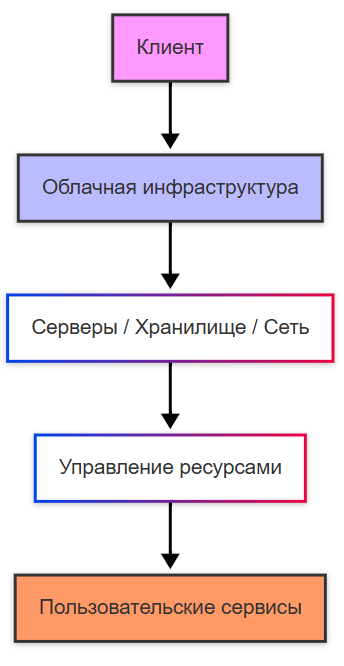
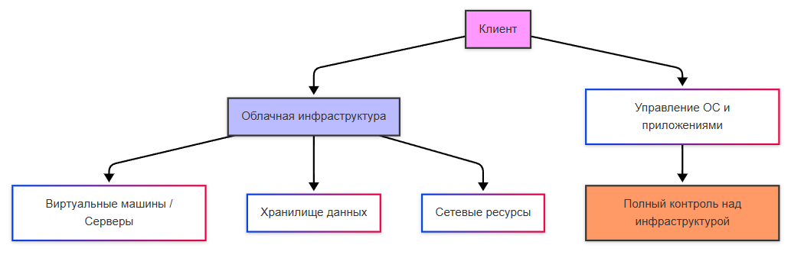
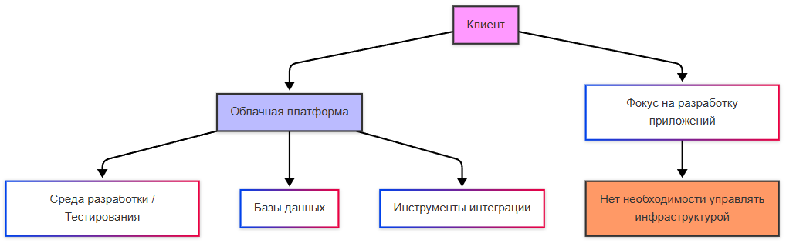
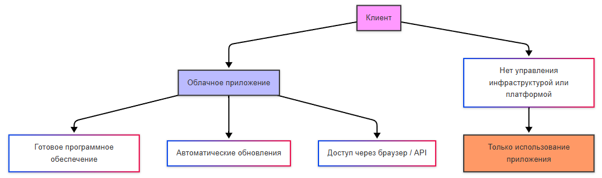

import DockerEmulator from '@site/src/components/DockerEmulator.jsx';
import ContainerOrchestrator from '@site/src/components/ContainerOrchestrator.jsx';
import ScalingDemo from '@site/src/components/ScalingDemo.jsx';

# Модели и сервисы облачных технологий

<div class="article-tags">
  <span class="tag tag-required">ОБЯЗАТЕЛЬНО</span>
  <span class="tag tag-beginner">ДЛЯ НОВИЧКОВ</span>
</div>

<span class="complexity-badge">Разработчику</span>
<span class="complexity-badge">Аналитику</span>
<span class="complexity-badge">Тестировщику</span>  
<span class="complexity-badge">Архитектору</span>
<span class="complexity-badge">Руководителю</span>

## О технологиях

### Что такое сервис и облако?

Каждому нужно решить какие-то задачи на пути к своим целям, будь то развитие своего бизнеса, создание и производство, налаживание, автоматизация и цифровизация, развёртывание и так далее. И для решения проблем нужны деньги.

Сервера стоят дорого, очень дорого. А системы всё прожорливее, нужно следовать трендам и оставаться технологичным. 

**Сервис** - это как раз такая штука, которую мы используем, но сами не собираем. Буквально, это услуга - как прачечные, например. Стиральную машину там покупать не приходится, лишь оставить вещи да заплатить, результат получим в срок. В IT так же - кто-то уже сделал работу, позаботился обо всём (БД, сервер, хранилище), а нам остаётся лишь взять и пользоваться.

И по задумке, облачные технологии как раз подразумевают, что наши программы и данные лежат не на наших личных физических устройствах, а где-то в интернете на чужих мощных серверах. Например, для бизнеса не требуется покупать свой серверный зал, а достаточно арендовать "кусочек облака" у Amazon или Яндекса.

Слово "облако" появилось, потому что на старых схемах сетей интернет рисовали...в виде облака!

Внутри такого "облака" - куча серверов, проводов, маршрутизаторов. А пользователю без разницы, что там внутри, он просто "кидает данные в облако", и получает результат. Как в туман, где не видно, как работает, но оно работает!

---

### Что такое облачные технологии?

Облачные технологии – это предоставление вычислительных ресурсов (серверы, хранилища, приложения) через интернет по модели «как услуга» (as a Service – aaS).

<div class="callout callout--tip">
  <div class="callout-title">Внимание</div>
Приготовьтесь!
Страшные слова	
Вы можете и не встретить облачные технологии для бизнеса, если будете работать с собственными физическими серверами, поэтому, скорее всего, многое покажется непонятным и неприменимым на практике. И это так, потому что расчёт идёт на крупные организации со своей инфраструктурой. Небольшие компании будут использовать простые хранилища и максимум - свой домен и хранилище. Но те, что побогаче, ищут более серьёзные решения, которые мы и рассмотрим в настоящей главе. Мы не будем углубляться, но основу познаем.
</div>


★ **Облачные технологии** обеспечивают масштабируемость (увеличение и уменьшение ресурсов «на лету»), круглосуточную доступность из любой точки мира, и резервное копирование. Словом, клиент платит за то, что кто-то поделится частью своих надёжных серверов, предоставляя ресурсы и пространство для развёртывания своих решений.

```
Клиенту нужен сервер - Техногигант предоставляет свои ресурсы.
```



По сути, это аренда ресурсов.

Такая аренда определяется по характеру модели обслуживания.

---

### Модели обслуживания

| Тип | Что предоставляется | Примеры |
|---|---|---|
| IaaS (Infrastructure) | Виртуальные серверы, сети, хранилища | AWS EC2, Google Compute Engine |
| PaaS (Platform) | Готовая среда для разработки | Heroku, Google App Engine |
| SaaS (Software) | Готовые приложения | Google Workspace, Microsoft 365 |


#### IaaS (Infrastructure as a Service):



Смысл - аренда пустого участка. "Строй сам" - это "голый" сервер, виртуальный. На него мы сами ставим ОС, БД, приложения.

#### PaaS (Platform as a Service):



Смысл - аренда "квартиры с ремонтом", заезжай и живи. Это готовая площадка для кода, можно кинуть свой код, и платформа сама его запустит.

#### SaaS (Software as a Service):



Это отель "всё включено" - пользуйся и кайфуй. Обычно это готовое приложение, где можно просто работать.

---

<ScalingDemo />

<ContainerOrchestrator />

<DockerEmulator />

### Облачный хостинг и сервисы

Мы уже упоминали такую технологию, как VPS. Это вид хостинга, который представляет собой выделенный виртуальный сервер. По сути, хостинги – своего рода облачные технологии, но конкретно облачный хостинг – это предоставление виртуальных машин в облаке, с обеспечением гибкости и отказоустойчивости. Но это касается IaaS. PaaS – это полноценная платформа, а SaaS, как правило, уже разработанные приложения для работы.

★ **Облачные сервисы** бывают следующих видов:
	- Базы данных (управляемые MySQL/PostgreSQL, как в Amazon RDS, или NoSQL, как в Google Firestore);
	- Контейнеры и оркестраторы (AWS ECS/EKS, Google Kubernetes Engine);
	- Бессерверные вычисления (Serverless – AWS Lambda, Google Cloud Functions).

★ **Облачные хранилища** предоставляют возможность размещения и использования данных на серверах:

| Сервис | Особенности | Использование |
|---|---|---|
| Amazon S3 | Объектное хранилище с шифрованием. Высокая надёжность и версионирование | Бэкапы баз данных, хостинг статики сайтов, аналитика |
| Google Drive | Интеграция с Google Workspace – Google Диск, онлайн-редактирование документов, общий доступ | Файлообмен, совместная работа, резервные копии данных |
| Microsoft OneDrive | Синхронизация с Windows, история версий, защита данных | Личные файлы, резервирование документов, общий доступ |
| Backblaze B2 | Простое хранилище, совместимое с API S3, оптимизировано для редко используемых данных | Архивы логов, медиа, резервные копии и большие датасеты |


**Как это работает?**

К примеру, если мы захотим развернуть проект в облаке, то мы выполняем следующие шаги:
	- запускаем VPS (к примеру, Ubuntu);
	- устанавливаем компоненты;
	- настраиваем виртуальный хост в Nginx;
	- устанавливаем WordPress.

Так можно развернуть проект VPS+Nginx+WordPress. По аналогии можно развернуть любой проект – облако даёт сервер, который мы уже вольны настроить в рамках разумного. И, конечно, самое важное – облачные технологии платные, и используют подписочные модели.

Вы, кстати, можете попробовать развернуть свой сайт. Мы изучим в дальнейшем и фронтенд, и бэкенд. И я крайне рекомендую не просто сухо знакомиться с материалом, а после изучения HTML, CSS, JavaScript попробовать развернуть хотя бы простую страницу на каком-нибудь домене. Однако большинство из них сейчас платные, поэтому учитывайте свои возможности.

**Объектное хранилище** (например, Amazon S3, Yandex Object Storage, VK Cloud Object Storage) — это система хранения данных, где каждый файл представлен как объект с уникальным идентификатором и метаданными.

> Объектное хранилище - это способ хранить файлы не в папках, а по ссылке. Каждый файл - это объект с уникальным адресом (URL). Мы не лазаем по дискам (`C:`, `D:`), а просто даём ссылку, и файл загрузился или скачался. Это нужно для миллионов фото для нейросетей, бэкапов, логов, статических файлов для сайта (картинки, видео). Подключают его через API - просто отправляют запрос по ссылке без установок.

Мы привыкли к тому, что «облако» для нас — это просто «свалка» с запасными данными, или тем, что мы залили «поделиться». Но представим, что мы являемся крупной корпорацией, которой нужно обучать свою нейросеть по распознаванию фотографий. Для этого у нас есть задача собрать датасет, набор фотографий, и этих фотографий - миллионы. Здесь простым облаком не обойтись, и для таких серьёзных запросов техногиганты предоставляют хранилище, в которое можно загрузить эти данные.

Технически, объектное хранилище представляет собой файловый хостинг в облаке. Традиционные подходы имели ряд проблем:
- файлы на сервере сложно масштабировать, есть проблемы с доступностью;
- база данных для файлов слишком дорогая, медленная и имеет ограничения;
- сетевые диски и FTP слишком сложные в управлении.

Поэтому объектные хранилища, такие как S3, решают проблему, благодаря бесконечному масштабированию, высокой доступности, доступу через HTTP (URL файла и всё!), и свои встроенные возможности, такие как версионирование, права доступа и жизненный цикл.

Примеры:
- аватарки и изображения пользователей - загрузили, получили URL, раздаём через CDN;
- документы - договоры, акты, вложения;
- бэкапы баз данных и файлов;
- логи, которые пишутся напрямую в S3;
- статические картинки для сайтов;
- архивы, редко используемые данные.

Бизнес-польза в том, что не нужно думать о дисках и серверах, достаточно лишь платить за используемое место, а взамен получать единый интерфейс, надёжное хранение, простой доступ, встроенную безопасность и права доступа. В основном разворачивают MinIO, и для разработки, и для прода, это даёт локальное файловое хранилище.

Вообще, объектное хранилище используется для больших данных (Big Data), но о том, что такое «биг дата», мы поговорим в отдельной главе.

У таких компаний, как Amazon, Microsoft, Google, Яндекс, VK есть множество различных сервисов, которые все являются хорошим показателем того, что представляют собой облачные технологии - концепция в том, что крупная корпорация строит мощные дата-центры, оборудует качественным железом и обеспечивает надёжную инфраструктуру, после чего предоставляет удобные сервисы для пользователей. В основном целевой аудиторией являются представители бизнеса, хотя многими функциями могут пользоваться и рядовые пользователи.

Давайте кратко пробежимся по этим компаниям и некоторым из сервисов, которые они предлагают, в качестве обзора на облачные технологии.

Важно понимать, что техногиганты зарабатывают таким образом - предоставляя ресурсы для меньших собратьев, которые, в свою очередь, получают преимущество в части снятия забот по развёртыванию инфраструктуры.

Самим, с нуля, развернуть свою инфраструктуру, включая физические сервера и виртуальные машины, очень тяжело, и здесь даже не вопрос денег, а вопрос безопасности, надёжности, и труда. Специалисты, которые умеют разворачивать системы на достойном уровне, довольно редкие, и порой выгоднее просто купить готовое решение, и просто работать с предоставляемым функционалом.

---

## AWS

**AWS (Amazon Web Services)** - лидер рынка облачных технологий, это крупнейшая облачная платформа, предлагающая широкий спектр услуг для разработчиков, бизнеса и предприятий.

Официальная документация есть на https://aws.amazon.com/

**Amazon**, стоящий за AWS, — это крупнейший онлайн-ритейлер в мире, один из пионеров облачных технологий. Amazon Web Services (AWS) была запущена в 2006 году и с тех пор стала лидером рынка облачных сервисов. AWS предлагает более 200 услуг для различных сценариев использования: от разработки приложений до аналитики больших данных и искусственного интеллекта. AWS используется такими компаниями, как Netflix, Airbnb и NASA, для поддержки своих масштабируемых и высокопроизводительных систем. Многие другие компании, владельцы облачных технологий, ориентируются в первую очередь на этого гиганта.

Да, например, когда люди смотрят Netflix, то запрос на "сериал" идёт в облако Amazon.

1. Amazon EC2 (Elastic Compute Cloud) предоставляет виртуальные серверы (инстансы), которые можно настраивать под свои задачи. Вы можете выбирать между различными типами инстансов (например, общего назначения, вычислительных или GPU-оптимизированных).
Инстансы могут автоматически масштабироваться в зависимости от нагрузки. Такая платформа используется, когда нужен полный контроль над инфраструктурой, включающей веб-сервера, базы данных, и аналитические задачи, а также для высокопроизводительных вычислений, таких как тренировка моделей машинного обучения.
2. Amazon S3 (Simple Storage Service) — это объектное хранилище, которое используется для хранения больших объемов данных. Оно позволяет хранить файлы любого типа и объема. Объектное хранилище отличается от традиционных файловых систем тем, что данные хранятся в виде объектов (файлов с метаданными), а не в иерархической структуре папок. S3 предназначен для хранения медиафайлов вроде фото и видео, резервного копирования, хранения логов и аналитических данных.

Пример работы с S3:
	- создание бакета (bucket) - контейнера для данных (их может быть несколько);
	- загрузка файлов в бакет;
	- настройка прав доступа (публичный/приватный);
	- использование API или SDK для интеграции с приложениями.

Приложение подключается к такому сервису по URL, с использованием секретных ключей, и указания бакетов.
В объектном хранилище хранятся миллиарды объектов с возможностью автоматического масштабирования. Эти данные реплицируются в нескольких центрах обработки данных.

Протокол S3 поддерживается большинством платформ, в том числе такими крупными отечественными решениями, как «Yandex Cloud», «#CloudMTS», «СберДиск».

**MinIO** — это высокопроизводительное программное обеспечение для работы с объектным хранилищем, совместимое с Amazon S3 API. MinIO поддерживает стандартный интерфейс Amazon S3, что позволяет легко интегрировать его с приложениями, использующими S3. Это приложение с открытым исходным кодом, его можно развернуть как на одном сервере, так и в кластере, а применяется часто он для хранения данных в Kubernetes, CI/CD-системах, аналитике больших данных и машинном обучении.

3. Amazon RDS (Relational Database Service) — это сервис, который предоставляет управляемые базы данных, такие как MySQL, PostgreSQL, Oracle и SQL Server. Он берёт на себя настройку, масштабирование и обслуживание баз данных, что упрощает работу разработчиков, включая автоматическое резервное копирование, точечное восстановление, выбор СУБД.
Кстати о СУБД, у Amazon есть своя - Amazon Aurora.
4. AWS Lambda — это сервис Function as a Service (FaaS), который позволяет выполнять код в ответ на события без необходимости управления серверами.
Функции могут активироваться событиями, такими как HTTP-запросы, изменения в базе данных или сообщения в очереди, пишутся на Python, Node.js, Java, Go и других языках.
5. AWS ECS (Elastic Container Service) и AWS EKS (Elastic Kubernetes Service) — это сервисы для управления контейнерами. ECS работает с Docker, а EKS использует Kubernetes для оркестрации контейнеров. Кластеры контейнеров могут автоматически увеличиваться или уменьшаться в зависимости от нагрузки. Это решение для микросервисной архитектуры, когда нагрузка распределяется по кластерам, а приложения «пакуются» в контейнеры.
6. Heroku — это платформа как услуга (PaaS), которая позволяет разворачивать приложения без необходимости настройки серверов. Можно развернуть приложение за несколько минут без настройки инфраструктуры, с поддержкой приложений на Python, Node.js, Ruby, Java и других языках.

<div class="callout callout--tip">
  <div class="callout-title">Практическое задание</div>
Ознакомьтесь с Amazon и её продуктами.
</div>

---

## Azure

**Microsoft Azure** — это облачная платформа от Microsoft, которая активно используется в корпоративной среде.

Официальная документация есть на https://azure.microsoft.com/Рu/

**Microsoft** — это одна из крупнейших технологических компаний в мире, известная своими продуктами, такими как Windows, Office и Xbox. Microsoft Azure, запущенный в 2010 году, быстро стал одним из ключевых игроков на рынке облачных технологий. Azure активно используется в корпоративной среде благодаря своей интеграции с продуктами Microsoft, такими как Windows Server, Active Directory и Microsoft 365. И поэтому основная продающая особенность Azure - именно эти интеграции.

Microsoft позиционирует Azure как универсальную платформу, которая подходит для всех типов задач: от разработки приложений до аналитики данных и Интернета вещей (IoT).

1. Azure Virtual Machines — это сервис Infrastructure as a Service (IaaS), который предоставляет виртуальные машины для выполнения различных задач. Он аналогичен Amazon EC2 и позволяет разворачивать и управлять виртуальными серверами на платформе Azure.
2. Microsoft 365 (ранее Office 365) — это набор облачных сервисов, который объединяет знакомые инструменты Microsoft Office (Word, Excel, PowerPoint) с решениями для совместной работы, такими как Teams, OneDrive и Outlook. Teams позволяет проводить видеоконференции, обмениваться файлами и работать над документами в реальном времени. OneDrive предоставляет место для хранения файлов, которые доступны с любого устройства. Power Automate позволяет создавать автоматизированные рабочие процессы, такие как отправка уведомлений или обновление данных. К примеру, можно создать документ в Word, поделиться с коллегами через OneDrive и вместе его редактировать.
3. Azure Kubernetes Service (AKS) — это управляемый сервис Kubernetes, который позволяет разворачивать, управлять и масштабировать контейнеризированные приложения. AKS берёт на себя сложную часть управления кластерами Kubernetes, позволяя разработчикам сосредоточиться на коде. Мы отдельно поговорим об оркестрации и собственно Kubernetes.
4. Azure Functions — это сервис Function as a Service (FaaS), который позволяет выполнять код в ответ на события без необходимости управления серверами. Это аналог AWS Lambda. Функции могут активироваться событиями, такими как HTTP-запросы, изменения в базе данных или сообщения в очереди, и пишутся на C#, JavaScript, Python, Java и других языках.
5. Azure Blob Storage — это объектное хранилище, которое используется для хранения больших объёмов неструктурированных данных, таких как медиафайлы, логи и резервные копии. Оно похоже на Amazon S3 и предназначено для хранения миллиардов объектов с возможностью автоматического масштабирования. Данные организованы в контейнеры (containers), шифруются и интегрируются с другими сервисами.

<div class="callout callout--tip">
  <div class="callout-title">Практическое задание</div>
Ознакомьтесь с Microsoft и её продуктами.
</div>

---

## GCP


**Google Cloud Platform** предлагает мощные инструменты для машинного обучения, аналитики и разработки приложений.

Официальный сайт - https://cloud.google.com/

**Google**, стоящий за Google Cloud Platform (GCP), — это технологический гигант, известный своими продуктами, такими как Google Search, YouTube, Android и Chrome. GCP была запущена в 2008 году и с тех пор стала одной из самых быстрорастущих облачных платформ. Google активно инвестирует в искусственный интеллект, машинное обучение и аналитику данных, что делает GCP особенно привлекательной для инновационных проектов. И, конечно, GCP тесно интегрирована с популярными инструментами Google, такими как Google Workspace и TensorFlow.

1. Google Compute Engine (GCE) — это сервис Infrastructure as a Service (IaaS), который предоставляет виртуальные машины (инстансы) для выполнения различных задач.
Если нужно запустить веб-сервер, базу данных или обработать большие объёмы данных, GCE позволяет создать виртуальную машину с нужной конфигурацией.
2. Google App Engine — это платформа как услуга (PaaS), которая позволяет разворачивать веб-приложения без необходимости управления инфраструктурой. App Engine поддерживает Python, Java, Node.js, Go, PHP, Ruby и другие популярные языки.
3. Google Kubernetes Engine (GKE) — это управляемый сервис Kubernetes, который позволяет разворачивать, управлять и масштабировать контейнеризированные приложения. Kubernetes — это мощная система оркестрации контейнеров, которая автоматизирует развертывание, масштабирование и управление приложениями.
4. Google Firestore — это NoSQL база данных, которая обеспечивает высокую скорость чтения и записи. Данные хранятся в виде документов, организованных в коллекции. Используется для мобильных и веб-приложений, где важна работа в реальном времени.
5. Google Workspace (ранее G Suite) включает Gmail, Google Drive, Docs, Sheets и другие инструменты для совместной работы.
Gmail — это платформа для Email. Корпоративная версия Gmail предлагает профессиональные адреса электронной почты (например, yourname@yourcompany.com) и расширенные функции, такие как интеграция с календарём и задачами, защита от спама и фишинга, возможность настройки правил и фильтров, поддержка видеоконференций.

	- Google Drive - облачное хранилище, которое позволяет хранить, организовывать и делиться файлами, с автоматической синхронизацией файлов между устройствами, совместным редактированием документов и надёжным шифрованием.
	- Google Docs, Sheets, Slides — это облачная замена традиционных офисных пакетов, вроде Microsoft Office, с историей изменений, кроссплатформенным доступом и совместным редактированием.
	- Google Meet - сервис видеоконференций с высоким качеством.
	- Google Calendar - инструмент для планирования встреч, мероприятий и задач.
	- Google Chat - мессенджер для общения внутри команды.
	- Google Forms - инструмент для создания опросов, анкет и тестов.
	- Google Sites - простой конструктор сайтов, который позволяет создавать внутренние порталы, лендинги или информационные страницы без знания программирования.
	- Google Keep - приложение для заметок, которое помогает организовать идеи, задачи и списки.
	- Google Vault - инструмент для архивации данных и управления электронной перепиской.

6. Google Colaboratory (Colab) — это облачная платформа для машинного обучения и анализа данных. Она предоставляет бесплатный доступ к Jupyter Notebook с поддержкой GPU, и предоставляет интерактивную среду программирования, что позволяет писать и выполнять код в ячейках, а также добавлять текстовые объяснения, формулы, изображения и другие элементы. Всё это происходит прямо в браузере, без необходимости установки дополнительных программ или настройки локальной среды.

Colab был создан для упрощения работы с данными и алгоритмами машинного обучения. Он позволяет пользователям сосредоточиться на написании кода и анализе данных, не беспокоясь о настройке серверов или установке зависимостей. Colab предоставляет доступ к мощным вычислительным ресурсам, включая графические процессоры (GPU) и тензорные процессоры (TPU).

Работать с Colab просто:
	- перейти на сайт Google Colab - colab.research.google.com;
	- создать новый Notebook (файл Jupyter Notebook);
	- написать код в ячейки и нажать Shift+Enter для выполнения;
	- выбрать нужный тип устройства (GPU/TPU);
	- сохранить проект - он будет в Google Drive, и его можно оттуда экспортировать.

<div class="callout callout--tip">
  <div class="callout-title">Практическое задание</div>
Ознакомьтесь с Google и её продуктами.
</div>

---

## Яндекс, VK, Mail.ru

Три крупнейшие технологические компании России - Яндекс, VK и Mail.ru (ныне VK) и их подразделения предлагают широкий спектр сервисов для пользователей и бизнеса. Очевидно, что они ориентируются на троицу Amazon/Microsoft/Google, и разворачивают свои аналоги, не ограничиваясь территорией Российской Федерации.

**Яндекс** — это одна из крупнейших технологических компаний в Российской Федерации, которая началась с поисковой системы и превратилась в многопрофильную корпорацию. Сегодня Яндекс предлагает множество сервисов для пользователей и бизнеса:

Популярные сервисы Яндекса:
	- Яндекс.Браузер: Быстрый и удобный браузер с встроенным блокировщиком рекламы и турбо-режимом.
	- Яндекс.Еда: Сервис доставки еды из ресторанов.
	- Яндекс.Диск: Облачное хранилище для личных файлов, фотографий и документов.
	- Яндекс.Go: Сервис такси и доставки.
	- Яндекс.Маркет: Платформа для онлайн-шопинга.
	- Яндекс.Почта: Надёжный почтовый сервис с интеграцией календаря и задач.
	- Яндекс.Пэй: Система бесконтактных платежей.
	- Яндекс.Музыка: Стриминговый сервис для прослушивания музыки.
	- Яндекс.Телемост: Платформа для видеоконференций.
	- Яндекс 360: Комплексное решение для бизнеса, включающее почту, облачное хранилище, задачи и календарь, по аналогии с Google, в том числе работу с документами, таблицами и формами.

Но это сервисы для физических лиц. Корпоративные решения — это Yandex Cloud.

Облачные сервисы Яндекса: Yandex Cloud
	- Yandex Cloud — это облачная платформа, которая предоставляет современные решения для разработчиков и бизнеса. Основные инструменты включают:
		- Compute Cloud: Виртуальные машины для запуска приложений.
		- Object Storage: Объектное хранилище для хранения больших объёмов данных.
		- API Gateway: Инструмент для управления API.
		- Cloud DNS: Управляемый сервис доменных имён.
		- Managed Services: Поддержка различных СУБД, таких как Greenplum, Kafka, MongoDB, MySQL, PostgreSQL, ClickHouse.
		- DataLens: Сервис для анализа данных и визуализации.
		- Serverless Functions: Выполнение кода без управления серверами.

**VK (ранее Mail.ru Group)** — это технологическая компания, которая владеет множеством популярных сервисов, включая социальные сети, мессенджеры и образовательные платформы. VK активно развивает облачные технологии через свои подразделения.

Популярные сервисы VK
	- ВКонтакте: Самая популярная социальная сеть в России.
	- Одноклассники: Социальная сеть для общения и развлечений.
	- VK Музыка: Стриминговый сервис для прослушивания музыки.
	- VK Клипы и VK Видео: Платформы для коротких видео и фильмов.
	- Skillbox и GeekBrains: Образовательные платформы для обучения IT-специальностям.
	- RuStore: Российский аналог App Store и Google Play.
	- VK Play: Платформа для игр и стриминга.

Облачные сервисы VK: VK Cloud

**VK Cloud** — это облачная платформа, которая предлагает широкий набор инструментов для разработки и работы с данными. Основные сервисы включают:
	- Cloud Servers: Виртуальные серверы для любых задач.
	- VPS/VDS: Виртуальные частные серверы.
	- Autoscaling: Автоматическое масштабирование ресурсов.
	- Cloud GPU: Графические процессоры для машинного обучения и рендеринга.
	- Cloud Desktop: Виртуальные рабочие столы.
	- Object Storage: Объектное хранилище для хранения данных.
	- Cloud Networks: Управление сетями и подключениями.
	- Tarantool: NoSQL база данных для высокопроизводительных приложений.
	- Managed Services: Поддержка СУБД, таких как Greenplum, Kafka, MongoDB, MySQL, PostgreSQL.

**Mail.ru** — это русскоязычный интернет-портал, который входит в экосистему VK. Он включает в себя множество сервисов для пользователей и малого бизнеса.

Популярные сервисы Mail.ru
	- Mail.ru Почта: Один из старейших почтовых сервисов в России.
	- Mail.ru Поиск: Поисковая система.
	- Mail.ru Cloud: Облачное хранилище для файлов и документов.
	- Мессенджер ICQ: Популярный мессенджер. Ныне закрыт.

Облачные сервисы Mail.ru: VK WorkSpace

VK WorkSpace — это платформа для бизнеса, которая включает:
	- Корпоративная почта: Почта с календарём и адресной книгой.
	- Мессенджер: Инструмент для общения внутри компании.
	- Видеоконференции: Платформа для проведения онлайн-встреч.
	- Задачи: Управление проектами и задачами.
	- Облачное хранилище: Хранилище со встроенным редактором документов.

<div class="callout callout--tip">
  <div class="callout-title">Практическое задание</div>
Ознакомьтесь с VK, Яндекс, Mail.ru и их продуктами.
</div>

---

## Файлообменники

**Файлообменники** позволяют хранить и обмениваться файлами через интернет. Они сейчас стали неотъемлемой частью нашей современной цифровой жизни, так как упрощают доступ к данным с любого устройств и обеспечивают возможность совместной работы. 

Вот популярные решения:

1. Google Drive — это облачный сервис от компании Google, который интегрирован с Google Docs, Sheets и Slides. Google Drive особенно популярен среди студентов, преподавателей и компаний, которые используют экосистему Google Workspace.
2. Microsoft OneDrive — это облачное хранилище от Microsoft, которое тесно интегрировано с операционной системой Windows и пакетом Microsoft 365. OneDrive автоматически синхронизируется с папкой в ОС.
3. Backblaze B2 — это недорогое облачное хранилище для резервного копирования и хранения больших объемов данных. Backblaze часто используется для создания резервных копий серверов.
4. Яндекс.Диск — это облачное хранилище от компании Яндекс. Яндекс.Диск особенно популярен среди русскоязычных пользователей благодаря своей локализации и удобству..
5. MEGA — это файлообменник, который отличается высоким уровнем безопасности. Все данные шифруются до того, как попадают на серверы MEGA, что делает их недоступными даже для самого сервиса. MEGA предоставляет детальную информацию о том, как обрабатываются данные.
6. Mail.ru Cloud — это облачное хранилище, тесно интегрированное с почтовым сервисом Mail.ru.
7. Dropbox — один из лидеров на рынке файлообменников.

Все файлообменники стремятся к единому функционалу, и по сути, обладают набором таких функций, как кроссплатформенность, совместное использование, автоматическая синхронизация, шифрование и защита данных.

Совместная работа подразумевает возможность нескольким пользователям одновременно работать над одними и теми же файлами. Это удобно, к примеру, когда ведётся работа с таблицей или документом.

<div class="callout callout--tip">
  <div class="callout-title">Практическое задание</div>
Попробуйте зарегистрироваться в любом из указанных файлообменников.
Добавьте любой файл в файлообменник.
Поделитесь ссылкой (можете просто скопировать для себя).
</div>

---
