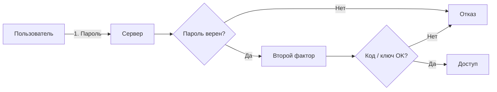

# Безопасность в облаке

<div class="article-tags">
  <span class="tag tag-required">ОБЯЗАТЕЛЬНО</span>
  <span class="tag tag-beginner">ДЛЯ НОВИЧКОВ</span>
</div>

<span class="complexity-badge">Разработчику</span>
<span class="complexity-badge">Аналитику</span>
<span class="complexity-badge">Тестировщику</span>
<span class="complexity-badge">Архитектору</span>
<span class="complexity-badge">Руководителю</span>

Представьте, что вы сняли офис в бизнес-центре — охрана здания, пожарная система и лифты — на стороне арендодателя, а ключи от вашего сейфа, пропуска сотрудников и порядок на столах — на вас. С облаком та же логика — провайдер отвечает за **физику и платформу**, а вы — за **учётки, данные, сеть внутри подписки и код**, который туда выкатываете.

Эта глава — практический минимум без лишней теории — что включить в личном аккаунте (почта, диск, консоль AWS) и что не забыть в проекте (секреты, порты, bucket). Если вы только знакомитесь с облаком, сначала прочитайте [модели и сервисы](/encyclopedia/8-infra-security/8-01-oblachnye-tehnologii/1); таблицы ответственности по IaaS/PaaS/SaaS и регионы — в [облачных концепциях](/encyclopedia/8-infra-security/8-01-oblachnye-tehnologii/12). Корпоративные политики Zero Trust и SOC — в [8.07](/encyclopedia/8-infra-security/8-07-informatsionnaya-bezopasnost/121).

<div class="callout callout--info">
  <div class="callout-title">Для кого эта глава</div>

  <div class="callout-body">
  Новичок в IT — настройте MFA и шаринг файлов.

  Разработчик — проверьте IAM, security groups и отсутствие ключей в Git.

  Руководитель — поймите, что сертификат ISO у провайдера **не отменяет** открытый порт 22 на весь интернет у вашей ВМ.
</div>
  </div>


---

## С чего начать — две "линии фронта"

| Линия | Примеры | Ваша задача |
|-------|---------|-------------|
| **Личный и офисный SaaS** | Google Drive, Яндекс.Диск, M365 | Сильный пароль, MFA, настройки "кто видит файл" |
| **Облако для приложений** | AWS, Azure, Yandex Cloud | IAM-роли, закрытые порты, секреты не в Git, шифрование |

Путаница между ними опасна: включённая 2FA в почте **сама по себе** не закрывает S3-bucket с бэкапами, если политика bucket разрешает `s3:GetObject` всему интернету.

**Пример из практики:** менеджер хранит договоры в Google Drive с ссылкой "все, у кого есть URL". Параллельно разработчики выкладывают дамп БД в object storage "на час, для теста". Два разных продукта — два разных набора настроек; оба требуют отдельной проверки.

| Ситуация | Линия | Что проверить |
|----------|-------|----------------|
| Утечка таблицы клиентов из Excel на общий диск | SaaS | Кто в списке доступа, история версий, MFA |
| Сканер нашёл открытый порт 5432 на ВМ | IaaS/PaaS | Security group, bind адрес БД, VPN |
| В GitHub лежит `.env` с ключами AWS | Разработка | Ротация ключей, Secrets Manager, pre-commit |

---

## Модель совместной ответственности

**Облачная безопасность** — политики, технологии и привычки, которые защищают данные и сервисы в облаке.

**Провайдер** обычно отвечает за:

- физический доступ к ЦОД, питание, охлаждение;
- сеть и гипервизор до границы вашей ВМ или managed-сервиса;
- соответствие стандартам уровня дата-центра (ISO 27001, SOC 2 — по документам вендора).

**Вы** отвечаете за всё **внутри** выделенной среды:

- патчи ОС на IaaS-ВМ;
- код приложения и уязвимости зависимостей;
- учётные записи, роли, MFA;
- шифрование и классификация данных;
- правила firewall / security groups;
- безопасность ноутбука, с которого заходите в консоль.

<div class="callout callout--info">
  <div class="callout-title">Принцип разделения зон</div>

  <div class="callout-body">
  <p>Провайдер охраняет здание. Вы охраняете сейф: кто имеет ключ, что лежит внутри, не оставили ли сейф открытым.</p>
</div>
  </div>


Как граница сдвигается от IaaS к SaaS — см. [таблицу в главе 12](/encyclopedia/8-infra-security/8-01-oblachnye-tehnologii/12#shared-responsibility-model).

---

## Защита доступа

### Пароли и менеджеры

Один утёкший пароль от почты часто открывает цепочку — "восстановить пароль" в облаке, Git, админку. **Уникальный пароль на каждый сервис** и менеджер паролей (Bitwarden, KeePass, встроенные в браузер с осторожностью) — базовый уровень, без философии.

---

### MFA (2FA)

**Многофакторная аутентификация** — после пароля нужен второй фактор — приложение-аутентификатор (Google/Microsoft Authenticator), аппаратный ключ (YubiKey) или, с оговорками, SMS.



Включите MFA **везде, где можно** — почта, консоль AWS/Azure, GitHub, файлообменник. Почта — "мастер-ключ" для сбросов.

---

### Активные сессии

В настройках безопасности сервиса посмотрите **устройства и сессии**. Незнакомый IP или старая сессия — повод завершить вход и сменить пароль.

---

### Принцип наименьших привилегий

Давайте людям и сервисам **минимум прав**, достаточный для задачи. В общем доступе к файлу — "только просмотр", а не "редактор с правом удаления", если коллеге нужно лишь прочитать.

Для облака разработки — роли в IAM, а не "admin на всех":

```json
{
  "role": "app-backend-prod",
  "allow": ["s3:GetObject", "s3:PutObject"],
  "deny": ["s3:DeleteBucket", "iam:*", "ec2:*"]
}
```

Это упрощённая иллюстрация идеи: сервисная учётка приложения не должна удалять bucket или создавать ВМ.

В реальных облаках политики пишут на JSON (AWS IAM), YAML (Kubernetes RBAC) или в графическом редакторе Azure. Смысл один — **роль для приложения**, **роль для человека-админа**, **роль только на чтение** для аналитика. Подробнее про вход пользователя и токены — в статье [аутентификация и авторизация](/encyclopedia/2-system-network/2-08-osnovy-informatsionnoy-bezopasnosti/111); про хранение секретов в CI — в [8.03](/encyclopedia/8-infra-security/8-03-zabota-o-kode-i-dannyh/117).

**Типичная ошибка:** выдать разработчику `AdministratorAccess` "чтобы быстрее". Потом скрипт с опечаткой удаляет production-bucket. Лучше отдельная dev-подписка и роли с префиксом окружения (`dev-*`, `prod-*`).

---

### Видимость файлов по умолчанию

Многие сервисы когда-то делали ссылки "для всех с URL". Перед загрузкой договора или скана паспорта проверьте: **только я / только выбранные люди**.

<div class="callout callout--tip">
  <div class="callout-title">Практика</div>

  <div class="callout-body">
  Включите уведомления о входе с нового устройства.

  Один раз настроили — дальше ловите чужой вход раньше, чем исчезнут данные.
</div>
  </div>


---

## Шифрование

Шифрование превращает данные в набор байт без ключа. В облаке важны **два состояния**:

1. **В движении (in transit)** — трафик между вами и облаком и между сервисами. Стандарт — **TLS** (HTTPS). Не отключайте проверку сертификатов в клиентах "чтобы быстрее".
2. **В покое (at rest)** — на дисках провайдера. Обычно **AES-256** на стороне платформы; в консоли часто включается при создании диска или bucket.

**Шифрование на стороне клиента** (Cryptomator, VeraCrypt перед загрузкой) — провайдер видит только "шум". Ключ только у вас: потеряли ключ — потеряли данные. Зато при компрометации аккаунта облака содержимое остаётся нечитаемым.

<div class="callout callout--info">
  <div class="callout-title">Нулевое знание</div>

  <div class="callout-body">
  <p>Если ключ шифрования не покидает ваше устройство, провайдер не может прочитать файлы — даже по запросу третьих лиц без вашего участия.</p>
</div>
  </div>


---

## Резервное копирование

Бэкап — копии для восстановления после:

- ransomware;
- случайного удаления;
- сбоя диска или ошибки деплоя.

Правило **3-2-1** — **3** копии данных, на **2** типах носителей, **1** копия **вне** основной площадки (другой регион, другой провайдер, офлайн).

Облако само по себе не заменяет стратегию — включите versioning в object storage, расписание snapshots для ВМ, проверьте **восстановление** хотя бы раз в квартал.

| Компонент | Где настраивать | Зачем |
|-----------|-----------------|--------|
| Версии объектов | S3 versioning, Blob soft delete | Откат после случайного удаления |
| Снимки диска | EBS snapshot, Azure Snapshot | Восстановление ВМ целиком |
| Managed БД | Автобэкап RDS / Azure SQL | Point-in-time restore |
| Off-site | Другой регион или провайдер | Пожар в ЦОД, ransomware |

**Учебный сценарий:** создайте тестовый bucket, загрузите файл (см. [главу 1](/encyclopedia/8-infra-security/8-01-oblachnye-tehnologii/1)), включите versioning, удалите объект и восстановите предыдущую версию. Один раз сделанное руками запоминается лучше абзаца про "3-2-1".

---

## Для разработчиков — не только "галочка в консоли"

### Секреты

Пароли БД, `AWS_SECRET_ACCESS_KEY`, токены API **не коммитят** в Git. Используют переменные окружения, CI-secrets или хранилища — HashiCorp Vault, AWS Secrets Manager, Azure Key Vault. Пример загрузки в S3 — в [главе 1](/encyclopedia/8-infra-security/8-01-oblachnye-tehnologii/1): ключи только из окружения.

---

### Сеть

**Security groups / NSG / firewall** — разрешайте минимум портов. SSH (22) или RDP (3389) на `0.0.0.0/0` — частая причина взлома за часы.

> **Предупреждение**  
> Публичный bucket или открытый порт базы данных в интернет — постоянный риск сканеров.

---

### Сканирование и логи

Перед продом — проверка зависимостей и образов контейнеров на известные CVE. Включите **аудит** действий в консоли (кто создал ВМ, кто менял политику bucket). Подробнее DevSecOps — в разделе [8.04 DevOps](/encyclopedia/8-infra-security/8-04-devops-ci-cd/intro); здесь важно знать, что это **ваша** зона при работе с облаком.

**Минимальный набор логов для расследования:**

- CloudTrail / Activity Log — кто и когда менял IAM и сеть;
- логи приложения (ошибки 401/403 — часто признак утечки токена);
- алерт на изменение политики публичного доступа к storage.

Если приложение в [Kubernetes](/encyclopedia/8-infra-security/8-06-konteynerizatsiya-i-orkestratsiya/intro), добавьте NetworkPolicy и отдельные service account — облачная ВМ и поды внутри неё защищаются разными механизмами.

---

## Чек-лист действий

| Действие | Зачем |
|----------|--------|
| MFA на почте и консоли облака | Утечка пароля не равна полный доступ |
| Уникальные пароли | Нет цепной реакции по сервисам |
| Проверка сессий и шаринга файлов | Чужие устройства и публичные ссылки |
| Секреты вне репозитория | Утечка в Git = компрометация продакшена |
| Закрытые порты и приватные bucket | Меньше автоматических атак |
| Бэкап 3-2-1 и тест restore | Ransomware и "ой, удалили" |
| Сертификаты провайдера (SOC 2, ISO) | Доверие для enterprise и compliance |

| Действие | IaaS: кто делает | Рекомендация |
|----------|------------------|--------------|
| Патчи ОС | Вы | Автообновления или регулярное окно |
| Firewall | Вы | Только нужные порты и IP |
| MFA пользователей | Вы | Обязательно для админов |
| Шифрование диска | Вы (вкл. при создании) | По умолчанию on |
| Физика ЦОД | Провайдер | Смотреть отчёты compliance |

---

## Что дальше

- Концепты регионов, SLA, затрат — [глава 12](/encyclopedia/8-infra-security/8-01-oblachnye-tehnologii/12).
- Сервисы и примеры S3/Lambda — [глава 1](/encyclopedia/8-infra-security/8-01-oblachnye-tehnologii/1).
- Zero Trust и корпоративная ИБ — [8.07/121](/encyclopedia/8-infra-security/8-07-informatsionnaya-bezopasnost/121).

---

{/* http-basics-link  */}
<div class="callout callout--tip">
  <div class="callout-title">Основа по протоколу</div>

  <div class="callout-body">
  Базовый разбор HTTP и HTTPS находится в отдельной статье — [HTTP как основа веб-интеграций](/encyclopedia/2-system-network/2-09-osnovy-integratsionnogo-vzaimodeystviya/118).
</div>
  </div>


