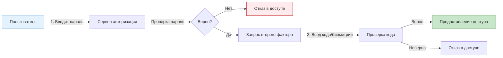

# Безопасность в облаке

  ОБЯЗАТЕЛЬНО
  ДЛЯ НОВИЧКОВ
  В РАЗРАБОТКЕ

Разработчику
Аналитику
Тестировщику  
Архитектору
Руководителю

## Безопасность в облаке

## Модель совместной ответственности в облачных вычислениях

**Облачная безопасность** — это комплекс мер, политик и технологий, направленных на защиту данных, приложений и инфраструктуры, размещенных в облачной среде. Ключевым принципом организации такой защиты является модель разделения ответственности между поставщиком облачных услуг и потребителем. Эта модель определяет границы контроля и зону ответственности каждой из сторон.

Поставщик облачных услуг (Cloud Provider) гарантирует физическую безопасность и работоспособность базовой инфраструктуры. В зону его ответственности входят:
- Физические дата-центры;
- Системы электропитания и охлаждения;
- Сетевое оборудование и каналы связи;
- Гипервизоры и виртуальные машины базового уровня;
- Физическая защита серверов от несанкционированного доступа.

Потребитель облачных услуг (Cloud Client) несет ответственность за всё, что находится *внутри* предоставленной ему среды. В зону ответственности пользователя входят:
- Операционные системы виртуальных машин;
- Прикладное программное обеспечение и базы данных;
- Управление доступом и учетными записями;
- Шифрование данных;
- Настройка брандмауэров и правил сетевой безопасности;
- Защита конечных устройств пользователей от вредоносного ПО.

Принцип разделения зон

Если провайдер отвечает за здание, то клиент отвечает за содержимое сейфа внутри этого здания.

### Виды облачных сервисов и границы ответственности

Модель ответственности варьируется в зависимости от типа предоставляемого сервиса: IaaS, PaaS или SaaS.

| Компонент | IaaS (Infrastructure as a Service) | PaaS (Platform as a Service) | SaaS (Software as a Service) |
| :--- | :--- | :--- | :--- |
| **Физическое оборудование** | Провайдер | Провайдер | Провайдер |
| **Сеть и гипервизор** | Провайдер | Провайдер | Провайдер |
| **Операционная система** | Клиент | Провайдер | Провайдер |
| **Приложения и данные** | Клиент | Клиент | Клиент |
| **Управление доступом** | Клиент | Клиент | Клиент |

В модели IaaS пользователь получает виртуальную машину и сам управляет операционной системой, устанавливает патчи и настраивает брандмауэр. В модели PaaS провайдер предоставляет платформу для запуска кода, а пользователь загружает только приложения и данные. В модели SaaS провайдер предоставляет готовое приложение, и пользователь управляет только своими данными и настройками аккаунта.

---

## Основные методы защиты данных и доступа

Защита информации в облаке требует применения многоуровневого подхода, включающего аутентификацию, шифрование и резервное копирование.

### Двухфакторная аутентификация

**Двухфакторная аутентификация (2FA)** или **множественная факторная аутентификация (MFA)** — это метод проверки подлинности пользователя, требующий предоставления двух различных типов доказательств. Первый фактор обычно представляет собой знание (пароль), второй — владение (телефон с приложением-аутентификатором, аппаратный ключ) или биометрию.

Использование MFA критически важно для предотвращения несанкционированного доступа к облачным аккаунтам даже в случае утечки пароля. Стандартные инструменты включают Google Authenticator, Microsoft Authenticator, YubiKey и SMS-коды.

### Шифрование данных

Шифрование преобразует информацию в нечитаемый формат, который может быть восстановлен только с помощью специального ключа. В облачной среде выделяют два состояния данных, требующих защиты:

1.  **Данные в движении (Data in Transit):** Информация, передаваемая между устройством пользователя и облаком, либо между компонентами облака. Для защиты используется протокол TLS (Transport Layer Security). Этот протокол создает зашифрованный туннель, предотвращая перехват данных третьими лицами.
2.  **Данные в покое (Data at Rest):** Информация, хранящаяся на дисках серверов. Для защиты применяются алгоритмы симметричного шифрования, такие как AES-256.

**Шифрование на стороне клиента** предполагает шифрование данных до их отправки в облако. Пользователь использует локальные программы, например VeraCrypt или Cryptomator. В этом случае провайдер видит только зашифрованные файлы и не имеет возможности прочитать содержимое без ключа дешифрования, который хранится исключительно у пользователя.

Принцип нулевого знания

При использовании шифрования на стороне клиента провайдер работает с «нулевым знанием» о содержимом файлов, так как ключи находятся вне его контроля.

### Резервное копирование

Резервное копирование — это процесс создания копий данных для их восстановления в случае потери. В облачной среде резервные копии защищают от следующих угроз:
- Вирусы-вымогатели (Ransomware), которые могут зашифровать основные данные;
- Аппаратные сбои оборудования;
- Человеческий фактор (случайное удаление или повреждение файлов);
- Логические ошибки программного обеспечения.

Эффективная стратегия резервного копирования включает правило 3-2-1: хранение трех копий данных на двух разных носителях, одна из которых находится в удаленном месте (например, в другом регионе или у другого провайдера).

---

## Базовые правила безопасного поведения

Соблюдение простых правил гигиены безопасности значительно снижает риск компрометации облачных ресурсов.

### Управление паролями

Использование уникальных паролей для каждого сервиса исключает возможность цепной реакции при взломе одного аккаунта. Если злоумышленник получит доступ к почтовому ящику с одним паролем, он не сможет войти в банковское приложение или облачное хранилище, если там используется другой пароль.

Рекомендуется использовать менеджеры паролей для генерации и хранения сложных комбинаций символов.

### Контроль активных сессий

Каждый облачный сервис предоставляет функцию просмотра списка активных сессий. Эта функция отображает устройства, с которых выполнен вход в аккаунт, время входа и IP-адреса.

Регулярная проверка этого списка позволяет выявить подозрительную активность. При обнаружении неизвестного устройства необходимо немедленно завершить соответствующую сессию и сменить пароль.

### Принцип наименьших привилегий

**Принцип наименьших привилегий** гласит, что пользователь должен иметь доступ только к тем ресурсам, которые необходимы для выполнения его текущих задач. При организации общего доступа к файлам или папкам следует строго ограничивать права других пользователей.

Вместо предоставления прав «Полный доступ» (Read/Write/Delete) рекомендуется выдавать права только на чтение или редактирование конкретных файлов. Это минимизирует ущерб в случае компрометации учетной записи одного из участников доступа.

Практическое применение

Настройте уведомления о входе в систему для получения мгновенного оповещения при попытке доступа к аккаунту.

### Проверка настроек конфиденциальности

Облачные сервисы часто имеют настройки по умолчанию, которые делают данные общедоступными или доступными широкому кругу лиц. Перед загрузкой важной информации необходимо проверить параметры видимости файлов и папок. Рекомендуется устанавливать видимость «Только для меня» или «Для выбранных лиц».

---

## Интеграция безопасности в процессы разработки

Для разработчиков и архитекторов интеграция безопасности в облачную среду требует внедрения практик DevSecOps.

### Управление секретами

Хранение паролей, ключей API и токенов доступа в исходном коде недопустимо. Используются специальные службы управления секретами (Secrets Management), такие как HashiCorp Vault, AWS Secrets Manager или Azure Key Vault. Эти службы обеспечивают централизованное хранение секретов, их автоматическую ротацию и аудит доступа.

### Сканирование уязвимостей

Регулярное сканирование образов контейнеров и зависимостей проектов помогает выявлять известные уязвимости до развертывания в облаке. Инструменты статического анализа кода (SAST) и динамического анализа (DAST) интегрируются в конвейеры непрерывной интеграции и доставки (CI/CD).

### Мониторинг и логирование

Включение детального логирования всех действий в облачной среде позволяет отслеживать изменения конфигурации и попытки несанкционированного доступа. Системы мониторинга (SIEM) анализируют логи в реальном времени и генерируют алерты при обнаружении аномалий.

> **⚠️ Предупреждение**
> Игнорирование настройки правил безопасности сети (Security Groups, Network ACLs) может привести к открытию портов для всего интернета, делая ресурсы уязвимыми для атак.

---

## Ответственность пользователя в моделях обслуживания

Понимание границ ответственности помогает правильно распределить ресурсы на обеспечение безопасности.

| Действие | Область ответственности | Рекомендация |
| :--- | :--- | :--- |
| Установка обновлений ОС | Клиент (IaaS) / Провайдер (PaaS/SaaS) | Автоматизировать обновление ОС на виртуальных машинах |
| Настройка брандмауэра | Клиент | Использовать минимально необходимые правила |
| Управление учетными записями | Клиент | Внедрить MFA для всех пользователей |
| Шифрование диска | Клиент (по выбору) | Включить шифрование диска при создании VM |
| Защита от фишинга | Клиент | Проводить обучение сотрудников |
| Физическая защита ЦОД | Провайдер | Проверять сертификаты провайдера (SOC 2, ISO 27001) |

Сертификация провайдеров

Выбирайте облачных провайдеров, имеющих международные сертификаты безопасности, подтверждающие соответствие стандартам защиты данных.

---