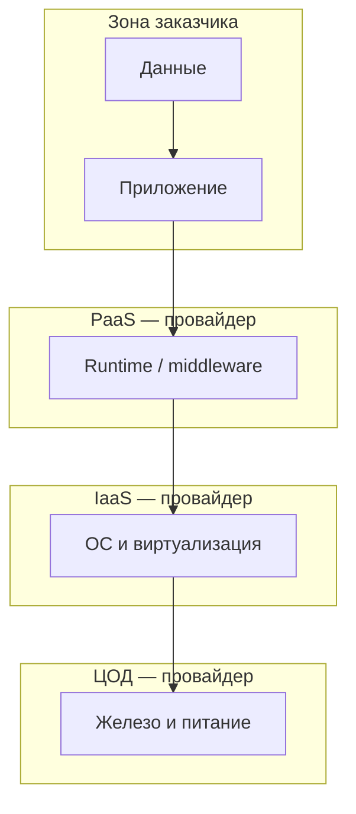
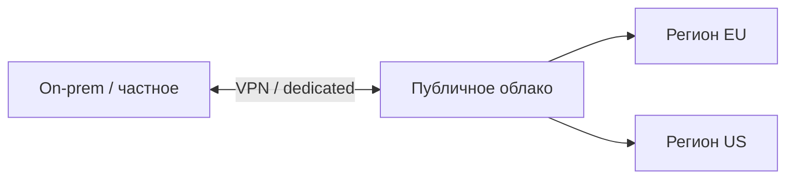

# Облачные концепции и модель ответственности

  ОБЯЗАТЕЛЬНО
  ДЛЯ НОВИЧКОВ

Разработчику
Архитектору

Эта глава **углубляет** [модели и сервисы облака](/encyclopedia/8-infra-security/8-01-oblachnye-tehnologii/1): здесь меньше имён продуктов и больше **понятий**, с которыми вы столкнётесь на собеседовании, в AZ-900 и в разговоре с админами. Если первая статья отвечает на "что за зверь облако", эта — на "как о нём думать при проектировании и кто за что платит головой".

---

## Модели обслуживания (кратко и точно)

| Модель | Вы управляете | Провайдер управляет | Примеры |
|--------|---------------|---------------------|---------|
| **IaaS** | ОС, runtime, приложение, данные | Физика, сеть, гипервизор | ВМ, диски, VPC |
| **PaaS** | Приложение и данные | ОС, масштабирование платформы | Managed SQL, App Service, control plane K8s |
| **SaaS** | Настройки и данные внутри приложения | Всё остальное | M365, Salesforce, корпоративная почта |

Чем **выше** уровень абстракции (ближе к SaaS), тем **быстрее старт** и тем **меньше** свободы: нельзя поставить произвольную версию ядра, поднять свой демон на хосте PaaS или перестроить сеть как в своём ЦОД.

**FaaS / serverless** — частный случай PaaS: вы приносите только функцию, провайдер скрывает даже выбор долгоживущего сервера. Подробнее с примером кода — в [главе 1](/encyclopedia/8-infra-security/8-01-oblachnye-tehnologii/1).

---

## Модели развёртывания

- **Публичное облако** — ресурсы в общем пуле провайдера (AWS, Azure, GCP, Yandex Cloud). Оплата по использованию, максимальная эластичность, multi-tenant: соседи по железу — другие клиенты, изоляция на уровне гипервизора и политик.
- **Частное облако** — инфраструктура выделена под вас (свой ЦОД или dedicated у провайдера). Чаще выбирают из-за регуляторики, предсказуемой задержки или legacy, который нельзя вынести в public.
- **Гибридное** — связка on-prem и public: VPN, ExpressRoute, репликация AD, "взрыв" нагрузки в облако (burst).
- **Мультиоблако** — два и более public-провайдера. Плюс: меньше привязки к одному вендору. Минус: разные API, биллинг, команда эксплуатации.

Выбор — не "мода", а **закон о данных, latency до пользователя, навыки команды и TCO на 3–5 лет**.

---

## Регионы, зоны и отказоустойчивость

- **Регион (Region)** — географическая площадка (например, "Западная Европа"). Данные и ВМ обычно привязаны к региону; между регионами — отдельный трафик и задержка.
- **Зона доступности (Availability Zone, AZ)** — изолированный дата-центр **внутри** региона. Production-сервисы для HA ставят в **несколько AZ**: падение одного ЦОД не должно убить продукт.
- **Георепликация** — копии данных в другом регионе на случай катастрофы целого региона (дороже и сложнее в compliance).

**SLA (Service Level Agreement)** — обещание провайдера по доступности **одного** сервиса (например, 99,9% для blob storage). Составной продукт из пяти сервисов **не наследует** лучший SLA автоматически: цепочка слабее звена с худшим показателем.

---

## Экономика — CapEx и OpEx

**CapEx (Capital Expenditure)** — разовые вложения: серверы, стойки, свой ЦОД. **OpEx (Operational Expenditure)** — регулярные расходы: счёт за облако, лицензии, поддержка.

Облако переносит CapEx в OpEx и даёт **гибкость**, но без дисциплины OpEx **растёт незаметно**:

- забытые dev-ВМ круглосуточно;
- диски "на всякий случай" в 10 раз больше нужного;
- **egress** — исходящий трафик из облака (часто платный);
- неотключённые managed-сервисы.

Практики контроля:

- бюджеты и алерты по подписке/аккаунту;
- **теги** ресурсов (`project`, `env`, `owner`);
- автоостановка dev-сред по расписанию;
- reserved capacity / savings plans для стабильной базовой нагрузки.

---

## Shared Responsibility Model

**Модель совместной ответственности** — кто за что отвечает в облаке. Граница **сдвигается** вверх по стеку от IaaS к SaaS: провайдер забирает больше слоёв, но **данные и учётные записи** почти всегда остаются на вас.

| Область | IaaS (ВМ) | PaaS (managed DB) | SaaS (почта) |
|---------|-----------|-------------------|--------------|
| Физическая безопасность | Провайдер | Провайдер | Провайдер |
| Сеть и гипервизор | Провайдер | Провайдер | Провайдер |
| ОС и патчи | **Вы** | Провайдер | Провайдер |
| Приложение | **Вы** | **Вы** | Провайдер |
| Учётные записи и MFA | **Вы** | **Вы** | Совместно |
| Данные и шифрование | **Вы** | **Вы** | **Вы** (политики доступа) |

Типичная ошибка: "мы в Azure — значит, Microsoft всё защитил". **Нет**: открытый порт 22 на весь интернет, ключи в GitHub и отсутствие MFA — ваша зона, не провайдера.

Разбор с точки зрения ИБ — [8.07 Zero Trust](/encyclopedia/8-infra-security/8-07-informatsionnaya-bezopasnost/121), идентичность — [Entra ID](/encyclopedia/2-system-network/2-06-sistemnoe-administrirovanie/62), практики для аккаунта — [безопасность в облаке](/encyclopedia/8-infra-security/8-01-oblachnye-tehnologii/11).

  
Образ для запоминания

  
Провайдер охраняет <strong>здание</strong> дата-центра. Вы охраняете <strong>сейф</strong> — конфигурацию ВМ, секреты, доступ к данным и настройки приложения.

---

## Хранилища на уровне концепций

| Тип | Единица | Типичное использование |
|-----|---------|------------------------|
| **Object** | Объект + ключ в bucket | Статика, бэкапы, data lake |
| **Block** | Том как диск | Системный диск ВМ, БД на диске |
| **File** | Общая файловая шара (NFS/SMB) | Legacy, "общая папка" для ВМ |

Подробнее и с примерами CLI/SDK — [глава 1](/encyclopedia/8-infra-security/8-01-oblachnye-tehnologii/1).

---

## Масштабирование и эластичность

- **Вертикальное** — увеличить CPU/RAM одной ВМ. Просто, но есть потолок железа и простой при перезагрузке.
- **Горизонтальное** — больше экземпляров за балансировщиком. Требует stateless-приложения или вынесения сессий (Redis и т.д.).

**Эластичность** — автоматически добавлять/убирать ресурсы по метрикам (CPU, длина очереди, RPS). Демо — в [главе 1](/encyclopedia/8-infra-security/8-01-oblachnye-tehnologii/1) (ScalingDemo).

---

## Чем облако не является

- **Не автоматический бэкап** — резервные копии настраиваете вы или включаете политики; удаление bucket без versioning необратимо.
- **Не "GDPR из коробки"** — compliance совместный: регион хранения, договор, шифрование, процессы у заказчика.
- **Не всегда дешевле** — для стабильной предсказуемой нагрузки 24/7 свой ЦОД иногда выигрывает по TCO; облако выигрывает на пиках и быстрых экспериментах.

---

## Мини-глоссарий

| Термин | Смысл |
|--------|--------|
| **Tenant** | Изоляция клиента в общем облаке |
| **Egress** | Исходящий трафик из облака наружу |
| **Managed service** | Провайдер патчит и обслуживает слой (БД, K8s control plane) |
| **IAM** | Кто кому что может в облаке (роли, политики) |
| **Vendor lock-in** | Зависимость от API и сервисов одного провайдера |
| **Landing zone** | Базовая "фабрика" аккаунтов, сетей и политик в enterprise |

---

## Практика Microsoft Learn

Рекомендуемый порядок:

1. [Преимущества облачных служб](https://learn.microsoft.com/ru-ru/training/modules/describe-benefits-use-cloud-services/)
2. [Типы облачных служб](https://learn.microsoft.com/ru-ru/training/modules/describe-cloud-service-types/)
3. [Облачные концепции AZ-900](https://learn.microsoft.com/ru-ru/training/paths/microsoft-azure-fundamentals-describe-cloud-concepts/)

Навигатор: [/tools/documentation/6](/tools/documentation/6). Сертификаты: [1.26/12](/encyclopedia/1-basics/1-26-karera-v-it-i-mify/12).

---

## Итоги

Облако — **модель потребления IT**, а не синоним "чужого сервера". IaaS/PaaS/SaaS и shared responsibility показывают, где заканчивается провайдер и начинаетесь вы. Регионы, SLA и OpEx объясняют, почему "упало в одной зоне" и "счёт вырос втрое" — нормальные темы архитектора, а не сюрприз. Имена сервисов Azure/AWS — следующий шаг на Learn, не замена этой базы.

---
