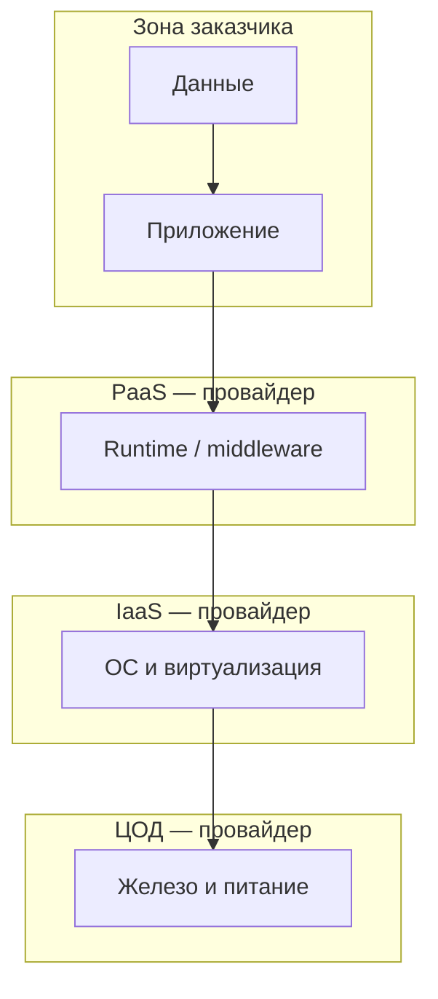

# Облачные концепции и модель ответственности

  ОБЯЗАТЕЛЬНО
  ДЛЯ НОВИЧКОВ

Разработчику
Архитектору

Эта глава **углубляет** [модели и сервисы облака](/encyclopedia/8-infra-security/8-01-oblachnye-tehnologii/1), не дублируя каталог AWS/Azure. Цель — говорить на одном языке с админами и проходить fundamentals (AZ-900) без зубрёжки имён сервисов.

---

## Модели обслуживания

| Модель | Вы управляете | Провайдер управляет | Примеры |
|--------|---------------|---------------------|---------|
| **IaaS** | ОС, runtime, приложение, данные | Физика, сеть, гипервизор | ВМ, диски, VPC |
| **PaaS** | Приложение и данные | ОС, масштабирование платформы | Managed SQL, App Service, K8s control plane |
| **SaaS** | Настройки и данные внутри приложения | Всё остальное | M365, Salesforce, веб-почта |

Чем выше уровень абстракции, тем **быстрее старт** и тем **меньше гибкости** (версии ОС, сетевые твики, произвольные демоны).

---

## Модели развёртывания

- **Публичное облако** — ресурсы в общем пуле провайдера, оплата по использованию, максимальная эластичность.
- **Частное облако** — выделенная инфраструктура (у вас в ЦОД или у провайдера), чаще compliance и предсказуемая latency.
- **Гибридное** — связка on-prem и облака (VPN, ExpressRoute, репликация AD).
- **Мультиоблако** — несколько публичных провайдеров; снижает vendor lock-in, растит сложность операций.

Выбор — не «мода», а **регуляторика, latency к пользователю, навыки команды и TCO** на 3–5 лет.

---

## Экономика: CapEx и OpEx

**CapEx** — разовые закупки серверов и ЦОД. **OpEx** — ежемесячные счета за облако. Облако переносит CapEx в OpEx и добавляет **гибкость**, но при плохом governance OpEx **растёт незаметно** (забытые ВМ, oversized диски, egress трафик).

Практики контроля затрат:

- бюджеты и алерты по подписке;
- теги ресурсов (проект, среда);
- автоматическое выключение dev-сред ночью;
- резервирование capacity для стабильной нагрузки.

---

## Shared Responsibility Model

**Модель совместной ответственности** — кто за что отвечает в облаке. Граница зависит от IaaS/PaaS/SaaS.

| Область | IaaS (пример: ВМ) | PaaS (пример: managed DB) | SaaS (пример: почта) |
|---------|-------------------|---------------------------|----------------------|
| Физическая безопасность | Провайдер | Провайдер | Провайдер |
| Сеть и гипервизор | Провайдер | Провайдер | Провайдер |
| ОС и патчи | **Вы** | Провайдер | Провайдер |
| Приложение | **Вы** | **Вы** | Провайдер |
| Учётные записи и MFA | **Вы** | **Вы** | Совместно |
| Данные и шифрование | **Вы** | **Вы** | **Вы** (политики доступа) |

Ошибка новичка: «мы в облаке — безопасность на Microsoft». **Нет**: вы отвечаете за identity, сетевые ACL, секреты в коде и классификацию данных.

Подробнее ИБ — [8.07](/encyclopedia/8-infra-security/8-07-informatsionnaya-bezopasnost/121), идентичность — [Entra](/encyclopedia/2-system-network/2-06-sistemnoe-administrirovanie/62).

---

## Надёжность и масштабирование (концепты)

- **Регион и зона доступности** — отказ одного дата-центра не должен ронять сервис; проектируйте multi-AZ.
- **SLA** провайдера — на отдельный сервис; составной SLA продукта **ниже** минимума цепочки.
- **Горизонтальное масштабирование** — больше экземпляров; **вертикальное** — мощнее одна ВМ (потолок есть).

Демо масштабирования — в [главе 8.01/1](/encyclopedia/8-infra-security/8-01-oblachnye-tehnologii/1) (компоненты ScalingDemo).

---

## Практика Microsoft Learn

Рекомендуемый порядок:

1. [Преимущества облачных служб](https://learn.microsoft.com/ru-ru/training/modules/describe-benefits-use-cloud-services/)
2. [Типы облачных служб](https://learn.microsoft.com/ru-ru/training/modules/describe-cloud-service-types/)
3. Схема [облачные концепции AZ-900](https://learn.microsoft.com/ru-ru/training/paths/microsoft-azure-fundamentals-describe-cloud-concepts/)

Навигатор: [/tools/documentation/6](/tools/documentation/6). Сертификаты: [1.26/12](/encyclopedia/1-basics/1-26-karera-v-it-i-mify/12).

---

## Итоги

Облако — **модель потребления IT**, а не «чужой сервер». IaaS/PaaS/SaaS и shared responsibility объясняют, где заканчивается провайдер и начинаетесь вы. Имена сервисов Azure — следующий шаг на Learn, не замена этой базы.

---
