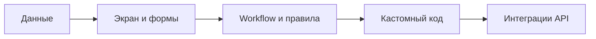

import LowNoCodeDemo from '@site/src/components/LowNoCodeDemo.jsx';

# Low-code и No-code платформы

  ОБЯЗАТЕЛЬНО
  ДЛЯ НОВИЧКОВ

Разработчику
Аналитику
Тестировщику  
Архитектору
Руководителю

Представьте конструктор LEGO для IT: блоки уже есть (форма, таблица, уведомление, шаг согласования), ваша задача — **собрать процесс** под бизнес, а не писать фреймворк с нуля. Так работают **low-code** ("мало кода") и **no-code** ("без кода"): интерфейс, логика и интеграции настраиваются визуально; свой код подключают там, где платформе не хватает гибкости.

Это **не** замена всей разработке. Потолок по производительности, vendor lock-in, миграции и аудиту безопасности реален — ниже разберём и плюсы, и минусы. Практический разбор внедрения по этапам — в статье [Внедрение Low-Code и No-code в бизнес](/encyclopedia/8-infra-security/8-02-low-code-no-code/111); разбор учебного конструктора страницы — в [примере No-Code приложения](/encyclopedia/8-infra-security/8-02-low-code-no-code/11). Обзор раздела — в [оглавлении](./intro.md).

  
Смежные темы

  

  
<a href="/encyclopedia/2-system-network/2-02-platformy/intro">Платформы в IT</a> · <a href="/encyclopedia/7-project/7-04-analitika/intro">Системная аналитика</a> · <a href="/encyclopedia/3-data-markup/3-07-sql/intro">SQL</a> · <a href="/encyclopedia/8-infra-security/8-01-oblachnye-tehnologii/1">Облачные сервисы</a> (многие LCP/NCP — SaaS в облаке)

  

---

## Концепция Low- и No-Code

Кратко:

- **Low-code** — "мало кода": каркас (UI, CRUD, workflow) собирается мышкой, уникальную логику дописывают на JavaScript, Python, C# и т.д.
- **No-code** — "нет кода" в повседневной работе аналитика или владельца продукта: только визуальные правила и шаблоны.

Сразу попробуйте наглядно — соберите страницу из кнопок, текста, полей и карточки (демо ниже). Так проще почувствовать разницу между "рисую экран" и "пишу React с нуля".

<LowNoCodeDemo />

Любой бизнесмен ищёт выгодное решение, не так ли? А теперь представьте, что для автоматизации задач, вам не нужно нанимать команду разработчиков?

Достаточно просто взять готовое решение, развернуть его и настроить - вуаля, ваша система готова к работе, а все детали есть в руководствах пользователя и администратора.

Это и есть основа концепции, подразумевающая, что один разработчик создаёт готовое решение, способное:
- быстро развернуться на нужной конфигурации;
- интегрироваться с другими системами;
- решать полный набор задач.

И разница лишь в том, какие задачи решают. Категория отлично подходит для малого и среднего бизнеса, потому что нет времени и средств на собственную разработку.

Это всё привело к тому, что на рынке появились:
- вендоры решений, разработавшие и продающие их;
- интеграторы, которые помогают внедрить такое решение;
- специалисты по No- и Low-Code.

Специалисты в этих системах обладают опытом конкретной системы. На практике, при развёртывании No-Code и Low-Code систем, у заказчика возникает несколько проблем:
- доработать систему под свои "хотелки";
- интегрировать со своими внутренними системами;
- развивать систему в дальнейшем.

Для доработки и интеграции, обычно как раз нанимают интеграторов - это специальные компании, которые специализируются на разработке и доработке таких систем, внедряют, реализуют все хотелки за хорошие деньги.

Но бесконечно им платить не получится, и для решения третьей задачи, развития, нужно нанимать хотя бы парочку своих специалистов, чтобы они были всегда "под рукой".

---

### Что такое No-code

**No-code (без кода)** — это подход к созданию программного обеспечения, при котором пользователи могут разрабатывать приложения, игры или другие цифровые продукты без необходимости писать программный код. Этот метод основан на использовании визуальных инструментов и платформ, где функциональность реализуется через перетаскивание элементов (drag-and-drop), настройку параметров и использование готовых шаблонов.

Ключевая особенность - создание прикладного ПО с помощью графических интерфейсов и конфигурации вместо традиционного программирования.

No-code платформы, или NCP, позволяют людям без технического образования или опыта программирования создавать сложные проекты. Например, с помощью таких инструментов, как Bubble , Adalo или Glide , можно разработать мобильное приложение, веб-сайт или даже базу данных. Эти платформы предоставляют готовые блоки, которые можно комбинировать, чтобы реализовать нужную логику и функционал.

No-code особенно популярен среди предпринимателей, дизайнеров и маркетологов, которые хотят быстро протестировать идеи, создать MVP (минимально жизнеспособный продукт) или автоматизировать бизнес-процессы. Однако этот подход имеет свои ограничения. Например, сложные проекты с уникальными механиками или высокими требованиями к производительности могут быть трудно реализовать без привлечения профессиональных разработчиков.

---

### Что такое Low-code

**Low-code (мало кода)** — это подход, который сочетает в себе удобство визуального программирования с возможностью дописывать собственный код для реализации более сложных задач. Этот метод ориентирован на разработчиков, которые хотят ускорить процесс создания приложений, минимизировав рутинную работу, но при этом сохраняя контроль над всеми аспектами проекта.

Low-code платформы, или LCP, предоставляют инструменты для быстрого создания базовых функций через визуальный интерфейс, но также позволяют добавлять собственные скрипты или модули на языках программирования, таких как JavaScript, Python или C#. Это делает low-code подходящим для проектов, которые требуют большей гибкости, чем позволяет no-code, но при этом не должны быть полностью написаны с нуля.

Примерами популярных low-code платформ являются OutSystems , Mendix и Microsoft Power Apps. Эти инструменты часто используются для разработки корпоративных приложений, таких как CRM-системы, системы отчетности или платформы для управления проектами. Например, компания может создать внутреннюю систему для отслеживания задач, используя готовые модули для пользовательского интерфейса и базы данных, а затем дописать собственный код для интеграции с другими сервисами.

---

## Коробочные решения

**Коробочные решения** — это программные продукты, которые распространяются в виде готовых пакетов, обычно на физических носителях (например, CD, DVD) или в виде загружаемых файлов. Эти решения предоставляют пользователям полный доступ к функционалу программы после её установки на устройство. В прошлом коробочные решения были основным способом распространения программного обеспечения, и хотя их популярность снизилась с появлением облачных технологий, они всё ещё остаются важной частью индустрии.

Примерами коробочных решений являются такие продукты, как Microsoft Office (до появления подписочной модели), Adobe Photoshop (до перехода на подписку через Creative Cloud) и многие игры, распространяемые на дисках. Преимущество таких решений заключается в том, что пользователи получают полный контроль над программой: они могут использовать её без необходимости постоянного подключения к интернету и не зависят от сторонних серверов.

Однако коробочные решения имеют свои ограничения. Например, обновления часто требуют покупки новой версии продукта, а техническая поддержка может быть ограничена. Кроме того, с развитием облачных технологий и моделей подписки многие компании отказываются от коробочных решений в пользу более гибких подходов.

**MVP (Minimum Viable Product)** — это минимально жизнеспособный продукт, который используется в контексте разработки программного обеспечения и стартапов в ИТ-сфере, это версия продукта с минимальным, но достаточным набором функций, которая позволяет запустить продукт на рынок как можно быстрее, чтобы проверить гипотезу о спросе на продукт, получить обратную связь от реальных пользователей, протестировать ключевые идеи с минимальными затратами времени и ресурсов.

Цель MVP - понять, есть ли у продукта спрос и востребованность среди целевой аудитории, не тратя много времени и денег на разработку всех возможных функций заранее.

Часто стартапы начинают именно с MVP - сайта-одностраничника или как раз-таки коробочного No-code или Low-code решения — без готового продукта, но с возможностью пользователям оставить email или предзаказаться, чтобы проверить интерес к продукту, либо базовым функционалом, достаточным для начала работы.

Обычно разработчики и издатели коробочного Low-code/No-code решения предоставляют заказчикам базовую систему за подписку, а заказчики к этой базовой системе прикручивают новые функции и модули. Такие функции разрабатываются внутренними средствами системы, и в ряде случаев прибегают к услугам интеграторов - компаний, специализирующихся на внедрении проекта, с детализацией решения под нужды конкретного заказчика, настройкой всех нужных бизнес процессов через инструменты платформы, включая проектирование, анализ, разработку, тестирование и даже деплой.

---

## Функционал Low-code и No-code

В основном, платформы Low-code и No-code имеют одну и ту же аудиторию - отраслевую. Заказчик может заказать и полноценную разработку с нуля, но ему понадобится грамотный набор исполнителей, разработчиков, администраторов, и обязательно архитекторов систем. Но их не так много, а разработка своей системы занимает много времени, включая годы тестирования, поддержки и развития. Поначалу многие компании уже обожглись на этом, используя собственную модель, которая привела к провалу, или отставанию от рынка - поэтому у многих организаций к концу 2010-х годов были отвратительные, тормозящие и "зависающие" системы, от которых тошнило сотрудников компании. Крупные компании сделали выводы и пересмотрели свой подход.

Отраслевым клиентам вся эта беготня не нужна - малый и средний бизнес в сфере финансов, страхования, ритейла, транспорта, промышленности, недвижимости, фармацевтики совсем не заинтересованы в крупных и рискованных расходах, им требуется простое и грамотное решение. Проще заплатить профессионалу, чтобы он реализовал всё просто и чётко.

На это и акцентирует модель No-code и Low-code - кто-то уже собрал базовый функционал, остаётся лишь слегка подкрутить под ваши нужды и всё, готово.

**Какой функционал является общим для таких решений?**

Ниже — семь "слоёв", которые встречаются почти в любом коробочном BPM/CRM на low-code. Названия модулей у вендоров разные, смысл один.

**1. Системы учёта (реестры)**

Основа — **реляционная БД** и CRUD над сущностями: товары, контрагенты, заказы, тикеты. Платформа генерирует таблицы и формы; аналитик описывает поля и связи. Глубже про SQL и нормализацию — [раздел SQL](/encyclopedia/3-data-markup/3-07-sql/intro), про ORM в классической разработке — [4.10](/encyclopedia/4-code-dev/4-10-orm-i-rabota-s-dannymi/intro).

**2. Веб-интерфейс**

Списки, карточки записи, фильтры, массовые действия. UX часто шаблонный, зато быстрый старт. Кастомный фронт на [JavaScript](/encyclopedia/5-languages/5-01-javascript/intro) подключают, когда бренд и сложные экраны важнее скорости.

**3. Ролевая модель и безопасность**

Администратор, менеджер, оператор, гость — разные меню и права на строки/поля. Внутри: аутентификация, сессии, HTTPS. См. [аутентификация и авторизация](/encyclopedia/2-system-network/2-08-osnovy-informatsionnoy-bezopasnosti/111) и [защита данных](/encyclopedia/8-infra-security/8-03-zabota-o-kode-i-dannyh/117).

**4. Конструкторы UI**

Drag-and-drop экранов, иногда HTML/CSS для бренда. Близкий родственник — no-code конструкторы сайтов (Tilda, Webflow); отличие — привязка к данным и процессам, а не только к лендингу.

**5. Бизнес-процессы (workflow/BPM)**

Маршрут заявки: создали → назначили исполнителя → согласовали → закрыли. Визуальная схема заменяет часть кода оркестрации. Сложные ветвления и SLA удобно проектировать вместе с [системным аналитиком](/encyclopedia/7-project/7-04-analitika/intro).

**6. Отчётность и аналитика**

Дашборды, выгрузки в Excel, KPI по процессам. Данные уже в БД платформы — не нужно вручную сводить таблицы из почты. Для тяжёлой аналитики иногда выносят данные в DWH отдельным ETL.

**7. Сервисы и интеграция**

REST/SOAP, файловый обмен, коннекторы к 1С, банку, почте. Пример: при создании заявки — запрос в бюро кредитных историй. Основы API — [интеграционное взаимодействие](/encyclopedia/2-system-network/2-09-osnovy-integratsionnogo-vzaimodeystviya/intro); оркестрация микросервисов — [8.05](/encyclopedia/8-infra-security/8-05-mikroservisy-i-integratsiya/intro).

---

## Модели распространения

Современные технологии предлагают множество способов распространения программного обеспечения. Каждая модель имеет свои особенности, преимущества и недостатки. Рассмотрим основные из них: **SaaS**, **Licensing**, **Freemium** и **White Label**. Многие low-code вендоры совмещают SaaS-подписку с платой за пользователя и за "пакет" интеграций — сравните с [моделями облака](/encyclopedia/8-infra-security/8-01-oblachnye-tehnologii/1).

| Модель | Как платят | Low-code / no-code примеры | Когда уместно |
|--------|------------|---------------------------|---------------|
| **SaaS** | Подписка, часто за пользователя | Power Apps, Airtable, Bubble | Быстрый старт, нет своей инфраструктуры |
| **Licensing** | Разовая или годовая лицензия | Коробка BPM на серверах заказчика | Жёсткий контур, офлайн, регуляторика |
| **Freemium** | Бесплатный tier + апгрейд | Notion, Trello, бесплатный tier n8n | Пилот, обучение, малые команды |
| **White Label** | Лицензия + брендирование | Банковское приложение на финтех-платформе | Выход на рынок под своим именем за недели |

При закупке уточняйте **лимиты** — число приложений, API-вызовов, строк в таблице, окружений dev/prod. Именно они часто становятся потолком роста.

---

### SaaS

**SaaS** — программное обеспечение через интернет по подписке: браузер или тонкий клиент, обновления на стороне вендора. Примеры: Google Workspace, Slack, Salesforce, Adobe Creative Cloud. В low-code сюда же относятся **Microsoft Power Platform**, **Mendix Cloud**, **OutSystems Cloud** — вы конфигурируете приложение, runtime и БД живут у провайдера ([SaaS в облаке](/encyclopedia/8-infra-security/8-01-oblachnye-tehnologii/1)).

**Плюсы для бизнеса**

- старт без закупки серверов;
- одна версия у всех филиалов;
- вендор патчит платформу (данные и роли — ваша зона, см. [безопасность в облаке](/encyclopedia/8-infra-security/8-01-oblachnye-tehnologii/11)).

**Минусы**

- нужен стабильный интернет;
- зависимость от тарифов и API вендора;
- миграция при уходе может быть дорогой — закладывайте экспорт в договор.

Вопрос заказчика: "Где лежат данные и можно ли выбрать регион?" — см. [облачные концепции](/encyclopedia/8-infra-security/8-01-oblachnye-tehnologii/12).

---

### Licensing

**Licensing** — покупка права использовать продукт: бессрочная, подписка на обновления или срочная на N лет. Примеры: Windows, AutoCAD, MATLAB; игры в Steam, GOG. Low-code коробка часто ставится **на серверах заказчика** при том же вендоре.

**Плюсы** — закрытая сеть, данные в периметре, предсказуемый платёж на длинном горизонте. **Минусы** — сами обновляете и бэкапите, апгрейды версий — отдельный проект, лицензии на CPU и named users дорожают с ростом. Связка с [on-prem](#on-premise-on-site) ниже.

---

### Freemium

**Freemium** — базовый функционал бесплатно, расширения за деньги. Примеры: Fortnite, Dropbox, Spotify, Trello; в low-code — Airtable, Glide, ограниченные планы Power Apps.

**Плюсы** — дешёвый [MVP и пилот](/encyclopedia/8-infra-security/8-02-low-code-no-code/111). **Минусы** — лимиты строк и автоматизаций; в компании риск **теневого IT** без согласования с ИБ. Перед продом сверьте прогноз пользователей с тарифной сеткой.

---

### White Label

**White Label** — продукт вендора под **брендом заказчика**: банковское приложение на финтех-платформе, магазин на Shopify-подобном движке.

**Плюсы** — быстрый выход на рынок, меньше своей разработки. **Минусы** — ограниченный UX, зависимость от roadmap вендора; юридически важно, кто **оператор персональных данных**.

  
Как выбрать модель

  

  
<strong>SaaS</strong> — пилот и SMB. <strong>Licensing + on-prem</strong> — жёсткий периметр. <strong>Freemium</strong> — обучение и MVP с планом миграции. <strong>White label</strong> — внешний продукт под вашим брендом. В enterprise часто гибрид: SaaS для dev, prod on-prem.

  

---

## Типы архитектур

Выбор **где крутится** low-code платформа (облако вендора, ваш ЦОД, смесь, open-source стек) определяет стоимость, compliance и скорость масштабирования. Это пересекается с [моделями развёртывания облака](/encyclopedia/8-infra-security/8-01-oblachnye-tehnologii/12) и с тем, SaaS вы купили или коробку.

| Архитектура | Где данные | Low-code пример | Типичный заказчик |
|-------------|------------|-----------------|-------------------|
| **Cloud-first** | Регион облака вендора/партнёра | Mendix Cloud, Power Platform | SMB, распределённые команды |
| **On-premise** | Серверы в вашем ЦОД | Коробка ELMA, 1С-контур на своих ВМ | Банк, госсектор, завод |
| **Гибрид** | Критичное локально, остальное в cloud | Prod on-prem, dev в SaaS | Enterprise с legacy |
| **Open Source** | Куда развернёте сами | WordPress, Camunda, n8n self-hosted | Команда с DevOps |

---

### Облачная (Cloud-first)

**Облачная архитектура** — компоненты на серверах провайдера (AWS, Azure, GCP, Yandex Cloud). Пользователи заходят по HTTPS; железо и патчи гипервизора — у провайдера.

**Плюсы**

- эластичность ([масштабирование](/encyclopedia/8-infra-security/8-01-oblachnye-tehnologii/12));
- нет CapEx на серверную;
- доступ из филиалов без VPN к своему ЦОД.

**Минусы**

- зависимость от канала связи;
- данные у третьей стороны — договор и DPA;
- OpEx растёт без [тегов и бюджетов](/encyclopedia/8-infra-security/8-01-oblachnye-tehnologii/12).

Low-code SaaS почти всегда cloud-first: вы не выбираете версию ядра Linux, вы выбираете **регион** и политики резервного копирования в админке.

---

### On-premise (on-site)

**On-premise** — приложение и БД на **ваших** серверах в офисе или colocation. Примеры: внутренний CRM/ERP, 1С, BPM в контуре банка.

**Плюсы**

- полный контроль над железом и сетью;
- работа при кратковременных сбоях интернета (внутри ЛВС);
- проще обосновать регулятору "данные не уходят наружу".

**Минусы**

- закупка и [сисадмин](/encyclopedia/2-system-network/2-06-sistemnoe-administrirovanie/intro);
- масштаб = новые серверы;
- вы сами отвечаете за [бэкапы](/encyclopedia/8-infra-security/8-01-oblachnye-tehnologii/11).

Для low-code это означает: лицензии на кластер, установку интегратором, ваш [CI/CD](/encyclopedia/8-infra-security/8-04-devops-ci-cd/intro) для выкладки конфигураций.

---

### Гибридная

**Гибрид** — часть в ЦОД, часть в public cloud, связанные VPN или dedicated channel. Пример: персональные данные клиентов в on-prem БД, отчёты и ML — в облаке; low-code **prod** локально, **песочница** у вендора в SaaS.

**Плюсы**

- баланс compliance и гибкости;
- burst нагрузки в облако без покупки железа "на пик".

**Минусы**

- два контура мониторинга и два набора навыков;
- интеграция и [единый вход](/encyclopedia/2-system-network/2-06-sistemnoe-administrirovanie/62) сложнее.

---

### Open Source

**Open Source** — исходники доступны, можно развернуть у себя и дорабатывать. Примеры: Linux, WordPress, Godot; в автоматизации — **n8n**, **Camunda** (community), в CMS — **Strapi**.

**Плюсы**

- нет лицензии вендора за ядро (но есть стоимость внедрения и поддержки);
- можно править код под редкие требования;
- сообщество и быстрые фиксы CVE при активном проекте.

**Минусы**

- поддержка на вас или на коммерческого интегратора;
- лицензии GPL/AGPL могут обязывать открывать доработки;
- безопасность = ваши патчи и [сканирование зависимостей](/encyclopedia/8-infra-security/8-03-zabota-o-kode-i-dannyh/117).

Low-code **no-code SaaS** и open source — разные полюса: в SaaS вы не видите код платформы; в OSS вы **несёте** эксплуатацию, но получаете переносимость.

  
Связь с внедрением

  

  
На этапе архитектуры внедрения (см. <a href="/encyclopedia/8-infra-security/8-02-low-code-no-code/111">статью про rollout</a>) зафиксируйте: где prod, где dev, как бэкап, какой канал к 1С и банку. Смена cloud → on-prem позже — отдельный миграционный проект.

  

---

## Отличия Low-code и No-code от традиционной разработки

Традиционная разработка строится на языках ([Python](/encyclopedia/5-languages/5-02-python/intro), [Java](/encyclopedia/5-languages/5-03-java/intro), [C#](/encyclopedia/5-languages/5-05-csharp/intro), C++), Git, code review и CI/CD. Low/no-code **сужает** пространство решений ради скорости; классический код **расширяет** его ценой времени и команды.

| Критерий | Традиционная разработка | Low-code | No-code |
|----------|-------------------------|----------|---------|
| Кто собирает | Разработчики | Разработчики + аналитики | Бизнес, маркетинг, операции |
| Гибкость | Почти любая | В рамках платформы + скрипты | Шаблоны и виджеты |
| Переносимость | Ваш репозиторий | Экспорт ограничен | Часто привязка к вендору |
| Срок MVP | Недели–месяцы | Дни–недели | Часы–дни |
| Эксплуатация | Ваша (K8s, ВМ, облако) | Часто SaaS вендора | Почти всегда SaaS |

**Процесс в классической разработке**

- анализ и архитектура ([7.06](/encyclopedia/7-project/7-06-proektirovanie-i-arhitektura/intro));
- реализация, тесты, [отладка](/encyclopedia/4-code-dev/4-14-razrabotka-i-otladka/intro);
- интеграции через API и БД ([ORM](/encyclopedia/4-code-dev/4-10-orm-i-rabota-s-dannymi/intro)).

**Плюсы классики** — уникальная логика, производительность, владение исходниками. **Минусы** — дорогая команда, долгий time-to-market, ответственность за безопасность целиком на вас.

**Когда остаются на low-code:** внутренние CRM, тикеты, согласования, отчёты — см. сквозной кейс [внедрения](/encyclopedia/8-infra-security/8-02-low-code-no-code/111). **Когда уходят в код:** высокая нагрузка, сложный UX, регуляторные требования к формату кода, миграция с устаревшей платформы.

**No-code (без кода)** — это подход, который позволяет создавать приложения, игры или другие цифровые продукты без необходимости писать программный код. Вместо этого используются визуальные инструменты и платформы, где функциональность реализуется через перетаскивание элементов (drag-and-drop), настройку параметров и использование готовых шаблонов.

Процесс разработки
	- Пользователи выбирают готовые блоки, такие как кнопки, формы, базы данных или игровые механики, и настраивают их поведение через интерфейс.
	- Например, с помощью платформы Adalo можно создать мобильное приложение, а с помощью GameSalad — простую игру.
	- Процесс разработки полностью визуализирован, что делает его доступным для людей без технического образования.

**Low-code (мало кода)** — это подход, который сочетает в себе удобство визуального программирования с возможностью дописывать собственный код для реализации более сложных задач. Этот метод ориентирован на разработчиков, которые хотят ускорить процесс создания приложений, минимизировав рутинную работу, но при этом сохраняя контроль над всеми аспектами проекта.

---

## Как работает Low-code

Low-code полезен, когда бизнес хочет скорость no-code, но команде нужен контроль разработчика. По сути это конвейер из четырех слоев:

1. **Модель данных** — описываете сущности, поля и связи.
2. **UI-конструктор** — собираете формы, списки, дашборды.
3. **Workflow-логика** — задаете условия, статусы, уведомления.
4. **Кастомный код** — закрываете "края", где визуальных блоков не хватает.

---

### Типичный поток работы

- аналитик собирает AS-IS и TO-BE процесс;
- разработчик low-code настраивает сущности и UI;
- бизнес проверяет прототип на реальных заявках;
- команда добавляет интеграции и права доступа;
- релиз уходит в пилот, затем в production.

---

### Где именно нужен код

- сложные расчеты, которые нельзя выразить формулой в платформе;
- интеграции с нестандартным API или подписью запросов;
- валидаторы и обработка файлов;
- оптимизация производительности при росте нагрузки.

Если таких точек становится слишком много, это сигнал пересмотреть архитектуру и часть функций вынести в классический сервис на [Python](/encyclopedia/5-languages/5-02-python/intro) или [C#](/encyclopedia/5-languages/5-05-csharp/intro).

---

## Как работает No-code

No-code ориентирован на быстрый запуск без участия разработчика в каждом шаге. Продукт собирают из шаблонов и правил, а главное ограничение — рамки самой платформы.

---

### Жизненный цикл no-code решения

1. Выбираете шаблон (форма, CRM, портал, бот).
2. Настраиваете поля и экраны.
3. Привязываете действия кнопок и триггеры.
4. Подключаете готовые интеграции (почта, платежи, таблицы).
5. Публикуете по ссылке или в домене компании.

---

### Сильные стороны

- короткий путь от идеи до результата;
- понятный вход для аналитика, маркетинга, операционного менеджера;
- дешевые эксперименты до закупки enterprise-решения.

---

### Ограничения

- сложно реализовать уникальный UX и сложную доменную логику;
- перенос на другую платформу часто дорогой;
- аудит безопасности зависит от возможностей вендора.

No-code отлично подходит для пилотов, внутренних кабинетов, опросов, прототипов и простых процессов. Для высоконагруженного продукта это обычно первый этап, после которого часть функций переносится в low-code или классическую разработку.

---

## Типы решений

**Low-code** и **No-code** платформы закрывают не только "формы и таблицы". Ниже типовые классы решений, которые чаще всего внедряют в компаниях.

---

### CRM

CRM (Customer Relationship Management) системы помогают компаниям управлять взаимодействием с клиентами, отслеживать продажи, обрабатывать запросы и анализировать данные. С помощью Low-code и No-code платформ можно быстро создать CRM-систему, адаптированную под конкретные потребности бизнеса.

Как это работает?
	- Визуальные конструкторы: Вы можете добавить формы для сбора данных о клиентах, настроить базы данных для хранения информации и создать интерфейс для управления контактами.
	- Автоматизация: Например, система может автоматически отправлять напоминания о встречах, генерировать отчеты или назначать задачи менеджерам.
	- Интеграции: CRM можно связать с другими сервисами, такими как электронная почта, телефония или маркетинговые платформы.

Практический результат: у руководителя появляется единая воронка и прозрачная загрузка менеджеров.

---

### ERP

ERP (Enterprise Resource Planning) системы объединяют различные аспекты работы компании, такие как финансы, логистика, производство и управление персоналом. Low-code и No-code платформы позволяют создавать ERP-решения без необходимости привлечения больших команд разработчиков.

Как это работает?
	- Модульность: Вы можете создавать отдельные модули для разных отделов компании, такие как учет товаров, управление проектами или расчет заработной платы.
	- Централизация данных: Все данные хранятся в единой базе, что позволяет легко анализировать и отслеживать ключевые показатели.
	- Настройка: Платформы позволяют настраивать интерфейсы и процессы под специфику бизнеса.

Типичный порог: когда в ERP появляются сложные финансовые расчеты и регуляторные отчеты, к low-code добавляют классический backend.

---

### Мобильные приложения

Создание мобильных приложений — одна из самых популярных областей применения Low-code и No-code платформ. Эти инструменты позволяют разрабатывать приложения для iOS и Android без необходимости знания языков программирования.

Как это работает?
	- Готовые шаблоны: Вы можете выбрать шаблон для интернет-магазина, социальной сети или корпоративного приложения.
	- Кроссплатформенность: Одно приложение работает на всех устройствах, что снижает затраты на разработку.
	- Интерфейс: Визуальные конструкторы позволяют легко настраивать внешний вид приложения, добавлять кнопки, формы и другие элементы.

Частый сценарий: мобильный кабинет сотрудника "в поле" — заявки, фото, геолокация, чек-листы.

---

### Порталы

Порталы — это веб-сайты или приложения, которые предоставляют пользователям доступ к различным сервисам, данным или функциям. Low-code и No-code платформы позволяют создавать порталы для клиентов, сотрудников или партнеров.

Как это работает?
-	 Роли и права доступа: Вы можете настроить, какие данные и функции будут доступны разным пользователям.
-	 Интеграция данных: Порталы могут подключаться к базам данных, CRM, ERP или другим системам.
-	 Персонализация: Интерфейс может адаптироваться под предпочтения пользователей.

Порталы удобны для подрядчиков и партнеров: доступ только к своей части данных.

---

### Формы

Формы — это один из самых простых, но важных инструментов для сбора данных. Low-code и No-code платформы позволяют создавать формы для анкет, опросов, заявок и других целей.

Как это работает?
	- Драг-энд-дроп: Вы можете добавлять поля для текста, чисел, файлов и других типов данных.
	- Логика: Формы могут включать условия, такие как обязательные поля или проверка ввода.
	- Интеграция: Данные из форм можно автоматически отправлять в базы данных, электронные таблицы или другие системы.

Для стартовой автоматизации это самый частый "первый кирпич" внедрения.

---

### Дашборды

Дашборды позволяют визуализировать данные в виде графиков, таблиц и диаграмм. Это полезно для анализа ключевых показателей, мониторинга процессов и принятия решений.

Как это работает?
	- Подключение данных: Дашборды могут подключаться к базам данных, API или другим источникам.
	- Настройка виджетов: Вы можете добавлять графики, индикаторы и другие элементы для отображения данных.
	- Автоматическое обновление: Данные на дашбордах обновляются в реальном времени.

Связка "форма → процесс → дашборд" дает измеримый эффект и для бизнеса, и для IT.

---

### Интеграции и сервисы

Интеграции позволяют связывать различные системы и сервисы для обмена данными и автоматизации процессов. Low-code и No-code платформы предлагают готовые инструменты для создания таких интеграций.

Как это работает?
- API-подключения: Вы можете подключить системы через API, чтобы обмениваться данными.
- Автоматизация: Интеграции могут автоматически выполнять задачи, такие как отправка уведомлений или обновление данных.
- Готовые коннекторы: Многие платформы предлагают готовые интеграции с популярными сервисами, такими как Slack, Salesforce или Stripe.

Подробно про API и контракты: [основы интеграционного взаимодействия](/encyclopedia/2-system-network/2-09-osnovy-integratsionnogo-vzaimodeystviya/intro).

---

### Бизнес-процессы, потоки, автоматизация

Автоматизация бизнес-процессов — это ключевая область применения Low-code и No-code платформ. Эти инструменты позволяют создавать потоки задач, настраивать рабочие процессы и устранять рутинные операции.

Как это работает?
	- Создание потоков: Вы можете настроить последовательность шагов, которые выполняются автоматически или вручную.
	- Условия и триггеры: Процессы могут запускаться при выполнении определенных условий, таких как получение нового заказа или изменение статуса задачи.
	- Отчеты и контроль: Вы можете отслеживать выполнение процессов и анализировать их эффективность.

Эта часть сильнее всего пересекается с [системной аналитикой](/encyclopedia/7-project/7-04-analitika/intro): без формализации процесса автоматизировать нечего.

---

### Как выбрать тип решения

| Запрос бизнеса | Лучший старт |
|---|---|
| "Теряем заявки в почте" | Формы + CRM |
| "Нет прозрачности по срокам" | Workflow + дашборд |
| "Нужен кабинет для партнеров" | Портал + роли |
| "Хотим автоматом передавать данные в 1С" | Интеграции + бизнес-процесс |

---

## Деплой

Развёртывание решений, созданных с помощью low-code и no-code платформ, действительно проще, чем классический pipeline на своем Kubernetes. Но "кнопка Publish" не отменяет инженерную дисциплину: окружения, тестирование, права доступа, rollback.

| Минимальный контур релиза | Зачем |
|---|---|
| `dev` | быстро собирать и проверять гипотезы |
| `test` / UAT | приемка бизнесом и тестировщиком |
| `prod` | рабочая эксплуатация с ограниченным доступом |

Даже если платформа "одноконтурная", логика релиза остаётся той же: сначала пилот, потом production.

---

### Развёртывание в Low-code

1. **Сборка артефакта** — платформа формирует пакет приложения из схем, экранов, workflow и скриптов.
2. **Промоушн в среду** — переносите пакет из dev в test/UAT с фиксированной версией.
3. **Проверка** — прогоняете сценарии из [внедрения](/encyclopedia/8-infra-security/8-02-low-code-no-code/111), проверяете интеграции и роли.
4. **Публикация в prod** — включаете новую версию для пользователей.
5. **Rollback-план** — держите предыдущую рабочую версию и шаги отката.

**Что проверять перед релизом low-code:**

- матрицу прав (кто видит какие записи);
- секреты интеграций (ключи не в форме, а в vault/переменных);
- миграции данных (новые поля, дефолты, обратная совместимость);
- оповещения и логи после выкладки.

---

### Развёртывание в No-code

1. **Публикация по ссылке** — самый быстрый путь для формы, портала, внутреннего кабинета.
2. **Подключение домена** — если продукт выходит наружу, добавляют фирменный домен и TLS.
3. **Версионность изменений** — перед крупной правкой фиксируют копию/черновик.
4. **Наблюдаемость** — включают базовые метрики посещений, ошибок и конверсии.

В no-code релизы чаще и мельче: добавили поле, сменили маршрут, поправили шаблон письма. Это ускоряет бизнес, но повышает риск "тихих" поломок в интеграциях. Поэтому в проде полезен хотя бы минимальный change log.

  
Частая ошибка в релизах

  

  
Меняют структуру формы в no-code и забывают, что downstream-интеграция ждёт старый формат JSON. Итог: заявки "исчезли", хотя UI работает. Проверяйте контракты API после каждой структурной правки.

  

---

## Обмен разработкой

Обмен разработками между командами и проектами — ключ к масштабированию low-code. Если каждый отдел собирает "свои кнопки" с нуля, платформа быстро превращается в хаос.

Цель обмена:

- повторно использовать модули и шаблоны;
- поддерживать единый стиль форм и ролей;
- снижать количество дублирующихся интеграций.

---

### Обмен в Low-code

1. **Общие модули** — авторизация, справочники, типовые отчеты.
2. **Внутренний каталог компонентов** — утвержденные блоки UI и интеграций.
3. **Пакеты релизов** — перенос модулей между средами и проектами.
4. **Governance** — владелец модуля, версия, changelog и обратная совместимость.

Если это не организовать, получаете "fork-ад": один и тот же компонент в 10 версиях, и ни одну нельзя безопасно обновить.

---

### Обмен в No-code

1. **Шаблоны** — стартовые наборы экранов и процессов под типовые задачи.
2. **Готовые коннекторы** — Slack, Stripe, Google Sheets, CRM, почта.
3. **Экспорт данных** — CSV/JSON для аналитики и миграции.

No-code проще копировать между отделами, но сложнее поддерживать единые стандарты. Поэтому полезен "внутренний гайд платформы": naming, роли, обязательные поля, требования к логам.

---

## Маршрут по ролям

Если хотите читать не подряд, а "под себя", используйте короткий маршрут.

| Роль | С чего начать | Что затем |
|---|---|---|
| Разработчик | [Отличия low/no-code и классики](#отличия-low-code-и-no-code-от-традиционной-разработки) | [Как работает Low-code](#как-работает-low-code) → [Проблемы](#проблемы) |
| Аналитик | [Типы решений](#типы-решений) | [Как работает No-code](#как-работает-no-code) → [Деплой](#деплой) |
| Руководитель | [Модели распространения](#модели-распространения) | [Типы архитектур](#типы-архитектур) → [Как снизить риски заранее](#как-снизить-риски-заранее) |
| Архитектор | [Типы архитектур](#типы-архитектур) | [Деплой](#деплой) → [Обмен разработкой](#обмен-разработкой) |

Для сквозного применения в компании — статья [Внедрение Low-Code и No-code в бизнес](/encyclopedia/8-infra-security/8-02-low-code-no-code/111).

---

## Проблемы

Несмотря на очевидные преимущества Low-code и No-code платформ, такие как доступность, скорость разработки и снижение затрат, у этих подходов есть свои недостатки. Эти ограничения могут оказывать негативное влияние как на сами проекты, так и на индустрию в целом. 

Рассмотрим основные минусы и последствия, чтобы проект не уперся в потолок через полгода.

---

### Ограниченная гибкость

Платформы Low-code и No-code предлагают готовые инструменты и шаблоны, которые ограничивают возможности для реализации уникальных и сложных функций. Например, если вы хотите создать игру с уникальной механикой или приложение с нестандартным пользовательским интерфейсом, платформа может не поддерживать такие требования.

Это ограничивает инновации, так как разработчики вынуждены адаптироваться к возможностям платформы, а не создавать что-то действительно новое. В долгосрочной перспективе это может привести к стандартизации решений, где все продукты начинают выглядеть и работать одинаково.

Сигнал риска: в бэклоге растет число задач "невозможно штатными средствами".

---

### Зависимость от платформы

Проекты, созданные с помощью Low-code и No-code платформ, зависят от их инфраструктуры, обновлений и поддержки. Если платформа прекращает свою работу или изменяет условия использования (например, повышает цены), проект может стать неработоспособным.
Это создает риски для бизнеса, особенно для стартапов и малых компаний, которые полагаются на сторонние платформы. Кроме того, миграция с одной платформы на другую или переход на традиционную разработку может быть сложным и дорогостоящим процессом.

Сигнал риска: платформа повышает тариф, а у вас нет актуального плана экспорта данных.

---

### Ограниченная производительность

Готовые решения и автоматизация часто приводят к снижению производительности по сравнению с оптимизированным кодом, написанным вручную. Например, приложения, созданные с помощью No-code платформ, могут быть медленнее или потреблять больше ресурсов, чем аналогичные приложения, разработанные традиционным способом.

Это особенно критично для высоконагруженных систем, таких как игры с большим количеством игроков или корпоративные приложения, работающие с большими объемами данных. Низкая производительность может привести к потере пользователей и снижению конкурентоспособности продукта.

Сигнал риска: время отклика растет вместе с числом записей, а тюнинг на стороне платформы ограничен.

---

### Сложность масштабирования

Low-code и No-code платформы отлично подходят для создания простых и средних по сложности проектов, но масштабирование до крупных систем может быть затруднено. Например, если ваше приложение становится популярным и нагрузка увеличивается, платформа может не справляться с ростом.

Это ограничивает возможности для роста стартапов и малых компаний, которые начали с Low-code или No-code, но затем сталкиваются с необходимостью переписывать всё с нуля. Переход на традиционную разработку требует значительных временных и финансовых затрат.

Сигнал риска: каждый новый модуль требует обходных решений и "костылей".

---

### Отсутствие контроля над кодом

При использовании No-code платформ вы вообще не видите код, а при использовании Low-code платформ доступ к коду ограничен. Это делает невозможным глубокую оптимизацию, исправление сложных ошибок или внедрение уникальных решений.

Разработчики теряют возможность полностью контролировать проект, что может привести к снижению качества продукта. Кроме того, это усложняет поиск специалистов, которые могли бы поддерживать такие проекты, так как они требуют знания конкретной платформы, а не универсальных навыков программирования.

Сигнал риска: инцидент есть, а точку отказа нельзя отладить "под капотом".

---

### Проблемы с безопасностью

Готовые решения и облачная инфраструктура могут быть уязвимы к атакам, особенно если платформа не предоставляет достаточных инструментов для защиты данных. Например, если данные хранятся на сторонних серверах платформы, существует риск утечки или несанкционированного доступа.

Это особенно критично для корпоративных приложений, где безопасность данных является приоритетом. Компании могут столкнуться с юридическими и финансовыми последствиями в случае утечки данных.

Сигнал риска: нет MFA, ролевой матрицы и аудита действий в платформе.

---

### Ограниченная экосистема

Многие Low-code и No-code платформы имеют ограниченную экосистему инструментов, библиотек и интеграций. Например, если вам нужно подключить редкий API или использовать специфическую технологию, платформа может не поддерживать это.

Это ограничивает возможности для создания уникальных решений и интеграции с существующими системами. В долгосрочной перспективе это может замедлить развитие индустрии, так как компании будут вынуждены использовать только те технологии, которые поддерживаются платформой.

Сигнал риска: ключевая интеграция с банком или госAPI не закрывается без внешнего сервиса.

---

### Снижение уровня квалификации разработчиков

Low-code и No-code платформы позволяют создавать приложения без необходимости глубоких знаний программирования. Это может привести к снижению уровня квалификации разработчиков, которые начинают полагаться исключительно на готовые решения.

Индустрия может столкнуться с дефицитом специалистов, способных решать сложные задачи или работать с традиционными языками программирования. Кроме того, это может привести к снижению качества продуктов, так как разработчики не будут понимать, как работают системы "под капотом".

Сигнал риска: команда умеет "собирать блоки", но не может объяснить архитектурные компромиссы.

---

### Высокая стоимость в долгосрочной перспективе

Хотя Low-code и No-code платформы снижают начальные затраты на разработку, долгосрочные расходы могут быть выше из-за подписок, лицензий и дополнительных услуг. Например, платформа может взимать плату за каждого пользователя, за использование облачной инфраструктуры или за расширенные функции.

Это особенно критично для стартапов и малых компаний, которые могут столкнуться с финансовыми трудностями по мере роста проекта. В долгосрочной перспективе это может привести к тому, что компании будут искать альтернативные решения, такие как традиционная разработка.

Сигнал риска: пользовательская база растет, а unit-экономика ухудшается.

---

### Как снизить риски заранее

- в контракте закрепить экспорт данных и условия ухода;
- вести архитектурную документацию и карту интеграций;
- хранить сложные правила в репозитории и делать code review;
- сразу проектировать роли, MFA и аудит действий;
- раз в квартал проверять TCO и сценарий миграции.

{/* sidebar-collections */}

---

## В подборках

Статья входит в тематические маршруты из меню **Подборки** и блока "С чего начать?" на главной. Соседние шаги того же маршрута:

**База программиста** — [Автоматическое управление памятью](/encyclopedia/4-code-dev/4-15-sborka-musora/1), [JavaScript — о разделе](/encyclopedia/5-languages/5-01-javascript/intro), [Разработка и отладка — о разделе](/encyclopedia/4-code-dev/4-14-razrabotka-i-otladka/intro), [Python — о разделе](/encyclopedia/5-languages/5-02-python/intro), [Основы работы с Git — о разделе](/encyclopedia/4-code-dev/4-13-osnovy-raboty-s-git/intro), [Java — о разделе](/encyclopedia/5-languages/5-03-java/intro).

**Веб-разработка** — [Социальные сети](/encyclopedia/2-system-network/2-02-platformy/311), [Веб-разработка и REST API на Python](/encyclopedia/5-languages/5-02-python/34), [Python — о разделе](/encyclopedia/5-languages/5-02-python/intro), [Приложение с S3, PostgreSQL и ASP.NET Core Web API](/encyclopedia/5-languages/5-05-csharp/453), [Документация и практика ASP.NET (Microsoft Learn)](/encyclopedia/5-languages/5-05-csharp/455), [ASP.NET - фреймворк для веб-приложений](/encyclopedia/5-languages/5-05-csharp/451).

**Бэкенд и серверная разработка** — [ORM и работа с данными — о разделе](/encyclopedia/4-code-dev/4-10-orm-i-rabota-s-dannymi/intro), [Методы защиты пользовательских и корпоративных данных](/encyclopedia/8-infra-security/8-03-zabota-o-kode-i-dannyh/117), [Аутентификация и авторизация](/encyclopedia/2-system-network/2-08-osnovy-informatsionnoy-bezopasnosti/111), [Микросервисы и интеграция — о разделе](/encyclopedia/8-infra-security/8-05-mikroservisy-i-integratsiya/intro), [Системное администрирование — о разделе](/encyclopedia/2-system-network/2-06-sistemnoe-administrirovanie/intro), [Контейнеризация и оркестрация — о разделе](/encyclopedia/8-infra-security/8-06-konteynerizatsiya-i-orkestratsiya/intro).

**Архитектура и проектирование ПО** — [Программные платформы](/encyclopedia/2-system-network/2-02-platformy/3), [Аутентификация и авторизация](/encyclopedia/2-system-network/2-08-osnovy-informatsionnoy-bezopasnosti/111), [Платформы в IT](/encyclopedia/2-system-network/2-02-platformy/1), [Основы интеграционного взаимодействия — о разделе](/encyclopedia/2-system-network/2-09-osnovy-integratsionnogo-vzaimodeystviya/intro), [Основы архитектуры](/encyclopedia/4-code-dev/4-04-proekt-i-freymvorki/112), [Архитектура выполнения — о разделе](/encyclopedia/4-code-dev/4-06-arhitektura-vypolneniya/intro).

Также: Системная аналитика, Тестирование ПО.

{/* /sidebar-collections */}

---
