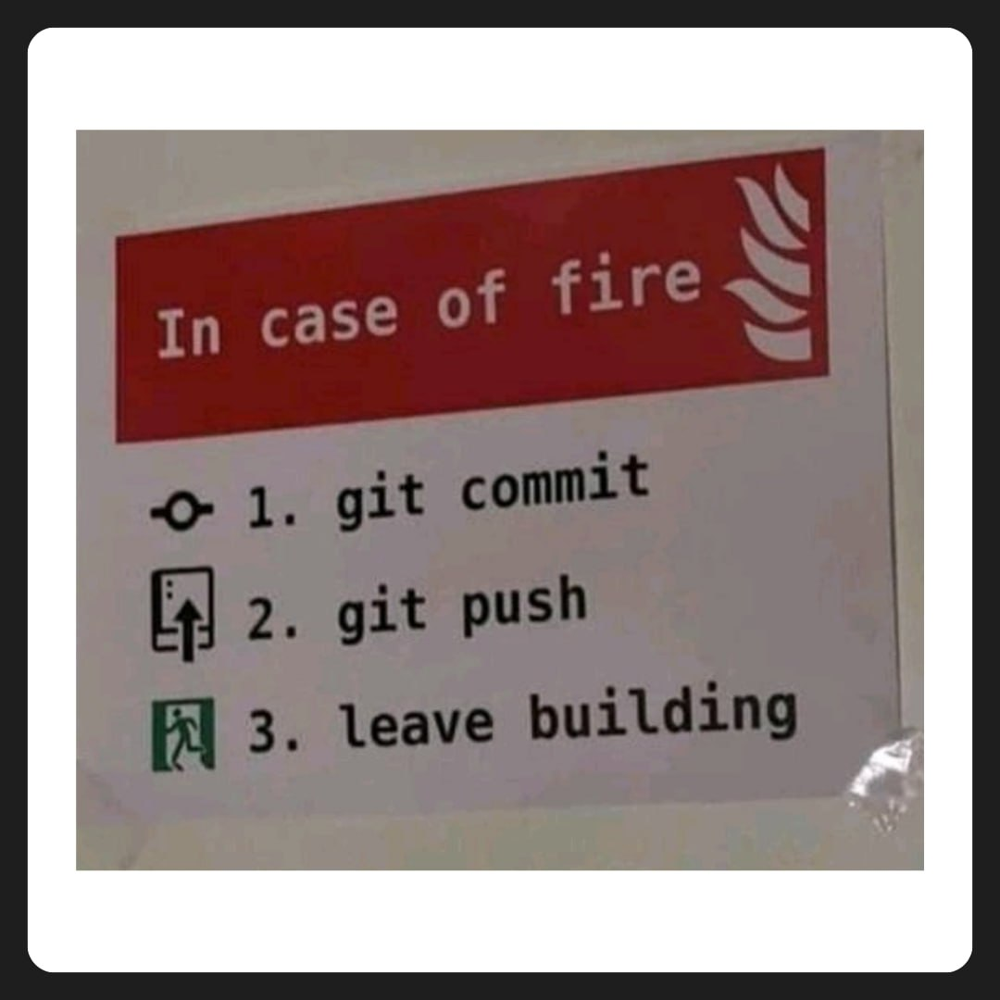
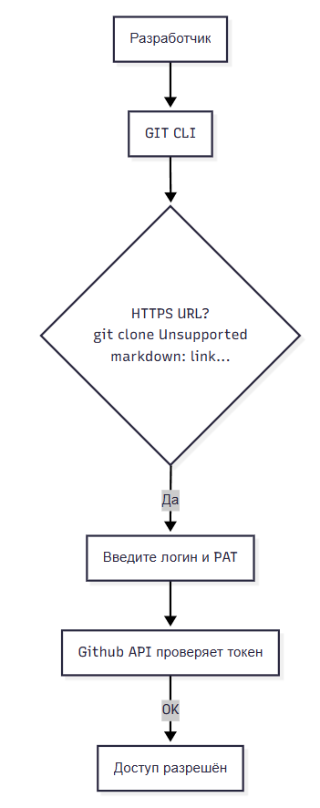
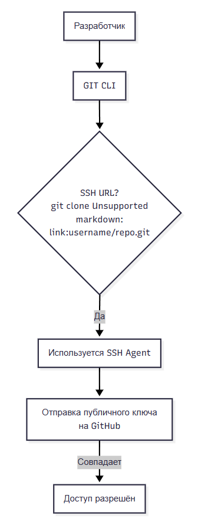
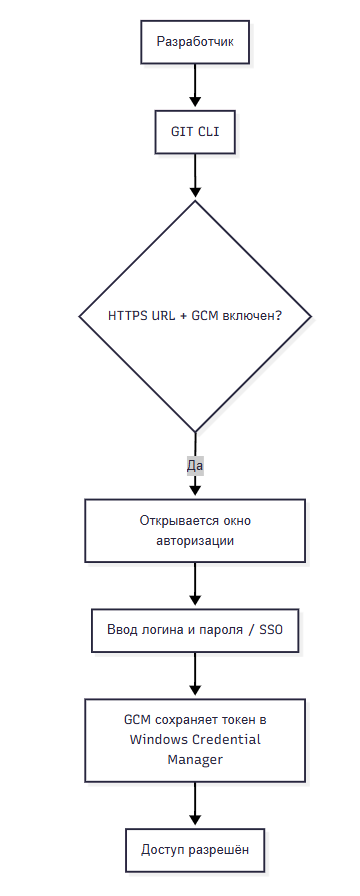

import GitEmulator from '@site/src/components/GitEmulator.jsx';
import CodeSafetyPlay from '@site/src/components/CodeSafetyPlay.jsx';

# Безопасность кода

<div class="article-tags">
  <span class="tag tag-required">ОБЯЗАТЕЛЬНО</span>
  <span class="tag tag-beginner">ДЛЯ НОВИЧКОВ</span>
</div>

<span class="complexity-badge">Разработчику</span>
<span class="complexity-badge">Архитектору</span>
<span class="complexity-badge">Инженеру</span>

---

## Непредвиденные ситуации

Когда пишется код, он должен сохраняться в локальном файле в хранилище. Однако, никто из нас не защищён от непредвиденных ситуаций:
	- Несохранённые изменения – допустим, работа велась без автосохранения, или IDE была закрыта случайно или из-за ошибки;
	- Сбой системы – отключение электричества, синий экран смерти (BSOD), зависание операционной системы;
	- Проблема с инфраструктурой – сбой сервера, проблема с диском;
	- Перезапись файлов – случайное сохранение старой версии поверх новой (к примеру, случайно скопировали некорректный текст и сохранили файл).
	- Удаление папок или файлов без возможности восстановления;
	- Ошибочная замена файлов;
	- Конфликт изменений из-за одновременной работы с файлом (когда разработчики №1 и №2 работали одновременно, будет сохранена версия последнего, без учёта первого).

<div class="callout callout--warning">
  <div class="callout-title">Терминал и Git</div>
  <p>Часть потерь — одна "удобная" команда: <code>rm -rf</code>, <code>git reset --hard</code>, скрипт из чата. Стоп-лист — <a href="/encyclopedia/8-infra-security/8-03-zabota-o-kode-i-dannyh/101">Опасные скрипты</a>.</p>
</div>

---

### Несохранённые изменения

**Несохранённые изменения** представляют собой потерянный прогресс работы в коде. Такая ситуация возникает при отсутствии регулярного сохранения файлов или при аварийном завершении работы интегрированной среды разработки. Каждая внесённая правка, которая не была записана на диск, становится недоступной после закрытия программы.

**Автосохранение** автоматически фиксирует изменения через определённые промежутки времени. Локальная история сохраняет временные копии файлов с отметками времени. Системы контроля версий создают резервные копии при каждом коммите.

---

### Сбой системы

**Сбой системы** приводит к неожиданному прекращению работы операционной системы. Отключение электричества мгновенно лишает компьютер питания. Синий экран смерти указывает на критическую ошибку ядра операционной системы. Зависание операционной системы делает интерфейс полностью неотзывчивым.

**Восстановление** после системного сбоя требует перезагрузки компьютера. При этом все несохранённые данные в оперативной памяти теряются безвозвратно. Жёсткий диск сохраняет информацию, записанную до момента сбоя. 

**Регулярное резервное копирование** становится основным средством защиты от потери данных.

---

### Проблема с инфраструктурой

**Проблема с инфраструктурой** затрагивает аппаратное обеспечение и сетевые компоненты. Сбой сервера нарушает доступ к удалённым ресурсам и сервисам. Проблема с диском может проявляться в виде повреждённых секторов или полного отказа накопителя. Повреждение файловой системы делает данные недоступными для операционной системы.

**Аппаратные сбои** требуют физического вмешательства или замены компонентов. Резервирование дисков с помощью RAID-массивов повышает отказоустойчивость. Облачные сервисы предоставляют распределённое хранение с автоматическим восстановлением. Регулярная проверка состояния оборудования помогает выявить потенциальные проблемы до их критического проявления.

---

### Перезапись файлов

**Перезапись файлов** происходит при сохранении новой информации поверх существующего содержимого. Случайное копирование некорректного текста и последующее сохранение файла приводит к потере оригинальных данных. Открытие старой версии файла и её сохранение поверх актуальной версии уничтожает последние изменения.

Системы контроля версий сохраняют полную историю изменений каждого файла. Локальная история хранит временные копии с различными временными метками. Резервное копирование создаёт независимые версии файлов в отдельных местах хранения. Версионирование файлов позволяет откатиться к предыдущему состоянию без потери данных.

---

### Удаление папок или файлов без возможности восстановления

**Удаление папок или файлов без возможности восстановления** представляет собой окончательную потерю данных. Очистка корзины операционной системы удаляет ссылки на файлы. Форматирование диска стирает файловую систему и делает данные недоступными. Физическое повреждение носителя информации уничтожает данные на аппаратном уровне.

Регулярное резервное копирование создаёт независимые копии данных в безопасных местах. Облачное хранение обеспечивает доступ к файлам из любого места. Внешние накопители предоставляют физическое разделение данных от основной системы. Автоматизация процесса резервного копирования гарантирует своевременное создание копий.

---

### Ошибочная замена файлов

**Ошибочная замена файлов** возникает при некорректном копировании или перемещении данных. Перезапись файла более старой версией приводит к потере актуальных изменений. Замена файла с похожим именем, но различным содержимым нарушает целостность проекта. Автоматические скрипты могут случайно перезаписать важные файлы без предупреждения.

Системы контроля версий отслеживают каждое изменение файла и позволяют восстановить любую предыдущую версию. Хеширование файлов помогает выявить несанкционированные изменения. Автоматические тесты проверяют целостность файлов после операций копирования. Журналирование операций предоставляет информацию о всех изменениях файловой системы.

---

### Конфликт изменений из-за одновременной работы с файлом

**Конфликт изменений** возникает при одновременной работе нескольких разработчиков с одним файлом. Разработчик номер один вносит изменения и сохраняет файл. Разработчик номер два работает с предыдущей версией файла и перезаписывает изменения первого разработчика. Итоговый файл содержит только изменения последнего сохранения, игнорируя работу первого участника.

Системы контроля версий разрешают конфликты через механизм слияния изменений. Блокировка файлов предотвращает одновременное редактирование. Оперативное уведомление о текущих изменениях помогает координировать работу команды. Атомарные операции гарантируют целостность данных при одновременных изменениях.

---

## Средства защиты от непредвиденных ситуаций

<CodeSafetyPlay />

Для защиты кода используется автосохранение (в первую очередь), снимки состояний, локальные истории и конечно же самое важное – VCS (version control System), система контроля версий.

---

### Автосохранение

Автосохранение представляет собой автоматический процесс записи изменений в файл через заданные промежутки времени. Интегрированная среда разработки периодически сохраняет текущее состояние документа без участия пользователя. Интервал автосохранения настраивается в зависимости от предпочтений разработчика и важности проекта.

Автосохранение создаёт временную копию файла с текущими изменениями. При аварийном завершении работы среды разработки последняя сохранённая версия остаётся доступной. Автосохранение работает в фоновом режиме и не требует дополнительных действий от пользователя. Некоторые системы автосохранения создают отдельные временные файлы для предотвращения повреждения оригинального документа.

---

### Снимок состояния

Снимок состояния фиксирует текущее содержимое файла или проекта в определённый момент времени. Создание снимка сохраняет полную копию всех данных с точными временными метками. Снимки состояния позволяют вернуться к любому предыдущему состоянию проекта без потери информации.

Системы контроля версий создают снимки состояния при каждом коммите. Локальная история генерирует снимки через регулярные интервалы времени. Облачные сервисы автоматически создают снимки состояния при синхронизации данных. Снимки состояния хранятся в отдельном месте и не влияют на текущую работу с проектом.

---

### Локальная история

Локальная история представляет собой механизм автоматического сохранения временных копий файлов на локальном компьютере. Интегрированная среда разработки периодически создаёт резервные копии открытых файлов с отметками времени. Локальная история хранит несколько версий каждого файла для возможности восстановления.

Локальная история работает независимо от систем контроля версий и не требует подключения к удалённым репозиториям. Временные копии хранятся в специальной директории на локальном диске. Интерфейс локальной истории позволяет просматривать все сохранённые версии файла и восстанавливать любую из них. Локальная история особенно полезна при работе с небольшими проектами или при отсутствии системы контроля версий.

Локальная история автоматически удаляет старые версии файлов для экономии дискового пространства. Настройки локальной истории позволяют определить количество сохраняемых версий и интервал создания копий. Восстановление из локальной истории происходит мгновенно без необходимости загрузки данных из внешних источников.

---

### Контроль версий

**Контроль версий* – процесс обеспечения учёта вносимых изменений с возможностью отмены изменений и отката к предыдущей версии.

**Системы контроля версий** — это программное обеспечение, которое помогает вам отслеживать изменения, которые вы вносите в свой код с течением времени. Когда вы редактируете свой код, вы говорите системе контроля версий сделать снимок ваших файлов. Система контроля версий сохраняет этот снимок навсегда, чтобы вы могли вызвать его позже, если он вам понадобится. Используйте контроль версий, чтобы сохранять свою работу и координировать изменения кода в вашей команде.


---

### Git

★ Самая популярная система контроля версий – **Git (гит)** – децентрализованная система контроля версий с распределенной архитектурой, позволяющая каждому разработчику обладать своей локальной копией всей истории разработки.




Git использует хеши SHA-1 (алгоритм криптографического шифрования), а с 2020 года перешел на SHA-256, хеш вычисляется от содержимого файла и от метаданных (размера, типа объекта). Технологии шифрования, которые используются для идентификации подлинности объектов, позволяют эффективно сравнивать хеш-таблицы файлов и обеспечивать контроль изменений. 

Git используется через инструменты (можно назвать их Git-системами). Их можно разделить на два вида – платформы и клиенты.

Платформы позволяют использовать хостинг репозиториев.
★ **GitLab** – платформа для хостинга Git-репозиториев с расширенными возможностями (CI/CD, Issue Tracking, Wiki и прочее):
	- можно установить на свой сервер и настроить под себя;
	- встроенный CI/CD (устанавливается пайплайн);
	- Issue Tracker (трекер задач);
	- Container Registry (для Docker-образов).
★ **GitHub** – целая соцсеть, самый популярный хостинг Git-репозиториев, принадлежит Microsoft:
	- встроенный CI/CD (GitHub Actions);
	- Pull Requests (PR) – код-ревью перед слиянием;
	- GitHub Pages (хостинг статических сайтов);
	- Социальная сеть для разработчиков (именно там размещают open-source проекты).
★ Bitbucket – облачный сервис для хостинга репозиториев, созданный компанией Atlassian:
	- ограниченная бесплатная версия (до 5 пользователей);
	- интеграция с проектами Atlassian (Confluence (документация), Jira (привязка коммитов к задачам), Trello (управление задачами));
	- Bitbucket Pipelines – CI/CD для автоматической сборки и деплоя;
	- поддержка Mercurial – альтернативной системы контроля версий;
	- Code Review и Pull Request.

Мы уже затрагивали историю развития системы контроля версий. На практике можно встретить некоторые из них, и даже устаревшие.

**RCS** — Revision Control System хранит историю по одному файлу, использует файлы с суффиксом ",v" (например, file.txt,v).

**CVCS** — Centralized Version Control Systems (Централизованные) это CVS, Subversion и Perforce. Все данные хранятся на сервере. Пользователь делает checkout → изменяет → commit. Нет локальной истории: если сервер сломается — теряется всё.

**DVCS** — Distributed Version Control Systems (Распределённые) не только Git. Есть ещё несколько.

**Perforce (CVCS)** - коммерческая система, широко используется в крупных компаниях (игровые студии, банки и т.д.), поддерживает большие бинарные файлы, отлично масштабируется, имеет мощный интерфейс и интеграции. Платная и сложная.

**Mercurial (DVCS)** более легкий, базирован на Python, является аналогом Git, но чуть проще. Подходит для маленьких и средних проектов, имеет меньше инструментов и интеграций.

**Bazaar (DVCS)** разработан Canonical (Ubuntu), поддерживает как децентрализованный, так и централизованный стиль работы. Может работать поверх других систем (Git, SVN), но сейчас мало кто его использует.

**Darcs (DVCS)** имеет оригинальный подход к отслеживанию изменений — оперирует патчами, а не коммитами. Почти не используется в промышленной разработке, имеет мало инструментов и плохую интеграцию, однако концепция у него интересная.

**BitKeeper (DVCS)** была одна из первых распределённых систем, быстрая, надёжная, использовалась для разработки Linux до появления Git. Но после появления Git практически вышла из употребления.

★ **Клиенты** позволяют взаимодействовать с платформами, и отличаются друг от друга графическим интерфейсом.

★ **Командная строка (Git Bash, PowerShell)** – самый гибкий способ работы с Git. Git устанавливается на компьютер, и интегрируется в командную строку, что позволяет выполнять операции путем ввода команд.

★ **TortoiseGit** – графический клиент Git для Windows, который интегрируется в проводник. В отличие от классического Git, изменения визуализируются. Для новичков – очень легко.

★ **GitKraken** – кроссплатформенный клиент с красивой визуализацией веток, с поддержкой GitHub/GitLab/Bitbucket.

★ **SourceTree (от Atlassian)** – бесплатный клиент с графическим интерфейсом, поддерживающий интеграцию с Jira и Bitbucket.

---

### Работа с Git

<GitEmulator />

---

### Авторизация в Git

**Авторизация в Git** проходит весьма интересным образом.

**PAT (Personal Access Token)** представляет собой альтернативу паролю при работе с GitHub, GitLab и т.д., может иметь ограниченные права и срок действия, используется вместо пароля при HTTPS-подключении.

```bash
git clone https://github.com/username/repo.git 
Username: ваш-логин
Password: ваш-PAT

```

Получить можно на GitHub: Settings → Developer settings → Personal access tokens



SSH-ключи - другой способ, подразумевающий асинхронное шифрование (публичный + приватный ключ), испольуемое при работе через SSH-протокол.

Создаются ключи, публичный ключ привязывается к аккаунту на GitHub/GitLab, и репозиторий клонируется через SSH:

```Bash
git clone git@github.com:username/repo.git
```




Git Credential Manager (GCM) третий способ. Инструмент, который интегрируется в Git и сохраняет токены/PAT в Credential Manager.

Windows предоставляет систему управления учётными данными — **Credential Manager** (Диспетчер учетных данных).
```
Панель управления → Учетные записи пользователей → Диспетчер учетных данных
```
Там хранятся логины и пароли для веб-сайтов, сетевых ресурсов (UNC-пути), приложений, поддерживается Windows Hello, сертификаты, ключи и т.д.



Git использует именно этот механизм, когда вы включаете GCM.

Внутри Windows использует:
	- LSA Secrets (Local Security Authority Secrets) - защищённая часть реестра, где хранятся локальные секреты;
	- DPAPI (Data Protection API) для шифрования данных на уровне пользователя или машины, и Git использует именно это;
	- CredMan (Credential Manager API) для работы с сохранёнными учетными данными - там хранятся логин и токены.

---
---

<!-- http-basics-link -->
:::tip Основа по протоколу
Базовый разбор HTTP и HTTPS находится в отдельной статье — [HTTP как основа веб-интеграций](/encyclopedia/2-system-network/2-09-osnovy-integratsionnogo-vzaimodeystviya/118).
:::

