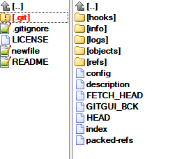
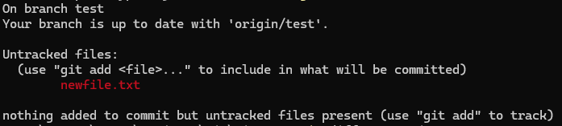
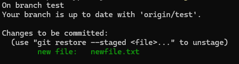
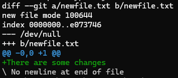
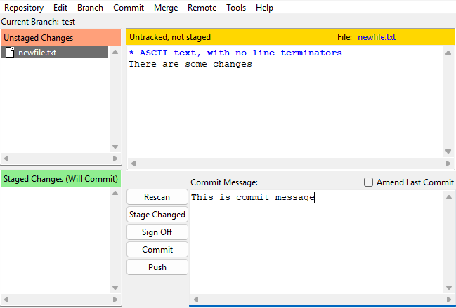
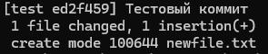

import GitEmulator from '@site/src/components/GitEmulator.jsx';

# Архитектура системы контроля версий Git

<div class="article-tags">
  <span class="tag tag-required">ОБЯЗАТЕЛЬНО</span>
  <span class="tag tag-beginner">ДЛЯ НОВИЧКОВ</span>
</div>

<span class="complexity-badge">Разработчику</span>
<span class="complexity-badge">Архитектору</span>
<span class="complexity-badge">Инженеру</span>

## Как работает Git?

<GitEmulator />

### Основные компоненты Git

**Рабочий каталог** или **рабочая директория** (Working Directory) - текущая директория с файлами проекта, где создаются, изменяются, удаляются файлы. Собственно, папка нашего проекта.

**.git** (Git Directory) - скрытая папка в корне проекта, которая содержит всю историю изменений, метаданные и настройки репозитория. Именно здесь хранится информация о коммитах, ветках, и других элементах.



**Индекс** (Staging Area) - промежуточная зона между рабочим каталогом и репозиторием, куда добавляются изменения перед тем, как их зафиксировать в коммите. Индекс позволяет контролировать, какие изменения войдут в следующий коммит.

К примеру, в нашем репозитории мы создали новый файл, написали туда что-то. Теперь хотим увидеть индекс. Для просмотра состояния индекса, можно написать:

```
git status
```

После этого мы увидим общее состояние рабочей директории и индекса:
- Файлы, добавленные в индекс (зеленый цвет)
- Файлы, измененные но не добавленные в индекс (красный цвет)
- Новые файлы, не отслеживаемые Git



На примере выше мы видим, что есть неотслеживаемые файлы. Чтобы добавить, пишем:

```
git add newfile.txt
```

После этого, команда `git status` покажет уже файл, добавленный в индекс:



Чтобы увидеть все изменения, которые уже добавлены в индекс (через `git add`), мы можем написать команду:

```
git diff --staged
```



Также есть команда `git diff --cached`, она в нашем случае отобразит то же самое (изменения, которые будут включены в следующий коммит).

**Коммит** - зафиксированное состояние рабочего каталога, снимок изменений.



Для создания коммита, пишем:

```
git commit -m "Ваше сообщение коммита"
```



А чтобы отменить последний коммит, пишем:

```
git reset --soft HEAD~1
```

Коммит удалится, но изменения останутся в индексе.

Полностью удалить коммит и изменения:

```
git reset --hard HEAD~1
```

Если же мы хотим отменить изменения предыдущего коммита, но при этом сохранить такую отмену, то используется `revert`:

```
git revert HEAD
```

При этом, изменения на текущий момент всё ещё находятся лишь у нас на компьютере, в папке `.git`.

Для отправки в облако требуется **удалённый репозиторий** (Remote Repository), расположенный на внешнем сервере (например, GitHub, GitLab, Bitbucket). Удалённый репозиторий используется для совместной работы и резервного копирования кода.

**Ветки** (branch) - указатели на снимок изменений. Коммитов может быть много, и они могут быть как в одной ветке, где один коммит следует за другим, как в простом линейном алгоритме, а могут быть во множестве веток.

**HEAD** - указатель на текущий коммит или ветку, в которой находимся. HEAD показывает, где вы сейчас в истории проекта. К примеру, если находимся в ветке main, то HEAD указывает на последний коммит этой ветки. При переключении на другую ветку, указатель перемещается на последний коммит этой ветки.

**Теги** используются для пометки важных моментов в истории проекта. К примеру, релизы определённой версии (v1.0.0). Теги - неизменяемые маркеры конкретного коммита.

**Комментарий** (Message) - описывает, какие изменения были сделаны. Это для понимания других разработчиков. Структура комментария включает заголовок (первую строку), тело и футер (опционально). Всё это указывается после параметра `-m` в кавычках.


Ветки бывают базовыми, основными и прочими. Название ветки - уникальный идентификатор, который помогает различать разные линии разработки.

Можно давать свои названия ветки при создании. Пример - `main`. Давайте разберём.
	- `Base` - базовая ветка, относительно которой происходит изменение.
	- `Master/Main` - основная ветка проекта, представляет собой стабильную версию кода, готовую к выпуску.
	- `Origin` - стандартное имя для удалённого репозитория. Используется для обозначения главного источника кода.

Итого, чтобы отправить изменения в ветку main удалённого репозитория, будет выполняться команда `git push origin main` - то есть, указывается приложение `git`, команда `push`, репозиторий `origin`, ветка `main`.

Также бывают и прочие ветки - `feature` для разработки новый «фич», `release` для подготовки нового релиза, `hotfix` для быстрого исправления критических ошибок.


---

### Механизм работы Git

**Как работает Git?**

Принцип прост:
1. Есть четыре типа объектов – **файл** (blob), **дерево** (tree, совокупность файлов), **коммит** (commit, дерево и дополнительная информация) и **тег** (tag, указатели на коммит);
2. Создаётся локальный репозиторий (подкаталог `.git` с файлами конфигурации, журналов в каталоге проекта) на рабочем месте, через команду `git init`;
3. При необходимости выделения файлов, и папок которые не нужно загружать в репозиторий, создаётся файл `.gitignore`;
4. Создаётся удаленный (онлайн) репозиторий, куда загружается первая версия кода путём фиксации состояния (commit) – при этом создаётся первая ветка (branch);
5. На рабочем месте можно скопировать код из удаленного репозитория через команду `git clone`;
6. Создаётся дополнительная ветка (`git branch`);
7. При создании новой версии производится фиксация изменений(commit) в выбранную ветку
8. Система управления версиями позволяет команде определять, какая из веток является основной (актуальной, `master`);
9. Для того, чтобы синхронизировать локальный репозиторий с удаленным, нужно выполнить `push` (англ. «толкать», отправить в удаленный с локального) или `pull` (англ. «тянуть» загрузить себе в локальный с удаленного);
10. Для загрузки с удаленного на локальный репозиторий свежих изменений использовать можно `fetch` (для загрузки изменений без изменения рабочего каталога) и `pull` (с автоматическим слиянием в текущую ветку).
11. Для объединения веток используется процедура слияния – `merge` для публичных веток, с созданием нового коммита слияния, и `rebase` для локальной очистки истории перед `merge`.


**merge** объединяет изменения из одной ветки в другую, создавая новый коммит слияния (`merge commit`), история становится нетипичной (ветвистой), но сохраняется оригинальная история изменений. К примеру, после `checkout main` можно выполнить `merge feature-branch`. Это важно, когда работаете с общей (публичной) веткой (main, develop) и при слиянии Pull Request'ов в GitHub/GitLab.

**rebase** переносит ваши коммиты «поверх» другой ветки, как будто вы их написали поверх последних изменений. Здесь наоборот, сначала `checkout feature-branch`, потом `git rebase main`. Это перезаписывает историю — опасно, если ветка уже отправлена на удалённый репозиторий. Нужно принудительно пушить (`git push --force`), что может сломать работу других. Это можно использовать на локальных/приватных ветках, пока никто не использует ваш код, и чтобы поддерживать актуальную историю перед отправкой PR.

Не используйте `rebase` на общих (публичных) ветках — это может сломать историю у других участников проекта.

При попытках merge/rebase могут быть конфликты слияния, когда Git не удалось автоматически разрешить различия в одном и том же месте файла. В таком случае нужно вручную исправить конфликт. 

При необходимости точно проконтролировать и отправить только определенное измененное содержимое, используется **индекс** (Staging Area) для точечной отправки в коммит. Допустим. если изменены файлы A, B, C, но нужно отправить только A, B, то к коммиту можно подготовить `git add A B`, таким образом отправить лишь их.

Теги используются для маркировки определённых моментов в истории, чаще всего — выпусков (например, версии v1.0.0). К примеру, 
```bash
git tag -a v1.0.0 -m "Release version 1.0.0"
```

Ветки (branches) от тегов (tags) отличаются тем, что ветка – подвижный указатель, а тег – постоянный и неподвижный. Это механизм ссылок (references). Тег может быть легковесным (только версия, `git tag v1.0.0`), или аннотированный, с сообщением (`git tag -a v1.0.1 -m “Комментарий”`).

`git stash` сохраняет незавершённые изменения, чтобы можно было переключиться на другую задачу. К примеру:
```bash
git stash save "Work in progress"
```
Потом можно применить `stash`:
```bash
git stash apply
```
Увидеть список сохранённых изменений можно через команду:
```bash
git stash list
```

`git cherry-pick` переносит один конкретный коммит из одной ветки в другую по хэшу.
```bash
git cherry-pick abc1234
```

здесь `abc1234` — хэш нужного коммита. Можно применять, когда нужно взять только одно исправление из другой ветки или быстро исправить баг без слияния всей ветки.

`git commit --amend` изменяет последний коммит: можно добавить файлы или изменить сообщение


---

### Установка Git

#### Windows

- Официальный дистрибутив: [Git for Windows](https://git-scm.com/download/win) (включает Git Bash, `git.exe`, `ssh`, `scp`, `curl` и др.).
- Альтернативы: установка через пакетные менеджеры (`winget install Git.Git`, `scoop install git`, `choco install git`).
- Для интеграции в Windows Terminal или PowerShell рекомендуется использовать `Git Bash` или настроить `PATH` вручную.

#### Linux

- Устанавливается через системный пакетный менеджер:
  - Debian/Ubuntu: `sudo apt install git`
  - RHEL/Fedora: `sudo dnf install git`
  - Arch: `sudo pacman -S git`
- Для получения свежей версии — сборка из исходников или использование репозиториев от разработчиков Git.

#### macOS

- Через официальный установщик с [git-scm.com](https://git-scm.com/download/mac).
- Через Homebrew: `brew install git`
- Системная версия (`/usr/bin/git`) устаревает быстро; рекомендуется использовать свежую версию из Homebrew.

---

### Настройка Git

Настройки хранятся в трёх областях:
1. **Системные** (`/etc/gitconfig`) — для всех пользователей.
2. **Глобальные** (`~/.gitconfig` или `~/.config/git/config`) — для текущего пользователя.
3. **Локальные** (`.git/config`) — для конкретного репозитория.

Основные команды:
```bash
git config --global user.name "Имя Фамилия"
git config --global user.email "email@example.com"
git config --global init.defaultBranch main
git config --global core.editor "code --wait"  # или vim, nano и т.д.
git config --global core.autocrlf input       # macOS/Linux
git config --global core.autocrlf true        # Windows
```

Дополнительно:
- Настройка внешнего инструмента для diff/merge (`difftool`, `mergetool`).
- Включение цветного вывода: `git config --global color.ui auto`.

---

### Создание репозитория

1. **Новый локальный репозиторий**:
   ```bash
   mkdir project && cd project
   git init
   ```

2. **Клонирование существующего репозитория**:
   ```bash
   git clone <url> [<directory>]
   ```

3. **Привязка к удалённому репозиторию (если создан локально)**:
   ```bash
   git remote add origin <url>
   git push -u origin main
   ```

---

### Запись изменений в репозиторий

Базовый цикл:
1. **Изменение файлов** в рабочей директории.
2. **Индексация** (`git add <file>` или `git add .`).
3. **Фиксация** (`git commit -m "message"`).
4. **Отправка** (`git push`).

Дополнительно:
- `git status` — просмотр состояния рабочей директории и индекса.
- `git diff` — просмотр неиндексированных изменений.
- `git diff --cached` — просмотр изменений в индексе.
- `git restore` / `git restore --staged` — отмена изменений (начиная с Git 2.23).

---

### Работа с GitHub

1. **Аутентификация**:
   - Через HTTPS: с использованием **Personal Access Token** (PAT) вместо пароля (с августа 2021).
   - Через SSH: генерация ключа (`ssh-keygen`), добавление публичного ключа в GitHub → Settings → SSH.

2. **Типичный workflow**:
   ```bash
   git clone git@github.com:user/repo.git
   cd repo
   git checkout -b feature-x
   # правки → add → commit
   git push origin feature-x
   # создаём Pull Request через веб-интерфейс
   ```

3. **Синхронизация с `main`**:
   ```bash
   git checkout main
   git pull origin main
   git checkout feature-x
   git rebase main        # или git merge main
   ```

4. **Удаление ветки после слияния**:
   ```bash
   git push origin --delete feature-x
   git branch -d feature-x
   ```

---

### Git-атрибуты

Файл `.gitattributes` определяет поведение Git для конкретных путей или типов файлов.

Основные применения:
- **Контроль окончаний строк**:  
  ```
  *.ps1 text eol=crlf
  *.sh text eol=lf
  ```
- **Явное указание binary/text**:  
  ```
  *.png binary
  ```
- **Фильтры (clean/smudge)** — для шифрования, подстановки переменных и т.п.
- **Настройка diff/merge**:  
  ```
  *.sql diff=sql
  ```
- **Экспорт при `git archive`**:  
  ```
  version.txt export-subst
  ```

Атрибуты применяются при индексации, merge, archive, diff и других операциях.

---

### Git в IDE

#### Visual Studio Code

- Встроенная поддержка через Source Control (Ctrl+Shift+G).
- Требуется наличие `git` в `PATH`.
- Расширения: GitLens (расширенная навигация по истории), Git Graph.

#### JetBrains (IntelliJ IDEA, PyCharm и др.)

- Git поддерживается «из коробки».
- Настройка: Settings → Version Control → Git → указать путь к `git.exe` (на Windows).
- Поддержка хуков, rebase, cherry-pick, conflict resolution в GUI.

#### Visual Studio

- Встроенная поддержка через Team Explorer или Git Changes (начиная с VS 2019).
- Требуется установка Git for Windows.

#### Eclipse

- Через плагин **EGit** (входит в большинство дистрибутивов).
- Ограниченная поддержка продвинутых операций; рекомендуется использовать CLI параллельно.

---

### Советы по работе с Git

1. **Пишите осмысленные сообщения коммитов**:
   - Первая строка — краткое описание (до 50 символов), без точки.
   - Пустая строка.
   - Подробное тело (если необходимо), с переносами строк `<`72 символов.

2. **Используйте `.gitignore` с самого начала**:
   - Исключайте временные файлы, зависимости, IDE-настройки.
   - Готовые шаблоны: [github.com/github/gitignore](https://github.com/github/gitignore).

3. **Не коммитьте чувствительные данные**:
   - Используйте `.gitignore`, `git rm --cached`, или `git filter-repo` для очистки истории.

4. **Предпочитайте `rebase` для локальной истории**, `merge` — для публичных веток.

5. **Регулярно синхронизируйтесь с `origin/main`**, чтобы избежать сложных конфликтов.

6. **Используйте `git config --global alias.<name> <command>`** для сокращения частых команд.

7. **Тестируйте перед коммитом**: локальные хуки (`pre-commit`, `pre-push`) снижают риск попадания ошибок в общий код.

8. **Избегайте `git push --force` в общих ветках**; используйте `--force-with-lease`, если необходимо.

---
