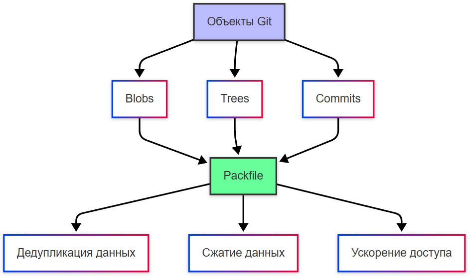

# Особенности работы с репозиториями в Git

<div class="article-tags">
  <span class="tag tag-required">ОБЯЗАТЕЛЬНО</span>
  <span class="tag tag-beginner">ДЛЯ НОВИЧКОВ</span>
</div>

<span class="complexity-badge">Разработчику</span>
<span class="complexity-badge">Архитектору</span>
<span class="complexity-badge">Инженеру</span>

:::tip Связь с разделом 4

Сценарии **веток**, **pull request / merge request** и разрешения конфликтов — в [Ветвление и слияние в Git](/encyclopedia/4-code-dev/4-13-osnovy-raboty-s-git/113). Здесь — **как** Git передаёт объекты по сети и как устроено хранение на стороне сервера и клиента.

:::

---

## Особенности работы с репозиториями в Git

### Протоколы в Git

Git использует несколько протоколов для передачи данных между репозиториями:

1. **Локальный протокол** (`file://`) — копирование или жёсткие ссылки на объекты в пределах одной файловой системы.
2. **HTTP(S)**:
   - *Dumb HTTP* — устаревший, работает через статические файлы, не поддерживает smart-операции.
   - *Smart HTTP* — основной современный протокол, использует `git-http-backend` на сервере и позволяет выполнять `fetch`, `push`, `clone` через POST-запросы.
3. **Git-протокол** (`git://`) — легковесный, нешифрованный, требует запуска `git daemon`. Лишён аутентификации, обычно используется только для публичного чтения.
4. **SSH** (`ssh://` или `user@host:path`) — наиболее распространённый протокол для приватных репозиториев, обеспечивает шифрование и аутентификацию.

Все протоколы, кроме локального, используют **упакованный обмен объектами**: клиент и сервер согласуют набор необходимых объектов и передают их в сжатом виде.

---

### Git демон

`git daemon` — это легковесный сервер, реализующий "голый" `git://`-протокол. Он:

- Слушает TCP-порт 9418.
- Предоставляет только операции чтения (clone, fetch).
- Не поддерживает аутентификацию или шифрование.
- Требует явного разрешения доступа к репозиторию (наличие файла `git-daemon-export-ok` в корне репозитория).
- Предназначен исключительно для публичных, нечувствительных репозиториев.

В современной практике `git daemon` используется редко ввиду отсутствия безопасности; предпочтение отдаётся SSH или HTTPS.

---

### Оптимизация хранения объектов в Git

Git хранит каждый объект (блоб, дерево, коммит, тег) в виде отдельного файла в `.git/objects/`. Однако при росте истории это становится неэффективным. Поэтому Git применяет два механизма:

1. **Packfiles**
2. **Дедупликация и дельта-сжатие**

---

### Packfiles

Packfile — это бинарный файл, содержащий множество объектов Git в упакованном виде. Создаётся командами `git repack` или автоматически при `git gc`.

- **Формат**: заголовок + последовательность записей объектов.
- **Сопутствующий файл**: `.idx` (индекс), содержит смещения объектов в packfile для быстрого поиска по SHA-1.
- Каждый packfile может содержать **базовые объекты** и **дельта-объекты** (ссылки на другие объекты с описанием изменений).

---

### Блобы, деревья и коммиты в Packfile

- **Блобы** (файлы) — кандидаты на дельта-сжатие: Git ищет похожие блобы и сохраняет только различия.
- **Деревья** (структуры каталогов) — также могут быть дельта-сжаты, особенно если структура каталога меняется мало.
- **Коммиты** — обычно не сжимаются дельтами (из-за малого размера и слабой повторяемости), но упаковываются для уменьшения количества файлов.

После упаковки исходные loose-объекты (отдельные файлы в `.git/objects/`) могут быть удалены.

---

### Дедупликация данных

Git автоматически дедуплицирует идентичные данные:

- Один и тот же блоб (например, файл без изменений между коммитами) хранится **один раз**.
- Ссылка на блоб в деревьях — это хеш содержимого, а не путь или имя.
- Это работает на уровне объектной модели: дедупликация гарантируется хешированием содержимого (content-addressable storage).

---

### Сжатие данных

Git применяет два уровня сжатия:

1. **Zlib-сжатие** для каждого отдельного объекта (loose или в packfile).
2. **Дельта-сжатие** (delta encoding) внутри packfile:
   - Объект представляется как последовательность изменений относительно "базового" объекта.
   - Git выбирает оптимальные базы с помощью эвристик (например, размер дельты, глубина цепочки).
   - Дельты могут быть цепочечными (объект A → B → C), но Git ограничивает глубину для избежания замедления.

---

### Ускорение доступа

Packfiles оптимизируют хранение и доступ:

- **Индекс (.idx)** позволяет находить объект по SHA-1 за O(log n).
- При клонировании или fetch Git передаёт **один packfile**, а не тысячи отдельных файлов — это снижает накладные расходы файловой системы и сети.
- Локальные операции (например, `git log`) читают объекты из packfile напрямую, минуя множество мелких I/O-операций.

---





---

### Как Git отслеживает изменения `HEAD`

Каждый раз, когда `HEAD` обновляется — будь то при создании коммита, переключении веток (`git checkout` / `git switch`), перемотке (`git reset`), слиянии или ребейзе — Git записывает новое значение `HEAD` в журнал reflog.

```bash
git checkout
```

Расположение журнала:
- Для `HEAD`: `.git/logs/HEAD`
- Для веток: `.git/logs/refs/heads/<branch-name>`

Каждая запись содержит:
- Хеш предыдущего состояния ссылки,
- Хеш нового состояния,
- Временную метку,
- Описание операции (например, `commit`, `checkout`, `reset`, `merge`).

Записи reflog **локальны** и **не передаются** при `push` / `fetch` / `clone`.

---

### Использование reflog для восстановления потерянных коммитов

Коммиты считаются "потерянными", если на них не ссылается ни одна ветка, тег или `HEAD`. Однако до момента сборки мусора (`git gc`) такие коммиты остаются в объектной базе и могут быть найдены через reflog.

---

#### Сценарии восстановления

1. **Отменённый коммит после `reset --hard`**  
   ```bash
   git reset --hard HEAD~2  # ушли на 2 коммита назад, предыдущие теперь "потеряны"
   git reflog               # видим запись вида "HEAD@{1}: reset: ..."
   git checkout -b rescue-branch HEAD@{1}  # восстанавливаем через reflog
   ```

2. **Перезаписанная ветка после `rebase` или `filter-branch`**  
   Reflog ветки (`git reflog show <branch>`) сохраняет её предыдущие состояния.

```bash
git reflog show <branch>
```

3. **Случайное удаление ветки**  
   Если ветка была удалена, но ранее на неё переключались, её последнее состояние может быть в reflog `HEAD`.

---

#### Ограничения

- Записи reflog хранятся по умолчанию **30 дней** для недостижимых (`unreachable`) коммитов и **90 дней** для достижимых (`reachable`). Эти сроки регулируются через `gc.reflogExpire` и `gc.reflogExpireUnreachable`.
- После выполнения `git gc --prune=now` недостижимые объекты и связанные с ними записи reflog удаляются безвозвратно.

```bash
git gc --prune=now
```

---

### Команды с ветками

- Просмотр истории `HEAD`:  
  ```bash
  git reflog
  # или эквивалентно:
  git reflog show HEAD
  ```
- Просмотр истории конкретной ветки:  
  ```bash
  git reflog show feature-x
  ```
- Восстановление состояния по записи:  
  ```bash
  git reset --hard HEAD@{2}
  # или создание новой ветки:
  git branch rescue HEAD@{2}
  ```

---


---

### Git-хуки

Git-хуки — это исполняемые сценарии, автоматически запускаемые в ответ на определённые события в жизненном цикле репозитория. Они размещаются в директории `.git/hooks/` и срабатывают локально (на стороне клиента) или на сервере (в bare-репозитории).

---

#### Основные клиентские хуки

1. **`pre-commit`**  
   - **Контекст**: запускается перед фиксацией коммита, но после формирования его содержимого.  
   - **Назначение**: проверка качества кода, запуск линтеров, статических анализаторов, запрет коммита при наличии ошибок.  
   - **Пример действия**:  
     ```bash
     # .git/hooks/pre-commit
     npm run lint -- --quiet
     if [ $? -ne 0 ]; then
       echo "Linting failed. Commit aborted."
       exit 1
     fi
     ```

2. **`post-commit`**  
   - **Контекст**: запускается после успешного создания коммита.  
   - **Назначение**: уведомления, логирование, обновление метаданных.  
   - **Важно**: не может отменить коммит (так как тот уже зафиксирован).  
   - **Пример действия**: отправка уведомления в чат или запись в локальный журнал.

3. **`pre-push`**  
   - **Контекст**: запускается перед отправкой объектов на удалённый репозиторий (`git push`).  
   - **Назначение**: финальная проверка кода, запрет отправки при наличии запрещённых паттернов (например, `console.log`), проверка соответствия политики.  
   - **Пример действия**:  
     ```bash
     # .git/hooks/pre-push
     if git diff --name-only HEAD~1 | grep -q "\.env"; then
       echo "Push blocked: .env files detected"
       exit 1
     fi
     ```

4. **`post-merge`**  
   - **Контекст**: запускается после успешного выполнения `git merge` или `git pull`.  
   - **Назначение**: обновление зависимостей, перегенерация ассетов, синхронизация конфигураций.  
   - **Пример действия**:  
     ```bash
     # .git/hooks/post-merge
     if [ -f package-lock.json ]; then
       npm ci
     fi
     ```

---

#### Серверные хуки (в bare-репозитории)

- **`pre-receive`** — запускается до принятия объектов от клиента; может отклонить `push` целиком.
- **`post-receive`** — запускается после успешного приёма объектов; часто используется для CI/CD-триггеров, вебхуков, развёртывания.

---

### Ограничения и особенности

- Хуки **не входят в историю репозитория** и не распространяются через `clone`/`pull`. Для совместного использования их размещают в отдельной директории (например, `.githooks/`) и активируют через `git config core.hooksPath`.

```bash
git config core.hooksPath
```
- Хуки должны быть исполняемыми (`chmod +x`) и обычно написаны на shell, Python или другом скриптовом языке.
- Серверные хуки работают только в **bare-репозиториях** (без рабочей директории).

---

### Чистый Git-репозиторий и gitweb

Git изначально задуман как **децентрализованная система контроля версий**, не зависящая от веб-интерфейсов или облачных платформ. Возможна полноценная работа с репозиториями, развёрнутыми на локальном или корпоративном сервере.

---

#### Bare-репозиторий

- Не содержит рабочей директории (`working tree`).
- Используется исключительно как **удалённое хранилище** для обмена изменениями (`fetch`/`push`).
- Создаётся командой:  
  ```bash
  git init --bare my-repo.git
  ```

---

#### gitweb

- Простой веб-интерфейс для просмотра Git-репозиториев, поставляемый в комплекте с Git.
- Предоставляет: просмотр истории, diff’ы, дерево файлов, поиск по коммитам.
- Требует настройки веб-сервера (обычно Apache или Nginx с CGI).
- Не поддерживает интерактивные операции (например, pull request’ы, issue tracking) — это чисто **read-only** инструмент.

---

#### Альтернативы

- Для расширенной функциональности (CI/CD, code review, управление доступом) используются полноценные системы: GitLab, Gitea, Gogs, cgit.
- Однако в сценариях с повышенными требованиями к безопасности, изоляции или минимальной атакуемой поверхности часто предпочитают "голый" Git с ограниченным набором хуков и, при необходимости, gitweb для аудита.

---
---

{/* http-basics-link  */}
:::tip Основа по протоколу
Базовый разбор HTTP и HTTPS находится в отдельной статье — [HTTP как основа веб-интеграций](/encyclopedia/2-system-network/2-09-osnovy-integratsionnogo-vzaimodeystviya/118).
:::

