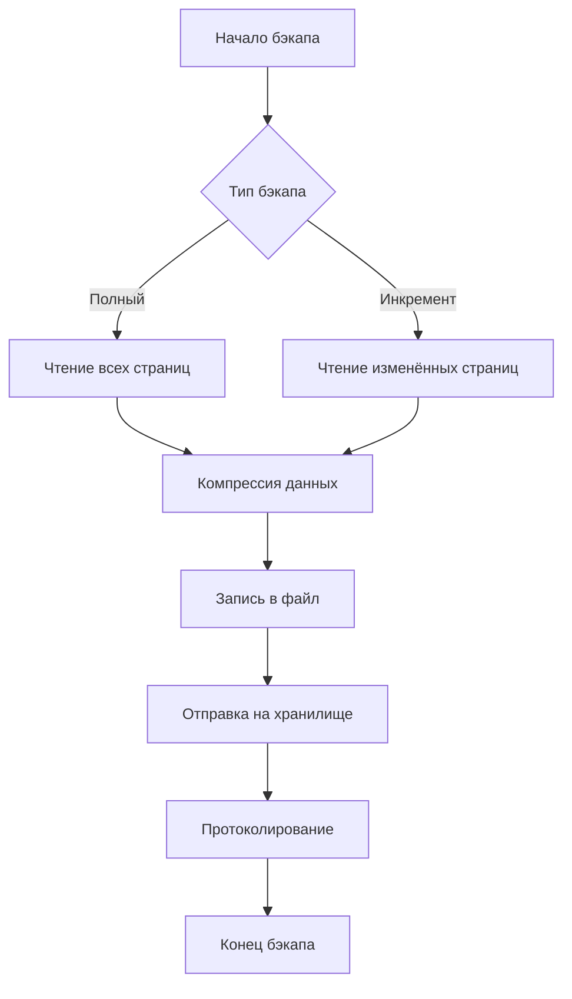
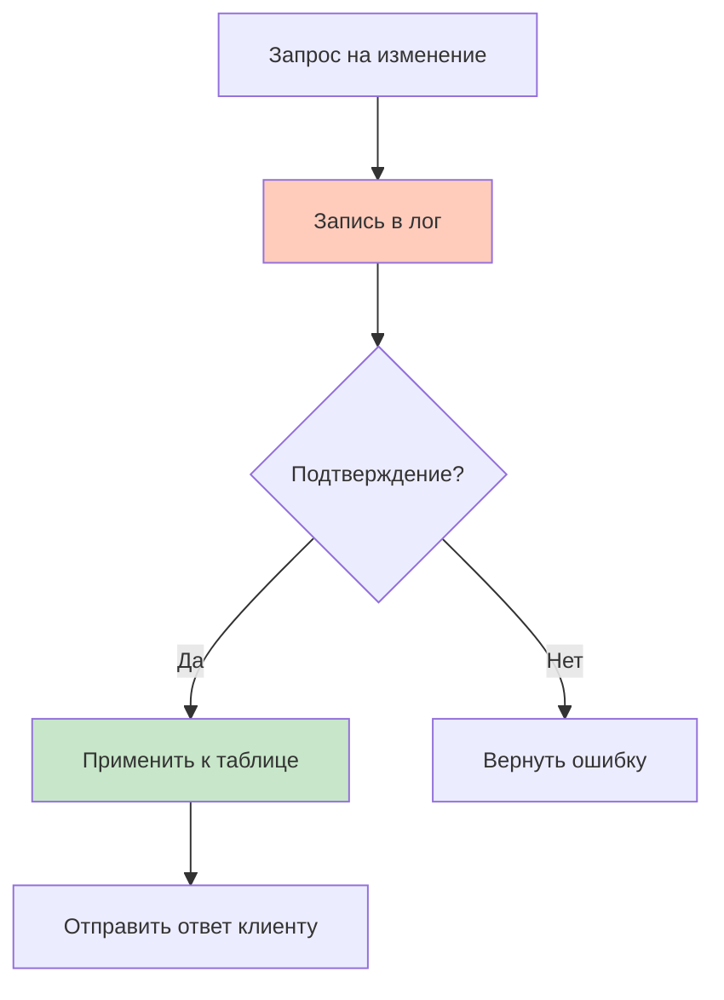
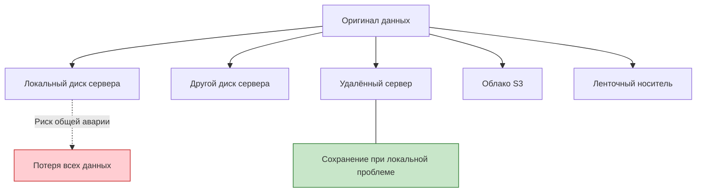

import BackupDemo from '@site/src/components/BackupDemo.jsx';

# Методы защиты пользовательских и корпоративных данных

<div class="article-tags">
  <span class="tag tag-required">ОБЯЗАТЕЛЬНО</span>
  <span class="tag tag-beginner">ДЛЯ НОВИЧКОВ</span>
</div>

<span class="complexity-badge">Разработчику</span>
<span class="complexity-badge">Архитектору</span>
<span class="complexity-badge">Инженеру</span>

---

## Защита данных

<div class="callout callout--tip">
  <div class="callout-title">Связь с кодом</div>
  <p>Исходники и история — <a href="./1.md">Безопасность кода</a>, Git и reflog — <a href="./111.md">111</a>–<a href="./113.md">113</a>. Здесь — **данные приложений** (БД, файлы пользователей, бэкапы), шифрование и политики хранения. Секреты в репозиторий не кладут — см. также <a href="/encyclopedia/8-infra-security/8-07-informatsionnaya-bezopasnost/intro">раздел 8.07</a>.</p>
</div>

### Как защитить данные?

В [статье про безопасность кода](./1.md) разобраны Git, автосохранение и риски потери **исходников**. С **данными** (записи в PostgreSQL, загруженные файлы, логи, аналитика) ситуация иная: объём больше, версионирование редко делают через Git, а риски те же — удаление, порча, шифровальщик, утечка, случайный `DROP TABLE`.

Для данных нет Git — в репозитории хранят код и конфигурацию, а данные живут в СУБД и object storage. Защита строится на **бэкапах**, **шифровании**, **прав доступа** и **проверке восстановления** (restore drill).

Для защиты данных используется резервное копирование (backup, бэкап), это защищает от пропажи данных при сбоях, атаках или ошибках.

<BackupDemo />

---

## Практический минимум — до углубления в СУБД

Перед детальным разбором PostgreSQL, инкрементов и облаков зафиксируйте **операционный минимум** для любой команды.

### Правило 3-2-1

- **3** копии данных (рабочая + два бэкапа);
- **2** разных типа носителя (диск сервера + объектное хранилище);
- **1** копия **вне** основной площадки (другой регион/провайдер).

Бэкап, лежащий на том же диске, что и база, не спасает от пожара дата-центра или ransomware.

### RPO и RTO — на языке бизнеса

| Метрика | Вопрос | Пример |
|---------|--------|--------|
| **RPO** (Recovery Point Objective) | Сколько данных можно **потерять** по времени? | «Не больше 1 часа транзакций» → hourly dump + WAL |
| **RTO** (Recovery Time Objective) | За сколько **поднять** сервис после сбоя? | «4 часа» → заранее прописанный runbook restore |

Если RPO/RTO не согласованы, «есть бэкап» на практике означает «когда-нибудь восстановим, потеряв неизвестно сколько».

### Restore drill — обязательная проверка

Раз в квартал (или после смены инфраструктуры):

1. Взять **случайный** архив бэкапа не с production.
2. Развернуть на **тестовом** сервере или в Docker.
3. Проверить логин приложения, выборку из ключевых таблиц, checksum выборки.
4. Зафиксировать время и проблемы в wiki.

Бэкап без успешного тестового restore — надежда, а не процедура. См. также [восстановление в Git](/encyclopedia/2-system-network/2-06-sistemnoe-administrirovanie/data-restoring/112) для кода.

### Типовые инциденты и первые шаги

| Инцидент | Не делать | Делать |
|----------|-----------|--------|
| Случайный `DELETE` без WHERE | Панический второй скрипт | Остановить приложение, snapshot/WAL, point-in-time recovery |
| Ransomware зашифровал диск | Платить сразу | Изолировать хост, restore из offline-копии, смена секретов ([101](./101.md)) |
| `.env` с паролями в Git | Только `git rm` | Ротация секретов + `git filter-repo` + [ИБ](/encyclopedia/8-infra-security/8-07-informatsionnaya-bezopasnost/intro) |
| «Бэкап 500 GB, места нет» | Отключить бэкап | Retention, инкременты, cold storage — ниже по тексту |

---

## Бэкапы баз данных

### Что такое бэкап базы данных?

**Бэкап** — это копия данных, созданная с целью восстановления информации при утрате оригинала. В контексте баз данных бэкап сохраняет состояние таблицы, схемы или всей информационной системы в определённый момент времени.

**Бэкапы баз данных** осуществляются по следующим методам:

| Метод | Описание |
|---|---|
| Полный бэкап | Копируется вся база данных (дамп) |
| Инкрементный | Копируются только изменения с момента последнего бэкапа |
| Транзакционные логи | Записываются все изменения |
| Снимки (snapshots) | Полный снимок диска |

Данные в базе подвержены риску потери по нескольким причинам. Аппаратные сбои приводят к повреждению дисков. Программные ошибки вызывают некорректное удаление или изменение записей. Человеческий фактор приводит к случайному удалению важных записей. Злоумышленники получают доступ к системе и портят содержимое. Стихийные бедствия уничтожают серверное оборудование физически.

Бэкап решает проблему сохранения работоспособности системы после инцидента. Процесс восстановления включает копирование сохранённых файлов обратно на сервер базы данных.

```sql
-- Пример создания бэкапа в PostgreSQL
pg_dump my_database > backup_20260510.sql
```

Процесс создания резервной копии включает несколько этапов.
- Первый этап определяет точку восстановления и целевое хранилище.
- Второй этап запускает инструмент резервного копирования.
- Третий этап проверяет корректность созданных файлов.
- Четвёртый этап загружает копии в защищенное место хранения.
- Пятый этап документирует параметры операции.

Выбор инструмента зависит от типа СУБД и требований к скорости выполнения. Система управления базами данных предоставляет встроенные команды для формирования дамп файлов. Третья сторона предлагает программные решения для автоматизации процесса. Облачные платформы предоставляют сервисы резервирования как часть инфраструктуры.

| Шаг | Действие | Результат |
|---|---|---|
| 1 | Определение параметров | Выбор точки, формата, места хранения |
| 2 | Запуск механизма | Создание файла резервной копии |
| 3 | Проверка целостности | Хеш-суммы и размер файла |
| 4 | Передача на хранение | Копирование в облако или другое хранилище |
| 5 | Документирование | Лог с временем и параметрами операции |

---

### Что такое дамп?

**Дамп** — текстовое представление структуры базы данных и её содержимого. Дамп содержит SQL-команды для воссоздания схемы таблиц и заполненных данных. Формат файла обычно имеет расширение .sql или .dump.

Инструменты дампа генерируют команды `CREATE`, `INSERT`, `ALTER`. Команда `CREATE TABLE` формирует структуру таблиц с типами колонок. Команда `INSERT INTO` добавляет строки данных. Команда `ALTER TABLE` изменяет существующую схему.

```sql
-- Пример содержимого дампа
CREATE TABLE users (
    id SERIAL PRIMARY KEY,
    name VARCHAR(100) NOT NULL,
    email VARCHAR(255) UNIQUE
);

INSERT INTO users (name, email) VALUES ('Ivan', 'ivan@example.com');
```

Дамп читаем человеком и переносим между системами. Администратор может открыть файл в текстовом редакторе и изменить его перед восстановлением. Разработчик изучает структуру базы по дампу без запуска сервера.

---

### Полный бэкап

**Полный бэкап** — создание копии всех данных и структуры базы данных за один раз. Полная копия содержит все таблицы, индексы, пользователи и права доступа.

---

#### Плюсы полного бэкапа

| Преимущество | Описание |
|---|---|
| Простота восстановления | Один файл достаточно для возврата системы в рабочее состояние |
| Не требуется цепочка | Восстановление не зависит от последовательных копий |
| Предсказуемость | Размер бэкапа известен заранее |
| Минимальные требования к процессу | Нет необходимости в дополнительном инструментарии |

---

#### Минусы полного бэкапа

| Недостаток | Описание |
|---|---|
| Большой объём данных | Занимает много места на носителе |
| Длительное время создания | Копирование занимает часы при больших базах |
| Высокая нагрузка на систему | Увеличивается потребление ресурсов во время выполнения |
| Частые обновления нерациональны | При небольших изменениях копируются unchanged данные |

Смысл полного бэкапа заключается в создании изолированной точки восстановления. Система восстанавливается до момента создания копии без дополнительных условий. Инженер выбирает полную резервную копию из архива и загружает её на сервер.

```csharp
// Пример скрипта PowerShell для создания полного бэкапа
$backupPath = "C:\Backups\FullBackup.sql"
pg_dump -h localhost -U postgres mydb > $backupPath
Write-Host "Backup created at $($backupPath)"
```

---

### Инкрементальный бэкап

**Инкрементный бэкап** — создание копии только изменённых данных с момента предыдущей резервной копии. Инкремент экономит пространство на диске и сокращает время выполнения операции.

Механизм отслеживает изменения через метаданные или журналы транзакций. База данных помечает изменённые страницы и записи. Инструмент копирования анализирует список модификаций и формирует дифференциал. Сохраняется разница между текущим состоянием и последней полной копией.

| Характеристика | Инкрементальный бэкап |
|---|---|
| Объём данных | Только изменения за период |
| Время создания | Короче чем у полного |
| Место на диске | Меньше чем у полного |
| Сложность восстановления | Требует последовательности копий |

Процесс восстановления инкрементального бэкапа начинается с полной копии. Затем применяются все промежуточные инкрементальные файлы по порядку. Без строгой последовательности восстановление невозможно. Данные теряют консистентность если пропустить ступень.

---

### Транзакционные логи

**Транзакционный лог** — запись всех изменений данных с временными метками. Логи хранят информацию о каждой транзакции независимо от частоты операций. Каждая команда INSERT, UPDATE, DELETE попадает в журнал.

Зачем нужны бэкапы логов при их большом объёме? Логи позволяют восстановить базу до произвольного момента времени. Инженер выбирает конкретную секунду аварийного события и возвращает систему в это состояние. Без логов доступна только последняя полная или инкрементальная копия.

| Параметр | Описание |
|---|---|
| Объём | Непрерывно растёт до момента очистки |
| Потребление места | Умеренное при регулярной очистке |
| Роль в recovery | Позволяет достичь цели точки восстановления RPO |
| Типичное содержание | Начало транзакции, команды, коммит, rollback |

Процесс включает периодическую выгрузку сегментов лога и сохранение в отдельный каталог. После выгрузки освобождаются страницы в основном журнале. Это предотвращает переполнение дискового пространства.

```json
{
  "transaction_id": 15823,
  "timestamp": "2026-05-10T14:23:45Z",
  "operation": "UPDATE",
  "table": "orders",
  "row_changes": {
    "status": ["pending", "shipped"]
  }
}
```

Система управляет циклом жизненного цикла логов. Архитектура разделяет активный журнал для текущего сеанса и архивные версии для восстановления. Мониторинг размера лога предупреждает о приближении лимита. Оператор получает уведомление перед выполнением ротации.

---

### Снимки дисков

**Снимок диска** — технология мгновенного клонирования физического тома хранения данных. Снимок фиксирует состояние блока данных в момент времени без ожидания завершения копирования файлов.

Механизм работает через файловую систему уровня хранения. При создании снимка создаётся указатель на текущие блоки данных. Изменения записываются в новые блоки. Старые блоки остаются неизменными.

| Параметр | Свойство |
|---|---|
| Скорость создания | Секунды вместо часов |
| Влияние на производительность | Минимальное во время операции |
| Совместимость | Зависит от контроллера RAID и системы хранения |
| Использование | Подключение для чтения или быстрого восстановления |

Снимки подходят для краткосрочного использования. Они сохраняют ссылку на оригинальные блоки данных. Если исходный диск выходит из строя, снимок тоже становится недоступным. Для долгосрочного хранения рекомендуются полные копии на других носителях.

---

### Где хранить бэкапы

Хранение бэкапов должно учитывать правило трёх копий. Первая копия находится рядом с системой для быстрого восстановления. Вторая копия хранится в другом физическом месте для защиты от локальных катастроф. Третья копия располагается в облачном хранилище для дополнительной гарантии.

Облачное хранилище обеспечивает географическое распределение и защиту от стихийных бедствий. Сервис предоставляет встроенное шифрование и репликацию между регионами. Доступ к данным регулируется политиками безопасности и аутентификацией.

Локальное хранилище позволяет выполнять восстановление без интернет-соединения. Сервер с бэкапами расположен в том же дата-центре или отделении предприятия. Инженер использует прямое подключение через сеть для загрузки данных.

| Хранилище | Преимущества | Ограничения |
|---|---|---|
| Локальный диск | Быстрый доступ | Риск одновременной поломки |
| Внешний накопитель | Отдельное устройство | Ручное управление |
| Облако | Географическая защита | Требуется подключение |
| Архивные ленты | Дешевизна хранения | Медленный доступ |

Процесс передачи данных включает шифрование перед отправкой. Шифрование защищает конфиденциальность содержимого при передаче через сеть. Пароль расшифровки хранится отдельно от самих файлов.

```bash
# Пример команды для шифрования бэкапа
gpg --encrypt --recipient admin@company.com backup_20260510.sql
```

Шифрование также применяется к файлам на диске. Алгоритм AES-256 обеспечивает высокий уровень защиты. Управление ключами шифрования интегрируется с инфраструктурой организации.

---

### Как работает бэкап

Процесс создания бэкапа запускается по расписанию или вручную. Планировщик задач вызывает скрипт в определённое время суток. Оператор инициирует ручное выполнение при критических изменениях данных.

Сервер базы данных приостанавливает операции записи во время создания полной копии. Индексация продолжается. Чтение данных разрешено без блокировок. Это минимизирует влияние на пользователей системы.



После завершения проверки подтверждается успешное завершение операции. Система отправляет уведомление администратору об успехе или ошибке. При неудаче запускается повторное выполнение с новыми параметрами.

---

### Практика восстановления

Восстановление требует планирования тестирования заранее. Оператор выполняет процедуру восстановления на тестовой машине. Результаты сравниваются с ожидаемыми данными. Процедура фиксируется в инструкции.

| Этап | Действие | Ответственный |
|---|---|---|
| 1 | Подготовка среды | Системный администратор |
| 2 | Выбор точки восстановления | Руководитель проекта |
| 3 | Воспроизведение данных | Инженер по базам данных |
| 4 | Проверка целостности | Тестировщик |
| 5 | Утверждение | Владелец системы |

При выборе точки восстановления учитывается цель бизнес-непрерывности. Показатели RTO определяют максимально допустимое время простоя. Показатели RPO определяют максимально допустимую потерю данных.

```yaml
# Параметры целей восстановления
recovery_time_objective: 4 hours
recovery_point_objective: 1 hour
backup_frequency: every 6 hours
retention_period: 30 days
encryption_enabled: true
```

---

<div class="callout callout--tip">
<div class="callout-title">Если есть возможность</div>
Регулярно проводите тестовые процедуры восстановления. Иначе реальная авария выявит проблемы в последний момент.
</div>

---

## Транзакционные логи

### Что такое транзакционный лог?

**Транзакционный лог** представляет собой журнал всех изменений, которые вносятся в базу данных с течением времени. Каждая операция записи попадает в этот файл до момента подтверждения изменения основных данных таблицы. Система записывает информацию о начале транзакции, все команды внутри неё, и финальный коммит или откат.

Логи обеспечивают возможность восстановления данных после сбоя оборудования. Они позволяют вернуть систему к произвольной точке во времени. Репликация использует эти записи для синхронизации копий базы на других серверах. Аудит систем безопасности хранит историю действий пользователей.

Каждый лог содержит уникальный идентификатор транзакции, временную метку, тип операции и изменённые данные. Запись происходит последовательно с минимальными накладными расходами. Оператор читает лог по порядку при необходимости восстановления информации.

То есть, при любом изменении в БД, СУБД автоматически записывает сначала операцию в лог, только затем применяет изменения к данным. Примеры:

| СУБД | Лог | Применение |
|---|---|---|
| PostgreSQL | WAL (Write-Ahead Log) | Восстановление, репликация, PITR |
| MySQL | Binlog (Binary Log) | Репликация, восстановление, аудит |
| SQL Server | Transaction Log | PITR, зеркалирование |
| MongoDB | Oplog (Operations Log) | Репликация в шардированных кластерах |

Обычно при резервном копировании БД пишут скрипт, который потом запускают по необходимости. Например, в PostgreSQL пишут pg_dump для полного бэкапа. Для автоматизации можно использовать планировщики задач (допустим, встроенный планировщик задач в Windows), которые будут по расписанию запускать этот исполняемый файл, в котором указана команда для бэкапа.

Системы хранения требуют механизма гарантии сохранности данных при неожиданных ситуациях. Электропитание может пропасть без предупреждения. Диск выходит из строя во время записи данных. Программа завершает работу критической ошибкой. Сеть разрывается между узлами репликации.

Транзакционный лог решает проблему целостности информации. Он сохраняет все изменения до момента их окончательного применения. Это позволяет вернуться к последнему стабильному состоянию системы. Лог поддерживает асинхронное обновление реплик через очередь операций. Инженеры получают доступ к истории изменений для анализа инцидентов.

| Функция | Описание | Результат |
|---|---|---|
| Восстановление | Возврат к последней корректной точке | Сохранение данных после аварии |
| Репликация | Синхронизация копий между серверами | Распределение нагрузки |
| Анализ | Просмотр истории изменений | Расследование проблем |
| Архивирование | Долгосрочное хранение операций | Соответствие требованиям |

Система управления базами данных применяет стратегию защиты несколькими уровнями. Первый уровень гарантирует атомарность операций внутри одной транзакции. Второй уровень обеспечивает изоляцию между параллельными процессами. Третий уровень защищает от потери информации при отказе компонентов. Четвёртый уровень реализует долговременную согласованность между репликами.

```sql
-- Пример транзакции в PostgreSQL
BEGIN;

UPDATE accounts SET balance = balance - 100 WHERE id = 1;
UPDATE accounts SET balance = balance + 100 WHERE id = 2;

COMMIT;
```

При выполнении этой транзкации СУБД сначала записывает обе команды в лог. Затем применяет изменения к таблицам. Если система падает между этими шагами, восстановление использует запись из лога для завершения или отката операции.

---

### Принцип работы журнала изменений

Принцип записи перед выполнением определяет порядок взаимодействия компонента с хранилищем. Команда получает подтверждение успешной записи только после сохранения в файл лога. Основной поток данных продолжает работу независимо от состояния диска. Процесс чтения операционной системой контролирует своевременность доставки команд.

Архитектура разделяет активную часть лога и архивные копии. Активный сегмент находится в оперативном режиме обновления. Архив перемещается на постоянный носитель после фиксации изменений. Управление циклом жизненного цикла предотвращает переполнение дискового пространства. Мониторинг размера предупреждает оператора о приближении лимита.



Кэширование повышает производительность процесса чтения. Данные сначала помещаются в оперативную память. Буфер обновляется пакетно по мере заполнения. Контрольная точка фиксирует состояние на диск раз в определённый интервал. Это снижает частоту физических операций ввода вывода.

Процесс ротации активируется автоматически при достижении предела размера файла. Старые сегменты передаются в архивное хранилище. Новые файлы получают уникальные номера версий. Система отслеживает цепочку связанных записей для восстановления.

---

### Структура записи в лог

Каждая строка журнальной записи имеет фиксированную структуру. Идентификатор транзакции указывает на начало и конец операции. Номер операции присваивается последовательно при добавлении новой записи. Вектор_CLOCK представляет текущее положение точки восстановления. Таймстемп фиксирует момент возникновения события.

```json
{
  "transaction_id": 15823,
  "operation_id": 1,
  "clock_vector": 20240510142345,
  "timestamp": "2026-05-10T14:23:45Z",
  "operation_type": "UPDATE",
  "table_name": "orders",
  "row_changes": {
    "old_values": {"status": "pending"},
    "new_values": {"status": "shipped"}
  }
}
```

Тип операции определяет характер действия. INSERT добавляет новую строку. UPDATE модифицирует существующую. DELETE удаляет запись из таблицы. CREATE формирует новый объект схемы. ALTER изменяет свойства объекта. DROP удаляет полностью структуру.

Поле данных хранит полный объём информации об изменении. Для вставки записываются все значения колонок. Для обновления сохраняются старые и новые версии строки. Для удаления указываются ключевые поля идентификации. Это позволяет воссоздать точное состояние данных на любом этапе времени.

Комментарии могут содержать служебную информацию. Указание владельца помогает понять источник запроса. Описание причины позволяет проанализировать контекст выполнения. Эти метаданные помогают при расследовании причин инцидентов.

---

### Разновидности логов в СУБД

Различные системы управления базами данных используют собственные механизмы регистрации событий. Некоторые архитектуры комбинируют несколько типов журналов для разных задач. Один лог отвечает за надёжность данных. Второй занимается репликацией между серверами. Третий служит для аудита безопасности.

PostgreSQL применяет подход Write-Ahead Log. Все изменения сначала попадают в сектор предзаписи. После этого данные переносятся в основные таблицы. MySQL использует двоичный лог для записи команд. Он ведёт хронологию изменений на уровне SQL операторов. MongoDB реализует Oplog как набор документов операций.

| Тип лога | Назначение | Характеристика | Пример |
|---|---|---|---|
| Бинарный | Реестр команд | Порядок следования инструкций | MySQL binlog |
| Предзаписи | Гарантия целостности | Запись до применения изменений | PostgreSQL WAL |
| Журнал транзакций | Аварийное восстановление | Полная история операций | SQL Server TRN |
| Операционный | Репликация кластера | Документы изменений | MongoDB oplog |

Некоторые платформы предоставляют возможность расширенного конфигурирования. Пользователь выбирает уровень детализации записей. Доступны опции шифрования содержимого файлов. Настройки влияют на производительность системы и размер хранилища. Администратор оценивает компромиссы перед внедрением.

---

### Процессы восстановления данных

Процедура возврата системы включает несколько этапов. Сначала определяют точку, с которой начинается восстановление. Затем загружают последнюю полную резервную копию. Далее применяют инкрементальные бэкапы по порядку. В конце используют логи до нужной секунды.

Позиционирование требует анализа временных меток в файлах лога. Каждый сегмент содержит отметки начала и окончания транзакций. Инженер выбирает последнюю подтверждённую операцию перед аварийным событием. Это определяет границу применимости восстановительных данных.

```bash
# Пример скрипта восстановления PostgreSQL
pg_dump base_backup.sql > backup_20260510.sql
psql -h localhost -U postgres -f backup_20260510.sql

# Применение точек восстановления
psql -h localhost -U postgres -c "RESTART WITH LOGS;"
```

Система проверяет целостность каждого загруженного файла. Хеш суммы подтверждают отсутствие повреждений при передаче. Контроль версии исключает использование устаревших версий. При обнаружении несоответствий процедура останавливается и генерирует ошибку.

---

### Использование при репликации

Репликация распределяет нагрузку между узлами кластера. Главный сервер принимает запросы на запись. Изменения передаются через логи на вторичные экземпляры. Клиенты читают данные с любого узла для балансировки. Это увеличивает пропускную способность всей системы хранения.

Синхронный режим гарантирует согласие всех участников перед ответом. Асинхронный позволяет главным узлам работать без ожидания подтверждений. Смешанный подход комбинирует оба варианта для разных задач. Выбор зависит от требований к доступности и согласованности.

| Режим | Особенности | Преимущества | Недостатки |
|---|---|---|---|
| Синхронный | Все узлы подтверждают | Максимальная консистентность | Зависимость от сети |
| Асинхронный | Задержки разрешены | Высокая производительность | Риск расхождения данных |
| Гибридный | Комбинация подходов | Гибкое управление | Сложность настройки |

Механизм отслеживает позицию курсора в логах. Это позволяет возобновить передачу после кратковременного прерывания. При потере соединения система автоматически перенаправляет пакеты. Обнаружение неисправностей предотвращает накопление непроверенных данных.

---

### Анализ и мониторинг активности

Мониторинг включает отслеживание размера файлов, скорости записи и частоты ошибок. Индексы используются для быстрого поиска конкретных транзакций. Статистические показатели позволяют прогнозировать потребление ресурсов. Алёрты уведомляют администратора о превышении пороговых значений.

Инструменты визуализации строят графики распределения операций по времени. Диаграммы показывают зависимость нагрузки от периода суток. Отчеты помогают выявить периоды пиковой активности. Это основа для планирования ёмкости инфраструктуры.

```yaml
# Конфигурация мониторинга логов
metrics:
  log_size_threshold: 10gb
  rotation_interval: 1hour
  alert_on_error: true
  retention_period: 30days
  compression_enabled: true
```

Шифрование защищает конфиденциальность информации при передаче. Ключи доступа хранятся отдельно от самих файлов. Управление правами регулирует чтение и запись. Аудит регистрирует доступ к чувствительным данным.

---

### Оптимизация хранения логов

Хранение требует баланса между ёмкостью и скоростью доступа. Сжатие уменьшает занимаемый объем на диске. Архивация переводит старые данные на более медлые носители. Ротация удаляет неактуальные записи по расписанию.

Горизонтальное масштабирование разделяет данные по сегментам. Вертикальное увеличение повышает количество операций в секунду. Оба подхода можно комбинировать для достижения лучших результатов. Выбор зависит от характера нагрузки и бюджета проекта.

| Метод | Эффективность | Стоимость | Сложность |
|---|---|---|---|
| Сжатие | Высокая | Низкая | Низкая |
| Архивация | Средняя | Средняя | Средняя |
| Ротация | Высокая | Низкая | Низкая |
| Масштабирование | Очень высокая | Высокая | Высокая |

Современные решения предлагают автоматическое определение оптимальных параметров. Алгоритмы анализируют паттерны использования и адаптируются под них. Системы самообслуживания снижают потребность в ручном вмешательстве. Это позволяет инженерам сосредоточиться на стратегических задачах развития.

---

### Безопасность и аудит

Безопасность включает контроль доступа и защиту от несанкционированного чтения. Аудит фиксирует все попытки получения данных из журнала. Шифрование предотвращает утечку информации при краже носителя. Резервное копирование защищает от случайного удаления записей.

| Уровень защиты | Метод | Результат |
|---|---|---|
| Доступ | Пароли и токены | Фильтрация пользователей |
| Передача | SSL TLS шифрование | Защита в пути |
| Хранение | AES-256 алгоритм | Защита на диске |
| Аудит | Логи доступа | Регистрация событий |

Ответственность за безопасность лежит на владельце системы. Регулярные проверки выявляют потенциальные уязвимости. Обновления закрывают известные риски эксплуатации. Обучение сотрудников повышает общую культуру работы с данными.

---

<div class="callout callout--tip">
<div class="callout-title">Если есть возможность</div>
Регулярно проводите тестовые процедуры восстановления с использованием логов. Это позволяет убедиться в корректности настроек до реальной аварии.
</div>

---

## Бэкапы файлов и программ

### Что такое бэкап файла?

**Бэкап файлов** — процесс создания копий документов и конфигураций для восстановления при потере оригинала. Резервная копия содержит все данные текущего состояния файлов системы или приложения.

Потеря данных происходит по нескольким причинам. Пользователь удаляет документы случайно. Аппаратный сбой уничтожает жёсткий диск. Вредоносное ПО шифрует файлы для выкупа денег. Ошибки синхронизации создают конфликты версий. Программное обновление перезаписывает важные настройки.

Файловый бэкап защищает информацию от перечисленных ситуаций. Восстановление возвращает систему к рабочему состоянию через копирование резервных файлов обратно в исходную директорию. Процесс занимает время на чтение из хранилища и запись на целевой носитель.

```bash
# Пример создания копии файла
cp /home/user/document.docx /backup/document_20260510.docx
```

Команда копирует содержимое одного документа в другую директорию с временным суффиксом имени. Система сохраняет полную версию файла без изменений. Администратор может открыть бэкап файл текстовым редактором для проверки содержимого.

Методы бэкапа отличаются подходом к записи и объёму передаваемых данных. Каждый тип обеспечивает определённый баланс между скоростью выполнения и занимаемым пространством. Выбор зависит от требований бизнеса и доступных ресурсов инфраструктуры.

| Метод | Что копируется | Время создания | Место хранения | Использование |
|---|---|---|---|---|
| Полный бэкап | Все файлы целиком | Длительное | Большое | Первая точка восстановления |
| Инкрементный | Только новые изменения | Короткое | Малое | Ежедневные обновления |
| Дифференциальный | Все изменения с полного бэкапа | Среднее | Среднее | Гибридный подход |

Для резервного копирования файлов можно использовать инструменты:
	- rsync – синхронизация файлов;
	- borg / restic – инкрементные бэкапы с шифрованием;
	- tar + gzip – упаковка в архив.

Таким образом, для автоматизации бэкапов используется алгоритм:
	- Планировщик (cron, system-timer) запускает скрипт;
	- Скрипт создаёт бэкап (дамп БД, копия файлов);
	- Проверка (если бэкап битый – отправляется предупреждение);
	- Ротация (старые бэкапы могут удаляться по правилам).

---

### Полный бэкап

**Полный бэкап** создаёт точную копию всех выбранных файлов за один запуск программы. Механизм считывает каждую позицию в каталоге и записывает данные в резервный массив. Результат представляет собой изолированную точку возврата к текущему моменту времени.

| Преимущество | Описание |
|---|---|
| Простота восстановления | Достаточно одной резервной копии |
| Не требуется цепочка | Отсутствует зависимость от предыдущих копий |
| Полнота данных | Сохраняется вся информация без потерь |
| Предсказуемость процесса | Измеряемое время и объём |

| Недостаток | Описание |
|---|---|
| Большой объём | Занимает много дискового пространства |
| Длительное время | Копирование занимает часы при больших базах |
| Высокая нагрузка | Увеличивает потребление ресурсов системы |
| Частые дублирование | При малых изменениях копировать всё нерационально |

Смысл полного бэкапа заключается в создании самостоятельной точки восстановления. Сервер возвращает систему в рабочее состояние после аварии используя только одну резервную копию. Инженер выбирает полный файл из архива и запускает процедуру восстановления.

---

### Инкрементный бэкап

**Инкрементный бэкап** создаёт копию только изменённых данных с момента предыдущей резервной копии любого типа. Механизм отслеживает модификации через метаданные файлов или журналы изменений. Инструмент формирует дифференциал между текущим и последним сохранением.

Процесс включает определение списка файлов которые были созданы или изменены. Система сравнивает временные метки модификации с последним тегом бэкапа. Новые версии сохраняются как отдельные пакеты в хранилище. Связь между полными и инкрементными копиями поддерживается через логи.

| Характеристика | Инкрементный бэкап |
|---|---|
| Объём данных | Только изменения за период |
| Время создания | Короче чем у полного |
| Место на диске | Меньше чем у полного |
| Сложность восстановления | Требует последовательности копий |

Процедура восстановления инкрементного бэкапа начинается с полной резервной копии. Затем применяются все промежуточные инкрементальные файлы по хронологическому порядку. Без строгой последовательности восстановления невозможна корректная работа. Данные теряют целостность при пропуске ступени цепочки.

---

### Дифференциальный бэкап

**Дифференциальный бэкап** сохраняет все изменения накопившиеся с последнего полного бэкапа. Механизм работает аналогично инкрементному но база отсчёта всегда полная копия а не предшествующая инкрементальная. Результат уменьшается со временем после полного сохранения.

Выбор метода зависит от частоты обновления данных и требований к скорости восстановления. Полные бэкапы применяют еженедельно для создания опорных точек. Инкрементальные используют ежедневно для минимизации объёма передачи. Дифференциальные выполняют каждые несколько дней для баланса скорости и места.

---

## Инструменты для резервного копирования

Программные средства обеспечивают автоматизацию процесса копирования и управление версиями. Каждый инструмент имеет свои возможности по шифрованию, компрессии и распределению данных. Выбор зависит от платформы операционной системы и требований безопасности.

---

### rsync

**rsync** — утилита синхронизации файлов между локальными и удалёнными директориями. Механизм передаёт только изменённые блоки данных вместо повторной загрузки всего содержимого. Скрипт сохраняет атрибуты прав доступа, владельцев, групп и временных меток.

Ключ **-a** активирует архивный режим, сохраняющий все атрибуты файлов. Опция **-v** включает подробный вывод. Параметр **-z** применяет сжатие при передаче. Флаг **--delete** удаляет файлы в целевой директории, которых нет в источнике.

```bash
rsync -avz --delete /source/directory/ user@remote:/backup/directory/
```

Утилита подходит для регулярной синхронизации с серверами через SSH протокол. Administrator может настроить автоматическое выполнение через планировщик задач. Программа поддерживает работу по сети и локальным интерфейсам без изменений в коде скрипта.

---

### borg / restic

**borg** и **restic** — инструменты инкрементного резервного копирования с поддержкой шифрования. Оба инструмента используют дедупликацию для уменьшения занимаемого объёма на диске. Данные защищены паролем перед отправкой в хранилище любого типа.

```bash
# Создание инкрементного бэкапа через borg
borg create /backup/repo::{now} /home/user/Данные

# Проверка целостности репозитория
borg check /backup/repo
```

Формат названия точки восстановления включает переменную времени для уникальности имён. Команда `check` проверяет отсутствие повреждений в структуре базы метаданных. Приложение хранит индексы содержимого файлов отдельно от самих данных для быстрого поиска.

Программы сохраняют историю версий каждого объекта до установленного лимита. Пользователь может восстановить конкретный файл из определённой точки времени. Шифрование реализовано с использованием стандартных алгоритмов AES и ChaCha20.

---

### tar + gzip

**tar + gzip** — комбинация для упаковки файлов в архив с сжатием. Утилита `tar` собирает объекты в единый контейнер с возможностью включения подкаталогов. Команда `gzip` применяет алгоритм декомпрессии внутри полученного пакета.

```bash
# Создание сжатого архива
tar -czvf backup_20260510.tar.gz /home/user/project

# Распаковка архива
tar -xzvf backup_20260510.tar.gz -C /restore/path/
```

Ключ `-c` создаёт новый архив из указанных файлов. Параметр `-z` вызывает фильтрацию через gzip компрессор. Опция `-v` выводит список обрабатываемых объектов на экран. Аргумент `-f` указывает имя выходного файла результата.

Комбинация обеспечивает совместимость с большинством платформ Linux и Unix. Администратор может управлять размером архива настройкой уровня сжатия. Скрипт легко интегрировать в любые системы автоматизации процессов.

---

### Алгоритм автоматизации бэкапов

Автоматизация освобождает оператора от ручного запуска процедур каждый день. Планировщик задач выполняет скрипты по расписанию без участия человека. Система отслеживает статус завершённости операций и генерирует уведомления об ошибках.

---

#### Этапы процесса

| Шаг | Действие | Результат |
|---|---|---|
| 1 | Определение параметров | Выбор точки, формата, места хранения |
| 2 | Запуск механизма | Создание файла резервной копии |
| 3 | Проверка целостности | Хеш-суммы и размер файла |
| 4 | Передача на хранение | Копирование в облако или другое хранилище |
| 5 | Документирование | Лог с временем и параметрами операции |

Процесс создания бэкапа запускается по расписанию или вручную. Планировщик задач вызывает скрипт в определённое время суток. Оператор инициирует ручное выполнение при критических изменениях данных.

---

#### Пример Cron задания

```crontab
# Ежедневный бэкап в 02:00 ночи
0 2 * * * /opt/scripts/full_backup.sh >> /var/log/backup.log 2>&1
```

Строка cron определяет время выполнения через пять полей: минута час день месяца день недели. Команда `/opt/scripts/full_backup.sh` исполняет основной скрипт копирования. Перенаправление вывода сохраняет результаты в файл лога для анализа.

---

#### Проверка целостности

Система проверяет корректность созданного файла перед сохранением. Утилита считает контрольную сумму содержимого для обнаружения ошибок чтения. Сравнение результатов с эталоном выявляет повреждения при передаче данных.

```python

import hashlib

with open("backup.tar.gz", "rb") as f:
    file_hash = hashlib.sha256(f.read()).hexdigest()

print(f"Хэш файла: {file_hash}")
```

Функция `hashlib.sha256()` вычисляет криптографическую хеш-сумму из содержимого файла. Результат сравнения фиксируют в лог системе для последующей верификации. При расхождении отправляется предупреждение администратору.

---

#### Ротация старых копий

Принцип ротации удаляет старые файлы по установленным правилам. Система сохраняет последние N копий заданного типа или по временному критерию. Стратегия предотвращает переполнение дискового пространства.

**find** ищет файлы в `/backup/old` с расширением `.tar.gz`. Параметр **-mtime +30** выбирает объекты, изменённые более 30 суток назад. Флаг **-delete** удаляет найденные файлы.

```bash
# Удаление архивов старше 30 дней
find /backup/old -name "*.tar.gz" -mtime +30 -delete
```

---

### Транзакционные логи в файловых системах

**Транзакционный лог** ведёт запись всех изменений структуры файловых систем с временными метками. Логи хранят информацию о каждом добавлении удалении или изменении файла независимо от частоты операций.

Зачем нужны бэкапы логов при их большом объёме? Логи позволяют восстановить базу до произвольного момента времени. Инженер выбирает конкретную секунду аварийного события и возвращает систему в это состояние. Без логов доступна только последняя полная или инкрементальная копия.

| Параметр | Описание |
|---|---|
| Объём | Непрерывно растёт до момента очистки |
| Потребление места | Умеренное при регулярной очистке |
| Роль в recovery | Позволяет достичь цели точки восстановления RPO |
| Типичное содержание | Начало транзакции, команды, коммит, rollback |

Процесс включает периодическую выгрузку сегментов лога и сохранение в отдельный каталог. После выгрузки освобождаются страницы в основном журнале. Это предотвращает переполнение дискового пространства.

```json
{
  "transaction_id": 15823,
  "timestamp": "2026-05-10T14:23:45Z",
  "operation": "UPDATE",
  "table": "orders",
  "row_changes": {
    "status": ["pending", "shipped"]
  }
}
```

Система управляет циклом жизненного цикла логов. Архитектура разделяет активный журнал для текущего сеанса и архивные версии для восстановления. Мониторинг размера лога предупреждает о приближении лимита. Оператор получает уведомление перед выполнением ротации.

---

### Снимки дисков

**Снимок диска** — технология мгновенного клонирования физического тома хранения данных. Снимок фиксирует состояние блока данных в момент времени без ожидания завершения копирования файлов.

Механизм работает через файловую систему уровня хранения. При создании снимка создаётся указатель на текущие блоки данных. Изменения записываются в новые блоки. Старые блоки остаются неизменными.

| Параметр | Свойство |
|---|---|
| Скорость создания | Секунды вместо часов |
| Влияние на производительность | Минимальное во время операции |
| Совместимость | Зависит от контроллера RAID и системы хранения |
| Использование | Подключение для чтения или быстрого восстановления |

Снимки подходят для краткосрочного использования. Они сохраняют ссылку на оригинальные блоки данных. Если исходный диск выходит из строя, снимок тоже становится недоступным. Для долгосрочного хранения рекомендуются полные копии на других носителях.

---

### Где хранить бэкапы

Хранение бэкапов должно учитывать правило трёх копий. Первая копия находится рядом с системой для быстрого восстановления. Вторая копия хранится в другом физическом месте для защиты от локальных катастроф. Третья копия располагается в облачном хранилище для дополнительной гарантии.

Облачное хранилище обеспечивает географическое распределение и защиту от стихийных бедствий. Сервис предоставляет встроенное шифрование и репликацию между регионами. Доступ к данным регулируется политиками безопасности и аутентификацией.

Локальное хранилище позволяет выполнять восстановление без интернет-соединения. Сервер с бэкапами расположен в том же дата-центре или отделении предприятия. Инженер использует прямое подключение через сеть для загрузки данных.

| Хранилище | Преимущества | Ограничения |
|---|---|---|
| Локальный диск | Быстрый доступ | Риск одновременной поломки |
| Внешний накопитель | Отдельное устройство | Ручное управление |
| Облако | Географическая защита | Требуется подключение |
| Архивные ленты | Дешевизна хранения | Медленный доступ |

Процесс передачи данных включает шифрование перед отправкой. Шифрование защищает конфиденциальность содержимого при передаче через сеть. Пароль расшифровки хранится отдельно от самих файлов.

```bash
# Пример команды для шифрования бэкапа
gpg --encrypt --recipient admin@company.com backup_20260510.tar.gz
```

Шифрование также применяется к файлам на диске. Алгоритм AES-256 обеспечивает высокий уровень защиты. Управление ключами шифрования интегрируется с инфраструктурой организации.

---

### Как работает процесс копирования

Процесс создания бэкапа запускается по расписанию или вручную. Планировщик задач вызывает скрипт в определённое время суток. Оператор инициирует ручное выполнение при критических изменениях данных.

Сервер базы данных приостанавливает операции записей во время создания полной копии. Индексация продолжается. Чтение данных разрешено без блокировок. Это минимизирует влияние на пользователей системы.


После завершения проверки подтверждается успешное завершение операции. Система отправляет уведомление администратору об успехе или ошибке. При неудаче запускается повторное выполнение с новыми параметрами.

---

### Практика восстановления

Восстановление требует планирования тестирования заранее. Оператор выполняет процедуру восстановления на тестовой машине. Результаты сравниваются с ожидаемыми данными. Процедура фиксируется в инструкции.

| Этап | Действие | Ответственный |
|---|---|---|
| 1 | Подготовка среды | Системный администратор |
| 2 | Выбор точки восстановления | Руководитель проекта |
| 3 | Воспроизведение данных | Инженер по базам данных |
| 4 | Проверка целостности | Тестировщик |
| 5 | Утверждение | Владелец системы |

При выборе точки восстановления учитывается цель бизнес-непрерывности. Показатели RTO определяют максимально допустимое время простоя. Показатели RPO определяют максимально допустимую потерю данных.

```yaml
# Параметры целей восстановления
recovery_time_objective: 4 hours
recovery_point_objective: 1 hour
backup_frequency: every 6 hours
retention_period: 30 days
encryption_enabled: true
```

---

<div class="callout callout--tip">
<div class="callout-title">Если есть возможность</div>
Регулярно проводите тестовые процедуры восстановления. Иначе реальная авария выявит проблемы в последний момент.
</div>

---

## Хранение бэкапов

Но если с порядком всё понятно, то где хранить эти бэкапы?

Как можно заметить, файлы, в отличие от кода, требуют заметно больше ресурсов – места в хранилище. Допустим, если каталог файлов вложений весит 1 ТБ, и делать каждый день полный бэкап, то за месяц улетит уже 30 ТБ места! К тому же, если хранить на том же диске, то при повреждении диска или сервера, смысла от бэкапов не будет – они повредились вместе с оригиналом, поэтому важно определить, где хранить:
	- на другом диске того же сервера;
	- на другом сервере;
	- на специально выделенном сервере-хранилище бэкапов;
	- в облаке (допустим AWS S3, Wasabi);
	- локально (если серверу конец – конец и данным).

---

### Проблема хранения резервных копий

Файлы и данные требуют значительного количества ресурсов дискового пространства для хранения резервных копий. Каталог вложений может весить 1 ТБ или более. Ежедневное создание полного бэкапа приведёт к накоплению 30 ТБ данных за месяц. Системе необходимо хранить множество версий для восстановления до разных точек времени.

Хранение бэкапов на том же диске что и оригинальные данные создаёт критическую проблему безопасности. При повреждении жёсткого диска или выходе из строя сервера копии получают те же повреждения. Это лишает резервное копирование основного смысла — возможности восстановления информации. Инженер должен определить надёжное хранилище для всех резервных копий.

Система управления данными требует разделения физического расположения оригинала и его копий. Разные уровни защиты обеспечивают сохранность при различных типах аварий. Дисковое пространство увеличивается с ростом объёма исходных файлов. Политика ротации удаляет старые версии для экономии места.

**df** выводит информацию о свободном месте на дисках. Параметр **-h** показывает размер в гигабайтах и терабайтах. Скрипт проверяет достаточность пространства перед началом резервирования.

```bash
# Пример проверки свободного места на диске
df -h /backup
```

---

### Правила размещения резервных копий

Размещение бэкапов основывается на принципе географической и физической изоляции от оригинала. Данные хранятся в разных физических локациях для исключения риска одновременной потери. Система использует несколько уровней защиты по принципу трёх копий. Каждая копия сохраняется в независимом хранилище.

| Правило | Описание | Результат |
|---|---|---|
| Изоляция дисков | Хранение на разных физических устройствах | Защита от отказа диска |
| Разделение серверов | Размещение на другом оборудовании | Сохранение при поломке сервера |
| Выделенное хранилище | Специальные системы для бэкапов | Оптимизация производительности |
| Облачные решения | Удалённые сервисы провайдеров | Географическая защита |
| Локальные копии | Носители вне дата-центра | Отключение от сети при атаке |

Политика хранения определяет время удержания каждой версии. Система автоматически удаляет файлы старше установленного срока. Ротация позволяет поддерживать оптимальный объём данных. Администратор настраивает параметры хранения под бизнес требования.



Проверка целостности осуществляется после завершения каждой операции. Контрольная сумма файла сравнивается с эталоном для обнаружения ошибок передачи. Шифрование защищает содержимое при хранении на не защищённых носителях. Управление ключами шифрования требует отдельного подхода.

---

### Хранение на другом диске того же сервера

**Хранение на другом диске** подразумевает запись резервной копии на физически отдельный носитель внутри одного корпуса сервера. Механизм обеспечивает защиту от программного сбоя операционной системы и случайного удаления файлов. Диск получает отдельный контроллер подключения и собственный разъём питания.

| Преимущество | Описание |
|---|---|
| Простота настройки | Не требуется настройка удалённого доступа |
| Высокая скорость | Локальное подключение SATA или SAS обеспечивает быструю передачу |
| Низкие затраты | Нет необходимости в аренде облачных ресурсов |
| Доступ без интернета | Восстановление возможно без сетевого соединения |

| Недостаток | Описание |
|---|---|
| Общий источник питания | При поломке блока питания оба диска остаются недоступными |
| Один корпус | Пожар или механическое повреждение уничтожает все диски сразу |
| Ограниченный ресурс | Ресурс дисков конечен и требует замены каждые несколько лет |
| Проблемы охлаждения | Теплоотвод влияет на долговечность оборудования |

Система управления массивами RAID распределяет данные между несколькими дисками. Технология зеркального дублирования сохраняет идентичную копию на втором носителе. Контроллер автоматически перестраивает массив при отказе одного элемента. Администратор отслеживает статус каждого диска через интерфейс управления.

```python

import subprocess

def check_disk_health():
    result = subprocess.run(
        ["smartctl", "-a", "/dev/sdb"], 
        capture_output=True, text=True
    )
    print(result.stdout[:500])

check_disk_health()
```

Скрипт проверяет состояние второго диска с помощью утилиты `smartctl`. Программа выводит параметры здоровья диска включая количество переназначенных секторов. Администратор получает уведомление о приближении предела эксплуатации. Замена диска предотвращает потерю данных при внезапном отказе.

---

### Хранение на другом сервере

**Хранение на другом сервере** размещает резервную копию на удалённом компьютере в той же сети предприятия. Сервер выполняет функцию централизованного хранилища для всех систем организации. Команды передачи выполняются через сетевой протокол SSH или SMB. Пользователь аутентифицируется для доступа к общему ресурсу.

Механизм синхронизации поддерживает регулярное обновление копий по расписанию. Пакетное задание запускается каждую ночь после завершения рабочих операций. Скрипт передаёт только изменённые блоки данных для сокращения трафика. Провайдер контролирует доступ к файловой системе общего назначения.

| Преимущество | Описание |
|---|---|
| Средняя скорость | Скорость зависит от пропускной способности сети |
| Отдельное оборудование | Другая машина снижает риск одновременной аварии |
| Централизованное управление | Администратор управляет всеми серверами из одной точки |
| Масштабируемость | Возможность добавления новых серверов без изменений |

| Недостаток | Описание |
|---|---|
| Зависимость от сети | Перебои связи прерывают процесс передачи данных |
| Сложность настройки | Требуется конфигурация сетевых правил и прав доступа |
| Дополнительные расходы | Необходимость покупки и обслуживания второго сервера |
| Влияние трафика | Передача больших объёмов нагружает канал связи |

Программное обеспечение для управления кластерами оркестрирует работу нескольких машин. Инструмент отслеживает здоровье каждого узла и активирует резервный при сбое. Конфигурация маршрутизации направляет запросы на ближайший доступный ресурс. Администратор видит полную картину работы инфраструктуры.

```yaml
# Пример конфигурации rsync для синхронизации между серверами
options:
  compress: true
  archive: true
  delete: true
  progress: true
  
source: /Данные/production/
destination: user@backup-server:/mnt/backups/
schedule: daily at 02:00
```

Настройка использует параметры компрессии для сокращения объёма передаваемых данных. Ключ `archive` сохраняет права доступа и временные метки файлов. Флаг `delete` удаляет файлы из назначения которых нет в источнике. Интервал планировщика определяет время начала ежедневной передачи.

---

### Выделенный сервер хранения бэкапов

**Выделенный сервер** предназначен исключительно для сохранения резервных копий данных. Конструкция отличается повышенной надёжностью компонентов и оптимизацией под задачу хранения. Оборудование использует диски Enterprise класса с увеличенным сроком службы. Процессор получает больше кэш памяти для обработки команд ввода вывода.

Программа резервного копирования работает как служба на этом компьютере. Служба принимает данные от других серверов и записывает их на свои диски. Индикатор загрузки показывает текущий уровень использования ресурсов. Система мониторит температуру и скорость вращения вентиляторов.

| Особенность | Описание |
|---|---|
| Специализированная ОС | Оптимизированная система без лишних программ |
| RAID массив | Несколько дисков работают как единый логический ресурс |
| UPS источник | Источники бесперебойного питания защищают от скачков напряжения |
| Резервные интерфейсы | Дополнительная сетевая карта обеспечивает доступ при отказе |

Процедура обслуживания включает очистку старых версий согласно политике хранения. Утилита сканирует содержимое архива на предмет повреждений. Проверка целостности выполняется ежемесячно для всех сохранённых файлов. Администратор получает отчёт о состоянии каждого диска в массиве.

**rsync** передаёт содержимое директории на удалённый сервер (часто через SSH). Параметр **--progress** показывает скорость и процент выполнения. **md5sum -c** сверяет контрольные суммы файлов со списком — расхождение указывает на повреждение при передаче.

```bash
# Пример команды для создания резервной копии на NAS
rsync -avz --progress /source/Данные server-backup.local:/nas/backup/daily/

# Проверка целостности после завершения
md5sum -c /checksums.md
```

---

### Хранение в облаке

**Облачное хранение** использует сервисы сторонних провайдеров для размещения бэкапов. AWS S3, Wasabi, Google Cloud Storage предоставляют масштабируемые объекты хранения данных. Клиент загружает файлы через HTTP протокол с использованием специальных API ключей. Провайдер обеспечивает репликацию между разными регионами для повышения доступности.

Сервис предоставляет встроенные инструменты шифрования на уровне транзакции. Пароль расшифровки хранится отдельно в системе управления ключами. Доступ к данным регулируется ролями пользователей и политиками безопасности. Клиент может настроить автоматическое удаление файлов по истечении периода.

| Преимущество | Описание |
|---|---|
| Географическая защита | Данные находятся в дата центре другого региона или страны |
| Масштабируемость | Объём хранения растёт вместе с количеством данных |
| Экономия средств | Оплата только за фактически использованный объём |
| Надёжность провайдера | Сервис гарантирует 99,99% доступности в соответствии с SLA |

| Недостаток | Описание |
|---|---|
| Стоимость передачи | Исходящий трафик из облака может быть дорогим |
| Скорость загрузки | Загрузка больших объёмов занимает много времени |
| Зависимость от интернета | Без сети невозможно выполнить восстановление |
| Сложность настройки | Требуются навыки работы с CLI инструментами облака |

Интеграция с DevOps практиками обеспечивает автоматизацию процесса резервирования. Инструмент CI CD вызывает команду загрузки после завершения сборки проекта. Логирование фиксирует каждый шаг передачи для аудита и расследования инцидентов. Алёрты уведомляют администратора об ошибках выполнения скрипта.

```python

import boto3

from datetime import datetime

def upload_to_s3(bucket_name, file_path):
    s3_client = boto3.client('s3')
    timestamp = datetime.now().strftime('%Y%m%d_%H%M%S')
    object_key = f'backup/{timestamp}.tar.gz'
    
    s3_client.upload_file(file_path, bucket_name, object_key)
    print(f'Файл {file_path} загружен в бакет {bucket_name}')
    
    return object_key

upload_to_s3('my-backup-bucket', '/home/user/document.tar.gz')
```

Библиотека `boto3` обеспечивает взаимодействие с сервисом AWS S3 из Python приложения. Функция `upload_file` отправляет файл указанным параметрам. Объектный ключ содержит путь и дату для идентификации версии. После успешной загрузки возвращается имя созданного объекта.

---

### Локальное хранение на внешних носителях

**Локальное хранение** подразумевает запись бэкапов на внешние жёсткие диски или магнитные ленты. Носитель хранится в безопасном месте вне помещения с сервером. При катастрофе в дата центре резервная копия остаётся доступна для восстановления. Устройство подключается напрямую к компьютеру при необходимости использования.

Магнитные ленты обеспечивают длительное хранение при низкой стоимости за терабайт. Лентопротяжные механизмы обслуживают библиотеки до нескольких тысяч единиц. Данные записываются последовательно и считываются потоком. Технологии LTO поддерживают компрессию до четырёх раз от исходного объёма.

| Тип носителя | Срок жизни | Скорость записи | Стоимость | Назначение |
|---|---|---|---|---|
| Внешний SSD | 3-5 лет | Высокая | Высокая | Быстрое восстановление |
| Внешний HDD | 5-7 лет | Средняя | Средняя | Долгосрочное хранение |
| Магнитная лента | 15-30 лет | Низкая | Низкая | Архивы данных |
| Оптические диски | 10-20 лет | Очень низкая | Средняя | Важные документы |

Процедура обновления включает удаление старого контента и перезапись новой информацией. Система маркирует каждую серию даты создания и тип содержимого. Пользователь получает чек лист для контроля состояния носителей. Регулярные тесты позволяют обнаружить неисправности заранее.

**mount** подключает внешний диск к дереву каталогов. **badblocks** ищет битые сектора. **fsck** проверяет и исправляет структуру файловой системы.

```bash
# Пример монтирования внешнего диска и проверки
sudo mount /dev/sdc1 /media/external_backup

# Сканирование на ошибки
sudo badblocks -sv /dev/sdc1

# Проверка файловой системы
sudo fsck /dev/sdc1
```

---

### Стратегия сочетанного размещения

Стратегия резервирования комбинирует несколько типов хранилищ для достижения баланса между скоростью и надёжностью. Первая копия находится рядом с системой для быстрого восстановления. Вторая версия хранится в другом физическом месте для защиты от локальных катастроф. Третья часть располагается в облачном сервисе для дополнительной гарантии сохранности.

Правило трёх копий предусматривает хранение оригинала и двух резервных вариантов. Оригинальные данные лежат на основном диске сервера. Первая копия размещается на отдельном диске или сервере в том же здании. Вторая версия отправляется в облако или физическое хранилище за пределами здания.

| Уровень | Метод размещения | Время восстановления | Стоимость | Надёжность |
|---|---|---|---|---|
| 1 | Локальный диск | Секунды | Низкая | Средняя |
| 2 | Удалённый сервер | Минуты | Средняя | Высокая |
| 3 | Облако | Часы | Высокая | Очень высокая |
| 4 | Лента | Часы-дни | Низкая | Максимальная |

Процесс восстановления начинается с самого быстрого доступного варианта. Если локальная копия повредилась инженер переходит к следующей ступени. Каждый уровень имеет свои преимущества и ограничения которые влияют на выбор. Администратор оценивает компромиссы перед внедрением конкретной схемы.

```json
{
  "strategy": "three-copy-rule",
  "locations": [
    {"level": 1, "type": "local_disk", "retention": "7 days"},
    {"level": 2, "type": "remote_server", "retention": "30 days"},
    {"level": 3, "type": "cloud_storage", "retention": "365 days"}
  ],
  "recovery_order": ["level_1", "level_2", "level_3"]
}
```

Конфигурация определяет порядок проброса уровней при восстановлении. Первым проверяется самый быстрый источник информации. Далее система обращается к удалённому серверу если первый недоступен. Напоследок используется облачное хранилище как последний вариант.

---

### Контроль целостности и доступности

Контроль целостности выполняется регулярно для подтверждения сохранности всех версий бэкапов. Утилита считает контрольную сумму содержимого каждого файла хранилища. Сравнение результатов с эталоном выявляет повреждения при передаче данных. Аварийные случаи фиксируются в журнале событий для последующего анализа.

Доступность тестируется через периодические процедуры имитации аварии. Оператор выполняет восстановление на тестовой машине для проверки работоспособности. Результаты сравниваются с ожидаемыми данными для подтверждения корректности. Процедура фиксируется в инструкции по действиям при инциденте.

| Метод проверки | Частота | Время выполнения | Ответственный |
|---|---|---|---|
| Проверка контрольной суммы | Ежесуточно | 15 минут | Скрипт автоматический |
| Тестовое восстановление | Ежемесечно | 2 часа | Инженер по БД |
| Полная проверка целостности | Ежегодно | 1 неделя | Команда поддержки |

Шифрование защищает конфиденциальность содержимого при передаче и хранении. Пароль расшифровки хранится отдельно от самих файлов в сейфе. Управление ключами шифрования интегрируется с инфраструктурой организации. Аудит регистрирует все попытки доступа к зашифрованным данным.

**md5sum -c** сверяет хеш-суммы со списком из манифеста. При совпадении проверка проходит успешно; иначе фиксируется повреждение. После успешного бэкапа генерируют новый манифест.

```bash
# Пример проверки MD5 контрольной суммы
echo "checking integrity..."
md5sum -c backup_manifest.txt && echo "integrity OK" || echo "corruption detected!"

# Генерация нового манифеста
find /backup -type f -exec md5sum {} \; > backup_manifest.txt
```

---

### Мониторинг и оповещение

Мониторинг включает отслеживание размера файлов, скорости записи и частоты ошибок. Индексы используются для быстрого поиска конкретных транзакций в логах. Статистические показатели позволяют прогнозировать потребление ресурсов. Алёрты уведомляют администратора о превышении пороговых значений.

Система отправляет уведомления через email или SMS каналы связи. Сообщение содержит описание проблемы и рекомендуемые действия для устранения. Оператор реагирует немедленно при получении критического алёрта. Постепенная эскалация привлекает более квалифицированных специалистов при отсутствии реакции.

```yaml
# Пример конфигурации мониторинга бэкапов
alerts:
  disk_space_threshold: 80%
  failure_retry_count: 3
  notification_channels:
    - email: admin@company.com
    - slack: #backup-alerts
  
  checks:
    - name: "disk_usage"
      command: "df -h | grep -E '/' | awk '{print $5}' | tr -d '%'"
      threshold: "> 80"
      interval: 5m
```

Настройка определяет критический порог заполнения диска в процентах. Количество попыток повторной передачи устанавливает предел терпения системы. Каналы уведомлений перечисляют адреса электронной почты и чаты Slack. Интервал проверки задаёт частоту запуска скрипта контроля.

---

<div class="callout callout--tip">
<div class="callout-title">Если есть возможность</div>
Регулярно проводите тестовые процедуры восстановления с использованием разных хранилищ. Это позволяет убедиться в корректности настроек до реальной аварии.
</div>

---

## Восстановление данных

Как восстанавливать данные из бэкапов?

БД восстанавливается средствами СУБД. Главное иметь выгруженный дамп, а дальше уже встроенными инструментами выполнить restore (восстановление).

Файлы же восстанавливаются обычным копированием/распаковкой.

Важно: рекомендуется также ограничить права доступа к бэкапа, чтобы они были неизменяемыми.

Таким образом, защита данных в первую очередь включает в себя:
	- RAID - система защиты от отказа дисков.
	- Бэкапы - ежедневные/почасовые резервные копии.
	- DRP (Disaster Recovery Plan) - полный план восстановления после катастрофы.
	- Репликация БД - горячий резерв.
	- Балансировка нагрузки позволит распределить трафик между серверами.
	- Кластеризация - это высокая доступность через несколько нодов (позже ещё об этом поговорим.

---

### Runbook восстановления — PostgreSQL

Ниже базовый сценарий для учебного стенда и типовых прод-процедур. Перед стартом: подтверждённый файл бэкапа, окно работ, ответственный инженер.

1. Проверить архив и целевую версию PostgreSQL.
2. Создать пустую БД или отдельный временный инстанс.
3. Выполнить восстановление.
4. Проверить бизнес-критичные таблицы.
5. Переключить приложение на восстановленную БД.

```bash
# 1) Проверка наличия файла
ls -lh backup_20260510.sql

# 2) Создание БД
createdb -U postgres restored_db

# 3) Восстановление SQL-дампа
psql -U postgres -d restored_db -f backup_20260510.sql

# 4) Базовая валидация
psql -U postgres -d restored_db -c "SELECT COUNT(*) FROM users;"
psql -U postgres -d restored_db -c "SELECT MAX(created_at) FROM orders;"
```

Если бэкап в custom-формате (`pg_dump -Fc`), используйте `pg_restore`:

```bash
pg_restore -U postgres -d restored_db --clean --if-exists backup_20260510.dump
```

Для point-in-time recovery (PITR) нужен полный бэкап + WAL-архив. Это отдельный процесс и его стоит тестировать заранее в restore drill.

---

### Runbook восстановления — MySQL

```bash
# 1) Создать БД (если отсутствует)
mysql -u root -p -e "CREATE DATABASE restored_db CHARACTER SET utf8mb4;"

# 2) Восстановить дамп
mysql -u root -p restored_db < backup_20260510.sql

# 3) Проверка
mysql -u root -p -D restored_db -e "SELECT COUNT(*) FROM users;"
```

Если используется binlog, можно восстановиться до точки во времени:

```bash
mysqlbinlog --stop-datetime="2026-05-10 14:30:00" binlog.000123 | mysql -u root -p restored_db
```

---

### Runbook восстановления файлов и каталогов

```bash
# Из tar.gz
tar -xzvf backup_archive.tar.gz -C /restore/location/

# Из rsync-реплики
rsync -avz /backup/dir/ /restore/location/

# Проверка целостности
sha256sum -c checksum.sha256
```

После восстановления проверьте:

- права доступа (`chown`, `chmod`);
- конфиги приложения (`.env`, пути к сертификатам);
- запуск сервиса и smoke-тест ключевых сценариев.

---

---

### Процесс восстановления баз данных

**Восстановление базы данных** — процедура возврата системы к состоянию на момент создания резервной копии. Процесс включает выгрузку сохранённого файла в среду выполнения СУБД и подтверждение успешного завершения операции. Инструментарий управления базами предоставляет встроенные команды для этой задачи.

Файлы восстанавливают стандартным копированием или распаковкой архивов. Система записывает содержимое резервных файлов обратно в целевые директории с сохранением структуры папок. Пользователь получает доступ к данным без дополнительных преобразований.

| Свойство | База данных | Файлы |
|---|---|---|
| Способ восстановления | Встроенные команды СУБД | Копирование файлов |
| Требуемый формат | Дамп SQL или бинарный файл | Исходный формат хранения |
| Необходимость тестирования | Обязательна проверка целостности | Проверка размеров файлов |
| Время восстановления | Зависит от объёма данных | Зависит от количества файлов |

Процедура восстановления включает несколько этапов подготовки и выполнения. Первый этап проверяет доступность резервного носителя. Второй этап запускает инструмент восстановления соответствующего типа. Третий этап верифицирует результат операции через сравнение контрольных сумм. Четвёртый этап документирует параметры выполненной процедуры.

---

### Подготовка к восстановлению

Подготовительный этап определяет последовательность действий до начала процесса. Администратор оценивает текущее состояние системы и выбирает точку восстановления из доступных копий. Документация фиксирует сроки действия каждой версии бэкапа. Инженеры планируют время операции вне пиковой активности пользователей.

Система требует проверки доступа к хранилищу с копиями перед началом процедуры. Аутентификация разрешает чтение файлов резервирования. Параметры сети обеспечивают стабильное соединение при загрузке больших объёмов данных. Обнаружение ошибок на этом этапе экономит время при выполнении восстановления.

Перед восстановлением PostgreSQL обычно останавливают сервис (**systemctl stop**), проверяют свободное место (**df -h**) и готовят каталог для временных файлов.

```bash
# Пример подготовки базы PostgreSQL к восстановлению
sudo systemctl stop postgresql.service
df -h /var/lib/postgresql/
mkdir -p /tmp/pg_restore
```

---

### Восстановление базы данных через дамп

**Дамп** — текстовый файл содержащий SQL команды для воссоздания структуры и данных таблицы. Команды `CREATE TABLE` формируют схему объекта базы. Операторы `INSERT INTO` добавляют строки информации. Процедура обработки выполняется последовательно по порядку следования команд.

Система управления базами данных выполняет каждое действие как транзакцию. При обнаружении ошибки скрипт останавливается и возвращает ошибку. Администратор анализирует вывод программы для поиска проблем в файле. Лог восстановления содержит информацию о каждом выполненном шаге.

```bash
# Восстановление дампа PostgreSQL
psql -U postgres -h localhost my_database < backup_20260510.sql

# Восстановление через конкатенацию файлов
cat backup_part1.sql backup_part2.sql | psql -U postgres my_database
```

Аргумент `-U` указывает имя пользователя системы СУБД. Параметр `-h` задаёт адрес сервера базы данных. Символ `<` перенаправляет вход данных из файла в команду восстановления. Оператор `cat` объединяет несколько частей дампа в единую последовательность.

```mysql
-- Пример дампа MySQL с командами
DROP DATABASE IF EXISTS company_db;
CREATE DATABASE company_db CHARACTER SET utf8mb4;

USE company_db;

CREATE TABLE employees (
    id INT PRIMARY KEY AUTO_INCREMENT,
    name VARCHAR(100),
    salary DECIMAL(10, 2)
);

INSERT INTO employees VALUES (1, 'Ivan', 50000.00);
INSERT INTO employees VALUES (2, 'Maria', 60000.00);
```

Строка `DROP DATABASE` удаляет существующую базу перед созданием новой версии. Оператор `CREATE DATABASE` формирует структуру хранилища с указанием кодировки символов. Команда `USE` переключает контекст работы на выбранную базу. Блок `CREATE TABLE` определяет таблицу с типами колонок. Строки `INSERT` заполняют объект данными.

```csharp
// Пример восстановления через .NET приложение
using System.Data.SqlClient;
using System.IO;

string connectionString = "Server=localhost;Database=master;User Id=sa;";
string dumpFile = @"/backup/db_backup.sql";
string command = File.ReadAllText(dumpFile);

using (var connection = new SqlConnection(connectionString))
{
    connection.Open();
    var cmd = new SqlCommand(command, connection);
    cmd.ExecuteNonQuery();
}
```

Класс `SqlConnection` устанавливает связь с сервером Microsoft SQL Server. Метод `Open()` активирует подключение к базе. Объект `SqlCommand` исполняет команды из текста файла. Функция `ExecuteNonQuery()` запускает процедуру восстановления без возврата результатов.

---

### Восстановление файловых структур

**Файловая система** — механизм организации данных на дисках компьютера. Восстановление включает копию файлов и каталогов в исходное расположение. Программа сохраняет атрибуты прав доступа владельцев групп. Структура папок повторяет оригинальное дерево директорий.

Инструменты синхронизации выполняют восстановление точное соответствие между источниками и назначениями. Утилита rsync передаёт только изменённые блоки вместо полной перезагрузки данных. Скрипт сохраняет метаданные времени модификации объектов. Администратор получает контроль над процессом передачи через логи операций.

```bash
# Восстановление через rsync
rsync -avz --delete /backup/dir/ /source/dir/

# Распаковка архива tar.gz
tar -xzvf backup_archive.tar.gz -C /restore/location/

# Копирование с сохранением прав доступа
cp -a /backup/file.txt /restore/file.txt
```

Параметр `-a` в rsync включает архивный режим для сохранения всех атрибутов. Флаг `--delete` очищает лишние файлы в целевой директории. Команда `tar` поддерживает компрессию gzip по умолчанию при использовании флага `-z`. Опция `-C` задаёт директорию назначения для распаковки.

```json
// Пример конфигурации rclone для синхронизации
[remote]
type = s3
provider = AWS
region = us-east-1
access_key_id = YOUR_ACCESS_KEY
secret_access_key = YOUR_SECRET_KEY

[local]
type = local
path = /restore/location
```

Секция `[remote]` определяет облачное хранилище для получения файлов. Параметры типа `s3` указывают провайдера Amazon Web Services. Значения `access_key_id` и `secret_access_key` хранят учётные данные для аутентификации. Раздел `[local]` задаёт локальную директорию назначения для сохранения данных.

---

### Безопасность доступа к бэкапам

**Защита резервных копий** — меры контроля доступа к файлам восстановления. Права ограничивают возможность чтения изменения и удаления для несанкционированных пользователей. Шифрование скрывает содержимое от посторонних взглядов даже при компрометации хранилища. Администратор управляет ключами раздельно от самих файлов.

Система классифицирует уровни доступа по ролям сотрудников. Пользователь получает минимальные права необходимые для выполнения обязанностей. Администраторы контролируют доступ к настройкам безопасности. Менеджеры не имеют технической возможности изменять конфигурацию защиты. Политики компании определяют требования к каждому типу учётной записи.

| Уровень доступа | Описание | Пример роли |
|---|---|---|
| Полный | Чтение запись изменение удаление | Системный администратор |
| Чтение только | Просмотр содержимого без изменений | Аудитор безопасности |
| Отсутствует | Запрет любого взаимодействия | Обычный сотрудник |

Реализация политик происходит через управление списками доступа. Операционная система применяет правила при запросе каждого действия. Сигнатурные системы отслеживают попытки обхода ограничений. Логи фиксируют события авторизации для аудита.

```yaml
# Пример политики доступа IAM
roles:
  backup_admin:
    permissions:
      - s3:ReadObject
      - s3:WriteObject
      - s3:DeleteObject
    resources:
      - arn:aws:s3:::company-backups/*
    
  backup_viewer:
    permissions:
      - s3:ReadObject
    resources:
      - arn:aws:s3:::company-backups/*
```

Поле `permissions` перечисляет разрешения для конкретной роли. Значение `s3:ReadObject` позволяет читать объекты из хранилища. Строкa `resources` указывает путь к защищаемым файлам. Архитектура IAM разделяет права администратора и наблюдателя.

---

### Методы обеспечения надёжности данных

Надёжность данных зависит от сочетания технологий защиты разных уровней. RAID организует работу с несколькими дисками для повышения отказоустойчивости. Бэкапы предоставляют точки отката при потере актуальной информации. План DRP описывает алгоритмы действий при катастрофических ситуациях.

Репликация БД синхронизирует данные между узлами кластера в реальном времени. Балансировка распределения трафика повышает доступность сервисов при нагрузках. Кластеризация обеспечивает высокую отказоустойчивость через множество нод серверов. Каждая технология решает отдельную задачу комплекса защиты.

| Технология | Назначение | Скорость восстановления | Стоимость |
|---|---|---|---|
| RAID | Защита от отказа дисков | Минуты | Средняя |
| Бэкапы | Резервные копии данных | Часы | Низкая |
| Репликация | Горячий резерв | Секунды | Высокая |
| Кластеризация | Высокая доступность | Минуты | Очень высокая |

Программа RAID распределяет информацию между физическими дисками массива. Контроллер заменяет повреждённый элемент без остановки работы системы. Оператор получает уведомление о необходимости замены компонента. Данные остаются доступными при работе одного вышедшего из строя диска.

```python
# Пример мониторинга состояния RAID массива

import subprocess

def check_raid_status():
    result = subprocess.run(['cat', '/proc/mdstat'], capture_output=True, text=True)
    return result.stdout

status = check_raid_status()
print(status)
```

Утилита `cat` выводит содержимое виртуального файла `/proc/mdstat`. Ядро Linux хранит здесь информацию о программных RAID массивах. Скрипт получает текущий статус каждого устройства хранения. Оператор видит активные и деградированные компоненты системы.

---

### Планирование восстановления после катастрофы

**План восстановления после катастрофы** — документ определяющий порядок действий при серьёзных инцидентах. План содержит инструкции по диагностике проблемы выбору инструмента восстановления проверке результата. Сотрудники изучают процедуру заранее перед наступлением аварийной ситуации. Тестовые учения позволяют выявить недочёты документации.

Документация включает контактную информацию ответственных лиц. Список специалистов содержит номера телефонов почтовые адреса. Руководители получают уведомления об эскалации при отсутствии реакции. Протоколы оповещения регулируют способы передачи сообщений команде. Автоматические алёрты отправляют данные через email чаты мессенджеры.

```yaml
# Пример конфигурации DRP
plan:
  name: "Disaster Recovery Plan v2.1"
  
  teams:
    - name: "Backup Team"
      members:
        - role: "Lead"
          contact: admin@company.com
        - role: "Engineer"
          contact: engineer@company.com
      
  procedures:
    - step: 1
      action: "Check availability of backups"
      tool: "monitoring-dashboard"
      timeout: 5 minutes
      
    - step: 2
      action: "Initiate restore process"
      tool: "backup-cli restore"
      timeout: 30 minutes
      
    - step: 3
      action: "Verify Данные integrity"
      tool: "checksum-validator"
      timeout: 1 hour
```

Раздел `teams` группирует участников по функциональному назначению. Значение `contact` содержит электронную почту для связи. Поле `procedures` перечисляет последовательность выполняемых задач. Компонент `timeout` указывает максимальное время ожидания выполнения.

---

### Репликация баз данных

**Репликация баз данных** — технология поддержания нескольких копий одной базы на разных серверах. Мастер принимает все операции записи передаёт их на реплики. Клиенты читают информацию с любого узла для балансировки нагрузки. Система синхронизирует изменения между узлами в заданном режиме.

Процесс репликации использует лог транзакций для обмена данными. Каждый оператор записывается в журнал главного сервера. Реплики потребляют события лога обновляют свои данные в соответствии с ними. При потере соединения мастер продолжает работу пока не восстановит связь. Реверсивное событие добавляется в конец очереди обработки.

| Режим репликации | Синхронность | Согласованность | Производительность |
|---|---|---|---|
| Синхронная | Все узлы подтверждают | Максимальная | Ниже средней |
| Асинхронная | Задержки разрешены | Потенциальное расхождение | Высокая |
| Полусинхронная | Комбинация подходов | Баланс | Средняя |

Выбор режима зависит от требований бизнес процессов и бюджета проекта. Синхронная репликация гарантирует консистентность но увеличивает время ответа. Асинхронная позволяет быстрее обрабатывать транзакции рискует расхождением данных. Команда определяет критичность потерь информации для конкретной системы.

```sql
-- Пример настройки репликации PostgreSQL
-- На главном сервере
ALTER SYSTEM SET wal_level = replica;
SELECT pg_reload_conf();

-- На реплике
pg_basebackup -h primary_server -U replicator -D /var/lib/postgresql/data
```

Параметр `wal_level` задаёт уровень детализации журнала предзаписи. Значение `replica` позволяет использовать поток для репликации. Команда `pg_reload_conf()` применяет изменения конфигурации без перезапуска службы. Утилита `pg_basebackup` создаёт исходную копию данных для реплики.

---

### Балансировка нагрузки

**Балансировка нагрузки** — метод распределения запросов клиентов между несколькими серверами. Алгоритм выбирает ближайший или наименее загруженный узел для обслуживания. Результат повышает общую производительность системы обработки. Если один компонент выходит из строя другой принимает его долю трафика.

Программные балансиры анализируют нагрузку на каждый сервер в реальном времени. Решение принимается на основе метрик CPU памяти дискового ввода вывода. Пользователи получают одинаковое качество работы независимо от выбора узла. Отказ одного элемента влияет на общую мощность меньше чем при одноузловой архитектуре.

```nginx
# Пример конфигурации Nginx для балансировки
upstream backend {
    server web1.example.com weight=3;
    server web2.example.com weight=2;
    server web3.example.com backup;
}

server {
    listen 80;
    
    location / {
        proxy_pass http://backend;
        proxy_set_header Host $host;
        proxy_set_header X-Real-IP $remote_addr;
    }
}
```

Блок `upstream` определяет группу серверов для распределения запросов. Параметр `weight` задаёт пропорции распределения трафика. Вариант `backup` указывает запасной узел для использования при сбоях основных. Секция `location` направляет входящие запросы на выбранный пул бэкенда.

---

### Кластеризация систем

**Кластеризация систем** — организация работы нескольких независимых компьютеров как единого целого. Узлы обмениваются информацией через сеть внутри кластера. Координация обеспечивается специальным ПО управляющим состоянием компонентов. При выходе одного узла из строя остальные продолжают обработку задач.

Архитектура кластера разделяет данные на шарды или реплики. Шарды размещают части информации на разных машинах для параллельной обработки. Реплики дублируют полные копии на множестве узлов для повышения надёжности. Администратор масштабирует систему добавлением новых серверов по мере роста нагрузки.

```python
# Пример простой логики кластера
class ClusterNode:
    def __init__(self, node_id, status='active'):
        self.node_id = node_id
        self.status = status
    
    def handle_request(self, request):
        if self.status == 'active':
            return process(request)
        return None

# Мониторинг состояния узлов
nodes = [ClusterNode(i) for i in range(5)]
for node in nodes:
    print(f"Node {node.node_id}: {node.status}")
```

Класс `ClusterNode` представляет отдельный узел кластера. Атрибут `status` хранит текущее состояние компонента. Метод `handle_request` возвращает результат обработки только для активных узлов. Цикл выводит статус всех элементов системы для администратора.

---

### Тестирование восстановления

Тестирование восстановления требует регулярного проведения процедур на изолированных системах. Оператор выполняет полную замену оборудования на тестовой машине. Результаты сравнивают с ожидаемыми данными из спецификации. Процедура фиксируется в инструкции пошаговому руководству.

Периодичность проверки зависит от частоты изменения инфраструктуры. Ежемесячные тесты подходят для стабильных проектов. Ежеквартальные проверки необходимы для динамически развивающихся систем. Годовые испытания проводят при значительных модернизациях архитектуры.

| Этап тестирования | Действие | Ответственный |
|---|---|---|
| 1 | Подготовка тестовой среды | Системный администратор |
| 2 | Выбор точки восстановления | Руководитель проекта |
| 3 | Выполнение восстановления | Инженер по базам данных |
| 4 | Проверка целостности | Тестировщик |
| 5 | Утверждение результата | Владелец системы |

Процедура тестирования включает проверку производительности системы после восстановления. Тестовая нагрузка имитирует реальный объём запросов пользователей. Измеряется время отклика и стабильность соединения. Сравнение показателей с эталоном выявляет отклонения в работе компонентов.

---

### Практика безопасного хранения

Сохранение бэкапов требует соблюдения правил безопасности на всех этапах. Шифрование защищает конфиденциальность содержимого при передаче через сеть. Пароль расшифровки хранится отдельно от самих файлов в сейфе. Управление ключами интегрируется с инфраструктурой организации.

Процесс передачи данных включает проверку контрольных сумм после загрузки. Хеш суммы подтверждают отсутствие повреждений при перемещении. Система генерирует уведомления администратору об ошибках передачи. Лог регистрации сохраняет информацию о каждом событии для аудита.

```bash
# Генерация хеш суммы файла
sha256sum backup_archive.tar.gz > checksum.sha256

# Проверка целостности
sha256sum -c checksum.sha256
```

Утилита `sha256sum` вычисляет криптографическую хеш сумму файла. Параметр `> checksum.sha256` сохраняет результат в отдельном файле. Аргумент `-c` вызывает проверку вычисленных хешей против эталона. Совпадение подтверждает целостность содержимого бэкапа.

---

<div class="callout callout--tip">
<div class="callout-title">Если есть возможность</div>
Проводите регулярные тестовые процедуры восстановления на изолированных системах. Это позволяет убедиться в корректности настроек до реальной аварии.
</div>

{/* sidebar-collections */}

---

## В подборках

Статья входит в тематические маршруты из меню **Подборки** и блока "С чего начать?" на главной. Соседние шаги того же маршрута:

**Железо** — [Аппаратное обеспечение — о разделе](/encyclopedia/2-system-network/2-10-zhelezo/intro), [Как устроена Playstation 5](/encyclopedia/9-spinoff/9-03-igrovaya-industriya/11434), [Как устроена Nintendo Switch](/encyclopedia/9-spinoff/9-03-igrovaya-industriya/11433), [Как устроен Steam Deck и Steam Machine](/encyclopedia/9-spinoff/9-03-igrovaya-industriya/11432), [Как устроен Xbox Series S и Series X](/encyclopedia/9-spinoff/9-03-igrovaya-industriya/11431), [Как работает компьютер — о разделе](/encyclopedia/1-basics/1-08-kak-rabotaet-kompyuter/intro).

**Бэкенд и серверная разработка** — [Low-code и No-code платформы](/encyclopedia/8-infra-security/8-02-low-code-no-code/1), [Микросервисы и интеграция — о разделе](/encyclopedia/8-infra-security/8-05-mikroservisy-i-integratsiya/intro), [ORM и работа с данными — о разделе](/encyclopedia/4-code-dev/4-10-orm-i-rabota-s-dannymi/intro), [Контейнеризация и оркестрация — о разделе](/encyclopedia/8-infra-security/8-06-konteynerizatsiya-i-orkestratsiya/intro), [Аутентификация и авторизация](/encyclopedia/2-system-network/2-08-osnovy-informatsionnoy-bezopasnosti/111), [SQL — о разделе](/encyclopedia/3-data-markup/3-07-sql/intro).

**Архитектура и проектирование ПО** — [Проектирование — о разделе](/encyclopedia/7-project/7-06-proektirovanie-i-arhitektura/design/intro), [Микросервисы и интеграция — о разделе](/encyclopedia/8-infra-security/8-05-mikroservisy-i-integratsiya/intro), [Паттерны проектирования — о разделе](/encyclopedia/7-project/7-06-proektirovanie-i-arhitektura/design-patterns/intro), [Контейнеризация и оркестрация — о разделе](/encyclopedia/8-infra-security/8-06-konteynerizatsiya-i-orkestratsiya/intro), [Проектирование и архитектура — о разделе](/encyclopedia/7-project/7-06-proektirovanie-i-arhitektura/intro), [Архитектура десктопных приложений](/encyclopedia/4-code-dev/4-11-desktopnye-prilozheniya/1).

{/* /sidebar-collections */}

---
---

{/* http-basics-link  */}
<div class="callout callout--tip">
  <div class="callout-title">Основа по протоколу</div>
  Базовый разбор HTTP и HTTPS находится в отдельной статье — [HTTP как основа веб-интеграций](/encyclopedia/2-system-network/2-09-osnovy-integratsionnogo-vzaimodeystviya/118).
</div>

