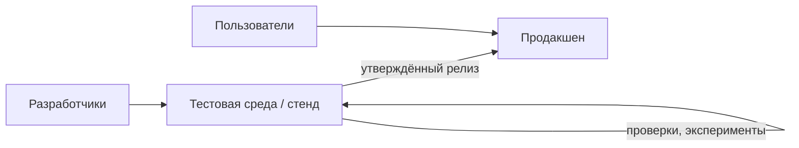
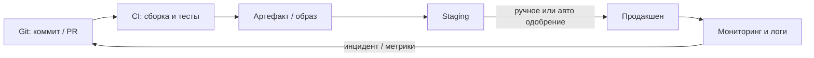

import ExternalPlayEmbed from '@site/src/components/ExternalPlayEmbed';


# Основы DevOps

<div class="article-tags">
  <span class="tag tag-required">ОБЯЗАТЕЛЬНО</span>
  <span class="tag tag-beginner">ДЛЯ НОВИЧКОВ</span>
</div>

<span class="complexity-badge">Разработчику</span>
<span class="complexity-badge">Архитектору</span>
<span class="complexity-badge">Инженеру</span>

DevOps в этой энциклопедии — про **как довести проверенную сборку до продакшена** без простоя и с откатом — тестовые стенды, CI/CD, инфраструктура как код, наблюдаемость. Если вы только пишете код в IDE и никогда не видели staging — начните здесь: без различия **тест** и **прод** остальные главы про Jenkins, Kubernetes и Terraform воспринимаются как чужой мир. Карта всего раздела — в [оглавлении](./intro.md).

**Куда идти дальше по разделу:** [CI/CD — принципы](./11.md) · [стратегии выката](./111.md) · [Git и GitFlow](./12.md) · [настройка конвейеров](./13.md) · [жизненный цикл пайплайна](./14.md) · [Azure Repos и TFS](./15.md) · [GitHub Actions — CI/CD рецепты](/lab/Примеры/1134). Смежно: [система контроля версий (Git)](/encyclopedia/2-system-network/2-03-set-i-internet/41), [контейнеризация](/encyclopedia/8-infra-security/8-06-konteynerizatsiya-i-orkestratsiya/intro), [основы ИБ](/encyclopedia/2-system-network/2-08-osnovy-informatsionnoy-bezopasnosti/intro).

---

## Тест и прод

<div class="callout callout--tip">
  <div class="callout-title">Правила неизбежности</div>

  <div class="callout-body">
  <div>- каждая система имеет свою архитектуру построения;</div>
  <div>- систему нужно разворачивать так, чтобы она выдержала требуемую нагрузку;</div>
  <div>- нужно понять, как обновлять систему, и исправлять ошибки;</div>
  <div>- рано или поздно придётся интегрировать систему с внешними ресурсами;</div>
  <div>- придётся обеспечить безопасность данных и доступа к системе;</div>
  <div>- система неизбежно будет расширяться;</div>
  <div>- будут ошибки, и нужна будет поддержка.</div>
</div>
  </div>

---

### Две среды и зачем их разделяют

Часто путают "прод", "тест" и "стенд". Смысл прост: нельзя размещать тестовые или непроверенные вариации приложения на рабочей среде, поэтому нужна "копия" рабочей среды для проверок и экспериментов. **Стенд** — это обычно именно такая копия — отдельный сервер или кластер, куда ставят сборку "как на проде", но без реальных пользователей и с тестовыми данными. **Тестовая среда** — более широкое понятие: любое окружение, где проверяют изменения до выката. **Продакшен (прод)** — среда, куда ходят клиенты. Поэтому разворачивается целая инфраструктура вроде такой:



Разбор:
- Диаграмма в нотации Mermaid `flowchart LR` — слева направо показывает поток от разработки к пользователям.
- Узел `dev[Разработчики]` — источник изменений — коммиты, сборки, эксперименты.
- Стрелка `dev --> test` — код и артефакты сначала попадают на тестовую среду или стенд, а не сразу в прод.
- Цикл `test -->|проверки, эксперименты| test` — на стенде можно многократно прогонять тесты, ломать данные и откатывать без риска для клиентов.
- Стрелка `test -->|утверждённый релиз| prod` — в прод идёт только версия, прошедшая проверки на тесте.
- Узел `prod[Продакшен]` — боевая среда; `users[Пользователи] --> prod` — конечные клиенты работают только с продом.

Здесь мы видим следующий порядок:

1. Создаётся **тестовая** среда, на которой развёртывается тестовая база данных и тестовая сборка приложения (часто её называют "стенд"). Сотрудникам компании, заказчиков или разработчиков предоставляется доступ к этой среде — часто даже полный — можно ломать данные, перезапускать сервисы, откатывать миграции без риска для бизнеса.
2. Создаётся **продакшен** (промышленная) среда с реальной базой данных (готовой "к бою") и только проверенной версией приложения. У команды разработки доступ к продакшену часто ограничен или отсутствует — чтобы случайный `DROP TABLE` или неверный конфиг не остановил сервис для всех пользователей.

Между ними часто добавляют **staging** (предпрод) — почти копию прода по конфигурации и версиям зависимостей, но с обезличенными данными. На staging прогоняют финальные проверки перед кнопкой "в прод". Подробнее про цепочку сред — в статье [CI/CD. Принципы](./11.md#среды-разработки-и-эксплуатации).

Смысл продакшен-среды в том, чтобы установить туда рабочую программу и "не трогать, пока работает". Доступ туда даётся лишь ограниченный, как для обычных пользователей. К примеру, открыв любой сайт, маркетплейс, или даже игру, вы как пользователь получаете доступ именно к проду, поэтому да, всё вокруг нас - продакшен. И представьте, вы подаёте заявку на кредит на сайте, и прямо в середине процесса у вас резко меняется цвет интерфейса, а введённые вами данные очистились. Неприятно? Не то слово.

Поэтому разработчики сначала разработают и протестируют все изменения на тестовой среде без вреда для юзеров, и лишь потом полноценно развернут новую систему на продакшене.

Классическое развёртывание на продакшене — остановить приложение, заменить файлы и конфигурацию, снова запустить новую версию. Но представьте, если работа онлайн-банка или маркетплейса по всему миру…остановится, для установки обновления? Это же смертельно для бизнеса!

Поэтому существует автоматический процесс поставки с теста на прод.



Разбор:
- `git[Git: коммит / PR]` — точка входа: push или merge request запускает автоматизацию.
- `ci[CI: сборка и тесты]` — пайплайн компилирует код, гоняет линтеры и тесты; при ошибке дальше не идут.
- `artifact[Артефакт / образ]` — неизменяемый результат сборки (Docker-образ, JAR) с привязкой к коммиту.
- `staging[Staging]` — предпрод: тот же артефакт проверяют в условиях, близких к проду.
- `staging -->|ручное или авто одобрение| prod` — gate перед продом: кнопка approve или политика auto-deploy.
- `monitor[Мониторинг и логи]` — метрики и алерты после выката; обратная связь `monitor --> git` замыкает цикл улучшений.

Здесь всё искусство администраторов и DevOps-инженеров как раз в том, чтобы аккуратно обновить продакшен без вреда бизнесу. Современные технологии и инструменты позволяют производить такую "поставку" автоматически — через [пайплайн](./14.md) и [стратегии выката](./111.md) (rolling, blue/green, canary). Отсюда и термин **CI/CD**.

<div class="callout callout--info">
  <div class="callout-title">Мини-глоссарий сред</div>

  <div class="callout-body">
  <p><strong>dev</strong> — локально или общий стенд для ежедневной разработки.</p>
  <p><strong>test / QA</strong> — автотесты и ручная проверка функций.</p>
  <p><strong>staging</strong> — "репетиция" прода перед релизом.</p>
  <p><strong>prod</strong> — боевая среда для конечных пользователей.</p>
</div>
  </div>

---

### Что такое DevOps?

**DevOps** и **CI/CD** — разные уровни одной цепочки. DevOps — культура и практики совместной работы разработки и эксплуатации; CI/CD — конкретные автоматизированные шаги (сборка, тесты, выкат). Путать их не страшно, но полезно разделять — можно "делать DevOps" без зрелого CI/CD, и наоборот — иметь зелёный пайплайн при токсичной передаче "мне без разницы, у меня локально работает".

Итак, мы спроектировали решение, определились с архитектурой и даже разработали его. Что дальше? Нужно установить и запустить на сервере. Тут вступает в силу **развёртывание** (деплой).

**Развёртывание** – процесс установки и запуска программного обеспечения на целевой среде (например, сервер). Оно бывает ручным и автоматическим. И если ручное – это классическая установка всех компонентов, зависимостей и программ, то автоматическое – более интересный и сложный процесс, который требует особой квалификации – DevOps.

**DevOps (от Разработка + Operations)** – культура, методология и набор практик, которые направлены на автоматизацию и ускорение процессов разработки и развертывания программного обеспечения путем улучшения взаимодействия между разработчиками (Dev) и ИТ-операциями (Ops).

Важно — это не сисадмины, не релиз-мастера, и не конкретный инструмент. Это подход, который затрагивает и меняет весь цикл разработки ПО – от написания кода до его работы в продакшене.

Цель — ускорить выпуск продукта без потери качества. Аналогия — автоматический конвейер на заводе вместо ручной сборки каждой детали: цели те же, эффект сопоставим. Важно запустить проект так, чтобы он **работал**, и чтобы этот запуск был **быстрым, безопасным и повторяемым**.

**Принципы DevOps** (каждый пункт — конкретная практика):

- **Автоматизация** — меньше ручных шагов при сборке, тестах, деплое и настройке серверов. Инфраструктура описывается кодом ([Terraform](./2.md), Ansible — в блоке `21x` раздела), изменения проходят через [Git](./12.md) и пайплайн. Ручной "залив по SSH" остаётся только там, где автоматизация ещё не дозрела.
- **Коллаборация** — разработчики, сисадмины, QA и техподдержка делят ответственность за путь кода до пользователя — общие стенды, понятные runbook'и, совместные постмортемы. Задача — убрать стену "разработчик бросил jar — админ разбирайся".
- **Непрерывность** — частые небольшие интеграции в общую ветку, автотесты на каждый push, регулярные выкаты на staging и контролируемый выход в прод, плюс [мониторинг](./11.md) и логи после релиза. Ошибки ловят рано, а не в пятницу на проде.

Возможно, многие сталкивались с традиционной для любой ячейки общества системы "перекладывания ответственности", появившейся из "разделения ответственности". Допустим, разработчик сделал четко, что требуется, закинул код, передал админам, а на любые замечания говорит — "Мне без разницы, вот, смотрите, у меня всё работает". Админы пытаются, настраивают всё вручную, но не получается – то ошибка в тоннах конфигураций серверов, то нет нужных зависимостей, то нагрузка намного выше, чем на тестовом стенде. Итог – бесконечное перекладывание вины, медленные релизы, падение продакшена и конечно же "выдёргивание" разработчика для решения проблемы.

На практике знаю – это колоссальный стресс, я сталкивался с этим и как пользователь, и как техподдержка, и как администратор, и как разработчик. Когда не обеспечена автоматизация или должным образом все принципы не соблюдены – цикл "релизного ада" будет постоянным.

DevOps меняет ситуацию — разработчик пишет код, достаточный для задачи, **и** отвечает на вопросы эксплуатации:

- Как код будет работать в продакшене (переменные окружения, секреты, лимиты памяти)?
- Как он масштабируется при росте нагрузки (горизонтально, кэш, очереди)?
- Как быстро откатить релиз, если метрики пошли в красную зону ([rollback](./11.md#otkat-rollback))?

**Ops** (операторы, администраторы, SRE) участвуют в планировании с самого начала — знают архитектуру приложения, помогают проектировать стенды и пайплайны, а не только "принимают архив по почте".

Также DevOps практикует ещё и встраивание тестировщиков в процесс с самого начала, когда тесты пишутся параллельно с кодом, что обеспечивает тестирование не в конце, а на каждом этапе, а также используется автоматическое тестирование.

Всё это, в совокупности обеспечивает то, что команда перестаёт бояться изменений, а развертывание продукта становится гибким и плавным.

---

### Основные понятия в DevOps

| Термин | Кратко | Подробнее |
|--------|--------|-----------|
| **Dev** | Разработка: код, тесты, ревью в Git | [Git в DevOps](./12.md) |
| **Ops** | Эксплуатация: среды, деплой, мониторинг, инциденты | [Сисадмин — раздел](/encyclopedia/2-system-network/2-06-sistemnoe-administrirovanie/intro) |
| **Pipeline** | Автоматизированная цепочка шагов от коммита до среды | [Жизненный цикл пайплайна](./14.md) |
| **Artifact** | Результат сборки (образ, JAR, пакет), один и тот же на всех стендах | Один образ с тегом `sha-abc123` едет на test → staging → prod |
| **Environment** | Изолированная среда (dev, test, staging, prod) | [Среды в CI/CD](./11.md#среды-разработки-и-эксплуатации) |
| **Deployment** | Установка артефакта в целевую среду | [Стратегии](./111.md) |

В DevOps рядом с CI/CD идут **петля обратной связи** и **пайплайн**.

**Пайплайн** (pipeline) — автоматизированный конвейер: берёт код из [Git](/encyclopedia/2-system-network/2-03-set-i-internet/41), прогоняет проверки и доставляет артефакт на нужный стенд. Упрощённая схема:

```
Git (push/PR) → Сборка → Автотесты → Деплой на test/staging → (ручные проверки) → Деплой на prod → Мониторинг
```

Разбор:
- `Git (push/PR)` — событие в репозитории (push в ветку или открытие pull request) стартует пайплайн.
- `Сборка` — из исходников получают артефакт с фиксированными зависимостями (lock-файлы, образ CI).
- `Автотесты` — unit, integration, при необходимости E2E; красный шаг блокирует продвижение дальше.
- `Деплой на test/staging` — тот же артефакт ставят на общий стенд для QA и интеграционных проверок.
- `(ручные проверки)` — опциональный человеческий gate (approve, smoke руками) перед продом.
- `Деплой на prod` — выкладка проверенной версии в боевую среду по [стратегии](./111.md).
- `Мониторинг` — логи, метрики, алерты; при деградации — откат или hotfix в Git.

На практике шагов больше — линтинг, скан секретов, сборка Docker-образа, публикация в registry, smoke-тесты после деплоя. Разбор по этапам — в [статье про жизненный цикл](./14.md); тонкая настройка gates и approvals — в [особенностях эксплуатации конвейеров](./13.md).

**CI/CD** (Continuous Integration / Continuous Delivery / Deployment) — три связанные практики:

- **Непрерывная интеграция (CI)** — частые коммиты и слияния в общую ветку; при каждом push запускаются сборка и автотесты, чтобы ошибки находили до релиза. "Сломали main" — видно за минуты, а не через неделю.
- **Непрерывная доставка (Continuous Delivery)** — артефакт после CI всегда **готов** к выкладке; выход в prod часто требует ручного approve (кнопка "в прод"), но без ручной "сборки на сервере по SSH".
- **Непрерывное развёртывание (Continuous Deployment)** — каждый прошедший проверки коммит **сам** попадает в prod. Подходит зрелым командам с сильными тестами и [canary](./111.md#canary-развертывание); для банков и медицины чаще оставляют ручной gate.

Минимальный фрагмент пайплайна (GitHub Actions), иллюстрирующий CI:

```yaml
name: ci
on: [push, pull_request]
jobs:
  build-and-test:
    runs-on: ubuntu-latest
    steps:
      - uses: actions/checkout@v4
      - run: npm ci && npm test && npm run build
```

Разбор:
- `name: ci` — имя workflow в интерфейсе GitHub Actions.
- `on: [push, pull_request]` — пайплайн запускается при push в репозиторий и при событиях pull request.
- `jobs.build-and-test` — одна job с именем `build-and-test`.
- `runs-on: ubuntu-latest` — job выполняется на свежем образе Ubuntu на hosted runner.
- `steps` — упорядоченный список шагов внутри job.
- `uses: actions/checkout@v4` — action клонирует репозиторий в рабочую директорию runner (аналог `git checkout`).
- `run — npm ci && npm test && npm run build` — в одной shell-команде — установка зависимостей по lock-файлу (`npm ci`), тесты, production-сборка; при ненулевом exit code job падает и merge можно заблокировать.

**Петля обратной связи** — замкнутый цикл — жалобы пользователей, логи, метрики и алерты с прода анализируются, задачи возвращаются в разработку, исправления снова проходят CI/CD. Без этого команда "летит вслепую" после релиза. Сюда входят централизованные логи, дашборды ([Практикум Prometheus и Grafana](/encyclopedia/2-system-network/2-06-sistemnoe-administrirovanie/prometheus-grafana-praktikum/intro), [PromQL — галерея](/lab/Примеры/11114), [Практикум Zabbix](/encyclopedia/2-system-network/2-06-sistemnoe-administrirovanie/zabbix-praktikum/intro), [логирование в DevOps](/encyclopedia/8-infra-security/8-04-devops-ci-cd/19)), тикеты в поддержку и постмортемы без поиска виноватых.

Ниже — интерактивная схема: как коммит запускает сборку и выкат (тот же смысл, что у [демо CI/CD](./11.md)):

<ExternalPlayEmbed example="project/cicd-demo" title="CI/CD пайплайн" />

{/* sidebar-collections */}

---

## В подборках

Статья входит в [тематические подборки](/about/collections) и блок "С чего начать?" на [главной](/). Соседние шаги того же маршрута:

**Соло / инди-разработчик** — [IDE](/tools/development/1), [Разработка — о разделе](/tools/development/intro), [Разработка игр — о разделе](/encyclopedia/9-spinoff/9-04-razrabotka-igr/intro), [HTML — о разделе](/encyclopedia/3-data-markup/3-09-html/intro), [Python — о разделе](/encyclopedia/5-languages/5-02-python/intro), [Основы работы с Git — о разделе](/encyclopedia/4-code-dev/4-13-osnovy-raboty-s-git/intro).

**DevOps и инфраструктура** — [Модели и сервисы облачных технологий](/encyclopedia/8-infra-security/8-01-oblachnye-tehnologii/1), [Терминал — о разделе](/encyclopedia/2-system-network/2-05-terminal/intro), [Платформы — о разделе](/encyclopedia/2-system-network/2-02-platformy/intro), [Системное администрирование — о разделе](/encyclopedia/2-system-network/2-06-sistemnoe-administrirovanie/intro), [Архитектура персонального компьютера](/encyclopedia/1-basics/1-08-kak-rabotaet-kompyuter/7), [Основы информационной безопасности — о разделе](/encyclopedia/2-system-network/2-08-osnovy-informatsionnoy-bezopasnosti/intro).

{/* /sidebar-collections */}

---
