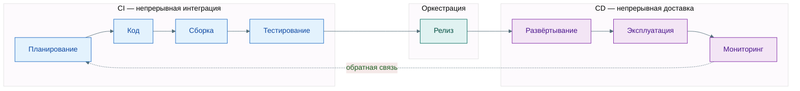

import ExternalCodeEmbed from '@site/src/components/ExternalCodeEmbed';

import ExternalPlayEmbed from '@site/src/components/ExternalPlayEmbed';

# Жизненный цикл пайплайна CI/CD

  ОБЯЗАТЕЛЬНО
  ДЛЯ НОВИЧКОВ

Разработчику
Архитектору
Инженеру

Отдельный коммит в Git — только начало. **Пайплайн** проводит изменение через планирование, код, сборку, тесты, релиз, выкат, эксплуатацию и мониторинг. Всё, что можно автоматизировать после push в GitHub или GitLab, обычно сводят к одной цепочке job: от `npm ci` / `gradle build` до выката Docker-образа в Kubernetes, облачную функцию (AWS Lambda) или статику на Pages.

**Читать вместе с:** [принципы CI/CD](./11.md) · [gates и безопасность](./13.md) · [стратегии деплоя](./111.md) · [Git как триггер](./12.md) · [стек инструментов](./16.md).

<ExternalPlayEmbed example="infra-security/pipeline-lifecycle-play" title="Жизненный цикл пайплайна" minHeight={480} />

---

## Карта пайплайна CI/CD

Современная поставка ПО — **замкнутый цикл DevOps**: метрики и инциденты с прода снова попадают в бэклог, а каждый релиз опирается на тот же воспроизводимый артефакт. На схемах его часто рисуют как "восьмёрку" — слева **CI** (интеграция и проверка кода), справа **CD** (доставка и эксплуатация). В центре — **релиз**: момент, когда артефакт получает версию и право ехать на стенды.

Разбор:
- **CI** начинается с фиксации кода в репозитории: сборка и тесты в чистом окружении runner'а, без опоры на "у меня на ноутбуке собралось".
- **Релиз** — граница — SemVer, тег Git, образ в registry; дальше в прод едет **тот же** бинарник или образ, без пересборки на сервере.
- **CD** — выкат (Docker, Helm, serverless), удержание desired state (Kubernetes, Terraform) и наблюдаемость (Prometheus, Datadog).
- Пунктир **мониторинг → планирование** — алерты, error budget и постмортемы порождают новые задачи в Jira или аналоге.

### Этапы и типичные инструменты

Инструменты в таблице — **примеры класса**, а не единственный выбор. Один Jenkins, GitHub Actions или GitLab CI часто закрывает сразу сборку, тесты и деплой; Terraform поднимает кластер, а Argo CD или Flux катят в него образы.

| Этап | Фаза | Что происходит | Примеры инструментов |
|------|------|----------------|----------------------|
| Планирование | до CI | Требования, ADR, спринт, критерии приёмки | Jira, Azure DevOps Boards, Confluence, Notion |
| Код | до CI | Ветки, PR, ревью, локальный lint | GitHub, GitLab, Bitbucket |
| Сборка | CI | Компиляция, bundle, Docker-образ, lock-файлы | Gradle, Maven, MSBuild, Webpack, Vite, Bazel |
| Тестирование | CI | Unit, integration, E2E, SAST, coverage | Jest, JUnit, pytest, Playwright, Cypress, SonarQube |
| Релиз | CI → CD | Версия, changelog, push в registry | Jenkins, GitHub Actions, GitLab CI, Buildkite, CircleCI |
| Развёртывание | CD | Staging/prod, миграции БД, smoke | Docker, Argo CD, Flux, Helm, AWS Lambda, GitHub Pages |
| Эксплуатация | CD | Масштаб, HA, rolling update, IaC | Kubernetes, Terraform, Ansible, Nomad |
| Мониторинг | CD | Метрики, логи, трейсы, алерты | [Практикум Prometheus и Grafana](/encyclopedia/2-system-network/2-06-sistemnoe-administrirovanie/prometheus-grafana-praktikum/intro), [PromQL — галерея](/lab/Примеры/11114), [Практикум Zabbix](/encyclopedia/2-system-network/2-06-sistemnoe-administrirovanie/zabbix-praktikum/intro), Prometheus, Grafana, Datadog, ELK, OpenTelemetry |

Сквозной пример для статического сайта (push → `npm run build` → gh-pages) — в [принципах CI/CD](./11.md#живой-пример--пайплайн-вселенной-it) (раздел "Живой пример — пайплайн „Вселенной IT“"). Для контейнерного сервиса цепочка `docker build` → registry → `helm upgrade` разобрана в [шпаргалке по Docker и Kubernetes](/encyclopedia/8-infra-security/8-06-konteynerizatsiya-i-orkestratsiya/118#разбор-cicd-конвейера-по-шагам).

---

## Жизненный цикл пайплайна CI/CD

### Как работает пайплайн?

> **Пайплайн** — упорядоченная цепочка job и stage — у каждого шага есть вход (код, артефакт), выход (образ, отчёт) и условие "можно ли идти дальше" (gate).

**CI/CD** автоматизирует путь от кода до продакшена — интеграция, тесты, упаковка, выкат и обратная связь. **Цель** — предсказуемые релизы — меньше ручных ошибок, один и тот же артефакт на всех стендах, быстрый откат.

Две фазы:

- **CI** — от push до "артефакт собран и протестирован" ([детали](./11.md#ci-непрерывная-интеграция)).
- **CD** — от "артефакт готов" до работающего сервиса в prod и мониторинга ([Delivery vs Deployment](./11.md#cd-непрерывная-доставка-и-непрерывное-развёртывание)).

**Delivery** часто ждёт ручного approve перед продом; **Deployment** выкатывает автоматически. В тексте ниже **CD** используется в широком смысле; на практике уточняйте, есть ли у вас кнопка "в прод".

**Восемь этапов** (первые два — до автоматического CI, но без них пайплайн бессмысленен):
1. Планирование;
2. Разработка;
3. Сборка;
4. Тестирование;
5. Релиз;
6. Развёртывание;
7. Управление развёртыванием;
8. Мониторинг.

Хотя планирование и разработка логически предшествуют CI, они не являются частью автоматизированного пайплайна и относятся к процессам подготовки. CI начинается с момента фиксации кода в репозитории и запуска автоматических задач. CD — с момента, когда артефакт считается релизным и начинает движение к продакшену.

| Этап | Вход | Выход | Gate (блокировка при сбое) |
|------|------|-------|----------------------------|
| Сборка | Исходный код, lock-файлы | Артефакт (образ, пакет) | Неуспешная компиляция / упаковка |
| Тестирование | Артефакт + тестовые данные | Отчёт, coverage | Падающие unit/integration/E2E |
| Релиз | Артефакт + changelog | Версия в registry, тег Git | Несоответствие политике версий |
| Развёртывание | Версионированный артефакт | Работающий сервис в среде | Health check, smoke после деплоя |
| Мониторинг | Трафик, логи, метрики | Алерты, тикеты | SLO/ошибки выше порога → откат |

---

### Планирование (Planning)

Этот этап является начальной стадией жизненного цикла разработки и служит основой для всех последующих операций. На данном этапе формируются требования к функциональности, определяется архитектура решения, распределяются задачи между командами, устанавливаются критерии приемки и выбирается технологический стек.

Планирование включает:

- **User stories и требования** — что должно измениться для пользователя и бизнеса; без этого CI автоматизирует неизвестное.
- **Архитектура и ADR** — как изменение встроится в [микросервисы](/encyclopedia/8-infra-security/8-05-mikroservisy-i-integratsiya/intro) или монолит; влияет на тесты и деплой.
- **Оценка и спринт** — кто делает, когда merge в `main`, нужен ли feature flag ([стратегии](./111.md#feature-toggles)).
- **Стандарты** — code style, политика веток ([Git Flow](./12.md)), переменные окружения, чек-лист релиза.

Инструменты — Jira, Azure DevOps Boards, YouTrack, Trello, Confluence, Notion.

Планирование связывает бизнес-цели с технической реализацией. Неопределённый scope — главный враг автоматизации.

---

### Разработка (Development)

На этапе разработки инженеры реализуют функциональные требования, пишут код в соответствии с принятыми стандартами и архитектурными паттернами. Код разрабатывается в изолированных ветках (feature branches), что позволяет избежать конфликтов и обеспечивает возможность параллельной работы нескольких разработчиков.

Ключевые действия:
	- Написание кода с соблюдением принципов SOLID, DRY и других парадигм;
	- Реализация unit- и integration-тестов на этапе разработки;
	- Фиксация изменений в системе контроля версий с соблюдением семантического коммит-менеджмента;
	- Выполнение локальных проверок кода (linting, форматирование).

Инструменты — GitLab, GitHub, Bitbucket, Azure Repos.

Важно отметить, что мы не говорим о том, что разработчики ещё должны, собственно, разрабатывать продукт - для этого используются, очевидно, инструменты разработки и отладки - IDE (VS, IDEA), клиенты Git (CLI, TortoiseGit, GitHub Desktop, Fork), различные редакторы, СУБД (PostgreSQL, MS SQL), утилиты, прикладное и инженерное ПО - всё, что нужно для написания кода или создания приложений.

В контексте CI/CD не так важна первая реализация программы. Здесь фокус будет именно на изменениях, то есть это вторая, третья и дальнейшие итерации, когда базовая программа/модуль уже созданы, и происходит развитие продукта и изменение кода.

Разработка — источник изменений. Эффективность всей CI/CD-цепочки зависит от качества и регулярности коммитов в Git. Выбор **git-flow**, **GitHub Flow** или **trunk-based development** определяет стратегию интеграции, поэтому ошибка на предыдущем этапе с выбором модели ветвления здесь уже будет непростительной.

---

### Сборка (Build)

Сборка — процесс преобразования исходного кода в исполняемую или деплоебельную форму. Это критически важный этап, поскольку именно здесь происходит компиляция, упаковка, разрешение зависимостей и генерация артефактов, которые будут использоваться на всех последующих стадиях.
Мы не говорим о сборке на рабочем месте разработчика, нет - абсолютно не важна успешность компиляции на его компьютере, главное - чтобы сборка была успешной именно в рабочей целевой среде. Поэтому должно быть несколько сред - как минимум одна идентичная промышленной.

К примеру, мы хотим создать веб-приложение. Первая реализация содержит в себе самые базовые функции, успешно разворачивается и работает на главном сервере. И для изменения нужно создать идентичную среду на другом сервере (а в идеале - иметь несколько серверов, с хотя бы одним промежуточным), где и будет проверяться то, что изменили разработчики.

Типовые действия:
	- Компиляция исходного кода (в случае языков со статической типизацией);
	- Упаковка в контейнеры, JAR, WAR, MSI, DEB, RPM и другие форматы;
	- Резолвинг зависимостей через менеджеры пакетов;
	- Генерация карт зависимостей и метаданных для трассировки.

Инструменты поэтому тут соответствуют языкам и технологиям:
	- Java/Kotlin/Scala: Maven, Gradle
	- .NET — MSBuild, dotnet CLI, Cake
	- Python — pip, poetry, setuptools
	- JavaScript/TypeScript — Webpack, Vite, esbuild, npm/yarn
	- Go: go build, mod
	- PHP: Composer
	- C/C++ — CMake, Bazel, Ninja
	- Universal: Bazel, Pants (для многоязычных репозиториев)

Сборка обеспечивает воспроизводимость. Если сборка не проходит — дальнейшие этапы не имеют смысла. Артефакт, созданный на этом этапе, становится единственным источником правды (single source of truth) для всех последующих стадий.

Важно учитывать, что сборка может быть именно что автоматической, а от администраторов требуется лишь подтверждать действия, чтобы ускорить развёртывание.

---

### Тестирование (Testing)

Тестирование — система автоматизированных проверок, направленных на выявление дефектов на разных уровнях абстракции. Цель — обеспечить, что каждый коммит не нарушает существующую функциональность и соответствует заявленным требованиям.

Различают следующие уровни тестирования:
	- Unit-тесты — проверяют отдельные модули или функции (например, метод класса).
	- Интеграционные тесты — проверяют взаимодействие между компонентами (база данных, API, внешние сервисы).
	- End-to-end (E2E) — имитируют поведение пользователя в полноценной среде.
	- Статический анализ кода — проверка на соответствие стандартам, наличие уязвимостей, дублирования и сложности.
	- Тестирование производительности и безопасности — нагрузочные тесты, SAST/DAST сканеры.

Соответственно, инструменты тоже зависят от вида тестирования:
	- Unit: JUnit (Java), NUnit (.NET), pytest (Python), Jest (JS), GoTest (Go)
	- Integration/E2E — Playwright, Selenium, Cypress, TestNG
	- SAST/DAST — SonarQube, Checkmarx, OWASP ZAP, Snyk
	- Coverage — JaCoCo, Istanbul, Coverage.py

Смысл данного этапа как раз в том, что в команде разработки выделяются специальные сотрудники - QA-инженеры, тестировщики, которые проверяют то, что "налепили" разработчики, и задача тут - найти проблемы. Поэтому на тестовом сервере часто для симуляции сценарии дают "карт-бланш" со всеми задачами, порой формулируемых как "попробуй сломать".

Ручное тестирование требует человеческих затрат и большого количества времени, но автотесты должны быть всегда, чтобы от администраторов требовалось лишь нажать кнопку, и проверка прошла автоматически. Автоматически тестировать можно типовые ошибки, наборы данных, интеграции, доступа, валидации, обязательность, редактируемость и прочие простые вещи. Вручную проверять надо сложные многоэтапные сценарии работы, допустим когда нужно симулировать действия пользователя в определённой ситуации. Но и тут профессионалы автоматизации скажут, что можно обойтись "без рук".

Тестирование — механизм обратной связи. Автоматизированные тесты являются гарантом стабильности системы. Не прошедшие тесты блокируют продвижение артефакта дальше по пайплайну (gatekeeping).

---

### Релиз (Release)

Релиз — это формальное создание версии продукта, готовой к распространению. На этом этапе артефакт, прошедший все этапы CI, маркируется версией (SemVer), сохраняется в репозиторий артефактов и сопровождается метаданными — хэш коммита, автор, дата, список изменений, ссылки на задачи.

Ключевые действия:
	- Присвоение версии (v1.2.3-beta.4);
	- Создание release-ветки или тега в репозитории;
	- Упаковка changelog, документации, лицензий;
	- Загрузка артефакта в централизованное хранилище (Artifact Repository).

Инструменты оркестрации релиза — Jenkins, GitLab CI/CD, GitHub Actions, Buildkite, CircleCI, Azure Pipelines. Они связывают CI (сборка и тесты) с CD (деплой): один и тот же файл `.gitlab-ci.yml`, workflow или Jenkinsfile описывает стадии от `build` до `deploy`.

Релиз — точка невозврата. После этого этапа артефакт считается потенциально релизным. Он может быть задержан для ручного одобрения (Continuous Delivery) или сразу отправлен на деплой (Continuous Deployment).

---

### Развёртывание (Deployment)

Развёртывание — процесс помещения артефакта в целевую среду (staging, canary, production). Этот этап отличается от сборки тем, что он связан с применением артефакта к работающей системе, а не с его созданием.

Действия включают:
	- Копирование артефакта на целевые серверы или в контейнерный реестр;
	- Подготовка конфигураций (config maps, secrets);
	- Запуск контейнеров, сервисов, функций;
	- Применение миграций БД (если требуется).

Инструменты:
	- Контейнеризация: Docker, Podman — образ как единица поставки
	- GitOps и CD — Argo CD, Flux, Spinnaker — синхронизация кластера с манифестами в Git
	- Serverless — AWS Lambda, Google Cloud Functions, Azure Functions
	- Статика и edge — GitHub Pages, Netlify, Cloudflare Pages (как в [кейсе Pages](/lab/Кейсы/3); шаблоны workflow — [CI/CD рецепты](/lab/Примеры/1134))
	- IaC перед первым деплоем — Terraform, Pulumi — сеть, кластер, IAM ([обзор IaC](./2.md))

Развёртывание — переход от состояния "код написан" к состоянию "код работает". Качество этого этапа определяется воспроизводимостью и повторяемостью — один и тот же артефакт должен разворачиваться одинаково в dev, staging и prod.

---

### Управление развёртыванием (Orchestration)

Этот этап отвечает за управление жизненным циклом инфраструктуры и сервисов, обеспечивающих работу приложения. Он включает автоматизированное управление масштабированием, обновлением, отказоустойчивостью и конфигурацией сред.

Ключевые задачи:
	- Управление кластерами контейнеров (оркестрация);
	- Автоматическое масштабирование по нагрузке;
	- Обеспечение высокой доступности (HA) и rolling updates;
	- Управление секретами, сетевыми политиками, RBAC;
	- Инфраструктура как код (IaC): декларативное описание окружения.

Инструменты:
	- Оркестрация — Kubernetes, Docker Swarm, Nomad
	- IaC — Terraform, Pulumi, AWS CloudFormation, Ansible
	- Управление конфигурацией — Helm, Kustomize, Crossplane

Без оркестрации развертывание становится хаотичным. Этот этап гарантирует, что инфраструктура соответствует описанному состоянию (desired state) и способна адаптироваться к изменениям без ручного вмешательства.

---

### Мониторинг и обратная связь (Monitoring)

Мониторинг — это сбор, агрегация и анализ метрик, логов и трейсов для оценки работоспособности системы в реальном времени. Он замыкает цикл CI/CD, предоставляя данные для принятия решений о качестве релиза и необходимости отката.

Ключевые направления:
	- Метрики — CPU, память, latency, throughput, error rate (Prometheus, Grafana);
	- Логи — централизованный сбор и поиск (ELK Stack, Loki, Splunk);
	- Трассировка: distributed tracing (Jaeger, OpenTelemetry);
	- Алертинг: автоматическое оповещение о девиациях (Alertmanager, PagerDuty);
	- Анализ причин отказов: root cause analysis на основе событий.

Инструменты — [Практикум Prometheus и Grafana](/encyclopedia/2-system-network/2-06-sistemnoe-administrirovanie/prometheus-grafana-praktikum/intro), [PromQL — галерея](/lab/Примеры/11114), [Практикум Zabbix](/encyclopedia/2-system-network/2-06-sistemnoe-administrirovanie/zabbix-praktikum/intro), Prometheus, Grafana, Datadog, New Relic, ELK, Sentry, OpenTelemetry.

Мониторинг — источник эмпирических данных. Он позволяет переходить от реактивного к проактивному управлению качеством. Если тесты говорят "код работает", то мониторинг говорит "система работает". Именно здесь рождаются новые требования и улучшения для следующего цикла.

---

### Сквозной пример пайплайна (GitLab CI)

Упрощённый конвейер для сервиса на Node.js — один артефакт `dist/`, тесты блокируют деплой, prod — только с `main` и вручную:

<ExternalCodeEmbed example="yaml/infra-security-8-8-04-devops-ci-cd-14-001" title="Сквозной пример пайплайна (GitLab CI)" minHeight={720} />

Разбор:
- `stages — [build, test, release, deploy]` — четыре последовательные стадии конвейера GitLab CI; job одной стадии ждут завершения предыдущей (если не задан `needs`).
- `variables.NODE_VERSION: "20"` — глобальная переменная; подставляется в `image: node:$&#123;NODE_VERSION&#125;`.
- Job `build` — образ Node, `npm ci` ставит зависимости строго по lock-файлу, `npm run build` создаёт `dist/`; `artifacts.paths: [dist/]` сохраняет папку для следующих job.
- Job `test`: `needs: [build]` — стартует после build и может скачать артефакты; `npm test -- --coverage` гоняет тесты с отчётом покрытия.
- Job `release`: `needs: [test]`; `rules: - if: $CI_COMMIT_TAG` — публикация в registry только при push тега (релиз SemVer).
- Job `deploy_prod`: `environment: production` — фиксирует деплой в GitLab Environments; `rules` с `CI_COMMIT_BRANCH == "main"` и `when: manual` — на main только по ручной кнопке (Continuous Delivery, не auto-deploy в прод).
- `./deploy.sh` — скрипт выката (kubectl, helm, ssh) вынесен из YAML в исполняемый файл репозитория.

**Антипаттерны**

- Деплой с ноутбука в обход пайплайна ("быстрее так" — до первого инцидента).
- Зелёный job без реальных тестов или с `exit 0` вместо `npm test`.
- Разные lock-файлы на CI и prod (разные версии пакетов).
- Пересборка на каждом стенде вместо одного immutable-артефакта ([принцип CD](./11.md#как-организовать-cd)).

  
Следующие шаги

  

  
Настройка gates, секретов и IaC — <a href="./13.md">особенности эксплуатации конвейеров</a>.

  
Безопасный выкат — <a href="./111.md">стратегии развертывания</a>.

  

---
