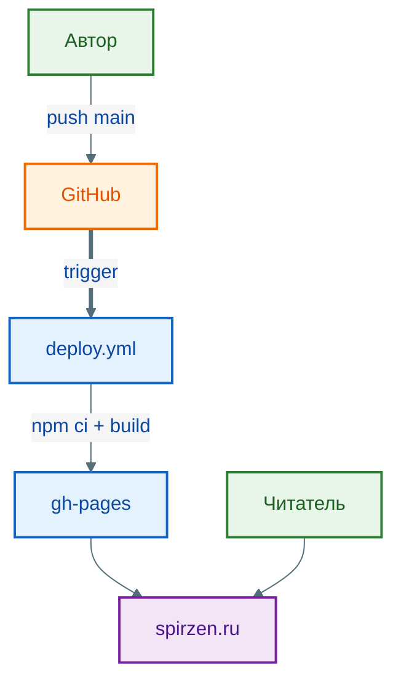
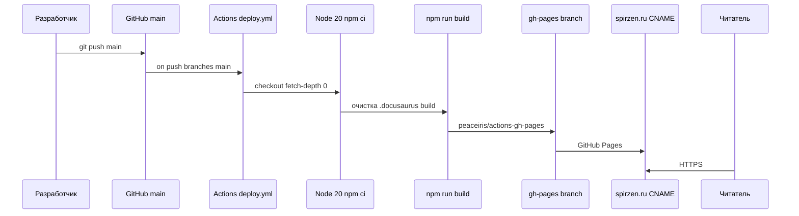
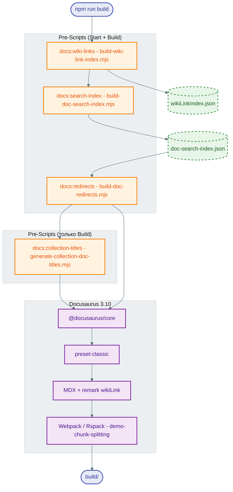

import GitHubActionsWorkflowPlay from '@site/src/components/GitHubActionsWorkflowPlay.jsx';

# GitHub Actions

<div class="article-tags">
  <span class="tag tag-required">ОБЯЗАТЕЛЬНО</span>
  <span class="tag tag-beginner">ДЛЯ НОВИЧКОВ</span>
</div>

<span class="complexity-badge">Разработчику</span>
<span class="complexity-badge">Архитектору</span>
<span class="complexity-badge">Инженеру</span>

<GitHubActionsWorkflowPlay />

---

## GitHub Actions

Вы отправили pull request — и через минуту в интерфейсе GitHub уже зелёная галочка или красный крест: тесты прошли, линтер доволен, образ собран. **GitHub Actions** как раз и есть движок за этими проверками: YAML-файл в `.github/workflows/` описывает, *что* запускать при push, PR или по расписанию, а GitHub поднимает временную виртуальную машину (runner), выполняет шаги и пишет лог.

<div class="callout callout--info">
  <div class="callout-title">Смежные материалы</div>

  <div class="callout-body">
  Общий контекст CI/CD — [Основы DevOps](/encyclopedia/8-infra-security/8-04-devops-ci-cd/1.md) и [стек инструментов](/encyclopedia/8-infra-security/8-04-devops-ci-cd/16.md).

  Секреты и доступ runner к облаку — [аутентификация в CI/CD](/encyclopedia/8-infra-security/8-04-devops-ci-cd/211.md).

  Альтернатива на GitLab — статьи раздела про GitLab CI в [оглавлении](/encyclopedia/8-infra-security/8-04-devops-ci-cd/intro).

  Готовые workflow с построчным разбором — [GitHub Actions — CI/CD рецепты](/lab/Примеры/1134) (формат как у [галереи curl / fetch](/lab/Примеры/1133)).
</div>
  </div>


**GitHub Actions** — это встроенная в платформу GitHub система непрерывной интеграции и непрерывной доставки (CI/CD). Система позволяет автоматизировать рабочие процессы разработки программного обеспечения, тестирования и развёртывания приложений без необходимости использования внешних серверов или сторонних сервисов.

Платформа работает на основе событий, которые происходят в репозитории. Эти события запускают заранее определенные последовательности шагов, называемые рабочими процессами. Рабочие процессы выполняются на виртуальных машинах, предоставляемых GitHub, что исключает необходимость администрирования инфраструктуры для каждой задачи.

Система поддерживает выполнение задач в облаке, на локальных машинах через самоходные агенты, а также интеграцию с внешними инструментами. Гибкость платформы позволяет использовать её для сборки проектов, проверки кода, деплоя на серверы, публикации статических сайтов и управления артефактами.

### Живой пример — `deploy.yml` этого сайта

Workflow [it-knowledge-base](https://github.com/Spirzen/it-knowledge-base/blob/main/.github/workflows/deploy.yml):

- **Триггер** — `push` в ветку `main`.
- **Runner** — `ubuntu-latest`.
- **Шаги** — checkout, `setup-node` (20), `npm ci`, `npm run build`, публикация `./build` через `peaceiris/actions-gh-pages` в `gh-pages`.

```yaml
on:
  push:
    branches: [main]
# ...
      - run: npm ci
      - run: npm run build
      - uses: peaceiris/actions-gh-pages@v4
        with:
          publish_dir: ./build
          publish_branch: gh-pages
```

Схема всего контура (репозиторий → Actions → Pages → spirzen.ru) — [О проекте → архитектура](/about/project#arhitektura-proekta).



Что выполняет `npm run build` на runner — [пайплайн сборки](/about/project#it-universe-build-mermaid).

Последовательность шагов от push до HTTPS у читателя:



Состав шага `npm run build` на runner:




---

### История развития технологии

Технология автоматизации в экосистеме GitHub прошла путь от простых скриптов до полноценной платформы оркестрации. Изначально разработчики использовали сторонние решения, такие как Jenkins, Travis CI или CircleCI, для выполнения задач после каждого коммита. Это требовало настройки внешних серверов, поддержки их работоспособности и синхронизации данных между платформой хостинга и системой сборки.

Внедрение собственной системы позволило объединить хранение кода и процессы его обработки в едином пространстве. Платформа стала доступна для всех пользователей репозиториев, включая личные проекты и открытые библиотеки. Возможность использования готовых действий (Actions) упростила создание сложных пайплайнов без написания большого количества кода.

Современная версия системы предоставляет доступ к тысячам предварительно созданных компонентов, которые можно комбинировать для решения практически любых задач. Поддержка контейнеров Docker, возможность работы с разными операционными системами и языками программирования делают инструмент универсальным решением для индустрии.

---

### Архитектура системы

Работа системы базируется на взаимодействии нескольких ключевых компонентов:

- событий;
- рабочих процессов;
- действий;
- агентов.

| Компонент | Описание | Роль в системе |
|-----------|----------|----------------|
| Событие | Триггер, запускающий рабочий процесс | Определяет момент начала выполнения (push, pull request, cron) |
| Рабочий процесс | Файл конфигурации в формате YAML | Описывает последовательность шагов и условия их выполнения |
| Действие | Атомарная единица работы | Выполняет конкретную задачу (установка зависимостей, запуск теста) |
| Агент | Виртуальная машина или контейнер | Обеспечивает среду для выполнения действий |
| Хранилище секретов | Безопасное место для хранения паролей и ключей | Защищает конфиденциальные данные от раскрытия |

Рабочие процессы хранятся в директории `.github/workflows` внутри репозитория. Каждый файл содержит описание одного или нескольких пайплайнов. При изменении файла система автоматически проверяет его корректность и применяет изменения.

Агенты могут быть управляемыми GitHub или настроенными пользователем самостоятельно. Управляемые агенты предоставляют готовые образы с популярными языками и инструментами. Самоходные агенты позволяют выполнять задачи на собственных серверах, что полезно для специфических требований безопасности или производительности.

---

### Структура рабочего процесса

Файл рабочего процесса имеет расширение `.yml` или `.yaml`. Он состоит из секций, каждая из которых отвечает за определенную часть логики выполнения.

```yaml
name: Сборка и тестирование проекта

on:
  push:
    branches: [ main ]
  pull_request:
    branches: [ main ]

jobs:
  build-and-test:
    runs-on: ubuntu-latest
    steps:
      - name: Проверка кода
        uses: actions/checkout@v4
      
      - name: Установка Node.js
        uses: actions/setup-node@v4
        with:
          node-version: '20'
      
      - name: Установка зависимостей
        run: npm ci
      
      - name: Запуск тестов
        run: npm test
      
      - name: Создание артефакта
        uses: actions/upload-artifact@v4
        with:
          name: result
          path: ./build
```

Секция `name` задает имя рабочего процесса, которое отображается в интерфейсе GitHub. Оно помогает идентифицировать задачу среди других запущенных процессов.

Секция `on` определяет триггеры, при срабатывании которых запускается пайплайн. Возможные значения включают события веток, теги, время по расписанию (cron), вебхуки и ручное инициирование.

Секция `jobs` содержит список задач, которые необходимо выполнить. Каждая задача выполняется на отдельном агенте и может зависеть от других задач.

Секция `steps` описывает последовательность действий внутри задачи. Шаги могут быть вызовами действий или выполнением команд в терминале.

---

### Типы событий и триггеры

События служат точкой входа для автоматизации. Они определяют, когда именно должен запускаться рабочий процесс.

| Событие | Описание | Пример использования |
|---------|----------|----------------------|
| push | Коммит в репозиторий | Автоматическая сборка после обновления кода |
| pull_request | Создание или обновление пулл-реквеста | Проверка качества кода перед слиянием |
| release | Создание релиза | Публикация новой версии приложения |
| schedule | Расписание по Cron | Ежедневный запуск фоновых задач |
| workflow_dispatch | Ручной запуск | Инициация сборки по требованию пользователя |
| watch | Наблюдение за активностью | Отслеживание изменений в проекте |
| issues | Изменение задач | Реакция на новые баг-репорты |
| discussion | Изменение обсуждений | Автоматизация модерации контента |

Событие `push` активируется при отправке коммитов в указанные ветки. Можно указать конкретные пути к файлам, чтобы запускать процесс только при изменении определенных директорий.

Событие `pull_request` критично для контроля качества. Оно позволяет запускать линтеры, тесты и проверку безопасности перед тем, как код попадет в основную ветку.

Событие `schedule` использует **пятизначный cron** (минута, час, день месяца, месяц, день недели) — тот же формат, что в Linux. Время — **UTC** на серверах GitHub; для локального часового пояса сдвигайте поля вручную.

```yaml
on:
  schedule:
    - cron: '0 0 * * *'    # каждый день в 00:00 UTC
    - cron: '*/15 * * * *' # каждые 15 минут
```

| Выражение | Расписание |
|-----------|------------|
| `0 0 * * *` | Ежедневно в полночь (UTC) |
| `*/5 * * * *` | Каждые 5 минут |
| `0 */6 * * *` | Каждые 6 часов |
| `0 9 * * 1-5` | В 09:00 по будням |

Шпаргалка по полям, операторам `*` `,` `-` `/` и алиасам на сервере — [Планирование и автоматизация задач](/encyclopedia/2-system-network/2-06-sistemnoe-administrirovanie/8). В YAML Actions алиасы `@daily` не поддерживаются, только пять полей в кавычках.

---

### Управление агентами и окружением

Агент представляет собой виртуальную машину, на которой выполняются шаги рабочего процесса. GitHub предоставляет несколько типов образов, оптимизированных под разные задачи.

| Образ | Описание | Особенности |
|-------|----------|-------------|
| ubuntu-latest | Актуальная версия Ubuntu | Подходит для большинства задач |
| windows-latest | Последняя версия Windows Server | Требует для .NET и C++ проектов |
| macos-latest | macOS на базе Apple Silicon | Необходим для сборки iOS/macOS приложений |
| self-hosted | Пользовательский сервер | Полный контроль над средой и безопасностью |

Каждый образ содержит предустановленные инструменты, такие как компиляторы, интерпретаторы и системные утилиты. Это избавляет от необходимости устанавливать базовое ПО вручную.

Параметр `runs-on` указывает, какой агент использовать для задачи. Если требуется специфическая версия ОС или архитектуры, можно указать дополнительные параметры, например `ubuntu-22.04`.

Самоходные агенты устанавливаются на собственные серверы и регистрируются в репозитории. Они позволяют выполнять задачи, требующие доступа к внутренним сетям или специализированному оборудованию.

---

### Действия и их использование

Действия являются строительными блоками рабочих процессов. Они представляют собой готовые скрипты или контейнеры, выполняющие конкретные функции.

Действия делятся на две категории: официальные действия от GitHub и действия сообщества. Официальные действия поддерживаются напрямую командой платформы и проходят тщательную проверку. Действия сообщества создаются разработчиками и доступны в каталоге GitHub Marketplace.

Пример использования официального действия:
```yaml
- uses: actions/checkout@v4
```
Этот шаг загружает исходный код репозитория в рабочую директорию агента. Параметр `v4` указывает версию действия, которую следует использовать.

Пример использования действия сообщества:
```yaml
- uses: actions/setup-python@v5
  with:
    python-version: '3.11'
```
Это действие устанавливает указанную версию Python на агент. Параметр `with` передает дополнительные настройки в действие.

Действия могут принимать входные параметры, определять выходные значения и выполнять предобработку перед стартом. Они обеспечивают модульность и переиспользование кода между различными проектами.

---

### Переменные и контексты

Контексты предоставляют доступ к данным о текущем выполнении рабочего процесса. Они позволяют динамически формировать команды и условия.

| Контекст | Описание | Пример использования |
|----------|----------|----------------------|
| github | Информация о репозитории и событии | `&#36;&#123;&#123; github.ref &#125;&#125;` |
| secrets | Защищенные секреты | `&#36;&#123;&#123; secrets.API_KEY &#125;&#125;` |
| env | Переменные окружения | `&#36;&#123;&#123; env.MY_VAR &#125;&#125;` |
| job | Данные текущей задачи | `&#36;&#123;&#123; job.status &#125;&#125;` |
| steps | Результаты предыдущих шагов | `&#36;&#123;&#123; steps.build.outputs.version &#125;&#125;` |
| runner | Параметры агента | `&#36;&#123;&#123; runner.os &#125;&#125;` |

Переменная `github.ref` содержит ссылку на ветку или тег, который вызвал событие. Она полезна для создания имен артефактов или версий.

Секрет `secrets.API_KEY` скрывает чувствительные данные от логирования и просмотра в интерфейсе. Значения секретов не отображаются в логах выполнения.

Переменные окружения `env` задаются глобально для всего рабочего процесса или локально для конкретного шага. Они удобны для передачи констант, таких как пути или флаги.

---

### Условия выполнения и логика

Условия определяют, какие шаги должны выполняться в зависимости от текущего состояния. Они используют выражения, которые возвращают значение `true` или `false`.

```yaml
- name: Деплой только на главную ветку
  if: github.ref == 'refs/heads/main'
  run: echo "Deploying to production"
```
Шаг выполняется только если имя ветки равно `main`. Для остальных веток он пропускается.

```yaml
- name: Пропуск тестов при документальных изменениях
  if: contains(github.event.head_commit.message, '[skip tests]')
  run: echo "Tests skipped"
```
Логика проверяет наличие специальной метки в сообщении коммита. Это позволяет разработчикам временно отключать тяжелые проверки.

Можно комбинировать условия с помощью операторов `and`, `or` и `not`. Выражение должно быть валидным YAML и корректно обрабатывать null-значения.

---

### Работа с артефактами и файлами

Артефакты позволяют сохранять файлы после завершения шага и передавать их следующим задачам или скачивать вручную.

```yaml
- name: Сохранение результата сборки
  uses: actions/upload-artifact@v4
  with:
    name: my-build-result
    path: ./dist
    retention-days: 7
```
Команда сохраняет содержимое директории `./dist` под именем `my-build-result`. Файлы хранятся в течение 7 дней.

Следующий шаг может получить эти файлы:
```yaml
- name: Использование сохраненного артефакта
  uses: actions/download-artifact@v4
  with:
    name: my-build-result
    path: ./received-files
```
Система восстанавливает структуру файлов в указанной директории. Это удобно для передачи бинарных файлов между этапами сборки.

Артефакты имеют ограничения по размеру и количеству. Крупные файлы лучше хранить в объектных хранилищах или использовать специальные стратегии кэширования.

---

### Кэширование зависимостей

Кэширование ускоряет выполнение рабочих процессов путем сохранения установленных пакетов и промежуточных результатов.

```yaml
- name: Кэширование npm
  uses: actions/cache@v4
  with:
    path: ~/.npm
    key: ${{ runner.os }}-node-${{ hashFiles('**/package-lock.json') }}
    restore-keys: |
      ${{ runner.os }}-node-
```
Система проверяет наличие кэша по ключу, созданному на основе содержимого файла `package-lock.json`. Если кэш найден, он восстанавливается вместо повторной установки пакетов.

Ключ кэширования должен меняться при обновлении зависимостей. Использование хеш-функций гарантирует актуальность данных.

Для разных языков существуют свои стандартные пути кэширования. Например, для Python используется `~/.cache/pip`, для Java — `~/.m2/repository`.

---

### Секреты и безопасность

Секреты хранят пароли, токены и другие конфиденциальные данные. Они недоступны для чтения в логах и интерфейсе.

Настройка секрета осуществляется в разделе настроек репозитория. Значение сохраняется в зашифрованном виде и доступно только через контекст `secrets`.

```yaml
- name: Доступ к защищенному ключу
  run: echo "${{ secrets.DEPLOY_KEY }}" > deploy.key
```
Команда записывает значение секрета во временный файл для использования в процессе. Важно удалять такой файл после завершения работы.

Никогда не выводите значения секретов в консоль или логи. Это приведет к их утечке и возможному компрометированию системы.

Для больших проектов рекомендуется использовать отдельные секреты для разных сред (разработка, тестирование, продакшн).

Безопасная базовая настройка для workflow:

```yaml
permissions:
  contents: read
  id-token: write # если нужен OIDC в облако
```

Минимальные `permissions` уменьшают риск, если в шаге выполнится вредоносный код из зависимости или внешнего action.

---

### Интеграция с внешними сервисами

GitHub Actions поддерживает взаимодействие с множеством внешних инструментов через действия сообщества.

```yaml
- name: Публикация в Docker Hub
  uses: docker/build-push-action@v5
  with:
    push: true
    tags: user/app:latest
```
Действие собирает образ Docker и публикует его в реестре. Параметры `push` и `tags` управляют поведением процесса.

```yaml
- name: Отправка уведомления в Slack
  uses: slackapi/slack-github-action@v1.26.0
  with:
    payload: |
      {
        "text": "Сборка завершена успешно"
      }
  env:
    SLACK_WEBHOOK_URL: ${{ secrets.SLACK_WEBHOOK }}
```
Шаг отправляет сообщение в канал Slack при успешном завершении пайплайна. Вебхук URL хранится в секрете.

Поддерживается работа с AWS, Azure, Google Cloud, Kubernetes и другими облачными провайдерами. Это позволяет полностью автоматизировать инфраструктуру.

---

### Отладка и мониторинг

Логи выполнения содержат подробную информацию о каждом шаге. Они помогают выявить ошибки и понять причину сбоя.

В интерфейсе GitHub переходите к вкладке "Actions", выберите нужный рабочий процесс и откройте конкретную задачу. Логи отображаются построчно с цветовой индикацией ошибок.

```yaml
- name: Показ переменных для отладки
  run: echo "Value is $MY_VAR"
  env:
    MY_VAR: "test"
```
Вывод значений переменных в логи полезен для проверки правильности их формирования. Не используйте этот метод для вывода секретов.

Система предоставляет метрики времени выполнения, загрузки ресурсов и частоты сбоев. Эти данные помогают оптимизировать производительность пайплайнов.

**Типичные сбои и что проверить:**

| Симптом | Частая причина | Действие |
| :--- | :--- | :--- |
| Job сразу падает на checkout | Нет прав `contents: read` | Проверить `permissions` workflow |
| `npm ci` / `pip install` падает | Устаревший lock-файл или кэш | Обновить lock локально, сбросить cache key |
| Secret пустой в логе | Опечатка имени или secret только для `main` | Settings → Secrets, environment protection |
| Deploy не запускается | Условие `if: github.ref == 'refs/heads/main'` | Убедиться, что merge именно в `main` |
| Self-hosted runner offline | Агент не запущен на сервере | Проверить службу runner, сеть до GitHub |

Workflow можно ограничить concurrency, чтобы два деплоя в prod не шли параллельно:

```yaml
concurrency:
  group: deploy-production
  cancel-in-progress: false
```

---

### Примеры применения

Пример полного пайплайна для веб-приложения на React:
```yaml
name: CI для React приложения

on:
  push:
    branches: [ main, develop ]
  pull_request:
    branches: [ main ]

jobs:
  test:
    runs-on: ubuntu-latest
    steps:
      - uses: actions/checkout@v4
      - uses: actions/setup-node@v4
        with:
          node-version: '20'
      - run: npm ci
      - run: npm run lint
      - run: npm test
      - run: npm run build

  deploy:
    needs: test
    runs-on: ubuntu-latest
    if: github.ref == 'refs/heads/main'
    steps:
      - uses: actions/checkout@v4
      - uses: actions/setup-node@v4
        with:
          node-version: '20'
      - run: npm ci
      - run: npm run build
      - uses: peaceiris/actions-gh-pages@v4
        with:
          github_token: ${{ secrets.GITHUB_TOKEN }}
          publish_dir: ./build
```
Первая задача выполняет линтинг и тестирование. Вторая задача запускается только после успеха первой и только для основной ветки.

Пример пайплайна для микросервиса на Go:
```yaml
name: Сборка Go микросервиса

on:
  push:
    tags:
      - 'v*'

jobs:
  build:
    runs-on: ubuntu-latest
    steps:
      - uses: actions/checkout@v4
      - uses: actions/setup-go@v5
        with:
          go-version: '1.22'
      - run: go build -o app
      - uses: actions/upload-artifact@v4
        with:
          name: binary
          path: app
```
Пайплайн запускается только при создании новых тегов. Результатом является скомпилированный бинарный файл.

---

### Расширенные возможности платформы

Платформа поддерживает параллельное выполнение задач, матричные тестирования и условные запуски.

Матричное тестирование позволяет запускать одну и ту же задачу на разных комбинациях параметров:
```yaml
jobs:
  test:
    runs-on: ${{ matrix.os }}
    strategy:
      matrix:
        os: [ubuntu-latest, windows-latest, macos-latest]
        node-version: [18, 20, 22]
    steps:
      - uses: actions/checkout@v4
      - uses: actions/setup-node@v4
        with:
          node-version: ${{ matrix.node-version }}
      - run: npm test
```
Система создает 9 отдельных задач (3 ОС × 3 версии Node.js). Это обеспечивает полную проверку совместимости.

Условные запуски позволяют пропускать шаги при определенных условиях:
```yaml
- name: Обновление документации
  if: github.event_name == 'push' && contains(github.event.head_commit.message, 'docs')
  run: echo "Updating docs"
```
Шаг выполняется только при пуше с упоминанием документации в сообщении коммита.

---

## См. также

- [Автоматизация сборки и развёртывания](/encyclopedia/8-infra-security/8-04-devops-ci-cd/18.md) — Ansible, Terraform, полный цикл CI/CD.
- [Инструменты оркестрации](/encyclopedia/8-infra-security/8-04-devops-ci-cd/16.md) — сравнение GitLab CI, Jenkins, GitHub Actions.
- [Terraform](/encyclopedia/8-infra-security/8-04-devops-ci-cd/2.md) · [Pulumi](/encyclopedia/8-infra-security/8-04-devops-ci-cd/21.md) — деплой инфраструктуры из workflow.
- [SRE для разработчиков](/encyclopedia/8-infra-security/8-04-devops-ci-cd/2111.md) — метрики после релиза из пайплайна.
- [Лаборатория: GitHub Pages](/lab/Кейсы/3) — живой пример workflow для публикации сайта.
- [GitHub Actions — CI/CD рецепты](/lab/Примеры/1134) — галерея YAML с разбором (Node, Python, Pages, секреты, matrix).

---
