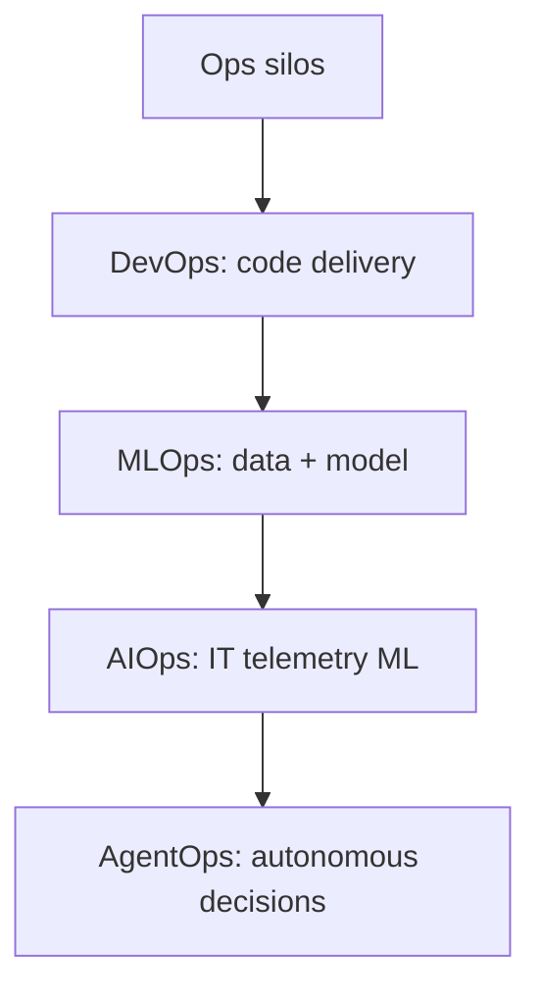
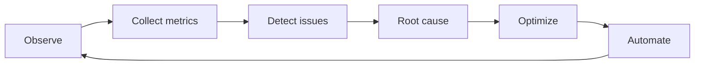

# AgentOps — операции с ИИ-агентами

  ОБЯЗАТЕЛЬНО

Инженеру
Разработчику
Архитектору

**AgentOps** — практики и инструменты для **развёртывания, наблюдаемости, безопасности и сопровождения** LLM-агентов в реальной эксплуатации. Если [DevOps](/encyclopedia/8-infra-security/8-04-devops-ci-cd/1) отвечает за путь **кода** от коммита до прода, AgentOps — за путь **автономных решений модели** от промпта до side effect: вызов API, коммит в Git, деплой, изменение инфраструктуры.

Агент — составная система: планировщик, контекст, tools, память, guardrails. Классический мониторинг «CPU и HTTP 500» не показывает, **почему** агент выбрал `terraform destroy` или трижды дернул платный enrichment API. AgentOps делает видимыми шаги рассуждения, цепочки tool calls и стоимость каждого run.

  
Смежные материалы

  Архитектура агента — [Агенты ИИ](/encyclopedia/6-ai/6-04-modeli-i-instrumenty/116), три слоя RAG/MCP/агент — [121](/encyclopedia/6-ai/6-04-modeli-i-instrumenty/121). DevOps-база — [CI/CD](/encyclopedia/8-infra-security/8-04-devops-ci-cd/11), [IaC](/encyclopedia/8-infra-security/8-04-devops-ci-cd/215), [мониторинг](/encyclopedia/8-infra-security/8-04-devops-ci-cd/19). AI-угол — [MLOps, L1–3](/encyclopedia/6-ai/6-08-agentops/2), [AgentOps, L4–7](/encyclopedia/6-ai/6-08-agentops/1).

---

## Эволюция Ops-ландшафта

| Эпоха | Подход | Что автоматизировали |
|-------|--------|----------------------|
| До 2010-х | Разрозненные Ops-команды | Ручное администрирование, медленные релизы |
| Конец 2000-х — сейчас | **DevOps** | CI/CD, [IaC](/encyclopedia/8-infra-security/8-04-devops-ci-cd/215), collaboration dev + ops |
| 2016–2024 | **MLOps** | Версии моделей, датасеты, inference-пайплайны |
| 2010-е — сейчас | **AIOps** | ML на логах и метриках IT: аномалии, корреляция инцидентов |
| 2024–сейчас | **AgentOps** | Жизненный цикл **агентных** систем: tracing, eval, guardrails, multi-agent |

DevOps и MLOps закрывают **детерминированный** артеfact: код и веса модели. AIOps помогает **людям** быстрее разбирать инциденты в классической инфраструктуре. AgentOps нужен там, где **сам исполнитель** — вероятностная модель с tools: поддержка, codegen, trading, internal automation.

---

## Суть AgentOps

AgentOps покрывает **весь жизненный цикл** агента — от одного tool call до мультиагентного workflow.

**Чем отличается от соседних дисциплин**

| Дисциплина | Фокус | Типичный артеfact |
|------------|-------|-------------------|
| DevOps | Сборка, тесты, деплой приложения | Docker-образ, Helm chart, pipeline YAML |
| MLOps | Обучение и inference модели | Checkpoint, feature store, batch job |
| AIOps | Анализ телеметрии IT-систем | Alert, root-cause hint для SRE |
| **AgentOps** | Поведение агента в runtime | Trace шагов, eval метрик, approval gate |

**ИИ-часть** добавляет к DevOps-pipeline:

- **недетерминизм** — один промпт, разные планы и коммиты;
- **стоимость по токенам и API** — runaway loop может сжечь бюджет за часы;
- **autonomy** — агент сам выбирает tools и порядок шагов;
- **shared accountability** — владелец агента, провайдер LLM, автор MCP-сервера.

Инфраструктура, CI/CD и IaC **остаются**: агенты коммитят в тот же Git, проходят те же [GitHub Actions](/encyclopedia/8-infra-security/8-04-devops-ci-cd/2112), деплоят через те же [стратегии выката](/encyclopedia/8-infra-security/8-04-devops-ci-cd/111). AgentOps **надстраивается** — observability агентских run, политики полномочий, eval перед merge.

---

## Теоретическая рамка

### Ops как эволюция абстракций

Каждая волна Ops **инкапсулирует** новый класс сложности:

**DevOps** решил проблему **handoff** между dev и ops через automation и shared ownership. **MLOps** — проблему **non-code artifacts** (data, weights). **AIOps** — **volume** телеметрии IT, непонятной человеку без ML-assisted RCA. **AgentOps** — **agency**: система сама выбирает действия в открытом мире API.

Подробно по слоям LLM-стека: [MLOps L1–3](/encyclopedia/6-ai/6-08-agentops/2), [AgentOps L4–7](/encyclopedia/6-ai/6-08-agentops/1).

### Compound AI systems

Современный агент — **compound system** (Andrew Ng, industry term): LLM + retriever + tools + policies + human. Отказ любого компонента — отказ системы. AgentOps трассирует **dependency graph** run'а, аналог distributed tracing в microservices ([Service Mesh](/encyclopedia/8-infra-security/8-04-devops-ci-cd/218)).

### Accountability chain

При инциденте «агент удалил данные» расследование проходит **цепочку**:

1. Какой **prompt version** и **rules**?
2. Какой **tool** и **permission grant**?
3. Какой **MCP server** version?
4. Какой **model** и **provider** policy?
5. Был ли **human approval**?

Shared accountability означает: владелец продукта, platform team и vendor LLM **совместно** несут ответственность за границы системы — но **operational owner** один, с runbook.

---

## Pipeline автоматизации AgentOps

Непрерывный цикл из шести стадий (по [AIMultiple — AgentOps](https://aimultiple.com/agentops)):

| Стадия | Задача | Пример |
|--------|--------|--------|
| **Observe** | Запись LLM calls, tools, DB queries, межагентных сообщений | Trace в Langfuse |
| **Collect metrics** | Success rate, latency, cost, quality | Dashboard «$ за PR» |
| **Detect issues** | Timeout, guardrail violation, loop | Alert на 50 tool calls подряд |
| **Root cause** | Связать с промптом, контекстом, координацией | «Reviewer-агент не получил diff» |
| **Optimize** | Уточнить prompt, workflow, model routing | Переключить coder на более дешёвую модель |
| **Automate** | Self-healing: retry, fallback prompt | Auto-rollback деплоя по метрикам SLO |

Этот цикл **дополняет**, а не заменяет классический CI/CD: pipeline по-прежнему гоняет lint и тесты; AgentOps отвечает за **качество и безопасность решений**, которые агент принял **до** push.

---

## Операционные вызовы

**Сложные артеfact'ы.** Агент порождает и статику (workflow, goals в репозитории), и runtime (планы, промежуточные рассуждения). Нужна трассировка через все компоненты — см. [Инструменты AgentOps](./2154).

**Высокая автономия.** Агент выбирает внешние API динамически. Без allow-list и [MCP](/encyclopedia/6-ai/6-04-modeli-i-instrumenty/114) возможен вызов небезопасного endpoint.

**Неконтролируемое потребление API.** Lead-gen агент, который в цикле дергает enrichment API, за сутки может набить счёт на тысячи долларов. Обязательны budget caps, rate limits, `max_iterations`.

**Недетерминизм.** Два run с одним промптом — разные PR. Версионирование промптов, [rules и skills](./2153), eval suite в CI.

**Непрерывная эволюция.** Агент «учится» на feedback. Нужны regression eval и human-in-the-loop на деструктивных операциях — см. [Опасные скрипты](/encyclopedia/8-infra-security/8-03-zabota-o-kode-i-dannyh/101).

### Эпистемологический разрыв

Оператор видит **outputs** (коммит, API response), модель оперирует **statistical patterns**. Post-mortem без trace сводится к guesswork. AgentOps — попытка построить **operational epistemology**: какие evidence достаточны, чтобы считать run «понятным» и «безопасным для повтора».

---

## Как начать

1. **Зафиксировать контекст** — [AGENTS.md, rules, skills](./2153) в репозитории.
2. **Подключить tracing** — хотя бы один run log на сессию ([2154](./2154)).
3. **Ограничить полномочия** — sandbox shell, `git_write` только на feature-ветках, deploy только через CI после merge.
4. **Встроить eval в pipeline** — smoke-тесты на golden tasks перед auto-merge.
5. **Human-in-the-loop** на prod, секретах, `force push`, IaC `apply`.

Дальше по главе: [мультиагентные команды](./2152) · [контекст и среда](./2153) · [инструменты](./2154).

---

## См. также

- [MLOps и LLM-стек — слои 1–3](/encyclopedia/6-ai/6-08-agentops/2)
- [AgentOps и LLM-стек — слои 4–7](/encyclopedia/6-ai/6-08-agentops/1)
- [Вайб-кодинг](/encyclopedia/6-ai/6-07-vayb-koding-i-neurokontent/1) — риски merge без review
- [Семь слоёв LLM-стека](/encyclopedia/6-ai/6-05-razrabotka-ii/119) — архитектурная карта
- [AIMultiple — Top AgentOps Tools](https://aimultiple.com/agentops)
