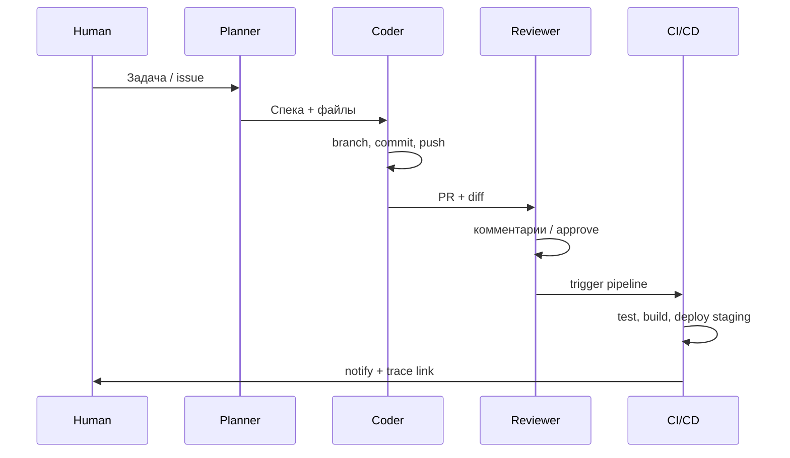

# Мультиагентные команды и DevOps-pipeline

  ОБЯЗАТЕЛЬНО

Инженеру
Разработчику
Архитектору

Один агент в IDE — уже мощно. В продакшене и в зрелых командах часто работают **несколько агентов и несколько моделей** — Claude для архитектурного ревью, Codex или Cursor Agent для кода, DeepSeek или Qwen для дешёвых черновиков, Gemini для длинного контекста, Grok — для быстрых итераций. **AgentOps** здесь — про то, как они **передают задачи**, не ломают репозиторий и проходят тот же [CI/CD](/encyclopedia/8-infra-security/8-04-devops-ci-cd/11), что и люди.

Обзор дисциплины — [AgentOps — операции с ИИ-агентами](./2151).

---

## Типовые роли в мультиагентной команде

| Роль | Задача | Частый выбор модели |
|------|--------|---------------------|
| **Planner / PM** | Декомпозиция, acceptance criteria | Модель с сильным reasoning |
| **Coder / Implementer** | Патч, тесты, refactor | Быстрая coding-модель |
| **Reviewer** | Diff, security, стиль | Отдельная модель или тот же с другим system prompt |
| **Ops / Deployer** | IaC, pipeline, runbook | Агент с ограниченным toolset |
| **Orchestrator** | Маршрутизация, лимиты, handoff | Код (LangGraph, Temporal) или meta-agent |

Роли могут быть **отдельными процессами** (Cloud Agent в фоне, CI job, локальный subagent) или **сессиями одного хоста** (Cursor: parent agent + Task tool с `subagent_type`).

---

## Как агенты "обсуждают" и передают работу

**Shared artifact** — самый надёжный паттерн. Агенты не «разговаривают в чате», а пишут в общее хранилище:

- issue / ticket с чек-листом;
- `docs/design/FEATURE.md` — спека;
- комментарии в PR;
- `agent-transcripts/` или trace ID в описании PR.

**Message bus** — очередь (Redis, SQS) или orchestration framework (LangGraph, CrewAI, AutoGen). Planner кладёт задачу, Coder забирает, Reviewer подписан на событие `pr.opened`.

**Handoff prompt** — orchestrator передаёт следующему агенту **сжатый контекст** — цель, сделанные шаги, ошибки, ссылки на файлы. Без этого каждый агент заново "изобретает" архитектуру.

**Debate / critique** — два агента генерируют альтернативы, третий (или человек) выбирает. Дорого по токенам; оправдано на security review и миграциях данных.

  
Бесконечный ping-pong

  

  Coder и Reviewer могут зациклиться — "исправь" → "ещё замечание" → … Лимит раундов, эскалация человеку, финальный arbiter с жёстким rubric.
  

---

## Git, ревью и merge

Агенты используют **те же правила**, что команда людей — см. [Git и GitFlow](./12).

**Типичный flow**

1. Orchestrator создаёт ветку `agent/ISSUE-123-fix-login`.
2. Coder коммитит атомарные commits с понятными сообщениями (правила из [user rules / AGENTS.md](./2153)).
3. Push → **Pull Request**; в body — trace ID, модель, список tools.
4. Reviewer-агент (или bot) оставляет review comments; **обязательный human approve** на prod-критичных репо.
5. CI — lint, unit, integration, [agent eval](./2151) на golden tasks.
6. Merge → CD на staging → smoke → prod по [стратегии выката](/encyclopedia/8-infra-security/8-04-devops-ci-cd/111).

**Что запрещать агентам без явного approve**

- `git push --force` на shared branches;
- merge в `main` без green CI;
- прямой `kubectl apply` / `terraform apply` в prod — только через pipeline с [IaC review](/encyclopedia/8-infra-security/8-04-devops-ci-cd/215).

Cursor и аналоги часто дают агенту `git_write` и shell — это **реальные** права. Политика "агент только на feature-ветке + PR" должна быть в [rules](./2153), а не надеждой.

---

## Несколько моделей — routing

| Критерий | Routing |
|----------|---------|
| Сложность задачи | Hard → Claude/GPT-4 class; рутина → smaller / local |
| Контекст | Длинный repo → Gemini / модель с большим окном |
| Стоимость | Черновик на DeepSeek/Qwen; финальный patch на premium |
| Latency | Интерактив в IDE — fast model; nightly batch — cheap |
| Compliance | Данные не покидают перimeter → self-hosted (Ollama, vLLM) |

**Model router** — тонкий слой (конфиг YAML или код), который выбирает endpoint по тегу задачи — `plan`, `code`, `review`. Логи router'а — часть AgentOps tracing.

---

## CI/CD и инфраструктура под агентов

**Runner / sandbox**

- Изолированная VM или container per agent run;
- Secrets через [vault CI](/encyclopedia/8-infra-security/8-04-devops-ci-cd/211), не в промпте;
- Network egress allow-list (только GitHub API, npm, internal registry).

**Pipeline stages для agent-generated PR**

| Stage | Назначение |
|-------|------------|
| `lint / typecheck` | Отсечь [нейрослоп](/encyclopedia/6-ai/6-07-vayb-koding-i-neurokontent/2) |
| `unit + integration` | Как для human PR |
| `agent-eval` | Golden prompts → expected tool sequence / diff shape |
| `security scan` | SAST, secret scan, dependency audit |
| `deploy preview` | Ephemeral env для human QA |

**IaC для agent infrastructure**

- Terraform module — runner pool, observability backend (Langfuse self-host), queue;
- [Ansible](/encyclopedia/8-infra-security/8-04-devops-ci-cd/216) — конфиг агентских хостов, MCP servers;
- GitOps — desired state agent policies в репозитории.

**Observability** — trace каждого run linked to `commit_sha` и `pr_number`; метрики "стоимость PR", "время до merge", "% PR без human edits" — см. [мониторинг](/encyclopedia/8-infra-security/8-04-devops-ci-cd/19) и [Инструменты AgentOps](./2154).

---

## Практические сценарии

**Cursor Cloud Agents / фоновые агенты** — задача в issue, агент в облаке, результат PR. Человек triage утром.

**PR bot** — на каждый PR reviewer-агент + auto-fix trivial comments (imports, typos) вторым commit.

**On-call copilot** — read-only доступ к logs/metrics через MCP; runbook в [skills](./2153); **без** auto-remediation в prod без approve.

**Split-to-PRs** — один planner разбивает монолитный diff на серию маленьких PR (skill `split-to-prs` в Cursor).

---

## См. также

- [Контекст агента — AGENTS, skills, rules](./2153)
- [Инструменты AgentOps](./2154)
- [MCP-серверы](/encyclopedia/6-ai/6-04-modeli-i-instrumenty/114)
- [Автоматизация сборки и деплоя](/encyclopedia/8-infra-security/8-04-devops-ci-cd/18)
