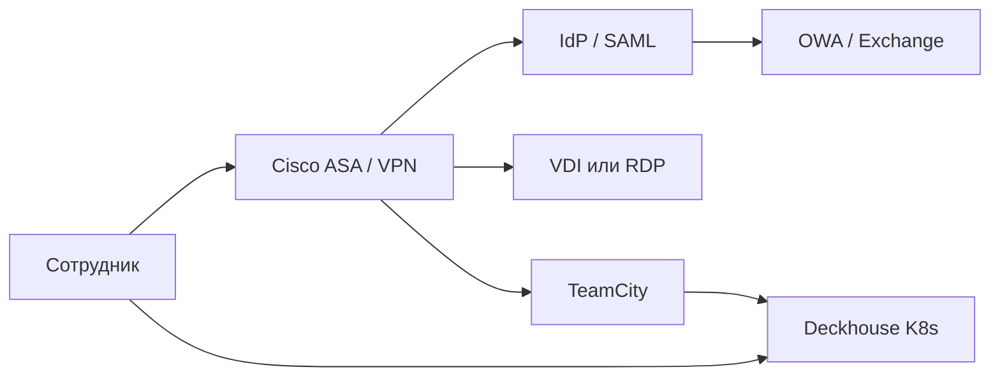

import ExternalCodeEmbed from '@site/src/components/ExternalCodeEmbed';


# Корпоративный доступ, SSO и платформенные инструменты

<div class="article-tags">
  <span class="tag tag-required">ОБЯЗАТЕЛЬНО</span>
  <span class="tag tag-beginner">ДЛЯ НОВИЧКОВ</span>
</div>

<span class="complexity-badge">Разработчику</span>
<span class="complexity-badge">Архитектору</span>
<span class="complexity-badge">Инженеру</span>

В корпоративной DevOps-среде инженер одновременно работает с **CI/CD**, **Kubernetes-платформой**, **сетевым периметром** и **доступом сотрудников**. Один день может включать: VPN через **Cisco ASA**, вход в **TeamCity** по **SAML**, проверку почты в **OWA**, деплой в кластер **Deckhouse** и RDP на Windows-стенд для отладки legacy-сервиса.

Ниже — обзор технологий, которые часто встречаются вместе: удалённый рабочий стол, единый вход, почта в браузере, сборка в TeamCity, кластеры на Deckhouse, межсетевой экран Cisco ASA и виртуальные рабочие столы (VDI).

<div class="callout callout--tip">
  <div class="callout-title">Про "RGP"</div>

  <div class="callout-body">
  В запросах часто имеют в виду **RDP** (Remote Desktop Protocol) — протокол удалённого рабочего стола Windows. В статье описан именно RDP

  если у вас под "RGP" закреплён другой внутренний сервис, сверьтесь с документацией компании.
</div>
  </div>


| Тема | Роль в инфраструктуре |
|------|------------------------|
| **RDP** | Сессия на Windows-сервере или ПК по сети |
| **VDI** | Виртуальный рабочий стол как сервис (пул ВМ) |
| **SAML** | Единый вход (SSO) между корпоративными системами |
| **OWA** | Веб-доступ к почте Microsoft Exchange |
| **TeamCity** | CI-сервер JetBrains для сборок и деплоя |
| **Deckhouse** | Платформа управления Kubernetes (Flant) |
| **Cisco ASA** | Межсетевой экран, VPN, политики доступа |
| **Houston / Zebra / Pandora** | Часто — имена внутренних порталов или мониторинга; ниже — и публичные аналоги |

---

## RDP — удалённый рабочий стол Windows

**RDP** — протокол Microsoft для графической сессии на удалённой машине. Клиент (`mstsc`, Remmina, Microsoft Remote Desktop) подключается к службе Remote Desktop Services; по умолчанию используется TCP-порт **3389**.

Типичный поток для разработчика:

1. Подключение к корпоративному **VPN** (часто через Cisco ASA / AnyConnect).
2. Запуск RDP-клиента на адрес `dev-staging-01.corp.local`.
3. Аутентификация доменной учётной записью AD (иногда с MFA).
4. Работа на удалённой машине так же, как за локальным монитором — IDE, браузер, доступ к внутреннему Git.

Типичные сценарии в IT:

- администрирование серверов и рабочих станций;
- терминальная ферма **RDS** (Remote Desktop Services): несколько пользователей на одном сервере;
- доступ разработчика к стенду в корпоративной сети через **VPN** или **RD Gateway**, без публикации RDP в интернет.

Связка с безопасностью: прямой проброс 3389 на публичный IP — частая причина компрометации. Предпочтительны VPN, Zero Trust-шлюз или RD Gateway с MFA. Подробнее о схемах удалёнки — в [Удаленная работа](/encyclopedia/1-basics/1-27-udalennaya-rabota/1).

---

## VDI — виртуальные рабочие столы

**VDI (Virtual Desktop Infrastructure)** — модель, при которой рабочая среда (ОС, приложения, данные) выполняется **в дата-центре**, а сотрудник получает только поток изображения и ввода на тонкий клиент, ноутбук или браузер.

| Критерий | RDP на отдельную ВМ/сервер | VDI (пул рабочих столов) |
|----------|----------------------------|---------------------------|
| Масштаб | Точечный доступ | Сотни и тысячи однотипных мест |
| Данные | Часто на сервере сессии | Централизованно в ЦОД, DLP проще |
| Поставщики | RDS, чистый RDP | VMware Horizon, Citrix, Azure Virtual Desktop, Deckhouse Virtualization |
| DevOps | Реже целевой стек | Образы "золотого" десктопа, автоматизация пула |

Для разработчика VDI означает: сборка и секреты остаются в периметре компании; локальный ноутбук — терминал. CI/CD и Git при этом обычно доступны по тем же правилам, что и в офисе (VPN, SSO).

---

## SAML — единый вход в корпоративных и DevOps-системах

**SAML 2.0 (Security Assertion Markup Language)** — XML-стандарт обмена утверждениями о пользователе между **Identity Provider (IdP)** и **Service Provider (SP)**. После входа в IdP (Active Directory Federation Services, Keycloak, Okta, Google Workspace и др.) браузер доставляет подписанный **SAML Response** в приложение; то создаёт локальную сессию.

Роли в потоке:

- **IdP** — "кто вы" (логин, MFA, группы AD);
- **SP** — приложение: Grafana, GitLab, TeamCity, Kubernetes Dashboard, внутренний портал.

В DevOps SAML подключают к:

- веб-интерфейсам мониторинга и логов;
- CI/CD (TeamCity, Jenkins с плагином);
- облачным консолям через корпоративный IdP.

Детальный разбор потока AuthnRequest / Assertion — в [Основы информационной безопасности](/encyclopedia/2-system-network/2-08-osnovy-informatsionnoy-bezopasnosti/111) и [Аутентификация в CI/CD](/encyclopedia/8-infra-security/8-04-devops-ci-cd/211).

---

## OWA — Outlook в браузере (Outlook on the web)

**OWA (Outlook Web App / Outlook on the web)** — веб-клиент для **Microsoft Exchange**. Пользователь открывает URL вида `https://mail.company.com/owa` (точный путь зависит от версии Exchange и политики), проходит корпоративную аутентификацию (часто интегрированную с SAML/AD) и работает с почтой, календарём и контактами без установки Outlook.

Связь с архитектурой почты:

- **MUA** в браузере (OWA) → **Exchange** (транспорт, хранилище) → при необходимости исходящая доставка через **SMTP**;
- для автоматизации и интеграций используют **EWS** или **Microsoft Graph API**, а OWA остаётся интерфейсом для людей.

Исторически OWA стал одним из первых массовых "одностраничных" веб-приложений: активно применялся **XMLHttpRequest**, позже ставший основой AJAX. Общая модель MUA/MTA/MDA — в [Коммуникация: электронная почта](/encyclopedia/1-basics/1-22-kommunikatsiya-i-obschenie/3).

---

## TeamCity — CI-сервер JetBrains

**TeamCity** — сервер непрерывной интеграции от JetBrains. Центральный сервер хранит конфигурации **build configuration**, очередь сборок и артефакты; **агенты** (на отдельных хостах или в Kubernetes) выполняют шаги.

Ключевые понятия:

| Понятие | Назначение |
|---------|------------|
| **Project** | Группа репозиториев и настроек |
| **Build configuration** | Сценарий: VCS-триггер, шаги, зависимости |
| **Build chain** | Цепочка сборок (сборка → тесты → деплой) |
| **Agent pool** | Пул машин с нужным ПО (SDK, Docker) |
| **Artifact dependency** | Передача выхода одной сборки в другую |

TeamCity хорошо интегрируется с экосистемой JetBrains (Kotlin, .NET, Rider), поддерживает **Docker**, **Maven/Gradle**, **NuGet**, уведомления и REST API. Аутентификация часто завязана на **LDAP/AD** или **SAML SSO** — см. раздел [SAML](#saml--единый-вход-в-корпоративных-и-devops-системах) ниже.

**Типичный build chain в TeamCity:**

```text
Git push → VCS trigger → Checkout → Compile → Unit tests → Integration tests
    → SonarQube (опционально) → Docker build → Push to registry → Deploy to K8s
```

Snapshot-зависимости и **artifact dependency** позволяют не пересобирать библиотеку, если коммит не менял её модуль — экономия времени на монорепозиториях.

Минимальная идея конфигурации (Kotlin DSL в репозитории):


<ExternalCodeEmbed example="kotlin/infra-security-8-8-04-devops-ci-cd-219-001" title="TeamCity — CI-сервер JetBrains" minHeight={336} />


Сравнение с GitLab CI, GitHub Actions и Jenkins — в [Инструменты автоматизации](/encyclopedia/8-infra-security/8-04-devops-ci-cd/16).

---

## Deckhouse — Kubernetes-платформа

**Deckhouse Kubernetes Platform (DKP)** — дистрибутив и платформа от [Flant](https://flant.com/) для **однотипных кластеров** на bare metal, VMware, OpenStack и облаках (AWS, GCP, Azure, Yandex Cloud). Платформа ставит "ванильный" upstream Kubernetes и набор **модулей**: Ingress, мониторинг (Prometheus, Grafana), сертификаты (cert-manager), Istio, логирование, политики безопасности и др.

Что важно DevOps-инженеру:

- **NoOps-подход** — обновление control plane и модулей автоматизировано каналами релизов (CE / EE).
- **Модуль `console`** — веб-интерфейс управления кластером (узлы, сеть, хранилище, безопасность, ссылки на Grafana/Prometheus).
- **Deckhouse Commander** — централизованное управление **несколькими** кластерами по шаблонам (control cluster + application clusters).
- **werf** — CI/CD-инструмент той же экосистемы: сборка образов, Helm-деплой, Giterminism.
- **addon-operator / shell-operator** — основа модулей: операторы на хуках Kubernetes.

Установка и жизненный цикл кластера описаны в документации [deckhouse.io](https://deckhouse.io/). В энциклопедии — вводный блок в [Контейнеризация, глава 117](/encyclopedia/8-infra-security/8-06-konteynerizatsiya-i-orkestratsiya/117) и практика манифестов в [1171](/encyclopedia/8-infra-security/8-06-konteynerizatsiya-i-orkestratsiya/1171).

```text
Разработчик → Git / werf / CI → Container Registry
                                      ↓
                            Deckhouse Kubernetes Platform
                    (модули: ingress, prometheus, loki, istio, …)
                                      ↓
                              Приложения в Pod'ах
```

---

## Houston, Zebra, Pandora — как читать эти имена

В переписке и runbook'ах **Houston**, **Zebra**, **Pandora** часто означают **внутренние сервисы конкретной компании** (портал, алертинг, CMDB, дашборд). Универсального стандарта с такими именами нет — уточняйте у администраторов. Ниже — публичные продукты, с которыми имена пересекаются в индустрии; это помогает понять возможную роль.

---

### Houston

- **Astronomer Houston** — GraphQL API control plane платформы **Astronomer** (управление Airflow-деплоями в Kubernetes, workspace, пользователи). URL обычно вида `https://houston.<домен>/v1/`.
- В экосистеме **Deckhouse** административный UI называется модулем **`console`**, а централизованное управление кластерами — **Commander**; отдельного продукта "Houston" в открытой документации DKP нет.
- У Flant есть open-source **loghouse** — хранение и веб-UI логов в ClickHouse для Kubernetes (другое назначение, похожее "космическое" имя).

---

### Zebra

- **ZEBRA (Zowe)** — фреймворк доступа к метрикам **z/OS** (mainframe), экспорт в Prometheus/Grafana — узкая ниша.
- **Zebra Technologies** — оборудование для штрихкодов и учёта, к DevOps Kubernetes напрямую не относится.
- Внутри компаний "Zebra" иногда называют **дашборд**, **шлюз API** или **сервис публикации метрик** — только локальная документация даёт точное определение.

---

### Pandora

- **Pandora FMS** — open-source платформа мониторинга инфраструктуры (агенты, SNMP, отчёты, SLA).
- В Deckhouse экосистеме сбор метрик и алертов закрывают модули **prometheus**, **monitoring-***, **upmeter**, логи — **loki**, **log-shipper** (см. [каталог модулей](https://deckhouse.io/modules/)).
- Имя "Pandora" в runbook'ах нередко относится к **внутренней системе алертов** или **порталу инцидентов**.

---

## Cisco ASA — межсетевой экран и VPN

**Cisco ASA (Adaptive Security Appliance)** — семейство аппаратных и виртуальных **межсетевых экранов** Cisco (линейка постепенно сменяется платформой **Firepower**, но ASA остаётся в эксплуатации). Типичные функции:

- **ACL** — фильтрация трафика между зонами (inside, outside, DMZ);
- **NAT/PAT** — трансляция адресов для выхода в интернет и публикации сервисов;
- **Site-to-site VPN** (IPsec) — связь офисов и ЦОД;
- **Remote Access VPN** (AnyConnect) — удалённый доступ сотрудников с проверкой политик.

Для DevOps ASA — граница, через которую проходят только разрешённые порты к Git, registry, Kubernetes API и bastion. Правила согласуют с сетевыми инженерами; изменения ACL — через change management.

Пример логики (упрощённо): разрешить из VPN-сети `10.8.0.0/24` на `k8s-api.company.local:6443`, запретить остальное inbound на DMZ.

---

## Как связаны темы в одном ландшафте



Типичный день инженера: VPN или VDI через периметр (**ASA**), вход в **TeamCity** и **Grafana** по **SAML**, почта в **OWA**, деплой в кластер **Deckhouse**. Удалённая сессия на Windows-стенд — **RDP**; полноценный изолированный десктоп — **VDI**.

---

## Рекомендую читать дальше

- [Аутентификация и авторизация в CI/CD](/encyclopedia/8-infra-security/8-04-devops-ci-cd/211) — JWT, OAuth, SAML в пайплайнах.
- [Удаленная работа](/encyclopedia/1-basics/1-27-udalennaya-rabota/1) — VPN, VDI, Zero Trust.
- [Системное администрирование](/encyclopedia/2-system-network/2-06-sistemnoe-administrirovanie/intro) — AD, группы, RDP-политики.
- [Контейнеризация и Deckhouse](/encyclopedia/8-infra-security/8-06-konteynerizatsiya-i-orkestratsiya/117).

---
