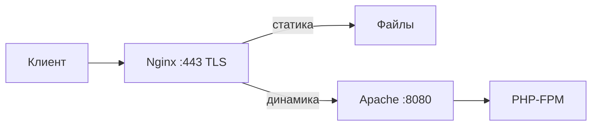

# Справочник по Apache HTTP Server

<div class="article-tags"><span class="tag tag-reference">СПРАВОЧНИК</span></div>

---

## Назначение

CLI, конфигурация и типовые сценарии **Apache HTTP Server** (DevOps, shared hosting, legacy PHP). Учебный обзор: [Веб-серверы](/encyclopedia/2-system-network/2-04-kak-rabotayut-sayty-i-veb-sayty/112). Параллельный материал по Nginx: [Справочник по Nginx](./3112.md). Курс раздела: [DevOps и CI/CD](/encyclopedia/8-infra-security/8-04-devops-ci-cd/intro).

---

## Краткое пояснение

**Apache HTTP Server** (httpd) — модульный веб-сервер с открытым исходным кодом. Ядро принимает TCP-соединения и разбирает HTTP; расширения подключаются модулями (`mod_ssl`, `mod_rewrite`, `mod_proxy`, `mod_headers`). Конфигурация — текстовые файлы с контекстами (глобальный, виртуальный хост, каталог, файлы). На shared-хостинге и в LAMP-стеках Apache по-прежнему распространён из‑за `.htaccess` и `mod_rewrite`.

---

## Быстрый старт

### Debian / Ubuntu (`apache2`)

```bash
sudo apt update && sudo apt install apache2
sudo apache2ctl configtest
sudo systemctl reload apache2
sudo a2enmod rewrite ssl proxy_fcgi headers
sudo systemctl restart apache2
```

---

### RHEL / Fedora / Rocky (`httpd`)

```bash
sudo dnf install httpd
sudo apachectl configtest
sudo systemctl enable --now httpd
sudo firewall-cmd --permanent --add-service=http
sudo firewall-cmd --permanent --add-service=https
sudo firewall-cmd --reload
```

---

### Проверка ответа

```bash
curl -I http://127.0.0.1/
curl -I -H "Host: example.com" http://127.0.0.1/
```

Разбор флагов `-I`, `-H`, кодов ответа — [утилита curl](/encyclopedia/2-system-network/2-05-terminal/1133).

---

## Справочные таблицы

### Содержание справочника

- [Расположение файлов](#расположение-файлов)
- [MPM и рабочие процессы](#mpm-и-рабочие-процессы)
- [Виртуальные хосты](#виртуальные-хосты)
- [Контекст Directory и Files](#контекст-directory-и-files)
- [mod_rewrite](#mod_rewrite)
- [Файлы .htaccess](#файлы-htaccess)
- [PHP — mod_php и PHP-FPM](#php--mod_php-и-php-fpm)
- [mod_proxy и балансировка](#mod_proxy-и-балансировка)
- [SSL/TLS (mod_ssl)](#ssltls-mod_ssl)
- [Логирование](#логирование)
- [Безопасность](#безопасность)
- [Стек Nginx + Apache](#стек-nginx--apache)
- [Ошибки и диагностика](#ошибки-и-диагностика)

---

### Расположение файлов

| Дистрибутив | Пакет | Главный конфиг | Сайты | Логи |
|-------------|-------|----------------|-------|------|
| Debian/Ubuntu | `apache2` | `/etc/apache2/apache2.conf` | `/etc/apache2/sites-available/`, `sites-enabled/` | `/var/log/apache2/` |
| RHEL/Fedora | `httpd` | `/etc/httpd/conf/httpd.conf` | `/etc/httpd/conf.d/*.conf` | `/var/log/httpd/` |
| XAMPP (Windows) | — | `apache/conf/httpd.conf` | `extra/httpd-vhosts.conf` | `apache/logs/` |

Дополнительные фрагменты подключаются через `Include` / `IncludeOptional`. В Debian модули включаются симлинками в `mods-enabled/` (`a2enmod`, `a2dismod`); сайты — `a2ensite`, `a2dissite`.

---

### MPM и рабочие процессы

**MPM** (Multi-Processing Module) определяет, как Apache обрабатывает параллельные соединения.

| MPM | Модель | Когда уместен |
|-----|--------|----------------|
| `prefork` | процесс на соединение | старый `mod_php`, максимальная изоляция |
| `worker` | процессы + потоки | компромисс память/параллелизм |
| `event` | как `worker`, лучше keep-alive | **рекомендуется** на современных Linux при PHP-FPM |

Проверка активного MPM:

```bash
apache2ctl -V 2>/dev/null | grep MPM
# Server MPM:     event
```

Настройка (пример для `event` в `/etc/apache2/mods-available/mpm_event.conf`):

```apache
<IfModule mpm_event_module>
    StartServers             2
    MinSpareThreads          25
    MaxSpareThreads          75
    ThreadsPerChild          25
    MaxRequestWorkers        400
    MaxConnectionsPerChild   10000
</IfModule>
```

`MaxRequestWorkers` ограничивает одновременные запросы; при исчерпании клиенты ждут в очереди или получают ошибку. Для PHP через FPM узкое место чаще в пуле FPM, а не в Apache.

---

### Виртуальные хосты

Несколько сайтов на одном IP и порту различаются заголовком `Host`. Первый подходящий `VirtualHost` становится **default** для неизвестных имён.

---

#### Debian/Ubuntu

Файл `/etc/apache2/sites-available/example.conf`:

```apache
<VirtualHost *:80>
    ServerName example.com
    ServerAlias www.example.com
    DocumentRoot /var/www/example/public

    <Directory /var/www/example/public>
        Options -Indexes +FollowSymLinks
        AllowOverride None
        Require all granted
    </Directory>

    ErrorLog ${APACHE_LOG_DIR}/example-error.log
    CustomLog ${APACHE_LOG_DIR}/example-access.log combined
</VirtualHost>
```

```bash
sudo a2ensite example.conf
sudo apache2ctl configtest && sudo systemctl reload apache2
```

---

#### RHEL

Файл `/etc/httpd/conf.d/example.conf` с тем же содержимым блока `VirtualHost` (пути логов — `/var/log/httpd/`).

---

#### Редирект HTTP → HTTPS

```apache
<VirtualHost *:80>
    ServerName example.com
    Redirect permanent / https://example.com/
</VirtualHost>

<VirtualHost *:443>
    ServerName example.com
    DocumentRoot /var/www/example/public
    SSLEngine on
    SSLCertificateFile /etc/letsencrypt/live/example.com/fullchain.pem
    SSLCertificateKeyFile /etc/letsencrypt/live/example.com/privkey.pem
    # ... Directory, логи ...
</VirtualHost>
```

---

### Контекст Directory и Files

| Директива | Назначение |
|-----------|------------|
| `DocumentRoot` | корень URL для виртуального хоста |
| `DirectoryIndex` | индексные файлы (`index.html`, `index.php`) |
| `Options` | `Indexes`, `FollowSymLinks`, `ExecCGI` |
| `AllowOverride` | разрешить `.htaccess` (`None` в production) |
| `Require` | контроль доступа (Apache 2.4+) |

```apache
<Directory /var/www/app/public>
    Options -Indexes +FollowSymLinks
    AllowOverride None
    Require all granted
</Directory>

<Files ".env">
    Require all denied
</Files>

<FilesMatch "\.(git|svn)">
    Require all denied
</FilesMatch>
```

Apache 2.4 использует `Require all granted` вместо устаревшего `Order allow,deny` / `Allow from all`.

---

### mod_rewrite

Модуль `mod_rewrite` переписывает URL по правилам до выбора обработчика. Включение:

```bash
sudo a2enmod rewrite   # Debian
sudo systemctl reload apache2
```

---

#### Базовый шаблон в конфиге виртуального хоста

```apache
<VirtualHost *:80>
    ServerName example.com
    DocumentRoot /var/www/example/public

    <Directory /var/www/example/public>
        AllowOverride None
        Require all granted

        RewriteEngine On
        RewriteBase /

        # Канонический хост без www
        RewriteCond %{HTTP_HOST} ^www\.example\.com [NC]
        RewriteRule ^ https://example.com%{REQUEST_URI} [R=301,L]

        # Front controller (Laravel, Symfony, WordPress в подкаталоге)
        RewriteCond %{REQUEST_FILENAME} !-f
        RewriteCond %{REQUEST_FILENAME} !-d
        RewriteRule ^ index.php [L]
    </Directory>
</VirtualHost>
```

---

#### Флаги RewriteRule

| Флаг | Смысл |
|------|--------|
| `[L]` | последнее правило (last) |
| `[R=301]` | редирект клиенту |
| `[NC]` | без учёта регистра |
| `[P]` | проксировать (нужен `mod_proxy`) |

---

#### Проксирование пути на другой сервис

```apache
RewriteEngine On
RewriteRule ^/api/(.*)$ http://127.0.0.1:8080/$1 [P,L]
```

Для `[P]` должны быть включены `proxy` и `proxy_http`.

---

#### Отладка

```apache
LogLevel alert rewrite:trace3
```

Высокий уровень `trace` только на staging — логи быстро растут.

---

### Файлы .htaccess

`.htaccess` в каталоге позволяет менять конфигурацию без правки главных файлов. Каждый запрос может читать цепочку `.htaccess` вверх по дереву — это дороже центрального конфига.

| `AllowOverride` | Разрешает |
|-----------------|-----------|
| `None` | запрет (рекомендуется на production) |
| `FileInfo` | `mod_rewrite`, заголовки, типы |
| `AuthConfig` | базовая аутентификация |
| `All` | всё перечисленное |

Пример для shared hosting (когда центральный конфиг недоступен):

```apache
# /var/www/user/site/.htaccess
RewriteEngine On
RewriteCond %{REQUEST_FILENAME} !-f
RewriteCond %{REQUEST_FILENAME} !-d
RewriteRule ^ index.php [L]
```

Правила из `.htaccess` переносят в `<Directory>` виртуального хоста, когда есть root-доступ — так быстрее и предсказуемее.

---

### PHP — mod_php и PHP-FPM

| Способ | Модуль | Плюсы | Минусы |
|--------|--------|-------|--------|
| Встроенный PHP | `mod_php` | простая настройка на хостинге | PHP в процессе Apache, тяжёлый prefork |
| Внешний пул | `proxy_fcgi` + PHP-FPM | изоляция, event MPM | отдельный сервис `php-fpm` |

---

#### PHP-FPM

```bash
sudo apt install php-fpm
sudo a2enmod proxy_fcgi setenvif
sudo a2enconf php8.2-fpm
```

```apache
<FilesMatch \.php$>
    SetHandler "proxy:unix:/run/php/php8.2-fpm.sock|fcgi://localhost"
</FilesMatch>
```

Или через `ProxyPassMatch` в виртуальном хосте:

```apache
<VirtualHost *:80>
    DocumentRoot /var/www/app/public
    <FilesMatch \.php$>
        SetHandler "proxy:fcgi://127.0.0.1:9000"
    </FilesMatch>
</VirtualHost>
```

Сокет и версия PHP зависят от дистрибутива (`/run/php/php-fpm.sock`).

---

#### mod_php (legacy)

```apache
<FilesMatch \.php$>
    SetHandler application/x-httpd-php
</FilesMatch>
```

Требует MPM `prefork` в классических сборках. На новых системах предпочтителен FPM.

---

### mod_proxy и балансировка

`mod_proxy` передаёт запросы на backend (Tomcat, Node.js, второй Apache).

```apache
ProxyPreserveHost On
ProxyPass /api/ http://127.0.0.1:3000/api/
ProxyPassReverse /api/ http://127.0.0.1:3000/api/
```

---

#### Балансировка (`mod_proxy_balancer`)

```apache
<Proxy balancer://appcluster>
    BalancerMember http://10.0.0.1:8080 loadfactor=3
    BalancerMember http://10.0.0.2:8080
    BalancerMember http://10.0.0.3:8080 status=+H
</Proxy>

ProxyPass /app/ balancer://appcluster/
ProxyPassReverse /app/ balancer://appcluster/
```

`status=+H` помечает узел как hot spare (резерв). Health check в open source ограничен; для активных проверок часто ставят HAProxy или Nginx перед Apache.

---

#### WebSocket

```apache
RewriteEngine On
RewriteCond %{HTTP:Upgrade} =websocket [NC]
RewriteRule /chat/(.*) ws://127.0.0.1:8080/chat/$1 [P,L]
ProxyPass /chat/ ws://127.0.0.1:8080/chat/
```

Нужны `proxy_wstunnel` и согласованные таймауты.

---

### SSL/TLS (mod_ssl)

```bash
sudo a2enmod ssl
sudo certbot --apache -d example.com -d www.example.com
```

Ручная настройка:

```apache
Listen 443 https
<VirtualHost *:443>
    ServerName example.com
    SSLEngine on
    SSLCertificateFile /etc/ssl/certs/example-fullchain.pem
    SSLCertificateKeyFile /etc/ssl/private/example.key

    SSLProtocol all -SSLv3 -TLSv1 -TLSv1.1
    SSLCipherSuite HIGH:!aNULL:!MD5
    Header always set Strict-Transport-Security "max-age=31536000; includeSubDomains"
</VirtualHost>
```

Современные дистрибутивы подключают сниппеты `ssl-params` (Mozilla Intermediate). После изменений — `apache2ctl configtest` и reload.

---

### Логирование

| Директива | Назначение |
|-----------|------------|
| `ErrorLog` | ошибки сервера и модулей |
| `CustomLog` | access-лог (формат `combined`, `common`) |
| `LogLevel` | детализация (`warn`, `info`, `rewrite:trace3`) |

```apache
LogFormat "%h %l %u %t \"%r\" %>s %b \"%{Referer}i\" \"%{User-Agent}i\"" combined
CustomLog ${APACHE_LOG_DIR}/access.log combined
```

Просмотр:

```bash
sudo tail -f /var/log/apache2/error.log
sudo journalctl -u apache2 -f
```

`mod_status` даёт страницу `/server-status` (только с `Require local` или VPN).

---

### Безопасность

- Отключить листинг каталогов: `Options -Indexes`.
- Запретить доступ к служебным файлам (`<FilesMatch>` для `.git`, `.env`).
- Минимизировать `AllowOverride` на production.
- Ограничить размер тела: `LimitRequestBody 10485760` (10 MiB).
- Заголовки через `mod_headers`:

```apache
Header always set X-Content-Type-Options "nosniff"
Header always set X-Frame-Options "SAMEORIGIN"
Header always set Referrer-Policy "strict-origin-when-cross-origin"
```

- WAF: ModSecurity поверх Apache (отдельная тема; часто WAF ставят на Nginx).

Аутентификация по паролю (`mod_auth_basic`):

```apache
<Directory /var/www/private>
    AuthType Basic
    AuthName "Restricted"
    AuthUserFile /etc/apache2/.htpasswd
    Require valid-user
</Directory>
```

```bash
sudo htpasswd -c /etc/apache2/.htpasswd admin
```

---

### Стек Nginx + Apache

Типовая схема для legacy PHP и сложных rewrite:



Nginx (см. [3112](./3112.md)):

```nginx
server {
    listen 443 ssl;
    server_name example.com;
    root /var/www/example/public;

    location / {
        try_files $uri $uri/ @apache;
    }

    location @apache {
        proxy_pass http://127.0.0.1:8080;
        proxy_set_header Host $host;
        proxy_set_header X-Real-IP $remote_addr;
        proxy_set_header X-Forwarded-For $proxy_add_x_forwarded_for;
        proxy_set_header X-Forwarded-Proto $scheme;
    }
}
```

Apache слушает только localhost:

```apache
<VirtualHost 127.0.0.1:8080>
    ServerName example.com
    DocumentRoot /var/www/example/public
    # rewrite и PHP-FPM здесь
</VirtualHost>
```

TLS и rate limiting остаются на Nginx; Apache обрабатывает `.htaccess`, если политика хостинга это требует.

---

## Ошибки и диагностика

### Распространённые ошибки

| Симптом | Причина | Действие |
|---------|---------|----------|
| `403 Forbidden` | нет `Require all granted`, SELinux, права NTFS/Unix | права на `DocumentRoot`, контекст SELinux `httpd_sys_content_t` |
| `404` при существующем файле | неверный `DocumentRoot`, rewrite уводит в `/` | `apache2ctl -S`, лог `rewrite` |
| `500` + PHP | синтаксис, падение FPM | лог FPM `/var/log/php*-fpm.log` |
| `AH00558` | не указан `ServerName` | `ServerName localhost` в conf |
| `Address already in use` | порт 80 занят (Nginx, другой httpd) | `ss -tlnp \| grep :80` |
| Бесконечный редирект | http/https за прокси без `X-Forwarded-Proto` | `SetEnvIf X-Forwarded-Proto https HTTPS=on` |

---

### Команды диагностики

```bash
apache2ctl configtest      # синтаксис
apache2ctl -S              # виртуальные хосты и порядок
apache2ctl -M              # загруженные модули
curl -v http://127.0.0.1/  # заголовки ответа
```

---

### Логи при старте

```bash
sudo journalctl -u apache2 -b --no-pager
sudo tail -50 /var/log/apache2/error.log
```

---

## Совместимость

| Область | Примечание |
|---------|------------|
| Версии | Apache 2.4.x — актуальная ветка; 2.2 устарела |
| Платформы | Linux — основная; Windows — XAMPP/WAMP, реже production |
| PHP | предпочтителен PHP-FPM + `proxy_fcgi`, не `mod_php` на event MPM |
| Конфиг 2.2 → 2.4 | `Order`/`Allow` заменены на `Require` |

---

{/* sidebar-collections */}

---

## В подборках

**Справочники** — [Справочник по Nginx](/encyclopedia/8-infra-security/8-04-devops-ci-cd/3112), [Справочник по Ansible](/encyclopedia/8-infra-security/8-04-devops-ci-cd/3111), [Справочник по Terraform](/encyclopedia/8-infra-security/8-04-devops-ci-cd/3), [Справочник по GitHub Actions](/encyclopedia/8-infra-security/8-04-devops-ci-cd/3113), [Справочник по Jenkins](/encyclopedia/8-infra-security/8-04-devops-ci-cd/3114), [Веб-серверы](/encyclopedia/2-system-network/2-04-kak-rabotayut-sayty-i-veb-sayty/112).

{/* /sidebar-collections */}

---

{/* http-basics-link  */}
<div class="callout callout--tip">
  <div class="callout-title">Основа по протоколу</div>

  <div class="callout-body">
  Базовый разбор HTTP и HTTPS — [HTTP как основа веб-интеграций](/encyclopedia/2-system-network/2-09-osnovy-integratsionnogo-vzaimodeystviya/118).
</div>
  </div>

