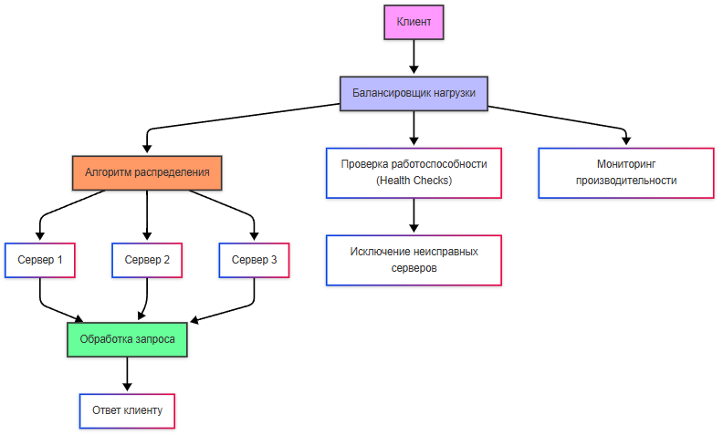
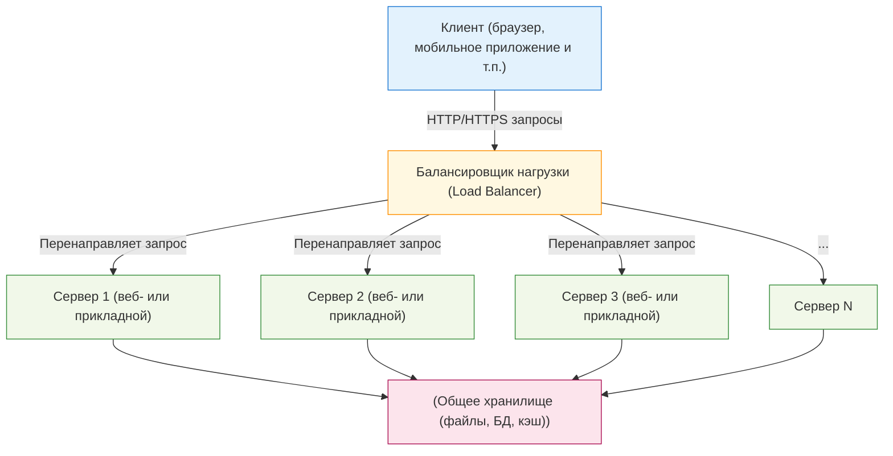
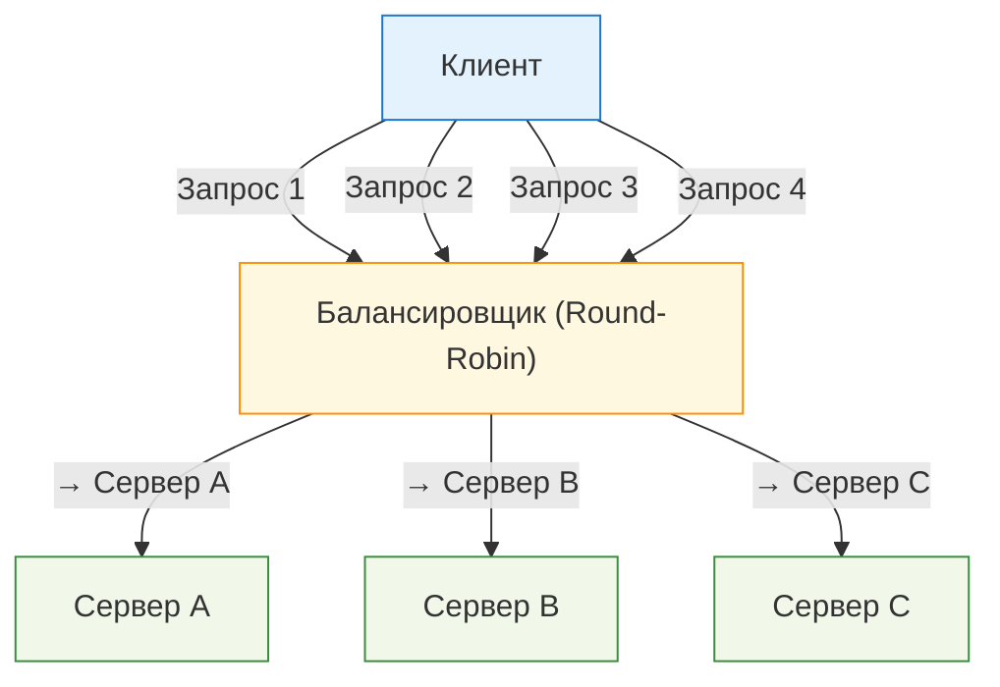
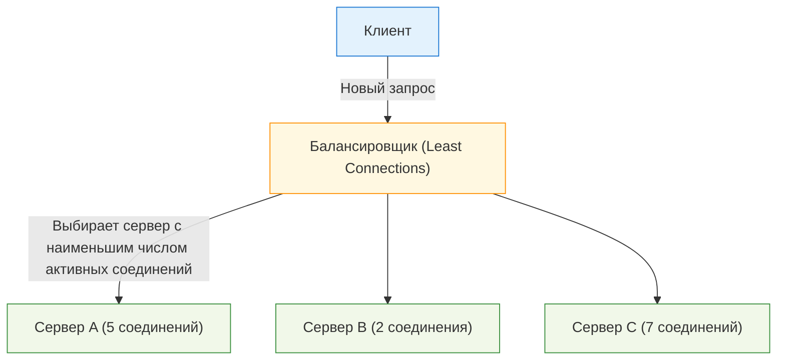
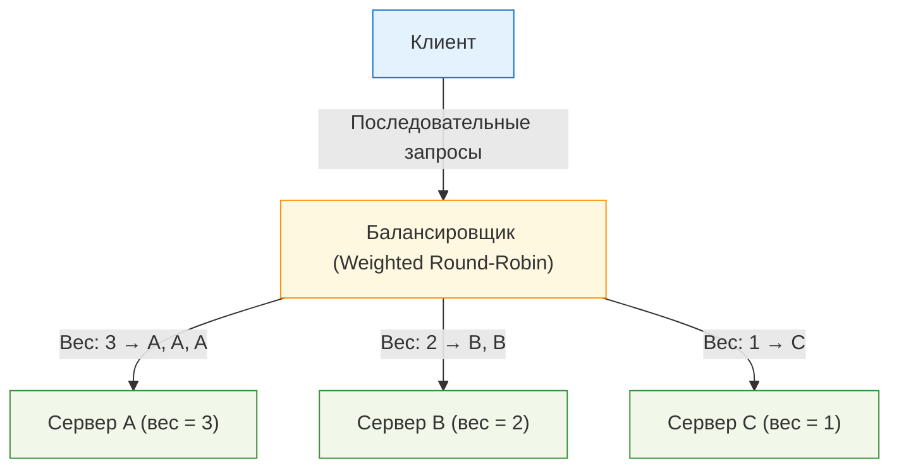
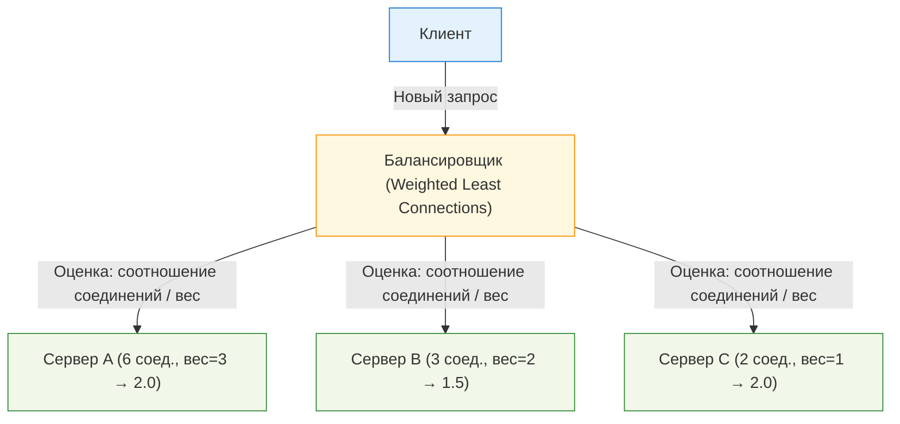
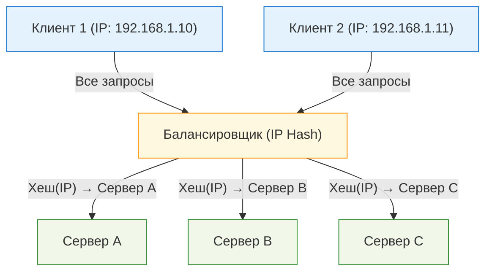
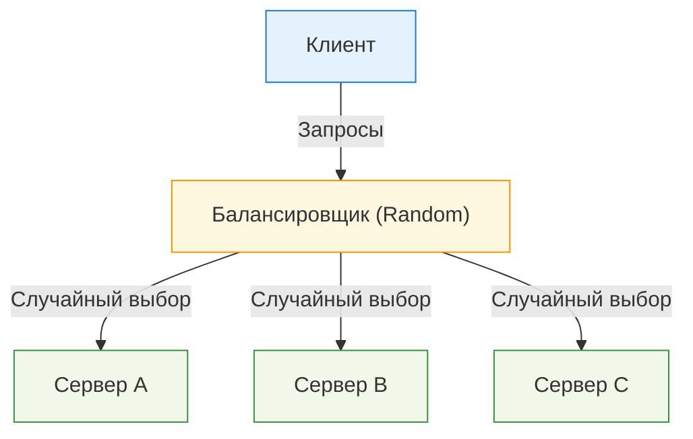

import ScalingDemo from '@site/src/components/ScalingDemo.jsx';

# Балансировка нагрузки

<div class="article-tags">
  <span class="tag tag-required">ОБЯЗАТЕЛЬНО</span>
  <span class="tag tag-beginner">ДЛЯ НОВИЧКОВ</span>
</div>

<span class="complexity-badge">Разработчику</span>
<span class="complexity-badge">Архитектору</span>
<span class="complexity-badge">Инженеру</span>

## Балансировка нагрузки

### Что такое балансировка нагрузки?

**Балансировка нагрузки** — это процесс распределения входящих запросов между несколькими серверами или узлами системы для обеспечения равномерной загрузки и предотвращения перегрузки отдельных компонентов.

**Балансировщик нагрузки** — это программное или аппаратное решение, которое управляет потоком входящих запросов и направляет их на доступные серверы или узлы. Он также может выполнять дополнительные функции, такие как мониторинг состояния серверов, проверка работоспособности (health checks) и автоматическое исключение неисправных узлов из пула.



Балансировка работает так:
	- клиент отправляет запрос на IP-адрес или доменное имя, которое указывает на балансировщик нагрузки;
	- балансировщик принимает запрос и решает, на какой сервер его направить;
	- балансировщик использует алгоритм распределения для выбора подходящего сервера;
	- перед отправкой запроса балансировщик может проверить состояние сервера;
	- запрос передаётся выбранному серверу, который обрабатывает его и возвращает ответ клиенту;
	- балансировщик постоянно отслеживает производительность серверов и их доступность - если один из них выходит из строя, балансировщик автоматически перестаёт направлять на него запросы.



<ScalingDemo />

---

### Виды балансировщиков нагрузки


Балансировщики могут быть программными, аппаратными и облачными.

Аппаратные балансировщики представляют собой специализированное оборудование, разработанное для высокопроизводительной балансировки, к примеру, F5 BIG-IP, Citrix ADC.

Облачные балансировщики же предоставляются облачными провайдерами как сервис. Как мы уже рассматривали в облачных технологиях, их предоставляют техногиганты, соответственно, это AWS Elastic Load Balancer (ELB), Google Cloud Load Balancer, Azure Load Balancer.

Программные балансировщики реализованы как часть программного обеспечения, к примеру, NGINX, HAProxy, Apache HTTP Server, Traefik. Среди функций таких балансировщиков может быть не только распределение запросов между серверами для предотвращения перегрузки, но и мониторинг состояния и шифрование HTTPS-трафика.

HAProxy (High Availability Proxy) — это балансировщик нагрузки с открытым исходным кодом, который используется для распределения входящего трафика между несколькими серверами. Он работает на уровне приложений (L7) и транспортного уровня (L4), что делает его универсальным инструментом для обеспечения высокой доступности, отказоустойчивости и производительности веб-приложений.

NGINX — веб-сервер, с функционалом балансировщика нагрузки. Он работает на уровне приложений (L7) и поддерживает различные алгоритмы балансировки.

Apache HTTP Server предоставляет модуль mod_proxy_balancer, который позволяет использовать его как балансировщик нагрузки. Это решение подходит для небольших проектов или сред, где уже используется Apache в качестве веб-сервера.

Traefik — балансировщик нагрузки, ориентированный на работу в облачных средах и микросервисной архитектуре. Он автоматически обнаруживает сервисы через интеграцию с Docker, Kubernetes, Consul и другими оркестраторами. Может быть избыточным для простых проектов.

AWS Elastic Load Balancer — это облачное решение от Amazon Web Services. Оно предлагает три типа балансировщиков: Application Load Balancer (L7), Сеть Load Balancer (L4) и Classic Load Balancer (универсальный). ELB автоматически масштабируется и интегрируется с другими сервисами AWS.

---

### Настройка и конфигурация балансировщика

**Как настроить балансировщик нагрузки?**

Рассмотрим на примере HAProxy.

Так, у нас есть приложение, запущенное в нескольких контейнерах, и оркестратор (к примеру, Docker Compose). Важный момент - мы изучим контейнеризацию и работу Docker отдельно, поэтому к этому алгоритму вы сможете вернуться позже.

#### Установить HAProxy

Установить HAProxy через пакетный менеджер или запустить его в отдельном контейнере через Docker:
```bash
docker pull haproxy:latest
```

#### Конфигурация

HAProxy работает по конфигурационному файлу haproxy.cfg. Этот файл определяет, как балансировать трафик между серверами (в нашем случае — контейнерами). 

Пример файла:

```yml
global
    log stdout format raw local0

defaults
    mode http
    timeout connect 5s
    timeout client 30s
    timeout server 30s

frontend http_front
    bind *:80
    default_backend http_back

backend http_back
    balance roundrobin
    server app1 192.168.1.101:80 check
    server app2 192.168.1.102:80 check
```

Здесь:
	- frontend — это «вход» для трафика. Мы говорим HAProxy слушать порт 80.
	- backend — это «выход», куда HAProxy будет направлять запросы. Мы указали два сервера (app1 и app2), между которыми будет распределяться нагрузка.
	- balance roundrobin — алгоритм балансировки. Запросы будут отправляться по очереди на каждый сервер.

#### Запуск HAProxy в Docker

Нужно создать Docker Compose файл, чтобы запустить HAProxy вместе с контейнерами. 

В файле docker-compose.yml нужно указать соответственно два контейнера с приложением (app1 и app2), запустить их на портах, и также дополнительно запустить haproxy:

```yml
version: '3'
services:
  app1:
    image: your-app-image
    ports:
      - "8081:80"
  
  app2:
    image: your-app-image
    ports:
      - "8082:80"

  haproxy:
    image: haproxy:latest
    volumes:
      - ./haproxy.cfg:/usr/local/etc/haproxy/haproxy.cfg
    ports:
      - "80:80"
    depends_on:
      - app1
      - app2
```

#### Запуск

Запускаем всё, в нашем случае, через Docker Compose. После этого HAProxy начнёт принимать запросы на порту 80 и перенаправлять их на контейнеры app1 и app2.


#### Проверка работы

В нашем случае, достаточно открыть http://localhost и там можно будет увидеть, что запросы распределяются между контейнерами.

Для более сложных систем (например, Kubernetes) имеется возможность можно настроить HAProxy для автоматического обнаружения контейнеров через Consul.

Пример конфигурации для Consul:
```
backend http_back
    balance roundrobin
    server-template app 2 _app._tcp.service.consul resolvers consul resolve-prefer ipv4 check
```

Здесь HAProxy будет использовать DNS-записи для поиска доступных серверов.

Примерно по такому алгоритму и выполняется балансировка нагрузки. Готовые контейнеры запускаются довольно легко, если конфигурация корректна.

---

## Алгоритмы балансировки нагрузки

Какие алгоритмы использует балансировка нагрузки?

### Round-robin (RR)

Запросы распределяются по очереди между всеми серверами без учёта их загрузки - если есть 3 сервера (A, B, C), запросы будут направлены в порядке `A → B → C → A → B → C`.



---

### Least Connections (LC)

Запрос направляется на сервер с наименьшим количеством активных соединений, что определяется путём постоянного мониторинга состояния серверов.



---

### Weighted Round-Robin (WRR)

Аналогично round-robin, но серверам присваиваются веса (например, мощные серверы получают больше запросов). Распределение будет по весу - сервер A (вес 3), сервер B (вес 2), сервер C (вес 1). Распределение будет A → A → A → B → B → C. Веса настраиваются вручную.



---

### Weighted Least Connections (WLC)

**Weighted Least Connections (WLC)** — это комбинация Least Connections и Weighted Round-Robin. Учитывает как количество активных соединений, так и вес серверов.



---

### IP Hash

**IP Hash** распределяет запросы на основе хеша IP-адреса клиента, к примеру, клиент с IP 192.168.1.1 всегда будет направлен на сервер A.



---

### Random

**Random** направляет запросы на случайный сервер. Но здесь может быть неравномерная нагрузка.



---