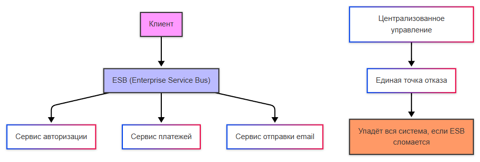
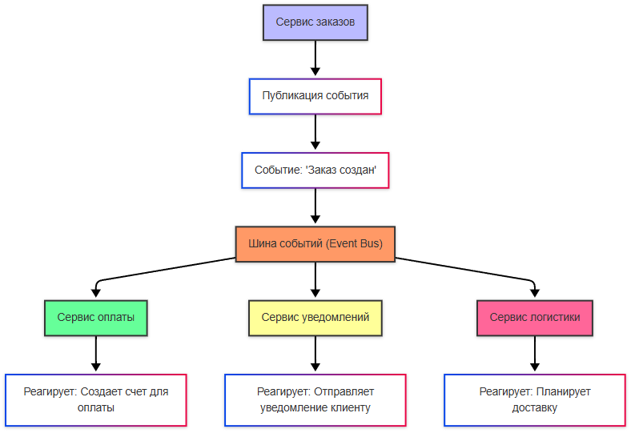

import InfraDiagramStudio from '@site/src/components/InfraDiagramStudio.jsx';

# Коммуникация и интеграция

<div class="article-tags">
  <span class="tag tag-required">ОБЯЗАТЕЛЬНО</span>
  <span class="tag tag-beginner">ДЛЯ НОВИЧКОВ</span>
</div>

<span class="complexity-badge">Разработчику</span>
<span class="complexity-badge">Архитектору</span>
<span class="complexity-badge">Инженеру</span>

> **Основы:** термины, контракт и типы взаимодействия — [Интеграция](/encyclopedia/2-system-network/2-09-osnovy-integratsionnogo-vzaimodeystviya/1).

---

## Коммуникация и интеграция

### Что такое коммуникация и интеграция?

**Коммуникация микросервисов** — это процесс взаимодействия между независимыми сервисами, которые составляют распределённую систему. В отличие от монолита, где все компоненты находятся в одном процессе, микросервисы должны взаимодействовать через сеть.

**Интеграция микросервисов** — это процесс объединения независимых сервисов в единую систему, чтобы они могли эффективно взаимодействовать и решать общие задачи.

**Интеграционные взаимодействия** — это способы обмена данными и координации между различными системами, приложениями или сервисами. В зависимости от характера взаимодействия их можно разделить на три основных типа: синхронные , асинхронные и реактивные.

Контракт в контексте интеграций — это формальное соглашение между взаимодействующими системами, которое определяет:
	- Формат данных (структура, типы полей, кодировка).
	- Правила обмена данными (протокол, методы передачи, синхронизация).
	- Обязательные и необязательные значения (поля, которые должны или могут быть заполнены).

---

#### Пример формата данных —

```json
{
  "order_id": "ORD-2026-02-27-001",
  "customer_id": "CUST-12345",
  "order_date": "2026-02-27T15:30:00Z",
  "items": [
    {
      "product_id": "PROD-001",
      "quantity": 2,
      "price": 1500.00,
      "currency": "RUB"
    },
    {
      "product_id": "PROD-002",
      "quantity": 1,
      "price": 3000.00,
      "currency": "RUB"
    }
  ],
  "total_amount": 6000.00,
  "shipping_address": {
    "street": "ул. Ленина, д.10",
    "city": "Москва",
    "postal_code": "123456",
    "country": "Россия"
  },
  "payment_method": "card",
  "status": "created"
}
```

---

#### Пример правил обмена данными —

**Протокол и методы:**
- HTTP/HTTPS с использованием RESTful API
- Методы: `GET`, `POST`, `PUT`, `DELETE`
- Content-Type: `application/json`
- Accept: `application/json`
- Authorization: `Bearer {token}`

**Синхронизация:**
- Таймаут запроса: 30 секунд
- Повторные попытки: максимум 3 раза с экспоненциальной задержкой
- Идемпотентность: использование идентификаторов запросов (X-Request-ID)

**Формат ответов:**
```json
{
  "success": true,
  "Данные": {},
  "errors": [],
  "timestamp": "2026-02-27T15:30:00Z",
  "request_id": "REQ-2026-02-27-001"
}
```

---

#### Пример обязательных и необязательных значений —


**Обязательные поля (required):**
```json
{
  "order_id": "ORD-2026-02-27-001",      // Обязательный уникальный идентификатор заказа
  "customer_id": "CUST-12345",            // Обязательный идентификатор клиента
  "items": [],                            // Обязательный массив товаров (не может быть пустым)
  "total_amount": 6000.00,                // Обязательная итоговая сумма
  "status": "created"                     // Обязательный статус заказа
}
```

**Необязательные поля (optional):**
```json
{
  "description": "Подарочный набор",      // Описание заказа (может отсутствовать)
  "discount_code": "WINTER2026",          // Промокод (может отсутствовать)
  "priority": "high",                     // Приоритет обработки (по умолчанию "normal")
  "notes": "Срочная доставка",           // Дополнительные заметки (может отсутствовать)
  "metadata": {}                          // Дополнительные метаданные (может отсутствовать)
}
```

**Валидация:**
- Обязательные поля проверяются на наличие и корректность формата
- Необязательные поля игнорируются при отсутствии или некорректном формате
- Система возвращает ошибку 400 Bad Request при отсутствии обязательных полей
- Система принимает запрос с отсутствующими необязательными полями без ошибок


Контракты обеспечивают согласованность между системами и предотвращают ошибки при обмене данными.

Обязательные значения — это поля, которые всегда должны присутствовать в сообщении. Например, если система ожидает user_id для идентификации пользователя, то это поле должно быть обязательным.

Необязательные значения могут отсутствовать, и система должна корректно обрабатывать их отсутствие. Например, поле description может быть необязательным.

---

### Данные

**Payload** — это фактические данные, передаваемые между системами. В зависимости от типа данных payload может быть нескольких видов:
1. **Малые данные** - простые структуры (например, JSON-объекты или строк). К примеру, сообщение об успехе операции вроде "success".
2. **Двоичные данные** - файлы, изображения, видео или другие бинарные форматы. Передаются через протоколы, поддерживающие двоичные данные (например, HTTP с multipart/form-data или WebSocket).
3. **Большие данные** - сложные структуры данных, большие массивы или файлы. Например, CSV-файл с миллионами записей.
4. **Форматы сериализации**:
	- JSON;
	- Protobuf (Protocol Buffers);
	- XML.

Обязательность обеспечивает, что все необходимые данные передаются корректно. Если поле order_id обязательно, то система должна вернуть ошибку, если оно отсутствует.

Сертификация предполагает использование сертификации для обеспечения безопасности и совместимости. К примеру, HTTPS использует SSL/TLS-сертификаты для шифрования данных.

Процесс проверки данных на соответствие называется валидацией. Валидация может быть строгой, когда все данные проверяются на соответствие контракту, а в случае несоответствия - запрос отклоняется; и нестрогой, когда система игнорирует дополнительные поля или незначительные нарушения контракта.

---

#### Пример малых данных (JSON)

```json
{
  "event_type": "order_created",
  "order_id": "ORD-2026-02-27-001",
  "status": "success",
  "timestamp": "2026-02-27T15:30:00Z"
}
```

---

#### Пример двоичных данных

**HTTP-запрос с двоичными данными (multipart/form-data):**

```
POST /api/upload HTTP/1.1
Host: api.example.com
Content-Type: multipart/form-data; boundary=----WebKitFormBoundary7MA4YWxkTrZu0gW
Authorization: Bearer {token}

------WebKitFormBoundary7MA4YWxkTrZu0gW
Content-Disposition: form-data; name="file"; filename="document.pdf"
Content-Type: application/pdf

%PDF-1.7
%
1 0 obj
<</Type/Catalog/Pages 2 0 R>>
endobj
2 0 obj
<</Type/Pages/Count 1/Kids[3 0 R]>>
endobj
3 0 obj
<</Type/Page/MediaBox[0 0 612 792]/Resources<<>>/Contents 4 0 R>>
endobj
4 0 obj
<</Length 44>>
stream
BT
/F1 12 Tf
100 700 Td
(Пример документа) Tj
ET
endstream
endobj
xref
0 5
0000000000 65535 f
0000000010 00000 n
0000000053 00000 n
0000000102 00000 n
0000000172 00000 n
trailer
<</Size 5/Root 1 0 R>>
startxref
247
%%EOF
------WebKitFormBoundary7MA4YWxkTrZu0gW
Content-Disposition: form-data; name="metadata"

{"description":"Отчёт за февраль","category":"finance"}
------WebKitFormBoundary7MA4YWxkTrZu0gW--
```


---

#### Пример больших данных

**CSV-файл с миллионами записей:**

```csv
order_id,customer_id,product_id,quantity,price,currency,order_date,shipping_city
ORD-2026-000001,CUST-12345,PROD-001,2,1500.00,RUB,2026-01-01T10:00:00Z,Москва
ORD-2026-000002,CUST-12346,PROD-002,1,3000.00,RUB,2026-01-01T10:05:00Z,Санкт-Петербург
ORD-2026-000003,CUST-12347,PROD-003,5,500.00,RUB,2026-01-01T10:10:00Z,Екатеринбург
ORD-2026-000004,CUST-12348,PROD-001,3,1500.00,RUB,2026-01-01T10:15:00Z,Новосибирск
ORD-2026-000005,CUST-12349,PROD-004,1,7500.00,RUB,2026-01-01T10:20:00Z,Казань
...
(1 000 000 строк)
```

**JSON-массив с большим количеством записей:**

```json
{
  "batch_id": "BATCH-2026-02-27-001",
  "total_records": 1000000,
  "processed": 0,
  "records": [
    {
      "id": "REC-000001",
      "timestamp": "2026-02-27T00:00:00Z",
      "value": 123.45,
      "metadata": {"source": "sensor-A", "location": "zone-1"}
    },
    {
      "id": "REC-000002",
      "timestamp": "2026-02-27T00:00:01Z",
      "value": 124.32,
      "metadata": {"source": "sensor-A", "location": "zone-1"}
    },
    ...
    (1 000 000 записей)
  ]
}
```


---

#### Пример формата для сериализации

JSON (JavaScript Object Notation)

```json
{
  "user": {
    "id": 12345,
    "name": "Иван Иванов",
    "email": "ivan@example.com",
    "age": 30,
    "is_active": true,
    "roles": ["admin", "editor"],
    "created_at": "2026-01-15T10:30:00Z"
  }
}
```

XML (eXtensible Markup Language)

```xml
<?xml version="1.0" encoding="UTF-8"?>
<user>
  <id>12345</id>
  <name>Иван Иванов</name>
  <email>ivan@example.com</email>
  <age>30</age>
  <is_active>true</is_active>
  <roles>
    <role>admin</role>
    <role>editor</role>
  </roles>
  <created_at>2026-01-15T10:30:00Z</created_at>
</user>
```

Protocol Buffers (Protobuf)

**Определение схемы (.proto):**

```protobuf
syntax = "proto3";

message User {
  int32 id = 1;
  string name = 2;
  string email = 3;
  int32 age = 4;
  bool is_active = 5;
  repeated string roles = 6;
  string created_at = 7;
}
```

**Сериализованные данные (бинарный формат):**

```
08 96 49 12 0C D0 98 D1 81 D0 B2 D0 B0 D0 BD 1A 11 69 76 61 6E 40 65 78 61 6D 70 6C 65 2E 63 6F 6D 20 1E 28 01 32 05 61 64 6D 69 6E 32 06 65 64 69 74 6F 72 3A 15 32 30 32 36 2D 30 31 2D 31 35 54 31 30 3A 33 30 3A 30 30 5A
```

MessagePack (бинарный формат)

```hex
87 A4 75 73 65 72 87 A2 69 64 CE 00 00 30 39 A4 6E 61 6D 65 AA D0 98 D0 B2 D0 B0 D0 BD 20 D0 98 D0 B2 D0 B0 D0 BD D0 BE D0 B2 A5 65 6D 61 69 6C B1 69 76 61 6E 40 65 78 61 6D 70 6C 65 2E 63 6F 6D A3 61 67 65 1E A9 69 73 5F 61 63 74 69 76 65 C3 A5 72 6F 6C 65 73 92 A5 61 64 6D 69 6E A6 65 64 69 74 6F 72 A9 63 72 65 61 74 65 64 5F 61 74 BA 32 30 32 36 2D 30 31 2D 31 35 54 31 30 3A 33 30 3A 30 30 5A
```

Avro (Apache Avro)

**Схема (.avsc):**

```json
{
  "type": "record",
  "name": "User",
  "fields": [
    {"name": "id", "type": "int"},
    {"name": "name", "type": "string"},
    {"name": "email", "type": "string"},
    {"name": "age", "type": "int"},
    {"name": "is_active", "type": "boolean"},
    {"name": "roles", "type": {"type": "array", "items": "string"}},
    {"name": "created_at", "type": "string"}
  ]
}
```

**Сериализованные данные (бинарный формат):**

```
06 96 49 D0 98 D1 81 D0 B2 D0 B0 D0 BD 69 76 61 6E 40 65 78 61 6D 70 6C 65 2E 63 6F 6D 1E 01 02 61 64 6D 69 6E 65 64 69 74 6F 72 32 30 32 36 2D 30 31 2D 31 35 54 31 30 3A 33 30 3A 30 30 5A
```


---

## Виды интеграции

### Основные подходы

Интеграция выполняется по следующим подходам:
1. **Прямые вызовы (Point-to-Point)**, когда каждый сервис напрямую вызывает API других сервисов.

<InfraDiagramStudio initialTemplate="pointToPointMesh" title="Point-to-Point" subtitle="Прямые API-вызовы между сервисами" />

2. **Шина интеграции (Integration Bus)**, когда центральная шина (ESB, Enterprise Service Bus) управляет взаимодействием между сервисами.

<InfraDiagramStudio initialTemplate="soa" title="Integration Bus (ESB)" subtitle="Центральная шина и сервисы по краям" />

3. **Событийно-ориентированная интеграция**, когда сервисы взаимодействуют через публикацию и подписку на события (Apache Kafka).

<InfraDiagramStudio initialTemplate="integrationEventBus" title="Событийная интеграция (Kafka)" />

---

### Интеграционная шина

**Интеграционная шина (Enterprise Service Bus, ESB)** — это архитектурный подход, при котором используется центральный компонент для управления взаимодействием между сервисами. ESB предоставляет стандартные механизмы для маршрутизации, преобразования данных и координации сервисов.

Она выполняет функции перенаправления запросов между сервисами, преобразования форматов данных (XML → JSON), логирование всех взаимодействий и управление доступом. Но, как можно заметить, эта шина и становится единой точкой отказа - если сервисы умирают, вся структура ещё работает, но если упадёт шина - всё остановится, и шина является узким местом при высоких нагрузках.

ESB характерна для **SOA-архитектуры** (Service-Oriented Architecture):



---

### Событийно-ориентированная архитектура

**Event-Driven Architecture (EDA)** определяет, что сервисы публикуют события, а другие сервисы подписываются на них.

Сервис публикует событие, например, "заказ создан", и это событие отправляется в шину событий (Event Bus), которая выступает центральным каналом для передачи событий. 

Шина событий получает событие и рассылает его всем заинтересованным сервисам. Разные сервисы подписываются на события и реагируют на них. К примеру, сервис оплаты создаёт счёт для оплаты, сервис уведомлений формирует и отправляет уведомление клиенту, а сервис логистики планирует доставку.




---

## См. также

Базовая глава в разделе «Система и сеть» — [Интеграция](/encyclopedia/2-system-network/2-09-osnovy-integratsionnogo-vzaimodeystviya/1).

---
---

{/* http-basics-link  */}
:::tip Основа по протоколу
Базовый разбор HTTP и HTTPS находится в отдельной статье — [HTTP как основа веб-интеграций](/encyclopedia/2-system-network/2-09-osnovy-integratsionnogo-vzaimodeystviya/118).
:::

