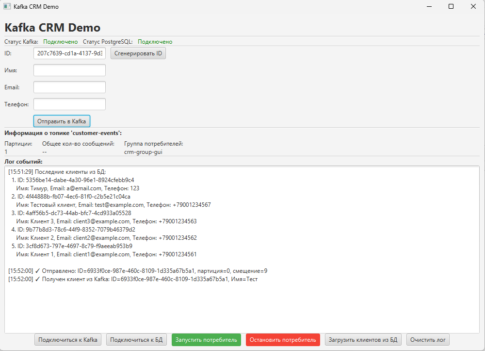
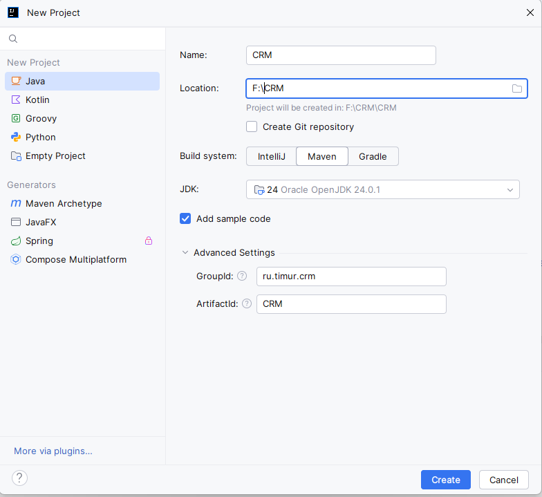
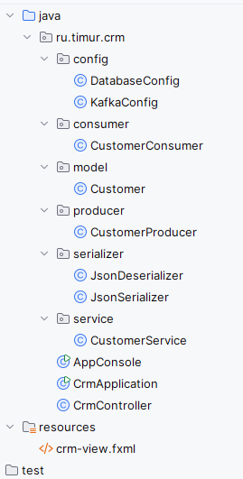

# Java-приложение с Apache Kafka и PostgreSQL

<div class="article-tags">
  <span class="tag tag-required">ОБЯЗАТЕЛЬНО</span>
  <span class="tag tag-beginner">ДЛЯ НОВИЧКОВ</span>
</div>

<span class="complexity-badge">Разработчику</span>
<span class="complexity-badge">Архитектору</span>
<span class="complexity-badge">Инженеру</span>

## Подготовка

Я уверен, что вы пришли сюда за практикой работы с Kafka, а не только за теорией.

Давайте разбираться, и попробуем вместе с вами собрать приложение, которое будет, словно CRM, подключаться к Kafka, работать с базой данных, добавлять и отправлять. Возможно, так будет эффективнее.



Нас ожидает тот ещё квест, если вы не работали с Kafka. Начнём с приготовлений.

---

### Используемые технологии

Для начала работы нам потребуется:
- Kafka;
- PostgreSQL;
- Java;
- Intellij IDEA.

---

### Системные требования

На компьютере нужно будет минимум 4 ГБ оперативной памяти, 10 ГБ свободного места на диске.

---

### Общая схема

Общая схема архитектуры нашего приложения будет такова:

```
Клиент → Producer → Kafka → Consumer → База данных
                ↓
           Мониторинг
```

Эта схема отражает основной принцип работы систем на основе Apache Kafka: **разделение отправки и обработки данных во времени и пространстве**.

- **Producer (Издатель)** — это часть нашего приложения, которая отвечает за отправку событий (в нашем случае — информации о новом клиенте) в Kafka. Она не знает и не заботится о том, кто и когда будет эти данные читать.
- **Kafka** выступает в роли надёжного буфера-очереди. Она принимает сообщения, сохраняет их на диске и гарантирует их доставку подписчикам, даже если потребитель временно недоступен.
- **Consumer (Потребитель)** — это фоновый процесс, который постоянно «слушает» указанный топик (`customer-events`). Как только появляется новое сообщение, он его забирает и выполняет полезную работу — в нашем случае сохраняет данные в PostgreSQL.
- **База данных** — это конечное хранилище, где информация о клиентах хранится долговременно и структурированно.

Такой подход позволяет:
- **Разгрузить пользовательский интерфейс**: отправка в Kafka происходит быстро и асинхронно, поэтому GUI не зависает.
- **Повысить отказоустойчивость**: если база данных временно недоступна, сообщения останутся в Kafka и будут обработаны позже, как только потребитель сможет подключиться.
- **Масштабировать систему**: в будущем к одному и тому же топику можно будет подключить несколько разных потребителей для выполнения различных задач (например, отправка email-уведомлений, обновление аналитической базы данных и так далее).

Само приложение будет написано на языке программирования Java, подключаться к базе данных на PostgreSQL, и обладать графическим интерфейсом.

Реализация будет отправлять клиентов в Kafka, а фоновый потребитель (consumer) будет постоянно слушать топик и сохранять данные в PostgreSQL:

```
[GUI] → Отправка в Kafka → [Топик customer-events] → Потребитель → Сохранение в БД
                              ↑
                      Фоновый поток (не блокирует UI)
```

---

### Подготовка и установка

#### Kafka

Начнём с установки Kafka. Я в примере использовал версию 4.2.0.

Скачайте последнюю версию с сайта `https://kafka.apache.org/community/downloads/`.

Лучше качать бинарную версию, например, у меня была `kafka_2.13-4.2.0.tgz`. Эта запись расшифровывается так:
- `kafka` — имя проекта.
- `2.13` — версия языка Scala, на котором скомпилирована эта сборка Kafka. Это внутренняя деталь, и для большинства пользователей, которые используют Kafka только как брокер сообщений через клиентские библиотеки (как мы с Java), это значение не имеет принципиального значения.
- `4.2.0` — версия самого Apache Kafka. 

Для Windows рекомендую распаковать папку из архива в папку `C:\kafka` так, чтобы у вас получилось по этому пути следующее содержимое:
```
kafka/
├── bin/
│   ├── windows/
├── config/
├── Данные/
├── libs/
├── licenses/
├── logs/
├── site-docs/
└── LICENSE
└── NOTICE
```

> **💡 Совет**
> Хотя Kafka официально лучше всего работает в Unix-подобных системах (Linux, macOS), её можно запустить и на Windows. Для серьёзной разработки или продакшена настоятельно рекомендуется использовать WSL2 (Windows Subsystem for Linux) или полноценную виртуальную машину с Linux.

---

#### Java

Во-первых, установите JDK.

`https://www.oracle.com/java/technologies/downloads/`

Убедитесь, что Java установлена:
```bash
java -version
```

Во-вторых, установите Intellij IDEA:

`https://www.jetbrains.com/Рu/idea/download/?section=windows`

---

#### PostgreSQL

Установите PostgreSQL и pgAdmin.

`https://www.postgresql.org/download/`

Установка может занять некоторое время, но я думаю, что вы справитесь!

Нам понадобится программа pgAdmin для работы с базой данных, поэтому убедитесь, что она установлена и попробуйте её хотя бы раз запустить.

---

## Конфигурация Kafka

### Проблемы с версиями

Раньше (в версиях `3.x`) разработчики клали примеры KRaft-конфигов в отдельную папку, чтобы не ломать привычный `server.properties` со старыми ZooKeeper-настройками. Начиная с версии 4.0, когда ZooKeeper полностью убрали, файл `config/server.properties` переписали под чистый KRaft.

Kafka не могла управлять собой сама и для хранения своего состояния (какие топики есть, кто является лидером) использовала ZooKeeper как внешний костыль. Это создавало сложности: нужно было администрировать две разные системы, а при больших нагрузках ZooKeeper начинал "тормозить". С версии 4.0 ZooKeeper удалили навсегда, сделав KRaft единственным способом запуска. Вам нужно забыть про `zookeeper.properties`.

В корневой папке config есть файл `server.properties`, но могут возникнуть проблемы, поэтому допустимо создать свой файл конфигурации, что мы и сделаем. 

Важно:  Используйте обратные слеши `\` в PowerShell/CMD, а не прямые `/`. Если будете работать в GitBash или на Linux, то `/`, если в CMD/PowerShell то `\`.

---

### Настройка конфигурации

Мы создадим собственный файл конфигурации `kraft-single.properties` для запуска Kafka в режиме одного узла (single-node cluster). Это идеально подходит для локальной разработки и обучения.

1. Создайте файл `kraft-single.properties` в папке `C:\kafka\config`.
2. Добавьте в него следующее содержимое:

```bash
# Роли процесса (и брокер, и контроллер в одном узле)
process.roles=broker,controller
node.id=1
controller.quorum.voters=1@localhost:9093

# Слушатели для разных протоколов
listeners=CONTROLLER://localhost:9093,PLAINTEXT://localhost:9092

# Объявляем, какой listener используется для контроллера
controller.listener.names=CONTROLLER

# Маппинг протоколов безопасности (CONTROLLER использует PLAINTEXT)
listener.Безопасность.protocol.map=CONTROLLER:PLAINTEXT,PLAINTEXT:PLAINTEXT

# Папка для данных (создайте эту папку или укажите существующую)
log.dirs=C:/kafka/Данные

# Базовые настройки (можно менять по желанию)
num.partitions=1
default.replication.factor=1
offsets.topic.replication.factor=1
transaction.state.log.replication.factor=1
transaction.state.log.min.isr=1
log.retention.hours=168
log.segment.bytes=1073741824
log.retention.check.interval.ms=300000

# Адрес для клиентов (важно!)
advertised.listeners=PLAINTEXT://localhost:9092
```

Что мы настроили здесь:
- `listeners` — теперь перечислены оба `listener`-а: `CONTROLLER` на порту 9093 и `PLAINTEXT` на порту 9092;
- `controller.listener.names=CONTROLLER` — указывает, какой `listener` используется для межконтроллерного общения;
- `listener.Безопасность.protocol.map` — обязательный маппинг для обоих типов.

Такой конфиг настроит слушатели, чтобы не было ошибок (но не гарантирую!).

В стандартном `server.properties` из дистрибутива Kafka 4.2.0 нет настройки `process.roles` и `controller.quorum.voters` — без них KRaft не знает, в каком режиме запускаться (как брокер, как контроллер или как оба). Поэтому для одиночного узла лучше создать такой конфигурационный файл.

Обратите внимание, что для версии Windows существует папка `C:\kafka\bin\windows`, в которой лежит много `.bat` файлов. Запомните их.

**`process.roles`** — это ключевая настройка KRaft-режима. Она определяет, какие функции будет выполнять данный узел Kafka.
- **`broker`** — отвечает за хранение данных (топиков) и обработку запросов от продюсеров и консьюмеров.
- **`controller`** — управляет метаданными кластера: знает о всех топиках, партициях, их лидерах и состоянии узлов.

В нашем случае, поскольку мы разворачиваем всё на одной машине, один и тот же процесс берёт на себя обе роли.

**`node.id`** — уникальный числовой идентификатор этого узла в пределах всего кластера. В single-node конфигурации он может быть любым, но обычно выбирают `1`.

**`controller.quorum.voters`** — список всех узлов, которые участвуют в принятии решений контроллером (quorum). Формат записи: `<node.id>@<hostname>:<port>`.

Поскольку у нас только один узел с `node.id=1`, слушающий на `localhost:9093`, именно он и указан здесь. Эта настройка позволяет контроллеру понять, с кем ему нужно синхронизироваться.

**`listeners`** — определяет, на каких сетевых интерфейсах и портах будет слушать наш узел. У нас два слушателя:
- **`CONTROLLER://localhost:9093`** — используется исключительно для внутреннего общения между контроллерами (в нашем случае — сам с собой).
- **`PLAINTEXT://localhost:9092`** — используется для общения с клиентами (нашими Java-приложениями — продюсерами и консьюмерами).

**`controller.listener.names`** — явно указывает, какой из слушателей, перечисленных в `listeners`, предназначен для внутреннего трафика контроллера. Это обеспечивает чёткое разделение ролей.

**`listener.Безопасность.protocol.map`** — задаёт соответствие между именем слушателя и фактическим протоколом безопасности.
- `CONTROLLER:PLAINTEXT` означает, что для слушателя `CONTROLLER` будет использоваться незашифрованное соединение (`PLAINTEXT`).
- `PLAINTEXT:PLAINTEXT` означает то же самое для клиентского слушателя. Для продакшена здесь следует использовать `SSL` или `SASL_SSL`.

**`log.dirs`** — путь к директории, где Kafka будет хранить все свои данные: логи топиков, индексы и метаданные. Убедитесь, что эта папка существует, или создайте её вручную перед запуском.

- **`num.partitions=1`** — каждый новый топик будет создан с одной партицией. Партиции позволяют распараллеливать обработку, но для нашего примера одной достаточно.
- **`default.replication.factor=1`** — фактор репликации по умолчанию равен 1, то есть данные не будут дублироваться на другие узлы (их у нас и нет).
- Остальные параметры (`offsets.topic...`, `transaction.state.log...`) настраивают системные топики Kafka. Их фактор репликации также установлен в `1`, так как у нас single-node кластер.

- **`log.retention.hours=168`** — сообщения в топиках будут автоматически удаляться через 168 часов (7 дней).
- **`log.segment.bytes`** — максимальный размер одного сегмента лога (файла на диске).
- **`log.retention.check.interval.ms`** — интервал, с которым Kafka проверяет, какие сегменты пора удалить.

**`advertised.listeners`** — самый важный параметр для клиентов. Он сообщает продюсерам и консьюмерам, по какому адресу и порту с ним можно связаться. В нашем случае это `localhost:9092`. Если бы Kafka работала на удалённом сервере, здесь нужно было бы указать его публичный IP-адрес или доменное имя.

---

### Получение uuid

Перед первым запуском KRaft нужно сгенерировать ID кластера.

Откройте Git Bash в папке `C:/kafka/` и выполните команду:

```bash
$ bin/windows/kafka-storage.bat random-uuid
```

Если будете использовать обычный терминал Windows (CMD/Powershell), то обратите внимание, команда будет выглядеть иначе:

```bash
bin\windows\kafka-storage.bat random-uuid
```

Запомните разницу, не перепутайте.

Как заметили, система будет обращаться к файлу `kafka-storage.bat` и генерировать случайный `uuid`. 

К примеру, вы можете получить что-то вроде:
```bash
2026-04-09T06:03:59.109257100Z main ERROR Reconfiguration failed: No configuration found for '5acf9800' at 'null' in 'null'
w4BJSOSHQHRdLTEmM0ZA-w
```

Если вы увидели ошибку, как выше - ничего страшного, но она будет связана с Log4j - это для логирования, так что не пугайтесь. Нас интересует следующая строка, к примеру как тут:
```
w4BJSOSHQHRdLTEmM0ZA-w
```

Это ваш Cluster ID. Скопируйте полученную строку.

К слову, на Linux это было бы так:

```bash
./bin/kafka-storage.sh random-uuid
```

---

### Форматирование хранилища

После получения ID кластера, нужно отформатировать хранилище.

Для Linux:
```bash
./bin/kafka-storage.sh format -t <ваш-uuid> -c ./config/kraft/kraft-single.properties
```

Для Windows:
```bash
bin\windows\kafka-storage.bat format -t <ваш-uuid> -c config\kraft-single.properties
```


---

### Запуск Kafka

Для запуска Kafka, выполните команду:

```bash
bin\windows\kafka-server-start.bat config\kraft-single.properties
```

После запуска вы должны увидеть что-то вроде:
```bash
[2026-04-09 08:xx:xx,xxx] INFO [ControllerServer id=1] Started.
[2026-04-09 08:xx:xx,xxx] INFO [BrokerServer id=1] Started.
```

При запуске на Windows, мы можем получить ошибку:
```bash
'wmic' is not recognized as an internal or external command,
operable program or batch file.
```

Эта проблема связана с тем, что, начиная с Windows 10 (версия 21H1), Microsoft удалила старую консольную утилиту `wmic.exe` по умолчанию. Старые скрипты запуска Kafka (даже в версии 4.2.0) всё ещё пытаются её вызвать, чтобы определить разрядность системы, и, не находя её, падают с этой ошибкой. 

Bash-скрипт будет чистый, и с Linux проблемы такой не будет. Куда деваться, разница систем даёт знать.

Откройте файл `C:\kafka\bin\windows\kafka-server-start.bat` в блокноте. Там будет вызов `wmic`. К примеру, может быть что-то вроде:
```bash
IF [%1] EQU [] (
	echo USAGE: %0 server.properties
	EXIT /B 1
)

SetLocal
IF ["%KAFKA_LOG4J_OPTS%"] EQU [""] (
    set KAFKA_LOG4J_OPTS=-Dlog4j2.configurationFile=%~dp0../../config/log4j2.yaml
)
IF ["%KAFKA_HEAP_OPTS%"] EQU [""] (
    rem detect OS architecture
    wmic os get osarchitecture | find /i "32-bit" >nul 2>&1
    IF NOT ERRORLEVEL 1 (
        rem 32-bit OS
        set KAFKA_HEAP_OPTS=-Xmx512M -Xms512M
    ) ELSE (
        rem 64-bit OS
        set KAFKA_HEAP_OPTS=-Xmx1G -Xms1G
    )
)
"%~dp0kafka-run-class.bat" kafka.Kafka %*
EndLocal
```

Замените блок с IF ["%KAFKA_HEAP_OPTS%"] EQU [""] на следующий:
```bash
IF ["%KAFKA_HEAP_OPTS%"] EQU [""] (
    rem Skip WMIC detection for modern Windows
    set KAFKA_HEAP_OPTS=-Xmx1G -Xms1G
)
```

Весь файл будет выглядеть как-то так:

```bash
@echo off
rem Licensed to the Apache Software Foundation (ASF) under one or more
rem contributor license agreements.  See the NOTICE file distributed with
rem this work for additional information regarding copyright ownership.
rem The ASF licenses this file to You under the Apache License, Version 2.0
rem (the "License"); you may not use this file except in compliance with
rem the License.  You may obtain a copy of the License at
rem
rem     http://www.apache.org/licenses/LICENSE-2.0
rem
rem Unless required by applicable law or agreed to in writing, software
rem distributed under the License is distributed on an "AS IS" BASIS,
rem WITHOUT WARRANTIES OR CONDITIONS OF ANY KIND, either express or implied.
rem See the License for the specific language governing permissions and
rem limitations under the License.

IF [%1] EQU [] (
	echo USAGE: %0 server.properties
	EXIT /B 1
)

SetLocal
IF ["%KAFKA_LOG4J_OPTS%"] EQU [""] (
    set KAFKA_LOG4J_OPTS=-Dlog4j2.configurationFile=%~dp0../../config/log4j2.yaml
)
IF ["%KAFKA_HEAP_OPTS%"] EQU [""] (
    rem Skip WMIC detection for modern Windows
    set KAFKA_HEAP_OPTS=-Xmx1G -Xms1G
)
"%~dp0kafka-run-class.bat" kafka.Kafka %*
EndLocal
```

Тогда можно повторить, и Kafka успешно запустится. Если всё сделать правильно, после запуска Kafka сообщит в консоли:
```bash
INFO [KafkaRaftServer nodeId=1] Kafka Server started (kafka.server.KafkaRaftServer)
```

---

## База данных

### Создание базы данных

Запустите pgAdmin, настройте пароль и пользователя, создайте базу данных.

Простейший способ - выбрать сервер `localhost` - `Databases` - `Create` - `Database`.

В параметрах укажите лишь имя, к примеру, `test`.

Затем нажмите правой кнопкой мыши по созданной базе данных, и выберите `Query Tool`, чтобы сделать SQL-запрос.

Выполните последовательно несколько запросов:

1. Создание таблицы для клиентов CRM:

```sql
CREATE TABLE IF NOT EXISTS customers (
    id VARCHAR(36) PRIMARY KEY,
    name VARCHAR(255) NOT NULL,
    email VARCHAR(255) NOT NULL UNIQUE,
    phone VARCHAR(20),
    created_at TIMESTAMP DEFAULT CURRENT_TIMESTAMP
);
```

2. Создание индекса для email (опционально):
```sql
CREATE INDEX IF NOT EXISTS idx_customers_email ON customers(email);
```

И всё. В дальнейшем, чтобы проверять клиентов в базе, используйте запрос:

```sql
SELECT * FROM customers ORDER BY created_at DESC;
```

---

## Написание программы

Перейдём к созданию Java-приложения. 

### Создание проекта

Создайте новый Maven-проект. Можете ставить себе свои настройки в конфигурации, но если хотите начать с копирования моих примеров, то сделайте как я:



Назовём проект просто 'CRM', систему сборки выберем Maven, и укажем:
- groupId: `ru.timur.crm`;
- artifactId: `CRM`.

---

### Настройка Maven

После создания проекта, первым делом отправляемся к `pom.xml` и заменяем его содержимое на следующее:

```xml
<?xml version="1.0" encoding="UTF-8"?>
<project xmlns="http://maven.apache.org/POM/4.0.0"
         xmlns:xsi="http://www.w3.org/2001/XMLSchema-instance"
         xsi:schemaLocation="http://maven.apache.org/POM/4.0.0 http://maven.apache.org/xsd/maven-4.0.0.xsd">
    <modelVersion>4.0.0</modelVersion>

    <groupId>ru.timur.crm</groupId>
    <artifactId>kafka-crm-demo</artifactId>
    <version>1.0.0</version>
    <packaging>jar</packaging>

    <properties>
        <maven.compiler.source>17</maven.compiler.source>
        <maven.compiler.target>17</maven.compiler.target>
        <project.build.sourceEncoding>UTF-8</project.build.sourceEncoding>
        <kafka.version>3.9.0</kafka.version>
        <jackson.version>2.17.0</jackson.version>
        <slf4j.version>2.0.12</slf4j.version>
    </properties>

    <dependencies>
        <!-- Kafka клиент -->
        <dependency>
            <groupId>org.apache.kafka</groupId>
            <artifactId>kafka-clients</artifactId>
            <version>${kafka.version}</version>
        </dependency>

        <!-- Для сериализации JSON -->
        <dependency>
            <groupId>com.fasterxml.jackson.core</groupId>
            <artifactId>jackson-databind</artifactId>
            <version>${jackson.version}</version>
        </dependency>

        <!-- Логирование -->
        <dependency>
            <groupId>org.slf4j</groupId>
            <artifactId>slf4j-simple</artifactId>
            <version>${slf4j.version}</version>
        </dependency>

        <!-- PostgreSQL JDBC Driver -->
        <dependency>
            <groupId>org.postgresql</groupId>
            <artifactId>postgresql</artifactId>
            <version>42.7.3</version>
        </dependency>

        <!-- JavaFX -->
        <dependency>
            <groupId>org.openjfx</groupId>
            <artifactId>javafx-controls</artifactId>
            <version>21</version>
        </dependency>
        <dependency>
            <groupId>org.openjfx</groupId>
            <artifactId>javafx-fxml</artifactId>
            <version>21</version>
        </dependency>
    </dependencies>

    <build>
        <resources>
            <resource>
                <directory>src/main/resources</directory>
                <includes>
                    <include>**/*.fxml</include>
                    <include>**/*.css</include>
                    <include>**/*.properties</include>
                </includes>
            </resource>
        </resources>

        <plugins>
            <plugin>
                <groupId>org.apache.maven.plugins</groupId>
                <artifactId>maven-compiler-plugin</artifactId>
                <version>3.11.0</version>
                <configuration>
                    <source>${maven.compiler.source}</source>
                    <target>${maven.compiler.target}</target>
                </configuration>
            </plugin>
            <!-- Плагин для запуска приложения -->
            <plugin>
                <groupId>org.codehaus.mojo</groupId>
                <artifactId>exec-maven-plugin</artifactId>
                <version>3.1.0</version>
                <configuration>
                    <mainClass>ru.timur.crm.AppConsole</mainClass>
                </configuration>
            </plugin>

            <plugin>
                <groupId>org.openjfx</groupId>
                <artifactId>javafx-maven-plugin</artifactId>
                <version>0.0.8</version>
                <configuration>
                    <mainClass>ru.timur.crm.CrmApplication</mainClass>
                </configuration>
            </plugin>
        </plugins>
    </build>
</project>
```

Мы устанавливаем здесь зависимости:
- Kafka клиент;
- Jackson для работы с JSON;
- slf4j для логирования;
- PostgreSQL JDBC Driver для базы данных;
- JavaFX для графического интерфейса.

С такой конфигурацией, у нас будет вариант запустить приложение через консоль - `AppConsole`, или через графический интерфейс - `CrmApplication`. 

---

### Структура проекта

Воссоздайте следующую структуру:



Архитектура следующая:
- Папка `config` содержит классы с конфигурацией - `DatabaseConfig` и `KafkaConfig`;
- Папка `consumer` содержит класс `CustomerConsumer`;
- Папка `model` содержит класс `Customer`;
- Папка `producer` содержит класс `CustomerProduser`;
- Папка `serializer` содержит классы для обработки JSON - `JsonDeserializer` и `JsonSerializer`;
- Папка `service` содержит класс `CustomerService`;
- В корне будут лежать классы `AppConsole` (альтернатива, консольный клиент), `CrmApplication` для основного приложения с GUI, и `CrmController`;
- В ресурсах (`resources`, ниже) нужно создать файл `crm-view.fxml`.

Чтобы создать папку, выбирайте `New` - `Package`. Для создания классов - `New` - `Java Class`. Все такие файлы будут иметь расширение `.java`.

---

### config

#### `DatabaseConfig.java`

Папка `config` содержит классы, которые централизуют все настройки приложения. Это лучшая практика, так как позволяет легко изменять параметры подключения без необходимости искать их по всему коду.

В папке `config`, в файле `DatabaseConfig`, добавляем код:

```java
// src/main/java/ru/timur/crm/config/DatabaseConfig.java
package ru.timur.crm.config;

public class DatabaseConfig {
    public static final String DB_URL = "jdbc:postgresql://localhost:5432/имя_вашей_базы";
    public static final String DB_USER = "логин";
    public static final String DB_PASSWORD = "пароль";

    // SQL для вставки клиента
    public static final String INSERT_CUSTOMER_SQL =
            "INSERT INTO customers (id, name, email, phone) VALUES (?, ?, ?, ?) " +
                    "ON CONFLICT (id) DO NOTHING";
}
```

Обратите внимание - здесь есть:
- DB_URL - путь к базе данных PostgreSQL;
- DB_USER - логин;
- DB_PASSWORD - пароль.

Это конфигурация для подключения к базе данных.

- **`DB_URL`** — это строка подключения к базе данных в формате JDBC (Java Database Connectivity). Она состоит из:
  - Протокола (`jdbc:postgresql://`).
  - Адреса сервера (`localhost`).
  - Порта (`5432`, стандартный для PostgreSQL).
  - Имени базы данных (`имя_вашей_базы`). Вам нужно заменить это значение на имя вашей реальной базы, например, `test`.
- **`DB_USER` и `DB_PASSWORD`** — учётные данные для аутентификации в PostgreSQL. Замените их на ваши логин и пароль.
- **`INSERT_CUSTOMER_SQL`** — SQL-запрос для вставки нового клиента. Ключевая часть здесь — `ON CONFLICT (id) DO NOTHING`. Эта конструкция, специфичная для PostgreSQL, предотвращает ошибку, если попытаться вставить запись с уже существующим `id`. Вместо падения запрос просто ничего не делает, что повышает устойчивость потребителя к дублирующимся сообщениям.

#### `KafkaConfig.java`

Этот класс отвечает за создание конфигурационных объектов для Kafka-клиентов.

В папке `config`, в файле `KafkaConfig`, добавляем код:

```java
// src/main/java/ru/timur/crm/config/KafkaConfig.java
package ru.timur.crm.config;

import org.apache.kafka.clients.consumer.ConsumerConfig;
import org.apache.kafka.clients.producer.ProducerConfig;
import org.apache.kafka.common.serialization.StringSerializer;
import ru.timur.crm.serializer.JsonSerializer;
import ru.timur.crm.serializer.JsonDeserializer;

import java.util.Properties;

public class KafkaConfig {
    private static final String BOOTSTRAP_SERVERS = "localhost:9092";
    public static final String CUSTOMER_TOPIC = "customer-events";

    public static Properties producerProps() {
        Properties props = new Properties();
        props.put(ProducerConfig.BOOTSTRAP_SERVERS_CONFIG, BOOTSTRAP_SERVERS);
        props.put(ProducerConfig.KEY_SERIALIZER_CLASS_CONFIG, StringSerializer.class.getName());
        props.put(ProducerConfig.VALUE_SERIALIZER_CLASS_CONFIG, JsonSerializer.class.getName());
        props.put(ProducerConfig.ACKS_CONFIG, "all");
        props.put(ProducerConfig.RETRIES_CONFIG, 3);
        return props;
    }

    public static Properties consumerProps(String groupId) {
        Properties props = new Properties();
        props.put(ConsumerConfig.BOOTSTRAP_SERVERS_CONFIG, BOOTSTRAP_SERVERS);
        props.put(ConsumerConfig.GROUP_ID_CONFIG, groupId);
        props.put(ConsumerConfig.KEY_DESERIALIZER_CLASS_CONFIG, org.apache.kafka.common.serialization.StringDeserializer.class.getName());
        props.put(ConsumerConfig.VALUE_DESERIALIZER_CLASS_CONFIG, JsonDeserializer.class.getName());
        props.put(ConsumerConfig.AUTO_OFFSET_RESET_CONFIG, "earliest");
        return props;
    }
}
```

Обратите внимание, что как раз для подключения используется локальный сервер `localhost`, и порт `9092`.

- **`BOOTSTRAP_SERVERS`** — список адресов брокеров Kafka, к которым должен подключиться клиент для получения полной информации о кластере. Для нашего локального примера это `localhost:9092`.
- **`CUSTOMER_TOPIC`** — имя топика, который будет использоваться для обмена событиями о клиентах. Это центральный элемент нашей системы.

Метод `producerProps()` создаёт настройки для продюсера:
- **`KEY_SERIALIZER_CLASS_CONFIG`** — указывает, как сериализовать ключ сообщения. Мы используем стандартный `StringSerializer`, так как наш ключ — это строковый `id` клиента.
- **`VALUE_SERIALIZER_CLASS_CONFIG`** — указывает, как сериализовать само тело сообщения. Здесь мы используем наш собственный `JsonSerializer`, который преобразует объект `Customer` в JSON-строку.
- **`ACKS_CONFIG = "all"`** — самая строгая гарантия доставки. Продюсер будет считать запись успешной только после того, как все реплики партиции подтвердят получение данных. Это предотвращает потерю данных, но немного снижает производительность. Для обучения и надёжности это оптимальный выбор.
- **`RETRIES_CONFIG = 3`** — количество попыток повторной отправки сообщения в случае временных сбоев (например, сетевых проблем).

Метод `consumerProps()` создаёт настройки для консьюмера:
- **`GROUP_ID_CONFIG`** — идентификатор группы потребителей. Все консьюмеры с одинаковым `groupId` образуют группу и совместно распределяют между собой партиции топика. В нашем GUI-приложении используется `crm-gui-consumer`, а в консольной версии — `crm-group-1`.
- **`KEY_DESERIALIZER_CLASS_CONFIG` и `VALUE_DESERIALIZER_CLASS_CONFIG`** — зеркальные настройки для продюсера, но для десериализации (обратного преобразования из байтов в объекты).
- **`AUTO_OFFSET_RESET_CONFIG = "earliest"`** — указывает, с какого места начинать чтение, если для данной группы потребителей нет сохранённого оффсета (например, при первом запуске). `"earliest"` означает, что будут прочитаны все существующие в топике сообщения с самого начала.


---

### consumer

В папке `consumer`, в файле `CustomerConsumer`, добавляем следующий код:

```java
// src/main/java/ru/timur/crm/consumer/CustomerConsumer.java
package ru.timur.crm.consumer;

import org.apache.kafka.clients.consumer.ConsumerRecords;
import org.apache.kafka.clients.consumer.KafkaConsumer;
import ru.timur.crm.config.KafkaConfig;
import ru.timur.crm.model.Customer;
import ru.timur.crm.service.CustomerService;

import java.sql.SQLException;
import java.time.Duration;
import java.util.Collections;

public class CustomerConsumer implements Runnable {
    private final KafkaConsumer<String, Customer> consumer;
    private final CustomerService customerService;

    public CustomerConsumer(String groupId) throws SQLException {
        this.consumer = new KafkaConsumer<>(KafkaConfig.consumerProps(groupId));
        this.customerService = new CustomerService();
        this.consumer.subscribe(Collections.singletonList(KafkaConfig.CUSTOMER_TOPIC));
    }

    @Override
    public void run() {
        try {
            while (!Thread.currentThread().isInterrupted()) {
                ConsumerRecords<String, Customer> records =
                        consumer.poll(Duration.ofMillis(1000));

                for (var record : records) {
                    Customer customer = record.value();
                    System.out.println("Получен клиент: " + customer);

                    // Сохранение в базу данных
                    try {
                        customerService.saveCustomer(customer);
                        System.out.println("Клиент сохранён в БД: " + customer.getId());
                    } catch (SQLException e) {
                        System.err.println("Ошибка сохранения клиента в БД: " + e.getMessage());
                        // В продакшене здесь нужно реализовать retry-логику или DLQ
                    }
                }

                // Коммит оффсетов после успешной обработки
                if (!records.isEmpty()) {
                    consumer.commitSync();
                }
            }
        } catch (Exception e) {
            if (!(e instanceof InterruptedException)) {
                e.printStackTrace();
            }
        } finally {
            try {
                customerService.close();
                consumer.close();
            } catch (Exception e) {
                e.printStackTrace();
            }
        }
    }
}
```

---

### model

В папке `model`, в файле `Customer`, добавьте следующий код:

```java
// src/main/java/ru/timur/crm/model/Customer.java
package ru.timur.crm.model;

import com.fasterxml.jackson.annotation.JsonCreator;
import com.fasterxml.jackson.annotation.JsonProperty;

public class Customer {
    private final String id;
    private final String name;
    private final String email;
    private final String phone;

    @JsonCreator
    public Customer(@JsonProperty("id") String id,
                    @JsonProperty("name") String name,
                    @JsonProperty("email") String email,
                    @JsonProperty("phone") String phone) {
        this.id = id;
        this.name = name;
        this.email = email;
        this.phone = phone;
    }

    // Геттеры
    public String getId() { return id; }
    public String getName() { return name; }
    public String getEmail() { return email; }
    public String getPhone() { return phone; }

    @Override
    public String toString() {
        return "Customer{id='" + id + "', name='" + name +
                "', email='" + email + "', phone='" + phone + "'}";
    }
}
```

Так будет выглядеть модель типичной сущности "Пользователь" в нашем проекте:
- `id` для идентификатора;
- `name` для имени;
- `email` для адреса электронной почты;
- `phone` для номера телефона.

---

### producer

В папке `producer`, в файле `CustomerProducer` добавьте код:

```java
// src/main/java/ru/timur/crm/producer/CustomerProducer.java
package ru.timur.crm.producer;

import org.apache.kafka.clients.producer.KafkaProducer;
import org.apache.kafka.clients.producer.ProducerRecord;
import org.apache.kafka.clients.producer.RecordMetadata;
import ru.timur.crm.config.KafkaConfig;
import ru.timur.crm.model.Customer;

import java.util.concurrent.Future;

public class CustomerProducer implements AutoCloseable {
    private final KafkaProducer<String, Customer> producer;

    public CustomerProducer() {
        this.producer = new KafkaProducer<>(KafkaConfig.producerProps());
    }

    public Future<RecordMetadata> sendCustomerCreated(Customer customer) {
        ProducerRecord<String, Customer> record =
                new ProducerRecord<>(KafkaConfig.CUSTOMER_TOPIC, customer.getId(), customer);
        return producer.send(record);
    }

    @Override
    public void close() {
        producer.close();
    }
}
```

---

### serializer

В папке `serializer`, в файле `JsonDeserializer`, добавьте код:

```java
// src/main/java/ru/timur/crm/serializer/JsonDeserializer.java
package ru.timur.crm.serializer;

import com.fasterxml.jackson.databind.ObjectMapper;
import org.apache.kafka.common.serialization.Deserializer;
import ru.timur.crm.model.Customer;

import java.util.Map;

public class JsonDeserializer implements Deserializer<Customer> {
    private final ObjectMapper objectMapper = new ObjectMapper();

    @Override
    public void configure(Map<String, ?> configs, boolean isKey) {}

    @Override
    public Customer deserialize(String topic, byte[] Данные) {
        if (data == null) return null;
        try {
            return objectMapper.readValue(Данные, Customer.class);
        } catch (Exception e) {
            throw new RuntimeException("Error deserializing Customer from JSON", e);
        }
    }

    @Override
    public void close() {}
}
```

В папке `serializer`, в файле `JsonSerializer`, добавьте код:

```java
// src/main/java/ru/timur/crm/serializer/JsonSerializer.java
package ru.timur.crm.serializer;

import com.fasterxml.jackson.databind.ObjectMapper;
import org.apache.kafka.common.serialization.Serializer;
import ru.timur.crm.model.Customer;

import java.util.Map;

public class JsonSerializer implements Serializer<Customer> {
    private final ObjectMapper objectMapper = new ObjectMapper();

    @Override
    public void configure(Map<String, ?> configs, boolean isKey) {}

    @Override
    public byte[] serialize(String topic, Customer Данные) {
        try {
            return objectMapper.writeValueAsBytes(Данные);
        } catch (Exception e) {
            throw new RuntimeException("Error serializing Customer to JSON", e);
        }
    }

    @Override
    public void close() {}
}
```

---

### service

Пакет `service` содержит бизнес-логику приложения. Класс `CustomerService` отвечает за взаимодействие с базой данных PostgreSQL и реализует паттерн **Data Access Object (DAO)**, инкапсулируя все детали работы с SQL.

В папке `service`, в файле `CustomerService`, добавьте код:

```java
// src/main/java/ru/timur/crm/service/CustomerService.java
package ru.timur.crm.service;

import ru.timur.crm.config.DatabaseConfig;
import ru.timur.crm.model.Customer;

import java.sql.Connection;
import java.sql.DriverManager;
import java.sql.PreparedStatement;
import java.sql.SQLException;

public class CustomerService implements AutoCloseable {
    private final Connection connection;
    private final boolean manageConnection; // true = мы создали соединение, должны закрыть

    // Конструктор для внешнего соединения (рекомендуется для потребителя)
    public CustomerService(Connection existingConnection) {
        this.connection = existingConnection;
        this.manageConnection = false;
    }

    // Конструктор для создания нового соединения
    public CustomerService() throws SQLException {
        this.connection = DriverManager.getConnection(
                DatabaseConfig.DB_URL,
                DatabaseConfig.DB_USER,
                DatabaseConfig.DB_PASSWORD
        );
        this.manageConnection = true;
    }

    public void saveCustomer(Customer customer) throws SQLException {
        String sql = "INSERT INTO customers (id, name, email, phone) " +
                "VALUES (?, ?, ?, ?) " +
                "ON CONFLICT (id) DO UPDATE SET " +
                "name = EXCLUDED.name, " +
                "email = EXCLUDED.email, " +
                "phone = EXCLUDED.phone, " +
                "created_at = CURRENT_TIMESTAMP";

        try (PreparedStatement stmt = connection.prepareStatement(sql)) {
            stmt.setString(1, customer.getId());
            stmt.setString(2, customer.getName());
            stmt.setString(3, customer.getEmail());
            stmt.setString(4, customer.getPhone());
            stmt.executeUpdate();
        }
    }

    @Override
    public void close() throws SQLException {
        if (manageConnection && connection != null && !connection.isClosed()) {
            connection.close();
        }
    }
}
```

Класс хранит два ключевых поля:
- **`connection`** — активное соединение с базой данных.
- **`manageConnection`** — флаг, который определяет, кто отвечает за закрытие этого соединения. Это важный момент для управления ресурсами и предотвращения утечек.

Класс предоставляет два конструктора, что делает его гибким и пригодным для разных сценариев использования.

Конструктор для внешнего соединения `CustomerService` принимает уже существующее соединение извне (например, от GUI-контроллера). Флаг `manageConnection` установлен в `false`, потому что владелец соединения (в данном случае `CrmController`) сам будет управлять его жизненным циклом. Это эффективно, так как позволяет переиспользовать одно и то же соединение для множества операций без накладных расходов на его создание и закрытие.

Конструктор для создания нового соединения `CustomerService` создаёт новое соединение с нуля. Он полезен для автономных задач или консольных утилит, где нет внешнего менеджера соединений. Поскольку класс сам создаёт соединение, он также берёт на себя ответственность за его закрытие (`manageConnection = true`).

Метод сохранения клиента `saveCustomer` использует конструкцию PostgreSQL **`ON CONFLICT ... DO UPDATE`** (также известная как «upsert» — update or insert).
- Если клиент с таким `id` уже существует в таблице, его данные (`name`, `email`, `phone`) будут обновлены новыми значениями.
- Поле `created_at` будет обновлено до текущего времени только в случае обновления записи. Это позволяет отслеживать, когда данные были последний раз изменены.
- Такой подход делает потребителя **идемпотентным**: повторная отправка одного и того же сообщения не приведёт к дублированию записей или ошибкам, что критически важно для надёжных систем на основе Kafka.

Использование `PreparedStatement` с конструкцией `try-with-resources` гарантирует, что SQL-запрос будет скомпилирован один раз и безопасно выполнен. Параметризованные запросы защищают от SQL-инъекций, а автоматическое закрытие `PreparedStatement` предотвращает утечки ресурсов.

Реализация интерфейса `AutoCloseable` позволяет использовать этот класс в блоке `try-with-resources`. Метод `close()` проверяет флаг `manageConnection`: он закрывает соединение **только если оно было создано внутри этого объекта**. Это корректное поведение, которое не нарушает контракт с внешним владельцем соединения.

---

### AppConsole

В файл `AppConsole` можно оставить такой код:

```java
// src/main/java/ru/timur/crm/App.java
package ru.timur.crm;

import ru.timur.crm.consumer.CustomerConsumer;
import ru.timur.crm.model.Customer;
import ru.timur.crm.producer.CustomerProducer;

import java.sql.SQLException;
import java.util.UUID;
import java.util.concurrent.ExecutorService;
import java.util.concurrent.Executors;

public class AppConsole {
    public static void main(String[] args) {
        ExecutorService executor = Executors.newSingleThreadExecutor();

        try {
            // Запуск потребителя
            executor.submit(() -> {
                try {
                    new CustomerConsumer("crm-group-1").run();
                } catch (SQLException e) {
                    System.err.println("Ошибка инициализации потребителя: " + e.getMessage());
                }
            });

            // Отправка тестовых данных
            try (CustomerProducer producer = new CustomerProducer()) {
                for (int i = 1; i <= 3; i++) {
                    Customer customer = new Customer(
                            UUID.randomUUID().toString(),
                            "Клиент " + i,
                            "client" + i + "@example.com",
                            "+7900123456" + i
                    );

                    try {
                        var metadata = producer.sendCustomerCreated(customer).get();
                        System.out.println("Отправлено в партицию " +
                                metadata.partition() + ", смещение " + metadata.offset());
                    } catch (Exception e) {
                        System.err.println("Ошибка отправки: " + e.getMessage());
                    }

                    Thread.sleep(1000);
                }
            }

            // Даем время обработать сообщения
            Thread.sleep(5000);

        } catch (InterruptedException e) {
            Thread.currentThread().interrupt();
        } finally {
            executor.shutdownNow();
        }
    }
}
```

---

### CrmApplication

В файл `CrmApplication` добавьте код:

```java
// src/main/java/ru/timur/crm/CrmApplication.java
package ru.timur.crm;

import javafx.application.Application;
import javafx.fxml.FXMLLoader;
import javafx.scene.Scene;
import javafx.stage.Stage;

import java.io.IOException;

public class CrmApplication extends Application {
    @Override
    public void start(Stage stage) throws IOException {
        FXMLLoader fxmlLoader = new FXMLLoader(CrmApplication.class.getResource("/crm-view.fxml"));
        Scene scene = new Scene(fxmlLoader.load(), 1000, 700);
        stage.setTitle("Kafka CRM Demo");
        stage.setScene(scene);

        // Получаем контроллер для корректного завершения
        CrmController controller = fxmlLoader.getController();
        stage.setOnCloseRequest(event -> {
            controller.shutdown();
            System.exit(0);
        });

        stage.show();
    }

    public static void main(String[] args) {
        launch();
    }
}
```

---

### CrmController

В файл `CrmController` добавьте код:

```java
// src/main/java/ru/timur/crm/CrmController.java
package ru.timur.crm;

import javafx.application.Platform;
import javafx.fxml.FXML;
import javafx.scene.control.Label;
import javafx.scene.control.TextArea;
import javafx.scene.control.TextField;
import org.apache.kafka.clients.admin.AdminClient;
import org.apache.kafka.clients.consumer.ConsumerConfig;
import org.apache.kafka.clients.consumer.ConsumerRecords;
import org.apache.kafka.clients.consumer.KafkaConsumer;
import org.apache.kafka.clients.producer.RecordMetadata;
import ru.timur.crm.config.DatabaseConfig;
import ru.timur.crm.config.KafkaConfig;
import ru.timur.crm.model.Customer;
import ru.timur.crm.producer.CustomerProducer;
import ru.timur.crm.service.CustomerService;

import java.sql.Connection;
import java.sql.DriverManager;
import java.sql.ResultSet;
import java.sql.SQLException;
import java.sql.Statement;
import java.time.Duration;
import java.util.Collections;
import java.util.Properties;
import java.util.UUID;
import java.util.concurrent.ExecutorService;
import java.util.concurrent.Executors;

public class CrmController {
    @FXML private Label kafkaStatus;
    @FXML private Label dbStatus;
    @FXML private TextField idField;
    @FXML private TextField nameField;
    @FXML private TextField emailField;
    @FXML private TextField phoneField;
    @FXML private Label partitionsInfo;
    @FXML private Label totalMessages;
    @FXML private TextArea logArea;

    private AdminClient adminClient;
    private CustomerProducer customerProducer;
    private Connection dbConnection;
    private ExecutorService executor = Executors.newCachedThreadPool();

    // Потребитель Kafka
    private KafkaConsumer<String, Customer> kafkaConsumer;
    private ExecutorService consumerExecutor;
    private volatile boolean isConsumerRunning = false;

    @FXML
    public void initialize() {
        generateId();
        nameField.setText("Тестовый клиент");
        emailField.setText("test@example.com");
        phoneField.setText("+79001234567");
    }

    @FXML
    public void connectToKafka() {
        try {
            Properties adminProps = new Properties();
            adminProps.put("bootstrap.servers", "localhost:9092");
            this.adminClient = AdminClient.create(adminProps);
            adminClient.listTopics().names().get();
            this.customerProducer = new CustomerProducer();

            Platform.runLater(() -> {
                kafkaStatus.setText("Подключено");
                kafkaStatus.setStyle("-fx-text-fill: green;");
            });
            log("Успешное подключение к Kafka");
            updateTopicInfo();

        } catch (Exception e) {
            Platform.runLater(() -> {
                kafkaStatus.setText("Ошибка подключения");
                kafkaStatus.setStyle("-fx-text-fill: red;");
            });
            log("Ошибка подключения к Kafka: " + e.getMessage());
        }
    }

    @FXML
    public void connectToDb() {
        try {
            this.dbConnection = DriverManager.getConnection(
                    DatabaseConfig.DB_URL,
                    DatabaseConfig.DB_USER,
                    DatabaseConfig.DB_PASSWORD
            );

            Platform.runLater(() -> {
                dbStatus.setText("Подключено");
                dbStatus.setStyle("-fx-text-fill: green;");
            });
            log("Успешное подключение к PostgreSQL");

        } catch (Exception e) {
            Platform.runLater(() -> {
                dbStatus.setText("Ошибка подключения");
                dbStatus.setStyle("-fx-text-fill: red;");
            });
            log("Ошибка подключения к БД: " + e.getMessage());
        }
    }

    @FXML
    public void sendToKafka() {
        if (customerProducer == null) {
            log("Ошибка: не подключено к Kafka");
            return;
        }

        executor.submit(() -> {
            try {
                Customer customer = new Customer(
                        idField.getText(),
                        nameField.getText(),
                        emailField.getText(),
                        phoneField.getText()
                );

                var future = customerProducer.sendCustomerCreated(customer);
                RecordMetadata metadata = future.get();

                Platform.runLater(() -> {
                    log(String.format("✓ Отправлено: ID=%s, партиция=%d, смещение=%d",
                            customer.getId(), metadata.partition(), metadata.offset()));
                    updateTopicInfo();
                    generateId();
                    nameField.clear();
                    emailField.clear();
                    phoneField.clear();
                });

            } catch (Exception e) {
                Platform.runLater(() ->
                        log("✗ Ошибка отправки в Kafka: " + e.getMessage())
                );
            }
        });
    }

    @FXML
    public void startConsumer() {
        if (isConsumerRunning) {
            log("⚠ Потребитель уже запущен");
            return;
        }

        if (dbConnection == null) {
            log("✗ Ошибка: подключитесь к БД перед запуском потребителя");
            return;
        }

        try {
            Properties props = new Properties();
            props.put(ConsumerConfig.BOOTSTRAP_SERVERS_CONFIG, "localhost:9092");
            props.put(ConsumerConfig.GROUP_ID_CONFIG, "crm-gui-consumer");
            props.put(ConsumerConfig.KEY_DESERIALIZER_CLASS_CONFIG,
                    "org.apache.kafka.common.serialization.StringDeserializer");
            props.put(ConsumerConfig.VALUE_DESERIALIZER_CLASS_CONFIG,
                    "ru.timur.crm.serializer.JsonDeserializer");
            props.put(ConsumerConfig.AUTO_OFFSET_RESET_CONFIG, "earliest");
            props.put(ConsumerConfig.ENABLE_AUTO_COMMIT_CONFIG, "false");

            this.kafkaConsumer = new KafkaConsumer<>(props);
            kafkaConsumer.subscribe(Collections.singletonList(KafkaConfig.CUSTOMER_TOPIC));

            this.consumerExecutor = Executors.newSingleThreadExecutor();
            this.isConsumerRunning = true;

            consumerExecutor.submit(() -> {
                log("✓ Потребитель запущен, слушает топик: " + KafkaConfig.CUSTOMER_TOPIC);

                while (isConsumerRunning) {
                    try {
                        ConsumerRecords<String, Customer> records =
                                kafkaConsumer.poll(Duration.ofMillis(500));

                        if (records.count() > 0) {
                            for (var record : records) {
                                Customer customer = record.value();

                                try (CustomerService service = new CustomerService(dbConnection)) {
                                    service.saveCustomer(customer);
                                    kafkaConsumer.commitSync();

                                    Platform.runLater(() -> {
                                        log(String.format("✓ Получен клиент из Kafka: ID=%s, Имя=%s",
                                                customer.getId(), customer.getName()));
                                    });
                                } catch (SQLException e) {
                                    Platform.runLater(() ->
                                            log("✗ Ошибка сохранения в БД: " + e.getMessage())
                                    );
                                }
                            }
                        }
                    } catch (Exception e) {
                        if (isConsumerRunning) {
                            Platform.runLater(() ->
                                    log("⚠ Ошибка потребителя: " + e.getMessage())
                            );
                            try { Thread.sleep(1000); } catch (InterruptedException ie) { Thread.currentThread().interrupt(); }
                        }
                    }
                }

                try {
                    kafkaConsumer.close();
                } catch (Exception e) {
                    Platform.runLater(() ->
                            log("⚠ Ошибка при закрытии потребителя: " + e.getMessage())
                    );
                }

                Platform.runLater(() ->
                        log("✓ Потребитель остановлен")
                );
            });

        } catch (Exception e) {
            log("✗ Ошибка запуска потребителя: " + e.getMessage());
            isConsumerRunning = false;
        }
    }

    @FXML
    public void stopConsumer() {
        if (!isConsumerRunning) {
            log("⚠ Потребитель не запущен");
            return;
        }

        isConsumerRunning = false;
        if (consumerExecutor != null) {
            consumerExecutor.shutdownNow();
        }
    }

    @FXML
    public void generateId() {
        idField.setText(UUID.randomUUID().toString());
    }

    @FXML
    public void loadCustomersFromDb() {
        if (dbConnection == null) {
            log("Ошибка: не подключено к БД");
            return;
        }

        executor.submit(() -> {
            try {
                Statement stmt = dbConnection.createStatement();
                ResultSet rs = stmt.executeQuery("SELECT * FROM customers ORDER BY created_at DESC LIMIT 10");

                StringBuilder sb = new StringBuilder("Последние клиенты из БД:\n");
                int count = 0;
                while (rs.next()) {
                    count++;
                    sb.append(String.format("  %d. ID: %s\n     Имя: %s, Email: %s, Телефон: %s\n",
                            count,
                            rs.getString("id"),
                            rs.getString("name"),
                            rs.getString("email"),
                            rs.getString("phone")));
                }
                if (count == 0) sb.append("  Нет клиентов в базе данных");

                Platform.runLater(() -> log(sb.toString()));

            } catch (Exception e) {
                Platform.runLater(() ->
                        log("✗ Ошибка загрузки из БД: " + e.getMessage())
                );
            }
        });
    }

    @FXML
    public void clearLog() {
        logArea.clear();
    }

    private void updateTopicInfo() {
        if (adminClient == null) return;

        executor.submit(() -> {
            try {
                var topicResult = adminClient.describeTopics(Collections.singletonList(KafkaConfig.CUSTOMER_TOPIC));
                var description = topicResult.values().get(KafkaConfig.CUSTOMER_TOPIC).get();
                int partitionCount = description.partitions().size();

                Platform.runLater(() -> {
                    partitionsInfo.setText(String.valueOf(partitionCount));
                    totalMessages.setText("--");
                });

            } catch (Exception e) {
                Platform.runLater(() -> {
                    partitionsInfo.setText("Ошибка");
                    totalMessages.setText("Ошибка");
                });
            }
        });
    }

    private void log(String message) {
        Platform.runLater(() -> {
            logArea.appendText("[" + java.time.LocalTime.now().toString().substring(0, 8) + "] " + message + "\n");
            logArea.setScrollTop(Double.MAX_VALUE);
        });
    }

    public void shutdown() {
        stopConsumer();
        if (customerProducer != null) {
            customerProducer.close();
        }
        if (dbConnection != null) {
            try { dbConnection.close(); } catch (Exception e) { /* ignore */ }
        }
        if (adminClient != null) {
            adminClient.close();
        }
    }
}
```

---

### crm-view.fxml

В файл `crm-view.fxml` (который должен быть в папке `resources`), добавьте:

```xml
<?xml version="1.0" encoding="UTF-8"?>

<?import javafx.geometry.Insets?>
<?import javafx.scene.control.*?>
<?import javafx.scene.layout.*?>

<VBox xmlns="http://javafx.com/javafx/17.0.2-ea" xmlns:fx="http://javafx.com/fxml/1" fx:controller="ru.timur.crm.CrmController">
    <padding><Insets top="10" right="10" bottom="10" left="10"/></padding>

    <!-- Заголовок -->
    <Label text="Kafka CRM Demo" style="-fx-font-size: 24px; -fx-font-weight: bold;" alignment="CENTER"/>
    <Separator/>

    <!-- Статус подключения -->
    <HBox spacing="10" alignment="CENTER_LEFT">
        <Label text="Статус Kafka:"/>
        <Label fx:id="kafkaStatus" text="Не подключено" style="-fx-text-fill: red;"/>
        <Label text="Статус PostgreSQL:"/>
        <Label fx:id="dbStatus" text="Не подключено" style="-fx-text-fill: red;"/>
    </HBox>

    <Separator/>

    <!-- Форма клиента -->
    <GridPane hgap="10" vgap="10">
        <Label text="ID:" GridPane.rowIndex="0" GridPane.columnIndex="0"/>
        <TextField fx:id="idField" GridPane.rowIndex="0" GridPane.columnIndex="1"/>

        <Label text="Имя:" GridPane.rowIndex="1" GridPane.columnIndex="0"/>
        <TextField fx:id="nameField" GridPane.rowIndex="1" GridPane.columnIndex="1"/>

        <Label text="Email:" GridPane.rowIndex="2" GridPane.columnIndex="0"/>
        <TextField fx:id="emailField" GridPane.rowIndex="2" GridPane.columnIndex="1"/>

        <Label text="Телефон:" GridPane.rowIndex="3" GridPane.columnIndex="0"/>
        <TextField fx:id="phoneField" GridPane.rowIndex="3" GridPane.columnIndex="1"/>

        <Button text="Сгенерировать ID" onAction="#generateId" GridPane.rowIndex="0" GridPane.columnIndex="2"/>
        <Button text="Отправить в Kafka" onAction="#sendToKafka" GridPane.rowIndex="4" GridPane.columnIndex="1"/>
    </GridPane>

    <Separator/>

    <!-- Информация о топиках -->
    <VBox spacing="5">
        <Label text="Информация о топике 'customer-events':" style="-fx-font-weight: bold;"/>
        <HBox spacing="20">
            <VBox>
                <Label text="Партиции:"/>
                <Label fx:id="partitionsInfo" text="--"/>
            </VBox>
            <VBox>
                <Label text="Общее кол-во сообщений:"/>
                <Label fx:id="totalMessages" text="--"/>
            </VBox>
            <VBox>
                <Label text="Группа потребителей:"/>
                <Label text="crm-group-gui"/>
            </VBox>
        </HBox>
    </VBox>

    <Separator/>

    <!-- Лог событий -->
    <VBox VBox.vgrow="ALWAYS">
        <Label text="Лог событий:" style="-fx-font-weight: bold;"/>
        <TextArea fx:id="logArea" editable="false" wrapText="true" VBox.vgrow="ALWAYS"/>
    </VBox>

    <!-- Кнопки управления -->
    <HBox spacing="10" alignment="CENTER">
        <Button text="Подключиться к Kafka" onAction="#connectToKafka"/>
        <Button text="Подключиться к БД" onAction="#connectToDb"/>
        <Button text="Запустить потребитель" onAction="#startConsumer" style="-fx-background-color: #4CAF50; -fx-text-fill: white;"/>
        <Button text="Остановить потребитель" onAction="#stopConsumer" style="-fx-background-color: #f44336; -fx-text-fill: white;"/>
        <Button text="Загрузить клиентов из БД" onAction="#loadCustomersFromDb"/>
        <Button text="Очистить лог" onAction="#clearLog"/>
    </HBox>
</VBox>
```

---

## Запуск программы

Теперь самое интересное!

### Очистка, сборка и компиляция

Выполните в терминале:
```bash
mvn clean install -U
```

Система должна скачать всё что нужно.

Для компиляции попробуйте выполнить:
```bash
mvn clean compile
```

---

### Запуск программы

Чтобы запустить, просто выполните команду:

```bash
mvn javafx:run
```

Так мы должны увидеть наш интерфейс:


Теперь попробуйте:
1. Нажать кнопку "Подключиться к Kafka";

Система должна показать, к примеру:
```bash
[14:12:14] Успешное подключение к Kafka
```

2. Нажать кнопку "Подключиться к БД";

Система должна показать, к примеру:
```bash
[14:12:16] Успешное подключение к PostgreSQL
```

3. Убедитесь, что статусы корректны;
4. Попробуйте нажать "Загрузить клиентов из БД";

```bash
[14:13:44] Последние клиенты из БД:
  1. ID: 4aff56b5-dc73-44ab-bfc7-4cd933a05528
     Имя: Клиент 3, Email: client3@example.com, Телефон: +79001234563
  2. ID: 9b77b8d3-78c6-44f9-8352-7079b46379d2
     Имя: Клиент 2, Email: client2@example.com, Телефон: +79001234562
  3. ID: 3cf8d673-797e-4697-8c79-f9aeeab953b9
     Имя: Клиент 1, Email: client1@example.com, Телефон: +79001234561
```

5. Сравните клиентов с результатов SQL-запроса в БД;
6. Попробуйте "Сгенерировать ID" и заполнить поля;
7. Нажмите "Отправить в Kafka".

Система должна показать, к примеру:
```bash
[15:37:22] ✓ Отправлено: ID=4f44888b-fb07-4ec6-81f0-c2b5e21c04ca, партиция=0, смещение=6
```

8. Нажмите "Запустить потребитель", чтобы запустить фоновый поток, который:
- подписывается на топик `customer-events`;
- постоянно опрашивает новые сообщения (`poll()`);
- при получении клиента, сохраняет в БД через `CustomerService`;
- коммитит оффсет только после успешного сохранения (гарантия доставки).

Отправляете клиента через форму, и он попадает в топик Kafka. Потребитель получает сообщение, сохраняет в базу данных и выводит в лог:

```bash
[15:52:00] ✓ Получен клиент из Kafka: ID=6933f0ce-987e-460c-8109-1d335a67b5a1, Имя=Тест
```

В разделе "Информация о топике `customer-events` вы сможете видеть:
- количество партиций;
- общее количество сообщений (в нашем коде мы выключили);
- группу потребителей.

Вот, в принципе, и всё!

---
