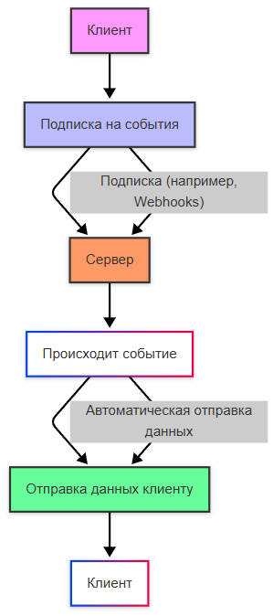
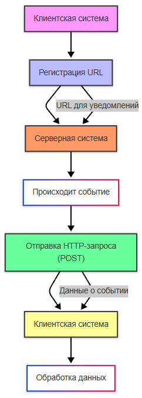

import PushNotificationPlay from '@site/src/components/PushNotificationPlay';

# Push, Pull, Webhooks

<div class="article-tags">
  <span class="tag tag-required">ОБЯЗАТЕЛЬНО</span>
  <span class="tag tag-beginner">ДЛЯ НОВИЧКОВ</span>
</div>

<span class="complexity-badge">Разработчику</span>
<span class="complexity-badge">Архитектору</span>
<span class="complexity-badge">Инженеру</span>

---

## Push, Pull, Webhooks

Модели доставки данных определяют инициатора передачи информации между системами. Архитектурное различие лежит в том, кто управляет моментом и инициативой передачи: **отправитель (источник)** или **получатель (потребитель)**.

Существуют **Push**, **Pull** и **гибридные** модели. Эффективная архитектура часто комбинирует модели, например, внутренние микросервисы взаимодействуют через брокер (push), а внешние интеграции реализуются через вебхуки с адаптером, преобразующим сообщения брокера во входящие HTTP-запросы.

---

## Четыре подхода к обновлениям в реальном времени

Перед разбором push/pull полезно зафиксировать **четыре базовых паттерна** доставки изменений. Они встречаются и в браузерных приложениях, и в интеграции микросервисов.

| Подход | Инициатор | Соединение | Кто типичный «клиент» | Пример |
|--------|-----------|------------|------------------------|--------|
| **Polling** | Потребитель по расписанию | Короткое на каждый запрос | Браузер, worker, cron | `GET /orders/42/status` каждые 5 с |
| **Long Polling** | Потребитель, сервер держит ответ | Долгое до события или таймаута | SPA, мобильный клиент | Чат без WebSocket |
| **SSE** | Один `GET`, дальше сервер шлёт поток | Одно долгоживущее HTTP | Браузер (`EventSource`) | Стрим статуса или текста от LLM |
| **Webhook** | Источник при событии | `POST` на зарегистрированный URL | Другой backend-сервис | Stripe → ваш `/webhooks/payment` |

**Polling** постоянно опрашивает сервер через интервалы времени. **Long Polling** держит соединение открытым до появления новых данных. **SSE** позволяет серверу стримить события клиенту по одному каналу. **Webhook** отправляет события между сервисами автоматически, без опроса со стороны получателя.

<div class="callout callout--tip">
  <div class="callout-title">Браузер и backend</div>
  Для вкладки браузера webhook напрямую недоступен — нужен публичный URL вашего API. Webhook уместен между сервисами; для UI чаще берут SSE, Long Polling или WebSocket. Сводка с диаграммами — [Polling, Long Polling, SSE и Webhook](/encyclopedia/2-system-network/2-04-kak-rabotayut-sayty-i-veb-sayty/129).
</div>

**WebSocket** в эту четвёрку не входит как отдельная «модель доставки», но закрывает сценарий **дуплекса** — когда обе стороны шлют данные в любой момент. Сравнение транспортов — в [Реактивной коммуникации](./116).

---

### Push-модель

**Push-модель** (от англ. "push" — "толкать") — это подход, при котором сервер отправляет данные клиенту без явного запроса от клиента. Клиент подписывается на события или уведомления, а сервер автоматически передаёт данные, как только они становятся доступны. 

Примерами являются вебхуки, WebSockets, и SSE.

Push-модель:



<PushNotificationPlay />

Потребитель периодически инициирует запрос к источнику для получения данных. Источник пассивен — возвращает данные только в ответ на запрос. 

**Интервал опроса (polling interval)** задаётся клиентом и влияет на задержку обнаружения изменений и нагрузку на источник.

---

#### Технические характеристики

- **Протоколы**: HTTP/1.1, HTTP/2, gRPC streaming (long polling), WebSocket (в гибридных сценариях)
- **Состояние соединения**: кратковременное (stateless запросы) или долгоживущее (long polling)
- **Метрики эффективности**:
  - Задержка обнаружения: от 0 (при мгновенном опросе) до интервала опроса
  - Избыточный трафик: запросы без изменений данных (пустые ответы)
  - Нагрузка на источник: линейно растёт с количеством потребителей

---

#### Сценарии применения

- Системы с низкой частотой изменений (конфигурации, справочники)
- Ограниченные клиенты без возможности принимать входящие соединения (IoT-устройства за NAT)
- Ситуации, требующие строгого контроля клиентом момента получения данных
- Совместимость с системами, не поддерживающими push-механизмы

---

#### Long polling (Python)

```python

import requests
import time

def poll_for_updates(endpoint: str, timeout: int = 30):
    while True:
        try:
            response = requests.get(
                endpoint,
                params={"timeout": timeout},  # сервер удерживает соединение до появления данных
                timeout=timeout + 5
            )
            if response.status_code == 200 and response.content:
                yield response.json()
            # При 204 No Content или пустом теле — немедленный повтор
        except requests.exceptions.Timeout:
            continue
        except Exception as e:
            time.sleep(5)  # экспоненциальная задержка при ошибках
```

Разбор:
- Импорты подключают модули проекта; выполнение идёт сверху вниз — сначала конфигурация, затем объявление сущностей или маршрутов.


---

#### Кратковременный опрос с экспоненциальной задержкой (C#)

```csharp
public async Task PollAsync(string endpoint, CancellationToken ct)
{
    var delay = TimeSpan.FromSeconds(1);
    var maxDelay = TimeSpan.FromSeconds(60);
    
    while (!ct.IsCancellationRequested)
    {
        try
        {
            var response = await _httpClient.GetAsync(endpoint, ct);
            if (response.IsSuccessStatusCode)
            {
                var data = await response.Content.ReadFromJsonAsync<Данные[]>(ct);
                if (Данные?.Length > 0) Process(Данные);
                delay = TimeSpan.FromSeconds(1); // сброс задержки при успехе
            }
        }
        catch (HttpRequestException)
        {
            delay = TimeSpan.FromSeconds(Math.Min(delay.TotalSeconds * 2, maxDelay.TotalSeconds));
        }
        
        await Task.Delay(delay, ct);
    }
}
```

Разбор:
- Пространства имён группируют модели и сервисы; `async`/`await` не блокируют поток при HTTP-вызове наружу.


---

#### Ограничения

- Задержка обнаружения изменений до следующего интервала опроса
- Избыточные запросы при отсутствии изменений (особенно критично при коротких интервалах)
- Сложность горизонтального масштабирования источника при большом числе потребителей
- Проблемы с балансировкой: все потребители опрашивают один и тот же эндпоинт, создавая "гребёнку" нагрузки

---

### Pull

**Pull-модель** (от англ. "pull" — "тянуть") — это подход, при котором клиент периодически запрашивает данные с сервера. Сервер не инициирует передачу данных, пока клиент не сделает запрос. 

Примерами является как раз polling, когда клиент регулярно отправляет запросы на сервер, и REST API.

Pull-модель:


Apache Kafka использует Pull-модель (потребители самостоятельно запрашивают данные с сервера, подписываясь на топики и "тянут" данные из топиков), а RabbitMQ использует Push-модель (брокер отправляет сообщения потребителям, "толкает" в потребителей, когда они готовы их обработать).

Источник инициирует передачу данных получателю сразу после возникновения события. Получатель пассивен — ожидает входящие соединения. Требует от получателя доступности по сети и способности обрабатывать асинхронные сообщения.

---

#### Технические характеристики

- **Протоколы**: HTTP POST/PUT, gRPC unary/streaming, MQTT, AMQP (RabbitMQ), WebSocket (бидирекционный)
- **Состояние соединения**: кратковременное (HTTP) или постоянное (WebSocket, MQTT persistent session)
- **Гарантии доставки**: зависят от протокола (MQTT QoS 0/1/2, AMQP acknowledgements)

---

#### Сценарии применения

- Высокочастотные события с требованием минимальной задержки (финансовые транзакции, мониторинг)
- Системы с известным и стабильным множеством получателей
- Сценарии публикации-подписки с множественными подписчиками (через брокер сообщений)
- Мобильные приложения с фоновыми сервисами (через платформенные механизмы: FCM, APNs)

---

#### Реализация через брокер сообщений (Java + RabbitMQ)

```java
// Подписка на очередь с обработкой push-событий
Channel channel = connection.createChannel();
channel.queueDeclare("notifications", true, false, false, null);
channel.basicQos(1); // fair dispatch

DeliverCallback deliverCallback = (consumerTag, delivery) -> {
    try {
        String message = new String(delivery.getBody(), StandardCharsets.UTF_8);
        processNotification(message);
        channel.basicAck(delivery.getEnvelope().getDeliveryTag(), false);
    } catch (Exception e) {
        // Возврат в очередь с ограничением попыток через DLX
        channel.basicNack(delivery.getEnvelope().getDeliveryTag(), false, false);
    }
};

channel.basicConsume("notifications", false, deliverCallback, consumerTag -> {});
```

Разбор:
- Пакеты `model`, `repository`, `service` разделяют слои: сущность, доступ к данным, бизнес-логика обработки заказов.


---

#### Ограничения

- Требование к получателю: должен быть доступен по сети и иметь статический адрес
- Проблема "громкого молчания": источник не знает о недоступности получателя без механизма подтверждений
- Сложность управления скоростью передачи (backpressure) при несоответствии скоростей продюсера и консьюмера
- Риск потери событий при недоступности получателя без брокера с персистентностью

---

### Вебхуки

**Сценарии-вебхуки** (Webhooks) — это механизм, который позволяет одной системе уведомлять другую систему о событиях в реальном времени. Вместо того чтобы клиентская система периодически запрашивала обновления (например, через API), серверная система отправляет HTTP-запрос на предопределённый URL клиента, когда происходит какое-либо событие.

Как работают вебхуки:
- клиентская система регистрирует свой URL (конечную точку) на серверной системе.
- когда на сервере происходит событие (например, новая транзакция или изменение данных), он отправляет HTTP-запрос (обычно POST) на этот URL.
- клиентская система получает данные и обрабатывает их.

Вебхуки используются, для уведомлений, к примеру, о завершении платежа, о создании лида в CRM-системе. При таком подходе, данные передаются сразу после события, нет необходимости в постоянных запросах к API (такое явление называется polling). Вебхуки используют стандартный HTTP-протокол.



Гибридная модель: получатель регистрирует у источника свой публичный эндпоинт (callback URL). При наступлении события источник выполняет HTTP-запрос (обычно POST) к зарегистрированному эндпоинту. Фактически представляет собой push-механизм, реализованный через запросы инициированные сервером.

---

#### Технические характеристики

- **Протокол**: HTTP/HTTPS с обязательной аутентификацией колбэка
- **Формат данных**: JSON, XML или произвольный бинарный (указывается в `Content-Type`)
- **Безопасность**: подписи запросов (HMAC), секретные токены в заголовках, проверка источника по IP
- **Надёжность**: механизмы повторных попыток (retry with exponential backoff), dead-letter для необработанных хуков

---

#### Регистрация и управление хуками

```http
POST /api/webhooks
Content-Type: application/json

{
  "url": "https://consumer.example.com/webhook/orders",
  "events": ["order.created", "order.updated"],
  "secret": "hmac-sha256-secret-key",
  "active": true
}
```

Разбор:
- Прочитайте фрагмент построчно: каждая директива или вызов меняет поведение сервиса, брокера или балансировщика в цепочке микросервисов.
- После правки перезапустите соответствующий процесс или контейнер и проверьте логи, очередь RabbitMQ или ответ HTTP.


---

#### Обработка входящего webhook (Python + FastAPI)

```python
from fastapi import FastAPI, Header, HTTPException

import hmac
import hashlib

app = FastAPI()

@app.post("/webhook/orders")
async def handle_webhook(
    payload: dict,
    x_signature: str = Header(None)
):
    # Проверка подлинности через HMAC
    expected = hmac.new(
        key=WEBHOOK_SECRET.encode(),
        msg=await request.body(),
        digestmod=hashlib.sha256
    ).hexdigest()
    
    if not hmac.compare_digest(f"x-sha256={expected}", x_signature or ""):
        raise HTTPException(status_code=401, detail="Invalid signature")
    
    # Идемпотентная обработка
    event_id = payload.get("event_id")
    if event_id and is_event_processed(event_id):
        return {"status": "duplicate"}
    
    process_event(payload)
    mark_event_processed(event_id)
    
    return {"status": "accepted"}  # 200 OK немедленно для подтверждения доставки
```

Разбор:
- `FastAPI()` создаёт приложение; декораторы `@app.post` / `@app.get` регистрируют маршруты и схемы ответа `response_model`.
- `Depends(get_db)` внедряет сессию БД; `BackgroundTasks` откладывает публикацию в RabbitMQ, чтобы HTTP-ответ ушёл клиенту быстрее.
- `pika.BlockingConnection` и `basic_publish` отправляют JSON-событие в очередь `order_events`; `delivery_mode=2` помечает сообщение persistent.
- Перед вставкой проверяется уникальность `order_number`; `HTTPException(400)` и `(404)` возвращают понятные коды клиенту.


---

#### Паттерны обеспечения надёжности

1. **Подтверждение доставки**: ответ 2xx в течение таймаута (обычно 3–10 секунд)
2. **Повторные попытки**: экспоненциальная задержка (1с, 2с, 4с, 8с...) с ограничением по времени (24–72 часа)
3. **Идемпотентность**: обработка дубликатов через уникальный идентификатор события (`event_id`)
4. **Dead-letter queue**: перенаправление необработанных хуков после исчерпания попыток

---

#### Сценарии применения

- Интеграция с внешними SaaS-сервисами (платёжные системы, CRM, GitHub)
- Уведомления о событиях в распределённых системах без общего брокера
- Сценарии с динамическим набором получателей (каждый клиент регистрирует свой эндпоинт)
- Системы с ограничениями на исходящие соединения у источника (редко, но возможно)

---

#### Ограничения

- Требование публично доступного эндпоинта у получателя (проблема для внутренних систем)
- Необходимость реализации защиты от подделки запросов (подписи, секреты)
- Сложность отладки: асинхронная природа, необходимость логирования входящих запросов
- Риск DoS при компрометации эндпоинта (требуется рейт-лимитинг на стороне получателя)

---

### Как выбрать между Push, Pull и Webhooks

Если коротко:

- **Pull** — когда частота изменений низкая и клиенту удобно контролировать расписание запросов.
- **Push** — когда важна минимальная задержка и получатель стабильно доступен.
- **Webhooks** — когда нужен простой событийный callback между внешними системами по HTTP.

На практике часто применяют гибрид: webhook уведомляет о событии, а затем клиент делает pull-запрос за полными данными. Это даёт баланс между скоростью реакции и контролем над чтением.

---

### Мини-чек-лист для webhook-интеграций

- подпись HMAC и проверка времени запроса;
- идемпотентность по `event_id`;
- retry с ограничением окна и DLQ;
- быстрый ответ `2xx` без тяжёлой обработки в запросном потоке;
- журнал доставки и инструмент ручного re-delivery.

---

## См. также

- [Polling, Long Polling, SSE и Webhook](/encyclopedia/2-system-network/2-04-kak-rabotayut-sayty-i-veb-sayty/129) — сводка четырёх паттернов с диаграммами
- [Транспортные механизмы](/encyclopedia/8-infra-security/8-05-mikroservisy-i-integratsiya/2)
- [Реактивная коммуникация](/encyclopedia/8-infra-security/8-05-mikroservisy-i-integratsiya/116)
- [Брокеры сообщений](/encyclopedia/8-infra-security/8-05-mikroservisy-i-integratsiya/117)


---

{/* http-basics-link  */}
<div class="callout callout--tip">
  <div class="callout-title">Основа по протоколу</div>

  <div class="callout-body">
  Базовый разбор HTTP и HTTPS находится в отдельной статье — [HTTP как основа веб-интеграций](/encyclopedia/2-system-network/2-09-osnovy-integratsionnogo-vzaimodeystviya/118).
</div>
  </div>


