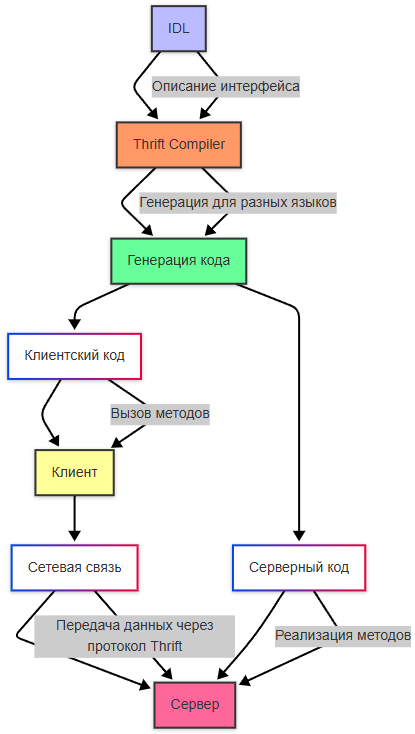

# Реализация интеграции

<div class="article-tags">
  <span class="tag tag-required">ОБЯЗАТЕЛЬНО</span>
  <span class="tag tag-beginner">ДЛЯ НОВИЧКОВ</span>
</div>

<span class="complexity-badge">Разработчику</span>
<span class="complexity-badge">Архитектору</span>
<span class="complexity-badge">Инженеру</span>

## Реализация интеграции

### Паттерны проектирования API

**Проектирование API** — это процесс формирования **семантически устойчивого, предсказуемого и безопасного интерфейса**, который учитывает требования к надёжности, масштабируемости, совместимости и удобству использования. 

**Паттерны проектирования API** — это обобщённые решения распространённых архитектурных и поведенческих задач, возникающих при создании таких интерфейсов. Они позволяют избежать изобретения велосипеда и обеспечивают согласованность как внутри одной системы, так и между разными системами, построенными по схожим принципам.

---

### Проектирование интеграции как предпосылка проектирования API

Прежде чем проектировать API, необходимо осознать контекст его использования. Интеграция — это не просто передача данных из точки A в точку B. Это **согласование моделей**, **учёт различий в семантике**, **гарантии доставки** и **управление согласованностью состояний** в условиях недетерминированной среды. Распределённые системы подвержены сетевым задержкам, частичным сбоям, дублированию сообщений и несогласованным состояниям. API, спроектированный без учёта этих факторов, неизбежно приведёт к хрупким интеграциям, которые трудно поддерживать, тестировать и расширять.

Поэтому проектирование API начинается с проектирования интеграции. Это включает:

- Определение границ контекста (bounded context): какие сущности и операции находятся в ответственности сервиса-провайдера?
- Согласование семантики: как интерпретировать одно и то же понятие (например, «заказ») на стороне клиента и сервера?
- Выбор уровня изоляции: будет ли API предоставлять прямой доступ к внутренней модели или абстрагирует её?
- Определение требований к согласованности, доступности и устойчивости (в терминах CAP-теоремы и её следствий).

Эти решения напрямую влияют на архитектуру API и обуславливают выбор тех или иных паттернов.

---

### Ключевые проблемы при интеграциях и ответственные паттерны

В процессе интеграции через API возникает ряд системных проблем, каждая из которых требует продуманного архитектурного ответа. Рассмотрим их подробнее.

#### Идемпотентность

Одна из фундаментальных проблем распределённых систем — **неопределённость результата операции**. Если клиент отправляет запрос на создание ресурса, а в ответ получает таймаут или ошибку соединения, он не может знать, был ли запрос обработан сервером или нет. Повтор запроса в таком случае может привести к дублированию: два одинаковых ресурса вместо одного.

**Идемпотентность** — это свойство операции, при котором многократное выполнение не изменяет результат по сравнению с однократным. HTTP уже предоставляет частичную основу: методы GET, PUT, DELETE считаются идемпотентными по спецификации, а POST — нет. Однако на практике идемпотентность зависит от реализации бизнес-логики.

Для обеспечения идемпотентности в неидемпотентных по умолчанию операциях (например, создание заказа) применяется механизм **уникальных идентификаторов запроса** (`idempotency-key` или `request_id`). Клиент генерирует такой идентификатор и включает его в заголовок или тело запроса. Сервер сохраняет результат обработки по этому ключу и при повторной отправке с тем же ключом возвращает ранее вычисленный результат, не выполняя бизнес-логику повторно. Это гарантирует, что клиент может безопасно повторять запросы при сбоях сети без риска побочных эффектов.

#### Декларативность против императивности

API может быть спроектирован в двух основных парадигмах:

- **Императивный API** описывает *как* добиться результата: «отправь заказ в обработку», «переведи статус в shipped», «выполни расчёт».
- **Декларативный API** описывает *что* должно быть результатом: «состояние ресурса должно быть таким-то», «вот желаемая конфигурация».

REST-подход, особенно в интерпретации, ориентированной на ресурсы (resource-oriented Проектирование), склоняется к декларативности: клиент описывает конечное состояние ресурса (например, через PUT), и сервер сам определяет, какие действия необходимо совершить для достижения этого состояния. Такой подход упрощает клиентскую логику, повышает идемпотентность (PUT по определению идемпотентен) и лучше подходит для систем с асинхронным исполнением и reconcile-циклами (как в Kubernetes).

Однако не все сценарии поддаются декларативному описанию. Операции, зависящие от контекста выполнения (например, «отправить уведомление сейчас»), остаются императивными. Проектировщик API должен сознательно выбирать парадигму для каждого эндпоинта, учитывая семантику операции и требования к надёжности.

#### Согласованность

Согласованность в API проявляется на нескольких уровнях:

1. **Семантическая согласованность**: одинаковые понятия обозначаются одинаково, структуры данных предсказуемы, термины согласованы с предметной областью.
2. **Структурная согласованность**: одинаковые HTTP-методы ведут себя одинаково на разных ресурсах, ошибки возвращаются в едином формате, временные метки используют единый стандарт (например, RFC 3339).
3. **Поведенческая согласованность**: если API поддерживает маски полей (`field_mask`) на одном ресурсе, он должен поддерживать их на всех; если используется пагинация по токену, она должна применяться единообразно.

Нарушение согласованности повышает когнитивную нагрузку на разработчиков-клиентов, увеличивает вероятность ошибок и затрудняет автоматизацию. Согласованность — это требование к производительности интеграций.

#### Передача больших и малых объёмов данных

API должен эффективно работать как с небольшими объектами (например, обновление статуса задачи), так и с массивными объёмами данных (выгрузка миллионов записей). Прямолинейные подходы (например, возврат всего списка в одном ответе) быстро становятся непрактичными.

Для малых объёмов важны **точность** и **минимизация накладных расходов**: использование частичного чтения и обновления, сжатие, бинарные форматы (например, Protocol Buffers). Для больших объёмов — **потоковость**, **асинхронность** и **управление жизненным циклом операции**: импорт/экспорт как отдельный ресурс с прогрессом и возможностью отмены.

---

### Мягкое удаление (Soft Delete)

В традиционных системах удаление ресурса через HTTP-метод `DELETE` подразумевает немедленное и необратимое уничтожение данных. Однако в реальных приложениях такая модель часто не соответствует требованиям бизнеса и пользовательского опыта. Случайное удаление критически важного объекта (например, контракта или профиля клиента) может привести к операционным сбоям или юридическим последствиям. Кроме того, в распределённых системах другие компоненты могут всё ещё ссылаться на удалённый ресурс, что создаёт риск нарушения ссылочной целостности или возникновения «висячих» ссылок.

**Мягкое удаление** решает эту проблему, заменяя физическое уничтожение логическим маркированием. Ресурс сохраняется в хранилище, но помечается как удалённый с помощью специального атрибута — обычно это булево поле `deleted` или временная метка `deleted_at`. Такой подход предоставляет несколько ключевых преимуществ:

- **Возможность восстановления**: администратор или пользователь может отменить операцию удаления в течение определённого периода.
- **Сохранение истории**: даже после «удаления» ресурс остаётся доступен для аудита, аналитики или отчётности.
- **Устойчивость к ошибкам**: случайное нажатие кнопки «удалить» не влечёт необратимых последствий.

#### Реализация

С точки зрения API, мягко удалённый ресурс продолжает существовать, но его видимость регулируется фильтрацией:

- Метод `GET /resources/{id}` возвращает ресурс независимо от его статуса удаления — это позволяет проверить, был ли объект удалён, и при необходимости восстановить его.
- Метод `LIST /resources` по умолчанию возвращает только активные (не удалённые) ресурсы. Для доступа к удалённым записям вводится опциональный параметр запроса, например `show_deleted=true`. Это сохраняет привычное поведение для большинства клиентов, не затрагивая их логику, но даёт расширенный доступ тем, кто в нём нуждается.
- Метод `DELETE` должен быть идемпотентным: повторный вызов для уже удалённого ресурса не должен вызывать ошибку, а возвращать тот же ответ, что и при первом вызове (обычно `204 No Content` или представление ресурса с `deleted: true`). Это соответствует семантике HTTP и упрощает клиентскую логику повторов.

#### Сроки хранения и окончательное удаление

Мягкое удаление не отменяет необходимости в управлении жизненным циклом данных. Хранение всех когда-либо созданных объектов неограниченно — это нецелесообразно с точки зрения стоимости и соответствия регуляторным требованиям (например, GDPR). Поэтому вводится механизм **автоматической очистки**: каждому удалённому ресурсу назначается время окончательного удаления (`expire_time`), после которого фоновый процесс или триггер базы данных физически удаляет запись.

Этот срок может быть фиксированным (например, 30 дней) или конфигурируемым на уровне ресурса или организации. Важно, чтобы `expire_time` возвращался в теле ресурса при запросе, чтобы клиенты могли информировать пользователей о возможности восстановления.

#### Ссылочная целостность

Особую сложность представляет обработка зависимостей. Если ресурс A ссылается на ресурс B, а B мягко удаляется, что должно произойти с A?

Варианты решения:

1. **Запрет удаления при наличии зависимостей** — наиболее строгий подход, но он снижает гибкость и может блокировать операции.
2. **Разрешение удаления с сохранением ссылки** — ссылка остаётся валидной, но при разыменовании возвращается ресурс в состоянии `deleted: true`. Это требует от клиентов проверять статус целевого ресурса.
3. **Каскадное мягкое удаление** — при удалении B автоматически удаляются (мягко) все зависимые ресурсы. Это подходит не для всех сценариев и может привести к неожиданным последствиям.

Чаще всего применяется второй вариант в сочетании с фоновой задачей очистки «висячих» ссылок после окончательного удаления. Такой подход сохраняет целостность данных в течение срока хранения и не нарушает поведение клиентов.

---

### Повтор запросов и идемпотентность на практике

Как отмечалось ранее, неопределённость результата запроса — фундаментальная проблема распределённых систем. Паттерн **повтора запросов (request retries)** с использованием **ключа идемпотентности** — стандартное средство её решения.

Клиент генерирует уникальный идентификатор для каждой потенциально неидемпотентной операции (например, `POST`) и передаёт его в заголовке `Idempotency-Key`. Сервер сохраняет пару `(idempotency_key, response)` в кэше с ограниченным временем жизни (например, 24 часа). При получении запроса с уже известным ключом сервер немедленно возвращает сохранённый ответ, не выполняя бизнес-логику.

Важные аспекты реализации:

- **Область действия ключа**: обычно привязывается к учётной записи пользователя или клиентскому ID для предотвращения коллизий между разными клиентами.
- **Срок хранения**: должен соответствовать максимальному времени, в течение которого клиент может безопасно повторять запрос.
- **Безопасность**: ключ не должен содержать чувствительных данных и должен быть случайным (например, UUIDv4).
- **Документирование**: API должен чётко указывать, для каких методов поддерживается идемпотентность через `Idempotency-Key`.

Этот паттерн особенно критичен для финансовых операций, создания заказов и любых сценариев, где дублирование недопустимо.

---

### Импорт и экспорт данных

Операции с большими объёмами данных (миграции, резервное копирование, аналитические выгрузки) не подходят для синхронных REST-вызовов. Они требуют **асинхронного выполнения**, **отслеживания прогресса** и **возможности отмены**.

Паттерн **Import/Export** предлагает выделить такие операции в отдельный ресурс:

- Клиент создаёт операцию импорта, передавая метаданные: источник данных (например, URL файла в облаке, формат, схема), параметры обработки.
- Сервер возвращает URI созданной операции: `POST /imports → 202 Accepted + Location: /imports/{id}`.
- Клиент может опрашивать статус: `GET /imports/{id}` возвращает текущий прогресс, ошибки, лог или финальный результат.
- Аналогично для экспорта: `POST /exports` → `Location: /exports/{id}`, затем `GET /exports/{id}/download` после завершения.

#### Обработка сбоев

При сбое на середине операции система обычно не пытается автоматически откатывать изменения. Это связано с тем, что:

- Частичный импорт может быть допустим (например, 90% записей успешно загружено).
- Откат может быть сложнее, чем ручная коррекция.

Поэтому поведение при сбое — **не делать ничего**: оставить систему в промежуточном состоянии и предоставить клиенту информацию об ошибке, количестве обработанных записей и возможности повторного запуска с корректировками.

#### Согласованность при экспорте

Экспорт часто делается из живой системы. Если данные изменяются во время выгрузки, результат может представлять **неконсистентный снимок** — часть записей из состояния T₀, часть из T₁. Для сценариев, требующих строгой согласованности (например, бухгалтерская отчётность), система должна поддерживать **транзакционные снимки** (например, через MVCC в PostgreSQL или read-only реплики). В противном случае API должен честно документировать, что экспорт не гарантирует точку во времени.

---

### Частичное обновление и извлечение

Полное обновление ресурса (`PUT`) требует передачи всего представления, что неэффективно при изменении одного поля. Полное извлечение (`GET`) может возвращать избыточные данные, если клиенту нужен только подмножество атрибутов.

Паттерн **частичных операций** решает эту проблему через **маски полей (field masks)**:

- При чтении: `GET /users/123?fields=id,name,email` — возвращает только указанные поля.
- При обновлении: `PATCH /users/123` с телом `{"name": "New"}` и заголовком `X-Fields-Mask: name` (или поле `update_mask` в теле) — гарантирует, что только перечисленные поля будут изменены.

Этот подход снижает объём передаваемых данных, уменьшает нагрузку на базу данных (не нужно выбирать все столбцы) и повышает безопасность (клиент не получает полей, к которым у него нет доступа).

---

### Пагинация

При работе с большими коллекциями (списки пользователей, транзакций, логов) возврат всех записей за один запрос непрактичен. Пагинация разбивает результат на страницы.

Две основные стратегии:

1. **Пагинация на основе смещения (offset-based)**: `GET /items?limit=20&offset=40`.  
   Проста в реализации, но страдает от **проблемы сдвига (pagination drift)**: если записи добавляются или удаляются во время перелистывания, клиент может пропустить элементы или получить дубликаты. Кроме того, `OFFSET N` в SQL требует сканирования первых N записей, что неэффективно при больших N.

2. **Пагинация на основе курсора (cursor-based)**: `GET /items?limit=20&cursor=abc123`.  
   Курсор — это непрозрачный токен, инкапсулирующий состояние (обычно значение последнего ключа сортировки). Этот подход устойчив к изменениям данных, масштабируем и эффективен, но требует, чтобы коллекция была строго упорядочена по уникальному ключу (например, `created_at + id`).

В современных API предпочтение отдаётся курсорной пагинации, особенно для публичных или высоконагруженных интерфейсов.

---

### Подресурсы-одиночки (Singleton Sub-resources)

Некоторые атрибуты ресурса логически представляют собой отдельную сущность, но семантически привязаны только к одному родителю. Например:  
- `Location` у водителя в системе доставки  
- `Settings` у пользователя  
- `Avatar` у профиля  

Вместо хранения таких данных как вложенные поля в основном ресурсе, их выносят в **подресурс-одиночку**:

```
GET /drivers/123/location
PUT /drivers/123/location
```

Преимущества:

- Чёткое разделение ответственности: обновление локации не требует передачи всего профиля водителя.
- Независимая версионность и управление доступом.
- Возможность добавить в будущем историю изменений (`GET /drivers/123/location/history`), не нарушая основной контракт.

Однако такой подход может нарушить **атомарность**: нельзя одновременно обновить профиль и локацию в одной транзакции через API. Это требует от клиента последовательных вызовов и усложняет обработку частичных сбоев. Поэтому вынос в подресурс оправдан только тогда, когда операции с этим атрибутом действительно автономны.

---

### Управление версиями API

API, как и любой программный интерфейс, подвержен эволюции. Новые требования, исправления ошибок, изменения в предметной области неизбежно ведут к необходимости модификации контракта. Однако в отличие от внутренней библиотеки, API часто используется множеством независимых клиентов, обновление которых не синхронизировано с обновлением сервера. Это делает **обратную совместимость** критически важной, а её нарушение — дорогостоящим.

Существует несколько подходов к версионированию API:

1. **Версия в URI**: `https://api.example.com/v1/users`.  
   Наиболее явный и распространённый способ. Плюсы — простота маршрутизации, чёткое разделение контрактов. Минусы — URI становится частью контракта, что нарушает чистоту REST (ресурс не должен менять свой идентификатор при изменении представления).

2. **Версия в заголовке**: `Accept: application/vnd.example.v1+json`.  
   Более семантически корректный с точки зрения HTTP: клиент указывает, какое представление он ожидает. Однако требует дополнительной поддержки на уровне маршрутизации и может быть менее очевиден для разработчиков.

3. **Версия в параметре запроса**: `?api_version=1`.  
   Редко используется в промышленных API, так как смешивает метаданные с бизнес-параметрами.

4. **Отсутствие явной версии**: поддержка только одного актуального контракта с обязательным сохранением обратной совместимости.  
   Этот подход популярен в экосистемах с централизованным развёртыванием (например, внутри одной компании), но неприменим для публичных API.

На практике большинство зрелых API используют **версию в URI**, дополняя её **политикой устаревания (deprecation policy)**: старые версии поддерживаются в течение фиксированного срока (например, 12 месяцев) с возвратом заголовка `Deprecation: true` и документированием миграционного пути. Это даёт клиентам время на адаптацию без риска неожиданного отказа сервиса.

Версионирование применяется только к **необратимым нарушениям контракта** (удаление поля, изменение семантики операции). Добавление необязательных полей или новых эндпоинтов не требует смены версии.

---

### Ограничение скорости и квотирование (Rate Limiting & Quotas)

Публичные и даже внутренние API подвержены риску чрезмерной нагрузки: из-за ошибки клиента, злонамеренной атаки или просто пикового трафика. Без защиты это может привести к деградации или полному отказу сервиса.

Паттерн **ограничения скорости** гарантирует, что каждый клиент (обычно идентифицируемый по API-ключу, токену или IP) может выполнять не более заданного числа запросов в единицу времени. Обычно реализуется с помощью алгоритма «протекающего ведра» (leaky bucket) или «окна с подвижной границей» (sliding window).

Сервер возвращает стандартные заголовки для информирования клиента:

- `X-RateLimit-Limit`: максимальное число запросов в окне.
- `X-RateLimit-Remaining`: оставшееся количество.
- `X-RateLimit-Reset`: время сброса счётчика (в секундах или временной метке).

При превышении лимита возвращается статус `429 Too Many Requests`.

**Квотирование** — более грубый, но долгосрочный механизм: ограничение на общее число операций в месяц (например, 100 000 вызовов). Используется в коммерческих API для монетизации и предотвращения злоупотреблений.

Оба механизма должны быть задокументированы, а поведение — предсказуемым. Неожиданные ограничения без чётких сигналов подрывают доверие к API.

---

### Обработка ошибок

Единообразная и информативная обработка ошибок — признак зрелого API. Ошибки должны:

- Использовать стандартные HTTP-статусы (`400 Bad Request`, `401 Unauthorized`, `403 Forbidden`, `404 Not Found`, `409 Conflict`, `422 Unprocessable Entity`, `500 Internal Server Error` и др.).
- Возвращать структурированное тело с деталями: код ошибки (machine-readable), человекочитаемое сообщение, дополнительные данные (например, имя невалидного поля).
- Не раскрывать внутренние детали реализации (стек-трейсы, имена таблиц БД).

Рекомендуемый формат (вдохновлённый RFC 7807 — Problem Details for HTTP APIs):

```json
{
  "type": "https://api.example.com/errors/invalid-parameter",
  "title": "Invalid parameter value",
  "detail": "The 'email' field must be a valid email address.",
  "status": 400,
  "instance": "/users/123",
  "invalid_params": [
    {
      "name": "email",
      "reason": "format"
    }
  ]
}
```

Такой подход позволяет клиентам программно реагировать на ошибки, а разработчикам — быстро диагностировать проблемы.

---

### Интеграция с событийной архитектурой

RESTful API предоставляет **запрос-ориентированную** модель взаимодействия: клиент инициирует запрос и получает ответ. Однако во многих сценариях (уведомления, синхронизация состояний, реакция на изменения) более эффективна **событийная модель**: клиент подписывается на события и получает уведомления асинхронно.

Два основных паттерна интеграции:

#### Вебхуки (Webhooks)

Клиент регистрирует URL-адрес (endpoint), на который сервер будет отправлять события в формате HTTP POST. Например:

```http
POST /webhook HTTP/1.1
Content-Type: application/json
X-Signature: sha256=...

{
  "event": "user.updated",
  "Данные": { "id": "123", "name": "New Name" },
  "timestamp": "2025-11-06T10:00:00Z"
}
```

Ключевые аспекты:

- **Верификация подлинности**: подпись запроса (например, HMAC по секретному ключу) предотвращает подделку событий.
- **Повторы при сбоях**: сервер повторяет отправку при отсутствии подтверждения (`2xx`), используя экспоненциальную задержку.
- **Идемпотентность на стороне клиента**: клиент должен обрабатывать дубликаты событий корректно.

#### Потоки событий (Event Streams)

Для высоконагруженных или требовательных к задержкам сценариев (например, финансовые транзакции) используется постоянное соединение (SSE, WebSockets) или интеграция с брокером сообщений (Kafka, RabbitMQ). В этом случае API предоставляет **топики или каналы**, из которых клиент может читать события в реальном времени.

Такой подход масштабируется лучше, но требует от клиента управления сессией, восстановления после разрыва и обработки упорядоченности.

Оба паттерна дополняют REST, а не заменяют его: REST используется для управления состоянием, событийная модель — для реакции на изменения.

---

## Веб-сервисы

В условиях всё более дифференцированной архитектуры современных информационных систем, где функциональность разбивается на автономные, слабосвязанные компоненты, возникает необходимость в стандартизированных механизмах взаимодействия между ними. Одним из ключевых подходов к решению этой задачи является использование **веб-сервисов** — программных компонентов, реализующих определённую функциональность и доступных по сети с использованием стандартных протоколов и форматов данных.

Веб-сервисы представляют собой концептуальную модель интеграции, которая опирается на идеи межплатформенной совместимости, чётко определённых контрактов и передачи данных через открытые протоколы, преимущественно HTTP. Эта модель позволяет независимым системам — даже написанным на разных языках и размещённым в гетерогенных окружениях — взаимодействовать друг с другом без глубокого знания внутренней реализации партнёра по интеграции.

### Общее определение и назначение веб-сервиса

**Веб-сервис** — это программная сущность, которая предоставляет определённые операции (функциональность) через сетевой интерфейс. Взаимодействие с ней происходит посредством стандартных протоколов передачи данных (в первую очередь HTTP/S), а структура запросов и ответов определяется заранее согласованным форматом — XML, JSON или бинарными представлениями, такими как Protocol Buffers.

Основными целями применения веб-сервисов являются:

- **Интеграция**: возможность связать между собой разрозненные системы — как внутри одной организации (внутренние интеграции), так и между разными компаниями (B2B-интеграции).
- **Масштабируемость**: каждая функциональная единица может развиваться независимо, поскольку взаимодействие происходит через чётко описанный интерфейс.
- **Переиспользуемость**: один и тот же сервис может использоваться множеством клиентов без изменения его реализации.
- **Декомпозиция**: веб-сервисы являются естественной основой для микросервисной архитектуры, где каждый микросервис — это независимо развёртываемый веб-сервис с ограниченной областью ответственности.

### Эволюция подходов

Исторически развитие веб-сервисов прошло через несколько ключевых этапов, каждый из которых отражал смену парадигм в проектировании распределённых систем. Наиболее значимыми из них стали **SOAP-сервисы** и **RESTful API**, хотя в последнее время всё большую популярность приобретают и альтернативные подходы — в частности **gRPC** и **GraphQL**.

#### SOAP

**SOAP** (**Simple Object Access Protocol**) — это протокол обмена сообщениями, основанный на XML и разработанный для обеспечения строгой типизации, безопасности и надёжности при обмене данными между сервисами. Несмотря на название, сам протокол не является «простым» — он включает в себя обширный стек спецификаций (WS-*), охватывающих такие аспекты, как безопасность (WS-Безопасность), транзакции (WS-Transaction), маршрутизация (WS-Addressing) и другие.

Ключевая особенность SOAP — это **описание контракта сервиса** с помощью **WSDL** (**Web Services Description Language**). WSDL — это XML-документ, который описывает:

- какие операции доступны;
- какие параметры принимает каждая операция;
- какие типы данных используются;
- как формируется запрос и как выглядит ответ;
- по какому адресу и с какими параметрами подключения происходит вызов.

Такой подход обеспечивает максимальную предсказуемость и строгую контрактность, что особенно важно в корпоративных интеграциях, где стабильность и соответствие требованиям регламентов являются приоритетами. Однако эта строгость оборачивается сложностью: SOAP-сообщения громоздки, трудоёмки в анализе и требуют специализированных инструментов как для разработки, так и для тестирования.

#### REST

В противовес SOAP, **REST** (**Representational State Transfer**) — это **архитектурный стиль**, предложенный Ройем Филдингом в его докторской диссертации 2000 года. REST опирается на существующие возможности протокола HTTP и использует его семантику в максимально естественном виде:

- **GET** — получение ресурса;
- **POST** — создание нового ресурса или выполнение действия;
- **PUT/PATCH** — обновление ресурса;
- **DELETE** — удаление ресурса.

RESTful-сервисы не требуют сложных описаний контрактов вроде WSDL. Вместо этого они полагаются на **самодокументируемость**, **единообразие URI**, **стандартные коды состояния HTTP** и **лёгковесные форматы данных**, в первую очередь **JSON**. Это делает их значительно проще в разработке, тестировании и потреблении, особенно в веб- и мобильных приложениях.

REST доминирует в современной разработке, особенно в контексте микросервисов, поскольку он:

- легко масштабируется благодаря stateless-архитектуре;
- хорошо кэшируется;
- минимизирует накладные расходы за счёт компактных форматов;
- идеально интегрируется с веб-стандартами.

Однако REST не предоставляет встроенных механизмов для транзакций, надёжной доставки или строгой типизации — эти аспекты приходится реализовывать на уровне приложения или дополнять внешними средствами (например, OpenAPI/Swagger для описания контрактов).

#### Современные альтернативы

Помимо SOAP и REST, в современных системах интеграции всё чаще применяются:

- **gRPC** — высокопроизводительный RPC-фреймворк от Google, использующий HTTP/2 и Protocol Buffers. Он особенно эффективен при внутреннем взаимодействии микросервисов, когда важна скорость и компактность передаваемых данных.
- **GraphQL** — язык запросов, разработанный Facebook, позволяющий клиентам точно указывать, какие данные им нужны. Это снижает объём передаваемой информации и уменьшает количество обращений к серверу.
- **WebSocket и SignalR** — технологии для двунаправленной связи в реальном времени, применимые в сценариях чатов, уведомлений, игровых движков и т.п.
- **Message brokers** — такие как RabbitMQ, Apache Kafka, MassTransit или NServiceBus, которые обеспечивают асинхронную, надёжную и масштабируемую коммуникацию через шину сообщений. Они не являются веб-сервисами в классическом понимании, но являются неотъемлемой частью архитектуры распределённых систем.

---

### Windows Communication Foundation

**Windows Communication Foundation (WCF)** — это фреймворк, представленный Microsoft в рамках .NET Framework 3.0 (2006 г.) и ставший де-факто стандартом для построения сервис-ориентированных приложений в экосистеме Windows на протяжении более чем десятилетия. Его ключевая идея — унификация множества ранее разрозненных технологий коммуникации (включая ASMX-веб-сервисы, .NET Remoting, Enterprise Services и MSMQ) в единую, гибкую и конфигурируемую модель.

WCF не привязан жёстко ни к одному конкретному протоколу или стилю взаимодействия. Вместо этого он предоставляет разработчику возможность выбирать транспорт (HTTP, TCP, Named Pipes, MSMQ), формат сообщения (SOAP, plain XML, JSON, бинарный), уровень безопасности, режим надёжности доставки и другие параметры независимо от логики самого сервиса. Эта гибкость достигается за счёт чёткого разделения ответственностей между **контрактом**, **привязкой (binding)** и **конечной точкой (endpoint)**.

### Архитектурные элементы WCF

Любой WCF-сервис строится на трёх ключевых элементах, которые часто называют «ABC»:

- **A — Address (адрес)**: URI, по которому клиент может обратиться к сервису. Например, `http://localhost:8080/HelloService`.
- **B — Binding (привязка)**: определяет, *как* будет происходить обмен данными — какой транспорт использовать, как кодировать сообщения, какие меры безопасности применять. Примеры: `BasicHttpBinding`, `WsHttpBinding`, `NetTcpBinding`.
- **C — Contract (контракт)**: формальное описание того, *что* сервис предоставляет — какие операции доступны, какие типы данных используются.

Эта троица позволяет отделить бизнес-логику от деталей сетевой коммуникации, что делает сервисы более переносимыми и тестируемыми.

#### Контракты в WCF

WCF различает несколько типов контрактов, каждый из которых отвечает за свой аспект взаимодействия:

1. **Service Contract** — интерфейс, помеченный атрибутом `[ServiceContract]`. Он определяет набор операций, доступных клиентам.
2. **Operation Contract** — метод внутри интерфейса, помеченный `[OperationContract]`. Только такие методы будут доступны удалённо; остальные остаются внутренними.
3. **Данные Contract** — класс или структура, помеченная `[DataContract]`. Необходима для сериализации пользовательских типов в сообщения. По умолчанию WCF не сериализует поля и свойства — они должны быть явно разрешены атрибутом `[DataMember]`.
4. **Message Contract** — используется в продвинутых сценариях, когда требуется полный контроль над структурой SOAP-сообщения (заголовки, тело и т.п.). Редко применяется в типичных REST- или HTTP-интеграциях.
5. **Fault Contract** — механизм описания исключений, которые могут быть переданы клиенту в виде структурированных SOAP Fault.

Такая стратификация контрактов подчёркивает стремление WCF к строгой типизации и предсказуемости взаимодействия — особенно важной в корпоративных системах с высокими требованиями к надёжности.

#### Привязки (Bindings)

Привязка в WCF — это предопределённый или кастомный набор параметров, определяющий стек коммуникации. Среди встроенных привязок наиболее часто используются:

- **BasicHttpBinding** — совместимость с классическими ASMX-сервисами и другими SOAP-стеками. Использует HTTP как транспорт и текстовый XML (или MTOM) для кодировки. Поддерживает минимальный набор WS-* стандартов.
- **WsHttpBinding** — расширенная версия `BasicHttpBinding` с поддержкой безопасности, надёжных сеансов, транзакций и адресации. Основана на полном стеке WS-*.
- **NetTcpBinding** — оптимизированная для внутренних (intranet) коммуникаций привязка, использующая TCP и бинарную сериализацию. Обеспечивает высокую производительность, но требует .NET на обеих сторонах.
- **WebHttpBinding** — предназначена для создания RESTful-сервисов. Позволяет возвращать JSON или XML без SOAP-обёртки, но требует явного указания поведения (`WebHttpBehavior`) и использования атрибутов вроде `[WebGet]`/`[WebInvoke]`.

Выбор привязки влияет на производительность, совместимость, безопасность и сложность развертывания. Например, `NetTcpBinding` не проходит через большинство брандмауэров без дополнительной настройки, тогда как `BasicHttpBinding` работает везде, где работает HTTP.

#### Хостинг WCF-сервисов

WCF не накладывает ограничений на среду исполнения. Сервис может быть размещён (**hosted**) в различных контекстах:

- **IIS (Internet Information Services)** — стандартный выбор для HTTP-сервисов. Позволяет использовать встроенные механизмы управления жизненным циклом, пулинга, безопасности и масштабирования. Для этого создаётся `.svc`-файл, указывающий на тип сервиса.
- **Windows Service** — для сервисов, которые должны работать постоянно в фоне, особенно при использовании TCP, Named Pipes или MSMQ.
- **Самостоятельное приложение (console, WinForms, WPF)** — удобно для отладки и прототипирования. Используется класс `ServiceHost` для программного запуска прослушивателя.
- **WAS (Windows Process Activation Service)** — расширение IIS, поддерживающее HTTP и другие транспорты (TCP, Named Pipes).

Эта гибкость позволяет разработчику выбирать среду хостинга, исходя из требований к доступности, производительности и управляемости.

#### Пример реализации простого WCF-сервиса

Рассмотрим минимальную реализацию сервиса «Приветствие» на основе WCF.

1. **Определение контракта**:

```csharp
[ServiceContract]
public interface IHelloService
{
    [OperationContract]
    string SayHello(string name);
}
```

2. **Реализация сервиса**:

```csharp
public class HelloService : IHelloService
{
    public string SayHello(string name)
    {
        return $"Привет, {name}!";
    }
}
```

3. **Размещение в IIS** через файл `HelloService.svc`:

```aspx
<%@ ServiceHost Language="C#" Service="HelloService" %>
```

4. **Конфигурация в `web.config`**:

```xml
<Система.serviceModel>
  <services>
    <service name="HelloService">
      <endpoint address=""
                binding="basicHttpBinding"
                contract="IHelloService" />
    </service>
  </services>
</Система.serviceModel>
```

После развёртывания сервис будет доступен по адресу `http://yoursite/HelloService.svc`, и любой клиент, способный отправлять SOAP-запросы по HTTP, сможет вызвать метод `SayHello`.

#### Программная работа с WCF-клиентом

Клиенты могут быть сгенерированы автоматически (например, через `svcutil.exe` или «Add Service Reference» в Visual Studio), но также допускается ручное создание через `ChannelFactory<T>`:

```csharp
var factory = new ChannelFactory<IHelloService>(
    new BasicHttpBinding(),
    new EndpointAddress("http://localhost/HelloService.svc")
);
var client = factory.CreateChannel();
string response = client.SayHello("Тимур");
```

Этот подход даёт больший контроль над процессом вызова и предпочтителен в сценариях, где важна минимизация зависимостей или динамическая конфигурация.

### Место WCF в современной архитектуре

Несмотря на техническую мощь и гибкость, WCF постепенно уступает место более лёгким и HTTP-ориентированным решениям. Причины этого связаны с:

- ростом популярности микросервисов и RESTful-архитектур;
- переходом на кроссплатформенные среды (.NET Core / .NET 5+), в которых WCF **не полностью поддерживается** (только клиентская часть; серверная реализация была вынесена в отдельный, ограниченный проект — CoreWCF);
- избыточной сложностью для большинства современных веб-интеграций;
- доминированием JSON и HTTP как фактических стандартов.

Тем не менее, WCF остаётся актуальным в ряде сценариев:

- интеграция с унаследованными корпоративными системами (SAP, IBM WebSphere, Oracle);
- сценарии, требующие строгой безопасности, транзакций или надёжной доставки (через WS-ReliableMessaging);
- внутренние системы с высокими требованиями к производительности, где допустимо использование .NET на всех узлах (тогда применима `NetTcpBinding`).

---

### ASP.NET Core Web API

**ASP.NET Core Web API** — это модуль фреймворка ASP.NET Core, предназначенный для построения HTTP-сервисов, соответствующих принципам REST. Он стал преемником классического **ASP.NET Web API** и полностью интегрирован в современный, модульный и кроссплатформенный стек ASP.NET Core.

Основные преимущества Web API:

- **Простота и лаконичность**: минимальный шаблон контроллера занимает десятки строк кода.
- **Высокая производительность**: ASP.NET Core — один из самых быстрых веб-фреймворков на рынке.
- **Кроссплатформенность**: работает на Windows, Linux и macOS, что критично для контейнеризации и облачных развёртываний.
- **Встроенная поддержка сериализации** в JSON (через `Система.Text.Json`) и XML.
- **Интеграция с OpenAPI/Swagger**: автоматическая генерация спецификации API, что упрощает документирование и тестирование.
- **Гибкая система маршрутизации**: атрибутная маршрутизация (`[HttpGet]`, `[Route]`), параметры URI, query-параметры, тело запроса — всё поддерживается «из коробки».

Пример простого контроллера:

```csharp
[ApiController]
[Route("api/[controller]")]
public class HelloController : ControllerBase
{
    [HttpGet("{name}")]
    public string Get(string name)
    {
        return $"Привет, {name}!";
    }
}
```

Такой сервис будет доступен по адресу `GET /api/hello/Тимур` и вернёт JSON-строку. Архитектура Web API идеальна для публичных API, мобильных бэкендов, внутренних микросервисов и любых сценариев, где приоритетом является простота, скорость и совместимость с веб-стандартами.

### gRPC

**gRPC** — это фреймворк удалённого вызова процедур, разработанный Google и основанный на **HTTP/2** и **Protocol Buffers (protobuf)**. Он предназначен в первую очередь для **внутрисистемной коммуникации** — особенно в средах с большим количеством микросервисов, где важны низкая задержка, высокая пропускная способность и строгая типизация.

Ключевые особенности gRPC:

- **Контракт в виде `.proto`-файла**: описывает сервисы и сообщения независимо от языка. На его основе генерируются клиент и сервер для множества платформ (C#, Java, Go, Python и др.).
- **Бинарный формат**: Protocol Buffers значительно компактнее JSON и быстрее сериализуется/десериализуется.
- **HTTP/2**: поддержка мультиплексирования, потоковой передачи (streaming) и полнодуплексной связи.
- **Встроенные типы вызовов**: unary, server streaming, client streaming, bidirectional streaming.

Пример `.proto`-файла:

```protobuf
syntax = "proto3";

service Greeter {
  rpc SayHello (HelloRequest) returns (HelloResponse);
}

message HelloRequest {
  string name = 1;
}

message HelloResponse {
  string message = 1;
}
```

В контексте .NET gRPC полностью поддерживается в ASP.NET Core 3.0+. Он особенно уместен в сценариях:

- внутренних вызовов между микросервисами;
- IoT и мобильных приложений с ограниченной пропускной способностью;
- систем, требующих потоковой передачи данных (например, телеметрия, видеостриминг).

Однако gRPC **не рекомендуется использовать для публичных API**, так как он плохо интегрируется с браузерами (ограничения CORS, отсутствие поддержки HTTP/2 в старых клиентах), и требует специализированных инструментов для тестирования.

### SignalR

**ASP.NET Core SignalR** — это библиотека для организации **двунаправленной связи в реальном времени** между сервером и клиентами. В отличие от REST или gRPC, где инициатором всегда выступает клиент, SignalR позволяет серверу **инициировать отправку данных** — например, отправить уведомление, обновить состояние чата или передать новую цену на бирже.

SignalR автоматически выбирает транспорт в порядке приоритета:

1. **WebSocket** — если поддерживается;
2. **Server-Sent Events (SSE)**;
3. **Long Polling** — как fallback.

Он абстрагирует разработчика от деталей транспорта и предоставляет простой API на основе «хабов» и методов:

```csharp
public class ChatHub : Hub
{
    public async Task SendMessage(string user, string message)
    {
        await Clients.All.SendAsync("ReceiveMessage", user, message);
    }
}
```

SignalR применяется в чатах, дашбордах, играх, системах мониторинга и других сценариях, где важна **реактивность** и **мгновенная доставка событий**.

### Шины сообщений и асинхронная интеграция

Хотя веб-сервисы обычно ассоциируются с **синхронными** вызовами (запрос → ответ), многие интеграции требуют **асинхронной**, **отложенной** или **надёжной** доставки. Для таких случаев используются **шины сообщений** — системы, построенные на паттерне publish/subscribe или point-to-point:

- **RabbitMQ**, **Apache Kafka**, **Azure Service Bus**, **Amazon SQS/SNS** — инфраструктурные брокеры сообщений.
- **MassTransit**, **NServiceBus** — .NET-ориентированные библиотеки, упрощающие работу с брокерами, добавляющие поддержку маршрутизации, обработки ошибок, saga-транзакций и идемпотентности.

Такой подход позволяет:

- декомпозировать временные зависимости между сервисами;
- обеспечить надёжность даже при отказах;
- реализовать сложные бизнес-процессы через оркестрацию или хореографию событий.

Хотя технически шины не являются «веб-сервисами», они часто интегрируются с ними: например, REST API принимает запрос, публикует событие в шину, а другой микросервис обрабатывает его асинхронно.

---


## Веб-интерфейс

**Веб-формы** — это интерфейс, который позволяет пользователям вводить данные через браузер. Эти данные затем отправляются на сервер для обработки. В контексте интеграций веб-формы часто используются для взаимодействия между разными системами. К примеру, пользователь заполняет форму на сайте, и данные передаются в CRM-систему. Это тот самый тег form в HTML с атрибутом отправки submit.

Такой подход очень удобен для пользователей, и можно собирать любые данные, необходимые для интеграции. Форма может напрямую отправлять данные в API другой системы, используя, к примеру, GET или POST запросы.

**iFrame (inline frame)** — это HTML-элемент, который позволяет встраивать внешний контент (например, веб-страницу) внутрь текущей страницы. iFrame создаёт изолированное окно, которое загружает содержимое независимо от родительской страницы. Это тоже вариант интеграции, к примеру, для встраивания платёжных форм, виджетов или интерактивных карт.

---


## Apache Thrift

**Apache Thrift** — это фреймворк для разработки масштабируемых кросс-языковых сервисов. Он предоставляет инструменты для определения интерфейсов и генерации кода на различных языках программирования.



Thrift использует собственный диалект языка для описания сервисов и данных - IDL. Для передачи данных используется бинарный формат, что делает его быстрее JSON или XML. Разработчик описывает интерфейс сервиса в IDL-файле. Это описание включает методы и типы данных. Компилятор Thrift преобразует IDL-файл в код на целевых языках программирования (например, Java, Python, C++).

Клиентский код используется для вызова методов удаленного сервиса. Серверный код реализует логику методов, которые будут вызываться клиентом. Оба они генерируются.

Клиент и сервер обмениваются данными через сетевое соединение, используя протокол Thrift (например, JSON, Binary). Клиент отправляет запросы, а сервер обрабатывает их и возвращает ответы.

Про Thrift можно почитать здесь https://thrift.apache.org/


**IDL (Interface Definition Language)** — это язык, предназначенный для описания интерфейсов, данных и взаимодействий между компонентами программного обеспечения. Он используется для определения структуры данных и методов взаимодействия в распределённых системах, где компоненты могут быть написаны на разных языках программирования. Этот язык позволяет определить:
	- Структуры данных (structs) - аналог классов или объектов в языках программирования.
	- Перечисления (enums) - наборы констант.
	- Сервисы (services) - интерфейсы для вызова удалённых процедур (RPC).
	- Исключения (exceptions) - обработка ошибок.
	- Типы данных - базовые типы (например, строки, числа) и сложные типы (например, списки, карты).

```
struct User {
  1: required string id;
  2: required string name;
  3: optional string email;
}
enum Status {
  ACTIVE = 1,
  INACTIVE = 2,
  DELETED = 3
}
service UserService {
  User getUser(1: string id) throws (1: Exception ex);
  bool updateUser(1: User user);
}

```

Разберём вышеприведённый пример.
1. Struct User - определяет структуру данных с полями id, name и email. Поля помечены как обязательные (required) или необязательные (optional).
2. Enum Status - пределяет набор возможных состояний пользователя.
3. Service UserService - описывает методы, которые будут доступны клиенту. Например, метод getUser принимает параметр id и может выбросить исключение Exception.

IDL в Thrift работает по следующим этапам:
1. Описание интерфейса. Разработчик создаёт файл .thrift, используя синтаксис IDL. В этом файле описываются все структуры данных, сервисы и методы.
2. Генерация кода. Используя компилятор, файл .thrift преобразуется в код на целевом языке программирования. К примеру, создаётся Java-код для клиента и сервера.
3. Реализация сервера. На основе сгенерированного кода разработчик реализует логику сервера.
4. Интеграция клиента. Клиент также использует сгенерированный код для вызова методов сервера.

---

## SOAP

**SOAP** (Simple Object Access Protocol) — это протокол для обмена структурированными данными в веб-сервисах. Он использует XML для форматирования сообщений и работает поверх различных транспортных протоколов, таких как HTTP, SMTP или TCP.

Про SOAP можно почитать на официальном сайте W3 - https://www.w3.org/TR/soap12-part1/


SOAP имеет строгую спецификацию, независим от платформы и языка, поддерживает сложные сценарии, такие как транзакции, безопасность и маршрутизация. Все данные передаются в виде XML, что делает их человекочитаемыми, но менее эффективными по сравнению с бинарными форматами.

SOAP-сообщение представляет собой XML-документ, который состоит из нескольких частей:
	- Envelope (конверт), корневой элемент SOAP-сообщения, который определяет начало и конец сообщения.
	- Header (заголовок), необязательный элемент, который содержит метаданные, такие как аутентификация, маршрутизация или транзакции.
	- Body (тело), обязательный элемент, содержит основные данные запроса или ответа.
	- Fault (ошибка), необязательный элемент, используется для передачи информации об ошибках.


Пример:

```XML
<soap:Envelope xmlns:soap="http://www.w3.org/2003/05/soap-envelope">
  <soap:Header>
    <auth:Authentication xmlns:auth="http://example.com/auth">
      <auth:Token>12345</auth:Token>
    </auth:Authentication>
  </soap:Header>
  <soap:Body>
    <getUserRequest xmlns="http://example.com/user">
      <userId>1</userId>
    </getUserRequest>
  </soap:Body>
</soap:Envelope>

```


Как работает SOAP?
1. Клиент отправляет SOAP-запрос на сервер через HTTP POST.
2. Сервер обрабатывает запрос и формирует SOAP-ответ.
3. Ответ отправляется обратно клиенту.

**WSDL (Web Services Description Language)** — это язык, используемый для описания веб-сервисов, доступных через SOAP. WSDL предоставляет формальное описание того, какие операции поддерживает сервис, какие данные используются в запросах и ответах, где находится сервис (URL) и какой протокол используется для взаимодействия.


WSDL-документ состоит из нескольких ключевых элементов:
1. Types определяет типы данных, используемые в сервисе (например, строки, числа, объекты). Часто использует XML Schema (XSD).
2. Message описывает входные и выходные данные для операций.
3. PortType определяет набор операций, которые поддерживает сервис.
4. Binding описывает протокол (например, SOAP) и формат данных для каждой операции.
5. Service указывает URL, где находится сервис.


Как работает взаимодействие SOAP+WSDL?
1. Клиент получает WSDL, загружая документ с сервера, чтобы узнать, какие операции доступны и как их вызывать.
2. На основе WSDL генерируется код для клиента.
3. Клиент вызывает метод, например, getUser, передавая параметры в виде XML.
4. Сервер получает SOAP-запрос, выполняет операцию и формирует SOAP-ответ.
5. Клиент получает SOAP-ответ и обрабатывает его.

---

## Прочие фреймворки

MessagePack — это бинарный формат сериализации, который является альтернативой JSON. Он разработан для компактного и быстрого обмена данными между системами.

Данные кодируются в бинарном виде. Допустим, у нас есть JSON-объект:
```json
{
  "name": "Alice",
  "age": 30,
  "is_active": true
}

```
Он будет закодирован в бинарном виде:
```
83 A4 6E 61 6D 65 A5 41 6C 69 63 65 A3 61 67 65 1E A9 69 73 5F 61 63 74 69 76 65 C3
```

Это занимает меньше места, чем JSON, и быстрее для парсинга и передачи данных. Как можно заметить, уже и не человекочитаемо.

**OpenAPI (Swagger)** — это стандарт для описания RESTful API. Он предоставляет формальный способ документирования API, что упрощает взаимодействие между разработчиками и автоматизацию процессов.

OpenAPI предоставляет описание эндпоинтов (указываются URL, методы GET, POST, PUT, DELETE и параметры запроса), описание схемы данных (входных и выходных данных), что позволяет разработчикам понять, как использовать API.

А Swagger UI позволяет тестировать API прямо из браузера.

RESTful подразумевает, что приложение использует архитектурный стиль REST.

Примеры RESTful API:
	- `GET /users` - получить список пользователей.
	- `POST /users` - создать нового пользователя.
	- `PUT /users/{id}` - обновить пользователя с указанным ID.
	- `DELETE /users/{id}` - удалить пользователя с указанным ID.

RSocket — это протокол для асинхронного обмена данными, который используется для реактивных систем. Использует бинарный формат (например, Protobuf или JSON) и применяется в чатах, биржах. Поддерживает четыре основных типа взаимодействий:
	- Request-Response (запрос-ответ) - клиент отправляет запрос и получает один ответ.
	- Fire-and-Forget (выстрелил и забыл) - клиент отправляет запрос без ожидания ответа.
	- Request-Stream (запрос-поток) - клиент отправляет запрос и получает поток данных.
	- Channel (канал) - двунаправленный обмен данными.

Есть ещё одна платформа, достойная внимания. Это не фреймворк.

**IBM MQ (Message Queue)** — это корпоративная платформа для асинхронного обмена сообщениями между приложениями, сервисами и системами. Сообщения хранятся в очередях до тех пор, пока не будут обработаны. Использует различные протоколы - JMS, AMQP, MQTT, и даже собственный протокол IBM MQ.

IBM MQ использует модель «производитель-потребитель» через промежуточное хранилище — очередь (queue). Производитель отправляет сообщение в очередь и продолжает работу, не дожидаясь ответа от потребителя.

Message Producer отправляет сообщения в очередь. Он может быть любым приложением или системой.

Queue Manager управляет очередями и маршрутизацией сообщений.

Message Consumer получает сообщения из очереди и обрабатывает их согласно логике приложения.
 
Очереди бывают:
	- локальные очереди, которые хранят сообщения на одном сервере.
	- удалённые очереди, которые пересылают сообщения между разными серверами.
IBM MQ широко используется в крупных организациях, таких как банки, страховые компании и телекоммуникационные компании. Требует лицензирования. 

**Service Mesh** — это инфраструктура для управления взаимодействием между микросервисами. Она предоставляет такие функции, как маршрутизация, балансировка нагрузки, мониторинг и безопасность.

Основные компоненты:
	- Sidecar-прокси : прокси-серверы, внедренные в каждый под (например, Envoy).
	- Контроллер : управляет конфигурацией и политиками (например, Istio, Linkerd).
Sidecar-прокси — это дополнительный контейнер, который размещается в том же поде, что и основное приложение в Kubernetes. Он используется для выполнения вспомогательных задач, таких как маршрутизация трафика, балансировка нагрузки, мониторинг или шифрование. В Service Mesh (например, Istio) sidecar-прокси (обычно Envoy) автоматически внедряется в каждый под для управления взаимодействием между микросервисами.

Jaeger — это система распределенной трассировки, созданная для анализа взаимодействия между микросервисами.

Zipkin — это еще одна система распределенной трассировки, аналогичная Jaeger. Она используется для анализа производительности и диагностики проблем в микросервисах.

Envoy — это высокопроизводительный прокси-сервер и коммуникационная шина для распределенных систем. Он часто используется как sidecar-прокси в архитектурах микросервисов.

Linkerd — это легковесный Service Mesh, разработанный для Kubernetes. Он фокусируется на простоте использования и производительности и позволяет автоматически добавлять прокси в поды, при этом обеспечивая шифрование трафика.

Istio — это Service Mesh, который предоставляет инструменты для управления трафиком, безопасности и наблюдаемости в микросервисной архитектуре.

---

## Практика

Учитывая целый массив технологий построения инфраструктуры, давайте для понимания построим масштабируемую, отказоустойчивую, защищенную и современную архитектуру информационной системы для крупной организации, будь то государственная организация или крупный банк. Представим, что для функционирования работы должна система поддерживать публичный портал, внутренние корпоративные приложения, микросервисы, интеграции (причём разные протоколы), облачную инфраструктуру, автоматизацию, мониторинг и высокую доступность. Это, конечно, фантастика - но всё же, почему бы и нет, ведь мы учимся. Назовём её OurSystem.

Допустим, наша сеть будет разделена на три зоны.

| Зона | Описание |
|---|---|
| Внешняя (Public Zone) | Доступна в интернете. Размещаются только DNS, CDN и средства DDoS-защиты. |
| DMZ (Demilitarized Zone) | Публичные сервисы: веб-серверы, API-шлюзы, балансировщики нагрузки. |
| Внутренняя (Internal/Private Zone) | Закрытая корпоративная сеть: базы данных, бэкенд-сервисы, системы интеграции, внутренние приложения. |

Между зонами стоят межсетевые экраны (firewalls) и WAF (Web Application Firewall) с политиками доступа.

Публичный портал доступен через https://portal.oursystem.com, размещён в DMZ, представляет собой SPA, раздаваемый через CDN (Cloudflare, AWS CloudFront), поддерживает SSR (Next.js) для SEO. Защищён от DDoS, инъекций, XSS через WAF и CDN. Аутентификация у него через OAuth 2.0 (либо OpenID Connect (Keycloak/Auth0)).

Веб-серверы обслуживают статику и проксируют API-запросы, распределены в веб-фермы. Работают они на Nginx, лежат в DMZ.
Используется балансировщик нагрузки NGINX, распределяет трафик между веб-серверами и API-шлюзами, с поддержкой SSL/TLS терминации. Использует он round-robin, least connections, health checks.

API шлюз (AWS, допустим) находится на границе внутренней сети, и все внешние запросы к бэкенду проходят через шлюз, где используется аутентификация, лимитирование, логирование и маршрутизация к микросервисами. Тут же есть поддержка разных видов интеграций - REST, gRPC, WebSocket, SOAP. Представим, что нам понадобятся все четыре.

Микросервисы у нас считаются бэкендом, развёрнуты во внутренней зоне, в контейнерах Docker, оркестрированы через Kubernetes. Давайте представим, что у нас такие микросервисы:

| Сервис | Назначение | Протокол |
|---|---|---|
| User Service | Управление пользователями | REST, gRPC |
| Catalog Service | Обработка открытых и закрытых каталогов данных | REST |
| Document Service | Работа с документами | REST, SOAP (для legacy-систем) |
| Notification Service | Отправка уведомлений (email, SMS, веб) | REST |
| Analytics Service | Сбор и обработка метрик | gRPC |
| Search Service | Поиск по данным | REST (Elasticsearch) |

Базы данных и кластеры размещены во внутренней зоне, за файерволом. Доступ к ним есть только у микросервисов.

| БД | Тип | Кластеризация | Шардирование | Назначение |
|---|---|---|---|---|
| PostgreSQL | Реляционная | Patroni + HAProxy | По id | Хранение основных сущностей (пользователи, документы) |
| MongoDB | Документная | Replica Set + Sharding | По региону | Каталоги, метаданные |
| Redis | In-memory | Redis Cluster | — | Кэширование, сессии, ограничение частоты запросов (rate limiting) |
| Elasticsearch | Поисковая | Cluster | По индексам | Поиск по документам и логам |

Асинхронная обработка происходит через шину сообщений (Apache Kafka / RabbitMQ), которая размещена в защищённой внутренней подсети. У нас используется асинхронная обработка задач (генерация отчетов), интеграция между микросервисами, логирование событий и реактивные уведомления. Document Service публикует событие "DocumentUploaded" в топик Kafka. Notification Service и Analytics Service подписаны — обрабатывают асинхронно.

Шина интеграции (ESB) используется для интеграции с внешними системами (пусть это будут налоговая, банки и пара госучреждений). Имеется поддержка SOAP, REST, FTP, JMS, преобразование форматов (XML-JSON), и управление версиями API.

Кэширование обеспечивается Redis, кэшируя результаты поиска, профили пользователей, токены сессий. CDN кэширует статику - изображения, JS, CSS. А для разгрузки основной БД используется Database Read Replicas.

Файлы и медиа храним в объектном хранилище AWS S3, файлы шифруются и подписывается URL для временного доступа.

Сотрудникам тоже надо где-то работать, там есть внутренняя корпоративная система, доступная сотрудникам через VPN, и включает CRM, ERP, внутренний закрытый каталог и админ-панель. Доступ к данным идёт через API, защищённые JWT.

Для мониторинга используем Prometheus+Grafana, ELK Stack (Elastic+Logstash+Kibana), а для автоматического развёртывания в Kubernetes ставим GitLab CI / ArgoCD. Управление секретами через Vault.

Итого, пользователь заходит на портал, запрос идёт в шлюз, который проверяет токен, потом отправляет запрос в Catalog Service. Сервис читает из PostgreSQL (реплику) в первый раз, потом с кэша. Ответ возвращается через шлюз в портал, а параллельно события отправляются в Kafka, после чего сервисы аналитики и уведомлений обрабатывают события асинхронно.

Сложно?

А теперь попробуйте нарисовать схему и продумать - мы лишь вкратце накидали идей, а детали можете доделать самостоятельно.
Попробуйте построить схему-диаграмму в любом удобном редакторе и спроектировать подобную инфраструктуру.

---