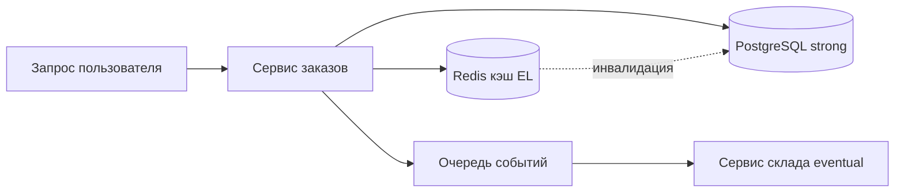

# PACELC и компромиссы распределённых систем

  ОБЯЗАТЕЛЬНО
  ДЛЯ НОВИЧКОВ

Разработчику
Архитектору

Один сервер с одной базой данных — простая картина: записали строку, сразу прочитали ту же строку. **Распределённая система** — несколько серверов, несколько дата-центров, реплики "рядом с пользователем". Запись попала в Европу, чтение ушло в Азию: что увидит клиент — свежие данные или копию с задержкой в полсекунды?

На такие вопросы отвечают **CAP** и её продолжение **PACELC** — язык для обсуждения компромиссов с командой и заказчиком, без привязки к конкретной СУБД.

Подробнее про CAP, ACID и BASE: [Основы NoSQL](/encyclopedia/3-data-markup/3-06-nosql/2).

---

## Зачем это знать, если вы только бэкенд

Даже монолит на PostgreSQL рано или поздно получает **реплику для чтения**, **Redis-кэш** или второй регион для DR. Каждый слой даёт свои гарантии:

- "Пользователь нажал „Опубликовать“ — пост должен быть виден сразу" → нужна **согласованность** или режим **read-your-writes**.
- "Счётчик просмотров на главной может отставать на десять" → допустима **eventual consistency** ради скорости.
- "Платёж списали дважды" → проблема **идемпотентности** и **саги**, CAP тут вторичен.

PACELC помогает **назвать** выбор, который вы уже делаете по умолчанию.

---

## CAP в двух абзацах (напоминание)

**CAP-теорема** (Эрик Брюер, доказательство — Gilbert & Lynch): в **распределённой** системе при **разделении сети (partition)** нельзя одновременно обеспечить и строгую **согласованность (C)**, и полную **доступность (A)** с ответом на каждый запрос.

| Буква | Значение | Человечески |
|-------|----------|-------------|
| **C** | Consistency (в смысле CAP) | Все узлы согласованы по данным для завершённых записей |
| **A** | Availability | Работающий узел отвечает (ответ может быть устаревшим) |
| **P** | Partition tolerance | Система живёт, когда сеть между узлами рвётся |

На практике **P** считают обязательным: кабели рвутся, зоны AWS падают, Kubernetes "теряет" pod. При partition остаётся вилка: **CP** (ждём согласования, часть запросов может ждать или отказать) или **AP** (отвечаем с ближайшей реплики, данные могут временно расходиться).

CAP описывает **кризис** — сеть уже разделена. В обычные дни сеть **работает**, но репликация идёт с задержкой. Здесь вступает **PACELC**.

---

## Что такое PACELC

**PACELC** предложил Daniel Abadi (2012). Расшифровка по буквам:

> **If P** (есть partition) → **A** или **C**, как в CAP.  
> **Else** (сеть в штатном режиме, буква **E**) → выбор между **L** (latency, задержка) и **C** (consistency).

| Буква | Роль |
|-------|------|
| **P** | Partition — узлы не достучались друг до друга |
| **A** | Availability — отвечать на запросы |
| **C** | Consistency — строгое / линейное согласованное чтение |
| **E** | Else — "иначе", обычная работа без split-brain |
| **L** | Latency — низкая задержка ответа |

**Главная мысль:** даже когда сеть цела, вы всё равно выбираете — **ждать**, пока запись дойдёт до всех реплик (**C**), или **отдать** ответ с ближайшего узла (**L**). Геораспределённый сервис почти всегда живёт в ветке **EL**: быстрый ответ с локальной реплики, возможное отставание от "главной" копии.

---

## Простая аналогия

Два магазина одной сети с общим складом в Москве.

- **Partition:** связь между городами оборвалась. Магазин в Казани продаёт последнюю плитку шоколада по локальной книге (**A**), а московский склад думает, что товар ещё есть (**расхождение**). Либо оба магазина закрывают кассу, пока не сверят остатки (**C**, цена — недоступность).
- **Else (штатный режим):** связь есть. Покупатель в Новосибирске спрашивает остаток. Ответ за 5 мс с локальной копии (**L**) или за 200 мс после запроса в Москву (**C**).

Программистская версия: **CDN**, **read replica**, **кэш Redis** — всё это способы сдвинуть баланс в сторону **L**.

---

## Уровни согласованности (C — не одна кнопка)

"Согласованность" в разговорах путают. В PACELC речь о том, **насколько свежие** данные видит читатель относительно последней записи.

| Уровень | Смысл | Пример |
|---------|-------|--------|
| **Strong / linearizable** | Чтение как после записи в один узел | Баланс счёта после перевода |
| **Read-your-writes** | Пользователь видит свои же действия | Свой пост сразу после публикации |
| **Bounded staleness** | Отставание не больше N секунд или версий | Лента новостей "до минуты назад" |
| **Eventual** | Реплики сойдутся, если писать перестать | Счётчик лайков, просмотры |

Один продукт смешивает уровни: профиль — strong, лента — eventual. Документация СУБД (MongoDB `readConcern`, DynamoDB consistent read, Cassandra `LOCAL_QUORUM`) задаёт, **сколько узлов** участвует в чтении и записи — от этого зависят **L** и **C**.

---

## Как читать метки PA/EL, PC/EC

В статьях и слайдах встречают сокращения вроде **PA/EL** у Cassandra:

- при **P** система склоняется к **A** (доступность);
- при **E** — к **EL** (задержка важнее строгой согласованности на чтении).

Это **упрощённые ярлыки**, не закон природы. Тот же Cassandra с `LOCAL_SERIAL` или lightweight transactions ведёт себя иначе. Всегда смотрите **конкретные настройки кластера**.

### Таблица-подсказка (очень грубо)

| Система | При partition (CAP) | В штатном режиме (PACELC) | Комментарий |
|---------|---------------------|---------------------------|-------------|
| PostgreSQL, один узел | — | Низкая **L**, сильная **C** | Распределённость появляется с репликацией |
| PostgreSQL + синхронная реплика | **CP** | Ждём реплику → выше **L**, выше **C** | Запись подтверждается после ack standby |
| Cassandra (типичный QUORUM) | **AP** | **EL** на чтении из региона | Tunable consistency |
| DynamoDB | Настраиваемо | Strong read дороже по **L** | Eventual по умолчанию дешевле |
| Redis (primary + replica) | При failover — риск потери | Очень низкая **L** на master | Кэш часто **EL** по определению |

---

## PACELC и микросервисы

В монолите одна транзакция ACID закрывает заказ и списание склада. В **микросервисах** у каждого сервиса своя БД — единой транзакции на весь кластер нет.

Согласованность между сервисами строят иначе:

- **Сага** — цепочка локальных транзакций с компенсирующими шагами (отмена брони, если оплата упала).
- **Outbox** — событие в БД и в очередь атомарно с бизнес-записью, чтобы не потерять сообщение.
- **Идемпотентность** — повторный webhook платёжки не создаёт второй заказ.

Это уровень **бизнес-процесса**, поверх PACELC отдельной базы.

---

## Кэш всегда в зоне EL

**Кэш** (Redis, Memcached, CDN) — способ ответить за миллисекунды (**L**). Данные могут отставать от основной БД (**eventual**). Обязательны:

- **TTL** — срок жизни записи;
- **инвалидация** при изменении (удалить ключ, pub/sub, версия в ключе);
- понимание, что **cache aside** при промахе даёт лишний round-trip.

"Сбросили кэш — и пользователь увидел старую цену" — типичный баг компромисса **L** vs **C**, а не "CAP сломался".

---

## Вопросы при проектировании (чеклист)

| Вопрос заказчика | Если ответ "да" | Типичное решение |
|------------------|-----------------|------------------|
| Сразу виден только что созданный объект? | Read-your-writes или strong read | Запись и чтение с одного узла / majority |
| Допустимо ±N в агрегате? | Eventual | Async пересчёт, периодический batch |
| Глобальный p99 &lt; 100 ms? | **EL** | Реплика в регионе пользователя |
| Деньги между двумя сервисами? | Сага + идемпотентность | Отдельно от выбора AP/CP одной БД |
| Один источник правды для отчётности? | **C** на аналитической реплике | CQRS: write model и read model |

---

## Частые заблуждения

1. **"NoSQL = AP, SQL = CP"** — упрощение. CockroachDB, Spanner, PostgreSQL с синхронной репликой, MongoDB с majority — настраиваемо.
2. **"Выбрали AP — данные всегда неверные"** — eventual значит "сойдутся при отсутствии новых записей", для многих метрик это приемлемо.
3. **"Strong везде — значит качественный продукт"** — глобальный strong read дорог по **L** и по деньгам; пользователь ждёт спиннер.
4. **CAP/PACELC заменяют тестирование** — теорема объясняет границы, **нагрузочные и chaos-тесты** показывают поведение вашего деплоя.

---

## Связанные темы

- [Микросервисы и масштабирование](/encyclopedia/8-infra-security/8-05-mikroservisy-i-integratsiya/1)
- [CQRS](/encyclopedia/7-project/7-06-proektirovanie-i-arhitektura/design/2122)
- [Компетенции бэкенда](/encyclopedia/1-basics/1-23-frontend-i-bekend/4)
- [Основы NoSQL — CAP, ACID, BASE](/encyclopedia/3-data-markup/3-06-nosql/2)

---

## Итоги

**CAP** — про момент, когда сеть **уже** разделена: доступность или согласованность. **PACELC** добавляет повседневность: при **рабочей** сети вы всё равно балансируете **задержку** и **свежесть данных**. Кэш, реплики в регионе, eventual-ленты — осознанный **EL**; платежи и инварианты — осознанный **C** и паттерны между сервисами.

Перед выбором СУБД спросите: "Что пользователь должен увидеть через 100 ms после действия?" Ответ сформулирует требование лучше, чем спор "мы CP или AP".

---
