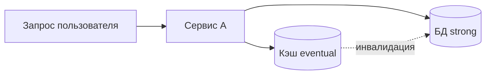

# PACELC и компромиссы распределённых систем

  ОБЯЗАТЕЛЬНО
  ДЛЯ НОВИЧКОВ

Разработчику
Архитектору

**CAP-теорема** говорит: при **разделении сети (partition)** распределённое хранилище не может одновременно дать и строгую **согласованность (C)**, и полную **доступность (A)** — остаётся выбор CP или AP. Подробнее в [основах NoSQL](/encyclopedia/3-data-markup/3-06-nosql/2).

На практике сеть **чаще работает**, но медленно или с репликацией с задержкой. Это закрывает **PACELC** (Daniel Abadi, 2012).

---

## Формулировка PACELC

> Если **P** (partition) — то **A** или **C**, как в CAP.  
> **Иначе (E — else, нормальная работа)** — выбор между **L** (latency) и **C** (consistency).

| Буква | Значение |
|-------|----------|
| **P** | Сбой сети, split-brain |
| **A** | Отвечать на запросы |
| **C** | Линейная / строгая согласованность |
| **L** | Низкая задержка |
| **E** | «Иначе» — штатный режим |

**Идея:** даже без partition вы выбираете, ждать ли реплик для строгого чтения (**C**) или отдавать данные с ближайшего узла (**L**).

---

## Примеры классификации (упрощённо)

| Система | При partition | В штатном режиме |
|---------|---------------|------------------|
| Традиционный RDBMS с синхронной репликацией | CP | Склонность к C (ждём реплику) |
| Cassandra (типичные настройки) | AP | PA/EL — доступность и задержка |
| DynamoDB (настраиваемо) | Настраиваемо | Strong read vs eventual |
| Redis (один primary) | CP при failover | Низкая L на master |

Точные настройки меняют поведение — смотрите **документацию конкретной СУБД**, не лозунг на слайде.

---

## Что это значит бэкенд-разработчику

1. **«Согласованность» не бинарна** — есть уровни: strong, bounded staleness, eventual ([NoSQL](/encyclopedia/3-data-markup/3-06-nosql/2)).
2. **Геораспределение** — чтение «из региона пользователя» почти всегда trade-off с C.
3. **Кэш** — всегда EL: быстро, но может отставать от БД; нужна **инвалидация**.
4. **Микросервисы** — согласованность между сервисами = **саги / outbox**, не одна ACID-транзакция на весь кластер.

---

## Практические вопросы при проектировании

| Вопрос | Если «да» |
|--------|-----------|
| Пользователь должен сразу видеть свой только что созданный пост? | Strong read или read-your-writes |
| Допустим счётчик просмотров ±10? | Eventual + async aggregate |
| Платёж между двумя сервисами? | Saga + идемпотентность, не «надежда на CAP» |
| SLA p99 &lt; 100 ms глобально? | Реплики ближе к пользователю → осознанный EL |

---

## Связанные темы

- [Микросервисы](/encyclopedia/8-infra-security/8-05-mikroservisy-i-integratsiya/1)
- [CQRS](/encyclopedia/7-project/7-06-proektirovanie-i-arhitektura/design/2122)
- [Компетенции бэкенда](/encyclopedia/1-basics/1-23-frontend-i-bekend/4)

---
