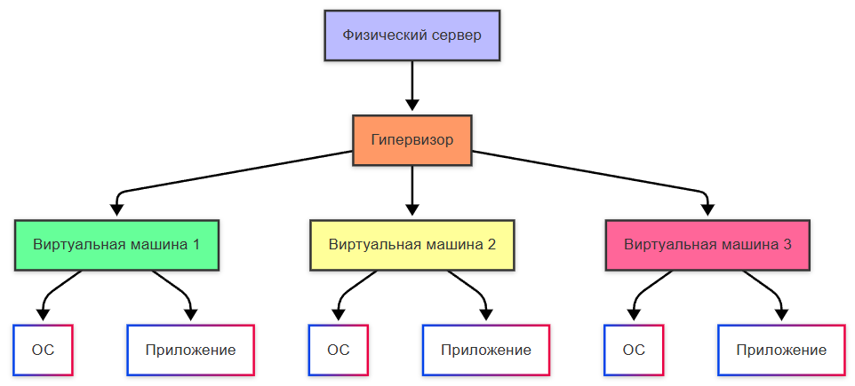

import ContainerOrchestrator from '@site/src/components/ContainerOrchestrator.jsx';

# Контейнеризация

  ОБЯЗАТЕЛЬНО
  ДЛЯ НОВИЧКОВ

Разработчику
Архитектору
Инженеру

---

## Контейнеризация

  
Правила неизбежности

  
- каждая система имеет свою архитектуру построения;

  
- систему нужно разворачивать так, чтобы она выдержала требуемую нагрузку;

  
- нужно понять, как обновлять систему, и исправлять ошибки;

  
- рано или поздно придётся интегрировать систему с внешними ресурсами;

  
- придётся обеспечить безопасность данных и доступа к системе;

  
- система неизбежно будет расширяться;

  
- будут ошибки, и нужна будет поддержка.

---

### Что такое контейнер?

> Контейнер — это изолированный кусочек операционной системы, внутри которого живёт приложение. Внутри него есть приложение, все его зависимости, файлы, переменные окружения. А снаружи есть Docker, который управляет такими контейнерами.

Контейнеры позволяют запустить приложение с его личными зависимостями на любой Linux-машине, где есть Docker, без конфликтов с другими приложениями и без тяжёлой виртуализации. А с Docker Desktop можно развернуть и на Windows.

Контейнер — это среда исполнения: **экземпляр образа** (запущенный процесс с файловой системой из слоёв образа).

  
Мини-словарь

  
<strong>Образ (image)</strong> — неизменяемый шаблон (слои ФС + метаданные).

  
<strong>Контейнер</strong> — запущенный экземпляр образа + writable-слой изменений.

  
<strong>Registry</strong> — хранилище образов (Docker Hub и др.).

  
<strong>Engine</strong> — демон dockerd и CLI на хосте.

Контейнеризация — процесс развёртывания с использованием контейнеров; сейчас это важная часть разработки ПО.

★ **Контейнер** — "коробка", в которую упаковано приложение со всеми нужными компонентами. Эту "коробку" можно перенести на другой сервер и запустить с предсказуемым результатом.

Виртуальная машина:
 

Контейнер:

Контейнеризация выросла из практических ограничений предыдущих подходов. Сначала приложения запускали на физических серверах: один сервер, одна ОС, один набор ресурсов. Такой подход работал, но масштабирование было дорогим, а сопровождение требовало много ручной работы.

Следующим этапом стали виртуальные машины. На одном физическом сервере появлялось несколько ВМ с раздельными ресурсами и изоляцией. Это сильно улучшило гибкость: сервисы стало проще восстанавливать, переносить и масштабировать.

Позже появились контейнеры — более лёгкий и быстрый формат запуска приложений. Контейнеры используют ядро хостовой ОС, но сохраняют изоляцию процессов и файловой системы. На практике это даёт:
	- можно легко создать контейнер из образа;
	- простой и быстрый откат образа контейнера;
	- распределение задач во время сборки (то есть ДО развертывания на целевой инфраструктуре);
	- наблюдаемость с информацией и метриками;
	- независимость от платформ, переносимость, и идентичная окружающая среда, независимо – на ПК или в облаке;
	- возможность разбивать микросервисы по приложениям, а не ВМ;
	- большая компактность.

Контейнеры не требуют отдельной операционной системы для каждого экземпляра, в отличие от виртуальных машин, что снижает потребление ресурсов. Запуск и остановка контейнеров происходит быстро - на сервере установлена одна операционная система, которая используется всеми контейнерами.

Сравнение подходов развертывания:

| Критерий | Физические серверы | Виртуальные машины | Контейнеры |
|----------|-------------------|-------------------|------------|
| Изоляция | Физическая | Гипервизор | Операционная |
| Время запуска | Минуты-часы | Минуты | Секунды |
| Использование ресурсов | Высокое | Среднее | Низкое |
| Портативность | Низкая | Средняя | Высокая |
| Масштабируемость | Ограниченная | Хорошая | Отличная |
| Безопасность | Высокая | Высокая | Средняя |

---

## Как работают контейнеры?

<ContainerOrchestrator />

---

## Где контейнеризация даёт максимальную пользу

Контейнеризация особенно эффективна в сценариях, где важно быстро и одинаково запускать приложение в разных средах.

- **Локальная разработка** — вся команда поднимает одинаковую среду с БД, кэшем и API без "работает только у меня".
- **Тестовые стенды** — окружение создаётся автоматически и удаляется после тестов, что снижает "дрейф конфигурации".
- **CI/CD** — сборка в контейнере делает результат предсказуемым: один и тот же Dockerfile даёт одинаковый артефакт.
- **Микросервисы** — каждый сервис получает свой образ, независимый цикл релиза и понятные границы зависимостей.
- **Гибридные среды** — один и тот же образ запускается в локальной инфраструктуре и в облаке.

---

## Частые ошибки при первом внедрении

Массовые сложности на старте обычно связаны с неверной моделью эксплуатации.

- **Контейнер как "мини-VM"** — в контейнер складывают много процессов и вручную администрируют его изнутри.
- **Состояние внутри контейнера** — важные данные пишут в writable-слой без томов и теряют их при пересоздании.
- **Тег latest в проде** — версия образа плавает, релизы становятся нереплицируемыми.
- **Отсутствие лимитов ресурсов** — один сервис может занять всю память хоста и вызвать OOM у соседних процессов.
- **Нет наблюдаемости** — логи, метрики и healthcheck не настроены, диагностика инцидентов занимает больше времени.

Практичнее использовать модель "один контейнер — один основной процесс", явные версии образов и проверку готовности сервиса.

---

## Контейнеризация и оркестрация — где граница

Контейнеризация отвечает за упаковку и запуск одного приложения. Оркестрация управляет множеством контейнеров в кластере: размещением, сетями, обновлениями, автоперезапуском и масштабированием.

Если контейнеров немного, достаточно Docker и Compose. Когда появляются десятки сервисов, несколько окружений, отказоустойчивость и требования к автоматизации, подключают оркестратор.

Сразу полезно пройти связанные статьи:

- [Docker](/encyclopedia/8-infra-security/8-06-konteynerizatsiya-i-orkestratsiya/111)
- [docker-compose](/encyclopedia/8-infra-security/8-06-konteynerizatsiya-i-orkestratsiya/1111)
- [Объекты Docker](/encyclopedia/8-infra-security/8-06-konteynerizatsiya-i-orkestratsiya/112)
- [Сеть в контейнерах](/encyclopedia/8-infra-security/8-06-konteynerizatsiya-i-orkestratsiya/115)

---

## Архитектура и принципы контейнеризации

### Ядро контейнеризации

Контейнеризация основана на использовании возможностей ядра операционной системы, в частности:
- **Пространства имен (namespaces)** - обеспечивают изоляцию процессов, сетевых интерфейсов, точек монтирования и других ресурсов
- **Cgroups (control groups)** - управляют распределением ресурсов между контейнерами
- **Union file systems** - позволяют эффективно создавать слои файловых систем

Каждый контейнер работает в изолированной среде, имея доступ только к своим ресурсам, при этом используя ядро хостовой операционной системы.

Контейнеры позволяют реализовать принцип "сборка один раз, запускай везде", что критически важно для современных методологий разработки и эксплуатации программного обеспечения.

---

### Структура контейнера

Контейнер состоит из нескольких ключевых компонентов:

**Образ контейнера** - неизменяемый шаблон, содержащий:
- Базовую операционную систему
- Необходимые библиотеки и зависимости
- Исходный код приложения
- Конфигурационные файлы

**Слои образа** - образ строится из последовательных слоев:
- Базовый слой ОС
- Слой зависимостей
- Слой приложения
- Конфигурационные слои

**Контейнер** - запущенный экземпляр образа с:
- Изолированным процессом
- Выделенными ресурсами
- Собственной файловой системой
- Сетевым стеком

---

### Жизненный цикл контейнера

1. **Сборка** - создание образа из исходного кода и зависимостей
2. **Регистрация** - сохранение образа в репозитории
3. **Развертывание** - запуск контейнера из образа
4. **Эксплуатация** - работа контейнера в производственной среде
5. **Масштабирование** - создание дополнительных экземпляров
6. **Обновление** - замена старых контейнеров новыми версиями
7. **Очистка** - удаление неиспользуемых контейнеров и образов

---
