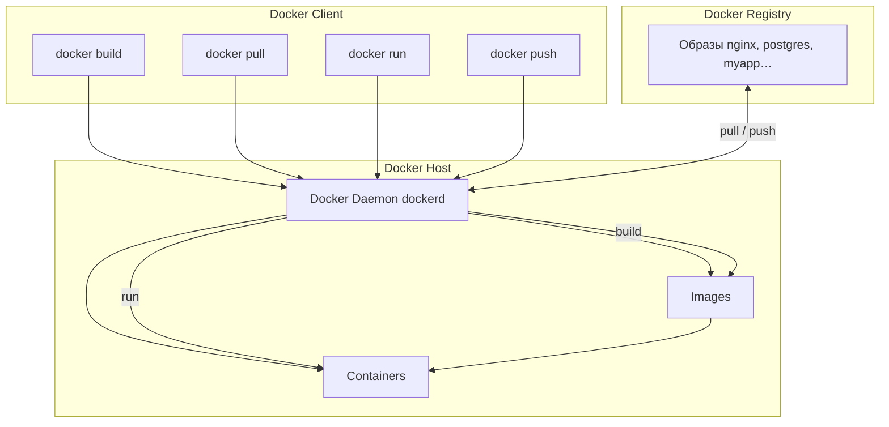

import DockerEmulator from '@site/src/components/DockerEmulator.jsx';

# Docker

<div class="article-tags">
  <span class="tag tag-required">ОБЯЗАТЕЛЬНО</span>
  <span class="tag tag-beginner">ДЛЯ НОВИЧКОВ</span>
</div>

<span class="complexity-badge">Разработчику</span>
<span class="complexity-badge">Архитектору</span>
<span class="complexity-badge">Инженеру</span>

---

## Docker

### Что такое Docker?

★ **Docker** — платформа для упаковки, доставки и запуска контейнеров. Она стандартизирует путь "собрали образ -> передали в реестр -> запустили в нужной среде".

Docker Engine в типичной схеме включает:
	- **клиент** (CLI) — отправляет команды;
	- **демон** (dockerd) на хосте — собирает образы, запускает контейнеры, управляет сетями и томами;
	- **реестр** (Registry) — хранит и раздаёт образы (Docker Hub и др.).

**Оркестратор** (Docker Swarm, Kubernetes) — отдельный уровень поверх Engine; он нужен, когда контейнеров много и требуются автомасштабирование и самовосстановление. Подробнее — в главах про Swarm и Kubernetes.

<span id="kak-ustroen-docker"></span>

### Как устроен Docker

Команды `docker build`, `docker pull`, `docker run` и `docker push` вводятся в **клиенте**, а выполняет их **демон** на хосте. Образы и контейнеры живут на машине с Docker Engine; обмен готовыми образами между командами и серверами идёт через **реестр** (Docker Hub, GitLab Container Registry, Harbor, ECR и др.).

Три уровня в типичной схеме:

| Уровень | Состав | Роль |
|---------|--------|------|
| **Docker Client** | CLI (`docker`), IDE, CI-скрипты | Принимает команду и передаёт её демону (REST API; на Linux часто сокет `/var/run/docker.sock`) |
| **Docker Host** | **Демон** `dockerd`, локальные **образы**, **контейнеры** | Собирает образы, хранит слои, запускает и останавливает контейнеры, настраивает сети и тома |
| **Docker Registry** | Удалённое или локальное хранилище образов | Хранит и раздаёт образы по имени и тегу; демон скачивает и загружает слои по протоколу registry |

Четыре базовые команды и поток данных:

| Команда | Что происходит | Результат |
|---------|----------------|-----------|
| `docker build` | Клиент → демон читает Dockerfile и контекст каталога, собирает слои | Новый **образ** в локальном хранилище хоста |
| `docker pull` | Клиент → демон запрашивает образ у **реестра**, докачивает недостающие слои | Образ появляется на хосте (в `Images`) |
| `docker run` | Клиент → демон берёт **образ**, создаёт изоляцию процесса и стартует приложение | Работающий **контейнер** |
| `docker push` | Клиент → демон отправляет слои локального образа в **реестр** | Образ доступен для `pull` на других машинах и в CI/CD |



<div class="callout callout--info">
  <div class="callout-title">Кратко по ролям</div>
  <div class="callout-body">
  <p><strong>Образ</strong> — неизменяемый шаблон (слои ФС + метаданные). <strong>Контейнер</strong> — запущенный экземпляр образа с writable-слоем изменений. Аналогия с ООП: образ похож на класс, контейнер — на объект.</p>
  <p>На Windows и macOS Docker Desktop поднимает Linux-ВМ или WSL2: демон работает внутри неё, клиент на вашей ОС общается с ним через API.</p>
  </div>
</div>


---

### Когда выбирать Docker, а когда VM

Docker и виртуальные машины решают разные инженерные задачи, поэтому выбор зависит от контекста эксплуатации.

- **Docker** лучше подходит для сервисов с быстрым циклом релизов, масштабированием и стандартизированной сборкой.
- **VM** удобнее, когда нужна сильная изоляция уровня ядра, отдельные ОС на инстанс или legacy-нагрузка.
- **Комбинированный подход** встречается чаще всего: Docker-контейнеры запускаются внутри VM в облаке.

Практическое правило: если сервис создаётся и обновляется через CI/CD, а инфраструктура ориентирована на микросервисы, Docker даёт максимальную скорость поставки.

---

### Как работать с Docker?

<DockerEmulator />

---

### Компоненты Docker

Сводка терминов (схема потоков — [выше](#kak-ustroen-docker)):

- **Клиент** — CLI или API-клиент; команды `docker build`, `docker run`, `docker pull`, `docker push` уходят демону, а не выполняются «сами по себе» в shell.
- **Хост** — машина с Docker Engine: демон, каталог локальных образов, работающие и остановленные контейнеры, тома и сети.
- **Демон** (`dockerd`) — собирает образы, тянет и пушит слои в реестр, создаёт контейнеры, пробрасывает порты, подключает тома.
- **Реестр** — каталог образов для команд и серверов; подробнее в [DockerHub и реестрах образов](/encyclopedia/8-infra-security/8-06-konteynerizatsiya-i-orkestratsiya/113).
- **Оркестратор** (Swarm, Kubernetes) — уровень над Engine для кластеров; см. [Docker Swarm и Kubernetes](/encyclopedia/8-infra-security/8-06-konteynerizatsiya-i-orkestratsiya/117).

Официальная документация и Docker Desktop — на [docker.com](https://www.docker.com/).

---

### Порядок работы с Docker

Принцип работы:
- **подготовка** — на машине разработчика устанавливается Docker (клиент и демон);
- **разработка** — приложение разрабатывается как обычно;
- **формирование Dockerfile** (IDE могут сгенерировать его при включённой поддержке Docker);
- **сборка, публикация, деплой**:

```bash
docker build -t myapp:1.0 .
docker push myregistry/myapp:1.0
docker pull myregistry/myapp:1.0
docker run -d -p 8080:80 --name myapp myapp:1.0
```

Разбор:
- `docker build -t myapp:1.0 .` собирает образ из Dockerfile в текущей директории (`.` — контекст сборки) и присваивает имя `myapp` с тегом `1.0`.
- `docker push myregistry/myapp:1.0` загружает собранный образ в удалённый реестр `myregistry` под полным именем `myregistry/myapp:1.0`.
- `docker pull myregistry/myapp:1.0` скачивает тот же образ на целевую машину перед запуском, если его ещё нет локально.
- `docker run -d` запускает контейнер в фоновом режиме (detached): процесс не привязан к текущему терминалу.
- `-p 8080:80` пробрасывает порт 8080 хоста на порт 80 внутри контейнера — снаружи сервис доступен по `http://localhost:8080`.
- `--name myapp` задаёт имя контейнера для последующих команд (`docker stop myapp`, `docker logs myapp`).
- В конце указывается образ `myapp:1.0`, из которого создаётся и стартует контейнер.

При обновлении цикл повторяют с новым тегом образа.


Пример выше – демон Docker создает контейнер из образа myapp:1.0, называет его myapp и пробрасывает порт 8080 хоста на порт 80 контейнера.

При деплое важно учесть, что на среде тестирования или развертывания Docker важно убедиться в обеспечении зависимостей – поэтому всё необходимое нужно установить и сконфигурировать, допустим базу данных.

Чит-лист - https://cheatsheets.zip/docker

---

### Практический сценарий — от репозитория до запуска

Ниже типовая цепочка для команды, где разработка и эксплуатация уже связаны через CI/CD:

1. Разработчик обновляет код и Dockerfile.
2. CI запускает `docker build` и прогоняет тесты в контейнере.
3. Готовый образ тегируется версией (`myapp:1.4.2`) и пушится в registry.
4. На целевой среде выполняется pull и controlled rollout.
5. Мониторинг отслеживает метрики, логи и статус healthcheck после выката.

Такой поток даёт воспроизводимость и быстрый rollback на предыдущий тег.

---

### Загрузка образа

**docker pull** загружает образ из реестра, по принципу:
```bash
docker pull [OPTIONS] IMAGE[:TAG|@DIGEST]
```

Разбор:
- `docker pull` загружает образ из реестра (по умолчанию Docker Hub) в локальное хранилище демона.
- `[OPTIONS]` — необходимые флаги: платформа (`--platform`), прокси, отключение проверки подписи и др.
- `IMAGE` — имя образа; для Docker Hub достаточно `nginx`, для частного реестра — `registry.example.com/team/nginx`.
- `[:TAG]` — необязательный тег версии (`latest`, `1.25-alpine`); без тега обычно подставляется `latest`.
- `[@DIGEST]` — альтернатива тегу: фиксированный SHA256-слой образа для воспроизводимых деплоев.
- Квадратные скобки в справке означают необязательные части команды, а не литеральные символы.

Пример:
```bash
docker pull nginx:latest
```

Разбор:
- `nginx` — официальный образ веб-сервера Nginx из Docker Hub (репозиторий `library/nginx`).
- `:latest` — тег «последняя стабильная» сборка в ветке по умолчанию; в продакшене лучше фиксировать конкретную версию (`nginx:1.25`).
- Демон скачивает все слои образа, которых ещё нет локально, и регистрирует тег `nginx:latest` в локальном хранилище.
- После успешного pull образ можно запускать через `docker run nginx:latest` без повторной загрузки.

	- IMAGE : Имя образа (например, nginx).
	- TAG : Версия образа (например, latest).

Клиент при этом отправляет запрос в реестр (по умолчанию Docker Hub), и если образ найден, он скачивается и сохраняется локально.

---

### Создание образа

**docker build** создаёт новый образ на основе Dockerfile:
```bash
docker build [OPTIONS] PATH | URL | -
```

Разбор:
- `docker build` читает Dockerfile и собирает образ слой за слоем.
- `[OPTIONS]` — флаги вроде `-t` (имя и тег), `-f` (путь к Dockerfile), `--no-cache`, `--build-arg`.
- `PATH` — локальный каталог контекста сборки: в образ попадают только файлы из этого дерева (часто `.`).
- `URL` — удалённый git-репозиторий или архив как источник контекста.
- `-` — контекст передаётся через stdin (tar-поток), используется в CI и скриптах.
- Вертикальная черта `|` в справке означает «один из вариантов», а не символ pipe в shell.

Основные опции:
	- `-t`: Задает имя и тег образа.
	- `-f`: Указывает путь к Dockerfile (если он не находится в текущей директории).
Пример:
```bash
docker build -t my-app:1.0 -f /path/to/Dockerfile .
```

Разбор:
- `-t my-app:1.0` задаёт локальное имя образа `my-app` и тег `1.0` (эквивалент `my-app:1.0`).
- `-f /path/to/Dockerfile` указывает путь к Dockerfile, если он не лежит в корне контекста под именем `Dockerfile`.
- Финальная точка `.` — контекст сборки: демон отправляет содержимое текущей директории (или указанного пути) демону для `COPY`/`ADD`.
- Инструкции `COPY` в Dockerfile могут брать файлы только из контекста, а не с произвольных путей хоста.
- После успешной сборки образ доступен локально как `my-app:1.0` для `docker run` и `docker push`.

	- PATH : Контекст сборки (текущая директория или путь к файлам).
	- IMAGE : Имя образа (my-app).
	- IMAGE_TAG : Тег образа (1.0).

Docker читает Dockerfile, выполняет инструкции по порядку, создавая слои, и сохраняет финальный образ в локальном хранилище.

---

### Запуск контейнера из образа

**docker run** запускает контейнер из образа:
 
```bash
docker run [OPTIONS] IMAGE [COMMAND] [ARG...]
```

Разбор:
- `docker run` создаёт новый контейнер из образа и по умолчанию запускает процесс, заданный в образе (`CMD`/`ENTRYPOINT`).
- `[OPTIONS]` — сеть, порты, тома, переменные окружения, имя, политика перезапуска и др.
- `IMAGE` — обязательное имя образа с тегом или digest; при отсутствии локально выполняется `pull`.
- `[COMMAND]` — переопределяет команду запуска из Dockerfile (например, `sh` вместо веб-сервера).
- `[ARG...]` — аргументы, передаваемые команде контейнера.
- Каждый вызов `docker run` создаёт **новый** контейнер; для повторного старта того же экземпляра используют `docker start`.

Основные опции:
	- `-p` HOST_PORT:CONTAINER_PORT: Проброс портов.
	- `-d`: Запуск в фоновом режиме (detached mode).
	- `-it`: Интерактивный режим (для терминала).
	- `--name`: Задает имя контейнера.
Пример:
```bash
docker run -d -p 8080:80 --name my-nginx nginx
```

Разбор:
- `-d` (detached) запускает контейнер в фоне и возвращает управление терминалу, выводя ID контейнера.
- `-p 8080:80` публикует порт: трафик на `8080` хоста направляется на порт `80` внутри контейнера (формат `хост:контейнер`).
- `--name my-nginx` задаёт удобное имя вместо автогенерированного; имя должно быть уникальным на хосте.
- Образ `nginx` без тега эквивалентен `nginx:latest` — подтянется последняя версия из реестра при отсутствии локально.
- Внутри контейнера Nginx слушает 80-й порт; с хоста сервис открывается по `http://localhost:8080`.

	- HOST_PORT : Порт на хостовой системе (8080).
	- CONTAINER_PORT : Порт внутри контейнера (80).

Docker проверяет, есть ли образ локально. Если образа нет, он скачивается из реестра, а затем создаётся и запускается контейнер.

---

### Отправка образа в реестр

**docker push** загружает образ в реестр:
```bash
docker push NAME[:TAG]
```

Разбор:
- `docker push` отправляет локальный образ в удалённый registry (Docker Hub, Harbor, ECR и др.).
- `NAME` — полное имя репозитория, часто с префиксом реестра и namespace: `myregistry.example.com/team/my-app`.
- `[:TAG]` — версия образа; без тега пушится `latest`.
- Перед push образ должен существовать локально и быть помечен тегом, совпадающим с именем в реестре (`docker tag` при необходимости).
- Для приватных реестров обычно требуется предварительный `docker login`.

Пример:
```bash
docker push my-dockerhub-username/my-app:1.0
```

Разбор:
- `my-dockerhub-username` — namespace (учётная запись) на Docker Hub; образ должен принадлежать этому пользователю или организации.
- `my-app` — имя репозитория внутри namespace.
- `:1.0` — тег версии, который появится в реестре и по которому можно будет делать `pull` и деплой.
- Локальный образ должен быть помечен тем же именем (`docker tag local:1.0 my-dockerhub-username/my-app:1.0`).
- После push образ доступен команде и CI/CD с любой машины через `docker pull`.

Docker отправляет образ в указанный реестр. Если реестр требует авторизации:

```bash
docker login
docker login myregistry.example.com
```

Разбор:
- `docker login` без аргументов открывает интерактивный ввод учётных данных для Docker Hub (логин, пароль или token).
- Учётные данные сохраняются в `~/.docker/config.json` (или аналог в Windows) и подставляются при последующих `push`/`pull`.
- `docker login myregistry.example.com` аутентифицирует клиент в **конкретном** частном реестре по его URL.
- Для CI вместо пароля часто используют Personal Access Token или robot-account.
- Без успешного login приватный реестр вернёт ошибку 401 при `push` или `pull`.

---

### Развёртывание контейнера

Таким образом, суть Docker в том, чтобы упростить развёртывание на любых системах. Нужно просто установить сам движок Docker, выполнить сборку образа, и развернуть экземпляр образа на целевой машине в виде контейнера. Допустим, можно просто поставить Docker на сервер, скачать готовый образ из реестра и буквально одной командой запустить программу. Это очень удобно для развёртывания фоновых служб и сервисов.

```dockerfile
# Сначала установка зависимостей
COPY requirements.txt .
RUN pip install -r requirements.txt

# Потом копирование кода
COPY . .
```

Разбор:
- Комментарии `#` в Dockerfile не влияют на сборку, но документируют порядок слоёв для читателя.
- Сначала `COPY requirements.txt .` копирует только файл зависимостей — при изменении кода слой с `pip install` остаётся в кэше.
- `RUN pip install -r requirements.txt` создаёт слой с установленными пакетами Python внутри образа.
- Затем `COPY . .` переносит весь исходный код; этот слой пересобирается чаще, чем слой зависимостей.
- Такой порядок ускоряет повторные `docker build` за счёт кэширования слоёв Docker.

Так и выполнить многоступенчатую сборку, создавая лёгкие образы, исключая ненужные зависимости:

```dockerfile
# Стадия 1 — Сборка приложения
FROM golang:1.20 AS builder
WORKDIR /app
COPY . .
RUN go build -o myapp .

# Стадия 2 — Финальный образ
FROM alpine:latest
WORKDIR /app
COPY --from=builder /app/myapp .
CMD ["./myapp"]

```

Разбор:
- `FROM golang:1.20 AS builder` — первая стадия на полном Go-образе; имя `builder` нужно для `COPY --from`.
- `WORKDIR /app` задаёт рабочую директорию для последующих `COPY` и `RUN`.
- `RUN go build -o myapp .` компилирует бинарник `myapp` в стадии сборки (компилятор и исходники не попадут в финальный образ).
- `FROM alpine:latest` — вторая стадия на минимальном базовом образе (~5 МБ без приложения).
- `COPY --from=builder /app/myapp .` копирует только артефакт из именованной стадии, отсекая toolchain Go.
- `CMD ["./myapp"]` — exec-форма команды по умолчанию при `docker run` без переопределения.

Тут в стадии №1 собирается приложение с использованием Go, а на стадии №2 создаётся минимальный образ на основе Alpine, копируя только исполняемый файл.

Подробнее про инструкции и кэш слоёв — [Dockerfile](/encyclopedia/8-infra-security/8-06-konteynerizatsiya-i-orkestratsiya/116); готовые файлы под Node, Python, Go и другие стеки с разбором для копирования — [Dockerfile — 10 типовых образов](/lab/Примеры/11113).

---

### Чек-лист качества Docker-образа

Перед публикацией образа стоит проверить базовые критерии "production-ready":

- используется фиксированный тег базового образа;
- образ собирается без секретов внутри слоёв;
- приложение запускается не от root-пользователя;
- есть healthcheck и корректная обработка SIGTERM;
- размер образа разумный, лишние build-зависимости убраны;
- версия образа привязана к релизу или commit SHA.

Эти проверки заметно снижают риск проблем на этапе деплоя.

---

### Docker Compose

Docker Compose — инструмент для управления многоконтейнерными приложениями. Он позволяет описать сервисы, тома и сети в файле `compose.yaml` (раньше часто `docker-compose.yml`).

Современный CLI: **`docker compose`** (подкоманда Docker). Старый отдельный бинарник `docker-compose` ещё встречается, но в новых установках используют плагин Compose V2.

Подробнее — в [документации Compose](https://docs.docker.com/compose/) и в главе [docker-compose](/encyclopedia/8-infra-security/8-06-konteynerizatsiya-i-orkestratsiya/1111). Сборка своего образа для `build: .` — [Dockerfile — 10 типовых образов](/lab/Примеры/11113). Четырнадцать готовых стеков с разбором каждой строки — [Docker Compose — готовые стеки](/lab/Примеры/11111).

Пример `compose.yaml`:
```yaml
version: '3.8'
services:
  web:
    image: nginx:latest
    ports:
      - "8080:80"
  app:
    build: .
    ports:
      - "5000:5000"
  db:
    image: postgres:13
    environment:
      POSTGRES_PASSWORD: example

```

Разбор:
- `version: '3.8'` — версия схемы Compose-файла (в Compose V2 поле необязательно, но задаёт совместимость синтаксиса).
- `services` — описание контейнеров приложения: каждый ключ (`web`, `app`, `db`) — имя сервиса и DNS-имя в сети Compose.
- `web.image: nginx:latest` — готовый образ из реестра без локальной сборки.
- `ports: "8080:80"` — публикация порта в формате `хост:контейнер` для сервиса `web`.
- `app.build: .` — сборка образа из Dockerfile в текущей директории; порт `5000:5000` пробрасывает API приложения.
- `db` использует `postgres:13` и `environment.POSTGRES_PASSWORD` — переменная инициализации БД (в проде — secrets, не plain text).

Основные разделы docker-compose.yml:
	- version : Версия формата файла.
	- services : Описание сервисов (контейнеров).
	- networks : Настройка сетей.
	- volumes : Настройка томов.

Запуск:
```bash
docker compose up
```

Разбор:
- `docker compose` — подкоманда Docker CLI (Compose V2), читает `compose.yaml` / `docker-compose.yml` в текущей директории.
- `up` создаёт сеть и тома при необходимости, собирает образы (`build`) и запускает все описанные `services`.
- Контейнеры стартуют в порядке зависимостей, если заданы `depends_on` (в примере выше — нет явных зависимостей).
- Процесс привязан к терминалу: логи всех сервисов идут в stdout, остановка — `Ctrl+C`.
- Для фонового режима используют `docker compose up -d`.

Запуск в фоне, остановка, логи:
```bash
docker compose up -d
docker compose down
docker compose logs -f
docker compose up --scale web=3
```

Разбор:
- `docker compose up -d` поднимает стек в detached-режиме: терминал свободен, контейнеры работают в фоне.
- `docker compose down` останавливает и удаляет контейнеры проекта; сеть по умолчанию удаляется, тома — только с флагом `-v`.
- `docker compose logs -f` выводит логи сервисов в реальном времени (`-f` — follow, как `tail -f`).
- `docker compose up --scale web=3` запускает три экземпляра сервиса `web` (имя из секции `services` в YAML).
- Масштабирование через `--scale` не заменяет балансировщик в Kubernetes: трафик на несколько реплик нужно маршрутизировать отдельно.

**Масштабирование и отказоустойчивость.** Compose позволяет вручную поднять несколько экземпляров сервиса (см. `--scale` выше) и задать политику `restart: unless-stopped`, но **не** подбирает число реплик по нагрузке и не балансирует трафик как Kubernetes. Для автоматического масштабирования и самовосстановления в продакшене используют оркестраторы (Swarm, Kubernetes).

---

### Куда двигаться дальше

После освоения базового цикла Docker логично углубиться в связанный стек:

- [Dockerfile](/encyclopedia/8-infra-security/8-06-konteynerizatsiya-i-orkestratsiya/116) — инструкции и multi-stage;
- [Dockerfile — 10 типовых образов](/lab/Примеры/11113) — Node, Python, Go, SPA, Spring, PHP, .NET с построчным разбором;
- [docker-compose](/encyclopedia/8-infra-security/8-06-konteynerizatsiya-i-orkestratsiya/1111) — многоконтейнерные окружения;
- [Docker Compose — готовые стеки](/lab/Примеры/11111) — nginx, PostgreSQL, Redis, WordPress с построчным разбором;
- [Объекты Docker](/encyclopedia/8-infra-security/8-06-konteynerizatsiya-i-orkestratsiya/112) — образ, слой, контейнер, volume;
- [DockerHub и реестры образов](/encyclopedia/8-infra-security/8-06-konteynerizatsiya-i-orkestratsiya/113) — публикация и контроль версий образов;
- [Сеть в контейнерах](/encyclopedia/8-infra-security/8-06-konteynerizatsiya-i-orkestratsiya/115) — изоляция и связность сервисов.

---

## Работа с Docker

### 18 команд, которые держат под рукой

Перед полным списком ниже — карманный набор из [универсальной шпаргалки](/encyclopedia/8-infra-security/8-06-konteynerizatsiya-i-orkestratsiya/118#docker-18-komand). Каждая строка — одна типовая задача.

| Команда | Задача |
|---------|--------|
| `docker run` | Запустить контейнер из образа |
| `docker build` | Собрать свой образ из Dockerfile |
| `docker pull` | Скачать образ из реестра |
| `docker push` | Опубликовать образ в реестр |
| `docker images` | Список локальных образов |
| `docker ps` | Список работающих контейнеров |
| `docker stop` / `start` / `restart` | Остановить, запустить снова или перезапустить |
| `docker kill` | Принудительно прервать процесс |
| `docker rm` | Удалить остановленный контейнер |
| `docker rmi` | Удалить образ |
| `docker exec` | Выполнить команду внутри работающего контейнера |
| `docker logs` | Прочитать логи |
| `docker inspect` | Детали конфигурации (JSON) |
| `docker cp` | Скопировать файлы между хостом и контейнером |
| `docker system prune` | Очистить неиспользуемые объекты |
| `docker save` / `load` | Перенести образ tar-архивом без registry |

`docker run` и `docker build` — две точки входа: первая берёт готовый образ и поднимает процесс, вторая **создаёт** образ из вашего Dockerfile. Остальные команды замыкают цикл доставки (pull/push), эксплуатации (stop, logs, exec) и уборки (rm, rmi, prune).

---

### Список команд и шаблон построения команд для Docker

Команды Docker делятся на несколько категорий в зависимости от управляемой сущности:

| Категория | Команды |
|-----------|---------|
| Образы | см. блок ниже |
| Контейнеры | см. блок ниже |
| Сети | см. блок ниже |
| Тома | см. блок ниже |
| Система | см. блок ниже |

```bash
# Образы
docker build -t myapp:1.0 .
docker pull nginx:latest
docker push myregistry/myapp:1.0
docker images
docker rmi myapp:1.0
docker tag myapp:1.0 myregistry/myapp:1.0
docker save -o myapp.tar myapp:1.0
docker load -i myapp.tar

# Контейнеры
docker run -d -p 8080:80 --name web nginx
docker start web
docker stop web
docker restart web
docker kill web
docker ps -a
docker logs -f web
docker exec -it web sh
docker rm web

# Сети
docker network create mynet
docker network connect mynet web
docker network ls
docker network inspect mynet

# Тома
docker volume create myvol
docker volume ls
docker volume inspect myvol
docker volume rm myvol

# Система
docker info
docker version
docker system df
docker system prune
```

Разбор:
- Блок **Образы**: `build`/`pull`/`push` — жизненный цикл артефакта; `images`/`rmi` — просмотр и удаление; `tag` — переименование для реестра; `save`/`load` — перенос tar без registry.
- Блок **Контейнеры**: `run` создаёт экземпляр; `start`/`stop`/`restart`/`kill` управляют процессом; `ps -a` — список всех; `logs -f` и `exec -it` — отладка; `rm` — удаление остановленного контейнера.
- Блок **Сети**: `network create` — пользовательская сеть; `connect` подключает контейнер; `ls`/`inspect` — обзор и детали маршрутизации.
- Блок **Тома**: `volume create`/`ls`/`inspect`/`rm` — именованное хранилище данных, переживающее контейнер.
- Блок **Система**: `info`/`version` — диагностика демона; `system df` — занятое место; `system prune` — очистка неиспользуемых объектов (осторожно в проде).
- Флаги `-t`, `-p`, `-d`, `--name` в примерах повторяют базовый цикл из раздела «Порядок работы с Docker».

**Шаблон построения команд**:  
Большинство команд Docker подчиняются паттерну:  
`docker <объект> <подкоманда> [опции] [аргументы]`,

```bash
docker <объект> <подкоманда> [опции] [аргументы]
```

Разбор:
- `docker` — клиентская команда, обращающаяся к демону `dockerd` через API.
- `<объект>` — тип ресурса: `container`, `image`, `network`, `volume`, `compose` и др.
- `<подкоманда>` — действие над объектом: `ls`, `inspect`, `rm`, `create`, `run`.
- `[опции]` — флаги с дефисом (`-d`, `-f`, `--format`); порядок относительно аргументов часто гибкий.
- `[аргументы]` — имена, ID, пути; угловые скобки в справке обозначают подстановку, а не буквальный текст.
- Сокращения вроде `docker ps` эквивалентны `docker container ps` — объект подразумевается по подкоманде.

где `<объект>` — это сущность (например, `container`, `image`, `network`), а `<подкоманда>` — действие (`ls`, `rm`, `inspect` и т. д.). В большинстве случаев допустимо сокращённое написание без указания объекта (например, `docker ps` вместо `docker container ps`).

```bash
docker container ps
```

Разбор:
- Полная форма команды: объект `container`, подкоманда `ps` (process status).
- Выводит запущенные контейнеры; с `-a` — включая остановленные (в шпаргалке выше — `docker ps -a`).
- Колонки: CONTAINER ID, IMAGE, COMMAND, CREATED, STATUS, PORTS, NAMES.
- Эквивалент краткой записи `docker ps` — предпочтительна в скриптах, где важна явная сущность.

---

### Краткая шпаргалка kubectl

> Полный разбор — в главах [Docker Swarm и Kubernetes](/encyclopedia/8-infra-security/8-06-konteynerizatsiya-i-orkestratsiya/117) и [Kubernetes](/encyclopedia/8-infra-security/8-06-konteynerizatsiya-i-orkestratsiya/211). Ниже — ориентир по командам.

Kubernetes (`kubectl`) предоставляет декларативный и императивный интерфейсы управления кластером:

| Категория | Команды |
|-----------|---------|
| Основные операции | см. блок ниже |
| Поды и развёртывания | см. блок ниже |
| Конфигурация и контексты | см. блок ниже |
| Отладка и мониторинг | см. блок ниже |
| Манифесты | см. блок ниже |

Полная шпаргалка — в [справочнике Kubernetes](/encyclopedia/8-infra-security/8-06-konteynerizatsiya-i-orkestratsiya/211).

```bash
kubectl get pods,deployments,svc
kubectl describe pod my-pod
kubectl apply -f deploy.yaml
kubectl delete -f deploy.yaml
kubectl logs my-pod
kubectl exec -it my-pod -- sh
kubectl port-forward svc/app 8080:80
kubectl rollout status deployment/my-app
kubectl scale deployment/my-app --replicas=3
kubectl config view
kubectl config use-context prod
kubectl top pod
kubectl explain pod.spec
kubectl diff -f deploy.yaml
```

Разбор:
- `kubectl get pods,deployments,svc` — список нескольких типов ресурсов в namespace текущего контекста.
- `describe pod` — подробные события, условия, тома и причины сбоев конкретного Pod.
- `apply -f` / `delete -f` — декларативное применение или удаление манифестов из файла.
- `logs`, `exec -it`, `port-forward` — отладка без SSH на ноду: логи, shell в контейнере, локальный доступ к Service.
- `rollout status`, `scale --replicas=3` — контроль выката Deployment и ручное масштабирование.
- `config view` / `use-context` — kubeconfig; `top pod` — метрики (нужен metrics-server); `explain` — справка по полям API; `diff` — отличия перед apply.

Команды обычно следуют паттерну:  
`kubectl <ресурс> <действие> [имя] [флаги]`,

```bash
kubectl <ресурс> <действие> [имя] [флаги]
```

Разбор:
- `kubectl` — клиент Kubernetes API; контекст и кластер берутся из `~/.kube/config`.
- `<ресурс>` — тип в единственном или множественном числе (`pod`, `pods`, `deployment`, `svc` как alias Service).
- `<действие>` — глагол API: `get`, `describe`, `delete`, `apply`, `patch`, `logs`, `exec`.
- `[имя]` — конкретный объект; без имени команда действует на все ресурсы типа в namespace.
- `[флаги]` — `-n namespace`, `-o yaml`, `-l app=my`, `--watch`, `-f file.yaml` и др.
- Императивные команды (`run`, `expose`) удобны для экспериментов; в проде чаще `apply` из GitOps-манифестов.

где ресурс — `pod`, `deployment`, `service` и т. д.

---

### Синтаксис Dockerfile

Dockerfile — текстовый файл, описывающий пошаговое построение образа. Каждая инструкция создаёт слой в образе. Основные директивы:

- `FROM <image> [AS <name>]` — базовый образ.
- `RUN <command>` — выполнение команды в слое.
- `COPY [--chown=<user>:<group>] <src>... <dest>` — копирование файлов из контекста сборки.
- `ADD` — расширенная версия COPY (поддерживает URL и авто распаковку архивов).
- `WORKDIR <path>` — установка рабочей директории.
- `ENV <key>=<value>` — установка переменных окружения.
- `EXPOSE <port>` — документирование портов (не открывает их).
- `CMD ["executable", "param1", "param2"]` — команда по умолчанию при запуске контейнера.
- `ENTRYPOINT ["executable", "param1", "param2"]` — точка входа, которую `CMD` дополняет аргументами.
- `USER`, `VOLUME`, `ARG`, `LABEL`, `HEALTHCHECK` — дополнительные возможности.

Рекомендуется соблюдать best practices: минимизация слоёв, кэширование зависимостей, отказ от `latest` тегов.

---

### Применимость Docker

Docker изначально ориентирован на **серверные (headless)** приложения: веб-сервисы, микросервисы, фоновые обработчики, CLI-утилиты, батч-процессы. Причины:

- Контейнеры не имеют собственного графического стека.
- Отсутствие прямого доступа к аппаратным ресурсам (GPU, звук, дисплей) без дополнительной настройки.

Тем не менее, **графические приложения можно запускать в контейнерах**, если:
- Хост предоставляет X11/Wayland сокет или используется VNC/RDP.
- Для Windows — через RDP или GPU-ускорение через WSL2.
- Примеры: запуск браузера внутри контейнера для тестирования, графические редакторы в облаке.

Однако такие сценарии не соответствуют основной парадигме контейнеризации — изоляции, масштабируемости, statelessness. Для десктопных приложений (особенно интерактивных) обычно предпочтительнее традиционная установка или пакетные форматы (AppImage, Flatpak, MSI).

---

### containerd, runC, InfraKit

Эти компоненты образуют низкоуровневый стек контейнеризации:

- **runC** — эталонная реализация спецификации OCI (Open Container Initiative). Отвечает за создание и запуск контейнера на основе `config.json` и корневой файловой системы. Это низкоуровневый инструмент, обычно не используется напрямую.

- **containerd** — демон уровня хоста, управляющий жизненным циклом контейнеров, образами, сетями и томами. Использует runC для запуска контейнеров. Docker и Kubernetes (через CRI) могут взаимодействовать с containerd.

- **InfraKit** — устаревший проект от Docker (архивирован в 2019 г.), предназначенный для декларативного управления инфраструктурой (например, группами виртуальных машин). Не имеет отношения к runtime контейнеров и сегодня не используется в основных сценариях.

Современный стек: **Kubernetes → CRI → containerd → runC → ядро Linux**.

---

### Контейнер как файл, tar-файл

Контейнер сам по себе **не является файлом**. Это изолированный процесс с монтированной файловой системой (образ + слой изменений). Однако связанная с ним информация может быть представлена в виде архивов:

- **Образ** можно сохранить в tar-архив:  
`docker save -o image.tar <image>` — сохраняет образ со всеми слоями и метаданными в формате, совместимом с Docker.

```bash
docker save -o image.tar <image>
```

Разбор:
- `docker save` сериализует **образ** (все слои и метаданные) в tar-архив для офлайн-переноса или бэкапа.
- `-o image.tar` — имя выходного файла на хосте (можно также `> image.tar` через перенаправление).
- `<image>` — имя:тег или ID образа, который должен существовать локально (`docker images`).
- Полученный архив совместим с `docker load` на другой машине с Docker.
- Это не снимок запущенного контейнера — только образ как шаблон.

- **Файловая система работающего контейнера** может быть экспортирована:  
`docker export <container> > fs.tar` — создаёт tar-архив корневой файловой системы контейнера (без истории слоёв и метаданных).

```bash
docker export <container> > fs.tar
```

Разбор:
- `docker export` упаковывает **текущую корневую файловую систему** контейнера в tar без истории слоёв образа.
- `<container>` — имя или ID контейнера (`docker ps`); контейнер может быть остановлен или запущен.
- `> fs.tar` перенаправляет поток tar в файл на хосте.
- В архиве нет тегов, манифестов и слоёв Docker — только снимок ФС на момент export.
- Из такого tar нельзя напрямую восстановить образ через `docker load`; для образа нужен `docker import` или пересборка Dockerfile.

- На уровне OCI, образ представляет собой набор JSON-манифестов и слоёв (обычно в формате `.tar.gz`), хранящихся в registry.

Таким образом, **контейнер — это runtime-состояние**, а **образ — сериализуемый артефакт**, который может быть представлен как tar-файл или набор слоёв в registry.

---
