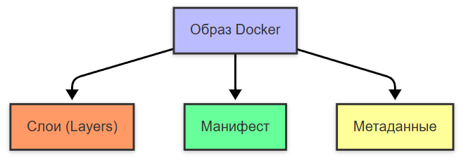
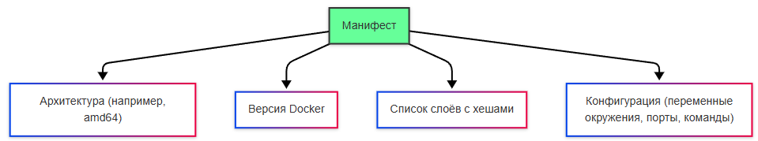
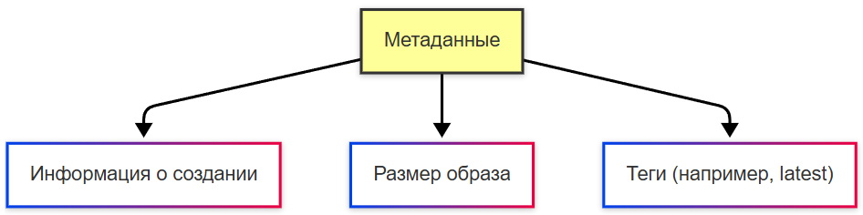

# Объекты Docker

<div class="article-tags">
  <span class="tag tag-required">ОБЯЗАТЕЛЬНО</span>
  <span class="tag tag-beginner">ДЛЯ НОВИЧКОВ</span>
</div>

<span class="complexity-badge">Разработчику</span>
<span class="complexity-badge">Архитектору</span>
<span class="complexity-badge">Инженеру</span>

---

## Объекты Docker

### Образ

**Образ (Image)** — это неизменяемый шаблон, содержащий все необходимые компоненты для запуска приложения: код, библиотеки, зависимости, переменные среды и конфигурации. Образ, как мы ранее заметили, можно сравнить с "чертежом" или "шаблоном", по которому создаётся контейнер.

Образ является **неизменяемым** (immutable), состоит из **слоёв** (layers), каждый из которых представляет собой изменение в файловой системе. 

Образ может быть загружен из реестра или создан локально с помощью Dockerfile.

Образ — это "снимок" (snapshot) файловой системы, который содержит:
- операционную систему (например, Linux);
- установленные зависимости (библиотеки, пакеты);
- исходный код приложения;
- команды для запуска приложения.

**Неизменяемость (иммутабельность)** означает, что после создания образ нельзя изменить напрямую. Любые изменения требуют создания нового образа на основе старого.

---

### Слой образа

Слои образа организованы в виде **стека (stack)**, где каждый новый слой добавляется поверх предыдущего. 

Каждый слой создаётся на основе инструкции в Dockerfile (например, RUN, COPY, ADD). 

Слои сохраняются в кэше Docker, что позволяет повторно использовать их при создании новых образов.

При запуске контейнера Docker монтирует все слои в единое дерево файловой системы с помощью технологии Union File System.

Предположим, у нас есть Dockerfile:
```dockerfile
FROM ubuntu:20.04
RUN apt-get update && apt-get install -y python3
COPY app.py /app/app.py
CMD ["python3", "/app/app.py"]
```

Слои файловой системы (от `RUN`, `COPY`, `ADD` и базового `FROM`) выглядят так:
	- Базовый образ (`ubuntu:20.04`) — нижние read-only слои.
	- Установка Python через `apt-get` — ещё один слой.
	- Копирование `app.py` — ещё один слой.

Инструкция `CMD` не добавляет слой с файлами — она записывает **метаданные** образа (команда по умолчанию при `docker run`).

Каждый слой хранится отдельно, и если вы измените только последнюю строку в Dockerfile, то пересоздастся только последний слой, а остальные останутся без изменений. Это делает сборку образов быстрой и эффективной.


Образ также включает манифест - JSON-файл, который описывает метаданные образа:
	- Архитектура (например, amd64, arm64).
	- Версию Docker.
	- Список слоёв с их хешами.
	- Информацию о конфигурации (например, переменные окружения, порты, команды).

Манифест позволяет Docker понять, как собрать слои в единый образ и как запустить контейнер.

Образ можно создать двумя способами - локально, лишь добавив в папку проекта Dockerfile и выполнив команду docker build, и загрузкой из реестра через docker pull.

Размер образа зависит от его содержимого. Чем больше слоёв и зависимостей, тем больше размер. Для оптимизации размера, используют следующие подходы:
	- минимизация базового образа (использование легковесного образа в FROM);
	- удаление ненужных файлов, к примеру, очистка кэша пакетного менеджера:
```dockerfile
RUN apt-get update && apt-get install -y python3 && rm -rf /var/lib/apt/lists/*
```
	- многоэтапная сборка - использование нескольких этапов для минимизации финального образа.

Чтобы исследовать содержимое образа:

```bash
docker history <image>
docker inspect <image>
docker run --rm -it <image> sh
```

Структура образа:



Слои:


Манифест:



Метаданные:



---

### Контейнер

**Контейнер (Container)** - экземпляр образа. Это "живой" объект, который можно запустить, остановить, изменить и удалить. Это "коробка", собранная по чертежу.

Контейнер является изменяемым (mutable) - внутри него можно создавать, изменять и удалять файлы. Контейнер изолирован, работает в собственной среде, изолированной от хостовой системы (используются namespaces и cgroups).

---

### Хранилища и тома

**Хранилища (Volumes)** - механизм для сохранения данных вне контейнера. Они позволяют данные сделать постоянными, даже если контейнер удаляется. Данные сохраняются на хостовой системе. Хранилища можно использовать для баз данных, кэширования или общих файлов между контейнерами.

Тома Docker играют ключевую роль для хранения и управления данными. Они позволяют сохранять данные между перезапусками контейнеров, обмениваться данными между контейнерами и управлять данными независимо от жизненного цикла контейнера.

Тома находятся в специальном каталоге на хосте (например, `/var/lib/docker/volumes` в Linux). Docker автоматически управляет этим каталогом.

**Как работать с томами?**

Создание тома:
```bash
docker volume create my-volume
```
 
Это создаст новый том с именем my-volume.

Монтирование тома в контейнер (подключение):
```bash
docker run -d --name my-container -v my-volume:/app/data nginx
```
 
Здесь -v my-volume:/app/data монтирует том my-volume в директорию /app/data внутри контейнера.

Просмотр существующих томов:
```bash
docker volume ls
```
 
Инспектирование тома:
```bash
docker volume inspect my-volume
```
 
Это покажет метаданные тома, включая его расположение на хосте.

Удаление тома:
```bash
docker volume rm my-volume
```
 
Очистка неиспользуемых томов:
```bash
docker volume prune
```
 
Эта команда удаляет все тома, которые не используются ни одним контейнером.

**Том (volume) и bind mount.** Именованный том (`docker volume create`) управляется Docker и удобен для БД и постоянных данных. Bind mount (`-v /host/path:/container/path`) привязывает каталог хоста напрямую — удобно в разработке, когда код на диске должен сразу попадать в контейнер.

```bash
docker volume create
```

---

### Файловая система контейнера

Когда запускается контейнер, Docker создаёт изолированную файловую систему на основе образа. Файловая система контейнера основана на слоях образа и может быть исследована с помощью команды docker exec. Пример структуры:
	- корневая директория (/) Содержит стандартные папки UNIX, такие как /bin, /etc, /usr, /var.
	- /bin: Бинарные файлы (команды).
	- /etc: Конфигурационные файлы.
	- /usr: Программы и библиотеки.
	- /var: Переменные данные (логи, базы данных и т.д.).
	- /tmp: Временные файлы.
	- /proc: Виртуальная файловая система, предоставляющая информацию о процессах и системе.
	- /sys: Информация о ядре и устройствах.
	- монтированные тома.

Проверить монтированные тома можно с командой mount.

Таким образом, файловая система контейнера содержит стандартные UNIX-директории.


Docker использует стандартные возможности ядра Linux (namespaces, cgroups, chroot, seccomp, overlayfs), оборачивая их в удобный интерфейс.
Как мы ранее упомянули, контейнеры используют Namespaces.

**Namespaces** - механизм изоляции в Linux, создающий для контейнера:
	- PID namespace - свой процессный ID;
	- MNT namespace - файловую систему;
	- NET namespace - сеть;
	- UTS namespace - имя хоста (hostname);
	- IPC namespace - межпроцессное взаимодействие.

Таким образом, благодаря Namespace, контейнер видит некую "мини-ОС".

**Cgroups** ограничивают и учитывают CPU, память и I/O. При превышении лимита памяти ядро обычно завершает процесс в контейнере (OOM), а не "мягко останавливает" весь контейнер — задавайте лимиты и следите за нагрузкой:

```bash
docker run --memory=512m --cpus=1.0 myapp:1.0
docker stats
```

**UFS (Union File System)** представляет собой многослойную файловую систему. Каждый шаг Dockerfile создаёт новый слой. UFS позволяет объединить несколько слоёв (layers) в единое дерево файловой системы, обеспечивая эффективное использование дискового пространства и быстрое создание новых образов.

Основные принципы UFS:
	- Слои (layers): Каждый слой представляет собой набор изменений в файловой системе.
	- Объединение (union): Слои накладываются друг на друга, формируя единое представление файловой системы.
	- Изменяемость: Только верхний слой может быть изменяемым (writable), остальные слои доступны только для чтения (read-only).

Типы слоёв:
	- Read-only layers: Слои, которые создаются при сборке образа (например, базовый образ, установленные зависимости). Эти слои неизменяемы.
	- Writable layer: Верхний слой, который создаётся при запуске контейнера. Все изменения (например, создание файлов, запись данных) происходят именно в этом слое.

Пример:

```dockerfile
FROM ubuntu:20.04
RUN apt-get update && apt-get install -y python3
COPY app.py /app/app.py
CMD ["python3", "/app/app.py"]
```

Слои здесь будут выглядеть так:
	- Базовый образ (ubuntu:20.04) — read-only.
	- Установка Python через apt-get — read-only.
	- Копирование файла app.py — read-only.
	- Верхний слой (writable) — используется для работы контейнера.

На хосте слои хранятся в каталоге /var/lib/docker. Docker использует одну из реализаций UFS (например, OverlayFS, AUFS) для управления этими слоями.

**OverlayFS** это современная реализация UFS, используемая по умолчанию в Docker.  Она включает в себя следующие особенности:
	- Lowerdir: Read-only слои (нижние уровни).
	- Upperdir: Writable слой (верхний уровень).
	- Workdir: Временный каталог для операций слияния.
	- Merged: Объединённое представление файловой системы.

Другие реализации UFS - AUFS (Advanced Multi-Layered Unification Filesystem, используется в старых версиях Docker) и Btrfs/ZFS (альтернативные файловые системы с поддержкой UFS).

Когда образ загружается в реестр, каждый слой сжимается и отправляется отдельно. Это позволяет повторно использовать слои между образами.
Слои используют кэширование. Если два образа имеют общие слои, они будут использоваться совместно. Например, если два образа основаны на одном базовом образе, то этот базовый образ будет храниться только один раз. При изменении одного шага в Dockerfile пересоздаётся только соответствующий слой, а остальные слои остаются без изменений. Каждый контейнер получает свой собственный writable слой. Это гарантирует, что изменения в одном контейнере не влияют на другие.

У каждого контейнера есть своя среда - Container Runtime, это ПО, которое отвечает за запуск и управление контейнерами, обеспечивая изоляцию процессов, файловой системы и сетевых ресурсов. 

Примеры популярных Container Runtime:
	- runc: Стандартный runtime, используемый Docker.
	- containerd: Уровень абстракции над runc, который управляет контейнерами.
	- CRI-O: Альтернатива containerd, часто используется в Kubernetes.

Контейнер живёт, пока жив его процесс (основной процесс, PID 1). Если этот процесс завершается, контейнер также останавливается.

Чтобы проверить основной процесс, можно использовать команду:
```bash
docker top my-container
```


Чтобы контейнер автоматически перезапускался при завершении процесса, используйте флаг --restart:
```bash
docker run -d --name my-container --restart always nginx
```

---
