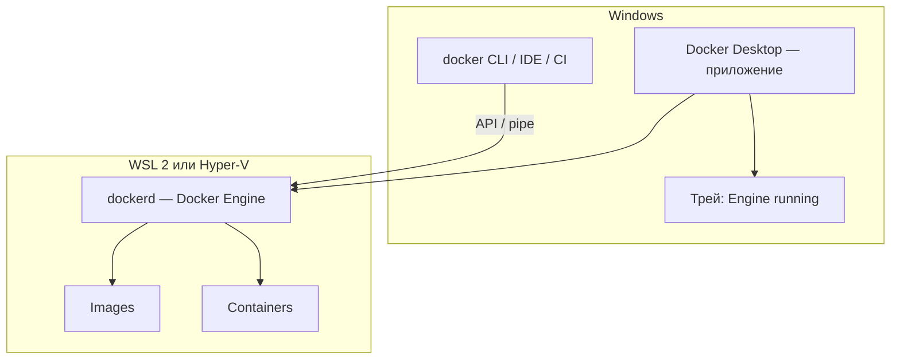

# Docker Desktop

<div class="article-tags">
  <span class="tag tag-required">ОБЯЗАТЕЛЬНО</span>
  <span class="tag tag-beginner">ДЛЯ НОВИЧКОВ</span>
</div>

<span class="complexity-badge">Разработчику</span>
<span class="complexity-badge">Архитектору</span>
<span class="complexity-badge">Инженеру</span>

---

## Docker Desktop

★ **Docker нативно недоступен на Windows.** В Linux контейнеры запускает демон `dockerd` прямо в ядре хоста. В Windows нет встроенного Linux-окружения для контейнеров — поэтому для разработки на ПК с Windows устанавливают **Docker Desktop**: приложение, которое поднимает виртуальную среду (WSL 2 или Hyper-V), запускает внутри неё **Docker Engine** и даёт графический интерфейс для управления контейнерами.

Если открыть PowerShell и выполнить `docker run hello-world`, а Docker Desktop **не запущен**, команда завершится ошибкой: клиент `docker` не найдёт работающий демон. Сначала нужно **запустить Docker Desktop** (иконка кита в трее, статус **Engine running**), дождаться готовности движка — и только потом работать с CLI, Compose или IDE.

---

### Почему на Windows нужен отдельный продукт

| На Linux | На Windows |
|----------|------------|
| `dockerd` — обычная служба ОС | Контейнеры Linux выполняются в WSL 2 или Hyper-V VM |
| CLI общается с `/var/run/docker.sock` | CLI общается с named pipe `//./pipe/docker_engine` |
| Установка пакетом `docker-ce` | Установка **Docker Desktop Installer.exe** |
| Демон можно поднять через systemd | Демон поднимает приложение Docker Desktop |

Docker Desktop объединяет:

- **Docker Engine** — серверная часть (демон, образы, контейнеры, сети, тома);
- **Docker CLI** и плагины (**Compose V2**, **Buildx**, **Desktop CLI**);
- **Dashboard** — панель для контейнеров, образов, томов, сборок и Kubernetes;
- **Интеграцию с WSL 2** — контейнеры и тома доступны из дистрибутива Linux внутри WSL.

Подробнее про клиент, демон и реестр — в статье [Docker](/encyclopedia/8-infra-security/8-06-konteynerizatsiya-i-orkestratsiya/111#kak-ustroen-docker).

---

### Docker Engine — как устроен и как работает

**Docker Engine** — открытая платформа контейнеризации. Это **клиент-серверное** приложение:

| Компонент | Роль |
|-----------|------|
| **`dockerd`** | Долгоживущий **демон** (фоновая служба): создаёт образы и контейнеры, управляет сетями и томами |
| **Docker API** | HTTP-интерфейс, через который CLI, IDE и CI обращаются к демону |
| **`docker` (CLI)** | Командная строка: переводит ваши команды в вызовы API |

На Windows демон **не является** службой Windows в привычном смысле для Linux-контейнеров. Его поднимает Docker Desktop внутри WSL 2 (рекомендуемый бэкенд) или внутри Hyper-V VM. С точки зрения разработчика это всё равно **фоновый сервис**: пока в трее **Engine running**, `docker ps`, `docker compose up` и сборка образов работают; после **Quit Docker Desktop** или **Pause** — нет.



<div class="callout callout--info">
  <div class="callout-title">Engine running</div>
  <div class="callout-body">
  <p>В левом нижнем углу Dashboard и в меню трея отображается статус <strong>Engine running</strong> (зелёный индикатор). Без него любая команда <code>docker …</code> в PowerShell, cmd или WSL завершится ошибкой подключения к демону.</p>
  <p>Запуск и остановку можно автоматизировать: <code>docker desktop start</code>, <code>docker desktop stop</code>, <code>docker desktop status</code>.</p>
  </div>
</div>

Официальное описание Engine: [Docker Engine](https://docs.docker.com/engine/).

---

### Скачивание и установка

1. Перейдите на страницу продукта: [Docker Desktop](https://www.docker.com/products/docker-desktop/).
2. Скачайте **Docker Desktop Installer.exe** для Windows (x86_64 или Arm — Early Access).
3. Запустите установщик. Рекомендуется режим **per-user** (без прав администратора, каталог `%LOCALAPPDATA%\Programs\DockerDesktop`) и бэкенд **WSL 2**.
4. При первом запуске примите лицензионное соглашение. Docker Desktop **не стартует автоматически** после установки — откройте его из меню "Пуск".
5. Дождитесь статуса **Engine running** в трее.

**Системные требования** (кратко):

- Windows 10/11 64-bit (Pro, Enterprise или Education — для части сценариев с Windows-контейнерами);
- WSL 2 версии 2.1.5+ (для Linux-контейнеров);
- виртуализация в BIOS/UEFI;
- **8 ГБ ОЗУ** и свободное место на диске (рекомендуется 5+ ГБ).

Если WSL 2 ещё не включён, в PowerShell от администратора:

```powershell
wsl --install
```

Разбор:
- Устанавливает подсистему WSL, ядро WSL 2 и дистрибутив по умолчанию; после перезагрузки задайте WSL 2 по умолчанию: `wsl --set-default-version 2`.
- Без WSL 2 Docker Desktop на современных версиях Windows для Linux-контейнеров не заработает.

Установка из командной строки (per-user):

```powershell
Start-Process 'Docker Desktop Installer.exe' -Wait -ArgumentList 'install', '--user'
```

Разбор:
- Флаг `--user` — установка в профиль текущего пользователя без UAC на каждое обновление.
- После установки запустите Docker Desktop вручную и проверьте `docker version`.

Пошаговая документация: [Install Docker Desktop on Windows](https://docs.docker.com/desktop/setup/install/windows-install/).

Практика после установки — в [Первые шаги с Docker и Kubernetes](/encyclopedia/8-infra-security/8-06-konteynerizatsiya-i-orkestratsiya/1172).

---

### Панель Docker Desktop (Dashboard)

После запуска открывается **Dashboard** — единый центр управления контейнерами, образами, томами, сборками, Kubernetes и логами. Обзор возможностей: [Explore Docker Desktop](https://docs.docker.com/desktop/use-desktop/).


На скриншоте видно типичную рабочую сессию:

- **Боковое меню** — разделы *Containers*, *Images*, *Volumes*, *Builds*, *Kubernetes*, *Docker Hub*, *Extensions*.
- **Containers** — таблица контейнеров: имя, ID, образ, порты, время последнего старта, загрузка CPU; кнопки start/stop/delete.
- **Engine running** внизу слева — демон активен; рядом — суммарное потребление RAM, CPU и диска VM/WSL.
- **Container CPU / memory usage** в шапке — лимиты ресурсов, выделенных Docker Desktop в **Settings → Resources**.

**Quick Search** (строка поиска в шапке) находит контейнеры, образы, тома, расширения и фрагменты документации без переключения вкладок.

**Меню в трее** (иконка кита): Dashboard, Settings, Check for updates, Troubleshoot, **Switch to Windows containers** (если установлен режим all-users), Restart, Quit.

---

### Управление контейнерами

Вкладка **Containers** — основной инструмент для жизненного цикла контейнеров без терминала. Документация: [Explore the Containers view](https://docs.docker.com/desktop/use-desktop/container/).

Из Dashboard можно:

- **запускать, останавливать, ставить на паузу, возобновлять и перезапускать** контейнеры;
- открыть **опубликованный порт** в браузере;
- скопировать готовую команду **`docker run`** для повторного использования;
- смотреть **CPU и память** по каждому контейнеру и на графиках;
- открыть контейнер в **VS Code** (при установленном расширении).

При выборе контейнера доступны вкладки:

| Вкладка | Назначение |
|---------|------------|
| **Logs** | Поток stdout/stderr в реальном времени, поиск, метки времени, копирование |
| **Inspect** | JSON с конфигурацией: образ, порты, переменные, SHA-256 |
| **Exec / Debug** | Команды внутри контейнера (`docker exec`) или расширенный Debug с набором утилит |
| **Files** | Файловая система контейнера: просмотр, правка, drag-and-drop с хоста |
| **Stats** | Детальная статистика CPU, памяти, сети и диска |

Те же действия доступны из CLI — см. [Работа с Docker](/encyclopedia/8-infra-security/8-06-konteynerizatsiya-i-orkestratsiya/114).

Пример: если контейнер с веб-сервером опубликовал порт `8000:8000`, в колонке **Port(s)** можно перейти по ссылке — Docker Desktop откроет `localhost:8000` в браузере.

---

### Образы, тома и сборки

**Images** — локальные и скачанные образы: pull из Docker Hub, удаление, просмотр слоёв и уязвимостей (Docker Scout). Документация: [Explore the Images view](https://docs.docker.com/desktop/use-desktop/images/).

**Volumes** — именованные тома для постоянных данных (БД, загрузки). Создание, удаление, просмотр связанного контейнера. Без тома данные в контейнере исчезают при `docker rm`. Подробнее: [Explore the Volumes view](https://docs.docker.com/desktop/use-desktop/volumes/).

**Builds** — история сборок через **BuildKit** / `docker build` и интеграцию с Dockerfile. Удобно отслеживать, какой контекст и Dockerfile дали образ. Документация: [Explore the Builds view](https://docs.docker.com/desktop/use-desktop/builds/).

---

### Пауза, логи и ресурсы

**Pause Docker Desktop** временно **замораживает** все контейнеры и снижает нагрузку на CPU — состояние памяти сохраняется до **Resume**. Полезно, когда Docker не нужен, но перезапускать все контейнеры не хочется. Документация: [Pause Docker Desktop](https://docs.docker.com/desktop/use-desktop/pause/).

**Logs** в Dashboard и **docker desktop logs** — диагностика самого приложения Desktop (не путать с логами контейнера на вкладке Logs у контейнера). См. [View Docker Desktop logs](https://docs.docker.com/desktop/use-desktop/logs/).

Лимиты **CPU, памяти, swap и размера диска** VM/WSL задаются в **Settings → Resources**. Если контейнеры "падают" по OOM или Kubernetes долго в **NotReady** — увеличьте память (часто 4–8 ГБ для комфортной разработки).

---

### Сеть в Docker Desktop

Контейнеры получают виртуальные сети Docker (bridge по умолчанию). Docker Desktop дополнительно:

- пробрасывает порты `host:container` на `localhost` Windows;
- интегрируется с **WSL 2**, чтобы из Ubuntu в WSL был доступ к тем же контейнерам;
- поддерживает пользовательские сети и DNS по имени контейнера.

Типовые проблемы "с хоста не открывается порт" или "из одного контейнера не виден другой" — в [Сеть в контейнерах](/encyclopedia/8-infra-security/8-06-konteynerizatsiya-i-orkestratsiya/115). Официально — [Networking on Docker Desktop](https://docs.docker.com/desktop/features/networking/).

---

### Kubernetes в Docker Desktop и Minikube

Docker Desktop может поднять **локальный кластер Kubernetes** для разработки и тестов — без облака и без отдельного сервера.

**Встроенный Kubernetes** (вкладка **Kubernetes** в Dashboard, версия 4.51+):

1. Откройте **Kubernetes** → **Create cluster**.
2. Выберите тип: **kubeadm** (одна нода, проще) или **kind** (несколько нод, выбор версии K8s, быстрее, поддержка Enhanced Container Isolation).
3. Docker Desktop скачает служебные образы, установит **`kubectl`** и создаст контекст `docker-desktop`.

Проверка:

```powershell
kubectl config use-context docker-desktop
kubectl get nodes
```

Разбор:
- Контекст `docker-desktop` указывает `kubectl` на API локального кластера.
- Узел `docker-desktop` в статусе **Ready** — control plane и worker на одной машине.

Документация: [Explore the Kubernetes view](https://docs.docker.com/desktop/use-desktop/kubernetes/).

**Minikube** — **отдельный** инструмент локального Kubernetes. Он не входит в установщик Docker Desktop, но часто используется **вместе** с ним: Minikube может работать с драйвером **Docker**, используя тот же Engine как среду для нод кластера.

| | Kubernetes в Docker Desktop | Minikube |
|---|------------------------------|----------|
| Установка | Переключатель в Settings / Create cluster | `minikube start` после установки minikube |
| Интеграция | Один продукт, общий `kubectl` | Отдельный контекст `minikube` |
| Когда выбирать | Быстрый старт на Windows/WSL | Больше профилей, add-ons, CI-подобные сценарии |

Если встроенный кластер не нужен, достаточно Docker Engine; для практики с манифестами см. [Первые шаги с Docker и Kubernetes](/encyclopedia/8-infra-security/8-06-konteynerizatsiya-i-orkestratsiya/1172) и [Справочник по Kubernetes](/encyclopedia/8-infra-security/8-06-konteynerizatsiya-i-orkestratsiya/211).

---

### Docker Desktop CLI

Плагин **`docker desktop`** управляет самим приложением Desktop из терминала — удобно для скриптов и автоматизации. Документация: [Use the Docker Desktop CLI](https://docs.docker.com/desktop/features/desktop-cli/).

```powershell
docker desktop status
docker desktop start
docker desktop stop
docker desktop restart
```

Разбор:
- `status` — запущен ли Desktop и доступен ли Engine.
- `start` / `stop` / `restart` — эквивалент действий из меню трея без GUI.

Дополнительно (Windows):

```powershell
docker desktop engine ls
docker desktop kubernetes images list
```

Разбор:
- `engine ls` — доступные режимы Linux / Windows containers (в режиме all-users).
- `kubernetes images list` — образы control plane для текущей версии Desktop (4.44+).

---

### Типичные ошибки на Windows

| Симптом | Вероятная причина | Что сделать |
|---------|-------------------|-------------|
| `error during connect` / `pipe/docker_engine` | Docker Desktop не запущен | Открыть приложение, дождаться **Engine running** |
| `docker` не найден | CLI не в PATH | Перезапустить терминал после установки |
| Контейнеры медленные или OOM | Мало RAM у WSL/VM | **Settings → Resources** — увеличить память |
| Kubernetes **NotReady** | Кластер ещё поднимается или мало ресурсов | Подождать, проверить Resources, перезапустить кластер |
| Команды работают в WSL, но не в PowerShell | Разные контексты | Убедиться, что Desktop запущен; при необходимости включить WSL integration в Settings |

Перед первым `docker run` полезно прочитать [Запуск и перезапуск приложений](/encyclopedia/1-basics/1-12-sovety-dlya-novichka/13) — там отдельно разобран сценарий "Docker Desktop + терминал".

---

### Связанные материалы

- [Docker](/encyclopedia/8-infra-security/8-06-konteynerizatsiya-i-orkestratsiya/111) — клиент, демон, образы, реестр
- [Первые шаги с Docker и Kubernetes](/encyclopedia/8-infra-security/8-06-konteynerizatsiya-i-orkestratsiya/1172) — установка, `hello-world`, kubectl
- [docker-compose](/encyclopedia/8-infra-security/8-06-konteynerizatsiya-i-orkestratsiya/1111) — многоконтейнерные приложения
- [Работа с Docker](/encyclopedia/8-infra-security/8-06-konteynerizatsiya-i-orkestratsiya/114) — лимиты, диагностика, обновления
- [Docker Swarm и Kubernetes](/encyclopedia/8-infra-security/8-06-konteynerizatsiya-i-orkestratsiya/117) — оркестрация в production
- [Install Docker Desktop on Windows](https://docs.docker.com/desktop/setup/install/windows-install/) — официальная установка
- [Explore Docker Desktop](https://docs.docker.com/desktop/use-desktop/) — обзор Dashboard

---
