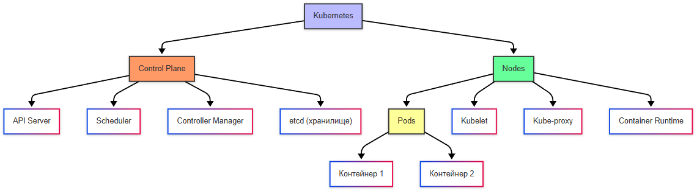
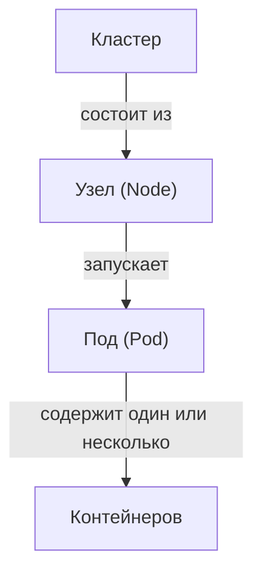

# Docker Swarm и Kubernetes

<div class="article-tags">
  <span class="tag tag-required">ОБЯЗАТЕЛЬНО</span>
  <span class="tag tag-beginner">ДЛЯ НОВИЧКОВ</span>
</div>

<span class="complexity-badge">Разработчику</span>
<span class="complexity-badge">Архитектору</span>
<span class="complexity-badge">Инженеру</span>

## Docker Swarm и Kubernetes

### Что такое кластеризация?

Мы разобрались, как работает контейнеризация. Но как быть, если контейнеров много, и речь идёт о масштабировании и обеспечении отказоустойчивости? Давайте разберём, что такое кластеризация, и как работают такие инструменты, как Docker Swarm и Kubernetes.

★ **Кластеризация** — это объединение нескольких серверов (или узлов) в единую систему для выполнения общей задачи. В контексте Docker кластеризация используется для следующих целей:
	- Масштабирование - распределение нагрузки между несколькими узлами;
	- Отказоустойчивость - если один узел выходит из строя, другие продолжают работу;
	- Управление ресурсами - эффективное распределение ресурсов между контейнерами;
	- Автоматизация - автоматическое развёртывание, мониторинг и восстановление контейнеров.

Кластеризация особенно важна, если контейнеров много, приложение должно быть доступно 24/7, и нужно масштабировать приложение в зависимости от нагрузки.

Кластеризация становится необходимой в следующих случаях:
	- высокая нагрузка - если одно устройство не справляется с нагрузкой, нужно распределить её между несколькими серверами;
	- отказоустойчивость - если один сервер выходит из строя, другие продолжают работу, минимизируя простои;
	- географическое распределение - приложение обслуживает пользователей из разных регионов, и нужно разместить серверы ближе к пользователям;
	- автоматизация - если нужно автоматически разворачивать, масштабировать и мониторить контейнеры;
	- разделение ответственности - разные контейнеры могут работать на разных узлах, чтобы изолировать друг от друга.

---

### Как работает кластеризация?

В кластере несколько **серверов (узлов)** объединяются в единую систему. Один из узлов обычно является **менеджером (manager)**, который управляет остальными узлами (**воркерами, workers**). Менеджер отвечает за распределение контейнеров по узлам, мониторинг состояния узлов и восстановление контейнеров в случае сбоя. 

Пример работы:
	- у нас есть веб-сервер и много физических серверов;
	- мы разворачиваем кластеризацию между физическими серверами - теперь это узлы;
	- мы запускаем приложение (наш веб-сервер);
	- менеджер определяет, на каком узле запустить контейнер;
	- если нагрузка увеличивается, менеджер автоматически добавляет новые экземпляры контейнера на другие узлы;
	- если один узел выходит из строя, менеджер переносит контейнеры на другие узлы.

Но опять же - не всё так просто.

Наше приложение, раз уж потребовалось масштабирование — это совокупность разного функционала. В приложении есть много аспектов - базы данных, кэширование, авторизация, каталог, сервисы, и многое другое. Мы уже затронули тему микросервисов ранее. Кластеризация касается именно этой темы.

Когда вы запускаете контейнер с базой данных (например, PostgreSQL), данные внутри контейнера хранятся в файловой системе контейнера. Однако, **если контейнер удаляется или пересоздаётся, данные теряются**. 

Чтобы избежать этого, используются **тома (volumes)**.

**Тома** — это специальные директории на хостовой системе, которые монтируются в контейнер. Данные сохраняются вне контейнера. 

Пример:

```bash
docker run -d \
  --name postgres \
  -e POSTGRES_PASSWORD=mysecretpassword \
  -v /Данные/postgres:/var/lib/postgresql/Данные \
  postgres

```

Здесь `/Данные/postgres` — путь на хостовой системе, где будут храниться данные PostgreSQL. Если вы добавляете новый узел в кластер, данные остаются доступными через тома, независимо от того, на каком узле запущен контейнер.

Для отказоустойчивости и масштабирования базы данных используются реплики:
	- **Master-Slave** : Один главный сервер (master) обрабатывает записи, а вторичные (slaves) — только чтение.
	- **Распределенные базы данных** : Например, PostgreSQL с шардированием или MongoDB с репликами.

**Системы кэширования**, например, Redis, хранят данные **в оперативной памяти**. При этом данные можно сохранять на диск для восстановления после перезапуска.

В кластере это работает так:
	- **одиночный Redis** - может быть запущен в одном контейнере, но это будет узким местом при высокой нагрузке;
	- **Redis Cluster** - данные распределяются между несколькими узлами (шардирование). Каждый узел хранит часть данных. 

Пример:

```bash
docker run -d \
  --name redis \
  -v /Данные/redis:/Данные \
  redis redis-server --cluster-enabled yes

```

Если один узел выходит из строя, другие продолжают работу, обеспечивая **отказоустойчивость**.

---

### Контейнеры в микросервисах

Касательно веб-приложений и микросервисной архитектуры, здесь стоит отметить следующее.

**Микросервисная архитектура** позволяет разделить приложение на независимые модули, которые могут быть запущены в отдельных контейнерах. Это упрощает масштабирование и управление.

Предположим, у нас есть веб-приложение, которое состоит из следующих компонентов:
	- Авторизация: Микросервис для управления пользователями и аутентификацией.
	- Каталог: Микросервис для управления товарами.
	- Заказы: Микросервис для обработки заказов.
	- Фронтенд: Контейнер с веб-интерфейсом.
	- База данных: PostgreSQL.
	- Кэширование: Redis.

В кластере это будет работать так:
	- Авторизация и каталог могут быть размещены на одном физическом сервере.
	- База данных и кэширование — на другом.
	- Фронтенд и сервис заказов — на третьем.

Между собой микросервисы взаимоодействуют через API или сообщения (например, HTTP или gRPC). Для координации используются:
	- Load Balancer : Распределяет запросы между экземплярами микросервисов.
	- Service Discovery : Позволяет микросервисам находить друг друга (например, через DNS или Kubernetes).

Горизонтальное масштабирование. Если нагрузка на микросервис увеличивается, можно запустить дополнительные экземпляры контейнера. 

Например:
```bash
docker service scale catalog-service=3
```
 
Это создаст три экземпляра микросервиса «каталог».

**Балансировка нагрузки**. Load Balancer распределяет запросы между экземплярами микросервиса. Например:
	- Nginx или Traefik могут использоваться для балансировки HTTP-запросов.
	- Kubernetes автоматически управляет балансировкой через Service.

**Отказоустойчивость**. Если один экземпляр микросервиса выходит из строя, Load Balancer перенаправляет запросы на другие экземпляры.

**Временные данные и сессии**. Существуют и проблемы, например, проблема сессий. Если пользователь авторизован на одном экземпляре микросервиса, а его запрос перенаправляется на другой, сессия может быть потеряна. Решение - хранение сессий в Redis, чтобы они стали доступны всем экземплярам микросервиса. 

Пример:
```bash
docker run -d \
  --name session-store \
  -v /Данные/redis:/Данные \
  redis

```

Когда контейнеров становится много, требуется их оркестрация (своего рода дирижирование оркестром), то есть управление. Оркестраторы – это как раз те самые «дирижёры». Сейчас распространены Docker Swarm, Kubernetes и OpenShift.

---

## Docker Swarm

### Что такое Docker Swarm?

★ **Docker Swarm** — это встроенная система оркестрации Docker, которая позволяет создавать и управлять кластерами контейнеров. Она проста в использовании и интегрирована с **Docker Engine**.

Основные компоненты как раз - **менеджеры** и **воркеры**. 

Менеджеры управляют кластером и отвечают за распределение задач и мониторинг, а воркеры выполняют задачи (запускают контейнеры).

---

### Основные команды Docker Swarm

1. Инициализация кластера:
```bash
docker swarm init
```
 
Эта команда превращает текущий узел в менеджер.

2. Добавление воркеров:
```bash
docker swarm join --token <token> <manager-ip>:<port>
```
 
3. Запуск сервиса:
```bash
docker service create --name my-service nginx
```
 
4. Масштабирование:
```bash
docker service scale my-service=3
```

---

## Kubernetes

### Что такое Kubernetes?

★ **Kubernetes** (k8s) - мощная платформа для оркестрации контейнеров, созданная Google и сейчас поддерживаемая сообществом CNCF. 

Kubernetes сложнее Docker Swarm, но предлагает больше возможностей.

Официальный сайт - https://kubernetes.io/

Чит-лист - https://cheatsheets.zip/kubernetes

**Kubernetes (K8s)** – фреймворк для гибкой работы распределенных систем для масштабирования и обработки ошибок, предоставляя:
	- мониторинг сервисов, балансировку нагрузки и распределение сетевого трафика;
	- оркестрацию хранилища – автоматическое подключение дискового хранилища к контейнерам;
	- автоматическое развертывание и откаты (можно автоматизировать для развертывания, удаления, распределения ресурсов в новый контейнер);
	- самоконтроль – автоматический перезапуск отказавших контейнеров, замена и завершение работы;
	- управление конфиденциальной информацией и конфигурацией (пароли, токены, ключи).



---

### Компоненты Kubernetes

Основные компоненты:
	- **Control Plane (плоскость управления)** - управляет кластером, состоит из компонентов, таких как API Server, Sheduler, Controller Manager;
	- **Nodes (узлы)** - физические или виртуальные машины, где запускаются контейнеры;
	- **Pods (поды)** - наименьшая единица в Kubernetes. Под может содержать один или несколько контейнеров.

Контейнер собирается в **под**, поды собираются в рабочие **узлы (ноды)**, ноды – это рабочие машины, которые, в свою очередь, собираются в **кластер**.

```
Кластер > Узел (нод) > Под (содержит контейнер)
```



**Кластер** – единая логическая система, состоящая из:
	- **узлов (нод, node)** – физических или виртуальных машин, на которых развернуты контейнеры, узлы включают:
		- *Kubelet* (агент, выполняющий команды дирижёра);
		- *Kube-proxy* (обеспечивающий сетевую связность);
		- *Container Runtime* (среду для запуска контейнеров).
	- **панели управления (control plane)** – «дирижёр» кластера, управляющий нодами, включает:
		- *API Server* (kubectl, входная точка для команд),
		- *Scheduler* (планировщик, определяющий, на каком ноде запустить под),
		- *Controller Manager* (следит за состоянием кластера),
		- *etcd* – база данных конфигураций кластера.

---

### Minikube

Docker Desktop включает в себя встроенный Kubernetes.

На персональном ПК устанавливается одноузловый кластер **Minikube**.

**Minikube** — это инструмент с открытым исходным кодом, предназначенный для локального запуска одноузлового кластера Kubernetes. Он позволяет разработчикам и администраторам тестировать, изучать и отлаживать приложения в окружении, максимально приближенном к реальному кластеру Kubernetes, без необходимости развертывания полноценной распределённой инфраструктуры.

Minikube создаёт виртуальную или контейнеризованную среду на локальной машине, внутри которой разворачивается упрощённый кластер Kubernetes. Архитектура включает:

**Компоненты кластера:**

- **API Server** — центральный компонент управления
- **etcd** — распределённое хранилище состояния кластера
- **kubelet** — агент, управляющий контейнерами на узле
- **kube-proxy** — сетевой прокси для сервисов
- **Container Runtime** — среда выполнения контейнеров (Docker, containerd и др.)
- **CNI Plugin** — сетевой плагин для организации pod-to-pod связи

**Механизмы изоляции:**

Minikube может использовать различные драйверы для создания изолированного окружения:
- VirtualBox, VMware, Hyper-V — гипервизоры
- Docker, Podman — контейнерные среды
- KVM, QEMU — аппаратная виртуализация Linux


Процесс установки и запуска включает в себя следующие процедуры:
1. **Установка Minikube** — загрузка бинарного файла или использование пакетных менеджеров
2. **Выбор драйвера** — определение среды изоляции (по умолчанию зависит от ОС)
3. **Инициализация кластера** — команда `minikube start` создает виртуальную машину и разворачивает компоненты Kubernetes
4. **Настройка kubectl** — автоматическая конфигурация клиента для взаимодействия с локальным кластером

**Технические ограничения:**

- Одноузловой кластер — отсутствует распределённость и отказоустойчивость
- Ограниченные ресурсы — зависит от возможностей хостовой машины
- Упрощённая сетевая модель — может отличаться от production-сред

---

### Работа с Kubernetes

★ Как работать с Kubernetes:
	- подготовка – развернуть кластер, указав количество control plane и worker node, в отличие от Docker – здесь кластер, а не машина;
	- разработка приложения;
	- определение сервисов, подов, конфигурации, масштабирования;
	- формирование манифестов (вместо Dockerfile используется YAML-манифест);
	- сборка образа (docker build);
	- публикация образа (docker push) в репозиторий;
	- деплой – вместо docker run будет kubectl apply -f deployment.yaml – применение манифеста к кластеру, Kubernetes сам скачает образ, создаст поды согласно replicas, настроит сеть и другие ресурсы по манифесту;
	- тестирование – в отличие от Docker, тестировать можно не один контейнер, а всё приложение целиком (включая все поды по списку, балансировку и сеть);
	- деплой на продакшн.


Основные действия:

| Действие | Kubernetes |
|---|---|
| Запуск | `kubectl apply -f deployment.yaml` Создаётся указанное в YAML-манифесте количество подов (контейнеров). |
| Масштабирование | Определяется в манифесте YAML. Поддерживается автоматическое масштабирование. При сбое одного пода новый создаётся автоматически. |
| Сеть | Глобальная маршрутизация настраивается через YAML-манифесты с использованием сетевых плагинов: • **Service** — абстракция для доступа к подам:  – ClusterIP (внутренний IP),  – NodePort (порт на каждой ноде),  – LoadBalancer (облачный балансировщик). • **Ingress** — управление маршрутизацией HTTP/HTTPS-трафика. • **CNI** (Calico, Flannel) — плагины для организации сети между подами на разных нодах. |
| Хранение данных | Используются облачные или локальные диски, настраиваемые через YAML-манифесты: • **PersistentVolume (PV)** — ресурс хранилища в кластере. • **PersistentVolumeClaim (PVC)** — запрос на использование хранилища от имени пода. • **StorageClass** — шаблон для динамического выделения томов (например, в облачной среде). |
| Обновление приложения | Управляется через YAML-манифесты: • **Rolling Update** — поэтапное обновление: новые поды с новой версией запускаются, старые удаляются после успешной проверки. Обеспечивает обновление без простоя. • **Blue-Green Deployment** — развёртывается полная копия приложения с новой версией, после проверки трафик переключается на неё одномоментно. |
| Отказоустойчивость | Обеспечивается на уровне подов: при сбое под автоматически пересоздаётся. |
| Динамическое масштабирование | Поддерживается (на основе метрик, таких как загрузка CPU или памяти), реализуется через Horizontal Pod Autoscaler (HPA). |


---

### Установка

Первый шаг в использовании Kubernetes — это его корректная установка. Процесс начинается с подготовки окружения, установки необходимых пакетов и конфигурации узла. 


#### Подготовка системы

Прежде всего, необходимо отключить swap-раздел, так как Kubernetes требует работы без него. Это можно сделать командой `sudo swapoff -a`. Чтобы изменение сохранялось после перезагрузки, следует отредактировать файл `/etc/fstab`.

#### Установка Docker

Kubernetes использует Docker (или другой runtime) для запуска контейнеров. 

Установка выполняется командой:

```bash
sudo apt-get update && sudo apt-get install -y docker.io
```

#### Установка kubeadm, kubelet и kubectl

Эти компоненты являются основными для работы Kubernetes. 

Их можно установить через официальный репозиторий Kubernetes:
```bash
# Добавление официального GPG-ключа
curl -fsSL https://pkgs.k8s.io/core:/stable:/v1.30/deb/Release.key | sudo gpg --dearmor -o /etc/apt/keyrings/kubernetes-apt-keyring.gpg

# Добавление репозитория
echo 'deb [signed-by=/etc/apt/keyrings/kubernetes-apt-keyring.gpg] https://pkgs.k8s.io/core:/stable:/v1.30/deb/ /' | sudo tee /etc/apt/sources.list.d/kubernetes.list

# Установка
sudo apt-get update
sudo apt-get install -y kubeadm kubelet kubectl

```

Для других дистрибутивов и версий Kubernetes — см. официальную документацию:  
🔗 https://kubernetes.io/docs/setup/production-environment/tools/kubeadm/install-kubeadm/

В связи с переходом проекта Kubernetes на полностью независимую инфраструктуру, ** теперь у них новые официальные репозитории**:  
→ **`https://pkgs.k8s.io/core:/stable:/v1.30/deb/`** (для Debian/Ubuntu)  
→ **`https://pkgs.k8s.io/core:/stable:/v1.30/rpm/`** (для RHEL/CentOS/Rocky)

Репозитории `apt.kubernetes.io` и `yum.kubernetes.io` **не функционируют с 4 марта 2024 года**


#### Инициализация кластера

После установки всех компонентов можно инициализировать мастер-узел командой `sudo kubeadm init`. Далее потребуется выполнить дополнительные действия для настройки доступа к кластеру, например, скопировать файл конфигурации в домашнюю директорию пользователя.

После успешного развёртывания кластера следующий этап — описание приложения в формате YAML. 

Kubernetes использует декларативный подход, где все параметры указываются в манифестах. 

Рассмотрим пример развёртывания NGINX с тремя репликами, настройкой портов и проверками работоспособности.

```yml
apiVersion: apps/v1
kind: Deployment
metadata:
  name: nginx-deployment
spec:
  replicas: 3
  selector:
    matchLabels:
      app: nginx
  template:
    metadata:
      labels:
        app: nginx
    spec:
      containers:
      - name: nginx
        image: nginx:1.21.6
        ports:
        - containerPort: 80
        resources:
          limits:
            memory: "256Mi"
            cpu: "200m"
        livenessProbe:
          httpGet:
            path: /
            port: 80
          initialDelaySeconds: 15
          periodSeconds: 10
        readinessProbe:
          httpGet:
            path: /
            port: 80
          initialDelaySeconds: 5
          periodSeconds: 5
```

Этот манифест создаёт три реплики NGINX-подов, каждая из которых открывает порт 80. Параметры `livenessProbe` и `readinessProbe` обеспечивают проверку работоспособности и готовности подов соответственно. Если проверка не проходит, Kubernetes автоматически перезапускает контейнер. Ограничения ресурсов (resources.limits) помогают предотвратить чрезмерное использование CPU и памяти.

Для применения манифеста используется команда `kubectl apply -f deployment.yaml`. При необходимости масштабирования можно использовать команду `kubectl scale deployment.v1.apps/nginx-deployment --replicas=5`, чтобы увеличить число реплик до 5.

Мониторинг кластера является важнейшим аспектом управления Kubernetes.

Команда `kubectl cluster-info` выводит базовые сведения о компонентах кластера, таких как адрес API-сервера и статус etcd.

Например, выполнение команды может дать следующий результат:
```
Kubernetes control plane is running at https://192.168.99.100:8443
CoreDNS is running at https://192.168.99.100:8443/api/v1/namespaces/kube-Система/services/kube-dns:dns/proxy

```
Команда `kubectl get nodes` показывает список всех узлов кластера и их статус. Например:
```
NAME       STATUS   ROLES                  AGE   VERSION
node1      Ready    control-plane,master   2d    v1.23.4
node2      Ready    <none>                 2d    v1.23.4
node3      Ready    <none>                 2d    v1.23.4

```

Если какой-либо узел находится в состоянии `NotReady`, это может свидетельствовать о проблемах с сетью, недоступностью ресурсов или ошибками в конфигурации. 

Для более глубокого анализа можно использовать команду `kubectl describe node <node-name>`.

Таким образом, Kubernetes предоставляет комплексный набор инструментов для развёртывания и управления приложениями, начиная от базовой установки и заканчивая мониторингом и отладкой.

---


### Инструменты и компоненты Kubernetes

#### Основные компоненты Kubernetes

**Контрольная плоскость (Control Plane)**
	- `kube-apiserver` : API-сервер для управления кластером.
	- `etcd` : Распределённое хранилище данных кластера.
	- `kube-scheduler` : Планировщик подов на узлы.
	- `kube-controller-manager` : Управление контроллерами (например, ReplicaSet, Deployment).
	- `cloud-controller-manager` : Интеграция с облачными провайдерами.

**Узловые компоненты (Node Components)**
	- `kubelet` : Агент, который управляет подами на узле.
	- `kube-proxy` : Прокси для сетевого трафика между подами.
	- `Container Runtime` : Среда выполнения контейнеров (например, containerd, CRI-O).

#### Управление ресурсами

Развертывание и масштабирование
	- `Deployment` : Управление состоянием приложений.
	- `StatefulSet` : Для приложений с состоянием (например, базы данных).
	- `DaemonSet` : Запуск пода на каждом узле (например, для мониторинга).
	- `Job/CronJob` : Выполнение одноразовых или периодических задач.
	- `HPA (Horizontal Pod Autoscaler)` : Горизонтальное масштабирование подов.
	- `VPA (Vertical Pod Autoscaler)` : Вертикальное масштабирование (увеличение ресурсов).
	- `KEDA (Kubernetes Event-driven Autoscaling)` : Масштабирование на основе событий.

Хранилище
	- `PersistentVolume (PV)` : Объём постоянного хранилища.
	- `PersistentVolumeClaim (PVC)` : Запрос на использование хранилища.
	- `StorageClass` : Классы хранилищ для динамического provisioner'а.
	- `CSI (Container Storage Interface)` : Интерфейс для интеграции хранилищ.
	- `Longhorn` : Распределённое блочное хранилище для Kubernetes.
	- `Rook` : Оркестрация распределённых хранилищ (например, Ceph).

#### Сети и DNS

Сетевые компоненты
	- **CNI (Container Сеть Interface)** : Интерфейс для сетевых плагинов.
		- `Calico` : Сетевой плагин с поддержкой сетевой политики.
		- `Flannel` : Простой сетевой плагин.
		- `Weave Net` : Сетевой плагин с шифрованием.
	- **Ingress** : Управление входящим трафиком.
		- `NGINX Ingress Controller` .
		- `Traefik` : Альтернатива NGINX.
		- `HAProxy Ingress` : Высокопроизводительный контроллер.
	- **Service Mesh** :
		- Istio : Service Mesh для микросервисов.
		- Linkerd : Лёгкий Service Mesh.
	- **NodeLocal DNS Cache** : Локальный DNS-кэш для узлов.

Безопасность сети
	- `NetworkPolicy` : Ограничение трафика между подами.
	- `CoreDNS` : DNS-сервер для Kubernetes.
	- `ExternalDNS` : Синхронизация DNS-записей с сервисами.

#### Безопасность

**Управление секретами**
	- `Secrets` : Хранение чувствительных данных.
	- `ConfigMaps` : Хранение конфигураций.
	- `HashiCorp Vault` : Централизованное управление секретами.
	- `External Secrets Operator` : Синхронизация секретов с внешними хранилищами.

**Политики безопасности**
	- `Pod Безопасность Policies (PSP)` : Устаревший механизм для ограничений.
	- `Kyverno` : Политики безопасности для Kubernetes.
	- `Open Policy Agent (OPA)` : Фреймворк для политик (например, Gatekeeper).

**RBAC**
	- `Role/ClusterRole` : Определение прав доступа.
	- `RoleBinding/ClusterRoleBinding` : Привязка ролей к пользователям или группам.

#### Мониторинг и логирование

Мониторинг
	- `Prometheus` : Сбор метрик.
	- `Grafana` : Визуализация метрик.
	- `Metrics Server` : Сбор метрик для HPA.
	- `Kubernetes Event Exporter` : Экспорт событий Kubernetes.
	- `Loki` : Система сбора и анализа логов.
	- `Tempo` : Система распределённой трассировки.

Логирование
	- `EFK Stack (Elasticsearch, Fluentd, Kibana)` : Сбор и анализ логов.
	- `Fluent Bit` : Лёгкий агент для сбора логов.

#### Управление кластером

Оптимизация и балансировка
	- `Descheduler` : Перераспределение подов для оптимизации ресурсов.
	- `Cluster Autoscaler` : Автоматическое масштабирование узлов.
	- `Node Affinity/Anti-Affinity` : Управление размещением подов.

Облачные провайдеры
	- `AWS EKS` : Управляемый Kubernetes в AWS.
	- `Google GKE` : Управляемый Kubernetes в Google Cloud.
	- `Azure AKS` : Управляемый Kubernetes в Azure.
	- `OpenShift` : Платформа на базе Kubernetes от Red Hat.

CI/CD
	- `ArgoCD` : GitOps-инструмент для развертывания приложений.
	- `Tekton` : Фреймворк для CI/CD.
	- `Jenkins X` : CI/CD для Kubernetes.

#### Custom Resource Definitions (CRD)

CRD и операторы
	- `Custom Resource Definition (CRD)` : Расширение Kubernetes для пользовательских ресурсов.
	- `Operator Framework` : Разработка операторов для автоматизации.
	- `Prometheus Operator` : Управление Prometheus через CRD.
	- `Cert-manager` : Автоматизация управления сертификатами TLS.
	- `Istio Operator` : Управление Istio через CRD.

#### Дополнительные инструменты

Управление конфигурацией
	- `Helm` : Менеджер пакетов для Kubernetes.
	- `Kustomize` : Инструмент для настройки манифестов.

Тестирование
	- `kubectl` : Командная строка для взаимодействия с кластером.
	- `kubebuilder` : Фреймворк для создания операторов.
	- `Sonobuoy` : Инструмент для тестирования кластера.

Анализ производительности
	- `Sysdig` : Мониторинг и безопасность.
	- `Datadog` : Мониторинг и аналитика.

Бэкапы
	- `Velero` : Инструмент для резервного копирования кластера.
	- `WAL-G` : Инструмент для бэкапов баз данных.

Хранилище
	- `Restic` : Инструмент для резервного копирования данных.
	- `MinIO` : Объектное хранилище, совместимое с S3.

Диагностика
	- `Lens` : Графический интерфейс для Kubernetes.
	- `Octant` : Инструмент для анализа кластера.

#### Расширенные инструменты

Мультикластерное управление
	- `Rancher` : Управление несколькими кластерами.
	- `Deckhouse` : Платформа для управления Kubernetes.

Инструменты для разработчиков
	- `Minikube` : Локальный кластер для разработки.
	- `Kind (Kubernetes IN Docker)` : Локальный кластер в Docker.
	- `Skaffold` : Инструмент для разработки приложений в Kubernetes.

Сервисы и интеграции
	- `Service Catalog` : Интеграция с внешними сервисами.
	- `Knative` : Платформа для serverless-приложений.
	
#### Helm

**Helm** — это менеджер пакетов для Kubernetes. 

Он упрощает развертывание и управление приложениями в Kubernetes-кластере с помощью шаблонов (чартов).

**Helm-чарт** — это пакет, который содержит все необходимые файлы для развертывания приложения в Kubernetes. Чарт включает:
	- `templates/` - шаблоны манифестов Kubernetes (`deployment`, `service`, `configmap` и т.д.).
	- `values.yaml` - файл с переменными, которые могут быть переопределены при установке.
	- `Chart.yaml` - метаданные о чарте (название, версия, описание).
	- `charts/` - зависимости от других чартов.

Helm используется для автоматизации развертывания приложений в Kubernetes. Вместо ручного создания YAML-файлов Helm позволяет использовать параметризованные шаблоны, управлять ависимостями между компонентами приложения, а также обновлять и откатывать версии приложений.

Как работает Helm:
	- Пользователь создает или загружает Helm-чарт.
	- Helm компилирует шаблоны в YAML-файлы Kubernetes.
	- Эти файлы применяются к кластеру через `kubectl`.

---

#### OpenShift

**OpenShift** — это платформа контейнеризации, основанная на Kubernetes. Она предоставляет дополнительные функции для корпоративных пользователей, такие как встроенный реестр контейнеров, графический интерфейс управления (Web Console), инструменты CI/CD, потоковая передача логов и мониторинг, а также поддержка безопасности и соответствия стандартам. В отличие от «чистого» Kubernetes, OpenShift предоставляет больше готовых решений и включает встроенные инструменты для разработчиков.

#### HAProxy Ingress

**HAProxy Ingress** — это контроллер входящего трафика (Ingress Controller) для Kubernetes, основанный на HAProxy. Он маршрутизирует внешний трафик к сервисам внутри кластера.

#### Longhorn

**Longhorn** — это распределенная система хранения данных для Kubernetes. Она предоставляет управление томами (Persistent Volumes) с поддержкой репликации, мониторинг состояния томов и автоматическое восстановление данных при сбоях.

#### Affinity

**Affinity (сродство)** — это механизм в Kubernetes, который позволяет назначать поды на определенные узлы (nodes) на основе заданных условий. Например, размещение подов на узлах с определенной меткой или группировка подов вместе для улучшения производительности.

#### Anti-affinity

**Anti-affinity (анти-сродство)** — это противоположный механизм, который предотвращает размещение подов на одних и тех же узлах. Это полезно для разделение подов по разным узлам и предотвращения перегрузки одного узла.

#### Безопасность Context

**Безопасность Context** — это механизм в Kubernetes, который позволяет задавать параметры безопасности для подов или контейнеров. Он используется для контроля прав доступа, привилегий и других аспектов безопасности.

Уровни настройки:
	- На уровне Pod параметры применяются ко всем контейнерам в поде.
	- На уровне контейнера параметры применяются только к конкретному контейнеру.

Основные параметры:
	- `runAsUser`: указывает UID пользователя, от имени которого запускается контейнер.
	- `runAsGroup`: указывает GID группы.
	- `fsGroup`: задает группу для файловой системы.
	- `privileged`: разрешает или запрещает привилегированный режим.
	- `readOnlyRootFilesystem`: делает файловую систему контейнера доступной только для чтения.
	- `capabilities`: управляет возможностями Linux (например, добавление/удаление прав).

#### Hostpath-provisioner

**Hostpath-provisioner** — это динамический `provisioner` для Kubernetes, который создает `Persistent Volumes (PV)` на основе локальных директорий узлов (hostPath). Применяется при развёртывании в одноконтроллерных кластерах (например, Minikube).

#### HPA

**HPA** — это встроенный механизм Kubernetes для автоматического горизонтального масштабирования подов на основе метрик (например, CPU, память, пользовательские метрики). HPA мониторит метрики через Metrics Server. На основе заданных целевых значений (например, 50% CPU) увеличивает или уменьшает количество реплик пода.

#### KEDA

**KEDA (Kubernetes Event-driven Autoscaling)**— это инструмент для автоматического масштабирования приложений в Kubernetes на основе событий. В отличие от Horizontal Pod Autoscaler (HPA), который масштабирует поды на основе метрик (например, CPU или памяти), KEDA использует внешние события (например, количество сообщений в очереди). KEDA работает как Custom Resource Definition (CRD) и легко интегрируется.

#### Descheduler

**Descheduler** — это инструмент для перераспределения подов в Kubernetes-кластере. Он помогает оптимизировать использование ресурсов и равномерно распределять нагрузку между узлами.

#### NodeLocal DNS Cache

**NodeLocal DNS Cache** — это компонент Kubernetes, который улучшает производительность DNS-запросов за счет кэширования их на уровне узла.

#### DNAT

**DNAT** — это метод трансляции сетевых адресов, при котором изменяется адрес назначения пакета. Это используется для маршрутизации трафика на внутренние серверы через внешний IP-адрес, к примеру назначение внешних IP-адресов для Kubernetes Services типа LoadBalancer.

#### CoreDNS

**CoreDNS** — это гибкий DNS-сервер, используемый в Kubernetes для разрешения доменных имен внутри кластера. CoreDNS заменил kube-dns как стандартный DNS-сервер в Kubernetes.

#### Kubernetes Event Exporter

**Kubernetes Event Exporter** — это инструмент для экспорта событий Kubernetes в системы логирования или мониторинга (например, Elasticsearch, Loki, Prometheus). Основные функции - сбор событий из кластера (например, создание подов, ошибки), выборка событий по типу, объекту или другим параметрам и отправка данных в различные системы.

#### Cert-manager

**Cert-manager** — это инструмент Kubernetes для автоматического управления сертификатами TLS. Он позволяет получать, обновлять и применять сертификаты из таких источников, как Let's Encrypt.

#### Custom Resource Definition (CRD)

**Custom Resource Definition (CRD)** — это механизм Kubernetes, который позволяет пользователям создавать собственные типы ресурсов. CRD расширяет функциональность Kubernetes, позволяя добавлять новые объекты для управления специфическими задачами.

Как работает:
	- Пользователь определяет новый тип ресурса через CRD.
	- Kubernetes API начинает поддерживать этот тип.
	- Пользователи могут создавать, изменять и удалять экземпляры этого ресурса.

В Kubernetes Secret — это объект, который используется для хранения чувствительных данных, таких как сертификаты, ключи и пароли. Для работы по HTTPS можно создать Secret, содержащий TLS-сертификат и приватный ключ.

#### Deckhouse

**Deckhouse** — это платформа для управления Kubernetes-кластерами, разработанная компанией Flant. Она предоставляет инструменты для автоматизации развертывания, масштабирования и мониторинга кластеров.

#### PrometheusRule

**PrometheusRule** — это Custom Resource Definition (CRD) в Kubernetes, используемый для определения правил алертинга и записи метрик в Prometheus.

- `Alerting Rules` : правила для генерации алертов на основе метрик.
- `Recording Rules` : правила для предварительной агрегации метрик.
- `Интеграция с Kubernetes` : управление правилами через Kubernetes API.

---

### K8s-проекты

После освоения базовых принципов работы с Kubernetes, включая его архитектурные компоненты, жизненный цикл подов и основные манифесты, следующим логическим шагом становится организация всей конфигурации приложения в рамках проекта. 

Управление конфигурацией в Kubernetes — это сложная система, которая должна обеспечивать согласованность, повторяемость и масштабируемость на всех этапах разработки и эксплуатации. В реальных условиях, особенно в крупных организациях или при работе над продуктом, который должен развертываться в нескольких средах, простой подход «один файл на ресурс» быстро становится неуправляемым. 

Именно для решения этой задачи были разработаны методологии структурирования проектов, такие как Kustomize и Helm, которые позволяют отделить общую логику приложения от специфики конкретной среды.

Ключевая проблема, которую решает структурирование проекта, — это необходимость иметь единый код приложения, который можно развернуть в разных окружениях: 
- разработки (dev), 
- тестирования (staging),
- производства (prod). 

Каждое из этих окружений имеет свои уникальные параметры: различные значения переменных окружения, разные размеры ресурсов, отличающиеся настройки сетевых политик, специфические доменные имена, а также разную конфигурацию секретов. 

Ручное редактирование манифестов перед каждым деплоем — неэффективно, подвержено ошибкам и противоречит принципам инфраструктуры как кода (Infrastructure as Code).

Структурированный подход к проекту предполагает разделение конфигурации на несколько уровней абстракции. На верхнем уровне располагаются базовые манифесты, описывающие саму архитектуру приложения: какие сервисы, деплойменты, конфигмапы и ингрессы нужны для его работы. Эти файлы являются универсальными и содержат только те параметры, которые не меняются от среды к среде. Они представляют собой «ядро» приложения, которое может быть применено к любому кластеру. Ниже этого уровня находятся специфические конфигурации, которые накладываются на базовый шаблон, чтобы адаптировать его под нужды конкретной среды. Это могут быть изменения в количестве реплик, увеличение лимитов памяти, замена URL-адресов или использование других секретов.

Такой подход позволяет достичь высокой степени автоматизации. Разработчик или DevOps-инженер может создать один набор базовых манифестов, а затем определить набор «перекрытий» (overrides) для каждой среды. При этом процесс деплоя сводится к выбору нужного набора перекрытий и применению его к базовым манифестам. Это гарантирует, что в продакшене будет работать именно то же приложение, что и в разработке, но с настроенными под продакшен параметрами. Это также упрощает управление версиями, так как все изменения конфигурации хранятся в системе контроля версий вместе с кодом приложения, что позволяет легко отслеживать историю изменений, откатываться к предыдущим версиям и проводить аудит.

Один из наиболее распространенных и официально поддерживаемых способов организации такого проекта — это использование инструмента Kustomize. Kustomize является частью ядра kubectl и не требует установки дополнительных зависимостей. Он работает по принципу декларативного описания изменений. В корне проекта создается директория `base/`, в которой хранятся все исходные манифесты приложения. Затем создаются директории для каждой среды, например `overlays/dev/`, `overlays/staging/` и `overlays/prod/`. Внутри каждой такой директории находится файл `kustomization.yaml`, который содержит инструкции для Kustomize о том, какие изменения нужно применить к базовым манифестам. Эти изменения могут включать в себя добавление новых меток, изменение значений полей в существующих ресурсах, создание новых ресурсов (например, namespace или configmap с окружением) или даже удаление ресурсов, которые не нужны в данной среде.

Например, в базовом манифесте `deployment.yaml` может быть указано, что деплоймент должен запускать три реплики контейнера. В директории `overlays/prod/kustomization.yaml` можно указать, что количество реплик должно быть увеличено до пяти, а в `overlays/dev/kustomization.yaml` — уменьшено до одной. Кроме того, в `overlays/prod/` можно добавить новый файл `configmap.yaml`, который содержит производственные настройки, и указать в `kustomization.yaml`, что этот конфигмап должен быть связан с деплойментом. Все эти изменения будут применены к базовому манифесту автоматически при выполнении команды `kubectl apply -k overlays/prod/`. Это делает процесс деплоя простым, прозрачным и воспроизводимым.

Альтернативой Kustomize является использование Helm — менеджера пакетов для Kubernetes. Helm предлагает более мощную систему шаблонизации, основанную на языке Go Template. В Helm проект организуется в виде чарта (chart), который представляет собой набор шаблонов манифестов, параметризованных через переменные. Основные файлы чарта — это `Chart.yaml` (метаданные), `values.yaml` (значения по умолчанию) и директория `templates/`, где находятся сами шаблоны. Для каждой среды создается свой файл с переопределенными значениями, например `values-dev.yaml`, `values-staging.yaml` и `values-prod.yaml`. При установке чарта пользователь указывает, какой файл значений использовать, и Helm подставляет соответствующие значения в шаблоны, генерируя готовые манифесты для применения в кластере.

Выбор между Kustomize и Helm зависит от сложности проекта и предпочтений команды. Kustomize проще и легче в освоении, он идеально подходит для проектов, где требуется минимальная логика шаблонизации и акцент делается на простоте и прозрачности. Helm, в свою очередь, более мощный и гибкий, он лучше подходит для сложных приложений с множеством зависимостей, где требуется сложная логика условий и циклов в шаблонах. Оба инструмента активно используются в промышленных проектах, и их выбор часто определяется уже существующими практиками в команде или требованиями к проекту.

Современные практики DevOps также включают в себя использование систем управления конфигурациями, таких как Ansible или Terraform, для автоматизации подготовки инфраструктуры, а также интеграцию с системами CI/CD, которые автоматически собирают, тестируют и развертывают приложение при каждом коммите в репозиторий. Таким образом, структурированный K8s-проект — это комплексная система, объединяющая в себе код приложения, его конфигурацию, инфраструктуру и процессы автоматизации, что позволяет достичь высокой степени зрелости в управлении приложением на всех этапах его жизненного цикла.

---

### Практическое применение Kustomize

Рассмотрим типичную структуру проекта на основе Kustomize, подходящую для среднего и крупного приложения. Такая структура не является догмой, но отражает устоявшиеся практики, которые обеспечивают читаемость, расширяемость и безопасность.

```
project/
├── base/
│   ├── deployment.yaml
│   ├── service.yaml
│   ├── configmap.yaml
│   └── kustomization.yaml
├── overlays/
│   ├── dev/
│   │   ├── deployment-patch.yaml
│   │   ├── configmap-dev.yaml
│   │   └── kustomization.yaml
│   ├── staging/
│   │   ├── hpa.yaml
│   │   ├── networkpolicy.yaml
│   │   └── kustomization.yaml
│   └── prod/
│       ├── deployment-prod-patch.yaml
│       ├── pvc.yaml
│       ├── ingress-prod.yaml
│       └── kustomization.yaml
└── README.md
```

Ключевая идея — в `base/` находятся *минимально необходимые* ресурсы для запуска приложения в изолированном пространстве (например, в namespace). Здесь не должно быть жёстко прописанных значений, характерных для конкретных сред: ни доменных имён, ни путей к секретам, ни размеров ресурсов, привязанных к конкретному железу. Вместо этого используются обобщённые значения (например, `replicas: 1`, `resources.limits.cpu: 100m`, `image: myapp:latest`) и ссылки на конфигмапы и секреты по имени, без указания их содержимого.

Файл `base/kustomization.yaml` служит точкой входа и определяет, какие именно ресурсы включаются в базовый набор:

```yaml
apiVersion: kustomize.config.k8s.io/v1beta1
kind: Kustomization
resources:
  - deployment.yaml
  - service.yaml
  - configmap.yaml
```

Далее, в директории `overlays/dev/`, находится `kustomization.yaml`, который наследует базовый набор и применяет к нему изменения:

```yaml
apiVersion: kustomize.config.k8s.io/v1beta1
kind: Kustomization
bases:
  - ../../base
patchesStrategicMerge:
  - deployment-patch.yaml
resources:
  - configmap-dev.yaml
```

Файл `deployment-patch.yaml` может, например, снизить требования к ресурсам и включить отладочные переменные окружения:

```yaml
apiVersion: apps/v1
kind: Deployment
metadata:
  name: myapp
spec:
  replicas: 1
  template:
    spec:
      containers:
      - name: myapp
        resources:
          requests:
            memory: "64Mi"
            cpu: "25m"
          limits:
            memory: "128Mi"
            cpu: "50m"
        env:
        - name: LOG_LEVEL
          value: "DEBUG"
```

Таким образом, команда `kubectl apply -k overlays/dev` сгенерирует и применит манифест, в котором базовый деплоймент будет дополнен параметрами, специфичными для среды разработки. При этом базовая логика приложения остаётся неизменной, и разработчик может быть уверен, что основная структура развёртывания не была нарушена.

Особое внимание в подобной структуре уделяется секретам. В `base/` секрет может присутствовать в виде *заглушки* — например, конфигмапа с именем `myapp-secrets`, содержащего ключи с пустыми значениями. Реальные секреты создаются вне структуры `kustomize` (например, с помощью `kubectl create secret`) и лишь *ссылаются* на них в `overlays/prod/kustomization.yaml` через `secretGenerator` или явную ссылку в патчах. Это разделяет управление кодом и управление чувствительными данными, что является критически важным аспектом безопасности.

---

### Helm

**Helm** решает ту же задачу, но с иной парадигмой — пакетного управления. 

**Чарт в Helm** — это единый артефакт, который можно опубликовать в репозиторий, версионировать и устанавливать в любой кластер одной командой. 

Это особенно полезно для распространения готовых решений (например, баз данных, мониторинговых стеков), а также для внутреннего переиспользования компонентов.

Типичная структура Helm-чарта:

```
myapp-chart/
├── Chart.yaml
├── values.yaml
├── values-dev.yaml
├── values-staging.yaml
├── values-prod.yaml
├── charts/
│   └── dependent-chart/
├── crds/
│   └── custom.crd.yaml
├── templates/
│   ├── _helpers.tpl
│   ├── deployment.yaml
│   ├── service.yaml
│   ├── hpa.yaml
│   └── NOTES.txt
└── README.md
```

Файл `Chart.yaml` определяет метаданные: имя, версию чарта, версию приложения и зависимости. 

`values.yaml` содержит значения по умолчанию, которые могут быть переопределены. Директория `templates/` содержит шаблоны, в которых используются выражения вида `{{ .Values.replicaCount }}`, `{{ .Release.Namespace }}`, `{{ include "myapp.fullname" . }}`.

Мощь Helm проявляется в его системе шаблонизации. Например, можно написать условие, которое включает или исключает целый блок конфигурации в зависимости от значения флага:

```yaml
{{- if .Values.metrics.enabled }}
apiVersion: autoscaling/v2
kind: HorizontalPodAutoscaler
metadata:
  name: {{ include "myapp.fullname" . }}
spec:
  scaleTargetRef:
    apiVersion: apps/v1
    kind: Deployment
    name: {{ include "myapp.fullname" . }}
  minReplicas: {{ .Values.metrics.minReplicas }}
  maxReplicas: {{ .Values.metrics.maxReplicas }}
  metrics:
  - type: Resource
    resource:
      name: cpu
      target:
        type: Utilization
        averageUtilization: {{ .Values.metrics.targetCPUUtilizationPercentage }}
{{- end }}
```

Это позволяет создавать «универсальные» чарты, которые адаптируются под разные сценарии использования без изменения самих шаблонов. 

Файлы `values-*.yaml` содержат только те параметры, которые отличаются от значений по умолчанию, что упрощает поддержку.

При этом важно осознавать потенциальные риски. Слишком сложная логика в шаблонах (вложенные условия, вызовы функций, использование глобальных переменных) может сделать чарт трудным для понимания и отладки. 

Рекомендуется придерживаться правила: «шаблон должен быть читаемым как обычный YAML». Если логика становится запутанной, лучше разделить функционал на несколько простых чартов и использовать их как зависимости.

---

### Гибридные подходы и управление зависимостями

На практике часто возникает ситуация, когда ни Kustomize, ни Helm в «чистом виде» не отвечают всем требованиям проекта. Тогда применяются гибридные схемы, сочетающие преимущества обоих инструментов. 

Например, Helm может использоваться для развёртывания базовых зависимостей — баз данных, кэшей, внешних сервисов, — в то время как внутреннее приложение и его конфигурация управляются через Kustomize. 

Это позволяет сохранить простоту и прозрачность для собственных компонентов, но при этом использовать богатую экосистему готовых Helm-чартов для инфраструктурных сервисов.

Другой распространённый гибридный паттерн — это использование Kustomize *над* Helm-чартами. 

Команда `helm template` генерирует YAML-манифесты без их применения в кластер. 

Эти манифесты могут быть переданы на вход Kustomize как «база», после чего Kustomize применяет свои патчи. Такой подход позволяет переиспользовать проверенные Helm-чарты, но при этом вносить в них специфичные для проекта изменения без форка чарта и без необходимости глубоко погружаться в его шаблоны. 

Например, можно использовать официальный чарт `bitnami/postgresql`, но через Kustomize добавить свою NetworkPolicy или изменить StorageClass.

Управление зависимостями между проектами — отдельная важная задача. Если у вас есть несколько микросервисов, каждый из которых представляет собой отдельный Helm-чарт или Kustomize-базу, необходимо обеспечить согласованность их развёртывания. 

Например, перед запуском сервиса «Заказы» должен быть доступен сервис «Каталог» и база данных. Для этого существуют специализированные инструменты: **Helmfile**, **Ship**, **Carvel kapp**, а также подходы на основе **GitOps** (например, **Argo CD** или **Flux**). Эти инструменты позволяют описать *граф зависимостей* и управлять развёртыванием как единым целым — так называемым *release* или *application*.

В частности, **Helmfile** позволяет описать в едином `helmfile.yaml` набор Helm-релизов, их порядок, зависимости и окружения. Это выглядит как «Makefile для Helm». Пример фрагмента:

```yaml
environments:
  prod:
    values:
      - environments/prod.yaml
releases:
  - name: postgres
    chart: bitnami/postgresql
    version: 12.x.x
    namespace: infra
  - name: redis
    chart: bitnami/redis
    version: 17.x.x
    namespace: infra
    needs:
      - infra/postgres
  - name: catalog-service
    chart: ./charts/catalog
    namespace: app
    needs:
      - infra/redis
```

Такой подход обеспечивает *идемпотентность*: повторный запуск `helmfile sync` приведёт к тому же состоянию кластера, независимо от предыдущего состояния. Это критически важно для воспроизводимости и безопасности эксплуатации.

---

### Интеграция с CI/CD и GitOps

Структурирование проекта достигает максимальной эффективности при интеграции с современными практиками непрерывной поставки. В CI/CD-конвейере сборка приложения (образа контейнера) и его конфигурации должны быть строго связаны. Идеальный сценарий: при любом коммите в ветку `main` запускается пайплайн, который:

1. Собирает образ контейнера и публикует его в реестр с уникальным тегом (например, хэш коммита или семантическая версия).
2. Генерирует конфигурацию Kubernetes (например, через `helm template` или `kustomize build`), используя этот тег образа.
3. Применяет конфигурацию к staging-окружению и запускает интеграционные тесты.
4. При успехе тестов — обновляет манифесты в `production`-ветке или теге, что триггерит развёртывание в продакшен через GitOps-оператор.

**GitOps** — это методология, в которой желаемое состояние кластера (все манифесты) хранится в Git-репозитории как единственном источнике истины. Инструменты вроде **Argo CD** постоянно сверяют реальное состояние кластера с этим репозиторием и автоматически применяют изменения в случае расхождений. Это позволяет:

- Видеть всю историю изменений как обычные Git-коммиты.
- Делать ревью изменений через Pull Request.
- Откатываться к любому предыдущему состоянию простым `git revert`.
- Ограничивать права доступа к кластеру: деплой делает только Argo CD, а не разработчики напрямую.

В контексте структурированного K8s-проекта репозиторий может выглядеть так:

```
gitops/
├── apps/
│   ├── catalog/
│   │   ├── dev/
│   │   │   └── kustomization.yaml
│   │   └── prod/
│   │       └── kustomization.yaml
│   └── orders/
│       └── ...
├── clusters/
│   ├── dev-cluster.yaml
│   └── prod-cluster.yaml
└── infrastructure/
    ├── cert-manager/
    ├── ingress-nginx/
    └── monitoring/
```

Каждое приложение и инфраструктурный компонент представлены в виде директорий с Kustomize-конфигурациями. Argo CD настроен на отслеживание этих путей и автоматически синхронизирует их с соответствующими кластерами.

---

### Миграция между инструментами и обратная совместимость

Переход с одного подхода на другой (например, с «голых» YAML на Helm или с Helm на Kustomize) — задача, требующая планирования. Рекомендуется соблюдать принцип *постепенного внедрения*:

- На первом этапе новые сервисы создаются по новому шаблону, а старые остаются без изменений.
- Затем, по мере рефакторинга, старые сервисы переводятся на новый подход.
- Для обеспечения обратной совместимости можно поддерживать два набора конфигураций в параллель — например, дублировать ресурсы в виде Helm-чарта и Kustomize-оверлея — до тех пор, пока не будет завершён полный переход.

Важно, что ни один из подходов не делает «неправильным» другой. Выбор инструмента — это вопрос *контекста*: размера команды, сложности приложений, требований к безопасности, принятых в организации практик. Более того, в одном проекте могут сосуществовать несколько подходов, если это оправдано.

---

### Рекомендации по проектированию K8s-проектов

1. **Единственный источник истины** — вся конфигурация должна храниться в системе контроля версий (Git), за исключением секретов (которые должны управляться через Vault, External Secrets Operator и т.п.).
2. **Разделение обязанностей** — базовая логика и окружение должны быть разделены. Изменение кода не должно требовать изменения конфигурации и наоборот.
3. **Воспроизводимость** — любой разработчик по инструкции из `README.md` должен быть способен развернуть приложение локально или в тестовом кластере.
4. **Минимизация кастомизации** — избегайте сложных шаблонов и скриптов там, где можно обойтись стандартными Kubernetes-ресурсами. Чем проще конфигурация — тем надёжнее её эксплуатация.
5. **Документирование** — каждый параметр в `values.yaml` или `kustomization.yaml` должен быть снабжён комментарием. Хороший `README.md` должен объяснять, как собрать, развернуть и обновить приложение, а также как добавить новое окружение.

---

### Уточнение инструкций установки

В связи с переходом проекта Kubernetes на полностью независимую инфраструктуру, **все руководства по установке должны ссылаться на новые официальные репозитории**:  
→ **`https://pkgs.k8s.io/core:/stable:/v1.30/deb/`** (для Debian/Ubuntu)  
→ **`https://pkgs.k8s.io/core:/stable:/v1.30/rpm/`** (для RHEL/CentOS/Rocky)

Репозитории `apt.kubernetes.io` и `yum.kubernetes.io` **не функционируют с 4 марта 2024 года** и не должны упоминаться в актуальных материалах, даже в историческом контексте без чёткого предупреждения.

Актуальная процедура установки для Ubuntu 22.04+:

```bash
# Добавление официального GPG-ключа
curl -fsSL https://pkgs.k8s.io/core:/stable:/v1.30/deb/Release.key | sudo gpg --dearmor -o /etc/apt/keyrings/kubernetes-apt-keyring.gpg

# Добавление репозитория
echo 'deb [signed-by=/etc/apt/keyrings/kubernetes-apt-keyring.gpg] https://pkgs.k8s.io/core:/stable:/v1.30/deb/ /' | sudo tee /etc/apt/sources.list.d/kubernetes.list

# Установка
sudo apt-get update
sudo apt-get install -y kubeadm kubelet kubectl
```

Для других дистрибутивов и версий Kubernetes — см. официальную документацию:  
🔗 https://kubernetes.io/docs/setup/production-environment/tools/kubeadm/install-kubeadm/

---