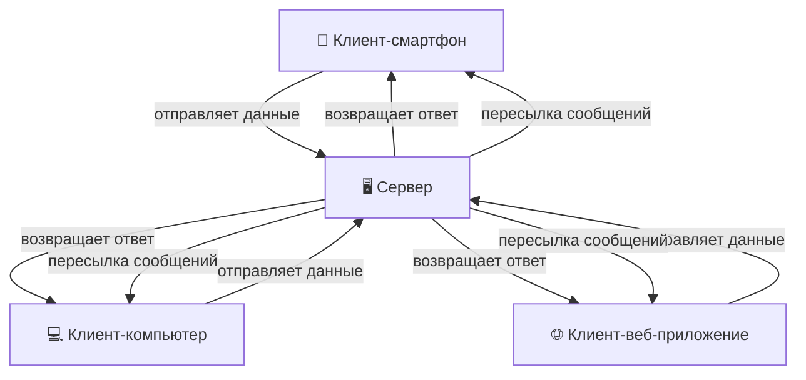

---
title: Архитектура взаимодействия мессенджеров
tags: [advanced, notrequired, engineer, developer, architector]
---

# Архитектура взаимодействия мессенджеров

<div class="article-tags">
  <span class="tag tag-inprogress">В РАЗРАБОТКЕ</span>
  <span class="tag tag-advanced">НЕ ДЛЯ НОВИЧКОВ</span>
  <span class="tag tag-notrequired">НЕ ОБЯЗАТЕЛЬНО</span>
</div>
<span class="complexity-badge">Разработчику</span>
<span class="complexity-badge">Инженеру</span>

## Архитектура взаимодействия мессенджеров

### Основные компоненты системы

Современный мессенджер представляет собой распределённую систему с несколькими ключевыми узлами. Основными компонентами являются клиентское приложение и серверная инфраструктура.

**Клиент** — это программа, установленная на устройстве пользователя. Клиентское приложение работает на мобильном телефоне, компьютере или веб-браузере. Пользователь взаимодействует непосредственно с этим приложением.

Это, например, приложение Telegram на ПК, или мобильном телефоне.

**Сервер** — это удалённая система, которая обрабатывает данные от множества клиентов одновременно. Сервер хранит информацию, пересылает сообщения между участниками и управляет подключением пользователей к системе.



Типы архитектурных схем передачи данных различаются по способу маршрутизации сообщений.

**Client-сервер-клиент** — центральная модель, где все сообщения проходят через сервер. Оба участника отправляют данные в центральный узел, и сервер сам доставляет их получателю.

**Peer-to-peer** — прямая передача без промежуточного сервера. Участники соединяются друг с другом напрямую, минуя централизованную инфраструктуру.

**Гибридная модель** — сочетание обоих подходов. Соединение может проходить через сервер для инициализации, затем происходит прямой обмен данными.

---

### Сравнение архитектурных моделей

| Характеристика | Client-сервер-клиент | Peer-to-peer | Гибрид |
|----------------|---------------------|--------------|--------|
| Контроль со стороны сервиса | Полный | Минимальный | Частичный |
| Доступность 24/7 | Высокая | Зависит от устройств | Высокая |
| Задержка передачи | Средняя | Низкая | Средняя |
| Масштабируемость | Отличная | Ограниченная | Хорошая |
| Простота реализации | Базовая | Высокая | Сложная |

Классические модели работы мессенджеров используют одну из трёх указанных конфигураций. Каждая схема имеет свои преимущества и особенности технической реализации.

---

## Типы мессенджеров и их характеристики

### Классификация по передаче данных

Мессенджеры разделяют на категории исходя из того, как они обрабатывают контент при передаче. Это деление определяет уровень конфиденциальности переписки.

**Открытый текст** — сообщения передаются без какой-либо защиты. Все участники транзакции видят полный текст переписки. Такие сообщения могут перехватиться сетевые администраторы, провайдеры или злоумышленники.

**Зашифрованный сервером** — содержание защищают шифром до попадания на сервер. Сервер получает зашифрованные данные, которые не поддаются чтению без специальных ключей.

**Сквозное шифрование** — защита применяется до выхода из клиента и снимается только после получения получателем. Сервер никогда не обладает информацией о содержании сообщений.

---

### История развития шифрования в индустрии

Многие популярные платформы начали внедрять защиту переписки в разные периоды своего существования. Эта информация позволяет понять эволюцию подхода к безопасности коммуникаций.

**WhatsApp** — внедрил сквозное шифрование во всех чатах начиная с 2016 года. До этого момента переписка могла быть доступна администраторам платформы.

**Telegram** — представил секретные чаты со сквозным шифрованием с 2014 года. Обычные диалоги остаются на сервере без дополнительной защиты.

**Signal** — реализовал полноценное сквозное шифрование с момента создания в 2010 году. Платформа считается одним из самых безопасных решений на рынке.

**SMS сообщения** — передаются через операторов связи в открытом виде. Нет встроенной защиты на уровне протокола передачи.

**RCS сообщения Apple, Google, Microsoft** — корпоративные решения могут использовать различные уровни защиты в зависимости от настроек пользователя и версии приложения.

<div class="callout callout--tip">
<div class="callout-title">Важно запомнить</div>
Наличие или отсутствие шифрования зависит исключительно от политик компании-разработчика и технических возможностей платформы.
</div>

---

## Механизмы шифрования

### Что такое шифрование

**Шифрование** — это процесс преобразования информации в недоступный для посторонних взгляд вид. Открытый текст становится закрытым содержимым, которое нельзя прочитать без специального инструмента разделения.

Процесс начинается на стороне отправителя. Приложение применяет алгоритм шифрования к сообщению. В результате получается блок символов, который выглядит как случайный набор знаков.

При получении сообщение проходит обратный процесс. Получатель использует свой инструмент для восстановления исходного текста. Ключ является обязательным условием успешного завершения операции.

---

### Роли ключей в системе

**Ключ шифрования** — секретная информация, которая используется для трансформации данных. Без знания ключа расшифровать содержимое невозможно.

**Закрытый ключ** — хранится только у владельца устройства. Никто другой не должен иметь доступ к этому значению. Утечка закрытого ключа компрометирует всю переписку.

**Открытый ключ** — доступен всем пользователям. Он нужен для шифрования сообщений перед отправкой. Даже если открытый ключ знают другие люди, это не позволяет им читать переписку.

Пример работы ключей в коде:

```python
def encrypt_message(text, public_key):
    """
    Код демонстрирует базовую логику шифрования.
    public_key — открытая часть пары ключей.
    text — исходное сообщение пользователя.
    """
    encrypted = apply_encryption_algorithm(text, public_key)
    return encrypted

def decrypt_message(encrypted_text, private_key):
    """
    Код демонстрирует базовую логику расшифровки.
    private_key — закрытая часть пары ключей.
    encrypted_text — полученный зашифрованный блок.
    """
    decrypted = apply_decryption_algorithm(encrypted_text, private_key)
    return decrypted
```

В этом примере:
- `public_key` — открытая часть криптографической пары;
- `private_key` — закрытая часть криптографической пары;
- `apply_encryption_algorithm()` — функция трансформации данных в шифр;
- `apply_decryption_algorithm()` — функция восстановления исходного текста.

---

### Как обеспечивается приватность

Приватность достигается за счёт нескольких уровней защиты. Каждый слой добавляет свою степень сложности для возможных злоумышленников.

Первый слой защищает данные при передаче по сети. Туннельное соединение предотвращает перехват пакета при путешествии между устройствами.

Второй слой скрывает содержимое от сервера. Если сервер не владеет ключом, то он физически не может прочитать сообщение. Хранятся только зашифрованные блоки.

Третий слой защищает данные на устройствах участников. Достижения шифрования дисков и приложений предотвращают доступ третьих лиц к локальным файлам.

<div class="callout callout--warning">
<div class="callout-title">⚠️ Предупреждение</div>
Защита не работает полностью, если само устройство заражено вредоносным программным обеспечением. Клавиатурные шпионы могут фиксировать нажатия клавиш до момента шифрования.
</div>

---

## Сквозное шифрование (End-to-End Encryption)

### Определение и принципы

**Сквозное шифрование** — метод защиты данных, при котором только участники общения обладают возможностью прочтения сообщений. Промежуточные узлы сети и серверы получают только зашифрованную версию.

Этот подход обеспечивает максимальный уровень конфиденциальности. Никакое лицо или организация не может получить доступ к содержимому без ведома пользователей.

Принципы работы включают несколько этапов. Инициация соединения требует обмена открытыми ключами. Формирование сообщений происходит на устройстве отправителя. Передача выполняется через сеть. Получение и чтение производятся получателем.

---

### Преимущества сквозного шифрования

Пользователи получают гарантию сохранения тайны личной переписки. Сервисные компании не имеют технической возможности прочитать содержимое. Государственные органы требуют специальные процедуры для доступа к данным.

Система защищает от утечек базы данных серверов. Если база будет взломана, то украденные файлы окажутся бесполезными без ключей.

Коммуникации становятся безопасными даже в публичных сетях Wi-Fi. Кафе, отели или аэропорт не предоставляют защиту, но сквозное шифрование компенсирует этот недостаток.

---

### Сравнение различных подходов

| Параметр | Без шифрования | Серверное шифрование | Сквозное шифрование |
|----------|---------------|----------------------|-------------------|
| Видимость сервером | Полная | Отсутствует | Отсутствует |
| Возможность чтения госорганами | Да | По запросу | Крайне сложно |
| Уязвимость при взломе сервера | Высокая | Средняя | Низкая |
| Производительность | Максимальная | Средняя | Средняя |
| Совместимость | Высокая | Высокая | Требует поддержки |

Сравнительная таблица показывает основные различия между подходами. Выбор технологии зависит от требований к безопасности и доступности.

<details>
<summary>
<b>Некоторые детали реализации...</b>
</summary>
В сквозном шифровании каждый участник генерирует уникальную пару ключей. Открытый ключ передаётся всем контактам. Закрытый остаётся на устройстве. При первом сообщении происходит проверка идентичности получателя. Последующие сообщения используют одноразовые сеансовые ключи. Сеансовый ключ шифруется открытым ключом получателя. Это обеспечивает дополнительную защиту при перехвате сетевого трафика.
</details>

---

## Почему сервер видит иероглифы вместо текста

### Что видит сервер в разных случаях

Когда пользователь отправляет сообщение, сервер получает данные независимо от наличия защиты. Различие заключается лишь в форме представления содержимого.

**Открытое состояние** — сервер получает читаемый текст сразу после поступления из клиента. Администраторы могут посмотреть историю переписки через панель управления.

**Зашифрованное состояние** — сервер получает бессмысленный набор символов. Для просмотра потребуется ключ дешифрации, которого нет у владельцев инфраструктуры.

**Настройка уровня доступа** — некоторые платформы позволяют выборочно включать или отключать функцию сохранения истории. Пользователь получает контроль над собственной перепиской.

---

### Методы проверки состояния

Существуют способы проверить работу защиты переписки. Некоторые приложения показывают особые индикаторы при активном шифровании.

Цветовой код в интерфейсе сигнализирует об уровне безопасности. Зелёная метка означает наличие сквозной защиты. Красная или серая метка указывает на её отсутствие.

Технические тесты помогают подтвердить корректность настройки. Можно отправить сообщение самому себе через два разных устройства и проверить результат.

> **💡 Совет**
> Всегда проверяйте настройку конфиденциальности перед обсуждением важных тем. Регулярно обновляйте настройки в новых версиях приложения.

---

## Вспомогательные элементы

### Алгоритмы шифрования

Для обеспечения безопасности применяют специализированные математические алгоритмы. Они обеспечивают сложность процесса взлома и скорость обработки данных.

Алгоритм AES обеспечивает симметричное шифрование с различными длинами ключей. Длинные ключи требуют больше времени для перебора вариантов.

Алгоритм RSA обеспечивает асимметричное шифрование с разделением открытых и закрытых ключей. Ключи математически связаны, но вычислительно сложно восстановить один по другому.

```javascript
// Пример базовой структуры алгоритма шифрования
class EncryptionAlgorithm {
    constructor(keyLength) {
        this.keyLength = keyLength;
    }
    
    encrypt(Данные, key) {
        // Логика применения алгоритма
        return transformData(Данные, key);
    }
    
    decrypt(ciphertext, key) {
        // Обратная логика трансформации
        return reverseTransform(ciphertext, key);
    }
}
```

В этом примере:
- `keyLength` — длина криптографического ключа в битах;
- `encrypt()` — метод шифрования входных данных;
- `decrypt()` — метод восстановления исходного содержимого;
- `transformData()` — функция прямого преобразования;
- `reverseTransform()` — функция обратного преобразования.

---

### Протоколы передачи данных

Передача защищённых сообщений требует использования соответствующих протоколов. Стандартные механизмы обмена не всегда поддерживают необходимый уровень безопасности.

Протокол HTTPS предоставляет транспортный уровень защиты при движении пакетов. Этот протокол работает на основе TLS и шифрует всё соединение целиком.

Протокол Signal обеспечивает применение сквозного шифрования поверх транспортных механизмов. Система работает поверх любого транспортного протокола, обеспечивая защиту содержания.

---

### Хранение ключей на устройствах

Ключи шифрования должны храниться в безопасной части оборудования. Использование системного хранилища ключей повышает уровень защиты от несанкционированного доступа.

Использование аппаратных модулей безопасности позволяет изолировать ключи от основного процессора. Специальные чипы выполняют криптографические операции внутри себя.

Копирование ключей на резервные носители создаёт дополнительные точки уязвимости. Резервное копирование может привести к потере конфиденциальности при компрометации носителя.

<div class="callout callout--info">
<div class="callout-title">💡 Информация</div>
Разработчики платформ иногда создают специальные инструменты экспорта ключей для восстановления доступа. Эти функции могут стать причиной потери приватности при неправильном использовании.
</div>

---

## Могу ли я прочитать чужую переписку

### Технические ограничения доступа

С технической точки зрения чтение чужой переписки требует обладания соответствующими инструментами доступа. Без ключа невозможно дешифровать содержимое даже при наличии физического доступа к серверу.

Злоумышленники могут применять методы социальной инженерии для получения ключей. Поддельные уведомления или фишинговые страницы пытаются убедить пользователей раскрыть информацию.

Методы перехвата сетевого трафика бесполезны при применении сквозного шифрования. Зашифрованные пакеты не содержат полезной информации для анализаторов.

---

### Юридические аспекты

Государственные органы запрашивают доступ к переписке через официальные процедуры. Компании отвечают такими запросами только по решению суда.

Без судебного постановления компания не имеет права предоставлять доступ к зашифрованным данным. Даже при наличии такого документа сервер может не содержать нужную информацию.

Международные компании соблюдают законы страны регистрации. Персональные данные пользователей находятся под юрисдикцией конкретных правовых систем.

---

### Меры предосторожности

Пользователи должны понимать риски при использовании мессенджеров. Настройки конфиденциальности влияют на доступность данных для третьих лиц.

Проверка контактов помогает убедиться в легитимности собеседника. Неизвестные люди могут представлять угрозу для приватности личного общения.

Обновление приложений обеспечивает получение последних исправлений безопасности. Устаревшие версии могут иметь известные уязвимости в алгоритмах защиты.

---