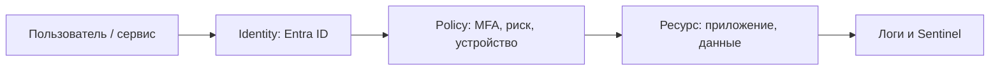

# Zero Trust и облачная безопасность

  ОБЯЗАТЕЛЬНО

Разработчику
Архитектору

**Zero Trust** («нулевое доверие») — модель безопасности: **ни одному пользователю и устройству не доверяют по умолчанию**, даже внутри корпоративной сети. Каждый запрос к ресурсу проверяется: кто вы, с какого устройства, в каком контексте, с каким риском.

Классическая «крепость» (периметр VPN + внутри всё свои) ломается при облаке, удалёнке и компрометации учётки. Zero Trust совпадает с [моделью ответственности в облаке](/encyclopedia/8-infra-security/8-01-oblachnye-tehnologii/12).

---

## Три столпа (Microsoft и индустрия)

| Столп | Суть | Примеры контролей |
|-------|------|-------------------|
| **Проверять явно** | Аутентификация + авторизация на каждый доступ | MFA, conditional access, OAuth scope |
| **Минимальные привилегии** | Только нужные права, время-ограниченные | RBAC, JIT admin, separation of duties |
| **Предполагать компрометацию** | Сегментация, мониторинг, быстрая изоляция | Micro-segmentation, SIEM, отзыв сессий |

---

## Identity-centric security

В облаке **граница — идентичность**, не IP офиса. Центр — каталог пользователей и сервисов ([Microsoft Entra ID](/encyclopedia/2-system-network/2-06-sistemnoe-administrirovanie/62), аналоги: Okta, Keycloak).

Практики:

- **MFA** обязательна для админов и удалённого доступа.
- **Conditional Access** — блок входа с анонимного IP, устаревшей ОС, без compliant device.
- **Сервисные учётки** — managed identity вместо паролей в конфиге.

Разработчик обязан понимать: токен в API — это **доверенный носитель прав**; утечка JWT = утечка доступа до истечения TTL.

---

## Защита данных и приложений

- **Шифрование**: in transit (TLS 1.2+), at rest (диски, БД).
- **Секреты** — Key Vault / аналоги, не в git.
- **Defender** класс продуктов — EDR на хостах, облачная защита workload; детали вендора вторичны после принципа «видимость + реагирование».

**Microsoft Sentinel** — SIEM/SOAR в облаке: сбор логов, корреляция, playbooks. Для малой команды достаточно централизованных логов и алертов; Sentinel — для зрелого SOC.

---

## Соответствие требованиям (compliance)

GDPR, 152-ФЗ, отраслевые стандарты задают **хранение, согласие, аудит**. Zero Trust не заменяет юристов, но даёт **аудит trail** (кто к чему обращался).

Экзамен **SC-900** проверяет словарь: Defender, Purview, Entra, политики — см. [сертификации](/encyclopedia/1-basics/1-26-karera-v-it-i-mify/12).

---

## Практика

Схема Learn: [Security, compliance, identity fundamentals](https://learn.microsoft.com/ru-ru/training/paths/describe-security-privacy-compliance-capabilities/).

Перед ней: [8.07 — введение в ИБ](/encyclopedia/8-infra-security/8-07-informatsionnaya-bezopasnost/intro), [сеть](/encyclopedia/2-system-network/2-03-set-i-internet/intro).

[Навигатор Learn](/tools/documentation/6).

---

## Итоги

Zero Trust — не продукт, а **архитектурный подход**: проверять каждый доступ, резать привилегии, мониторить как при уже случившемся взломе. В Microsoft-стеке это Entra + Defender + Sentinel; идеи переносимы на любой облачный вендор.

---
