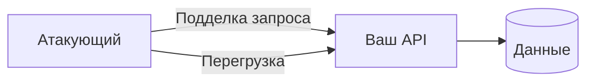

# Уязвимости и атаки на API

<div class="article-tags">
  <span class="tag tag-required">ОБЯЗАТЕЛЬНО</span>
  <span class="tag tag-beginner">ДЛЯ НОВИЧКОВ</span>
</div>

<span class="complexity-badge">Разработчику</span>
<span class="complexity-badge">Архитектору</span>

Публичный API — **граница доверия**. Ошибки авторизации и валидации здесь дороже, чем в UI: скрипты бьют тысячи запросов в минуту.

<div class="callout callout--tip">
  <div class="callout-title">Чек-лист профилактики</div>

  <div class="callout-body">
  Двенадцать практик «с чего начать» — HTTPS, OAuth, rate limit, gateway, валидация и др. — собраны в <a href="/encyclopedia/2-system-network/2-09-osnovy-integratsionnogo-vzaimodeystviya/132">12 советов по безопасности API</a>. Ниже в этой статье — каталог угроз и разбор типичных промахов.
  </div>
</div>

Общая база: [безопасность приложений](./113.md), [интеграционная авторизация](/encyclopedia/2-system-network/2-09-osnovy-integratsionnogo-vzaimodeystviya/1121).

---

## Модель угроз (кратко)



Защита строится на: **аутентификация**, **авторизация на каждый ресурс**, **валидация входа**, **лимиты**, **наблюдаемость**.

---

## Каталог угроз

| Угроза | Суть | Пример | Митигация |
|--------|------|--------|-----------|
| **Broken Access Control / IDOR** | Доступ к чужому объекту по ID; [права из query](/encyclopedia/2-system-network/2-08-osnovy-informatsionnoy-bezopasnosti/120) | `GET /orders/999` чужого заказа; `GET /admin/users?isAdmin=true` | Проверка владельца и роли на сервере, не только "есть JWT" |
| **SQL / NoSQL / Command injection** | Враждебный ввод в запрос | `' OR 1=1--`, blind `SLEEP` | [Типы SQLi](/encyclopedia/8-infra-security/8-07-informatsionnaya-bezopasnost/123#sql-injection-tautology); параметры, ORM |
| **Mass assignment** | Клиент прислал лишние поля | `{"role":"admin"}` в профиле | DTO, явный allow-list полей |
| **Open Redirect** | `?next=http://evil` | Фишинг с вашим доменом | Whitelist URL редиректа |
| **SSRF** | Сервер дергает внутренний URL | `url=http://169.254.169.254` | Блок private IP, исходящий proxy |
| **XSS** (через API → HTML) | Неэкранированные данные в письме/админке | Чаще Stored; возможны Reflected и DOM-based | Экранирование, CSP; см. [три типа XSS](/encyclopedia/8-infra-security/8-07-informatsionnaya-bezopasnost/113#tri-tipa-xss) |
| **CSRF** | Браузер шлёт cookie без ведома | POST с чужого сайта; [смена пароля без re-auth](/encyclopedia/2-system-network/2-08-osnovy-informatsionnoy-bezopasnosti/119#csrf) | SameSite, anti-CSRF token |
| **Brute force** | Перебор паролей / OTP | Тысячи `/login` | Rate limit, captcha, lockout |
| **DoS / HTTP flood** | Исчерпание воркеров | Медленные POST | Rate limit, WAF, body size cap |
| **Slowloris / slow POST** | Держит соединения открытыми | Медленная отправка тела | Таймауты на прокси |
| **Zip bomb** | Маленький архив → гигабайты | Распаковка без лимита | Лимит размера, streaming scan |
| **Logic bomb** | Злоупотребление бизнес-правилом | Бесконечные бонусы | Инварианты, аудит, лимиты |
| **MITM** | Подслушивание канала | Публичный Wi‑Fi | TLS везде, HSTS |
| **Утечка в ответе** | Stack trace, внутренние ID | 500 с SQL в теле | Единый error handler |

---

## IDOR — разбор типичного промаха

```http
GET /api/v1/documents/550e8400-e29b-41d4-a716-446655440000
Authorization: Bearer <valid_user_A>
```

Сервер возвращает документ, если UUID существует, **не проверяя**, что документ принадлежит user A.

**Правильно:** `SELECT … WHERE id = @id AND owner_id = @currentUser`.

Тест: два пользователя, два объекта — ни один не читает чужой ID.

---

## Rate limiting

| Уровень | Где |
|---------|-----|
| Глобальный | API Gateway, Nginx `limit_req` |
| По пользователю | Middleware + Redis counter |
| По операции | Строже на `/login`, `/reset-password` |

Ответ при превышении: **`429 Too Many Requests`** + по возможности **`Retry-After`** и `X-RateLimit-*`. Поток login → refresh → logout с rate limit на входе — [аутентификация](/encyclopedia/2-system-network/2-08-osnovy-informatsionnoy-bezopasnosti/111#bezopasnyy-potok-vhoda).

**Token bucket** — когда допустим кратковременный burst (мобильное приложение, пачка параллельных GET). **Leaky bucket** или очередь с фиксированной скоростью обработки — когда нужно защитить БД или внешний API от волны одновременных запросов. **Sliding window** (журнал или счётчик) — когда важна точность лимита «за последние N секунд» без провала на стыке минутных окон.

Разбор всех пяти алгоритмов (fixed window, sliding window log/counter, token bucket, leaky bucket) — [§10 «12 концепций»](/encyclopedia/7-project/7-06-proektirovanie-i-arhitektura/141#10-rate-limiting). Реализация счётчика в Redis — [ZSET + Lua](/encyclopedia/3-data-markup/3-06-nosql/5#rate-limiter-sliding-window-log).

---

## Заголовки и hardening

Минимальный набор для HTTP API за прокси:

- `Strict-Transport-Security`
- ограничение `Content-Type` на входе
- не отдавать лишние заголовки (`Server`, внутренние версии)

Для браузерных клиентов — [CORS](/encyclopedia/2-system-network/2-09-osnovy-integratsionnogo-vzaimodeystviya/117) и [CSP](./113.md) на фронте.

---

## Процесс в команде

1. **Threat modeling** на новый endpoint (STRIDE-lite достаточно).
2. **Security-тесты** в CI: известные IDOR/SQLi кейсы на staging.
3. **Пентест** перед крупным релизом публичного API.
4. Реагирование: блок токена, откат, post-mortem ([наблюдаемость](/encyclopedia/1-basics/1-23-frontend-i-bekend/9)).

---

## Связанные темы

- [12 советов по безопасности API](/encyclopedia/2-system-network/2-09-osnovy-integratsionnogo-vzaimodeystviya/132) — профилактика и чек-лист для ревью
- [Zero Trust](./121.md)
- [Проектирование API](/encyclopedia/7-project/7-06-proektirovanie-i-arhitektura/design/117)
- [Компетенции бэкенда](/encyclopedia/1-basics/1-23-frontend-i-bekend/4)

---

{/* http-basics-link  */}
<div class="callout callout--tip">
  <div class="callout-title">Основа по протоколу</div>

  <div class="callout-body">
  Базовый разбор HTTP и HTTPS находится в отдельной статье — [HTTP как основа веб-интеграций](/encyclopedia/2-system-network/2-09-osnovy-integratsionnogo-vzaimodeystviya/118).
</div>
  </div>


---

## Дополнение — практический минимум API hardening

### Контроль доступа

- Проверять права на уровне бизнес-объекта, а не только валидность токена.
- Разделять роли чтения и изменения данных.
- Ограничивать scope токенов под конкретные операции.

---

### Безопасность запросов и ответов

- Жёстко валидировать входные схемы.
- Ограничивать размер тела запроса и глубину JSON.
- Возвращать безопасные ошибки без внутренних деталей.

---

### Наблюдаемость

- Логировать неуспешные попытки доступа и аномальные паттерны.
- Выделять отдельные алерты для brute force и скачков 4xx/5xx.
- Хранить correlation-id для трассировки цепочки запросов.

---

### Связанные статьи

- [Инъекции](/encyclopedia/8-infra-security/8-07-informatsionnaya-bezopasnost/123)
- [Zero Trust и облачная безопасность](/encyclopedia/8-infra-security/8-07-informatsionnaya-bezopasnost/121)
- [Аудит](/encyclopedia/8-infra-security/8-07-informatsionnaya-bezopasnost/124)
