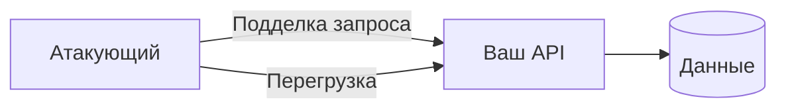

# Уязвимости и атаки на API

<div class="article-tags">
  <span class="tag tag-required">ОБЯЗАТЕЛЬНО</span>
  <span class="tag tag-beginner">ДЛЯ НОВИЧКОВ</span>
</div>

<span class="complexity-badge">Разработчику</span>
<span class="complexity-badge">Архитектору</span>

Публичный API — **граница доверия**. Ошибки авторизации и валидации здесь дороже, чем в UI: скрипты бьют тысячи запросов в минуту.

Общая база: [безопасность приложений](./113.md), [интеграционная авторизация](/encyclopedia/2-system-network/2-09-osnovy-integratsionnogo-vzaimodeystviya/1121).

---

## Модель угроз (кратко)



Защита строится на: **аутентификация**, **авторизация на каждый ресурс**, **валидация входа**, **лимиты**, **наблюдаемость**.

---

## Каталог угроз

| Угроза | Суть | Пример | Митигация |
|--------|------|--------|-----------|
| **Broken Access Control / IDOR** | Доступ к чужому объекту по ID | `GET /orders/999` чужого заказа | Проверка владельца в сервисе, не только «есть JWT» |
| **SQL / NoSQL / Command injection** | Враждебный ввод в запрос | `' OR 1=1--` | Параметризованные запросы, ORM, whitelist |
| **Mass assignment** | Клиент прислал лишние поля | `{"role":"admin"}` в профиле | DTO, явный allow-list полей |
| **Open Redirect** | `?next=http://evil` | Фишинг с вашим доменом | Whitelist URL редиректа |
| **SSRF** | Сервер дергает внутренний URL | `url=http://169.254.169.254` | Блок private IP, исходящий proxy |
| **XSS** (через API → HTML) | Неэкранированные данные в письме/админке | Stored XSS | Экранирование, CSP |
| **CSRF** | Браузер шлёт cookie без ведома | POST с чужого сайта | SameSite, anti-CSRF token |
| **Brute force** | Перебор паролей / OTP | Тысячи `/login` | Rate limit, captcha, lockout |
| **DoS / HTTP flood** | Исчерпание воркеров | Медленные POST | Rate limit, WAF, body size cap |
| **Slowloris / slow POST** | Держит соединения открытыми | Медленная отправка тела | Таймауты на прокси |
| **Zip bomb** | Маленький архив → гигабайты | Распаковка без лимита | Лимит размера, streaming scan |
| **Logic bomb** | Злоупотребление бизнес-правилом | Бесконечные бонусы | Инварианты, аудит, лимиты |
| **MITM** | Подслушивание канала | Публичный Wi‑Fi | TLS везде, HSTS |
| **Утечка в ответе** | Stack trace, внутренние ID | 500 с SQL в теле | Единый error handler |

---

## IDOR — разбор типичного промаха

```http
GET /api/v1/documents/550e8400-e29b-41d4-a716-446655440000
Authorization: Bearer <valid_user_A>
```

Сервер возвращает документ, если UUID существует, **не проверяя**, что документ принадлежит user A.

**Правильно:** `SELECT … WHERE id = @id AND owner_id = @currentUser`.

Тест: два пользователя, два объекта — ни один не читает чужой ID.

---

## Rate limiting

| Уровень | Где |
|---------|-----|
| Глобальный | API Gateway, Nginx `limit_req` |
| По пользователю | Middleware + Redis counter |
| По операции | Строже на `/login`, `/reset-password` |

Алгоритмы: token bucket, sliding window. Ответ: `429 Too Many Requests` + заголовок `Retry-After`.

---

## Заголовки и hardening

Минимальный набор для HTTP API за прокси:

- `Strict-Transport-Security`
- ограничение `Content-Type` на входе
- не отдавать лишние заголовки (`Server`, внутренние версии)

Для браузерных клиентов — [CORS](/encyclopedia/2-system-network/2-09-osnovy-integratsionnogo-vzaimodeystviya/117) и [CSP](./113.md) на фронте.

---

## Процесс в команде

1. **Threat modeling** на новый endpoint (STRIDE-lite достаточно).
2. **Security-тесты** в CI: известные IDOR/SQLi кейсы на staging.
3. **Пентест** перед крупным релизом публичного API.
4. Реагирование: блок токена, откат, post-mortem ([наблюдаемость](/encyclopedia/1-basics/1-23-frontend-i-bekend/9)).

---

## Связанные темы

- [Zero Trust](./121.md)
- [Проектирование API](/encyclopedia/7-project/7-06-proektirovanie-i-arhitektura/design/117)
- [Компетенции бэкенда](/encyclopedia/1-basics/1-23-frontend-i-bekend/4)

---
